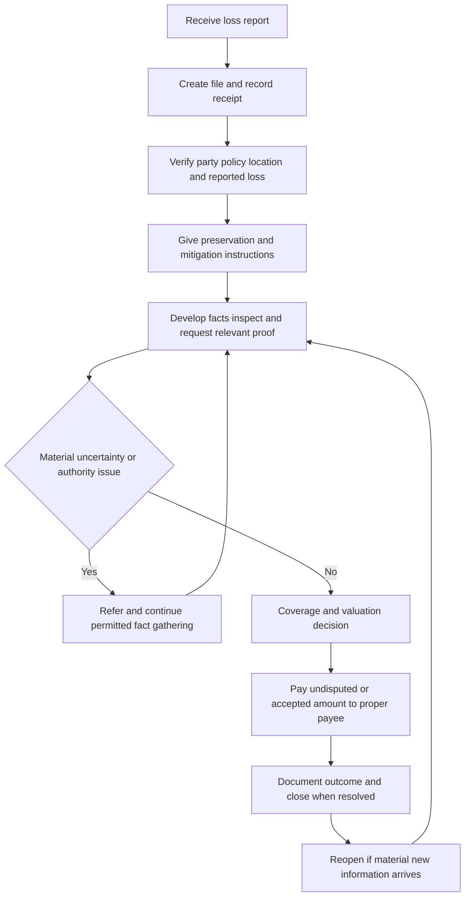

## Scope and controlling sources

This page is a handling framework, not a coverage position. **Internal guidance** describes how to develop, document, calendar, and refer a file. The applicable policy, declarations, endorsements, and law govern the actual coverage, duties, remedies, payees, and deadlines. An endorsement controls a conflicting policy provision within its stated scope; it does not itself broaden coverage except as it says. [FL HO 01 09, T.0](repo://forms/HO/FL/HO-01-09/2023-07.md#L13-L35) [TX HO 01 45, T.0](repo://forms/HO/TX/HO-01-45/2022-01.md#L13-L57)

In particular, do not convert a condition or an investigation limitation into an automatic coverage outcome. The current MS HO-3 says that failure to comply with a post-loss duty “may affect coverage where the failure causes prejudice to us”; the HO-6 uses the same prejudice standard for relevant duties. The applicable form, edition, endorsements, facts, and law must be checked before asserting a consequence. [MS HO-3 2024, AGR.6](repo://forms/HO/MS/HO-3/2024-03.md#L23-L34) [MS HO-6, S.80](repo://forms/HO/MS/HO-6/2023-02.md#L1000-L1003)

For water-loss-specific cause and scope development, see [Water Loss Investigation and Handling](/openwiki/claims-guidance/water-loss-investigation-and-handling.md). Roof and water-coverage analysis belongs with [Roof Settlement](/openwiki/coverages/coverage-a/roof-settlement.md) and [Water Damage and Water Backup](/openwiki/coverages/coverage-a/water-damage-and-water-backup.md), not in an intake script. State-specific work should also be checked against the Florida and Texas overlays identified in the page assignment.

## Claim lifecycle and file invariant

*Internal guidance: a claim moves from notice through fact development, an authorized decision, payment or documented resolution, and may return to investigation when material information arrives.*

The operational invariant is a contemporaneous file that makes the chain from notice to outcome reviewable: what was reported, what was requested and received, what was observed, the policy terms considered, the authority/referral path, communications, decision rationale, payment activity, and any recovery lead. Texas prompt-payment requirements expressly require a claim file upon notice, the receipt date, and preservation of material handling information; material communications, requests, decisions, and payments must be retained in a form that permits review. [TX Bulletin B-2019-02, B.2](repo://bulletins/TX/b-2019-02-prompt-payment.md#L53-L59) [TX Bulletin B-2019-02, B.2](repo://bulletins/TX/b-2019-02-prompt-payment.md#L109-L129)

### 1. Intake and triage — internal guidance

1. Open a distinct file on a report that may involve covered property, mitigation, or a coverage issue. Capture the received date/time and channel; reporter and authority to act; named insured and contact preferences; policy and loss location; alleged date/time and discovery date; reported source, affected property, emergency actions, injuries, other interested parties, and immediate evidence risks. Do not characterize the report as covered merely because a file exists.
2. Confirm the active policy, applicable form edition, declarations, and every potentially applicable endorsement before discussing limits, deductible, or status. Record what was verified and what remains unknown. Intake establishes a reported loss; it does not establish a covered cause, amount, or entitlement.
3. Acknowledge the report, identify the assigned contact and next steps, and make focused written requests for information that is reasonably necessary. Confirm representative authority before disclosing claim information. Document material oral contacts as well as written contacts.
4. Calendar every applicable notice, decision, proof-of-loss, payment, suit, appraisal, and internal-escalation date from the receipt or request event actually stated in the governing source. Use a deadline record with source, trigger, due date, completion date, and evidence of delivery—not a generic countdown.

Texas standards require reasonable submission methods, receipt-date records, acknowledgment within 15 days, and a specific request for reasonably necessary information. They also require clear, accurate, confidential claim notices and documentation of material oral communications. Those are carrier requirements, not insured duties. [TX Bulletin B-2019-02, B.3](repo://bulletins/TX/b-2019-02-prompt-payment.md#L151-L193) [TX Bulletin B-2019-02, B.4](repo://bulletins/TX/b-2019-02-prompt-payment.md#L217-L229)

### 2. Preservation, mitigation, and inspection — internal guidance

Give prompt, conditional instructions to protect property and preserve proof: take reasonable emergency measures; retain receipts and mitigation records; photograph before disturbance when safe; retain failed parts and accessible damaged materials; identify any removal, repair, demolition, sale, or transfer; and provide reasonable access for inspection. Avoid directing permanent repair or discarding material evidence before the file has a reasonable opportunity to document it, except where health, safety, or preventing further damage requires action. Record the reason for any exception and preserve substitute evidence.

The policy duties supporting this practice vary by form. For example, the MS HO-3 requires prompt notice, reasonable protection and protective repairs, expense records, preservation where reasonably possible, inspection/access, requested records, EUO, and sworn proof within 90 days after request. [MS HO-3 2024, S.4-S.19](repo://forms/HO/MS/HO-3/2024-03.md#L809-L839) The MS HO-6 requires prompt notice, protection, temporary repairs, inspection/access, requested documents, and a signed sworn proof within 60 days after request. [MS HO-6, S.4-S.18](repo://forms/HO/MS/HO-6/2023-02.md#L850-L878) The cited schedules are not interchangeable.

An inspection, information request, or investigation is fact development—not acceptance. The MS HO-3 expressly preserves the carrier's rights and defenses while it investigates; the Florida and Texas endorsements similarly say investigation does not waive rights or constitute an admission. [MS HO-3 2024, S.78](repo://forms/HO/MS/HO-3/2024-03.md#L955-L961) [FL HO 01 09, T.5.49](repo://forms/HO/FL/HO-01-09/2023-07.md#L497-L503) [TX HO 01 45, T.7.7-T.7.9](repo://forms/HO/TX/HO-01-45/2022-01.md#L613-L620)

### 3. Causation, scope, and proof — internal guidance

Develop a testable loss narrative: source and pathway; timing, duration, discovery, and mitigation; affected components and contents; condition before the reported event; prior damage, repairs, claims, and maintenance; and possible third-party involvement. Compare the account with physical observations, photographs, invoices, estimates, repair history, moisture or other testing, and qualified reports. Separate emergency protection, failed component, direct resulting damage, pre-existing deterioration, unrelated renovation, and claimed consequential items in both notes and estimates.

For a water loss, a sudden discharge, a backup, outside water, repeated leakage, and a roof or maintenance pathway are different hypotheses. The water-handling guide directs staff to identify the source and pathway, preserve failed components, distinguish the failed component from ensuing damage, and refer gradual leakage, exterior water, backup, or unresolved cause rather than presume an outcome. This is **internal guidance**; applicable coverage and exclusion language controls. [Water Loss Handling Guidance, H.1](repo://guidelines/claims/water-loss-handling.md#L61-L97) [Water Loss Handling Guidance, H.1](repo://guidelines/claims/water-loss-handling.md#L105-L149)

If facts remain uncertain, state the uncertainty precisely: for example, “source not confirmed,” “damage age cannot yet be allocated,” or “scope conflicts with inspection.” Request the missing material or obtain appropriate specialist review. Do not label a condition fraud merely from an inconsistency. The guide calls for clarification and special-investigation referral for suspected misrepresentation, altered invoices, staged damage, or intentional-loss indicators, while prohibiting an unsupported fraud characterization. [Water Loss Handling Guidance, H.6](repo://guidelines/claims/water-loss-handling.md#L527-L539) [Water Loss Handling Guidance, H.6](repo://guidelines/claims/water-loss-handling.md#L565-L573)

### 4. Insured duties and proof requests — contractual layer

Tailor the request to the policy and material issue. Depending on the controlling form, it may include access and inspection, records and authorizations, a damaged-property inventory and ownership/value support, statements or EUO, proof of loss, other-insurance information, prior repair/maintenance records, and preservation of recovery rights. Make the request specific, relevant, and explainable; record the request, delivery, response, follow-up, and any limitation on availability.

The 2018 MS HO-3 illustrates why conditions cannot be reduced to a checklist: it makes cooperation, preservation, prompt notice, records, inspection, EUO, proof, and recovery protection duties, but says noncompliance “may affect coverage to the extent permitted by law.” Its sworn proof period is 60 days after request. [MS HO-3 2018, S.2-S.14](repo://forms/HO/MS/HO-3/2018-09.md#L917-L957) [MS HO-3 2018, S.27-S.32](repo://forms/HO/MS/HO-3/2018-09.md#L967-L977) The current MS HO-3 instead specifies 90 days after request for signed sworn proof. [MS HO-3 2024, S.13-S.16](repo://forms/HO/MS/HO-3/2024-03.md#L827-L833)

A request, a late response, altered evidence, or an incomplete proof should therefore create a documented issue for fact and policy review—not a shortcut to denial. Apply the exact controlling wording, including any materiality, prejudice, reasonableness, or law qualifier.

## Coverage decision, authority, and referral

### Coverage decision — internal guidance

Before issuing a final decision, link each material conclusion to (1) evidence, (2) the controlling policy provision and edition/endorsement, and (3) the resulting payment or nonpayment calculation. A reservation of rights should identify known facts, the policy issue, and the further investigation needed without misstating the policy or representing the claim as finally resolved. Texas standards require a reasonable investigation before denial, a documented material basis, and a clear explanation of a denial or limitation; a partial acceptance/rejection must distinguish the portions. [TX Bulletin B-2019-02, B.1-B.2](repo://bulletins/TX/b-2019-02-prompt-payment.md#L29-L35) [TX Bulletin B-2019-02, B.2](repo://bulletins/TX/b-2019-02-prompt-payment.md#L69-L97) [TX Bulletin B-2019-02, B.3](repo://bulletins/TX/b-2019-02-prompt-payment.md#L163-L179)

Do not make a final coverage representation while a material causation, condition, valuation, entitlement, or endorsement issue is unresolved. Continue permitted fact gathering during referral and keep the claimant informed about what remains necessary. A later material fact can require reconsideration or reopening; record why the file's position changed. [TX Bulletin B-2019-02, B.2](repo://bulletins/TX/b-2019-02-prompt-payment.md#L115-L129)

### Authority and referral — internal guidance

Internal authority is a control on who may commit the carrier; it does not modify the contract. Confirm delegated authority before approving payment, settlement, a release, nonemergency work, or a final coverage communication. Expense authority, reserve authority, and indemnity/settlement authority are distinct. Fact gathering and reasonable emergency mitigation may continue within authority, but emergency authorization is not acceptance of the full claim. [Water Loss Handling Guidance, H.7](repo://guidelines/claims/water-loss-handling.md#L591-L617) [Water Loss Handling Guidance, H.7](repo://guidelines/claims/water-loss-handling.md#L671-L685)

Refer promptly—and document the issue, material facts, requested decision, recipient, and resulting direction—when:

- anticipated exposure exceeds authority, including a water loss claimed, incurred, or reasonably anticipated above $25,000;
- source, duration, allocation of old/new damage, exclusion, limitation, endorsement, scope, matching, or payee entitlement remains material and unresolved;
- competing estimates, unusual mitigation, hidden/structural damage, contamination or mold, restricted access, shared property, another insurer, or an outside responsible party changes the analysis;
- a represented claimant, litigation threat, appraisal, regulatory inquiry, fraud indicator, altered document, duplicate invoice, or unusual release/compromise creates heightened legal, special-investigation, or communication risk.

These are **internal guidance** triggers. The water guide requires early referral for the $25,000 threshold and for unresolved causation, recurring damage, conflicts in evidence, other-party responsibility, suspicious billing, access problems, contamination, or gradual damage. [Water Loss Handling Guidance, H.5](repo://guidelines/claims/water-loss-handling.md#L411-L475) Its authority section separately calls for referral on disputed coverage/cause, estimate conflicts, representation/litigation, recovery, fraud, and overlapping interests. [Water Loss Handling Guidance, H.7](repo://guidelines/claims/water-loss-handling.md#L623-L683) The referral matrix likewise treats unclear authority as a reason to refer, requires adequate facts and preservation of material communications, and forbids treating silence as approval. [Referral and Authority Matrix, H.0](repo://guidelines/authority/referral-matrix.md#L15-L55)

## Payment, settlement, and recovery

### Payment workflow — internal guidance

1. Determine coverage and the supported scope first. Then apply the policy's valuation method, limits/sublimits, deductible, depreciation or replacement-cost conditions, other-insurance allocation, salvage, and any lawful offset.
2. Do not withhold an undisputed amount because another separable item remains disputed. Identify the payment purpose, covered component, calculation, deductions/limitations, payee(s), and the issue that remains open. Ensure payment is capable of reaching the entitled recipient; resolve returned, rejected, or missing payment information promptly.
3. Confirm mortgagee, lienholder, ownership, representative, repair-direction, and other legal-interest information before release. Payment may need to be joint or directed to an interested party under the policy; never infer ownership resolution from a payment record alone.
4. Document the authority approval, basis, disbursement date/method, payee, and remaining recoverable or disputed items. A release must be appropriate to the claim/payment; route unusual releases for authority review.

The contractual payment mechanics differ among forms. Under the current MS HO-3, payable loss follows agreement, final judgment, or filing of an appraisal award, and the covered amount is paid within 60 days after the applicable event; payment may go to an insured, mortgagee, or another lawful interest holder. The same form permits appraisal of amount/ACV but says appraisal does not decide coverage, interpretation, or compliance. [MS HO-3 2024, S.35-S.47](repo://forms/HO/MS/HO-3/2024-03.md#L871-L895) The HO-6 permits cash, repair, replacement, or another permitted method; it also permits payment to persons with a legal interest and distinguishes appraisal of amount from coverage. [MS HO-6, S.39-S.53](repo://forms/HO/MS/HO-6/2023-02.md#L991-L1019)

Texas prompt-payment standards separately require payment of an accepted claim within five business days after acceptance, payment to the entitled person, and processing of an undisputed amount without conditioning it on a disputed amount. [TX Bulletin B-2019-02, B.4](repo://bulletins/TX/b-2019-02-prompt-payment.md#L231-L247) They require the carrier to remain responsible when claim functions are delegated to vendors or representatives. [TX Bulletin B-2019-02, B.1](repo://bulletins/TX/b-2019-02-prompt-payment.md#L15-L29) [TX Bulletin B-2019-02, B.4](repo://bulletins/TX/b-2019-02-prompt-payment.md#L249-L255)

### State and form timing: calendar the controlling trigger

The following is a source map, not a rule that one source overrides another. Validate jurisdiction, policy edition, endorsement applicability, and law, then calendar the controlling deadline.

| Source | Acknowledge | Decision | Payment | Other timing |
| --- | --- | --- | --- | --- |
| Florida HO 01 09 (2023-07) | 14 days after receipt | accept/reject within 85 business days after receiving requested items | accepted claim within 20 business days | suit provision states five years after loss |
| Texas HO 01 45 (2022-01) | 15 days after notice | accept/reject within 10 business days after all requested items | accepted claim within 5 business days after acceptance notice | suit provision states two years after cause of action accrues |
| Texas Bulletin B-2019-02 | 15 days after receipt | accept/reject within 15 business days after all reasonably requested items | accepted claim within 5 business days after acceptance | retain dated, reviewable file |

[FL HO 01 09, T.5](repo://forms/HO/FL/HO-01-09/2023-07.md#L403-L503) [FL HO 01 09, T.7](repo://forms/HO/FL/HO-01-09/2023-07.md#L571-L611) [TX HO 01 45, T.5](repo://forms/HO/TX/HO-01-45/2022-01.md#L391-L407) [TX HO 01 45, T.7](repo://forms/HO/TX/HO-01-45/2022-01.md#L601-L653) [TX Bulletin B-2019-02, B.4](repo://bulletins/TX/b-2019-02-prompt-payment.md#L217-L255)

The different Texas decision periods are an escalation trigger, not an invitation to select a convenient one. Preserve the policy and bulletin analysis in the file and obtain compliance/legal direction before communicating or acting if the applicable timing requirement is uncertain.

### Recovery and closure — internal guidance

At intake and throughout investigation, identify possible recovery or contribution sources: failed product or plumbing component, contractor or mitigation work, utility/municipal event, landlord/tenant/association responsibility, or other insurance. Preserve failed parts, photographs, repair/maintenance records, invoices, custody/location history, responsible-party identity and contact information, notices, and any payment or settlement communication. Do not authorize a release or make a statement that impairs recovery without the required authority.

The contractual layer can require the insured to preserve recovery rights and cooperate after payment. The current MS HO-3 says an insured must not impair the carrier's recovery right and, after payment, must execute documents and take reasonably necessary actions to secure it. [MS HO-3 2024, S.27-S.28](repo://forms/HO/MS/HO-3/2024-03.md#L855-L857) The Texas endorsement likewise requires preservation and cooperation in recovery after payment. [TX HO 01 45, T.5.52-T.5.53](repo://forms/HO/TX/HO-01-45/2022-01.md#L493-L497)

Close only when the coverage decision, payment status, material communications, outstanding requests, referral direction, and recovery posture are recorded. Closure does not erase the obligation to reopen when credible material information requires further handling; document the reason for reopening and resume the appropriate fact-development step. [Water Loss Handling Guidance, H.6](repo://guidelines/claims/water-loss-handling.md#L565-L587) [TX Bulletin B-2019-02, B.2](repo://bulletins/TX/b-2019-02-prompt-payment.md#L121-L129)

## Focused quality checks

Before closure or a material decision, use these tests:

- **Source test:** Does the file identify the controlling form edition, declarations, endorsements, jurisdiction, and the exact condition or deadline—not a generic template?
- **Evidence test:** Can each cause, scope, valuation, condition, and payee conclusion be traced to preserved evidence, with contrary evidence and unresolved facts recorded?
- **Conditionality test:** Does the communication preserve qualifiers such as reasonable, material, prejudice, applicable law, and “to the extent” rather than asserting an automatic result?
- **Timing test:** Is each deadline tied to the documented trigger and does the calendar reflect every later request, receipt, decision, payment, and notice?
- **Authority test:** Were emergency expense, reserve, investigation, coverage, settlement, release, and recovery decisions kept within separate delegated authorities and referred when required?
- **Communication test:** Are requests specific and relevant; are notices clear about status, decision, payment, material deductions, and what remains open; and are representative authority and confidentiality documented?
- **Recovery test:** Before payment, repair, disposal, or release, has the file preserved evidence and identified potential responsible parties or other insurance?
