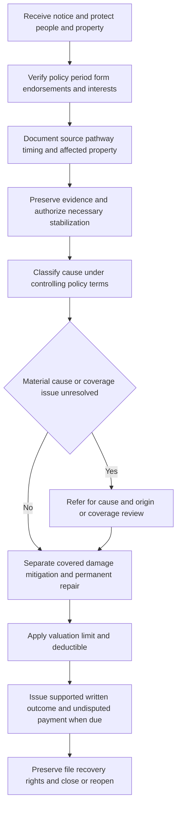

# Claims Guidance — Water-Loss Investigation and Handling

Use this page to organize a water-loss file from first notice through disposition. It is **noncontractual operational guidance**, not a coverage grant, limitation, waiver, or substitute for the policy. The policy in force on the date of loss, its declarations, and attached endorsements control. In particular, an endorsement controls where it changes the policy; do not use a general water-loss guide, a vendor label, or a prior claim outcome to decide coverage.

The essential discipline is to keep these questions separate:

1. **Source and pathway:** Where did the water originate, and how did it reach each damaged item?
2. **Cause:** What caused the source to release, reverse, overflow, or enter the structure?
3. **Damage and timing:** What direct physical damage resulted during the policy period, as distinct from pre-existing or later damage?
4. **Coverage and amount:** Which controlling grant, exclusion, condition, limit, deductible, and valuation provision applies?

Water in a basement, water near a drain, or a contractor calling an event a “backup” answers none of these questions by itself.

## Handling sequence

*The claim flow keeps emergency protection moving while source, causation, coverage, and valuation are resolved independently.*

### 1. Triage without deciding coverage

Acknowledge the report, identify the handler, verify the named insured, loss location, policy status, applicable form edition, declarations, endorsements, mortgagee or other property interests, and any representative’s authority. Record the reported discovery date, event date or date range, current active-water or safety condition, and all known affected rooms and property.

Give practical, conditional instructions: stop an active safe-to-stop flow, protect people and unaffected property, and arrange reasonable extraction, drying, and stabilization where needed. Explain that investigation, inspection, mitigation authorization, or a payment for an undisputed item does not by itself accept the entire claim. The 2027 HO 04 90 expressly says that investigation does not confirm coverage; the applicable policy may contain the same reservation.

If facts may limit or preclude coverage but require further investigation, communicate the open issue and the needed facts through the authorized reservation-of-rights process. Do not promise an outcome or characterize a source as covered before the form and facts are confirmed.

### 2. Build a source-to-damage record

Obtain the insured’s account before it is overwritten by cleanup activity, then inspect or arrange inspection promptly when it can answer a material question. Document both what supports and what contradicts the reported account.

Capture, as applicable:

- the first location water was observed; its apparent route, depth, direction, odor, debris, and sanitation indicators;
- the outlet or entry point: supply pipe, drain, sewer, cleanout, fixture, appliance, sump pit, sump pump, discharge line, foundation, roof/wall opening, or exterior path;
- the initiating mechanism: accidental break or overflow, clog or reverse flow, pump discharge/overflow, power or mechanical failure, precipitation/runoff, groundwater, or an unresolved combination;
- weather, utility, municipal, plumber, restoration-vendor, association, landlord/tenant, and neighbor information that bears on source or responsibility;
- photographs and video before demolition, extraction, or permanent repair; moisture readings and a room-by-room diagram; and
- affected building materials and personal property, their condition, and evidence of prior staining, decay, repairs, repeated moisture, or unrelated deterioration.

Preserve the failed component, plumbing or drain material removed, pump/float/valve, and relevant packaging or serial information when reasonably possible. Obtain itemized work orders, invoices, drain-clearing or plumbing reports, moisture logs, estimates, receipts, and witness statements. Preserve the original digital evidence and document dates, author, and location for later review.

The record should be capable of answering: **What source caused this particular damage, through what pathway, and why is that conclusion more likely than other explanations?** If it cannot, record the uncertainty rather than converting a damage location into a cause finding.

## Cause classification and coverage entry points

Read the complete applicable form and any state endorsement. The following are investigation entry points, not universal coverage determinations.

| Reported mechanism | What must be established | Controlling-language examples | Handling direction |
| --- | --- | --- | --- |
| Sudden plumbing or appliance discharge | Accidental escape from the identified plumbing, heating, air-conditioning, fire-protective-sprinkler, or household-appliance system; direct damage; and any form-specific conditions | HO-3 2018 states: “We do cover sudden and accidental direct physical loss caused by water or steam that escapes from” the listed systems. | Preserve the failed part and distinguish it from ensuing damage. Test whether a repeated or long-term condition is present. |
| Repeated seepage or leakage | Duration, repetition, source, prior indicators, and damage allocation | HO-3 2018 excludes “continuous or repeated seepage or leakage of water or steam” occurring over time. | Do not call a loss sudden merely because it was discovered suddenly. Refer if timing or allocation is material and unresolved. |
| Sewer or drain backup | Water actually backed up through a qualifying sewer or drain and directly caused damage | HO 04 90 (2027-01) defines Water Backup as “water that backs up through a sewer or drain” and states that water’s presence does not by itself establish that mechanism. | Locate and document the emergence point and pathway. A lower-level location, standing water, or a vendor’s term “backup” is insufficient. |
| Sump discharge or overflow | Water discharged or overflowed from the covered equipment on the residence premises, and the accidental mechanism | HO 04 90 (2027-01) defines it as water that “discharges or overflows from a sump, sump pump, or related equipment.” | Preserve the equipment condition and operating history; separately analyze a failed pump and resulting damage. |
| Flood, surface water, groundwater, exterior intrusion, or precipitation | The exterior source and its path into the building | The 2027 endorsement says: “We do not cover loss caused by flood” and excludes surface water that “has not backed up through a sewer or drain” and subsurface water that seeps, leaks, flows, or presses through a building. | Do not relabel exterior water as backup. Refer mixed-source facts, uncertain pathways, or potential concurrent-cause issues. |

Base forms can exclude backup while providing a different grant for accidental plumbing discharge. For example, the HO-3 2024 form excludes water backing up through sewers, drains, or sump systems unless a water-backup endorsement is attached, while separately addressing accidental discharge from listed internal systems. The HO-6 form is a distinct form with its own named-peril and exclusion structure. Identify the actual form before borrowing language from another product.

### Water-backup endorsements: version and scope matter

Confirm attachment, effective date, declarations limit, deductible, and all applicable conditions before treating the loss as water-backup coverage.

- **HO 04 90 (2010-10)** remains relevant for policies written under that edition, but is superseded for policies effective on or after **2027-01-01**. It has a $5,000 all-covered-loss limit and a $500 water-backup endorsement deductible.
- **HO 04 90 (2027-01)** has a $10,000 limit and a $1,000 water-backup deductible. The limit includes covered direct loss and covered expenses and is not a separate limit for each damaged item.
- Under the 2027 edition, coverage is for direct physical loss caused by the defined backup or sump event. It excludes, among other things, flood, non-qualifying surface water, groundwater intrusion, and repair or replacement of equipment solely because it failed, wore out, corroded, deteriorated, or became defective. The form also excludes the future-loss-prevention cost to correct, redesign, upgrade, improve, or replace a sewer, drain, discharge line, or sump system.

Do not state a universal backwater-valve rule. The 2010 endorsement says a valve is not required for finished below-grade areas, while the 2027 endorsement requires one for those areas and requires it to be operable. The internal water-loss guide contains a conflicting operational statement. Resolve the issue against the version attached to the policy and refer it when the applicable form, facts, or compliance impact cannot be determined.

## Mitigation is not permanent repair

Authorize and evaluate reasonable emergency work by its purpose and connection to the reported event. Extraction, drying, cleaning, containment, temporary protection, and work necessary to prevent further direct physical loss may be mitigation. A permanent reconstruction, system replacement, design correction, code upgrade, betterment, or remediation of a pre-existing condition is a separate coverage and valuation question.

This distinction is explicit in the 2027 endorsement: an insured must not begin permanent repair before there has been a reasonable opportunity to inspect, **“unless immediate work is necessary to protect property,”** and must preserve evidence of the immediate condition. Its settlement provision separately says it will consider reasonable expenses incurred **“solely to protect covered property from further covered damage”** and will not pay for improvement, betterment, maintenance, or correction of a pre-loss condition.

For every invoice, identify the room, dates, work performed, equipment, labor, and reason for the work. Test necessity and reasonableness against the documented source, water category, affected materials, and the policy. Separate line items for:

- emergency stabilization and drying;
- investigation and cause-and-origin work;
- demolition or access necessary for covered damage;
- repair of direct physical damage;
- repair/replacement of the failed source component; and
- upgrades, preventative work, code work, and pre-existing or unrelated repairs.

Do not require permanent repair before a reasonable inspection opportunity, except where immediate work is necessary for safety or to prevent further loss. Conversely, do not treat authorization of mitigation as authorization of permanent reconstruction or as an admission of coverage.

## Fungi, wet rot, bacteria, and contamination

Treat a reported microbial condition as a separate branch of the investigation, even when it follows a water event. Identify the water event and its timing, material moisture history, pre-existing condition, any delay or recurring intrusion, visible conditions, sampling/remediation scope, and the exact fungi endorsement or aggregate that applies.

The base HO-3 2024 and HO-6 2023 forms exclude fungi, wet rot, dry rot, or bacteria except as provided by a limited fungi endorsement; the HO-6 form also excludes costs exceeding the applicable “fungi and bacteria aggregate.” The 2027 water-backup endorsement independently says it does not cover mold, fungus, wet rot, dry rot, bacteria, virus, or other microorganism even if it results from backup, discharge, or overflow. Do not assume that water-backup coverage supplies fungi coverage, or that a fungi aggregate creates coverage absent its own applicable grant.

Document sewage solids, odor, staining, suspected contamination, health concerns, and safety restrictions without making medical or microbial conclusions outside the evidence. Refer claims with contamination, health/safety conditions, mold/fungi allegations, or a need for specialist inspection/remediation review.

## Valuation, payment, communications, and recovery

After establishing the applicable coverage, prepare a scope that allocates covered direct damage, excluded or unsupported damage, mitigation, and noncovered permanent work. Apply the applicable valuation method, sublimit/limit, and deductible only to covered amounts and explain the calculation. In the 2027 endorsement, the deductible is applied to the covered loss, and payments under the $10,000 water-backup limit reduce the remaining amount available.

Use the relevant form’s loss-settlement terms for ownership, actual cash value or replacement-cost requirements, like kind and quality, depreciation, repairability, and proof of incurred cost. A dispute about amount does not decide coverage. Issue an undisputed covered payment when required while a separable disputed item is investigated; payment does not waive the unresolved coverage issue.

A written limitation, partial denial, or denial must identify the material facts, quote the exact controlling policy language, explain its application, identify the deductible or limit if applied, and state information still needed or available review options. Do not use vague labels such as “water damage,” “maintenance,” or “backup” as the rationale.

For Illinois water-backup claims, the bulletin requires a reasonable investigation of the reported cause, claimed damage, and relevant policy provisions before resolving, limiting, or denying the claim. It also requires a written explanation identifying the relied-on language and its application to known facts. Illinois standards additionally require payment of an undisputed covered portion without waiting for a disputed portion unless policy terms or law bar payment. The bulletin’s $5,000 disclosure requirement concerns the disclosure framework; it does not replace the policy’s actually attached endorsement, limit, or deductible in a specific claim.

Identify recovery potential early where a product, contractor, plumber, utility, municipality, association, landlord/tenant, neighbor, or another insurer may be responsible. Preserve damaged components, records, photos, and contact information; do not authorize releases or make statements that impair recovery rights without authority. The forms require cooperation in preserving recovery rights.

## Referral, file lifecycle, and quality checks

Continue ordinary investigation and protective action within authority, but refer rather than speculate when a material question remains. The internal guide requires referral of a water loss with claimed, incurred, or reasonably anticipated total above $25,000; it also calls for early referral when the source cannot be identified after reasonable investigation. Referral does not transfer responsibility for file progress or turn an internal authority decision into a coverage promise.

Refer for appropriate claim, coverage, cause-and-origin, special-investigation, legal, valuation, recovery, or specialist review when any of the following is material:

- source/pathway cannot be established; competing sources or expert opinions could change coverage; or a backup allegation may instead be exterior water, plumbing discharge, groundwater, seepage, or another cause;
- long-term leakage, repeated backup/overflow, deterioration, corrosion, wear, construction/maintenance defect, prior water damage, or incomplete prior repairs prevent a supported allocation;
- a water-backup endorsement, its version, its limit/deductible, a backwater-valve condition, fungi terms, contamination, ordinance work, ownership, other insurance, or mortgagee/association responsibility is uncertain;
- a reserve, mitigation commitment, scope, settlement, release, or requested payment exceeds handling authority or the $25,000 guide threshold;
- fraud indicators, altered documents, duplicate invoices, staged damage, material inconsistencies, litigation, or a represented insured require escalation; or
- recovery against another party is plausible.

Before closure, verify that the file contains the policy and endorsement version used, declarations, source/pathway evidence, inspection and expert materials, chronology, photographs, mitigation and repair allocation, damage scope, coverage analysis, calculation, communications, payments, referrals, and recovery decision. Record open issues rather than closing around them. Reopen when credible new information can affect coverage, damages, payment, or recovery rights.

### Focused file-review tests

Use these checks before a material coverage communication, payment, or closure:

1. **Backup test:** Does the evidence establish actual reverse/backup through a sewer or drain, or qualifying sump discharge/overflow—not merely water in a low area?
2. **Alternative-source test:** Have exterior water, groundwater, precipitation, plumbing/appliance discharge, seepage, and prior moisture been investigated to the extent material?
3. **Edition test:** Are the policy form, endorsement version, attachment, effective date, declaration limit, and deductible verified from the claim record?
4. **Scope test:** Does every paid line item connect to documented covered direct damage or reasonable mitigation, without silently including failed equipment, maintenance, betterment, or future prevention?
5. **Fungi test:** Is fungi/contamination separately analyzed under the applicable grant, exclusion, endorsement, and aggregate rather than assumed to follow water coverage?
6. **Explanation test:** Would a reader be able to trace each coverage conclusion and payment calculation from the facts to the exact policy language?
7. **Referral and recovery test:** Are unresolved material issues escalated, and are potential responsible-party evidence and rights preserved?
