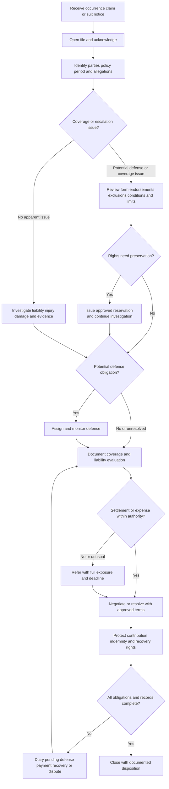

# Liability Claim Handling Guidance

## Scope and governing rule

This page is internal handling direction. It organizes claim work; it is not a coverage grant, exclusion, defense commitment, authority delegation, or policy amendment. Use it with the applicable declarations, homeowners form, endorsements, claim facts, and applicable law. The policy—not this page or a training shortcut—determines rights, duties, limits, conditions, exclusions, and coverage. [Liability guideline H.0.1–H.0.7](repo://guidelines/claims/liability-claim-handling.md#L13-L27) [Guidance versus contract language](repo://training/guidance-versus-contract.md#L15-L23)

Keep three things separate in every file and communication:

- **Fact:** what the insured, claimant, witness, record, inspection, or expert reports; mark what remains unverified.
- **Allegation:** what a claimant or pleading asserts, without adopting it as fact or fault.
- **Coverage position:** the reasoned application of the policy in force, endorsements, facts, and law.

Do not use underwriting appetite, a property deductible, a coinsurance threshold, a cash sublimit, or a binding-authority limit to decide liability coverage. Confirm the policy and claim authority instead. [Liability guideline H.0.8–H.0.12](repo://guidelines/claims/liability-claim-handling.md#L29-L37) [Claims manual 1.E–1.I](repo://manuals/claims/manual.md#L39-L67)

## End-to-end lifecycle

*Caption: The liability claim lifecycle from notice through coverage review, defense, authority-controlled resolution, recovery protection, and documented closure.*

The diagram is a control flow, not a promise that every claim follows the same branch. A reservation does not stop necessary investigation, and closure is not appropriate while a material defense, payment, recovery, reporting, or dispute task remains open. [Claims manual 2.X–2.AC](repo://manuals/claims/manual.md#L481-L503) [Liability claims handling H.6.36–H.6.38](repo://guidelines/claims/liability-claim-handling.md#L609-L615)

## 1. Intake and file control

Open a liability file when notice of an occurrence, offense, claim, or suit is received—even if the report is informal—and assign it to the appropriate handling queue. Record the source, receipt timestamp, reporting party, named insured, additional insureds, claimant, representative authority, occurrence date and location, alleged conduct, claimed bodily injury or property damage, and all unverified information. Confirm identity before disclosing claim information. [Liability claims handling H.6.1–H.6.5](repo://guidelines/claims/liability-claim-handling.md#L541-L549) [Claims manual 2.A–2.J](repo://manuals/claims/manual.md#L387-L427)

Obtain and preserve the demand, complaint, summons, notice, correspondence, service information, envelope or electronic transmission details, photographs, recordings, incident reports, contracts, invoices, repair information, and other supporting materials. Do not alter original evidence. If property may change, arrange inspection and ask for practical preservation while allowing safety and necessary emergency action. [Claims manual 8.D–8.J](repo://manuals/claims/manual.md#L2545-L2585) [Claims manual 8.O–8.P and 8.AK](repo://manuals/claims/manual.md#L2611-L2621) [Claims manual 2.O](repo://manuals/claims/manual.md#L441-L447)

### Timing controls

- **Acknowledgment:** The claims manual requires acknowledgment of claim receipt within 15 days and retention of the acknowledgment and delivery record. Apply the controlling jurisdictional standard if it is more specific or demanding, and escalate any risk of missing it. [Claims manual 12.1–12.5](repo://manuals/claims/manual.md#L3951-L3971)
- **Liability notice triage:** The liability chapter treats notice received within 30 days as timely and requires escalation of delayed notice when it may affect investigation. This is an internal handling screen, not a replacement for the policy’s prompt-notice condition. [Claims manual 8.A–8.G](repo://manuals/claims/manual.md#L2525-L2567)
- **Suit and demand deadlines:** Preserve service and transmission details at intake, identify every response date, hearing, mediation, or negotiation deadline, and escalate time-sensitive demands immediately. [Liability claims handling H.6.5](repo://guidelines/claims/liability-claim-handling.md#L547-L549) [Liability authority controls H.7.25–H.7.27](repo://guidelines/claims/liability-claim-handling.md#L667-L671)

Do not make a coverage, liability, payment, or defense promise in the acknowledgment. Explain the next handling step and the information needed. Use the claim file as the authoritative record; maintain a chronology and diary for pending actions, referrals, deadlines, and unresolved issues. [Claims manual 2.K–2.M](repo://manuals/claims/manual.md#L429-L439) [Claims manual 8.BS–8.BT](repo://manuals/claims/manual.md#L2947-L2957) [Claims manual 12.11–12.15](repo://manuals/claims/manual.md#L3993-L4010)

## 2. Coverage-question workflow

Before assigning counsel or making a coverage statement, retrieve the declarations and policy form in force on the alleged occurrence date, all endorsements, applicable definitions, limits, conditions, and any other insurance information. Identify each person seeking protection and analyze each insured separately where the form requires it. The policy record must match the claim file. [Liability claims handling H.6.3 and H.6.6–H.6.7](repo://guidelines/claims/liability-claim-handling.md#L545-L553) [Claims manual 1.E–1.G](repo://manuals/claims/manual.md#L39-L55)

For a Coverage E question, work through this sequence:

1. **Trigger:** Is there an occurrence within the policy period and applicable territory, and does it allegedly cause the kind of bodily injury or property damage described by the form?
2. **Insured and responsibility:** Is the person seeking protection an insured under the form or an endorsement, and does the alleged liability arise from conduct for which that insured is legally responsible?
3. **Grant and limits:** Do the allegations seek covered damages, and which Coverage E limit, additional coverage, or separate Coverage F limit could apply?
4. **Exclusions and endorsements:** Check the complete exclusions and every endorsement; do not stop at a favorable grant. Examine business, professional services, vehicle, watercraft, intentional conduct, property in care/custody/control, contractual liability, injury or damage categories, and any form-specific exclusion that the facts implicate.
5. **Conditions and other insurance:** Check notice, cooperation, legal papers, voluntary payments, recovery rights, fraud or misrepresentation, other insurance, and any applicable legal-action condition.
6. **Position:** State the known facts, policy wording, unresolved questions, and resulting coverage or defense position. If material facts or wording remain uncertain, refer rather than infer.

### Form-specific contract controls

The homeowners forms share a Coverage E structure, but they are not interchangeable. The applicable form and endorsements remain authoritative:

| Form | Contract anchor for the handling review |
|---|---|
| **HO-3 (2024-03)** | Coverage E pays damages for which an insured is legally liable because of bodily injury or property damage caused by an occurrence; it provides a defense at the insurer’s expense, permits investigation and settlement, and ends the defense duty when the applicable limit is exhausted. The form separately states prompt notice, forwarding of legal papers, cooperation, and no voluntary payment or assumed obligation without consent. [HO-3 Coverage E and duties](repo://forms/HO/MS/HO-3/2024-03.md#L1023-L1071) |
| **HO-4 (2021-10)** | Coverage E similarly addresses legally owed damages and an insurer-paid defense, but expressly states defense by counsel of the insurer’s choice and additional defense-related expenses. Its vehicle, watercraft, premises, business, and property exclusions contain form-specific exceptions and must be read as written. [HO-4 Coverage E](repo://forms/HO/MS/HO-4/2021-10.md#L1087-L1153) |
| **HO-6 (2023-02)** | Coverage E pays covered damages for which an insured is legally liable because of bodily injury or property damage caused by an occurrence and provides a defense against a covered suit. It has its own exclusion structure and separately treats additional coverages such as first aid, property of others, and loss assessment. [HO-6 Coverage E and exclusions](repo://forms/HO/MS/HO-6/2023-02.md#L1004-L1050) [HO-6 additional coverages](repo://forms/HO/MS/HO-6/2023-02.md#L1210-L1282) |

Do not generalize a result from one form to another. For example, a property-of-others, loss-assessment, watercraft, business, or premises issue can follow different wording and limits by form. Treat an endorsement as part of the applicable policy record and re-run the analysis when a new endorsement, insured, occurrence, allegation, or theory of liability appears.

### Coverage F and other liability-related coverages

Coverage F medical payments is distinct from Coverage E. The forms generally describe necessary medical expenses arising from bodily injury caused by an accident and do not make payment dependent on legal liability, but the eligible person, time period, exclusions, limits, and notice/cooperation duties differ by form. Analyze Coverage F independently rather than using it to admit Coverage E liability. [HO-3 Coverage F](repo://forms/HO/MS/HO-3/2024-03.md#L1073-L1113) [HO-4 Coverage F](repo://forms/HO/MS/HO-4/2021-10.md#L1155-L1195) [HO-6 Coverage F](repo://forms/HO/MS/HO-6/2023-02.md#L1052-L1106)

## 3. Reservation of rights and coverage communication

When information identifies a potential coverage defense, the liability guideline requires an approved reservation of rights within 15 days. The general claims manual separately states a 10-day reservation standard. Because those internal sources are not the insurance contract and do not state the same interval, do not silently choose between them: refer the discrepancy to the responsible coverage resource, apply the approved applicable standard, and document the reason, issue, delivery date, recipients, and authority. [Liability claims handling H.6.8](repo://guidelines/claims/liability-claim-handling.md#L551-L557) [Claims manual 2.X–2.Z](repo://manuals/claims/manual.md#L481-L491)

A reservation must identify the known facts and actual policy issue without vague, unsupported, or irrelevant language. It is not a denial, acceptance, or payment commitment. Continue necessary investigation and mitigation unless the coverage resource directs otherwise. Do not state that a claim is covered, excluded, or payable merely because an inspection, counsel assignment, vendor activity, or reservation has begun. [Claims manual 2.Z–2.AC](repo://manuals/claims/manual.md#L489-L503) [Liability claims handling H.6.9–H.6.10](repo://guidelines/claims/liability-claim-handling.md#L557-L559)

Route requests to explain a denial, limitation, or reservation to the coverage resource. Use plain language externally, distinguish facts from allegations, preserve privileged coverage analysis, and do not provide legal advice. [Liability claims handling H.6.13 and H.6.33](repo://guidelines/claims/liability-claim-handling.md#L563-L565) [Liability claims handling H.6.33](repo://guidelines/claims/liability-claim-handling.md#L603-L605) [Claims manual 8.AE–8.AF](repo://manuals/claims/manual.md#L2707-L2717)

## 4. Investigation and evidence

Obtain the insured’s account with open, neutral questions; identify witnesses; request photographs, video, messages, incident reports, contracts, invoices, repair records, medical information through the approved channel, and other material records. Inspect the occurrence location or damaged property when it will assist evaluation. Record the source of each material fact and differences among the insured’s, claimant’s, witness, expert, and physical accounts. [Liability claims handling H.6.14–H.6.16](repo://guidelines/claims/liability-claim-handling.md#L567-L571) [Claims manual 8.H–8.P](repo://manuals/claims/manual.md#L2569-L2621)

Evaluate the elements relevant to the alleged theory without converting a condition into fault: duty or responsibility, notice, control, breach or alleged conduct, occurrence, causation, injury or property damage, claimed loss of use or expenses, defenses, comparative responsibility, and damages. Separate claimed amounts from supported amounts. For serious injury, permanent impairment, emotional injury, abuse, molestation, harassment, or fatality allegations, restrict sensitive information and refer for coordinated review. [Claims manual 8.K–8.S](repo://manuals/claims/manual.md#L2587-L2639) [Claims manual 8.BC–8.BF](repo://manuals/claims/manual.md#L2851-L2867)

For premises, roof, water, construction, product, animal, vehicle, aircraft, watercraft, or professional-service allegations, identify the relevant location, condition, operation, control, equipment, work, product, and responsible parties. Do not treat age, a weather event, an estimate, an incident report, or a vendor conclusion as proof of negligence or coverage. Use qualified experts when the cause, scope, injury, or defense cannot be resolved with ordinary evidence. [Liability claims handling H.2.1–H.2.7](repo://guidelines/claims/liability-claim-handling.md#L175-L189) [Claims manual 8.Z, 8.AL–8.AN, and 8.BP](repo://manuals/claims/manual.md#L2677-L2681) [Claims manual 8.AL–8.AN](repo://manuals/claims/manual.md#L2743-L2765)

Identify other insurance, an employer, contractor, vendor, indemnitor, additional insured, property manager, manufacturer, or other potentially responsible party. Preserve contribution, indemnity, subrogation, and recovery evidence before accepting a release or settlement. Continue ordinary liability handling while recovery review proceeds unless directed otherwise. [Liability claims handling H.6.17–H.6.18](repo://guidelines/claims/liability-claim-handling.md#L573-L575) [Claims manual 8.AB and 8.CD–8.CE](repo://manuals/claims/manual.md#L2689-L2693) [manual recovery controls](repo://manuals/claims/manual.md#L3013-L3023)

When mitigation or emergency protection is necessary, distinguish reasonable protective action from permanent repair, demolition, cleanup, or an admission of fault. Preserve evidence before irreversible work when safe and practical, and do not authorize work beyond authority. [Liability claims handling H.6.30–H.6.32](repo://guidelines/claims/liability-claim-handling.md#L599-L603) [Claims manual 8.AT–8.AV](repo://manuals/claims/manual.md#L2797-L2813)

## 5. Defense handling

Coverage E in each reviewed homeowners form provides an insurer-paid defense against a covered claim or suit, permits investigation and settlement, and addresses when the defense duty ends; the exact wording, counsel language, expenses, and exclusions vary by form. A coverage review therefore precedes counsel assignment, but a final indemnity conclusion must not be used as a shortcut when allegations and known facts present a potential defense issue. [HO-3 Coverage E](repo://forms/HO/MS/HO-3/2024-03.md#L1023-L1035) [HO-4 Coverage E](repo://forms/HO/MS/HO-4/2021-10.md#L1087-L1101) [HO-6 Coverage E](repo://forms/HO/MS/HO-6/2023-02.md#L1004-L1018) [Liability claims handling H.6.11](repo://guidelines/claims/liability-claim-handling.md#L559-L563)

When the allegations potentially fall within the grant and no exclusion clearly eliminates the defense obligation, obtain the required authority and appoint defense counsel through the approved process. Give counsel the complaint or demand, service information, coverage correspondence, known facts, evidence, insured contacts, deadlines, and litigation instructions. Counsel should receive complete factual information but not privileged internal coverage analysis for disclosure to an adverse party. [Liability claims handling H.6.11–H.6.13](repo://guidelines/claims/liability-claim-handling.md#L561-L565) [Claims manual 8.CA–8.CC](repo://manuals/claims/manual.md#L2995-L3011)

Monitor pleadings, discovery, motions, expert work, depositions, mediation, trial preparation, counsel spending, reserve or exposure changes, and settlement posture. Obtain status reports without directing legal strategy. Reassess when facts, damages, venue, litigation strategy, coverage, or expected defense cost materially changes. [Liability claims handling H.6.25](repo://guidelines/claims/liability-claim-handling.md#L587-L589) [Liability authority controls H.7.22–H.7.24](repo://guidelines/claims/liability-claim-handling.md#L661-L665)

## 6. Authority, escalation, and settlement

Authority is an internal control, not coverage. Before an offer, demand acceptance, counsel or expert retention, claim expense, contribution statement, mediation position, release, or settlement, confirm the assigned authority. Evaluate total known exposure—indemnity, allocated expense, anticipated defense cost, contribution, and related obligations—not merely the claimant’s demand. Never split payments or expense approvals to evade referral. [Liability claims handling H.7.1–H.7.8](repo://guidelines/claims/liability-claim-handling.md#L619-L633)

Refer before commitment when any of the following applies:

- exposure may exceed authority, limits may be disputed, severe injury or excess exposure is possible, or the settlement changes another insurer’s contribution or recovery rights;
- the proposed agreement includes a nonstandard release, confidentiality, indemnity, consent, admission, future-performance, or other obligation;
- fraud, intentional misconduct, concealment, collusion, criminal conduct, or material misrepresentation is alleged;
- the matter involves fatality, serious or permanent injury, abuse, sensitive claimants, public allegations, governmental or regulatory involvement, employment, professional services, pollution or contamination, structural failure, products or completed work, weapons, aircraft, watercraft, vehicles, or complex contractual indemnity;
- counsel recommends a material change in cost, duration, defense strategy, or settlement posture; or
- a time-sensitive demand, hearing, mediation, negotiation, litigation deadline, complaint, threatened suit, or reputational concern requires coordinated response.

These are referral triggers, not automatic coverage conclusions. Continue ordinary fact gathering and communication after referral unless the receiving resource directs a different path. Record the issue, material facts for and against the insured, known coverage issues, offers and demands, deadline, requested decision, approval conditions, approving person, and implementation. [Liability claims handling H.7.9–H.7.20](repo://guidelines/claims/liability-claim-handling.md#L635-L657) [Claims manual 8.Q–8.Y](repo://manuals/claims/manual.md#L2623-L2675) [Claims manual 8.BV–8.BZ](repo://manuals/claims/manual.md#L2965-L2993)

Before payment or settlement, review the demand, allegations, damages, allocation between covered and uncovered exposure, release scope, payees, other insurance, and recovery effect. Obtain a complete release unless counsel approves another resolution method. Renew authority when material terms, exposure, parties, or release language changes. Do not represent that approval is assured before it is granted. [Liability claims handling H.6.20–H.6.24](repo://guidelines/claims/liability-claim-handling.md#L579-L587) [Liability authority controls H.7.13–H.7.15 and H.7.28–H.7.35](repo://guidelines/claims/liability-claim-handling.md#L643-L685)

Remind the insured not to voluntarily pay, assume an obligation, admit liability, incur expense, or settle without the consent required by the applicable form. The HO-3, HO-4, and HO-6 forms each contain materially similar controls, but the exceptions and surrounding conditions must be checked in the form in force. [HO-3 duties](repo://forms/HO/MS/HO-3/2024-03.md#L1065-L1071) [HO-4 duties](repo://forms/HO/MS/HO-4/2021-10.md#L1099-L1101) [HO-6 duties](repo://forms/HO/MS/HO-6/2023-02.md#L1012-L1018)

## 7. Closure and focused file checks

Do not close until defense, indemnity, expenses, payments, releases, recovery or contribution, reporting, coverage communications, and known disputes are resolved or formally transferred. Confirm the final disposition was communicated, approved payments were issued, and any remaining task has an owner and diary date. Reopen when credible material information arrives after closure. [Liability claims handling H.6.36–H.6.38](repo://guidelines/claims/liability-claim-handling.md#L609-L615) [Claims manual 8.CF–8.CH](repo://manuals/claims/manual.md#L3025-L3041) [Claims manual 12.70–12.80](repo://manuals/claims/manual.md#L4229-L4271)

The closing file should contain, as applicable:

- intake source, acknowledgment, policy and endorsement record, parties and representative authority;
- occurrence chronology, demand or pleading, service details, deadlines, coverage analysis, reservation or final position, and approval history;
- insured and claimant accounts, witness information, inspection and expert materials, photographs or recordings, medical or repair support, and material discrepancies;
- defense assignment and status reports, authority requests and conditions, demands, offers, settlement terms, complete release or counsel-approved alternative, payment ledger, and payee support;
- other-insurance, indemnity, contribution, subrogation, recovery, and release analysis; and
- closure rationale, final communication, unresolved-item disposition, and record-retention status.

Before final disposition, perform four focused checks: (1) **coverage:** policy form, endorsement, grant, exclusions, conditions, limits, and communication agree; (2) **defense:** counsel, deadlines, litigation status, and expenses are resolved; (3) **authority:** every material commitment has documented approval within scope; and (4) **recovery and records:** evidence, rights, releases, payments, chronology, and final rationale are preserved. These checks are operational controls, not additional policy conditions. [Claims manual 8.BS–8.BU](repo://manuals/claims/manual.md#L2947-L2963) [Claims manual 12.78–12.80](repo://manuals/claims/manual.md#L4261-L4271)

## Related guidance

- [Water Loss Handling](/openwiki/claims/guidelines/water-loss-handling.md) — property-side water intake, mitigation, causation, and payment handling.
- [Liability Specialty and Recovery](/openwiki/claims/manual/liability-specialty-and-recovery.md) — specialty liability, contribution, and recovery coordination.
- [Incidental Business and Personal Injury](/openwiki/coverage/liability/incidental-business-and-personal-injury.md) — coverage questions for business and personal-injury allegations.
- [Liability E–F](/openwiki/coverage/parts/liability-e-f.md) — liability and medical-payments coverage reference.
- [Liability Losses and Occupancy](/openwiki/underwriting/manual/liability-losses-and-occupancy.md) — underwriting context; do not substitute it for claim coverage analysis.
