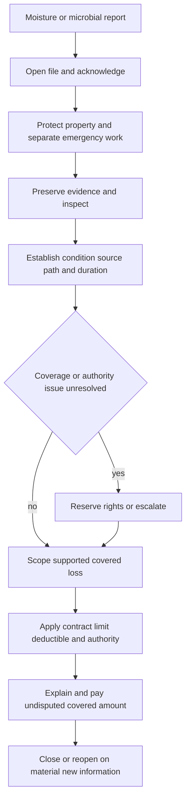

# Mold Claim Handling

## Status and governing boundary

This page is **internal claims-handling guidance**. It organizes intake, investigation, mitigation, evidence, scope, authority, communication, escalation, payment, and closure; it is not a coverage grant, exclusion, limit, waiver, endorsement, or policy interpretation. The issued policy, declarations, attached endorsements, applicable state forms, and applicable law control the coverage result. The claims manual likewise directs internal handling and authority and does not alter coverage ([training on guidance and contract language](repo://training/guidance-versus-contract.md#L13-L23), [claims manual, Chapter 1](repo://manuals/claims/manual.md#L13-L19), [HO-3 agreement](repo://forms/HO/MS/HO-3/2024-03.md#L13-L39)).

Use a vendor label, odor, stain, moisture reading, inspection, testing request, mitigation authorization, reserve, or payment as evidence or handling activity—not as a coverage conclusion. Before communicating a position, assemble the policy form and edition in force, declarations, attached fungi or water endorsements, state amendatory forms, deductible, limits, and relevant conditions. If guidance and contract language appear inconsistent, follow the contract and refer the conflict rather than creating a shortcut ([training](repo://training/guidance-versus-contract.md#L59-L83), [HO 04 81 scope and precedence](repo://forms/HO/MS/HO-04-81/2018-09.md#L13-L43)).

## Handling lifecycle

*This diagram shows the internal handling lifecycle; every coverage branch remains subject to the issued policy, endorsements, and applicable law.*

## 1. Intake, notice, and immediate protection

1. **Open the handling record.** Open a distinct mold or microbial-loss handling file when the report involves visible growth, odor, staining, moisture intrusion, concealed damage, or suspected fungi. Record the reporter, named insured, policy and location, affected property, discovery date, reported date of loss, known source, actions already taken, and facts that remain unverified. Acknowledge the report promptly and document the contact attempt ([internal mold guidance](repo://guidelines/claims/mold-claim-handling.md), [claims manual, intake](repo://manuals/claims/manual.md#L27-L49), [manual, Chapter 9](repo://manuals/claims/manual.md#L3043-L3061)).
2. **Set conditional expectations.** Explain the investigation, information needed, safety boundary, and next steps without promising payment or denial. State that inspection, mitigation, testing, or payment of an undisputed item does not decide the entire claim or waive policy terms ([claims manual](repo://manuals/claims/manual.md#L63-L73), [HO 04 81 nonwaiver provisions](repo://forms/HO/MS/HO-04-81/2018-09.md#L31-L39)).
3. **Give immediate protection direction.** Tell the insured to protect covered property from further damage and to take only reasonable, safe emergency measures. Do not direct unsafe work, permanent repair, or broad remediation while cause and coverage remain under review. Record the instruction, recipient, response, and work already performed ([internal guidance](repo://guidelines/claims/mold-claim-handling.md), [claims manual, mitigation authority](repo://manuals/claims/manual.md#L99-L103), [HO 04 81 duties](repo://forms/HO/MS/HO-04-81/2018-09.md#L79-L87)).
4. **Do not import a universal notice deadline.** Apply the notice and proof requirements of the issued contract. For example, HO 04 81 requires prompt notice of a fungi loss, while other forms and endorsements may use different wording ([HO 04 81 W.1](repo://forms/HO/MS/HO-04-81/2018-09.md#L79-L87), [HO 04 27 conditions](repo://forms/HO/MS/HO-04-27/2016-05.md#L321-L337)).
5. **Record the internal timing conflict.** The mold guideline directs reasonable mitigation to begin within **3 days after discovery** when prompt action is required. Claims Manual Chapter 9 instead directs explaining a **5-day-after-discovery** threshold. These are conflicting internal instructions, not policy conditions. Do not silently reconcile them or communicate either number as a contractual deadline; identify the applicable authority, escalate for direction when needed, and document the instruction used ([mold guideline](repo://guidelines/claims/mold-claim-handling.md), [manual, Chapter 3](repo://manuals/claims/manual.md#L709-L727), [manual, Chapter 9](repo://manuals/claims/manual.md#L3063-L3079)).

## 2. Establish condition, source, path, duration, and responsibility

A current mold label does not establish when or why the condition developed. Investigate the reported condition separately from the initiating water event and record reported facts separately from verified findings.

- **Identify the condition.** Determine whether the evidence concerns fungi or mold, wet rot, dry rot, bacteria, staining, odor, dampness, deterioration, or another substance. Do not classify solely from an insured’s, contractor’s, hygienist’s, or vendor’s label. Odor, occupant symptoms, and visible growth are not proof of covered property damage ([manual, Chapter 9](repo://manuals/claims/manual.md#L3051-L3061), [manual on odor](repo://manuals/claims/manual.md#L3153-L3157), [mold guidance](repo://guidelines/claims/mold-claim-handling.md)).
- **Trace the source and path.** Determine whether moisture came from plumbing or an appliance, roof or wall opening, drain, sewer, sump, surface water, groundwater, humidity, condensation, weather, construction, maintenance, or another source. Trace movement through finishes, cavities, floors, ceilings, and adjacent areas rather than assuming the wettest or most visible area is the origin ([manual, water-loss controls](repo://manuals/claims/manual.md#L717-L751), [manual, mold source analysis](repo://manuals/claims/manual.md#L3063-L3097)).
- **Establish duration and recurrence.** Compare discovery chronology, witness accounts, staining, swelling, corrosion, decay, moisture readings, ventilation, occupancy, prior leaks, repairs, maintenance, weather, and prior claims. Discovery is not necessarily onset. A prior loss or payment does not automatically establish or bar coverage for the current loss; investigate the current facts independently ([manual, prior claims](repo://manuals/claims/manual.md#L3105-L3109), [mold guidance](repo://guidelines/claims/mold-claim-handling.md)).
- **Connect cause to damage.** Allocate the failed source component, direct physical damage, fungi-related damage, preexisting or recurring damage, maintenance, deterioration, betterment, and unrelated work. Do not infer a covered cause from visible growth, water presence, odor, or a remediation recommendation ([manual, Chapter 9](repo://manuals/claims/manual.md#L3093-L3115), [manual, dwelling losses](repo://manuals/claims/manual.md#L5095-L5141)).
- **Identify interests and recovery.** Confirm whether the affected property belongs to the insured, tenant, landlord, association, lender, or another party. Preserve information about contractors, property managers, utilities, construction defects, maintenance failures, or other potentially responsible parties ([manual, Chapter 9](repo://manuals/claims/manual.md#L3207-L3217), [manual, recovery controls](repo://manuals/claims/manual.md#L183-L193)).

## 3. Evidence and inspection controls

Preserve evidence that can answer cause, duration, scope, value, coverage, and recovery questions. The file should contain, as relevant:

- the notice, chronology, statements, discovery information, occupancy, maintenance and repair history, prior-loss comparison, and access limitations;
- photographs or recordings before, during, and after mitigation, including the source, moisture path, affected and representative unaffected areas;
- failed pipes, hoses, valves, appliances, pumps, removed materials, samples, moisture readings, inspection findings, environmental reports, and laboratory or expert materials;
- mitigation logs, drying records, containment information, estimates, itemized invoices, receipts, contracts, repair scopes, disposal records, and proof of payment; and
- ownership, value, mortgagee or lienholder, other-insurance, responsible-party, and recovery information when material.

Request only information material to the claim decision. Preserve samples and removed materials when they may establish source, extent, or duration. Do not authorize disposal, irreversible demolition, or permanent repair before a reasonable inspection opportunity unless immediate removal is necessary to protect people or property; when emergency work prevents inspection, obtain photographs and records of the prior condition ([manual, evidence preservation](repo://manuals/claims/manual.md#L75-L103), [manual, Chapter 9](repo://manuals/claims/manual.md#L3079-L3085), [manual, photographs and field observations](repo://manuals/claims/manual.md#L3253-L3271), [HO 04 81 evidence duties](repo://forms/HO/MS/HO-04-81/2018-09.md#L79-L87)).

Inspect accessible affected areas promptly. Use qualified experts when source, extent, contamination condition, concealed damage, or repair method cannot be determined reliably from inspection and records. Define the question and assignment scope, review the report against photographs, records, physical findings, and the reported facts, and seek clarification when the opinion is unsupported or outside scope ([manual, Chapter 9](repo://manuals/claims/manual.md#L3135-L3145)).

Testing is not automatically required merely because mold is alleged. Distinguish testing needed for a material coverage or damage question from testing for health, regulatory, restoration, or unrelated purposes. Do not approve testing solely to establish presence when the result will not affect claim handling; document why testing was requested, declined, or relied upon ([manual](repo://manuals/claims/manual.md#L3147-L3151), [internal authority guidance](repo://guidelines/claims/mold-claim-handling.md)). Do not provide medical, environmental, engineering, construction, or legal advice unless authorized and qualified; refer health, illness, contamination, habitability, and bodily-injury allegations ([manual, Chapter 9](repo://manuals/claims/manual.md#L3219-L3241), [mold authority boundaries](repo://guidelines/claims/mold-claim-handling.md)).

## 4. Mitigation, remediation, and scope separation

Authorize and evaluate work by category, not by a single vendor invoice:

1. **Emergency protection:** stopping active intrusion, extraction, drying, temporary containment, safe access, and other reasonable measures to prevent additional direct physical damage.
2. **Investigation:** inspection, limited access, sampling, moisture measurement, and testing that address a material cause, scope, or coverage question.
3. **Fungi work:** removal, containment, cleaning, treatment, disposal, remediation, tear-out, repair, replacement, restoration, and qualifying post-remediation testing.
4. **Permanent repair:** reconstruction and source repair, including the failed component, building envelope, plumbing, drainage, ventilation, or other cause.
5. **Non-loss work:** preventive maintenance, routine cleaning, monitoring without covered direct physical loss, elective renovation, upgrades, redesign, betterment, unrelated contamination, health expenses, and unsupported or duplicate charges.

Match each service to observed conditions, the documented moisture source, the approved scope, and the applicable contract. Require labor, materials, equipment, testing, disposal, access, and other material charges to be itemized. A vendor recommendation does not establish necessity or coverage; review overlapping estimates and supplements against the original cause and scope ([manual, Chapter 9 scope](repo://manuals/claims/manual.md#L3111-L3119), [manual, vendor and estimate controls](repo://manuals/claims/manual.md#L3171-L3187), [mold guidance](repo://guidelines/claims/mold-claim-handling.md)).

Do not treat emergency mitigation as proof that permanent repair or remediation is covered. Conversely, do not deny reasonable mitigation solely because it began before inspection; evaluate the reported circumstances, remaining evidence, necessity, relation to the loss, and applicable policy terms ([manual](repo://manuals/claims/manual.md#L3243-L3253), [claims manual, water-loss controls](repo://manuals/claims/manual.md#L849-L865)).

## 5. Coverage consultation: use the issued policy assembly

### Base policy and water cause

The base form’s grant, exclusions, definitions, conditions, and property coverage must be read with every attached endorsement. For example, HO-3 2024-03 covers direct physical loss from specified accidental discharge or overflow but excludes continuous or repeated seepage or leakage, several external-water pathways, and loss to the system or appliance from which water escaped; its fungi provisions separately exclude fungi, wet rot, dry rot, and bacteria except as provided by a limited fungi endorsement ([HO-3 water provisions](repo://forms/HO/MS/HO-3/2024-03.md#L485-L545), [HO-3 fungi exclusions](repo://forms/HO/MS/HO-3/2024-03.md#L629-L649)). HO-4 2021-10 has no Coverage A for the dwelling and has its own edition-specific water and fungi wording, including the fungi exclusion in X.32 ([HO-4 Coverage A](repo://forms/HO/MS/HO-4/2021-10.md#L71-L89), [HO-4 water and fungi provisions](repo://forms/HO/MS/HO-4/2021-10.md#L565-L583), [HO-4 fungi exclusion](repo://forms/HO/MS/HO-4/2021-10.md#L707-L715)). Do not import one form’s resulting-loss language, limit, deductible, or endorsement into another edition.

### HO 04 81 (2018-09): narrow limited fungi coverage

When **HO 04 81 Limited Fungi, Wet or Dry Rot, or Bacteria Coverage (2018-09)** is actually attached, it modifies the policy only on its express terms. The endorsement requires a covered cause of loss to first cause direct physical loss to covered property, with the fungi-related loss resulting from that direct physical loss. It does not convert an excluded water source or another excluded cause into a covered cause ([HO 04 81 W.0 and W.1](repo://forms/HO/MS/HO-04-81/2018-09.md#L13-L67)).

If those requirements are met, the endorsement can address direct fungi-related physical loss and reasonable, necessary costs for removal; tear-out and replacement needed to access or repair covered property; remediation; and air or property testing after covered removal, repair, replacement, restoration, or remediation when there is reason to believe fungi remain. The endorsement excludes, among other things, fungi arising from constant or repeated seepage or leakage, constant or repeated discharge or overflow, flood, preexisting conditions, deterioration, neglect, inadequate maintenance, defective work, preventive monitoring, routine cleaning, undamaged-property replacement, upgrades, health-related testing or treatment, and work unrelated to covered direct physical loss ([HO 04 81 coverage and boundaries](repo://forms/HO/MS/HO-04-81/2018-09.md#L45-L125)).

The HO 04 81 fungi, wet-or-dry-rot, or bacteria limit is a **$10,000 aggregate for all covered loss during the policy term**. It is not a separate amount per room, item, insured, location, or claim. Covered direct damage and qualifying related expenses share the aggregate, and payments reduce what remains; apply the policy deductible only after establishing the covered loss ([HO 04 81 limit](repo://forms/HO/MS/HO-04-81/2018-09.md#L139-L161), [HO 04 81 aggregate application](repo://forms/HO/MS/HO-04-81/2018-09.md#L163-L179)).

### HO 04 27 (2016-05): do not treat the fungi amount as a grant

**HO 04 27 Limited Water Damage Coverage (2016-05)** covers specified accidental discharge or overflow and certain breakage, cracking, burning, bulging, or freezing events, subject to its own terms. Its W.1 W.15 expressly excludes loss caused by the presence, growth, proliferation, spread, or activity of fungi, wet rot, dry rot, or bacteria. Although W.2 W.11 states a **$5,000** amount for loss caused by fungi, wet or dry rot, or bacteria, that figure cannot override the express exclusion or operate as an independent fungi coverage grant ([HO 04 27 coverage and exclusions](repo://forms/HO/MS/HO-04-27/2016-05.md#L41-L87), [HO 04 27 limit wording](repo://forms/HO/MS/HO-04-27/2016-05.md#L93-L119)).

### North Carolina disclosure is not coverage

For an applicable North Carolina policy, **NCDOI-2018-03** requires a clear disclosure when the contract contains a fungi, wet-or-dry-rot, or bacteria limitation. The disclosure must identify the affected limitation, coverage, material conditions, and exclusions and must state: **“The most we will pay is $5,000 (five thousand dollars).”** The insurer must retain the delivered version and compliance records and keep communications consistent with the policy and any modifying endorsement ([NCDOI-2018-03 disclosure requirements](repo://bulletins/NC/ncdoi-2018-03-fungi-disclosure.md#L13-L29), [required amount](repo://bulletins/NC/ncdoi-2018-03-fungi-disclosure.md#L59-L89), [delivery and record controls](repo://bulletins/NC/ncdoi-2018-03-fungi-disclosure.md#L181-L229)).

The bulletin regulates disclosure and handling; it does not create coverage. When a limitation is applied, investigate the reported facts, identify whether a covered cause produced the condition, distinguish fungi damage from other covered damage, and give a clear written factual and policy explanation. Do not deny or limit solely because fungi are alleged or observed ([NCDOI-2018-03 claim standards](repo://bulletins/NC/ncdoi-2018-03-fungi-disclosure.md#L259-L313), [training boundary](repo://training/guidance-versus-contract.md#L73-L83)).

## 6. Scope, limits, payment, and authority

Build the claim estimate in traceable categories: covered direct physical damage; reasonable emergency mitigation and necessary access; source-component repair; fungi removal or remediation; testing; contents; loss of use; preexisting, recurring, maintenance, deterioration, code, improvement, health, and unrelated work; then deductible, aggregate consumption, other insurance, salvage, and recovery. Apply a limit or deductible only after identifying the covered portion. A limit cannot create coverage that the contract excludes.

Within assigned authority, issue or negotiate supported undisputed covered damage while a fungi question remains under review when the contract and procedures permit. Keep covered repairs, disputed fungi expenses, testing, remediation, and excluded work separately traceable. Payment authority cannot substitute for a formal coverage determination, and a combined payment must not obscure the basis for each item ([internal authority guidance](repo://guidelines/claims/mold-claim-handling.md), [claims manual payment controls](repo://manuals/claims/manual.md#L165-L175), [manual dwelling payment](repo://manuals/claims/manual.md#L5251-L5267)).

Apply the **mold-guideline referral threshold**: refer a mold-related loss whose claimed amount exceeds **$10,000** to claim leadership before making a coverage determination. Separately, the general claims manual requires referral of an evaluated loss above **$25,000** before committing the carrier to settlement or payment; do not split claim activity to avoid that authority review ([mold-guideline referral controls](repo://guidelines/claims/mold-claim-handling.md), [claims manual authority threshold](repo://manuals/claims/manual.md#L141-L151)).

Escalate before a final position or material commitment when the source or duration is unresolved; evidence conflicts; concealed or widespread moisture is suspected; remediation begins before cause and scope are documented; the proposed work is extensive, unusual, duplicate, preventive, or unsupported; health, bodily injury, contamination, safety, habitability, or governmental issues are raised; another party may be responsible; records appear altered; fraud or inflated billing is suspected; access is refused; the claim exceeds an authority threshold; or the policy, endorsement, state form, or deadline is uncertain ([manual, Chapter 9 referral controls](repo://manuals/claims/manual.md#L3123-L3151), [mold guideline authority limits](repo://guidelines/claims/mold-claim-handling.md)).

A referral does not stop appropriate claim progress. Record the issue, known facts, evidence, question presented, requested authority, direction received, and action taken. Preserve evidence and continue appropriate communication and investigation unless responsibility is expressly transferred. Do not accuse an insured or vendor of fraud in routine communications ([claims manual coordination and escalation](repo://manuals/claims/manual.md#L195-L229), [manual, Chapter 9 file controls](repo://manuals/claims/manual.md#L3333-L3373)).

## 7. Decision, closure, and reopening

A final decision must identify the material facts, condition, source, path, duration, covered and excluded damage, mitigation review, applicable form and endorsement, limit, deductible, valuation, authority, payment, and reason for any denial or limitation. Explain the position in writing using the applicable policy language and supported facts. Keep the claim file complete enough for another claim professional to understand the handling and the basis for the result ([manual, Chapter 9](repo://manuals/claims/manual.md#L3363-L3379), [HO 04 81 loss settlement](repo://forms/HO/MS/HO-04-81/2018-09.md#L707-L719)).

Close only after documenting the coverage decision, payment basis, outstanding issues, communications, recovery handling, and disposition of retained samples or removed materials. Do not close merely because visible surfaces are dry, testing is complete, or a vendor invoice is paid. Reopen when credible new information may materially affect coverage, cause, scope, valuation, payment, or recovery ([manual, Chapter 9 closure and reopening](repo://manuals/claims/manual.md#L3369-L3385), [internal closure guidance](repo://guidelines/claims/mold-claim-handling.md)).

## Related pages

- [Water Loss Handling](/openwiki/claims/guidelines/water-loss-handling.md) — operational water-source, mitigation, evidence, scope, payment, and escalation workflow.
- [Property Perils and Loss Types](/openwiki/claims/manual/property-perils-and-loss-types.md) — cross-peril investigation and mold routing aid.
- [Fungi and Bacteria](/openwiki/coverage/perils/fungi-and-bacteria.md) — contract composition, limited write-back, aggregate, and disclosure analysis.
- [Water Damage](/openwiki/coverage/perils/water-damage.md) — water grants, exclusions, source pathways, and endorsement boundaries.
- [North Carolina State Overlay](/openwiki/state-overlays/north-carolina.md) — North Carolina contract, disclosure, and claim-administration layers.
