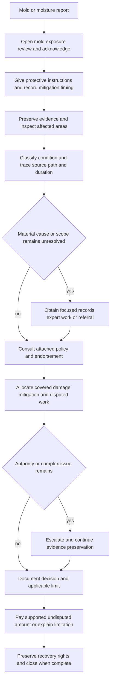

# Mold Claim Handling

## Purpose and governing boundary

This page turns the internal mold and fungi guideline into a claim-handling workflow. It is not a fungi, water, or remediation coverage rule. The guideline is operational material; the attached policy, endorsements, applicable law, and approved authority determine coverage (**H.0.1–H.0.5**, **H.7.49**). The [claims intake and investigation guidance](/openwiki/claims/manual/intake-investigation-and-mitigation.md) and claims manual likewise direct internal handling and authority but do not alter coverage (**Chapter 1, 1.A**, **1.F–1.J**). Use the [water-loss handling guidance](/openwiki/claims/guidelines/water-loss-handling.md) for the broader water-loss workflow, and consult the applicable policy and the [fungi and bacteria coverage reference](/openwiki/coverage/perils/fungi-and-bacteria.md) rather than treating this page as contract language.

A report of “mold” is an investigation entrypoint, not a coverage conclusion. Keep four questions separate in the file:

1. What condition is actually present: fungi, wet or dry rot, bacteria, staining, odor, or something not yet identified?
2. What moisture or water source, path, duration, and event produced the condition?
3. What property and expenses are physically damaged, and which are mitigation, testing, repair, replacement, or preventive work?
4. Which policy form, endorsement, condition, limitation, disclosure, and claim authority apply?

Training may help explain why these questions are separate, but it cannot supply a limit, deductible, period, or coverage outcome (**Guidance Versus Contract Language, L.1.2–L.1.5**, **L.2.7–L.2.12**).

## Investigation lifecycle

*This flow shows the guideline’s operational lifecycle; it does not decide whether a policy covers fungi, water, or any remediation expense.*

## 1. Intake and immediate controls

### Open, identify, and acknowledge

- Open a separate mold-handling file when the report includes visible growth, odor, staining, moisture intrusion, or suspected fungi (**H.6.1**). Record the reported condition, affected property, source of the report, policy and loss location, insured or claimant, discovery date, and facts that remain unverified (**H.5.1–H.5.4**, **H.6.1–H.6.3**; manual **9.A**, **9.H**).
- Acknowledge the report promptly and document the contact attempt. Ask what was discovered, when it was discovered, what caused it, what was done before notice, and whether the source is still active (**H.6.2–H.6.3**; manual **1.C–1.D**, **9.D**, **9.H**).
- Tell the insured to take reasonable steps to protect property, but keep emergency stabilization distinct from permanent repair, replacement, or mold remediation (**H.6.4**, **H.6.7**, **H.7.6–H.7.8**). Do not promise that an inspection, vendor assignment, mitigation authorization, or request for records means the claim is covered (**H.6.23**, **H.7.4**, **H.7.17–H.7.18**).

### Record the mitigation timing rule without silently reconciling sources

The mold guideline says reasonable mitigation should begin within **3 days after discovery** when prompt action is required (**H.6.5**). The claims manual’s mold chapter says to explain that mitigation must begin within **5 days after discovery** (**Chapter 9, 9.E**). These are both internal operational sources with different thresholds. Record which instruction and authority governs the file; do not convert either number into a policy condition or silently merge them. If the difference changes the direction given or the evaluation of delay, escalate the conflict and document the decision. In all cases record the discovery information, instruction, insured response, work performed, and reason for any delay (**H.6.6**; manual **9.E**).

### Check related history

Ask about earlier water, leakage, seepage, humidity, odor, staining, fungal growth, repairs, remediation, and claims involving the same area or component. Compare the current location, source, repair history, and chronology with prior materials, but do not treat a prior claim or payment as an automatic bar or as proof of current coverage (**H.5.1–H.5.8**, **H.5.17–H.5.24**; manual **9.K**). Preserve prior photographs, estimates, reports, correspondence, invoices, and repair records (**H.5.9**, **H.5.21**).

## 2. Establish condition, causation, and microbial evidence

### Classify the reported condition

Do not classify the condition solely from the insured’s, contractor’s, or vendor’s label. Distinguish fungi, wet or dry rot, bacteria, staining, odor, dampness, and an unverified substance using inspection findings and reliable records (**H.6.10–H.6.11**, **H.6.34**; manual **9.B–9.C**, **9.S**). Visible growth, an odor complaint, a hygiene concern, or an occupant symptom is evidence to investigate—not proof of covered fungi-related property damage (**H.7.39–H.7.40**; manual **9.S**, **9.AF–9.AG**).

### Trace source, path, and duration

Build a cause chronology before deciding how any limitation or exclusion applies:

- **Source:** identify whether the moisture came from a plumbing or appliance discharge, roof or building-envelope opening, backup, seepage, condensation, humidity, weather, construction, or another source. Determine whether the source is active, repaired, isolated, or unknown (**H.6.9–H.6.10**; manual **9.D**, **9.I**).
- **Path and scope:** inspect the reported area, adjacent rooms, connected building spaces, concealed cavities, and affected personal property where access is available. Water and microbial damage may extend beyond the first visible location (**H.6.17**, **H.6.29–H.6.30**; manual **3.AD**, **9.B**).
- **Duration and recurrence:** compare the reported date with repair records, occupancy, weather, prior claims, staining, decay, corrosion, moisture findings, and witness accounts. Separate current direct physical damage from preexisting, recurring, deteriorated, or maintenance-related conditions (**H.5.13–H.5.20**, **H.6.21–H.6.22**; manual **9.H–9.K**).
- **Cause-to-damage connection:** document whether the reported event caused direct physical loss and whether the fungi condition resulted from that loss. Do not infer causation from growth alone (**H.0.4**, **H.6.11**, **H.6.23**; manual **9.I**).

### Preserve and obtain evidence

Before removal when safely practical, obtain photographs or video of the affected area, surrounding context, moisture path, condition of materials, and personal property. Preserve samples, removed materials, failed components, inspection findings, environmental reports, mitigation logs, moisture records, invoices, estimates, repair scopes, and statements that bear on cause, extent, or duration (**H.6.8–H.6.12**, **H.6.17**, **H.6.31**; manual **9.B**, **9.G**, **9.J**, **9.AJ**). Do not authorize disposal or irreversible demolition before a reasonable inspection opportunity unless immediate removal is needed to protect persons or property (**H.5.36**, **H.5.43–H.5.44**, **H.5.57**; manual **9.G**).

Testing is not an automatic intake requirement. Distinguish testing needed to resolve a material coverage or damage question from testing for health, regulatory, restoration, or precautionary purposes. Do not approve testing solely to establish presence when the result will not affect claim handling (**H.7.9–H.7.10**; manual **9.P**, **9.R**). Use a qualified expert when source, scope, condition, or repair method cannot reasonably be determined from inspection and records; define the question and review the report against the physical evidence (**H.6.18**, **H.7.11–H.7.15**; manual **9.P–9.Q**).

## 3. Mitigation, remediation, and scope control

Authorize or evaluate emergency extraction, drying, containment, temporary protection, and necessary access separately from permanent repair, replacement, or remediation (**H.6.7**, **H.7.6–H.7.8**). Review whether each charge is reasonable, necessary, within the authorized scope, tied to the reported moisture condition, and supported by the observed damage. Ask vendors to itemize labor, materials, equipment, testing, disposal, access, and other charges; question work that is unrelated, preventive, elective, an upgrade, or unsupported by the source and scope evidence (**H.6.13–H.6.14**, **H.6.29**, **H.6.35**, **H.7.25–H.7.31**; manual **9.L**, **9.T–9.X**).

Keep separate categories in the estimate and file notes:

1. direct physical damage to covered property, if any;
2. reasonable emergency protection and access tied to that damage;
3. microbial removal, containment, cleaning, treatment, testing, and remediation;
4. repair or replacement of the source or undamaged property;
5. preexisting, recurring, deterioration, maintenance, betterment, preventive, and unrelated work; and
6. personal property, ownership, other insurance, salvage, recovery, deductible, and applicable limit effects.

For contents, identify ownership and condition, obtain an inventory before disposal when practical, and evaluate cleaning, restoration, or replacement rather than assuming that replacement is required (**H.6.15–H.6.16**, **H.7.27**, **H.7.29**; manual **9.Y–9.AB**). Mitigation that began before inspection is not by itself a denial basis; evaluate whether it was reasonable and what evidence remains (**manual 9.AI–9.AJ**).

## 4. Coverage consultation and disclosure controls

### Consult the attached contract, not a generic mold rule

Before communicating a coverage position, identify the exact base form, edition, state material, endorsements, declarations, and loss-date terms. The guideline requires review of all applicable forms and endorsements (**H.0.5**), and the manual requires the file to show the policy provisions and verified facts considered (**Chapter 1, 1.E–1.F**, **1.I–1.J**).

Examples show why the form check matters; they are not interchangeable claim outcomes:

| Contract check | Handling use | Authority |
|---|---|---|
| HO-3 2024-03 | Its fungi provision excludes fungi, wet rot, dry rot, or bacteria except as provided by a limited fungi endorsement; the microbial remediation limit does not itself create coverage. Confirm whether the referenced endorsement is attached before applying the limitation. | `forms/HO/MS/HO-3/2024-03.md`, **X.28–X.29** |
| HO-4 2021-10 | Its fungi provision similarly excludes fungi, wet rot, dry rot, or bacteria except as provided by a limited fungi endorsement and states that the mold coverage limit does not create otherwise excluded coverage. Do not use an HO-3 conclusion for an HO-4 claim. | `forms/HO/MS/HO-4/2021-10.md`, **X.31–X.34** |
| HO 04 81 2018-09, if attached | The endorsement provides limited fungi coverage only when fungi results from a covered cause that first causes direct physical loss. The controlling grant says, **“We cover direct physical loss caused by fungi when the fungi results from a ‘covered cause of loss,’”** and, **“The covered cause of loss must cause direct physical loss to covered property. The fungi must result from that direct physical loss.”** It also addresses reasonable and necessary removal, access, repair, remediation, and post-removal testing, while retaining exclusions and conditions. | `forms/HO/MS/HO-04-81/2018-09.md`, **W.0**, **W.1 W.2–W.23** |
| HO 04 27 2016-05 | The endorsement’s limited water grant excludes microbial loss. Its controlling exclusion states, **“We do not cover loss caused by the presence, growth, proliferation, spread, or any activity of fungi, wet rot, dry rot, or bacteria.”** The endorsement separately states, **“The most we will pay for loss caused by fungi, wet or dry rot, or bacteria is five thousand dollars,”** but also says, **“We do not pay for loss caused by fungi, wet or dry rot, or bacteria when the loss is otherwise excluded.”** Read together, the $5,000 figure cannot be used to assume that excluded microbial damage is covered. | `forms/HO/MS/HO-04-27/2016-05.md`, **W.1 W.1–W.23**, **W.2 W.11–W.13** |

Where HO 04 81 applies, its fungi, wet or dry rot, or bacteria aggregate is **$10,000** for all covered loss subject to that limit during the policy term. The limit states, **“The most we will pay for ‘fungi, wet or dry rot, or bacteria’ is ten thousand dollars,”** and applies to the total covered loss regardless of the number of claims, persons insured, or items of property; it includes covered property damage and related expenses. Amounts paid for direct physical loss and related covered expenses reduce the remaining coverage and do not restore it (**W.2 W.1–W.2**, **W.2 W.3–W.22**, **W.1 W.51–W.52**). This is a contract example for consultation, not a universal mold limit. Take the actual limit, deductible, and write-back from the attached form and declarations.

### Apply the North Carolina disclosure boundary

For a North Carolina policy containing a fungi, wet or dry rot, or bacteria limitation, the bulletin requires a clear, conspicuous disclosure that identifies the limitation and uses understandable language. It specifically requires the statement, **“The most we will pay is $5,000 (five thousand dollars)”**, when the bulletin’s disclosure requirement applies (**NCDOI-2018-03, B.2.1–B.2.15**). The issuer must retain the version delivered and maintain compliance records (**B.2.20–B.2.26**, **B.3.19–B.3.24**).

For claim handling, verify the policy and retained disclosure, keep claim communications consistent with both, and provide a written factual and policy explanation when applying a limitation or making a partial denial (**NCDOI-2018-03, B.4.1–B.4.18**). The bulletin does not create coverage, alter the contract, or permit a denial without a reasonable investigation (**B.1.35–B.1.37**, **B.4.3–B.4.10**). Escalate a mismatch between the disclosure, endorsement, declarations, and policy wording rather than resolving it through an informal explanation.

## 5. Escalation and authority

Refer before committing to a final position when any material issue remains unresolved. The mold guideline requires referral when the claimed amount exceeds **$10,000**, the source is unknown or disputed, evidence conflicts, long-term or repeated moisture is indicated, remediation begins before documentation, hidden damage is possible, the scope changes materially, another party may be responsible, or laboratory, health, habitability, contamination, or unusual remediation issues arise (**H.5.31–H.5.59**). The general claims manual separately requires referral of an evaluated loss above **$25,000** before settlement or payment (**Chapter 1, 1.V–1.W**). Treat these as source-specific internal controls; do not substitute one threshold for the other.

Also escalate when:

- the proposed testing, demolition, remediation, denial, partial denial, limitation, settlement, release, or payment exceeds assigned authority (**H.7.3**, **H.7.9**, **H.7.19–H.7.24**, **H.7.35–H.7.36**);
- the claim includes bodily injury, illness, habitability, public-health, governmental, regulatory, legal, appraisal, mediation, or attorney-representation issues (**H.7.39–H.7.44**; manual **9.O**, **9.AD–9.AG**); or
- a vendor, insured, tenant, contractor, association, or other party disputes causation, alleges that claim handling caused additional damage, or requests work beyond the documented source and scope (**H.5.40–H.5.49**, **H.7.31–H.7.34**).

A referral does not stop progress. Record the issue, material facts, evidence preserved, question presented, direction received, and action taken; continue communication and preservation unless responsibility is expressly transferred (**H.5.56–H.5.60**, **H.7.45–H.7.48**). Use neutral factual language for suspected misrepresentation or inflated billing and route it through the approved review process (**H.6.37**; manual **1.AB**).

## 6. Payment, communication, recovery, and closure

Before payment, document the applicable coverage provision, covered and disputed categories, valuation basis, deductible, limit consumption, payee and ownership interests, other insurance, salvage, and authority. Do not combine covered repair costs with disputed fungi expenses in a way that hides the payment rationale (**H.7.25–H.7.27**; manual **1.Q**, **1.R**, **1.S**, **1.X–1.Z**).

Issue supported undisputed covered damage when within authority even while a fungi issue remains under review; do not use payment authority to settle a coverage dispute that requires formal review (**H.7.23**, **H.7.26–H.7.28**). Explain any limitation, partial denial, or denial in writing using the applicable policy language and material facts, and do not describe limited coverage as wholly excluded (**H.6.33**, **H.7.19**, **H.7.46**; **NCDOI-2018-03, B.4.5–B.4.6**, **B.4.14**). Investigation, testing, mitigation approval, or payment does not waive a policy term (**H.6.23**, **H.6.26**; HO-3 **AGR.9**; HO 04 81 **W.36**, **W.39**).

Preserve failed components, contracts, photographs, reports, and responsible-party information for subrogation, contribution, salvage, or other recovery. Do not release a responsible party or impair recovery rights without approval (**H.7.33–H.7.36**; manual **1.AC–1.AD**).

Close the mold handling file only after the file shows the condition and causation analysis, evidence and evidence limitations, mitigation and scope review, form and endorsement consultation, escalation outcome, coverage decision, payment basis, communications, recovery status, retained-evidence disposition, and unresolved issues (**H.6.31–H.6.38**). Do not close because a surface is dry or a vendor invoice is paid. Reopen when new information materially affects cause, scope, coverage, payment, or recovery (**manual Chapter 1, 1.AR**, **1.AT–1.AU**).

## Source map

- Internal mold claim guideline: `guidelines/claims/mold-claim-handling.md`, **H.0–H.7**.
- Property claims manual: `manuals/claims/manual.md`, **Chapter 1**, **C3 Chapter 3 — Water Losses**, and **Chapter 9 — Mold, Fungi and Bacteria**.
- North Carolina disclosure bulletin: `bulletins/NC/ncdoi-2018-03-fungi-disclosure.md`, **B.1–B.4**.
- Contract examples: `forms/HO/MS/HO-3/2024-03.md`, **AGR.9**, **X.28–X.29**; `forms/HO/MS/HO-4/2021-10.md`, **X.31–X.34**; `forms/HO/MS/HO-04-81/2018-09.md`, **W.1–W.3**, **W.10–W.23**, **W.2 W.1–W.52**; `forms/HO/MS/HO-04-27/2016-05.md`, **W.1 W.1–W.25**, **W.2 W.2–W.13**.
- Interpretation boundary: `training/guidance-versus-contract.md`, **L.1–L.2**. Training supports the distinction between operational guidance and contract authority; it does not supply claim thresholds, coverage numbers, or settlement outcomes.
