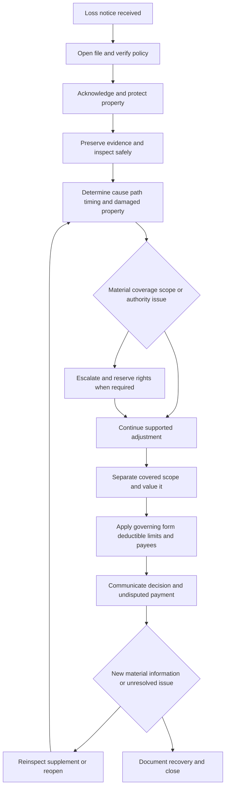

# Roof Claim Handling Guidance

## Governing boundary

This page is internal claims-handling direction. It organizes the investigation and authority process; it is not a coverage grant, exclusion, deductible, settlement schedule, waiver, or substitute for the policy. The roof guideline says that policy terms, endorsements, declarations, and applicable law control, and that each roof claim must be evaluated from its own facts and inspection findings ([roof guideline H.0.1–H.0.6](repo://guidelines/claims/roof-claim-handling.md#L13-L27)). The claims manual likewise says internal handling direction does not alter coverage and requires the applicable policy terms to be reviewed before stating a coverage position ([claims manual 1.A–1.F](repo://manuals/claims/manual.md#L13-L49)).

Keep four decisions separate:

1. **Coverage and causation:** whether the policy in force at loss responds to direct physical loss caused by a covered peril. The HO-3 2024-03 agreement uses that coverage test ([HO-3 2024-03, AGR.3](repo://forms/HO/MS/HO-3/2024-03.md#L13-L20)).
2. **Scope and valuation:** which property was physically damaged and how the governing form values that covered property.
3. **Regulatory administration:** what a state bulletin requires for underwriting, notices, disclosures, or claims handling. A bulletin does not silently amend the policy.
4. **Internal roof-age or authority action:** what the carrier requires for investigation, referral, or underwriting. An internal age rule is not a claim exclusion.

Use [Roof Surfacing Settlement and Roof Claims](/openwiki/coverage/settlement/roof-settlement.md) for the contract comparison and edition analysis. This page supplies the handling controls that lead to that contract analysis; it does not replace it. For Florida form assembly and bulletin boundaries, use [Florida State Overlay](/openwiki/state-overlays/florida.md).

## Roof claim lifecycle

*Caption: Roof claim lifecycle from notice through causation, scope, valuation, escalation, communication, supplemental review, and closure.*

## 1. Intake and immediate controls

### Open the right file

Open a roof claim promptly on notice and record the report source, reported date and circumstances, location, named insured, affected interest, and claimed property. Confirm the policy and property before discussing payment, and record the reported cause without calling the damage covered before inspection ([roof guideline H.6.1–H.6.3](repo://guidelines/claims/roof-claim-handling.md#L465-L471)). The general claims manual also requires a claim record on receipt, prompt contact, policy-status verification, and documentation of unverified information ([claims manual 1.C–1.F](repo://manuals/claims/manual.md#L27-L49)).

At intake, capture:

- the insured’s account of the event, discovery date, weather or other alleged cause, affected slopes or structures, and any interior consequences;
- occupancy, access, safety, representative, contractor, public-adjuster, mortgagee, or lienholder information;
- whether tarping, drying, demolition, permanent repair, disposal, or replacement has begun;
- prior claims, repairs, leaks, inspections, overlays, maintenance, and known roof-age information; and
- other insurance, warranty, responsible-party, or recovery information when material.

Acknowledge receipt and explain the process without promising coverage, scope, or payment. A reservation of rights is not a denial or acceptance: the claims manual requires an approved reservation within **10 days** when a potential coverage defense is identified, with known facts and the issue stated specifically; investigation continues after issuance ([claims manual 2.X–2.AB](repo://manuals/claims/manual.md#L481-L503)).

### Protect people, property, and evidence

Tell the insured to take reasonable steps to protect the property from further damage, but keep emergency protection separate from permanent restoration. The roof guideline requires confirmation that mitigation began within **3 days after discovery**, requests photographs and invoices for emergency measures, and asks that damaged materials be retained when practical ([roof guideline H.6.5–H.6.8](repo://guidelines/claims/roof-claim-handling.md#L473-L481)). Record unsafe access and use a qualified field resource when specialized evaluation is needed ([roof guideline H.6.9–H.6.11](repo://guidelines/claims/roof-claim-handling.md#L483-L487)).

Do not direct permanent work that could destroy cause or scope evidence while coverage remains unresolved. Reasonable temporary protection is different: the 2025 HO 23 74 form requires access and preservation for inspection, recognizes reasonable temporary protective materials, and requires records for temporary repairs ([HO 23 74 2025-05, W.1.15–W.1.16](repo://forms/HO/MS/HO-23-74/2025-05.md#L151-L155); [W.1.43](repo://forms/HO/MS/HO-23-74/2025-05.md#L269-L271); [W.3.6–W.3.7](repo://forms/HO/MS/HO-23-74/2025-05.md#L592-L599)). A mitigation authorization, inspection, estimate, or partial payment is not a coverage determination.

## 2. Causation investigation

Start with the physical sequence, not the label “storm damage,” “roof leak,” or “old roof.” Establish:

- **Source:** wind, hail, falling object, fire, collapse, rain, snow, defective installation, maintenance, repeated leakage, or another alleged cause.
- **Path:** the damaged roof area, opening or failure point, movement of water, and any interior or adjacent-property effects.
- **Timing and duration:** when the event occurred, when damage began, when it was discovered, and whether the condition is sudden, recurring, or long-term.
- **Damage connection:** which physical changes were caused by the reported event and which reflect age, wear, deterioration, prior damage, maintenance, workmanship, or betterment.

The roof guideline requires inspection of roof surfaces, components, and affected interiors; recording material, apparent age, slope, condition, repairs, impact patterns, displaced materials, collateral damage, undamaged comparison areas, and relevant weather information; and testing the observed damage against the reported event before estimating ([roof guideline H.6.11–H.6.18](repo://guidelines/claims/roof-claim-handling.md#L487-L501)). The claims manual requires credible cause analysis and referral of technically disputed or complex causation issues ([claims manual 1.K–1.N](repo://manuals/claims/manual.md#L75-L97)).

For an HO-3 2024-03 loss, wind and hail are covered perils subject to exclusions, but interior rain, snow, sleet, sand, or dust requires direct wind or hail damage that first creates an opening. Cosmetic roof-surfacing damage is excluded, while wind or hail damage that impairs the ability to shed water is covered; the roof schedule trigger age alone does not establish coverage ([HO-3 2024-03, P.37–P.41](repo://forms/HO/MS/HO-3/2024-03.md#L631-L639)). Apply the actual policy edition and endorsements, not this example, to the loss.

### Roof age is evidence and valuation input, not a causation shortcut

Record roof-surfacing age separately from the age of the dwelling or supporting structure. Request installation records, permits, invoices, inspection reports, photographs, statements, maintenance and repair records, and prior claim material. Identify the source and reliability of the conclusion, including conflicting evidence. The 2025 HO 23 74 form defines Roof Age as the age of the damaged roof surfacing, permits installation records, permits, invoices, inspections, photographs, statements, or other reliable evidence, and says that a limited-area replacement does not establish the age of surrounding surfacing without evidence of one installation ([HO 23 74 2025-05, W.1.4–W.1.6](repo://forms/HO/MS/HO-23-74/2025-05.md#L90-L114)).

Do not deny, limit, or delay a claim solely because of age or because underwriting previously accepted, inspected, cancelled, or nonrenewed the risk. OIR-2023-04 requires an independent claim evaluation under the policy and facts and requires separation of claim and underwriting decisions ([OIR-2023-04, B.4.1–B.4.8](repo://bulletins/FL/oir-2023-04-roof-age-nonrenewal.md#L239-L255)). The bulletin’s statement that an ACV roof schedule applies at 10 years is an administration and policy-materials requirement; its own text says the schedule cannot be applied unless the policy form authorizes it and identifies the roof components ([OIR-2023-04, B.2.7–B.2.10](repo://bulletins/FL/oir-2023-04-roof-age-nonrenewal.md#L71-L79)).

For historical Florida handling, OIR-2019-11 is marked superseded by OIR-2023-04 for policies effective on or after April 11, 2023. Its former text used a 15-year ACV schedule and a 20-year inspection-before-binding threshold; those are not interchangeable with the current bulletin, the attached contract, or the carrier’s internal rules ([OIR-2019-11 supersession and B.2.3–B.2.6](repo://bulletins/FL/oir-2019-11-roof-age.md#L2-L9) (repo://bulletins/FL/oir-2019-11-roof-age.md#L49-L59)).

## 3. Evidence and file integrity

The evidence package should allow another reviewer to reconstruct cause, timing, damage, scope, value, and recovery. Preserve, as applicable:

- wide and close photographs or video of damaged and undamaged slopes, edges, penetrations, flashings, vents, skylights, gutters, drainage, roof-mounted equipment, interior effects, and temporary repairs;
- roof material, component, slope, area, condition, prior repair, overlay, and age evidence, including samples or removed materials when practical;
- weather or event records, inspection findings, measurements, aerial imagery used with other evidence, and reports from qualified contractors, engineers, or roof consultants;
- estimates, invoices, receipts, repair contracts, permits, maintenance records, proof of payment, mitigation logs, and the reason each charge is claimed; and
- prior-loss records, ownership and interest information, other-insurance or warranty information, and possible responsible-party evidence.

The roof guideline requires preserved photographs, reports, contractor information, prior-loss comparison, and a record of the source and reason for technical referral ([roof guideline H.5.1–H.5.10](repo://guidelines/claims/roof-claim-handling.md#L379-L401); [roof guideline H.6.19–H.6.29](repo://guidelines/claims/roof-claim-handling.md#L501-L523)). The 2025 endorsement separately requires preservation and inspection access and identifies photographs, records, estimates, invoices, receipts, and proof of prior condition as relevant claim information ([HO 23 74 2025-05, W.6.20–W.6.21](repo://forms/HO/MS/HO-23-74/2025-05.md#L1604-L1612); [W.6.43–W.6.47](repo://forms/HO/MS/HO-23-74/2025-05.md#L1690-L1711)).

Treat every contractor, engineer, inspection, weather, photograph, and age opinion as evidence to evaluate, not as the coverage decision. Compare its observations and reasoning with the policy, physical evidence, and competing material. Attribute opinions to their source, record conflicts, request focused clarification, and re-inspect when material new causation, damage, or repair evidence appears ([claims manual 3.BQ–3.BR](repo://manuals/claims/manual.md#L1119-L1125); [roof guideline H.6.43–H.6.46](repo://guidelines/claims/roof-claim-handling.md#L551-L557)).

If permanent work occurred before inspection, obtain before-and-after photographs, invoices, samples, contractor records, and other reliable evidence. Do not treat the loss as unprovable merely because mitigation changed the scene; document what can and cannot now be established. The 2025 form allows the amount of loss to be based on available information, while requiring reasonable access, preservation, and cooperation controls ([HO 23 74 2025-05, preamble](repo://forms/HO/MS/HO-23-74/2025-05.md#L49-L56); [W.1.15–W.1.16](repo://forms/HO/MS/HO-23-74/2025-05.md#L151-L155); [W.6.20–W.6.23](repo://forms/HO/MS/HO-23-74/2025-05.md#L1604-L1620)).

## 4. Scope and coverage checkpoints

Build the scope by property and cause, not by the largest contractor proposal. At minimum separate:

1. roof surfacing that sustained covered direct physical damage;
2. decking, underlayment, flashing, fasteners, vents, gutters, skylights, equipment, framing, and other components;
3. interior finishes, contents, detached-structure property, and loss-of-use effects;
4. source-component repair, pre-existing or repeated damage, wear, deterioration, maintenance, defective installation, and unrelated work;
5. access, removal, disposal, temporary protection, code or ordinance work, matching, overhead and profit; and
6. deductible, limit, salvage, other insurance, warranty, recovery, and duplicate-payment effects.

The 2025 endorsement defines roof surfacing as the weather-resistant exterior surface and excludes structural framing and interior building materials from that definition; it separately addresses flashing, underlayment, fasteners, vents, and related components when they are covered, damaged, and necessary to complete covered repairs. That does not make every roof-system component scheduled roof surfacing ([HO 23 74 2025-05, W.2.2 and W.1.40](repo://forms/HO/MS/HO-23-74/2025-05.md#L348-L356); [W.1.40](repo://forms/HO/MS/HO-23-74/2025-05.md#L256-L259)).

The 2025 endorsement excludes pre-loss damage, deterioration, wear, defective work, maintenance-related conditions, repeated leakage, excluded water, and replacement of undamaged surfacing merely for uniformity, while allowing matching only to the extent required to repair physically damaged surfacing ([HO 23 74 2025-05, W.2.21–W.2.24](repo://forms/HO/MS/HO-23-74/2025-05.md#L451-L471); [W.4.3–W.4.13](repo://forms/HO/MS/HO-23-74/2025-05.md#L726-L770); [W.4.27–W.4.28](repo://forms/HO/MS/HO-23-74/2025-05.md#L830-L836)). The scope must therefore show the evidence connecting each included line to covered physical damage and remove betterment, maintenance, and unsupported full-roof replacement.

Matching and code are not automatic coverage. Confirm the damaged area first, then determine whether comparable material or necessary access is supported. For code work, obtain the applicable authority, permit, inspection record, or code provision and analyze any ordinance-or-law coverage separately. Do not let a contractor’s preference, unavailable exact match, or a local requirement silently expand the covered scope.

## 5. Valuation and settlement handoff

Only after coverage and supported scope are established should the adjuster apply the attached contract’s settlement method, depreciation or schedule, deductible, limits, and payee rules. An estimate is an input to valuation, not proof of coverage. The claims manual requires credible scope, pricing, condition, repairability, replacement feasibility, betterment, depreciation, salvage, and prior-damage analysis ([claims manual 1.S–1.U](repo://manuals/claims/manual.md#L123-L139)).

For the HO-3 2024-03 example, covered dwelling loss generally uses replacement-cost treatment when the Coverage A limit is at least 80% of full replacement cost; otherwise actual cash value applies until repair or replacement is complete. The form separately says roof surfacing is replacement cost unless an attached ACV roof schedule endorsement changes that treatment ([HO-3 2024-03, A.19–A.23](repo://forms/HO/MS/HO-3/2024-03.md#L135-L143)). Confirm the declarations, policy edition, and attached endorsements before using that rule.

When HO 23 74 is attached, use its governing edition:

- **2018-09:** ACV applies when roof surfacing is at least **15 years old** at loss; composition shingle subject to the age classification has a **25% payable percentage**, with the deductible applied after the payable amount. The endorsement permits labor depreciation when necessary and permitted by that edition ([HO 23 74 2018-09, W.1.1–W.1.10](repo://forms/HO/MS/HO-23-74/2018-09.md#L45-L67); [W.3.1–W.3.4](repo://forms/HO/MS/HO-23-74/2018-09.md#L235-L245)).
- **2025-05:** ACV applies when Roof Age is **12 years or greater**; its composition-shingle provision states a **20% payable percentage** before the deductible. Its exclusion text also says payment will not be less than **30% of applicable replacement cost**, while W.1.35–W.1.37 repeat malformed `floor innever less than the floor in` provisions without supplying a usable floor amount. Preserve this apparent internal conflict and escalate for controlling legal, filing, or policy interpretation rather than selecting 20% or 30% by assumption ([HO 23 74 2025-05, W.1.4–W.1.6](repo://forms/HO/MS/HO-23-74/2025-05.md#L90-L114); [W.3.1–W.3.3](repo://forms/HO/MS/HO-23-74/2025-05.md#L568-L581); [W.1.35–W.1.37](repo://forms/HO/MS/HO-23-74/2025-05.md#L236-L246); [W.4.3–W.4.4](repo://forms/HO/MS/HO-23-74/2025-05.md#L726-L735)).

The 2018-09 endorsement is superseded by the 2025-05 edition for policies effective on or after May 1, 2025, but remains in force for policies written under the earlier edition. Select by the policy and endorsement effective date, not by the claim-adjustment date ([HO 23 74 2018-09 supersession marker](repo://forms/HO/MS/HO-23-74/2018-09.md#L1-L9)). Do not import a bulletin’s underwriting threshold or another edition’s schedule into the policy being adjusted.

Apply the contractual deductible only after the covered scope and applicable roof-surfacing adjustment are determined. The 2018-09 form applies it after the payable amount; the 2025-05 form states that the composition-shingle percentage is determined before the deductible and applies the deductible only to covered damage ([HO 23 74 2018-09, W.3.1–W.3.6](repo://forms/HO/MS/HO-23-74/2018-09.md#L233-L247); [HO 23 74 2025-05, W.3.1–W.3.5](repo://forms/HO/MS/HO-23-74/2025-05.md#L568-L586)). A deductible cannot create coverage for excluded or undamaged property.

## 6. Escalation and authority controls

Escalate before commitment when any of the following applies:

- roof claim exposure is over **$10,000** before final payment under the roof guideline’s prior-loss and referral control ([roof guideline H.5.28–H.5.30](repo://guidelines/claims/roof-claim-handling.md#L431-L439));
- evaluated loss exceeds the general claims-manual authority threshold of **$25,000**, which requires referral before settlement or payment commitment ([claims manual 1.V–1.W](repo://manuals/claims/manual.md#L141-L151));
- cause, timing, roof age, material classification, repairability, scope, matching, code treatment, deductible, schedule percentage, or policy interpretation remains materially uncertain or conflicting;
- the roof is unsafe, inaccessible, materially altered, or permanently repaired before a reasonable inspection opportunity;
- there are suspected altered documents, duplicate invoices, staged damage, misrepresentation, fraud indicators, litigation, a complaint, representation, or an unfair-handling allegation; or
- a settlement would include a release, nonstandard term, disputed legal right, responsible-party compromise, or action that could impair recovery.

The roof guideline requires escalation for unresolved source, conflicting evidence, gradual or recurring damage, hidden damage, competing scopes, shared responsibility, suspicious billing, litigation, and unusual compromise terms ([roof guideline H.5.11–H.5.36](repo://guidelines/claims/roof-claim-handling.md#L401-L451); [roof guideline H.7.14–H.7.18](repo://guidelines/claims/roof-claim-handling.md#L601-L611)). Keep working the claim while escalation is pending: document the issue and requested decision, continue reasonable mitigation and communication, and do not represent that payment is approved before authority is obtained ([roof guideline H.7.1–H.7.7](repo://guidelines/claims/roof-claim-handling.md#L575-L589)).

A referral does not transfer coverage responsibility to a contractor or expert. The carrier must review vendor opinions independently, and a contractor may discuss scope and pricing but not decide coverage ([roof guideline H.7.38](repo://guidelines/claims/roof-claim-handling.md#L649-L653)). Do not accuse an insured or vendor of fraud in routine correspondence; route the concern through the designated review process ([roof guideline H.7.25–H.7.27](repo://guidelines/claims/roof-claim-handling.md#L623-L629)).

## 7. Communication, payment, and closure

Communications should distinguish reported facts, observed facts, expert opinions, unresolved questions, coverage, scope, valuation, deductible, and payment status. Explain what information is needed and why. If denying or limiting any part, identify the affected damage, material facts, and applicable policy provision; do not describe a roof-age rule, inspection, estimate, or nonrenewal as the coverage basis unless the contract actually supports that position. OIR-2023-04 requires a written factual and policy explanation for a denial or limitation, payment of undisputed benefits when due, and consideration of material supplemental information ([OIR-2023-04, B.4.9–B.4.18](repo://bulletins/FL/oir-2023-04-roof-age-nonrenewal.md#L257-L277)).

Issue supported undisputed payment without waiting for an unrelated disputed portion, but confirm authority, payees, mortgagee or lienholder interests, deductible, limits, prior payments, salvage, and other-insurance effects. The roof guideline permits undisputed payment, requires a clear written position, and requires a complete file of inspections, photographs, estimates, correspondence, and payment information ([roof guideline H.6.39–H.6.50](repo://guidelines/claims/roof-claim-handling.md#L543-L565)).

Review supplements as new evidence, not as automatic scope expansion. Reinspect or obtain support for hidden damage, additional covered damage, changed causation, or a revised repair method. A revised settlement must remain within the governing form and authority; supplemental information does not make all related conditions covered.

Before closure, the file must show:

- the governing policy and endorsement editions and any relevant state overlay;
- reported and established cause, timing, physical damage, roof age evidence, and inspection limitations;
- covered, excluded, pre-existing, and unresolved scope categories;
- repair or replacement basis, ACV or replacement-cost treatment, schedule or depreciation calculation, deductible, limits, payees, and payments;
- authority approvals, reservations, referrals, communications, undisputed benefits, recovery or salvage handling, and complaint or litigation status; and
- any remaining supplement, dispute, recovery, or record-retention action.

Do not close while material coverage, payment, recovery, or complaint issues remain unresolved. The claims manual requires a documented closure rationale and final communication and requires reopening when new information requires carrier action ([claims manual 1.AT–1.AV](repo://manuals/claims/manual.md#L285-L301)). The roof guideline likewise requires closure only after the coverage decision, payment status, outstanding issues, and insured communications are documented, and requires reopening when material new information affects cause, damage, or settlement ([roof guideline H.6.52–H.6.54](repo://guidelines/claims/roof-claim-handling.md#L569-L573); [roof guideline H.7.42–H.7.43](repo://guidelines/claims/roof-claim-handling.md#L657-L661)).

## 8. Colorado roof-settlement disclosure overlay

For a roof claim involving property in Colorado, add a jurisdiction check before communicating a settlement position. DOI-2022-08 applies to an admitted insurer’s roof-damage communications—including estimates, payments, settlements, and coverage determinations—and requires clear, accurate information that distinguishes the coverage decision from the amount offered or paid. The bulletin does not replace the policy or create a coverage grant ([Colorado DOI-2022-08, B.1.1–B.1.7](repo://bulletins/CO/doi-2022-08-roof-settlement.md#L16-L45); [B.4.1–B.4.4](repo://bulletins/CO/doi-2022-08-roof-settlement.md#L464-L478); [B.4.27](repo://bulletins/CO/doi-2022-08-roof-settlement.md#L577-L579)).

Before requesting acceptance of a Colorado roof settlement, the file and communication should show:

- the valuation method—ACV, replacement cost, repair cost, or another method authorized by the policy—and any depreciation, recoverability condition, deductible, or withheld amount;
- each roof component included, excluded, or undamaged, with the estimate reasonably itemized for material, labor, and deductions;
- whether the proposed resolution is repair or replacement, the material differences from an insured’s contractor estimate, and the policy and factual basis for any excluded line, partial denial, or cause finding; and
- whether undisputed payment leaves other issues open, whether the communication is final, and how the insured can request clarification or submit photographs, documents, estimates, or supplemental information.

These are disclosure and claims-administration controls, not permission to broaden scope. DOI-2022-08 requires the written explanation and supporting estimate before acceptance, requires explanations for scope and causation differences, prohibits conditioning a supplement on acceptance of an earlier settlement, and requires updated information when scope, valuation, depreciation, deductible treatment, or coverage changes ([Colorado DOI-2022-08, B.3.15–B.3.25](repo://bulletins/CO/doi-2022-08-roof-settlement.md#L360-L406); [B.4.3–B.4.20](repo://bulletins/CO/doi-2022-08-roof-settlement.md#L471-L546); [B.4.24](repo://bulletins/CO/doi-2022-08-roof-settlement.md#L564-L566)). Retain the disclosure, delivery date and method, valuation and depreciation support, and the policy language in effect when the claim was adjusted ([Colorado DOI-2022-08, B.2.24–B.2.36](repo://bulletins/CO/doi-2022-08-roof-settlement.md#L207-L260); [B.3.33–B.3.34](repo://bulletins/CO/doi-2022-08-roof-settlement.md#L436-L442); [B.4.21–B.4.23](repo://bulletins/CO/doi-2022-08-roof-settlement.md#L548-L560)).

Do not import the bulletin’s **15-year schedule trigger** or **25% minimum when surfacing is replaced** into a policy merely because the claim is in Colorado. The bulletin states those disclosure requirements, while the attached contract supplies the operative settlement terms; if the bulletin, filed disclosure, and policy edition do not align, preserve the competing provisions and escalate to state-specific legal or compliance review before applying a schedule or floor ([Colorado DOI-2022-08, B.2.2–B.2.10](repo://bulletins/CO/doi-2022-08-roof-settlement.md#L110-L150); [B.2.30–B.2.34](repo://bulletins/CO/doi-2022-08-roof-settlement.md#L231-L252); [B.5.1–B.5.10](repo://bulletins/CO/doi-2022-08-roof-settlement.md#L583-L623)).

## Source boundary and related pages

- Internal roof handling thresholds, investigation steps, referral triggers, communication, authority, and closure: `guidelines/claims/roof-claim-handling.md`, H.0–H.7.
- General claim authority, reservation, record, and closure controls: `manuals/claims/manual.md`, 1.A–1.AV and 2.X–2.AB.
- Contract settlement and edition comparison: [Roof Surfacing Settlement and Roof Claims](/openwiki/coverage/settlement/roof-settlement.md).
- Base HO-3 coverage and roof peril provisions: `forms/HO/MS/HO-3/2024-03.md`, AGR.3, A.19–A.24, P.37–P.55, and X provisions.
- Roof settlement endorsements: `forms/HO/MS/HO-23-74/2018-09.md` and `forms/HO/MS/HO-23-74/2025-05.md`.
- Florida regulatory boundaries and current versus superseded roof-age bulletins: `bulletins/FL/oir-2019-11-roof-age.md` and `bulletins/FL/oir-2023-04-roof-age-nonrenewal.md`.
- Operational explanation only: `training/guidance-versus-contract.md` and `training/roof-claims-and-the-schedule.md`. Training does not supply coverage, limits, deductibles, deadlines, or settlement authority.
