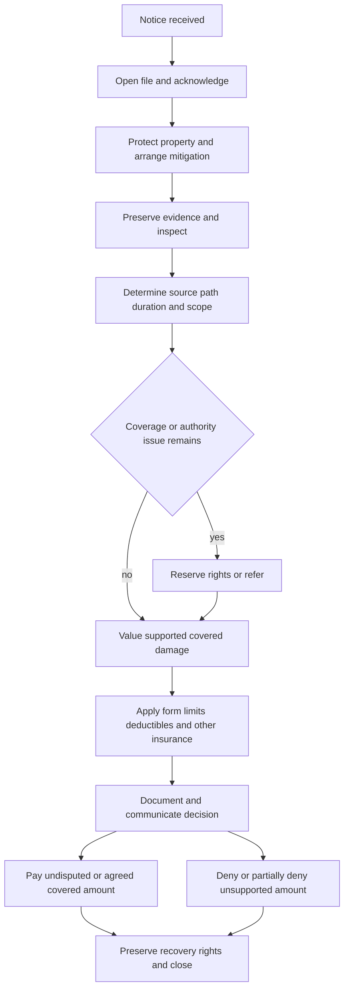

# Water Loss Claim Handling Guidance

## Status and governing boundary

This is internal claims-handling direction, not a coverage grant, exclusion, deductible, limit, or waiver. Use it to move a claim from notice to resolution, but decide coverage from the policy form and endorsements in force on the loss date. The guidance itself says it is an operational aid and not contractual (**H.0.1–H.0.2**), and endorsement language controls when it modifies the base policy (**H.0.11**; **HO-3 2024-03, AGR.9**).

Do not treat an inspection, mitigation authorization, request for information, reserve, partial payment, or vendor opinion as a coverage decision. Investigation does not waive policy rights (**H.6.7**, **H.7.3**, **H.7.6–H.7.8**; **HO-3 2024-03, S.23–S.24 and S.78**). Keep claims authority separate from underwriting authority: the underwriting manual likewise says it must not alter coverage and that coverage is determined by carrier-issued terms (**100.C–100.D**).

## Control flow

*The flow shows the operational lifecycle; each branch remains subject to the policy and attached endorsement.*

## 1. Intake, identity, and immediate instructions

1. **Open and identify the claim.** Open a distinct file when the report may involve covered property, mitigation, or a coverage question (**H.6.1**). Record the reported source, affected locations, discovery date, and reporter (**H.6.2**), then confirm the named insured, loss location, policy status, and damaged property before discussing coverage (**H.6.3**).
2. **Acknowledge and set expectations.** Follow the applicable receipt-acknowledgement requirement and record the communication (**H.6.49**). Keep the insured informed when more investigation is needed (**H.6.50**). Explain the process and requested information without promising payment (**H.6.7**, **H.7.14–H.7.16**).
3. **Record the applicable notice rule.** The claims guideline requires the adjuster to record whether notice was received within 30 days after discovery for a water-backup report (**H.4.3**). The contract may state a different trigger: HO 04 90 (2027-01) says notice is due within 30 days after discovery (**W.5 W.1**), HO 04 27 (2016-05) within 30 days after the loss (**W.5 W.5**), and DP 04 95 (2021-05) within 30 days after the loss (**W.5 W.5**). HO-3 2024-03 requires prompt notice and the insured, location, and available circumstances, but does not state a 30-day period in **I.S S.4**. Do not substitute one form’s period for another.
4. **Give safety and mitigation instructions immediately.** Tell the insured to protect property, retain damaged materials when practical, and describe emergency work already performed (**H.6.8–H.6.9**). The operational threshold is to begin reasonable mitigation within **3 days after discovery** (**H.6.10**). Emergency mitigation within authority is not acceptance of the entire claim (**H.7.6–H.7.8**).
5. **Issue a reservation of rights when needed.** When facts may limit or preclude coverage but a final decision is not yet supportable, issue the reservation within **10 days after identifying those facts** (**H.6.4–H.6.5**). State the known facts, potentially applicable policy language, and remaining investigation (**H.6.6**).

## 2. Investigate cause, path, and duration before coverage

Start with physical facts, not the label used by the insured or vendor. Ask where water began, how it moved, where it first appeared, what it contacted, when it was discovered, what was done, and whether there were earlier leaks or repairs. Training reinforces that “water damage” is too broad and that the source, path, and affected property must be separated (**Water Losses 101, L.4.1–L.4.6**).

Use the following sequence:

- **Source:** identify plumbing, appliance, heating or cooling system, sprinkler, roof opening, drain, sewer, sump, surface water, groundwater, condensation, or another source. Request a plumber or comparable source report when inspection cannot confirm the cause (**H.6.12–H.6.19**).
- **Path:** trace water through fixtures, drains, walls, floors, cavities, and adjacent spaces. The wettest or most visible area is not necessarily the origin. Record the physical route and the evidence that supports it (**H.6.13–H.6.15**; **HO-3 2024-03, P.51–P.55**).
- **Duration and recurrence:** distinguish the discovery date from when the condition began. Compare staining, swelling, corrosion, decay, odor, moisture readings, prior repairs, and witness accounts. Prior loss alone is not a denial basis; allocate old, recurring, and new damage only when evidence supports the distinction (**H.5.1–H.5.8**, **H.5.18–H.5.20**). Training supports using those signs as clues rather than treating one observation as conclusive (**Water Losses 101, L.2.53–L.2.58**, **L.4.7–L.4.18**).
- **Cause-to-damage connection:** identify direct physical damage caused by the reported event and separate the failed source component, resulting damage, pre-existing damage, maintenance, and betterment. The base HO-3 form covers accidental discharge or overflow from listed systems but excludes continuous or repeated seepage and does not cover the system or appliance from which water escaped (**HO-3 2024-03, P.29–P.33**). The form therefore requires a cause and resulting-damage analysis rather than a conclusion based only on water being present.

### Coverage checkpoints by contract

Use the endorsement actually attached to the policy. These examples are not interchangeable:

| Reported mechanism | Coverage checkpoint | Contract authority |
|---|---|---|
| Plumbing, appliance, heating, cooling, or sprinkler discharge | Confirm accidental discharge, direct physical loss, the failed part, and resulting damage. Review repeated seepage, deterioration, maintenance, freezing, and opening exclusions. | HO-3 2024-03, **P.29–P.33**, **P.50–P.55**, **X.25–X.37** |
| Sewer or drain backup and sump discharge | The HO-3 base form excludes sewer, drain, and sump backup (**P.9**, **X.8–X.9**). HO 04 90 **W.1** writes back HO-3 **P.9** and **X.8–X.9** for water backup and sump discharge or overflow, including sudden or gradual events, and preserves the endorsement’s flood, surface-water, maintenance, failed-equipment, and other exclusions (**W.1 W.1–W.14**, **W.1 W.15–W.32**). |
| Limited water damage endorsement | HO 04 27 covers specified accidental discharge or overflow and some broken or frozen systems, but expressly excludes sewer, drain, and sump backup (**W.1 W.1–W.8**, **W.1 W.10–W.18**). |
| Dwelling-property water backup | DP 04 95 covers water backing through a sewer or drain and sump overflow, subject to its own exclusions and conditions (**W.1 W.1–W.9**, **W.4 W.1–W.60**). |
| Flood, surface water, or groundwater | Do not reclassify external water as backup merely because it reached a drain or sump. The HO-3 form excludes flood, surface water, and below-ground water (**P.10–P.11**); HO 04 90 retains corresponding exclusions, with its stated water-backup exception applied only where its wording provides it (**W.1 W.15–W.17**, **W.4 W.3–W.8**). |

If a roof, wall, foundation, window, or door is alleged as the entry point, investigate the initiating event and the opening. Under HO-3, interior rain or snow damage is covered through an opening only when direct wind or hail first damages the building (**P.38**); do not treat interior staining or rainfall alone as proof of a covered opening.

## 3. Evidence preservation and file quality

Preserve the condition that can answer cause, duration, scope, value, and recovery questions. At minimum, the file should contain:

- initial notice, timeline, statements, contact information, occupancy and prior-loss information (**H.6.1–H.6.3**, **H.5.1–H.5.5**);
- photographs or recordings of the source area, water path, affected building materials, contents, exterior conditions, and pre-repair condition (**H.6.13–H.6.15**, **HO 04 90 2027-01, W.5 W.7–W.13**);
- failed pipes, hoses, valves, appliances, pumps, removed materials, samples, and service-provider findings when relevant; do not authorize permanent or destructive work before a reasonable inspection opportunity unless immediate protection requires it (**H.6.15**, **H.6.20**, **HO 04 90 2027-01, W.5 W.11**);
- mitigation logs, moisture readings, drying records, itemized invoices, estimates, repair scopes, receipts, and proof of payment, with the work and affected areas described (**H.6.9**, **H.6.21–H.6.24**, **H.7.25–H.7.27**);
- ownership, value, repair, maintenance, prior-loss, other-insurance, mortgagee, lienholder, and responsible-party records when material (**H.6.29–H.6.30**, **H.6.36–H.6.37**, **HO-3 2024-03, S.13–S.19**, **S.68–S.76**).

A moisture reading, stain, invoice, or contractor label is evidence, not coverage authority. Compare each item with inspection findings and the policy language. If facts conflict, record the conflict, obtain the missing support, and refer rather than force an early conclusion (**H.5.17**, **H.5.37–H.5.40**; **Water Losses 101, L.4.33–L.4.36**, **L.4.57–L.4.62**).

## 4. Mitigation, scope, and valuation

Authorize or evaluate emergency drying, extraction, stabilization, protection, and necessary access separately from permanent repair or replacement. Review necessity, reasonableness, relation to the reported event, equipment and affected areas, and whether charges include maintenance, upgrades, or unrelated renovation (**H.6.11**, **H.6.21–H.6.25**; **H.7.25–H.7.29**). Do not wait for a final coverage decision to communicate reasonable protective steps, but use conditional language and preserve the full coverage review.

Build the estimate in distinct categories:

1. covered direct physical damage;
2. reasonable emergency mitigation and access tied to that damage;
3. source-component repair or replacement, which may be excluded or separately treated;
4. pre-existing, recurring, deterioration, maintenance, code, improvement, matching, and unrelated work;
5. contents and any separate loss-of-use issue; and
6. salvage, other insurance, recovery, deductible, sublimit, and limit effects.

The form controls the settlement basis. HO-3 dwelling loss is replacement cost when the Coverage A limit is at least 80% of full replacement cost, otherwise actual cash value applies until repair or replacement is complete (**A.19–A.23**). HO 04 90 requires the insured to establish covered direct physical loss, permits actual cash value and evidence-based valuation, and permits payment for repair or replacement of covered property without paying improvement or undamaged property (**W.7 W.1–W.15**, **W.7 W.20–W.33**). DP 04 95 likewise separates repair, replacement, actual cash value, salvage, and reasonable emergency measures (**W.7 W.1–W.19**). Do not infer a replacement-cost entitlement from an estimate alone.

## 5. Limits, deductibles, and payment

Apply limits and deductibles only after coverage and covered scope are established (**H.0.15**, **H.6.31**). Confirm the loss-date declarations, attached endorsement, occurrence grouping, other insurance, and interested payees. The following numbers are form-specific:

- **HO 04 90 (2027-01):** the water-backup and sump-discharge limit is **$10,000** for the covered category, including covered expenses, and applies across claims, insureds, and locations arising from the same water event (**W.2 W.1–W.7**, **W.2 W.10–W.19**). Its water-backup deductible is **$1,000**, applied to covered damage from the same occurrence rather than each item (**W.3 W.1–W.5**, **W.3 W.12–W.26**).
- **DP 04 95 (2021-05):** the water-backup limit is **$5,000** across covered water-backup or sump-overflow loss, and payments reduce the remaining amount (**W.2 W.1–W.7**). Its water-backup endorsement deductible is **$1,000**, applied once to the same covered loss (**W.3 W.1–W.11**).
- **HO 04 27 (2016-05):** the stated limit is **$2,500** for sewer or drain backup and sump overflow, and **$5,000** for fungi, wet or dry rot, or bacteria; the limits apply regardless of claimants, locations, items, or causes and are not combined (**W.2 W.1–W.8**). Its deductible is applied to the covered loss as a whole under the applicable policy terms (**W.3 W.1–W.7**).
- **HO-3 2024-03 without a water-backup endorsement:** Section I excludes sewer, drain, and sump backup (**P.9**, **X.8–X.9**). The Section I deductible may not be less than **$1,000**, unless modified by endorsement (**S.29–S.34**). The minimum is not a grant of backup coverage.

Before payment, confirm authority, payees, mortgagee or lienholder interests, the applicable deductible, limit consumption, salvage, and other-insurance allocation (**H.6.38**, **H.6.41–H.6.42**). Separate expense approval from indemnity authority (**H.7.9–H.7.11**) and do not use reserve authority as settlement authority (**H.7.41–H.7.43**).

Issue supported undisputed payment without waiting for unrelated disputed items (**H.6.40**). Explain any denial or partial denial in writing and accurately quote or summarize the relied-on policy language (**H.6.43–H.6.45**). For HO-3 2024-03, covered loss is payable after agreement, final judgment, or filing of an appraisal award, and payment is due within **60 days** after the applicable event (**S.35**). Appraisal addresses amount of loss, not coverage, policy interpretation, or compliance (**S.42–S.47**). Use the applicable base-policy payment rule and law when an endorsement does not state a separate deadline.

## 6. Escalation and authority controls

Escalate before a commitment whenever:

- claimed, incurred, or reasonably anticipated total exposure exceeds **$25,000**; refer early rather than waiting for a final value (**H.5.9–H.5.10**);
- the source is unresolved, evidence conflicts, damage may be gradual or recurring, or an exclusion, limitation, condition, or endorsement issue could change coverage (**H.5.11–H.5.17**, **H.7.4–H.7.5**, **H.7.17–H.7.18**);
- the estimate includes hidden damage, extensive access, structural concerns, materially competing scopes, or unsupported mitigation charges (**H.5.21–H.5.23**, **H.7.20–H.7.27**);
- shared property, a landlord, tenant, association, contractor, neighbor, utility, or another insurer may have responsibility or a recovery interest (**H.5.24–H.5.27**, **H.7.35–H.7.38**);
- there are health or contamination concerns, mold or microbial allegations, restricted access, vacant or unusual occupancy, altered documents, duplicate invoices, suspicious billing, suspected fraud, representation, litigation, or an unfair-handling allegation (**H.5.28–H.5.36**, **H.7.31–H.7.40**); or
- the proposed compromise includes disputed damages, uncertain coverage, or unusual release terms (**H.7.44–H.7.48**).

A referral does not stop claim progress. Document the issue, material facts, requested decision, direction received, and any reassignment; continue communication, investigation, and file documentation unless responsibility is expressly transferred (**H.7.46–H.7.49**). Do not accuse an insured or vendor of fraud in routine communications; route the concern to the proper review function (**H.7.39–H.7.40**).

## 7. Decision, recovery, and closure

The final file must show the accepted or unresolved source, duration analysis, covered and excluded damage, mitigation review, valuation basis, limits, deductible, authority, payment or denial, communications, and outstanding recovery issues (**H.6.43–H.6.45**, **H.6.52–H.6.53**). Preserve damaged components and responsible-party information, protect subrogation and contribution rights, and obtain any required transfer or recovery documentation (**H.5.25–H.5.26**, **HO-3 2024-03, S.27–S.30 and S.69–S.70**).

Close only after documenting the coverage decision, payment status, unresolved issues, and required communications (**H.6.53**). Do not close merely because visible surfaces are dry or a vendor invoice is paid; confirm that concealed migration, evidence, valuation, payees, recovery, and any dispute have been addressed. Reopen when credible new information may affect coverage, damages, payment, or recovery rights (**H.6.54**).

### Source map

- Internal claims guidance: `guidelines/claims/water-loss-handling.md`, **H.0–H.7**.
- Base policy example: `forms/HO/MS/HO-3/2024-03.md`, **P.9–P.55**, **X.7–X.37**, **S.4–S.79**, and **A.19–A.23**.
- Water-backup endorsement: `forms/HO/MS/HO-04-90/2027-01.md`, **W.1–W.8**.
- Limited water-damage endorsement: `forms/HO/MS/HO-04-27/2016-05.md`, **W.1–W.5**.
- Dwelling-property water-backup endorsement: `forms/DP/MS/DP-04-95/2021-05.md`, **W.1–W.7**.
- Operational training: `training/water-losses-101.md`, **L.2**, **L.3**, and **L.4**. Training supports investigation practice only; it does not supply coverage outcomes, limits, deductibles, or settlement authority.
