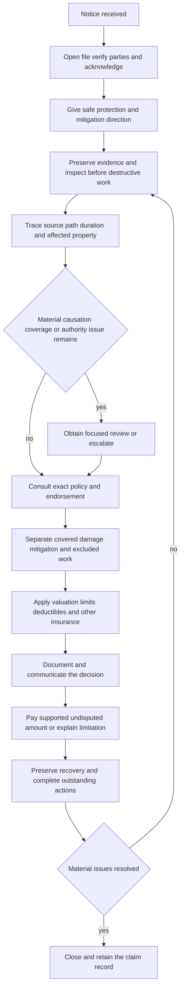

# Water Loss Handling

## Purpose and governing boundary

This page is internal claim-handling guidance. It organizes work from notice through closure; it does not create, expand, restrict, or waive coverage. The attached policy, declarations, exact endorsement edition, and applicable law control the result. The Property Claims Handling Manual likewise controls internal role and authority practices without altering coverage ([Water Loss Claim Handling Guidance H.0.1–H.0.2](repo://guidelines/claims/water-loss-handling.md#L13-L23); [Manual 1.A and 1.F–1.G](repo://manuals/claims/manual.md#L15-L19); [Manual 1.F–1.G](repo://manuals/claims/manual.md#L45-L55)).

Keep these decisions distinct in the file:

1. **Source and causation:** where the water began, how it traveled, when it occurred, and what caused it.
2. **Resulting damage and mitigation:** what property was physically damaged, what emergency work was reasonable, and what is source repair, maintenance, improvement, or unrelated work.
3. **Coverage consultation:** which policy, endorsement, exclusion, condition, limit, deductible, settlement term, and state control apply.
4. **Scope and valuation:** what supported covered work costs under the applicable valuation basis.
5. **Payment, recovery, and closure:** who is paid, what remains disputed, what recovery rights are preserved, and whether material work remains open.

An inspection, estimate, mitigation authorization, reserve, reservation of rights, or partial payment is not acceptance of the whole claim. An estimate measures claimed work; it does not decide coverage ([Manual 1.I–1.J](repo://manuals/claims/manual.md#L63-L73); [Water guidance H.6.7 and H.7.3–H.7.8](repo://guidelines/claims/water-loss-handling.md#L487-L505); [HO-3 2024-03 S.23–S.24](repo://forms/HO/MS/HO-3/2024-03.md#L757-L761)).

## Handling lifecycle

*Figure 1. Operational water-loss lifecycle grounded in the water-loss guidance, Property Claims Handling Manual Chapters 1–3, applicable policy forms, and state claim controls; it is not a coverage decision tree.*

## 1. Intake, notice, and immediate protection

### Open, verify, and acknowledge

Open a distinct claim file when a report may involve covered property, mitigation, or a coverage question. Record the reporter, reported source, loss location, affected property, discovery date, policy and party information, and facts that remain unverified. Make prompt contact, explain the handler’s role and requested information, and document the method, recipient, and next action ([Water guidance H.6.1–H.6.3 and H.6.49–H.6.50](repo://guidelines/claims/water-loss-handling.md#L481-L485); [Manual 1.B–1.E](repo://manuals/claims/manual.md#L21-L49); [Manual 1.C–1.D](repo://manuals/claims/manual.md#L27-L37)).

Use the notice rule in the contract actually in force; do not turn one endorsement’s deadline into a universal rule. Examples in this source set are:

- **HO 04 90 (2027-01):** notice within 30 days after discovery under its W.5 condition ([HO 04 90 W.5.1](repo://forms/HO/MS/HO-04-90/2027-01.md#L791-L795)).
- **DP 04 95 (2021-05):** reporting within 30 days after the loss under its W.5 condition ([DP 04 95 W.5](repo://forms/DP/MS/DP-04-95/2021-05.md#L347-L359)).
- **HO-3 2024-03:** prompt notice stating known facts, damaged property, and location; the cited base condition does not state a 30-day period ([HO-3 P.51](repo://forms/HO/MS/HO-3/2024-03.md#L567-L575)).

Give safe instructions to protect property, retain damaged materials when practical, and describe emergency work already performed. Internal handling guidance requires reasonable mitigation to begin within three days after discovery; that is an operational control, not a coverage grant or replacement for a contract duty ([Water guidance H.6.8–H.6.10](repo://guidelines/claims/water-loss-handling.md#L495-L499); [Manual 3.A and 3.C](repo://manuals/claims/manual.md#L709-L727)). Do not direct unsafe entry or work; sewage, contamination, unsafe occupancy, structural instability, and other hazards require appropriate qualified review ([Manual 3.R–3.S](repo://manuals/claims/manual.md#L813-L823); [Manual 3.BK](repo://manuals/claims/manual.md#L1083-L1087)).

### Reservations and information requests

If known facts may limit or preclude coverage but a final position is not supportable, use approved reservation language within ten days after identifying those facts. State the known facts, potentially applicable policy wording, and investigation still needed; a reservation is not a denial or acceptance ([Water guidance H.6.4–H.6.6](repo://guidelines/claims/water-loss-handling.md#L487-L493)). Request only information reasonably related to cause, damage, ownership, mitigation, valuation, coverage, or another material claim issue ([Manual 1.M](repo://manuals/claims/manual.md#L87-L91); [Water guidance H.6.27–H.6.30](repo://guidelines/claims/water-loss-handling.md#L533-L539)).

## 2. Establish source, path, duration, and damage connection

Investigate physical facts before adopting an insured, vendor, or contractor label. Establish:

- **Source:** plumbing, appliance, fixture, heating or cooling system, sprinkler, roof opening, drain, sewer, sump, surface water, groundwater, condensation, or another source.
- **Path:** where water first appeared and how it traveled through fixtures, drains, walls, floors, cavities, adjacent rooms, and connected assemblies. The wettest or most visible area is not necessarily the origin.
- **Duration and recurrence:** discovery date, sudden or gradual development, repeated leakage, seepage, prior repairs, staining, corrosion, decay, odor, moisture records, occupancy, weather, and witness accounts.
- **Cause-to-damage connection:** direct physical damage from the event, damage to the failed source component, resulting damage, pre-existing or recurring damage, maintenance, betterment, and delayed or avoidable additional damage.

The manual requires source identification before a coverage position, inspection before demolition when conditions permit, qualified findings when the source is uncertain, and referral for uncertain duration, repeated leakage, or progressive deterioration ([Manual 3.B–3.H](repo://manuals/claims/manual.md#L717-L757); [Manual 3.I](repo://manuals/claims/manual.md#L759-L763)). A prior loss is an investigation lead, not proof that current damage is excluded; compare location, source, chronology, repairs, and pre-loss condition and document what cannot be allocated ([Water guidance H.5.1–H.5.8](repo://guidelines/claims/water-loss-handling.md#L395-L409)).

For backup and sump allegations, confirm whether water emerged through a sewer or drain, from a sump system, or from another route. Inspect drains, cleanouts, the sump, pump, alarm, discharge path, power condition, blockage, backflow device, and external drainage as facts require. Standing water near a drain or sump does not establish backup. The manual specifically requires the handler to classify the system, inspect sump arrangements, and refer uncertain backflow-device conditions ([Manual 3.J–3.M](repo://manuals/claims/manual.md#L765-L787)).

For roof or exterior entry, distinguish a covered event that created an opening from long-term deterioration, defective maintenance, surface water, flood, groundwater, or water entering through an existing opening. Interior staining alone does not establish a covered entry path ([Manual 3.N](repo://manuals/claims/manual.md#L789-L793); [HO-3 P.38](repo://forms/HO/MS/HO-3/2024-03.md#L541-L545)).

## 3. Evidence preservation and mitigation control

Preserve the evidence needed to answer cause, duration, scope, valuation, coverage, and recovery questions:

- notice, chronology, statements, occupancy, access limits, prior-loss history, and attempted contacts;
- photographs or recordings showing source, context, water lines, migration, affected assemblies, contents, exterior conditions, and pre-demolition condition;
- failed pipes, hoses, valves, pumps, appliances, fittings, removed materials, samples, plumber or engineer findings, and service records when material;
- moisture readings, drying and mitigation logs, equipment records, itemized invoices, estimates, work orders, receipts, and proof of payment; and
- ownership, mortgagee or lienholder, other-insurance, salvage, and potentially responsible-party information.

Protect the inspection opportunity and do not authorize disposal or permanent destructive work before reasonable review unless immediate protection, safety, or legal requirements make it necessary. Record what was unavailable, altered, removed, or discarded and why ([Manual 1.K–1.M](repo://manuals/claims/manual.md#L75-L91); [Manual 3.E](repo://manuals/claims/manual.md#L735-L739); [Manual 3.AA–3.AB](repo://manuals/claims/manual.md#L867-L877)).

Keep emergency stabilization, extraction, drying, containment, cleaning, temporary protection, access, permanent repair, replacement, and remediation as separate estimate categories. Review each charge for necessity, reasonableness, affected area, relation to the reported event, authorized scope, and support. Verify moisture conditions before reconstruction and do not approve an upgrade, elective remodeling, or unrelated maintenance ([Manual 3.V–3.Z](repo://manuals/claims/manual.md#L837-L865); [Manual 3.AZ–3.BA](repo://manuals/claims/manual.md#L1017-L1027); [Water guidance H.7.25–H.7.29](repo://guidelines/claims/water-loss-handling.md#L639-L649)). Mitigation approval is not approval of permanent work or the full claim.

## 4. Coverage consultation: use the exact policy assembly

Before a coverage position, record the line, form edition, declarations, loss date, attached endorsements, relevant definitions, grants, exclusions, conditions, deductible, limit, and settlement terms. Apply the base form and acting endorsement together; a limit cannot create coverage that the base form excludes.

| Reported mechanism | Consultation control |
|---|---|
| Accidental plumbing or appliance discharge | Under HO-3 2024-03, accidental discharge or overflow may cause direct physical loss, but continuous or repeated seepage is excluded and the system or appliance from which water escaped is not covered. Separate the source component from resulting property damage ([HO-3 P.29–P.33](repo://forms/HO/MS/HO-3/2024-03.md#L523-L533)). |
| Sewer or drain backup or sump overflow under HO-3 | HO-3 2024-03 excludes sewer, drain, and sump pathways unless the applicable water-backup endorsement is attached. Verify attachment; do not rely on the base form’s reference to a limit ([HO-3 X.7–X.11](repo://forms/HO/MS/HO-3/2024-03.md#L593-L601)). |
| HO 04 90 (2027-01) attached | The endorsement covers direct physical loss from defined Water Backup or Sump Discharge or Overflow, including resulting damage and reasonable protective measures. It expressly permits sudden or gradual events, but retains exclusions for flood, surface water, repeated leakage, maintenance, defective equipment, and other stated causes ([HO 04 90 W.1](repo://forms/HO/MS/HO-04-90/2027-01.md#L62-L117); [HO 04 90 W.2 exclusions](repo://forms/HO/MS/HO-04-90/2027-01.md#L254-L321)). |
| DP-3 2026-01 with DP 04 95 attached | DP-3 excludes sewer or drain backup and sump overflow unless DP 04 95 is attached and separately limits loss subject to a backup-and-sump-overflow limit. DP 04 95 supplies the grant and retains its own exclusions and duties ([DP-3 X.6–X.7](repo://forms/DP/MS/DP-3/2026-01.md#L1459-L1466); [DP 04 95 W.1](repo://forms/DP/MS/DP-04-95/2021-05.md#L41-L81)). |
| Flood, surface water, groundwater, opening, or external runoff | Trace the actual entry path. Do not relabel external water as backup merely because it reached a drain or sump; apply the exact form and endorsement exclusions. DP-3, for example, separately excludes below-ground water and flood or surface water ([DP-3 X.4–X.5](repo://forms/DP/MS/DP-3/2026-01.md#L1451-L1457)). |

### Fungi, wet rot, dry rot, and bacteria

Inspect concealed, organic, and absorbent materials when water exposure makes fungi, wet rot, dry rot, or bacteria possible, but treat growth, odor, staining, or a health complaint as evidence to investigate rather than proof of covered microbial damage ([Manual 3.T–3.U](repo://manuals/claims/manual.md#L825-L835); [Mold Claim Handling](repo://guidelines/claims/mold-claim-handling.md#L82-L101)). Separate the original water event, resulting physical damage, testing, removal, access, remediation, pre-existing condition, and preventive or routine work.

HO-3 2024-03 excludes fungi, wet rot, dry rot, and bacteria except as provided by the attached HO 04 81 endorsement; the microbial remediation limit does not itself create coverage ([HO-3 X.28–X.29](repo://forms/HO/MS/HO-3/2024-03.md#L633-L637)). When HO 04 81 is attached, its grant requires a covered cause to first cause direct physical loss and the fungi to result from that loss. It may cover reasonable necessary removal, access, repair-related tear-out, remediation, and post-removal testing, subject to its exclusions and aggregate limit; it does not cover pre-existing, repeated-seepage, preventive, routine, or otherwise excluded work ([HO 04 81 W.0–W.1](repo://forms/HO/MS/HO-04-81/2018-09.md#L13-L91)). Refer microbial, contamination, health, habitability, or unsafe-occupancy issues rather than deciding them from a vendor label.

## 5. Scope, valuation, settlement, and payment

Build the scope in distinct categories:

1. covered direct physical damage to covered property;
2. reasonable emergency protection, drying, extraction, cleaning, and access tied to that damage;
3. failed-source repair or replacement, which may be excluded or separately limited;
4. pre-existing, recurring, deterioration, maintenance, code, betterment, matching, improvement, and unrelated work;
5. contents, ownership, cleaning, restoration, replacement, and any derivative loss-of-use issue; and
6. deductible, sublimit, aggregate-limit consumption, other insurance, salvage, payees, mortgagee or lienholder interests, and recovery.

Apply valuation, limits, and deductibles only after the covered portion and supported scope are established. Current examples are not interchangeable:

- **HO 04 90 (2027-01):** $10,000 aggregate maximum for water backup or sump discharge or overflow; reasonable protection and water-removal expenses fall within the limit; the $1,000 deductible applies to each covered loss after covered damage is determined and is not allocated separately among property categories from the same backup ([HO 04 90 W.2](repo://forms/HO/MS/HO-04-90/2027-01.md#L254-L316); [HO 04 90 W.3](repo://forms/HO/MS/HO-04-90/2027-01.md#L391-L435)).
- **DP 04 95 (2021-05):** $5,000 aggregate limit for Water Backup and Sump Overflow, reduced by payment, and a $1,000 deductible applied to covered loss after applicable limitations and exclusions ([DP 04 95 W.2](repo://forms/DP/MS/DP-04-95/2021-05.md#L113-L127); [DP 04 95 W.3](repo://forms/DP/MS/DP-04-95/2021-05.md#L179-L199)).
- **HO-3 2024-03:** its base Section I deductible must not be less than $1,000 unless modified by endorsement, but that minimum does not create backup coverage. Its dwelling replacement-cost treatment remains subject to the applicable settlement conditions ([HO-3 S.29–S.35](repo://forms/HO/MS/HO-3/2024-03.md#L765-L783)).

Use the settlement provision for the property and form at issue. Do not infer replacement-cost entitlement from an estimate; document repairability, replacement feasibility, pre-loss condition, depreciation where applicable, and any completion or documentation condition. The manual requires credible scope and pricing, separation of observed from unverified damage, and consideration of repairability, betterment, depreciation, salvage, and prior damage ([Manual 1.S–1.U](repo://manuals/claims/manual.md#L123-L139); [Manual 20.K–20.O](repo://manuals/claims/manual.md#L6691-L6719)).

Before payment, confirm authority, coverage position, valuation, deductible, limit consumption, prior payments, payee and interested-party information, other insurance, salvage, and recovery documentation. Use approved payment methods and do not split transactions to avoid authority limits. Issue a supported undisputed covered amount without waiting for an unrelated disputed item; explain a limitation or denial in writing using the applicable policy language and known facts ([Manual 1.Q–1.Z](repo://manuals/claims/manual.md#L111-L169); [Manual 12.36–12.47](repo://manuals/claims/manual.md#L4093-L4139); [Water guidance H.6.40–H.6.45](repo://guidelines/claims/water-loss-handling.md#L559-L569)). Under HO-3 2024-03, covered loss is payable within 60 days after agreement, final judgment, or filing of an appraisal award; appraisal determines amount of loss, not coverage or policy interpretation ([HO-3 S.35 and S.42–S.47](repo://forms/HO/MS/HO-3/2024-03.md#L781-L805)).

## 6. Authority, escalation, and recovery

Refer before commitment when:

- claimed, incurred, or reasonably anticipated exposure exceeds **$25,000**; referral must not wait for final value;
- source, duration, water path, evidence, competing estimates, exclusion, limitation, endorsement, condition, or valuation remains materially unresolved;
- hidden damage, extensive access, structural instability, sewage, contamination, microbial conditions, unsafe occupancy, or specialized testing or remediation is involved;
- shared property, landlord or tenant interests, an association, contractor, neighbor, utility, another insurer, or another responsible party may affect payment or recovery;
- altered documents, duplicate or unsupported invoices, suspected misrepresentation or fraud, representation, litigation, unfair-handling allegations, formal disputes, unusual releases, or compromise terms require controlled review; or
- the proposed investigation expense, mitigation, settlement, payment, waiver, or release exceeds assigned authority.

The water guidance sets the $25,000 referral threshold and requires referral for unresolved causation, prior-loss, scope, responsibility, contamination, fraud, representation, litigation, recovery, and unusual compromise issues ([Water guidance H.5.9–H.5.36](repo://guidelines/claims/water-loss-handling.md#L411-L465); [Water guidance H.7.4–H.7.5 and H.7.17–H.7.48](repo://guidelines/claims/water-loss-handling.md#L597-L599)). The manual separately requires referral above $25,000 before settlement or payment, prohibits dividing activity to evade authority, and distinguishes reserve authority from settlement authority ([Manual 1.V–1.W](repo://manuals/claims/manual.md#L141-L151); [Water guidance H.7.41–H.7.44](repo://guidelines/claims/water-loss-handling.md#L671-L679)).

A referral does not stop claim progress. Document the issue, facts, evidence preserved, requested decision, direction received, and responsible handler; continue communication, mitigation, investigation, and file documentation unless responsibility is reassigned. Preserve failed components, records, photographs, and responsible-party information. Do not release a responsible party or impair subrogation, contribution, salvage, or other recovery rights without approval ([Manual 1.AC–1.AD](repo://manuals/claims/manual.md#L183-L193); [Manual 3.AA–3.AB](repo://manuals/claims/manual.md#L867-L877)). Record fraud indicators neutrally and use the approved review process; do not accuse a party in routine communications ([Manual 1.AB](repo://manuals/claims/manual.md#L177-L181); [Water guidance H.7.39–H.7.40](repo://guidelines/claims/water-loss-handling.md#L667-L669)).

## 7. Illinois state-control overlay

For an Illinois water-backup claim, treat IDOI-2017-10 as a claims and disclosure control, not a coverage grant. For claims received on or after the bulletin’s effective date, the insurer must acknowledge promptly, identify the responsible handler, investigate reasonably before denial or limitation, request only material information, and evaluate the actual policy and endorsements rather than a generic water-damage description ([IDOI-2017-10 B.4.1–B.4.5](repo://bulletins/IL/idoi-2017-10-water-backup-disclosure.md#L189-L201)).

A denial, limitation, exclusion, condition, deductible, or valuation reduction requires a written explanation identifying the relied-on policy language and its application to known facts. The insurer must pay an undisputed covered portion unless barred by policy or law, consider reasonable mitigation, explain valuation and deductible treatment, provide understandable communications, maintain claim records, and provide a reasonable reconsideration process for material new information ([IDOI-2017-10 B.4.6–B.4.18](repo://bulletins/IL/idoi-2017-10-water-backup-disclosure.md#L201-L225)). These controls do not override the contract or import the bulletin’s disclosure figures into every policy.

At transaction level, the Illinois disclosure must distinguish backup from flood, surface water, seepage, and other water damage; identify sewer, drain, and sump treatment, limits, deductibles, exclusions, and conditions; and remain consistent with the filed policy and endorsement. Preserve the version delivered and any selection or rejection. The bulletin’s stated disclosure amount is not a universal contract limit ([IDOI-2017-10 B.1–B.3](repo://bulletins/IL/idoi-2017-10-water-backup-disclosure.md#L13-L77); [IDOI-2017-10 B.5](repo://bulletins/IL/idoi-2017-10-water-backup-disclosure.md#L231-L249)).

## 8. Closure and reopening

Do not close merely because visible surfaces are dry, mitigation is complete, or a vendor invoice is paid. Before closure, the file must show the classified source and duration, inspection and evidence limitations, mitigation and scope review, exact policy and endorsement consultation, coverage decision, valuation, limit and deductible treatment, payment or denial, communications, authority approvals, recovery status, retained-evidence disposition, and remaining issues. The manual requires material coverage, payment, recovery, and complaint issues to be resolved before closure and requires reopening when new material information affects the claim ([Manual 1.AT–1.AU](repo://manuals/claims/manual.md#L285-L295); [Manual 3.BH–3.BI](repo://manuals/claims/manual.md#L1065-L1075)).

Preserve claim notes, photographs, estimates, correspondence, recordings, and payment records. Reopen when credible new information may affect source, causation, scope, coverage, damages, payment, or recovery rights ([Water guidance H.6.43–H.6.54](repo://guidelines/claims/water-loss-handling.md#L565-L587); [Manual 12.42–12.45](repo://manuals/claims/manual.md#L4117-L4131)).

## Source map

- [Water Loss Claim Handling Guidance](repo://guidelines/claims/water-loss-handling.md)
- [Property Claims Handling Manual](repo://manuals/claims/manual.md)
- [Water Losses 101](repo://training/water-losses-101.md)
- [HO-3 2024-03](repo://forms/HO/MS/HO-3/2024-03.md)
- [HO 04 90 Water Backup and Sump Discharge or Overflow 2027-01](repo://forms/HO/MS/HO-04-90/2027-01.md)
- [DP-3 2026-01](repo://forms/DP/MS/DP-3/2026-01.md)
- [DP 04 95 Water Backup 2021-05](repo://forms/DP/MS/DP-04-95/2021-05.md)
- [HO 04 81 Limited Fungi 2018-09](repo://forms/HO/MS/HO-04-81/2018-09.md)
- [Mold Claim Handling](repo://guidelines/claims/mold-claim-handling.md)
- [Illinois water-backup disclosure bulletin](repo://bulletins/IL/idoi-2017-10-water-backup-disclosure.md)
