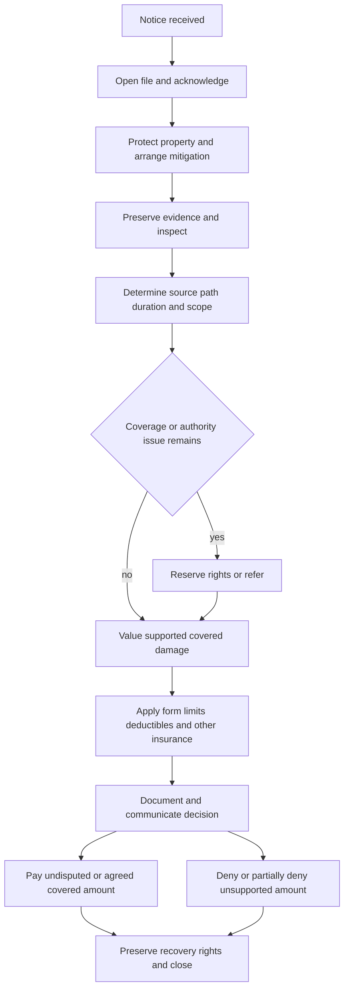

# Water Loss Handling

## Governing boundary

This page is internal claims-handling direction, not a coverage grant, exclusion, deductible, limit, waiver, or policy interpretation. Use it to move a reported loss from notice to resolution; determine coverage from the policy and endorsements actually in force on the date of loss. The internal guidance expressly says it is non-contractual (**H.0.1–H.0.2**, **H.0.11**). Investigation, inspection, mitigation authorization, a reserve, or a partial payment does not by itself accept the full claim or waive policy rights (**H.6.7**, **H.7.3**, **H.7.6–H.7.8**).

Keep coverage analysis separate from damage measurement. A contractor label, moisture reading, stain, odor, invoice, or prior loss is evidence to evaluate—not coverage authority. Record reported facts separately from verified findings, preserve conflicts, and escalate material uncertainty rather than forcing an early conclusion.

## Handling lifecycle

*This flow shows the operational lifecycle; every branch remains subject to the policy, attached endorsement, and applicable law.*

## 1. Intake, notice, and immediate protection

1. **Open and identify the claim.** Establish a distinct claim file when the report may involve covered property, mitigation, or a coverage question. Record the reported source, affected locations, discovery date, and reporter; confirm the named insured, loss location, policy status, and claimed property before discussing coverage (**H.6.1–H.6.3**).
2. **Acknowledge and set expectations.** Meet the applicable acknowledgement requirement, record the communication, explain the process, and keep the insured informed when more investigation is needed (**H.6.49–H.6.50**). Use conditional language and do not promise payment (**H.6.7**, **H.7.14–H.7.16**).
3. **Apply the contract-specific notice rule.** Do not substitute a universal 30-day rule for the form in force:
   - **HO 04 90 (2027-01):** its W.5 Conditions W.1 requires notice within 30 days after the loss is discovered and requires the affected location and known circumstances (`repo://forms/HO/MS/HO-04-90/2027-01.md#L791-L795`).
   - **HO 04 27 (2016-05):** its W.5 Conditions W.5 requires reporting within 30 days after the loss occurs (`repo://forms/HO/MS/HO-04-27/2016-05.md#L323-L337`).
   - **DP 04 95 (2021-05):** its W.5 Conditions W.5 requires reporting within 30 days after the loss (`repo://forms/DP/MS/DP-04-95/2021-05.md#L347-L359`).
   - **HO-3 2024-03:** the base form requires prompt notice stating the insured, location, and available circumstances; it does not state a 30-day period in the cited condition (`repo://forms/HO/MS/HO-3/2024-03.md#L711-L725`).
4. **Give safety and mitigation instructions immediately.** Tell the insured to protect property, retain damaged materials when practical, and describe emergency work already performed (**H.6.8–H.6.9**). The internal operational threshold is to begin reasonable mitigation within three days after discovery (**H.6.10**). Emergency mitigation within authority is not acceptance of the entire claim (**H.7.6–H.7.8**).
5. **Reserve rights when facts require it.** When facts may limit or preclude coverage but do not support a final decision, issue a reservation of rights within ten days after identifying those facts (**H.6.4–H.6.6**). State the known facts, potentially applicable policy language, and remaining investigation; distinguish the reservation from a denial or acceptance.

## 2. Establish source, path, duration, and damage connection

Investigate physical facts before adopting the insured's, vendor's, or contractor's label. Establish where water began, how it moved, where it first appeared, what it contacted, when it was discovered, what was done to stop it, and whether earlier leaks or repairs existed. A water-loss investigation must independently establish:

- **Source:** plumbing, appliance, heating or cooling system, sprinkler, roof opening, drain, sewer, sump, surface water, groundwater, condensation, or another source. Request a plumber or comparable source report when inspection cannot confirm the cause (**H.6.12–H.6.19**).
- **Path:** trace movement through fixtures, drains, walls, floors, cavities, and adjacent spaces. The wettest or most visible area is not necessarily the origin (**H.6.13–H.6.15**).
- **Duration and recurrence:** compare staining, swelling, corrosion, decay, odor, moisture readings, prior repairs, and witness accounts. Discovery date is not necessarily onset. Prior loss alone does not establish that current damage is excluded (**H.5.1–H.5.8**, **H.5.17–H.5.20**).
- **Cause-to-damage connection:** allocate direct physical damage, the failed source component, resulting damage, pre-existing or recurring damage, maintenance, and betterment. Do not treat water presence, dampness, mold, staining, or a contractor label as proof of a covered cause (**H.6.15–H.6.18**, **H.6.34–H.6.35**).

The HO-3 base form illustrates the required distinction: it excludes continuous or repeated seepage or leakage, covers accidental discharge or overflow from listed systems, and does not cover the system or appliance from which water escaped (`repo://forms/HO/MS/HO-3/2024-03.md#L485-L531`). Its base exclusions also exclude sewer, drain, and sump backup and retain flood, surface-water, and below-ground-water exclusions (`repo://forms/HO/MS/HO-3/2024-03.md#L475-L493`).

## 3. Contract-specific coverage checkpoints

Use the attached endorsement together with the acted-on base form. The examples below are handling checkpoints, not independent grants of coverage.

| Reported mechanism | Handling checkpoint | Evidence to apply together |
|---|---|---|
| Plumbing, appliance, heating, cooling, or sprinkler discharge | Confirm accidental discharge, direct physical loss, the failed part, resulting damage, and any repeated-seepage, deterioration, maintenance, freezing, or opening issue. | HO-3 base (`repo://forms/HO/MS/HO-3/2024-03.md#L485-L543`) and applicable endorsement terms |
| Sewer or drain backup; sump discharge or overflow on HO-3 | The HO-3 base excludes these causes. HO 04 90 changes the base result only through its attached coverage for water backup and sump discharge or overflow, including sudden or gradual events, while retaining stated flood, surface-water, maintenance, failed-equipment, and other exclusions. | Base exclusions (`repo://forms/HO/MS/HO-3/2024-03.md#L485-L493`); HO 04 90 coverage and exclusions (`repo://forms/HO/MS/HO-04-90/2027-01.md#L62-L117`, `repo://forms/HO/MS/HO-04-90/2027-01.md#L119-L186`) |
| HO 04 27 limited water damage | Covers specified accidental discharge or overflow and certain breaking, cracking, burning, bulging, or freezing events, including the stated source-component treatment; it excludes sewer, drain, and sump backup and retains its other stated exclusions. | HO 04 27 (`repo://forms/HO/MS/HO-04-27/2016-05.md#L41-L91`); use the attached HO-4 base form for unchanged terms |
| DP 04 95 dwelling-property water backup | Provides its own grant for water or waterborne material backing through a sewer or drain and for sump overflow or discharge, subject to its direct-cause requirement, emergency-measure treatment, and exclusions. | DP 04 95 (`repo://forms/DP/MS/DP-04-95/2021-05.md#L41-L81`); use the attached DP base form for unchanged terms |
| Flood, surface water, groundwater, or external entry | Do not reclassify external water as backup merely because it reached a drain or sump. Trace the entry path and apply the base form and endorsement exclusions. | HO-3 base (`repo://forms/HO/MS/HO-3/2024-03.md#L485-L493`); HO 04 90 (`repo://forms/HO/MS/HO-04-90/2027-01.md#L119-L138`); DP 04 95 (`repo://forms/DP/MS/DP-04-95/2021-05.md#L61-L75`) |

For roof, wall, foundation, window, or door entry, establish the initiating event and opening. Under HO-3, interior rain or snow damage requires direct wind or hail damage to first create the opening (`repo://forms/HO/MS/HO-3/2024-03.md#L541-L545`). Interior staining or rainfall alone does not establish a covered opening.

## 4. Evidence preservation and mitigation

Preserve the condition that can answer cause, duration, scope, value, and recovery questions. The file should contain:

- the notice, chronology, statements, contact and occupancy information, and prior-loss history (**H.6.1–H.6.3**, **H.5.1–H.5.5**);
- photographs or recordings of the source, water path, affected building materials, contents, exterior conditions, and pre-repair condition (**H.6.13–H.6.15**);
- failed pipes, hoses, valves, appliances, pumps, removed materials, samples, and service-provider findings when material; do not authorize permanent or destructive work before a reasonable inspection opportunity unless immediate protection requires it (**H.6.15**, **H.6.20**);
- mitigation logs, moisture readings, drying records, itemized invoices, estimates, repair scopes, receipts, and proof of payment (**H.6.9**, **H.6.21–H.6.24**, **H.7.25–H.7.27**); and
- ownership, value, maintenance, other-insurance, mortgagee, lienholder, and responsible-party records when material (**H.6.29–H.6.30**, **H.6.36–H.6.37**).

Authorize or evaluate extraction, drying, stabilization, protection, and necessary access separately from permanent repair or replacement. Review necessity, reasonableness, affected areas, connection to the reported event, equipment use, and whether charges include maintenance, upgrades, or unrelated renovation. Do not wait for a final coverage decision to communicate reasonable protective steps, but use conditional language and preserve the full coverage review.

## 5. Scope, limits, valuation, and payment

Build the estimate in distinct categories:

1. covered direct physical damage;
2. reasonable emergency mitigation and access tied to that damage;
3. source-component repair or replacement, which may be excluded or separately treated;
4. pre-existing, recurring, deterioration, maintenance, code, improvement, matching, and unrelated work;
5. contents and any separate loss-of-use issue; and
6. salvage, other insurance, recovery, deductible, sublimit, and limit effects.

Apply limits and deductibles only after coverage and covered scope are established (**H.0.15**, **H.6.31**). The form-specific examples are:

- **HO 04 90 (2027-01):** the most payable for a water-backup or sump-discharge-or-overflow loss is **$10,000**, regardless of the number of insured persons, claims, or covered items. Reasonable prevention and water-removal expenses are included within that limit (`repo://forms/HO/MS/HO-04-90/2027-01.md#L254-L316`). The endorsement deductible is **$1,000** for each covered water-backup loss; it applies after covered loss is determined and is not allocated separately between dwelling, other structures, and personal property damaged by the same covered backup (`repo://forms/HO/MS/HO-04-90/2027-01.md#L391-L435`).
- **DP 04 95 (2021-05):** the water-backup and sump-overflow limit is **$5,000**; it applies across the covered loss from a single event and payments reduce what remains available (`repo://forms/DP/MS/DP-04-95/2021-05.md#L113-L127`). Its water-backup deductible is **$1,000**, applied to the covered loss after applicable limitations and exclusions, rather than separately to each item (`repo://forms/DP/MS/DP-04-95/2021-05.md#L179-L199`).
- **HO 04 27 (2016-05):** the most payable for water backup and sump overflow is **$2,500**, and the most payable for covered fungi, wet or dry rot, or bacteria loss is **$5,000**. The water-backup limit applies to the covered loss from an occurrence without increasing for multiple contributing causes or items; the fungi limit also applies to related covered testing, monitoring, removal, or treatment (`repo://forms/HO/MS/HO-04-27/2016-05.md#L93-L117`, `repo://forms/HO/MS/HO-04-27/2016-05.md#L127-L157`). Apply the deductible to the covered loss under the endorsement and base policy (`repo://forms/HO/MS/HO-04-27/2016-05.md#L159-L177`).
- **HO-3 2024-03 without a water-backup endorsement:** sewer, drain, and sump backup is excluded by the base form. The Section I deductible may not be less than **$1,000** unless modified by endorsement; that minimum does not create backup coverage (`repo://forms/HO/MS/HO-3/2024-03.md#L485-L493`, `repo://forms/HO/MS/HO-3/2024-03.md#L765-L779`).

The base form controls the settlement basis. HO-3 dwelling damage is replacement cost when the dwelling meets the 80-percent insured-to-value threshold, subject to the other loss-settlement terms (`repo://forms/HO/MS/HO-3/2024-03.md#L97-L121`). HO 04 90 requires covered direct physical loss and supports evidence-based repair, replacement, actual-cash-value, salvage, and like-kind valuation while excluding undamaged property and improvement (`repo://forms/HO/MS/HO-04-90/2027-01.md#L1146-L1210`, `repo://forms/HO/MS/HO-04-90/2027-01.md#L1225-L1276`). DP 04 95 likewise requires supported valuation, separates repair, replacement, actual cash value, salvage, and reasonable emergency measures, and limits payment to covered loss (`repo://forms/DP/MS/DP-04-95/2021-05.md#L497-L545`). Do not infer replacement-cost entitlement from an estimate alone.

Before payment, confirm authority, payees, mortgagee or lienholder interests, deductible, limit consumption, salvage, other insurance, and any required recovery documentation (**H.6.38**, **H.6.41–H.6.42**). Separate expense authority from indemnity authority (**H.7.9–H.7.11**) and do not use reserve authority as settlement authority (**H.7.41–H.7.43**). Issue supported undisputed payment without waiting for unrelated disputed items (**H.6.40**). Explain any denial or partial denial in writing and accurately quote or summarize the relied-on policy language (**H.6.43–H.6.45**). Under HO-3, covered loss is payable within 60 days after agreement, final judgment, or filing of an appraisal award; appraisal determines amount of loss, not coverage or policy interpretation (`repo://forms/HO/MS/HO-3/2024-03.md#L775-L805`).

## 6. Escalation and authority controls

Escalate before a commitment when:

- claimed, incurred, or reasonably anticipated exposure exceeds **$25,000**; refer early rather than waiting for final value (**H.5.9–H.5.10**);
- source or duration is unresolved, evidence conflicts, or an exclusion, limitation, condition, or endorsement issue could change coverage (**H.5.11–H.5.17**, **H.7.4–H.7.5**, **H.7.17–H.7.18**);
- the estimate includes hidden damage, extensive access, structural concerns, materially competing scopes, or unsupported mitigation charges (**H.5.21–H.5.23**, **H.7.20–H.7.27**);
- shared property, a landlord, tenant, association, contractor, neighbor, utility, or another insurer may have responsibility or recovery interest (**H.5.24–H.5.27**, **H.7.35–H.7.38**); or
- health or contamination concerns, microbial allegations, restricted access, unusual occupancy, altered documents, duplicate invoices, suspicious billing, suspected fraud, representation, litigation, unfair-handling allegations, or an unusual compromise require controlled review (**H.5.28–H.5.36**, **H.7.31–H.7.48**).

A referral does not stop claim progress. Document the issue, material facts, requested decision, direction received, and any reassignment; continue communication, investigation, and file documentation unless responsibility is expressly transferred (**H.7.46–H.7.49**). Do not accuse an insured or vendor of fraud in routine communications; route the concern to the proper review function (**H.7.39–H.7.40**).

## 7. Decision, recovery, closure, and reopening

The final file must show the accepted or unresolved source and duration analysis, covered and excluded damage, mitigation review, valuation basis, limits, deductible, authority, payment or denial, communications, and outstanding recovery issues (**H.6.43–H.6.45**, **H.6.52–H.6.53**). Preserve damaged components and responsible-party information, protect subrogation and contribution rights, and obtain required transfer or recovery documentation. The endorsement and base policy continue to matter at this stage: HO 04 90 requires preservation and cooperation for cause and amount review (`repo://forms/HO/MS/HO-04-90/2027-01.md#L463-L494`), while the HO-3 base form requires preservation of recovery rights and disclosure of other insurance (`repo://forms/HO/MS/HO-3/2024-03.md#L765-L767`, `repo://forms/HO/MS/HO-3/2024-03.md#L847-L851`).

Close only after documenting the coverage decision, payment status, unresolved issues, required communications, evidence disposition, and recovery handling (**H.6.43–H.6.54**). Do not close merely because visible surfaces are dry or a vendor invoice is paid; confirm that concealed migration, evidence, valuation, payees, recovery, and disputes have been addressed. Reopen when credible new information may affect coverage, damages, payment, or recovery rights (**H.6.54**).

## Source map

- Internal claims guidance: `guidelines/claims/water-loss-handling.md`, **H.0–H.7**.
- HO-3 base policy example: `forms/HO/MS/HO-3/2024-03.md`, **P.9–P.55**, **X.7–X.37**, **S.4–S.79**, and **A.10–A.23**.
- HO 04 90 water-backup endorsement: `forms/HO/MS/HO-04-90/2027-01.md`, **W.1–W.8**.
- HO 04 27 limited water-damage endorsement: `forms/HO/MS/HO-04-27/2016-05.md`, **W.1–W.5**.
- DP 04 95 dwelling-property water-backup endorsement: `forms/DP/MS/DP-04-95/2021-05.md`, **W.1–W.7**.
- Claims operations manual: `manuals/claims/manual.md`, Chapters 1–3 and the authority provisions used above.

Form editions, attached endorsements, declarations, and applicable law control over this operational summary.
