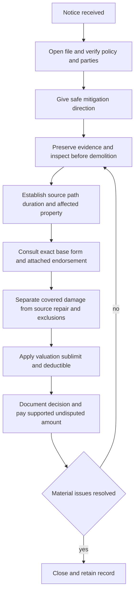

# Water Loss Handling

## Purpose and boundary

This is internal claims-handling guidance, not contract authority. The policy, declarations, attached endorsement, exact edition, and applicable law determine coverage. The claims manual governs investigation, documentation, authority, and payment handling; it does not create or expand coverage ([Claims Manual 1.A](repo://manuals/claims/manual.md#L13-L19); [Claims Manual 1.F–1.G](repo://manuals/claims/manual.md#L45-L55)).

Keep five questions separate: **what caused the water**, **what property was physically damaged**, **what mitigation was reasonable**, **what the exact policy and endorsement cover**, and **what valuation, limit, deductible, payment, and recovery steps remain**. An inspection, estimate, mitigation authorization, reserve, reservation, or partial payment is not acceptance of the whole claim ([Claims Manual 1.I–1.J](repo://manuals/claims/manual.md#L63-L73)).

## Investigation flow

```mermaid
flowchart TD
  notice["Notice received"] --> intake["Open file and verify policy and parties"]
  intake --> safe["Give safe mitigation direction"]
  safe --> preserve["Preserve evidence and inspect before demolition"]
  preserve --> trace["Establish source path duration and affected property"]
  trace --> consult["Consult exact base form and attached endorsement"]
  consult --> scope["Separate covered damage from source repair and exclusions"]
  scope --> value["Apply valuation sublimit and deductible"]
  value --> decision["Document decision and pay supported undisputed amount"]
  decision --> close{"Material issues resolved"}
  close -->|"no"| preserve
  close -->|"yes"| done["Close and retain record"]
```

*This flow shows the operational sequence; it is not a coverage decision tree.*

### Intake and immediate protection

Open a claim file on receiving a report that may involve covered property or mitigation. Record the reported source, loss date and location, policy, parties, affected property, discovery facts, and what remains unverified. Make prompt contact, explain the handler’s role, request material information, and document contacts ([Claims Manual 1.B–1.E](repo://manuals/claims/manual.md#L21-L49)). Give safe instructions to protect property and begin reasonable mitigation, but do not promise coverage or direct unsafe work. Sewage, contamination, structural instability, and unsafe occupancy require qualified review ([Claims Manual 1.O](repo://manuals/claims/manual.md#L99-L103)).

Use the notice and proof-of-loss duties in the contract actually attached. HO 04 90 (2026-01) replaces the 2010-10 edition for policies written on or after 2026-01-01, but the supplied endorsement itself states its coverage, sublimit, deductible, maintenance condition, and backflow requirement; do not import deadlines from another edition ([HO 04 90 2026-01](repo://forms/HO/MS/HO-04-90/2026-01.md#L1-L4)).

### Source, path, duration, and evidence

Do not adopt a label such as “flood,” “backup,” or “plumbing leak” without investigating. Establish:

- whether water came from a sewer or drain, sump system, fixture or appliance, roof or opening, surface water, or below-ground water;
- the first appearance and migration path, including walls, floors, cavities, and connected assemblies;
- sudden, gradual, repeated, or continuous development, prior losses, repairs, staining, corrosion, decay, occupancy, and weather; and
- the connection between the event and each item of direct physical damage, while separating failed-source repair, maintenance, betterment, pre-existing damage, and delayed damage.

Inspect before destructive work when conditions permit and use qualified resources for uncertain causation, duration, or progressive deterioration ([Claims Manual 1.K–1.N](repo://manuals/claims/manual.md#L75-L97)). Preserve photographs, water lines, moisture readings, failed pipes, pumps, valves, appliances, service records, plumber or engineer findings, mitigation logs, estimates, invoices, ownership information, and recovery-party details. Do not authorize disposal before review unless safety or emergency needs require it; record what was altered or unavailable and why ([Claims Manual 1.L–1.M](repo://manuals/claims/manual.md#L81-L91)).

Keep extraction, drying, cleaning, containment, temporary protection, source repair, permanent repair, replacement, remediation, and improvement as separate estimate categories. Mitigation approval is not approval of permanent work or the complete claim.

## HO 04 90 (2026-01): contract consultation

Confirm that HO-3 is the base form and that HO 04 90 2026-01 was attached for the loss date. The endorsement covers direct physical loss to Coverage A, B, and C property caused by water or waterborne material backing up through sewers or drains, or overflowing or discharging from a sump, sump pump, or related equipment. It applies whether or not the event results from mechanical breakdown of that equipment ([HO 04 90 W.1](repo://forms/HO/MS/HO-04-90/2026-01.md#L6-L11)). The base HO-3 agreement still requires direct physical loss to covered property from a covered peril, and coverage is subject to the policy terms ([HO-3 AGR.3](repo://forms/HO/MS/HO-3/2024-03.md#L19-L20)).

| Established fact | Handling and consultation control |
|---|---|
| Sewer or drain reverse flow, or sump discharge or overflow | Confirm the water path and resulting direct physical loss. Do not treat nearby standing water as proof of backup; inspect drains, cleanouts, the sump, pump, discharge line, alarm, power, and external drainage. |
| Flood, surface water, waves, storm surge, or body-of-water overflow | HO 04 90 W.4 excludes loss caused by these conditions, and HO-3 Section I Exclusions A.1 remains in full effect ([HO 04 90 W.4](repo://forms/HO/MS/HO-04-90/2026-01.md#L25-L29)). Preserve evidence of weather, runoff, entry path, and water level rather than relabeling external water as backup. |
| Water below ground, pressure, seepage, or leakage through a foundation or building | HO 04 90 W.4 preserves the below-ground-water exclusion and HO-3 A.2 ([HO 04 90 W.4](repo://forms/HO/MS/HO-04-90/2026-01.md#L31-L33)). Distinguish this path from water that backed up through a sewer or drain. |
| Known, remediable maintenance failure | HO 04 90 W.5 excludes loss if the backup, overflow, or discharge resulted from the insured’s known failure to maintain the serving sewer line, drain, sump, or sump pump where a reasonable person would have remedied it ([HO 04 90 W.5](repo://forms/HO/MS/HO-04-90/2026-01.md#L35-L40)). Investigate notice, prior symptoms, repairs, and reasonableness; do not infer the condition solely from a vendor opinion. |
| Finished area below grade | Coverage applies only if a backwater valve or equivalent device was installed and operable on the serving sewer line at loss time ([HO 04 90 W.6](repo://forms/HO/MS/HO-04-90/2026-01.md#L42-L47)). Document installation, location, operability, inspection, and any evidence limitation. |
| Failed pump, drain, valve, or related equipment | W.1 includes events whether or not caused by mechanical breakdown, but the endorsement pays covered direct physical loss to described property, not automatically the failed equipment or maintenance work. Separate resulting damage, source repair, and any excluded contributing condition ([HO 04 90 W.1](repo://forms/HO/MS/HO-04-90/2026-01.md#L6-L11); [HO-3 AGR.3](repo://forms/HO/MS/HO-3/2024-03.md#L19-L20)). |

Do not use a sublimit as a coverage grant. Read the endorsement with the HO-3 form, declarations, and any other attached endorsements. The HO-3 agreement also says claim investigation or payment does not waive a policy term ([HO-3 AGR.9](repo://forms/HO/MS/HO-3/2024-03.md#L29-L33)).

## Limits, deductible, and valuation

HO 04 90 provides a **$10,000** maximum for all loss under the endorsement in one policy period unless a higher limit appears in the Declarations. The sublimit is part of, not in addition to, Coverage A, B, and C limits ([HO 04 90 W.2](repo://forms/HO/MS/HO-04-90/2026-01.md#L13-L18)). A separate **$1,000** deductible applies to each loss; the Section I deductible does not apply to loss covered under this endorsement ([HO 04 90 W.3](repo://forms/HO/MS/HO-04-90/2026-01.md#L20-L23)). Verify the Declarations before applying either figure.

Coverage A and B loss follows the attached policy’s settlement basis. Coverage C loss is settled at actual cash value regardless of a replacement-cost personal-property endorsement unless the Declarations state otherwise ([HO 04 90 W.7](repo://forms/HO/MS/HO-04-90/2026-01.md#L49-L56)). Apply the sublimit and deductible only after determining covered property, direct physical damage, exclusions, and supported reasonable scope. Separate source repair, maintenance, upgrades, and unrelated work.

## Authority, communication, and closure

Escalate unresolved causation, duration, maintenance, backflow-device compliance, complex mitigation, contamination, fraud indicators, competing estimates, recovery issues, or any commitment beyond assigned authority. Document the facts, evidence, question presented, direction received, and continuing owner. Do not divide payments or activity to evade authority. Keep coverage analysis distinct from valuation and explain limitations using the relied-on policy wording and known facts ([Claims Manual 1.F–1.J](repo://manuals/claims/manual.md#L45-L73)).

Before closure, record the source and path, evidence limits, mitigation and scope review, exact policy and endorsement, coverage decision, valuation, sublimit, deductible, payments, communications, authority approvals, and recovery status. Reopen when credible new information could affect source, scope, coverage, payment, or recovery. Preserve claim notes, photographs, estimates, correspondence, and payment records.

## Source map

- [HO 04 90 Water Backup and Sump Discharge or Overflow 2026-01](repo://forms/HO/MS/HO-04-90/2026-01.md)
- [HO-3 2024-03](repo://forms/HO/MS/HO-3/2024-03.md)
- [Property Claims Handling Manual](repo://manuals/claims/manual.md)
- [Water Backup and Sump Overflow](../../coverage/perils/water-backup.md)
