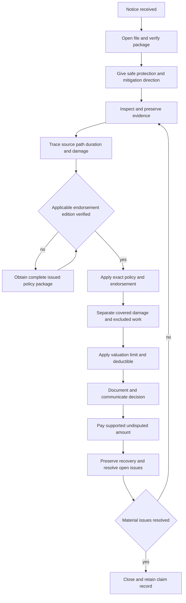

# Water Loss Handling

## Purpose and governing boundary

This page is internal claim-handling guidance. It organizes work from notice through closure; it does not create, expand, restrict, or waive coverage. The complete issued policy package, declarations, applicable endorsement edition, and applicable law control the result. The claims manual supplies operational roles and authority controls, not contract terms ([Water Loss Claim Handling Guidance H.0.1–H.0.2](repo://guidelines/claims/water-loss-handling.md#L13-L17); [Manual 1.A and 1.F–1.G](repo://manuals/claims/manual.md#L15-L19)).

Keep these questions separate in the file:

1. **Source and causation:** where water began, how it traveled, when it occurred, and what caused it.
2. **Damage and mitigation:** what property was physically damaged, what emergency work was reasonable, and what is source repair, maintenance, improvement, or unrelated work.
3. **Coverage consultation:** which policy, endorsement edition, exclusion, condition, limit, deductible, settlement term, and state control apply.
4. **Scope and valuation:** what supported covered work costs under the applicable valuation basis.
5. **Payment, recovery, and closure:** what is undisputed, who is paid, what recovery rights remain, and whether material work is open.

An inspection, mitigation authorization, reserve, reservation of rights, estimate, or partial payment is not acceptance of the whole claim. An estimate measures claimed work; it does not decide coverage ([Manual 1.I–1.J](repo://manuals/claims/manual.md#L63-L73)).

## Handling lifecycle

```mermaid
flowchart TD
    notice["Notice received"] --> intake["Open file and verify package"]
    intake --> protect["Give safe protection and mitigation direction"]
    protect --> preserve["Inspect and preserve evidence"]
    preserve --> trace["Trace source path duration and damage"]
    trace --> edition{"Applicable endorsement edition verified"}
    edition -->|"no"| obtain["Obtain complete issued policy package"]
    obtain --> edition
    edition -->|"yes"| consult["Apply exact policy and endorsement"]
    consult --> scope["Separate covered damage and excluded work"]
    scope --> value["Apply valuation limit and deductible"]
    value --> decision["Document and communicate decision"]
    decision --> pay["Pay supported undisputed amount"]
    pay --> recover["Preserve recovery and resolve open issues"]
    recover --> close{"Material issues resolved"}
    close -->|"no"| preserve
    close -->|"yes"| done["Close and retain claim record"]
```

*Figure 1. Edition-controlled operational water-loss lifecycle; it is not a coverage decision tree.*

## 1. Intake, protection, and evidence

Open a distinct claim file when a report may involve covered property, mitigation, or a coverage question. Record the reporter, location, reported source, affected property, discovery date, policy and party information, and facts still unverified. Acknowledge promptly, explain the handler’s role, request only material information, and document each contact and next action ([Water guidance H.0.5–H.0.9](repo://guidelines/claims/water-loss-handling.md#L23-L31); [Manual 1.B–1.E](repo://manuals/claims/manual.md#L21-L49)).

Use the notice and claim-payment rules in the contract and applicable law actually in force. Do not transplant a deadline, deductible, limit, or handling instruction from another edition or product. Give safe instructions to protect property and begin reasonable mitigation promptly; the claims manual’s three-day mitigation control is operational guidance, not a coverage grant ([Manual 3.A and 3.C](repo://manuals/claims/manual.md#L709-L727)). Do not direct unsafe entry or work; use qualified responders for sewage, contamination, structural instability, unsafe occupancy, or other hazards.

Before demolition or disposal when conditions permit, preserve photographs and recordings showing source, context, water lines, migration, affected assemblies, contents, exterior conditions, and pre-demolition condition. Retain failed pipes, hoses, valves, pumps, appliances, fittings, samples, professional findings, service records, moisture readings, drying logs, equipment records, invoices, estimates, ownership information, other-insurance information, and responsible-party details. Record anything unavailable, altered, removed, or discarded and why ([Manual 1.K–1.M](repo://manuals/claims/manual.md#L75-L91); [Manual 3.E](repo://manuals/claims/manual.md#L735-L739)).

Keep extraction, drying, containment, cleaning, temporary protection, access, permanent repair, replacement, and remediation in separate estimate categories. Review necessity, reasonableness, affected area, event connection, authorized scope, and documentation. Mitigation approval is not approval of permanent work or the full claim.

## 2. Establish source, path, duration, and damage connection

Investigate physical facts before adopting an insured, vendor, or contractor label. Establish:

- the source: plumbing, appliance, fixture, heating or cooling system, sprinkler, roof, drain, sewer, sump, surface water, groundwater, condensation, or another source;
- the path: where water first appeared and how it migrated through fixtures, drains, walls, floors, cavities, adjacent rooms, and connected assemblies;
- duration and recurrence: discovery date, sudden or gradual development, repeated leakage, prior repairs, staining, corrosion, decay, odor, moisture records, weather, occupancy, and witness accounts; and
- the connection to damage: direct physical damage, failed-source damage, resulting damage, pre-existing or recurring damage, maintenance, betterment, and avoidable additional damage.

The manual requires source identification before a coverage position, inspection before demolition when conditions permit, qualified findings when the source is uncertain, and referral for uncertain duration, repeated leakage, or progressive deterioration ([Manual 3.B–3.I](repo://manuals/claims/manual.md#L717-L763)). A prior loss is an investigation lead, not proof that current damage is excluded; compare location, source, chronology, repairs, and pre-loss condition.

For backup or sump allegations, confirm whether water emerged through a sewer or drain, from a sump system, or by another route. Inspect drains, cleanouts, sump, pump, alarm, discharge path, power, blockage, external drainage, and backflow equipment as facts require. Standing water near a drain or sump does not establish backup ([Manual 3.J–3.M](repo://manuals/claims/manual.md#L765-L787)). For exterior or roof entry, distinguish a covered event that created an opening from deterioration, defective maintenance, surface water, flood, groundwater, or an existing opening.

## 3. Coverage consultation: verify the edition first

Before applying an endorsement, verify the complete issued package: declarations, base form, attached endorsements, form numbers and editions, effective policy period, state attachments, and any amended limits or deductibles. Do not generalize 2026-01 HO 04 90 terms to 2010-10 or 2027-01 policies. Record the edition verification and the exact wording consulted.

Under the HO-3 2024-03 base form, accidental discharge or overflow may cause direct physical loss, while continuous or repeated seepage is excluded and the system or appliance from which water escaped is not covered. Separate the failed source component from resulting property damage ([HO-3 2024-03 P.29–P.33](repo://forms/HO/MS/HO-3/2024-03.md#L523-L533)). The base form excludes sewer, drain, and sump pathways unless the applicable endorsement is attached; a reference to a limit does not itself create coverage ([HO-3 2024-03 X.7–X.11](repo://forms/HO/MS/HO-3/2024-03.md#L593-L601)).

### HO 04 90 edition 2026-01

Apply this section only when the issued package shows HO 04 90 edition 2026-01 attached to the HO-3 policy. The form states that it replaces 2010-10 for policies written on or after 2026-01-01; it does not authorize treating other editions as identical ([HO 04 90 2026-01 front matter](repo://forms/HO/MS/HO-04-90/2026-01.md#L1-L4)).

- **Coverage trigger:** cover direct physical loss to Coverage A, B, or C property caused by water or waterborne material backing up through sewers or drains, or overflowing or discharging from a sump, sump pump, or related equipment. Mechanical breakdown of the equipment does not by itself defeat the trigger ([W.1](repo://forms/HO/MS/HO-04-90/2026-01.md#L6-L11)). Confirm the actual path; water merely found near a drain or sump is insufficient.
- **Sublimit:** the most payable for all loss under the endorsement in one policy period is **$10,000**, unless the Declarations show a higher endorsement limit. It is part of, not additional to, the Coverage A, B, and C limits ([W.2](repo://forms/HO/MS/HO-04-90/2026-01.md#L13-L18)). Track payments and remaining aggregate capacity.
- **Deductible:** a separate **$1,000** deductible applies to each endorsement loss. The Section I deductible does not apply to loss covered here ([W.3](repo://forms/HO/MS/HO-04-90/2026-01.md#L20-L23)). Apply it only after determining qualifying covered loss, not to unrelated water damage.
- **Exclusions:** the endorsement retains exclusion for flood, surface water, waves, tidal water, storm surge, and overflow of a body of water, and for water below the ground surface that pressures, seeps, or leaks through a building, foundation, or pool. Section I Exclusions A.1 and A.2 continue to apply ([W.4](repo://forms/HO/MS/HO-04-90/2026-01.md#L25-L33)). Trace the entry route rather than relabeling external water as backup.
- **Known maintenance failure:** no endorsement coverage applies when the backup, overflow, or discharge resulted from the insured’s known failure to maintain the serving sewer line, drain, sump, or sump pump and a reasonable person would have remedied it ([W.5](repo://forms/HO/MS/HO-04-90/2026-01.md#L35-L40)). Document what was known before loss and the evidence of reasonable remedial action.
- **Below-grade backflow condition:** when the residence has finished area below grade, coverage applies only if a backwater valve or equivalent device was installed and operable on the serving sewer line at the time of loss. This is new in 2026-01 and did not appear in 2010-10 ([W.6](repo://forms/HO/MS/HO-04-90/2026-01.md#L42-L47)). Verify installation, service, operation, and disputed facts; refer uncertain conditions rather than assuming compliance or failure.
- **Coverage C valuation:** Coverage A and B use the policy’s stated settlement basis, but Coverage C loss is settled at **actual cash value**, regardless of a replacement-cost personal-property endorsement, unless the Declarations state otherwise for HO 04 90 ([W.7](repo://forms/HO/MS/HO-04-90/2026-01.md#L49-L56)). Apply depreciation and obsolescence consistently with the policy’s actual-cash-value definition ([HO-3 2024-03 DEF.1](repo://forms/HO/MS/HO-3/2024-03.md#L41-L47)).

## 4. Scope, valuation, payment, and escalation

Build scope in distinct categories: covered direct physical damage; reasonable emergency protection and drying; failed-source repair; pre-existing, recurring, deterioration, maintenance, code, betterment, matching, improvement, and unrelated work; contents and ownership; and deductible, endorsement sublimit, aggregate consumption, other insurance, salvage, payees, mortgagee or lienholder interests, and recovery.

Apply valuation, limits, and deductibles only after coverage and supported scope are established. Do not infer replacement-cost entitlement from an estimate. Document repairability, replacement feasibility, pre-loss condition, depreciation where applicable, and any completion or documentation condition. Issue a supported undisputed covered amount without waiting for an unrelated disputed item; explain every limitation or denial in writing using the applicable policy language and known facts ([Manual 1.Q–1.Z](repo://manuals/claims/manual.md#L111-L169)).

Refer before commitment when exposure exceeds **$25,000**, or when source, duration, path, evidence, exclusion, endorsement edition, maintenance condition, backflow condition, valuation, contamination, responsibility, fraud, litigation, recovery, or authority remains materially unresolved. Referral does not stop mitigation, communication, investigation, or documentation ([Manual 1.V–1.W](repo://manuals/claims/manual.md#L141-L151); [Manual 3.G and 3.M](repo://manuals/claims/manual.md#L747-L751)). Preserve failed components and recovery information; do not release responsible parties or impair subrogation without approval.

## 5. Closure and reopening

Do not close merely because visible surfaces are dry, mitigation is complete, or an invoice is paid. The file must show source and duration, inspection and evidence limitations, mitigation and scope review, exact policy and endorsement edition, coverage decision, valuation, limit and deductible treatment, payment or denial, communications, approvals, recovery status, retained evidence, and remaining issues. Reopen when credible new information may affect source, causation, scope, coverage, damages, payment, or recovery rights ([Manual 1.AT–1.AU](repo://manuals/claims/manual.md#L285-L295); [Manual 3.BH–3.BI](repo://manuals/claims/manual.md#L1065-L1075)).

## Source map

- [Water Loss Claim Handling Guidance](repo://guidelines/claims/water-loss-handling.md)
- [Property Claims Handling Manual](repo://manuals/claims/manual.md)
- [Water Losses 101](repo://training/water-losses-101.md)
- [HO-3 2024-03](repo://forms/HO/MS/HO-3/2024-03.md)
- [HO 04 90 2026-01](repo://forms/HO/MS/HO-04-90/2026-01.md)
