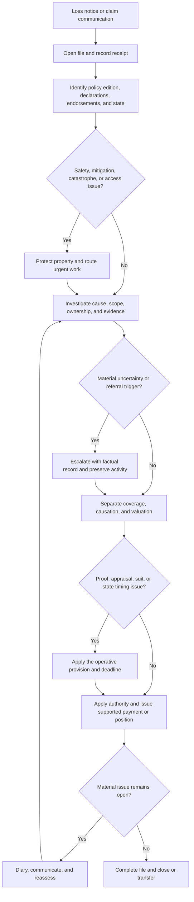

# Claims Manual: Conditions, Authority, and State Operations

## Scope and governing rule

This page is internal claims guidance. It organizes work; it does not create, expand, restrict, waive, or reinterpret coverage. The applicable policy edition, declarations, attached endorsements, state-specific forms, applicable law, and verified loss facts control the claim. The claims manual's escalation amounts, diary targets, and handling instructions are internal controls, not customer-facing policy deadlines or coverage terms.

The operative contract must be assembled before a material coverage or payment position is communicated:

1. Identify the policy and edition in force on the date of loss.
2. Confirm the declarations, insured location, limits, deductibles, and attached endorsements.
3. Apply a state form or endorsement when it changes the base policy. For example, the Florida HO 01 09 endorsement says it forms part of the policy and controls over conflicting policy language, while unchanged policy terms remain in effect (**T.1–T.10**).
4. Read the applicable condition, coverage grant, exclusion, limitation, and valuation provision together with the verified facts.
5. Apply regulatory requirements to the handling and communication layer without substituting them for contract language.

A superseded edition can remain operative for policies written under it. The Mississippi HO-3 2018-09 form identifies the 2024-03 form as superseding it only for policies effective on or after 2024-03-01; therefore, edition selection cannot be inferred from the most recent file in the repository.

### Three layers that must remain separate

| Layer | What it controls | What it cannot do |
| --- | --- | --- |
| **Contract** | Coverage, exclusions, conditions, proof, appraisal, suit, deductibles, valuation, and payment triggers for the operative policy | It is not replaced by a manual shortcut or a generic practice |
| **Regulatory or state** | Required notices, administration, disclosure, timing, and conduct in the applicable jurisdiction | It does not automatically amend a policy unless the controlling law or form does so |
| **Internal operations** | Assignment, authority, escalation, documentation, vendor controls, diaries, and referrals | It cannot create coverage, shorten a contractual period, or turn an internal threshold into a policy term |

The North Carolina claims bulletin illustrates the boundary: it requires policy terms, deductibles, limits, conditions, exclusions, and endorsements to be applied according to the contract and law, and says the bulletin does not alter coverage (**B.1.9–B.1.16**). Florida's hurricane-deductible bulletin similarly governs disclosure and consistency of consumer materials, while expressly stating that it does not alter policy coverage (**B.1.1–B.1.18**). Texas prompt-payment guidance requires fair, timely administration and contract-based evaluation, but does not replace the policy's operative conditions (**B.1.1–B.1.18**).

## Authority and state-routing flow

Use this flow at intake and again whenever a material fact, policy provision, state requirement, or dispute changes. The assigned handler owns the file and deadline controls; inspectors, contractors, vendors, and appraisers supply evidence or specialized work but do not make an unauthorized coverage commitment.

*Caption: Authority and state-routing sequence from notice through investigation, dispute controls, payment, and file closure.*

### Intake and file ownership

Open a claim record when loss information is received, including an informal communication asserting property damage or requesting benefits. Record the source, reported facts, location, date and circumstances, reporting party, contact route, assigned handler, and any immediate safety or mitigation condition. Verify representative authority before disclosing material claim information. Acknowledgment should confirm receipt and next steps without promising coverage, payment, or repair approval.

Preserve a chronological activity record. Keep material verbal and electronic communications, requests, inspection records, photographs, estimates, invoices, proof-of-loss material, referrals, approvals, and payment evidence retrievable in the file. Correct material errors transparently rather than overwriting the original record. These are operational controls in manual Chapters 2 and 12, and they also implement the record, communication, and delegation responsibilities described by the North Carolina and Texas bulletins.

At intake, route rather than decide when the file presents a material trigger: unsafe conditions, fire or structural concerns, water or contamination, suspected fraud or misrepresentation, catastrophe, governmental involvement, disputed cause or scope, unusual valuation, other insurance, ownership or mortgagee conflict, attorney or public-adjuster representation, appraisal or mediation demand, complaint, regulatory inquiry, threatened suit, or a material authority issue. Document the observed facts and referral recipient; do not label unproven conduct as fraud or promise the referral outcome.

## Separate the claim questions

Use four distinct work products in the file:

- **Coverage:** Does the operative contract cover this property and this loss, after grants, exclusions, limitations, conditions, endorsements, and law are applied?
- **Causation:** What event or condition caused the claimed damage, and what evidence supports that conclusion?
- **Scope and valuation:** What property was physically damaged, what repair or replacement restores the covered loss, and how do the policy valuation terms apply?
- **Payment and authority:** What amount is supported and who may approve, communicate, compromise, or issue it?

An inspection, estimate, vendor report, payment, reservation of rights, proof of loss, or appraisal award does not automatically answer all four questions. A request for information, inspection, estimate, or proof of loss is not itself a denial, and payment or investigation is not an admission of coverage under the Florida endorsement (**T.49**). For water losses, first identify the source and path, distinguish sudden discharge from seepage or maintenance conditions, separate mitigation from permanent repairs, and preserve failed components and visual evidence. The water-loss guidance is operational only; it directs the handler back to the applicable grant, exclusions, conditions, endorsements, and valuation terms (**H.0.1–H.0.18**, **H.1.1–H.1.46**).

### Authority boundaries and escalation

A handler may gather facts, arrange safe inspection, request material information, coordinate authorized mitigation, evaluate supported scope, and issue payment or correspondence only within delegated authority. Do not allow an inspector or vendor to decide coverage, a contractor to dictate the claim scope, or an internal approval threshold to become a condition imposed on the insured. Payment, denial, settlement, release, nonstandard reservation language, or a material adverse position requires the authority specified by the carrier's procedures and the applicable state and contract controls.

Escalate with a concise factual record when the matter exceeds delegated authority or involves material complexity, disputed coverage or causation, high severity, legal or regulatory contact, catastrophe operations, fraud or recovery potential, structural or environmental risk, or an unresolved state or endorsement question. The manual's examples include referral above $25,000, disputed coverage, reservation of rights, governmental or code enforcement, appraisal or other dispute demands, and many specialized exposures (**19.A–19.BE**). Catastrophe operations use a separate event and resource-control path and refer incurred exposure above $50,000 to catastrophe leadership before commitments beyond delegated authority (**13.A–13.D**). Those amounts are internal routing controls; they do not change policy limits, proof periods, suit limitations, or payment deadlines.

## Proof of loss and cooperation

Start with the policy or endorsement that actually applies. Request only information material to the reported loss, claimed amount, ownership, valuation, or coverage issue. State what is needed, why it matters, where it must be sent, and the controlling deadline. Acknowledge receipt without treating the submission as acceptance of coverage or the claimed amount; identify specific deficiencies and allow a meaningful correction path when the material information is missing.

A proof of loss records the insured's asserted facts and amount. Compare it with the notice, inspection findings, photographs, invoices, estimates, ownership information, and other evidence. Keep the insured's presentation separate from the carrier's independent coverage, causation, and valuation analysis. Issue an authorized undisputed covered amount when supported rather than holding it solely because another portion remains disputed. Refer material misstatements, altered records, or unexplained valuation changes for special review without accusing the insured without supporting facts.

The deadline is contract- and jurisdiction-specific. The Mississippi HO-3 2024-03 conditions require a signed, sworn proof within 90 days after the insurer's request and specify the information to state (**S.13–S.19**). The Florida HO 01 09 2023-07 endorsement identifies a sworn-proof deadline but directs the handler to the endorsement and policy for the actual duty (**T.13**, **T.39–T.49**); do not import the Mississippi 90-day period into Florida. Record any authorized accommodation, extension, withdrawal, revised proof, and delivery evidence in the chronology.

## Appraisal, suit, and payment

### Appraisal is a valuation process

First classify the dispute. Appraisal is for the amount of a covered loss, not for coverage, policy interpretation, causation, exclusions, or compliance with policy conditions. The Mississippi HO-3 2024-03 form permits a written demand when the parties disagree about amount, requires each appraiser to be selected within 30 days, separates amount of loss and actual cash value, and states that appraisal does not determine coverage or policy interpretation (**S.42–S.47**). The manual correspondingly requires prompt issue analysis, impartial appraiser selection, umpire handling, award review, and separate coverage referral (**11.R–11.AF**).

Record the demand date, issues submitted, carrier appraiser and conflict review, umpire activity, materials provided, award scope, and unresolved defenses. Do not ask an appraiser to decide coverage. Apply an award only after confirming that it is facially usable and that coverage and conditions support payment. The Mississippi form makes loss payable after agreement, final judgment, or filing of an appraisal award and requires payment of the covered amount within 60 days after the applicable event (**S.35**, **S.46–S.48**). Do not generalize that trigger or period to another form edition or state.

### Suit and legal escalation

Forward a demand, complaint, summons, legal paper, or material threatened action to the designated claim authority or counsel. Preserve the complete claim file and suspend routine destruction or alteration of potentially relevant records. After suit, coordinate examinations, statements, inspections, document requests, settlement, and communications with authorized counsel while continuing appropriate claim evaluation unless counsel or claim authority directs otherwise.

The Mississippi HO-3 2024-03 form requires an insured to commence an action within two years after the date of loss and requires policy conditions to be met (**S.48–S.50**). Other forms may use different language or defer to applicable law; the handler must quote and analyze the operative provision rather than apply a generic “two-year” rule. Do not communicate a time-bar position without authority or legal review.

### Prompt payment and undisputed amounts

Create a prompt-payment diary from the documented receipt event, identify the governing jurisdiction and form, record material information requests, and monitor decision and payment triggers. A claim is ready for decision when requested material information is available; immaterial missing items must not become a reason for delay. Communicate acceptance, partial acceptance, denial, limitation, payment basis, deductions, and remaining disputed issues in clear claim-specific language. Verify payees, mortgagees, liens, authority, payment purpose, and delivery; investigate returned or rejected payments.

The Florida HO 01 09 2023-07 endorsement requires acceptance or rejection within 85 business days after receiving requested items and payment of an accepted claim within 20 business days (**T.31–T.34**). Mississippi HO-3 2024-03 uses a different payment condition: 60 days after agreement, final judgment, or filing of an appraisal award (**S.35**). The Texas bulletin emphasizes prompt acknowledgment, reasonable investigation, contract-based evaluation, payment when due, and payment of undisputed amounts without conditioning them on unrelated disputes (**B.1.1–B.1.18**, **B.2.1–B.2.24**). The North Carolina bulletin likewise requires a reasonable investigation, prompt payment of undisputed amounts when due, clear explanations, and records sufficient to support material decisions (**B.1.1–B.1.17**, **B.2.1–B.2.17**). These are not interchangeable deadlines.

## Catastrophe operations

A concentrated event requires an event designation and common identifier, but catastrophe routing does not change the underlying coverage analysis. Confirm the reported cause before coding the event, verify the insured and location, prioritize safety and habitability, and use remote inspection when access is unsafe or restricted. Separate emergency mitigation from permanent repair, preserve cause and origin evidence before demolition or disposal, and communicate status without promising coverage or payment.

Catastrophe leadership controls event-level resources and elevated authority. Monitor unassigned, inactive, delayed, transferred, and reopened files; reconcile duplicate payments and payees; preserve secure records during field deployment; and transition remaining claims to ordinary handling without treating event closure as the end of claim obligations. Internal catastrophe controls require referral for incurred exposure above $50,000 before commitments beyond delegated authority, but this is not a policy deductible, limit, or customer deadline (**13.A–13.D**, **13.G–13.R**, **13.BG–13.BN**).

State administration still applies during a catastrophe. For Florida hurricane deductibles, the OIR bulletin requires clear, conspicuous, policy-consistent disclosure, including the trigger, calculation basis, and relationship to other deductibles; it also requires records and correction of material inconsistencies (**B.2.1–B.2.25**, **B.2.35–B.2.52**). That disclosure regime does not authorize applying a deductible unsupported by the policy. Verify the actual policy, endorsement, declarations, notice, event facts, and applicable law before communicating deductible application.

## Ordinance or law

Treat ordinance-or-law handling as a separate coverage and scope analysis, not as an automatic upgrade allowance. Confirm all of the following before including an amount:

1. A covered direct physical loss occurred to covered property.
2. The claimed building component and the undamaged component, if any, are identified separately.
3. The authority having jurisdiction—not only a contractor—has supplied an applicable, enforceable requirement for the insured location, occupancy, and repair scope.
4. The estimate identifies the baseline repair absent the requirement and the incremental compliant work, including any required demolition, permits, professional services, testing, or inspections.
5. Elective improvements, betterments, capacity increases, aesthetics, unrelated maintenance, land-use costs, and duplicated direct-repair amounts are removed or separately allocated.
6. The policy's ordinance-or-law grant, limit, exclusions, timing, and documentation duties support the resulting amount.

The Mississippi HO-3 2024-03 form covers increased costs to comply with an ordinance or law regulating construction, repair, or demolition of a building when it applies to damaged portions; it separately addresses required demolition of undamaged portions, sets a 15 percent Coverage A additional limit, and excludes pre-loss noncompliance, land-use enforcement, loss in value, and pollutant-related costs (**E.36–E.40**). The manual requires authority confirmation, separate baseline and compliant estimates, documentation of permits and completed work, and referral of condemnation, unsafe-structure, or disputed enforcement issues (**16.A–16.BN**). Do not use an estimate label to create coverage; resolve unclear coverage through the applicable form and authority process.

## Focused operational checks

Before issuing a material position, the handler or reviewer should be able to answer “yes” to these checks:

- Is the policy edition, state form, endorsement precedence, declarations, deductible, and loss date documented?
- Are reported facts, observed facts, expert opinions, authority statements, and coverage conclusions distinguishable in the file?
- Are coverage, causation, scope, valuation, and payment authority separately analyzed?
- Are proof-of-loss, appraisal, suit, decision, and payment periods taken from the operative contract or controlling law rather than an internal diary target?
- Are undisputed covered amounts being handled without waiting for an unrelated dispute?
- Has every material referral preserved evidence, identified an owner, and stated what direction is needed?
- Are catastrophe codes, ordinance authority records, payment reconciliation, representative authority, and legal preservation complete where applicable?
- Does the final communication state what was decided, what remains open, the controlling basis, and the next action without unsupported promises?

The final file summary should identify the operative provisions, material facts, referrals and approvals, chronology, accepted or disputed components, payments and payees, unresolved reservations, and the basis for closure or transfer.

## Evidence map

- [Claims manual, intake, authority, and documentation (Chapters 2 and 19)](repo://manuals/claims/manual.md#L389-L707) [repo://manuals/claims/manual.md#L6287-L6627)
- [Claims manual, proof of loss, appraisal, suit, and payment](repo://manuals/claims/manual.md#L3603-L3949) [repo://manuals/claims/manual.md#L3953-L4319)
- [Claims manual, catastrophe operations](repo://manuals/claims/manual.md#L4323-L4717)
- [Claims manual, ordinance or law](repo://manuals/claims/manual.md#L5313-L5779)
- [Mississippi HO-3 2024-03, conditions and payment](repo://forms/HO/MS/HO-3/2024-03.md#L801-L899)
- [Mississippi HO-3 2024-03, ordinance or law](repo://forms/HO/MS/HO-3/2024-03.md#L483-L491)
- [Florida HO 01 09 2023-07, precedence and claim handling](repo://forms/HO/FL/HO-01-09/2023-07.md#L13-L55) [repo://forms/HO/FL/HO-01-09/2023-07.md#L403-L503)
- [Florida hurricane deductible disclosure bulletin](repo://bulletins/FL/oir-2022-01-hurricane-deductible.md#L13-L49) [repo://bulletins/FL/oir-2022-01-hurricane-deductible.md#L59-L89)
- [North Carolina claims handling bulletin](repo://bulletins/NC/ncdoi-2021-06-claims-handling.md#L13-L47) [repo://bulletins/NC/ncdoi-2021-06-claims-handling.md#L49-L165)
- [Texas prompt-payment bulletin](repo://bulletins/TX/b-2019-02-prompt-payment.md#L13-L49) [repo://bulletins/TX/b-2019-02-prompt-payment.md#L51-L135)
- [Water-loss handling guidance](repo://guidelines/claims/water-loss-handling.md#L13-L57) [repo://guidelines/claims/water-loss-handling.md#L59-L151)
- [Superseded Mississippi HO-3 2018-09 edition notice](repo://forms/HO/MS/HO-3/2018-09.md#L1-L9)
