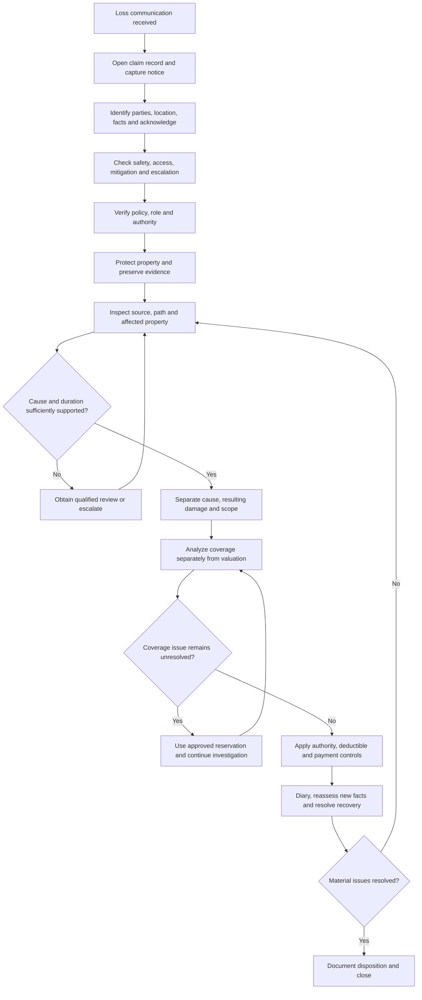

# Claims Manual: Intake, Investigation, and Mitigation

This page organizes Property Claims Handling Manual Chapters 1–3 as an operating workflow. It applies to property claims assigned to the carrier and keeps the adjuster within the assigned role and authority. The manual is internal guidance: it does not alter coverage, create an insured obligation, waive a condition, or create coverage through correspondence ([Manual 1.A](repo://manuals/claims/manual.md#L15-L19); [Manual 1.G](repo://manuals/claims/manual.md#L51-L55)). The applicable policy, endorsements, and law control the coverage result.

## Workflow at a glance

*Figure 1. Internal intake-to-investigation flow grounded in Property Claims Handling Manual Chapters 1–3 and the cited water-loss handling procedures.*

The flow is not a coverage decision tree. “Coverage” is a controlled analysis step after facts are developed, while mitigation and evidence preservation proceed when safe and reasonably necessary. An inspection, estimate, mitigation authorization, reservation of rights, or partial payment does not by itself establish acceptance of the whole claim ([Manual 1.I–1.J](repo://manuals/claims/manual.md#L63-L73); [Manual 2.AB–2.AC](repo://manuals/claims/manual.md#L497-L503); [Water guidance H.7.3–H.7.8](repo://guidelines/claims/water-loss-handling.md#L595-L605)).

## 1. Intake: recognize, open, and orient the file

### Treat the first report as a claim notice

Open a claim record when loss information is received. A communication asserting property damage, loss, or a request for benefits is notice even if it does not use formal claim language. Capture the source and substance of the report, assigned claim identifier, handler, reported date and circumstances, loss location, and information still unverified ([Manual 2.A–2.E](repo://manuals/claims/manual.md#L389-L407)). The same control applies to a water loss that may involve covered property, mitigation, or a coverage question ([Water guidance H.6.1–H.6.3](repo://guidelines/claims/water-loss-handling.md#L481-L485)).

At intake, record:

- reporting party, named claimant or representative, relationship to the property, reliable contact information, and any authority that still needs verification;
- the location exactly as reported, date of loss or discovery, reported source and circumstances, affected property, occupancy, access limits, and work already started;
- emergency services, restoration vendors, contractors, public authorities, other insurance, warranties, service plans, and possible responsible parties;
- preferred communication method, language or accommodation needs, and any immediate safety or property-protection condition.

Do not turn this first account into a coverage conclusion. Use neutral questions, preserve the claimant’s description, distinguish reported facts from handler observations, and record the source of each material fact ([Manual 2.E, 2.P, 2.Q, 2.R, 2.S, 2.T](repo://manuals/claims/manual.md#L405-L467)). For water losses, start with where water came from, where it traveled, and what it affected; the training module treats those as the basic fact pattern rather than a substitute for investigation ([Water Losses 101 L.1.1–L.1.6](repo://training/water-losses-101.md#L13-L27); [Water Losses 101 L.2.1–L.2.8](repo://training/water-losses-101.md#L61-L75)).

### Acknowledge and triage

Acknowledge receipt clearly and on time without promising payment, repair approval, or coverage. Explain the next steps in plain language and document the method, recipient, date, questions, and any escalation ([Manual 2.K–2.M](repo://manuals/claims/manual.md#L429-L439)). Check for safety hazards, active damage, suspected criminal activity, fire-origin concerns, structural instability, hazardous or contaminated conditions, and access barriers. Give reasonable protective guidance when appropriate, but do not direct unsafe entry or work; escalate specialist conditions without delay ([Manual 2.F–2.G](repo://manuals/claims/manual.md#L409-L415); [Manual 2.R](repo://manuals/claims/manual.md#L457-L459); [Manual 3.BK](repo://manuals/claims/manual.md#L1083-L1087)).

Before closing intake, check for related loss reports, prior activity, and duplicate notices without consolidating distinct losses prematurely. Identify representatives, contractors, public adjusters, lenders, and other interested parties, and verify their authority before disclosing material information or routing communications ([Manual 2.H–2.J](repo://manuals/claims/manual.md#L417-L427)). Close the intake task only after the file contains reported facts, acknowledgment status, assigned handler, referrals, and pending actions ([Manual 2.CA–2.CB](repo://manuals/claims/manual.md#L701-L707)).

## 2. Early controls: policy, role, authority, and reservations

### Establish the control boundary before commitments

Document the assigned claim role, authority status, and restrictions from claim leadership. Verify policy status and that the reported loss concerns the policy under review before extending coverage guidance or authorizing payment. Review the applicable policy terms and approved interpretations before stating a coverage position ([Manual 1.A, 1.E–1.F](repo://manuals/claims/manual.md#L15-L19); [Manual 1.E–1.F](repo://manuals/claims/manual.md#L39-L49)). An adjuster may investigate, evaluate, negotiate, or pay only within delegated authority; the adjuster may not waive conditions, alter policy terms, or create coverage by correspondence ([Manual 1.G](repo://manuals/claims/manual.md#L51-L55)).

A referral is required before committing the carrier when the evaluated loss exceeds **$25,000**. Obtain approval for settlement or payment above assigned authority, consider total claim exposure rather than dividing transactions, and document the evaluated amount, referral, approval, and authority response ([Manual 1.V–1.W](repo://manuals/claims/manual.md#L141-L151)). Water guidance likewise separates investigation or expense authority from indemnity authority and requires referral when exposure or a coverage issue exceeds the handler’s authority ([Water guidance H.7.1–H.7.11](repo://guidelines/claims/water-loss-handling.md#L591-L611)).

### Manage timing without converting it into coverage

The key internal timing controls are:

1. **Acknowledgment:** acknowledge the report by the applicable claim-contact or acknowledgment deadline and escalate anything that may prevent timely acknowledgment ([Manual 1.D](repo://manuals/claims/manual.md#L33-L37); [Manual 2.K–2.L](repo://manuals/claims/manual.md#L429-L435)).
2. **Reservation of rights:** when known facts may limit or preclude coverage but investigation must continue, use approved language and issue the reservation within **10 days**. State the known facts, potentially applicable policy language, and investigation needed; do not use vague or unsupported language ([Manual 2.X–2.Z](repo://manuals/claims/manual.md#L481-L491); [Water guidance H.6.4–H.6.7](repo://guidelines/claims/water-loss-handling.md#L487-L493)). A reservation is not a denial, acceptance, or payment commitment. Continue fact gathering and necessary mitigation unless an authorized coverage resource directs otherwise ([Manual 2.AB–2.AE](repo://manuals/claims/manual.md#L497-L511)).
3. **Water mitigation:** the manual directs mitigation to begin promptly and, when covered water affects insured property, within **3 days after discovery** ([Manual 3.A](repo://manuals/claims/manual.md#L709-L715)). The water guidance repeats the instruction to begin reasonable mitigation within 3 days after discovery of water damage ([Water guidance H.6.8–H.6.10](repo://guidelines/claims/water-loss-handling.md#L495-L499)). This is an operational direction to reduce additional damage, not a promise that the resulting expense or claim is covered.

The applicable policy may impose a different or additional insured duty. For example, the attached HO 04 90 endorsement requires notice within 30 days after discovery and requires reasonable protection, access, preservation, evidence, and mitigation ([HO 04 90 W.5.1–W.5.13](repo://forms/HO/MS/HO-04-90/2027-01.md#L367-L423)). That contract language must be analyzed for the policy and endorsement actually in force; the internal three-day handling instruction cannot replace or amend it.

## 3. Investigation: develop cause, path, duration, and scope

### Start with source and entry path

Do not state a coverage position until the water source is identified as far as the evidence permits. Determine whether water came from within or outside the location and distinguish plumbing discharge, appliance or fixture overflow, drain or sewer backup, sump discharge, roof or wind-driven entry, surface water, seepage, groundwater, and other external paths ([Manual 3.B–3.D](repo://manuals/claims/manual.md#L717-L733)). Ask when the water was discovered and what conditions existed immediately before and after discovery. Assess whether the event was sudden and accidental or involved uncertain duration, repeated leakage, or progressive deterioration; refer when the duration or causation issue remains material ([Manual 3.F–3.G](repo://manuals/claims/manual.md#L741-L751)).

For water-loss source development:

- inspect accessible plumbing, appliances, fixtures, supply lines, drains, sewers, sump equipment, discharge arrangements, roof areas, exterior drainage, grading, and openings as the reported facts require;
- trace water beyond the first visible area into adjacent rooms, connected assemblies, cavities, flooring, walls, ceilings, insulation, cabinetry, and contents;
- separate the failed source component from resulting water damage, and separate building damage from personal-property damage;
- compare the insured’s account with photographs, moisture findings, repair records, vendor observations, weather or utility information, and witness statements;
- document pre-existing staining, rot, corrosion, deterioration, prior repairs, recurring conditions, and any competing explanation without treating them as an automatic denial.

These are investigation controls, not coverage outcomes. Chapter 3 requires inspection before demolition when conditions permit, representative evidence when emergency work prevents a complete inspection, and qualified findings when the source cannot be reliably identified ([Manual 3.E, 3.H, 3.O–3.P](repo://manuals/claims/manual.md#L735-L757); [Manual 3.O–3.P](repo://manuals/claims/manual.md#L795-L805)). The training module reinforces that a stain, moisture reading, contractor label, or insured description is evidence to evaluate with the rest of the file, not conclusive causation by itself ([Water Losses 101 L.2.15–L.2.16, L.2.69–L.2.80](repo://training/water-losses-101.md#L89-L91); [Water Losses 101 L.2.77–L.2.80](repo://training/water-losses-101.md#L213-L219)).

### Preserve evidence and document limitations

Protect the carrier’s opportunity to inspect and evaluate damaged property. Request preservation of failed pipes, hoses, valves, appliance parts, damaged materials, photographs, recordings, estimates, invoices, statements, moisture records, expert opinions, and relevant repair or service records when practical and safe. Do not authorize disposal of material evidence before necessary review; record what was unavailable, altered, removed, or discarded and why ([Manual 1.K–1.M](repo://manuals/claims/manual.md#L75-L91); [Manual 2.N–2.O](repo://manuals/claims/manual.md#L441-L447)).

Photograph both context and detail: source area, water path, affected assemblies, damaged personal property, exterior conditions, moisture patterns, temporary protection, and the pre-demolition condition. Record who supplied each opinion or statement and distinguish reported information, observed findings, and expert conclusions. If access, safety, demolition, or prior repairs prevent complete observation, document the limitation and the substitute evidence used ([Manual 3.E, 3.BL, 3.BQ](repo://manuals/claims/manual.md#L735-L739); [Manual 3.BL](repo://manuals/claims/manual.md#L1089-L1093); [Manual 3.BQ](repo://manuals/claims/manual.md#L1119-L1123)).

Refer technically complex, unsafe, contaminated, disputed, or otherwise specialized conditions. Qualified resources may assist with cause, scope, valuation, repairability, engineering, environmental conditions, or recovery, but the carrier retains the claim decision and authority review ([Manual 1.K, 1.N](repo://manuals/claims/manual.md#L75-L97); [Manual 2.BN–2.BO](repo://manuals/claims/manual.md#L649-L655); [Manual 3.R–3.T](repo://manuals/claims/manual.md#L813-L829)).

### Control mitigation and repair activity

Mitigation is reasonable protective action to prevent additional damage, not permanent restoration. Encourage safe emergency measures such as stopping an active discharge, removing standing water, drying affected materials, protecting unaffected property, or temporary protection. Authorize only within assigned authority and keep the approval conditional; mitigation approval is not acceptance of the full claim ([Manual 3.C](repo://manuals/claims/manual.md#L723-L727); [Water guidance H.7.6–H.7.8](repo://guidelines/claims/water-loss-handling.md#L601-L605)).

Review mitigation and restoration in separate categories:

- **Emergency work:** when it began, the condition addressed, affected areas, equipment and materials used, safety basis, and whether it was reasonably necessary;
- **Permanent work:** proposed repair or replacement, supported damage, repairability, access or demolition, and any betterment, maintenance, upgrade, redesign, or unrelated renovation;
- **Evidence and cost:** photographs before work, moisture records, itemized invoices, estimates, work orders, vendor identity, and explanation for charges that are unsupported, duplicated, excessive, or unrelated.

Do not direct nonemergency work beyond authority or require permanent repairs before cause and scope are reasonably documented. Reinspect or obtain support before reconstruction when drying or hidden moisture remains uncertain ([Manual 3.V–3.Z](repo://manuals/claims/manual.md#L837-L865); [Manual 3.AZ–3.BA](repo://manuals/claims/manual.md#L1017-L1027); [Water guidance H.6.11, H.6.20–H.6.24](repo://guidelines/claims/water-loss-handling.md#L501-L527)).

## 4. Keep coverage, scope, payment, and recovery distinct

### Coverage analysis follows fact development

The investigation establishes facts; it does not decide what the policy covers. Review the applicable declarations, form edition, endorsements, definitions, grants, exclusions, conditions, deductibles, limits, and settlement terms against verified facts. Keep coverage issues and valuation issues in distinct file entries, and do not treat an estimate as a coverage decision ([Manual 1.F, 1.I–1.J](repo://manuals/claims/manual.md#L45-L73)).

For example, the HO-3 2024-03 form provides direct-physical-loss coverage subject to exclusions and conditions, excludes sewer or drain backup and sump overflow unless a water-backup endorsement is attached, and separately describes accidental plumbing discharge and continuous or repeated leakage ([HO-3 AGR.3, AGR.9](repo://forms/HO/MS/HO-3/2024-03.md#L15-L31); [HO-3 P.9–P.12, P.29–P.33](repo://forms/HO/MS/HO-3/2024-03.md#L569-L623)). If HO 04 90 2027-01 is actually attached, its terms modify the policy where they conflict and provide the stated backup or sump coverage subject to its conditions and limit ([HO 04 90 W.1–W.13](repo://forms/HO/MS/HO-04-90/2027-01.md#L15-L39); [HO 04 90 W.1–W.14](repo://forms/HO/MS/HO-04-90/2027-01.md#L41-L69)). The adjuster must not generalize that example to a policy that does not contain the endorsement.

### Scope and payment controls

Build the estimate from credible scope, pricing, condition, repairability, replacement feasibility, pre-loss condition, betterment, depreciation, salvage, and prior damage. Clearly identify observed damage versus unverified reported damage. A water-loss scope should connect each material category of damage and each mitigation expense to the reported event, while identifying unrelated maintenance, renovation, or prior-condition work separately ([Manual 1.S–1.U](repo://manuals/claims/manual.md#L123-L139); [Manual 3.BA, 3.BM–3.BN](repo://manuals/claims/manual.md#L1023-L1027); [Manual 3.BM–3.BN](repo://manuals/claims/manual.md#L1095-L1105)).

Apply the applicable deductible only after confirming the relevant coverage and allocation. Reconcile prior payments, advances, recoveries, payees, mortgagees, lienholders, and other interests before releasing funds. A payment, partial payment, estimate, or reserve is not permission to bypass authority or make duplicate payment ([Manual 1.Q–1.R](repo://manuals/claims/manual.md#L111-L121); [Manual 1.X–1.Y](repo://manuals/claims/manual.md#L153-L163)). Issue an undisputed covered amount when it can be determined without waiting for an unrelated disputed item, but preserve the unresolved issue and required approval ([Water guidance H.1.29–H.1.30](repo://guidelines/claims/water-loss-handling.md#L117-L119)).

### Preserve recovery and handle sensitive issues neutrally

Identify subrogation, salvage, contribution, recovery, other insurance, and potentially responsible parties early. Preserve failed components, records, photographs, and contacts, and do not release a responsible party or compromise recovery rights without approval ([Manual 1.AC–1.AD](repo://manuals/claims/manual.md#L183-L193); [Manual 3.AA–3.AB](repo://manuals/claims/manual.md#L867-L877)). Screen for altered evidence, duplicate or unsupported invoices, inconsistent accounts, and other fraud indicators, but record factual indicators and refer through the designated process without accusing a party ([Manual 1.AB](repo://manuals/claims/manual.md#L177-L181); [Manual 3.BE](repo://manuals/claims/manual.md#L1047-L1051)). Protect claim information, verify identity and authority, and use approved channels ([Manual 1.AF, 1.AW](repo://manuals/claims/manual.md#L201-L211); [Manual 1.AW](repo://manuals/claims/manual.md#L303-L307)).

## 5. Diary, reassess, and close deliberately

Maintain a chronological activity record, current diary, outstanding-information list, referrals, authority decisions, communications, evidence log, mitigation status, coverage analysis, valuation, payment ledger, and recovery actions. Reassess when new facts, estimates, policy information, or expert findings materially change source, duration, scope, exposure, or coverage analysis ([Manual 2.AI–2.AK](repo://manuals/claims/manual.md#L525-L535); [Manual 1.AH, 1.AR](repo://manuals/claims/manual.md#L213-L217); [Manual 1.AR](repo://manuals/claims/manual.md#L273-L277); [Manual 3.BD](repo://manuals/claims/manual.md#L1041-L1045)).

Do not close while material coverage, payment, recovery, complaint, causation, or scope issues remain unresolved. Before closure, confirm that the file explains the classified water event, inspections, evidence, mitigation, supported scope, coverage position, payment status, communications, authority approvals, and remaining issues. Reopen when credible new information requires further carrier action, reviewing the prior record first ([Manual 1.AT–1.AU](repo://manuals/claims/manual.md#L285-L295); [Manual 3.BH–3.BI](repo://manuals/claims/manual.md#L1065-L1075)).

## Operational invariants

- **Investigation is not acceptance:** fact gathering, inspection, mitigation, estimates, reserves, and partial payments must not be described as acceptance of unreviewed coverage.
- **Evidence precedes conclusions:** identify source, path, timing, condition, and affected property; attribute each fact and preserve limitations.
- **Emergency protection is bounded:** act promptly and safely to prevent additional damage, but do not direct permanent work or promise its payment without authority and a supported scope.
- **Coverage is policy-specific:** internal rules organize handling; the in-force policy and attached endorsements determine coverage, limits, deductibles, conditions, and settlement basis.
- **Authority follows exposure:** a referral does not stop claim progress, and no transaction may be split to avoid an authority limit.
- **The file must tell the story:** every material request, inspection, referral, reservation, payment, denial, reassessment, and closure decision needs a factual basis and retrievable supporting record.
