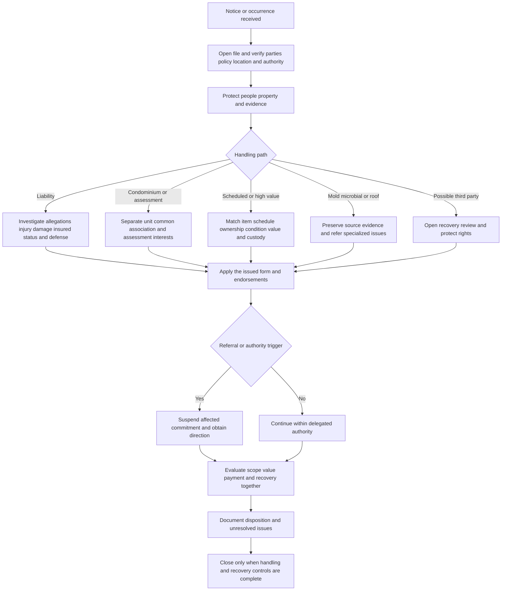

# Claims Manual: Liability, Specialty Property, and Recovery

## Scope and control boundary

This page is internal claims-handling guidance. It organizes investigation, authority, payment, referral, recovery, and closure; it does not grant coverage, waive a condition, amend a policy, or decide legal liability. The issued policy, declarations, endorsements, state forms, governing condominium documents, facts, and applicable law control coverage. An inspection, specialist referral, estimate, mitigation authorization, reserve, partial payment, or recovery review is handling activity—not a coverage grant or waiver ([claims manual, Chapters 1 and 20](repo://manuals/claims/manual.md#L15-L73); [liability guidance](repo://guidelines/claims/liability-claim-handling.md#L13-L41)).

Keep these questions separate:

- **Liability:** What occurrence, alleged injury or damage, insured status, defense issue, damages, and responsible conduct must be investigated?
- **Specialty property:** Which condominium interest, assessment, scheduled item, roof component, or microbial condition is involved, and what evidence establishes ownership, condition, cause, scope, and value?
- **Recovery:** Could a contractor, manufacturer, utility, association, neighbor, vendor, tenant, operator, or other outside party have caused or contributed to covered damage, and have rights and evidence been protected?
- **Authority:** What may the assigned handler investigate, communicate, retain, approve, pay, settle, release, or close, and what must be referred?

An estimate measures claimed damage; it does not answer coverage, causation, fault, or authority. Record coverage analysis separately from cause, scope, valuation, payment, and recovery analysis.

## Common handling flow

*Caption: Claim intake branches into liability, specialty-property, microbial or roof, and recovery work, then reunites at policy review, authority, payment, evidence, and closure controls.*

## Liability claims

### Intake, investigation, and defense

Open a liability file on notice of an occurrence, offense, claim, or suit, even when the report is informal. Verify the reporting party before disclosing claim information; identify named and additional insureds, claimant, date and location, alleged conduct, bodily injury, property damage, witnesses, representative authority, and unverified facts. Obtain and preserve demands, complaints, summonses, service details, photographs, recordings, messages, reports, contracts, invoices, repair information, and physical evidence. Treat allegations and incident reports as information to investigate, not as established fault ([claims manual, Chapter 8](repo://manuals/claims/manual.md#L2527-L2621); [liability guidance, H.6.1–H.6.7](repo://guidelines/claims/liability-claim-handling.md#L541-L553)).

Review the policy in force for the occurrence or offense before assigning counsel or stating a position. Compare the allegations with the complete coverage grant, exclusions, endorsements, conditions, insured status, limits, other insurance, and recovery provisions. A potential defense issue must not be treated as resolved merely because indemnity is uncertain. When allegations potentially fall within the grant and no exclusion clearly eliminates the defense obligation, obtain authority and appoint counsel through the approved process; provide counsel the pleadings, service information, coverage correspondence, known facts, evidence, contacts, and deadlines, while protecting privileged coverage analysis ([liability guidance, H.6.6–H.6.13](repo://guidelines/claims/liability-claim-handling.md#L551-L565)).

Use the applicable form rather than importing a result from another homeowners line:

- **HO-3 2024-03:** Coverage E pays damages for which an insured is legally liable because of bodily injury or property damage caused by an occurrence to which coverage applies and provides a defense against a covered claim or suit. It requires prompt occurrence notice, forwarding legal papers, cooperation, and consent before voluntary payment, assumption of an obligation, or expense; its exclusions and transfer-of-recovery wording must also be reviewed ([HO-3 Coverage E](repo://forms/HO/MS/HO-3/2024-03.md#L933-L981)).
- **HO-4 2021-10:** Coverage E provides an insurer-paid defense against a claim or suit seeking covered damages and separately addresses defense expenses, taxed costs, bonds, post-judgment interest, cooperation, and voluntary payments. Its form-specific exclusions control property in an insured’s care, business, professional services, vehicles, watercraft, and other allegations ([HO-4 Coverage E](repo://forms/HO/MS/HO-4/2021-10.md#L1007-L1073)).
- **HO-6 2023-02:** Coverage E pays covered damages for which an insured is legally liable because of bodily injury or property damage caused by an occurrence and provides a defense against a covered suit. It has its own notice, legal-paper, cooperation, consent, insured-status, and exclusion wording ([HO-6 Coverage E](repo://forms/HO/MS/HO-6/2023-02.md#L1016-L1062)).

For each matter, separate alleged fault from confirmed fault and evaluate duty, notice, control, breach or alleged conduct, occurrence, causation, injury or damage, loss of use, expenses, comparative responsibility, defenses, and damages. Do not admit fault, promise payment, settle, assume an obligation, or give legal advice without authority. Monitor pleadings, discovery, experts, mediation, trial preparation, defense expense, reserve or exposure changes, and settlement posture; continue necessary defense or ordinary investigation while a related issue is being reviewed ([claims manual, Chapter 8](repo://manuals/claims/manual.md#L2587-L2693); [liability guidance, H.6.25–H.6.29](repo://guidelines/claims/liability-claim-handling.md#L589-L597)).

### Liability and property concepts stay separate

Roof age, property deductibles, coinsurance, roof settlement schedules, property estimates, and first-party repair decisions are not proof of a third party’s negligence, causation, damages, or liability coverage. Roof-related liability handling requires evidence about condition, notice, control, maintenance, warnings, the alleged harm, and responsible parties; the liability guidance expressly requires a separate analysis ([liability guidance, roof and liability boundary](repo://guidelines/claims/liability-claim-handling.md#L175-L255)). A property loss and a third-party allegation arising from the same event may share facts, but maintain distinct coverage, damage, defense, and recovery records.

### Prior losses, fraud, and sensitive allegations

Search for prior losses, allegations, demands, complaints, releases, and related incidents. Ask focused questions, classify each matter as an occurrence, offense, claim, suit, or circumstance, compare the allegations, preserve source records, and do not treat the absence of a known prior loss or an administrative claim code as proof of anything. The liability guideline refers exposure above **$50,000** and related or conflicting prior matters for review; this is an internal escalation control, not a policy limit or coverage rule ([liability guidance, H.5.1–H.5.29](repo://guidelines/claims/liability-claim-handling.md#L419-L475)).

Treat suspected material misrepresentation, fraud, concealment, collusion, intentional conduct, arson, altered evidence, inconsistent accounts, staged damage, or unsupported billing as investigation indicators. Preserve relevant evidence and refer through the designated investigation, coverage, or claim-leadership process; do not accuse an insured, claimant, contractor, vendor, or association representative in routine communications. Do not allow a fraud concern to become an unsupported delay or an automatic denial ([claims manual fraud controls](repo://manuals/claims/manual.md#L171-L181); [claims manual referral triggers](repo://manuals/claims/manual.md#L6305-L6319); [liability guidance](repo://guidelines/claims/liability-claim-handling.md#L589-L597)). Serious injury, fatality, abuse, molestation, harassment, protected persons, governmental involvement, employment or professional services, pollution, structural failure, products, completed work, vehicles, aircraft, weapons, and complex contractual allegations require early referral and controlled handling ([claims manual, Chapter 8](repo://manuals/claims/manual.md#L2623-L2679); [claims manual, sensitive allegations](repo://manuals/claims/manual.md#L2851-L2945)).

### Authority and reservation timing

Evaluate total known exposure, including indemnity, allocated expense, anticipated defense cost, contribution, and related obligations—not only the demand. Confirm authority before an offer, demand acceptance, defense or expert retention, expense, settlement, release, contribution statement, or mediation position. Do not split transactions to evade referral; renew approval when facts, parties, exposure, terms, or release language materially changes. Keep undisputed handling moving while another issue is disputed ([liability guidance, H.7.1–H.7.15](repo://guidelines/claims/liability-claim-handling.md#L619-L647); [claims manual, Chapter 8](repo://manuals/claims/manual.md#L2965-L2993)).

The sources contain different internal reservation targets: the general manual says **10 days** when coverage remains unresolved, while the liability guideline says **15 days** after information identifies a potential coverage defense. Neither source changes the policy. Do not silently choose between conflicting internal instructions; refer the discrepancy to the responsible coverage resource, use the approved applicable standard, and document the issue, facts, authority, delivery, recipients, and resulting communication ([claims manual, 19.B–19.C](repo://manuals/claims/manual.md#L6293-L6303); [liability guidance, H.6.8](repo://guidelines/claims/liability-claim-handling.md#L551-L559)).

## Condominium, association, and loss-assessment claims

Classify each damaged interest before authorizing repair: individual unit property, interior finish or improvement, common or limited common element, association-owned asset, shared system, personal property, liability damage, or assessment. Identify the owner or tenant, association, manager, access controller, repair authority, and authorized payee. Inspect beyond the first visible room when water, smoke, or system damage can cross units, walls, floors, ceilings, or common areas. Keep unit-owner, association, and vendor submissions separate and remove duplicate scope before payment ([claims manual, Chapter 14](repo://manuals/claims/manual.md#L4721-L4851); [training context](repo://training/condo-master-policy-gap.md#L59-L139)).

Ownership, repair responsibility, and insurance responsibility are different questions. Compare the declaration, master policy, unit-owner policy, endorsements, repair history, association decisions, and inspection evidence. An association’s repair choice, maintenance rule, invoice, or decision not to file a master-policy claim is not a coverage conclusion. Document and refer conflicts rather than resolving them by assumption ([claims manual](repo://manuals/claims/manual.md#L4805-L4815); [condominium responsibility context](repo://training/condo-master-policy-gap.md#L133-L195)). For water, establish source and path before applying a position; distinguish failed-part damage from resulting damage, repeated leakage, surface water, sewer or drain backup, sump conditions, roof opening, and outside water entry, and preserve source evidence ([claims manual](repo://manuals/claims/manual.md#L4757-L4821)).

A loss-assessment demand is not automatically covered because an association issued it or common property was damaged. Obtain the demand, governing documents, allocation, master-policy information, cause evidence, repair scope, payment or deductible information, and proof of the amount legally chargeable to the insured. Separate covered direct physical loss or covered liability from maintenance, reserves, improvements, code or regulatory costs, fines, penalties, interest, contract-only obligations, excluded causes, and another member’s allocation.

The base forms have limited assessment provisions. HO-3 2024-03 provides up to **$2,000** for a qualifying assessment for direct physical loss to collectively owned property caused by a covered cause, subject to its issued deductible rules ([HO-3 assessment](repo://forms/HO/MS/HO-3/2024-03.md#L437-L439); [HO-3 deductible](repo://forms/HO/MS/HO-3/2024-03.md#L769-L779)). HO-6 2023-02 provides up to **$2,000** for a legally made condominium assessment arising from covered collective-property loss and separately addresses an association deductible allocated under governing documents, with its own notice, records, inspection, cooperation, exclusion, settlement, and recovery duties ([HO-6 assessment](repo://forms/HO/MS/HO-6/2023-02.md#L452-L456); [HO-6 assessment duties](repo://forms/HO/MS/HO-6/2023-02.md#L1268-L1294)). When attached, HO 04 35 2023-02 modifies the applicable policy with up to **$25,000** for qualifying legally chargeable and properly allocated assessment components, subject to its documentation, deductible, recovery, and exclusion terms; it does not convert maintenance, improvement, invalid, voluntary, or otherwise unchargeable amounts into covered loss ([HO 04 35](repo://forms/HO/MS/HO-04-35/2023-02.md#L70-L145); [HO 04 35 limit and duties](repo://forms/HO/MS/HO-04-35/2023-02.md#L243-L273); [HO 04 35 exclusions](repo://forms/HO/MS/HO-04-35/2023-02.md#L285-L360)).

Do not authorize voluntary payment, assumption, settlement, or release of a responsible party without the required consent and recovery review. Record legal basis, allocation, cause, limit, deductible, other recoveries, payee, and each disputed component. Refer condominium exposure at or above **$100,000** for large-loss reporting while continuing ordinary handling unless directed otherwise ([claims manual, 14.F](repo://manuals/claims/manual.md#L4745-L4755)).

## Mold, microbial, and roof-related specialist controls

A mold, fungi, wet or dry rot, bacteria, or microbial report requires an exposure review, prompt inspection when possible, classification of the condition, identification of the moisture source and chronology, preservation of samples and removed materials when material, and separation of direct physical damage, mitigation, testing, remediation, repair, replacement, maintenance, and preventive work. Visible growth, odor, a vendor label, testing, or remediation does not establish coverage. The manual requires reasonable mitigation to begin within **5 days after discovery**; the mold guideline gives a **3-day** target. These are conflicting internal directions, not policy conditions, so escalate the conflict and document the approved instruction rather than communicating either number as a contractual deadline ([claims manual, Chapter 9](repo://manuals/claims/manual.md#L3043-L3127); [mold guideline](repo://guidelines/claims/mold-claim-handling.md#L601-L665)).

Refer mold or microbial claims, disputed causation, substantial contamination, bodily injury, habitability, unusual remediation, uncertain water origin, repeated water damage, or inability to inspect before final disposition. Preserve photographs, moisture readings, source evidence, samples, invoices, environmental reports, and prior-condition records. Do not provide medical, environmental, construction, or legal advice; do not characterize mold cause or extent without the required direction ([claims manual referral triggers](repo://manuals/claims/manual.md#L6353-L6409); [mold guideline controls](repo://guidelines/claims/mold-claim-handling.md#L617-L675)).

For a roof-related liability allegation, investigate condition, notice, control, maintenance, warnings, temporary repairs, roof materials, related property, weather, and the alleged injury or damage. Roof age alone is not proof of knowledge or negligence, and a property roof schedule or settlement floor does not determine third-party liability. For a first-party roof claim, preserve the scene, inspect safely, separate covered physical damage from wear, defective work, maintenance, and undamaged uniformity work, and obtain authority before permanent repair, specialist retention, or compromise while coverage remains unresolved ([liability roof guidance](repo://guidelines/claims/liability-claim-handling.md#L175-L255); [roof claim authority](repo://guidelines/claims/roof-claim-handling.md#L477-L523); [roof authority controls](repo://guidelines/claims/roof-claim-handling.md#L577-L651)). A contractor or specialist may provide scope, pricing, or technical evidence; it cannot decide coverage.

## Scheduled and high-value property

Separate scheduled from unscheduled property at intake. Match each claimed item to the schedule description, markings, inscriptions, serial number, appraisal, or other identifier; establish ownership or financial interest, location and use at loss, pre-loss condition, cause, value, repairability, custody, and residual value. Refer disputed ownership, conflicting descriptions, theft accounts, altered or substituted items, inadequate value support, authenticity or provenance issues, repeated losses, shipment/storage/exhibition custody, and material vendor or custodian disputes ([claims manual, Chapter 17](repo://manuals/claims/manual.md#L5783-L5849); [claims manual, scheduled-property referrals](repo://manuals/claims/manual.md#L5871-L5977)). Use qualified evaluators for authentication, provenance, restoration, or specialized valuation; a repair estimate is not proof of pre-loss value.

The supplied scheduled-property wording is **HO 04 61 2012-02**, marked superseded by HO 04 61 2020-11 for policies effective on or after 2020-11-01. Use the 2012-02 controls only when that edition is the issued wording. Under that edition, the schedule must distinguish the item from like property, the applicable limit is the maximum for the scheduled item or group rather than extra insurance, and payment remains limited by the insured’s financial interest and valuation terms. Preserve the property and permit inspection before repair, restoration, disposal, sale, or replacement; apply the form’s disappearance, dishonest-act, voluntary-parting, deterioration, salvage, and recovered-item provisions as issued ([HO 04 61 edition notice](repo://forms/HO/MS/HO-04-61/2012-02.md#L1-L9); [HO 04 61 limits](repo://forms/HO/MS/HO-04-61/2012-02.md#L209-L313); [HO 04 61 requirements](repo://forms/HO/MS/HO-04-61/2012-02.md#L743-L829)). Verify the actual schedule and endorsement before relying on this path.

For theft, preserve law-enforcement information and evidence of possession, access, discovery, and identity. Retain damaged high-value property while inspection, appraisal, recovery, restoration, and salvage review remain open; control custody and vendor transfers, assess restoration before replacement, and document final disposition for every item.

## Subrogation, contribution, salvage, and recovery

Open a recovery review as soon as facts indicate that an outside party caused or contributed to covered damage. Notify the subrogation unit within **10 days** after identifying a recoverable loss. Identify parties and contacts; obtain the insured’s account, chronology, photographs, witnesses, video, access records, contracts, work orders, invoices, warranties, mitigation records, prior repairs, and communications. Refer product, contractor, utility, vehicle, water, fire, electrical, theft, vandalism, shared-system, common-area, neighboring-property, service-provider, manufacturer, leased, rented, borrowed, or entrusted-property losses when another party may be responsible ([claims manual, Chapter 18](repo://manuals/claims/manual.md#L5985-L6091); [recovery referrals](repo://manuals/claims/manual.md#L6231-L6259)).

Protect both the carrier’s and insured’s recovery interests. Do not authorize a release, waiver, unapproved settlement, return of potentially defective property, destructive testing, repair, cleaning, dismantling, or disposal before the required preservation and subrogation review. Do not concede liability for the insured or carrier; forward demands and correspondence from responsible parties, insurers, representatives, or attorneys to the recovery resource. Continue ordinary adjustment of the insured’s covered loss unless the subrogation unit directs otherwise ([claims manual, recovery controls](repo://manuals/claims/manual.md#L5997-L6013); [claims manual, recovery restrictions](repo://manuals/claims/manual.md#L6099-L6115); [liability guidance](repo://guidelines/claims/liability-claim-handling.md#L567-L587)). A recovery opportunity or referral is not an admission of liability, a coverage grant, or a waiver.

Treat salvage as evidence and value. Retain damaged property for the manual’s **60-day** salvage-inspection period when inspection may be needed; segregate it, protect it from weather, contamination, theft, commingling, and further damage, record storage and custody transfers, obtain vendor information, and do not dispose of it until subrogation review is complete or release authority is documented. Notify the subrogation unit before destructive testing or return of potentially defective property, and record recovery-related storage, inspection, and preservation expenses separately ([claims manual, salvage controls](repo://manuals/claims/manual.md#L6123-L6169); [claims manual, recovery expenses and continuation](repo://manuals/claims/manual.md#L6255-L6277)). The applicable form may separately permit transfer of title or adjustment for recovered property; reconcile payment, ownership, salvage, and recovery under the issued form rather than assuming one follows from another ([HO-3 recovery](repo://forms/HO/MS/HO-3/2024-03.md#L975-L981); [HO 04 35 recovery](repo://forms/HO/MS/HO-04-35/2023-02.md#L127-L137)).

## Referral, authority, and closure

Refer before material disposition when exposure exceeds **$25,000**, coverage is disputed, a reservation is involved, suspected material misrepresentation or fraud exists, or the matter involves arson, fatality, serious injury, governmental or code action, environmental contamination, mold or microbial growth, collapse, structural instability, earth movement, flood or uncertain water, vacancy, business use, disputed insured or lienholder rights, attorney or public-adjuster involvement, appraisal or mediation, punitive or bad-faith demands, unusual valuation, fine art or unique property, contractor or workmanship dispute, product or utility failure, subrogation potential, material salvage, disputed scope or cause, inconsistent statements, or inability to inspect. The manual’s list is a referral and authority control, not a coverage conclusion ([claims manual, authority](repo://manuals/claims/manual.md#L141-L151); [claims manual, referral triggers](repo://manuals/claims/manual.md#L6287-L6459); [claims manual, specialty triggers](repo://manuals/claims/manual.md#L6491-L6615)).

A referral does not automatically stop necessary mitigation, investigation, defense, or undisputed payment. It stops the affected unauthorized commitment. Record the issue, facts for and against the proposed action, evidence, deadline, requested decision, recipient, date, authority status, direction received, and communication issued. Do not waive policy terms, split transactions to avoid authority, or represent that approval is assured ([claims manual, Chapters 1 and 2](repo://manuals/claims/manual.md#L141-L193); [liability authority controls](repo://guidelines/claims/liability-claim-handling.md#L619-L681)).

Before closure, confirm the controlling form and provisions; verified parties, interests, and payees; cause and scope; separate liability, condominium, scheduled-property, microbial, roof, and recovery analyses; mitigation and evidence status; valuation, deductible, limits, payments, releases, and authority approvals; referrals; salvage and recovery disposition; material communications; and unresolved issues. Close a condominium file only when material property-interest and responsibility questions are addressed; close a scheduled-property file only when every item has a final disposition; close a recovery referral only after required documentation and disposition direction are complete. Reopen or re-refer when credible new information changes damage, cause, interest, valuation, payment, defense, or recovery status ([claims manual, condominium closure](repo://manuals/claims/manual.md#L5027-L5067); [scheduled-property closure](repo://manuals/claims/manual.md#L5971-L5981); [recovery closure](repo://manuals/claims/manual.md#L6273-L6283)).

## Source map

- Internal authority, fraud, liability, mold, condominium, scheduled-property, recovery, salvage, referral, and closure controls: [Property Claims Handling Manual](repo://manuals/claims/manual.md#L13-L193), [Liability Claims](repo://manuals/claims/manual.md#L2525-L3041), [Mold, Fungi and Bacteria](repo://manuals/claims/manual.md#L3043-L3385), [Condominium and Association Losses](repo://manuals/claims/manual.md#L4719-L5067), [Scheduled and High-Value Property](repo://manuals/claims/manual.md#L5781-L5981), [Subrogation and Salvage](repo://manuals/claims/manual.md#L5983-L6283), and [Referral Triggers](repo://manuals/claims/manual.md#L6285-L6627).
- Liability interpretation, prior losses, roof-condition separation, defense, fraud, authority, and reservation handling: [Liability Claim Handling Guidance](repo://guidelines/claims/liability-claim-handling.md#L13-L41), [prior losses](repo://guidelines/claims/liability-claim-handling.md#L417-L535), [handling](repo://guidelines/claims/liability-claim-handling.md#L539-L615), and [authority](repo://guidelines/claims/liability-claim-handling.md#L617-L687).
- Microbial and roof specialist handling: [Mold Claim Handling](repo://guidelines/claims/mold-claim-handling.md#L37-L125) and [Roof Claim Handling Guidance](repo://guidelines/claims/roof-claim-handling.md#L66-L170).
- Coverage anchors: [HO-3 Coverage E](repo://forms/HO/MS/HO-3/2024-03.md#L933-L981), [HO-4 Coverage E](repo://forms/HO/MS/HO-4/2021-10.md#L1007-L1073), [HO-6 Coverage E](repo://forms/HO/MS/HO-6/2023-02.md#L1016-L1062), [HO-3 and HO-6 assessments](repo://forms/HO/MS/HO-3/2024-03.md#L437-L439), [HO-6 assessment](repo://forms/HO/MS/HO-6/2023-02.md#L452-L456), and [HO 04 35](repo://forms/HO/MS/HO-04-35/2023-02.md#L70-L145).
- Scheduled-property edition and controls: [HO 04 61 2012-02 edition notice](repo://forms/HO/MS/HO-04-61/2012-02.md#L1-L9), [limits and valuation](repo://forms/HO/MS/HO-04-61/2012-02.md#L209-L313), and [special requirements](repo://forms/HO/MS/HO-04-61/2012-02.md#L743-L829).
