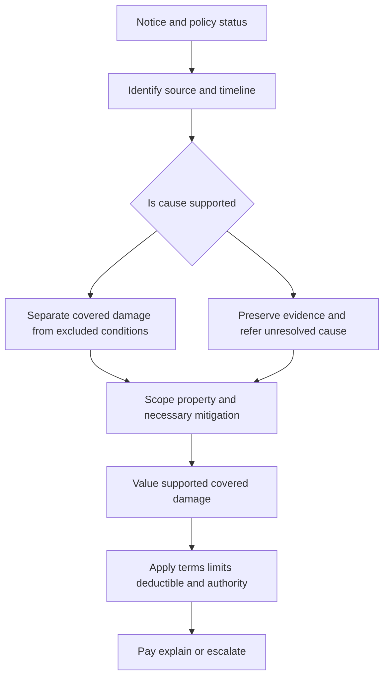

# Property Perils and Loss Types

This page is a **claims-handling index**, not a coverage grant. The claims manual supplies the investigation, evidence, mitigation, valuation, authority, payment, and escalation process. The policy form and any applicable endorsement supply coverage, exclusions, limits, deductibles, conditions, and settlement terms. Internal guidance makes the same boundary explicit: it cannot create, expand, restrict, or waive coverage ([water-loss guidance](repo://guidelines/claims/water-loss-handling.md#L13-L17); [roof guidance](repo://guidelines/claims/roof-claim-handling.md#L14-L21); [manual, Chapter 1](repo://manuals/claims/manual.md#L13-L19)).

Always verify the policy and endorsement edition before relying on a provision. The examples below use HO-3 (2024-03), HO 04 27 (2016-05), HO 04 81 (2018-09), HO 04 90 (2027-01), and HO 23 74 (2025-05); they are not substitutes for the form issued for the loss.

## Common property-loss lifecycle

*Caption: The common property-loss lifecycle from notice through cause, scope, valuation, and disposition.*

The manual requires a claim file, prompt contact, policy-status and policy-term review, inspection when needed, preservation of physical evidence, focused requests for cause, extent, ownership, and value, and referral of disputed or technically complex causation ([manual, Chapter 1](repo://manuals/claims/manual.md#L27-L49); [manual, evidence and causation controls](repo://manuals/claims/manual.md#L63-L103)). Keep coverage analysis separate from damage evaluation: an estimate measures claimed damage but does not establish that the policy responds ([manual](repo://manuals/claims/manual.md#L63-L73)).

### Controls that apply to every peril

1. **Confirm the risk and parties.** Verify policy status, location, insured interest, occupancy, and interested parties before material payment. Record unverified facts rather than treating the report as established ([manual](repo://manuals/claims/manual.md#L21-L43); [manual](repo://manuals/claims/manual.md#L111-L115)).
2. **Establish cause and duration.** Record where the event began, how it moved, when it occurred or was discovered, and competing explanations. A cause finding can control coverage, scope, valuation, and recovery; refer disputed or technical causation ([manual](repo://manuals/claims/manual.md#L87-L103)).
3. **Preserve and inspect.** Protect the carrier’s inspection right and do not authorize disposal of failed components or other material evidence before review when practical ([manual](repo://manuals/claims/manual.md#L75-L85)).
4. **Mitigate without pre-judging coverage.** Direct reasonable emergency measures that protect covered property, but review necessity, relation to the reported damage, and invoices. Emergency work is not proof that every subsequent repair is covered ([manual](repo://manuals/claims/manual.md#L99-L103); [manual, dwelling losses](repo://manuals/claims/manual.md#L5107-L5117)).
5. **Scope only supported direct physical damage.** Separate new damage from pre-existing, maintenance, deterioration, upgrades, and unrelated conditions. Investigate concealed damage with focused access when the event could have affected hidden components ([manual](repo://manuals/claims/manual.md#L123-L139); [manual, dwelling losses](repo://manuals/claims/manual.md#L5119-L5147)).
6. **Value under the controlling contract.** Evaluate repairability, replacement feasibility, pre-loss condition, betterment, depreciation, salvage, deductibles, limits, and sublimits only after coverage and covered scope are established ([manual](repo://manuals/claims/manual.md#L117-L139)).
7. **Control authority and communication.** The manual requires referral before commitment when the evaluated loss exceeds $25,000, prohibits splitting activity to avoid referral, and requires approved payment methods and clear explanations ([manual](repo://manuals/claims/manual.md#L141-L169)). Coverage uncertainty, conflicting evidence, material exposure, and formal reservation or denial communications require the designated review process ([manual](repo://manuals/claims/manual.md#L171-L179)).

## Water and plumbing losses

### Cause and coverage consultation

Start with the source, path, duration, and affected property. Distinguish an accidental discharge from continuous or repeated seepage, maintenance, deterioration, defective work, groundwater, surface water, roof leakage, and sewer or sump backup. The HO-3 example covers accidental discharge or overflow from specified systems and resulting direct physical loss, but excludes continuous or repeated seepage, loss to the system from which water escaped, and several external or maintenance-related causes ([HO-3 P.9-P.12](repo://forms/HO/MS/HO-3/2024-03.md#L575-L583); [HO-3 P.19-P.23](repo://forms/HO/MS/HO-3/2024-03.md#L595-L605); [HO-3 P.29-P.33](repo://forms/HO/MS/HO-3/2024-03.md#L615-L623)). Do not decide from the presence of water alone: the water guide directs the adjuster to identify the source, inspect, preserve records and failed parts, separate source repair from resulting damage, and refer external-water, backup, mold, freezing, roof-leakage, and conflicting-cause issues ([water-loss guidance](repo://guidelines/claims/water-loss-handling.md#L61-L107); [water-loss guidance](repo://guidelines/claims/water-loss-handling.md#L127-L151)).

The HO-3 example separately excludes flood, surface water, below-surface water, and sewer, drain, or sump backup unless a water-backup endorsement is attached ([HO-3 X.7-X.8](repo://forms/HO/MS/HO-3/2024-03.md#L681-L685)). The 2016-05 HO 04 27 form must therefore be checked when attached rather than assumed from the base form; it describes limited water-damage coverage and retains exclusions for repeated leakage, maintenance, defective work, seepage, and specified external or drainage causes ([HO 04 27](repo://forms/HO/MS/HO-04-27/2016-05.md#L41-L85); [HO 04 27 exclusions](repo://forms/HO/MS/HO-04-27/2016-05.md#L207-L319)).

For sewer, drain, sump, or related backup, consult the attached edition of HO 04 90. In the 2027-01 example, the endorsement covers direct physical loss to insured property caused by water backing up through a sewer or drain, or by accidental water discharging or overflowing from a sump, sump pump, or related equipment; it also includes reasonable protection and water-removal expenses when necessary to prevent further covered damage ([HO 04 90 W.1](repo://forms/HO/MS/HO-04-90/2027-01.md#L62-L117); [HO 04 90 W.2](repo://forms/HO/MS/HO-04-90/2027-01.md#L254-L316)). The endorsement’s $10,000 limit is the maximum for loss caused by water backup or sump discharge or overflow, regardless of the number of insured persons, claims, or covered-property items; covered protection and removal expenses are included within that limit, not paid as an additional amount ([HO 04 90 W.2](repo://forms/HO/MS/HO-04-90/2027-01.md#L254-L316)). The endorsement also requires the loss to occur during the policy period, keeps other policy exclusions and covered-property requirements in force, and provides a $1,000 deductible for each covered water-backup loss ([HO 04 90 W.1 and W.2](repo://forms/HO/MS/HO-04-90/2027-01.md#L247-L252); [HO 04 90 W.3](repo://forms/HO/MS/HO-04-90/2027-01.md#L391-L412)). Do not infer separate limits from the number of properties or claims, or apply this endorsement without confirming that it is attached.

### Evidence and scope checklist

- Obtain the insured’s chronology, source location, first observation, prior leaks, repairs, occupancy, and maintenance information.
- Photograph the failed component, water path, affected finishes, contents, and representative unaffected areas. Preserve pipes, hoses, valves, appliances, and other failed parts when practical ([water-loss guidance](repo://guidelines/claims/water-loss-handling.md#L63-L79)).
- Obtain plumber, mitigation, moisture, and repair records. Use expert or contractor findings as evidence, not as an automatic coverage conclusion ([water-loss guidance](repo://guidelines/claims/water-loss-handling.md#L97-L111)).
- Separate emergency extraction, drying, stabilization, and access from permanent repair, system replacement, upgrades, and elective remodeling ([water-loss guidance](repo://guidelines/claims/water-loss-handling.md#L73-L105)).
- Allocate the failed-system repair from resulting damage where the policy treats them differently; identify concealed damage only where evidence ties it to the reported event ([manual, dwelling losses](repo://manuals/claims/manual.md#L5143-L5165)).
- Preserve subrogation evidence when a product, contractor, utility, or other party may be responsible ([water-loss guidance](repo://guidelines/claims/water-loss-handling.md#L141-L145)).

### Water disposition

After cause and scope are supported, apply the issued form’s grant, exclusions, endorsement, limit, deductible, and loss-settlement terms. Pay or reserve undisputed covered damage while separately investigating a disputed portion when the policy and authority process allow it; explain any partial position by cause, scope, and contract language ([water-loss guidance](repo://guidelines/claims/water-loss-handling.md#L113-L151)). Escalate unresolved origin, repeated leakage, backup, external water, freezing, mold, code, or materially conflicting evidence before a final coverage position.

## Roof and weather losses

### Roof cause workflow

Inspect the roof covering, flashings, penetrations, drainage, interior water path, adjoining areas, and representative unaffected areas. Compare the reported event with weather data and distinguish storm-created openings, wind, hail, falling objects, and other covered causes from wear, deterioration, defective installation, prior repairs, and maintenance. The roof guidance requires cause, scope, evidence, and policy review rather than treating interior staining or an aged roof as proof of a covered loss ([roof guidance](repo://guidelines/claims/roof-claim-handling.md#L47-L85); [water-loss guidance](repo://guidelines/claims/water-loss-handling.md#L153-L179)).

The HO-3 example covers direct physical loss from fire, lightning, windstorm, hail, explosion, smoke, and other listed perils, but limits interior rain or snow damage unless wind or hail first creates an opening. It excludes cosmetic-only roof-surfacing damage while covering wind or hail damage that impairs water-shedding ability ([HO-3 P.37-P.41](repo://forms/HO/MS/HO-3/2024-03.md#L631-L639)). The roof guide and manual require a qualified inspection where causation is uncertain, photographs of damage and the water path, weather information, repair history, and preservation of evidence ([roof guidance](repo://guidelines/claims/roof-claim-handling.md#L21-L45); [manual, dwelling losses](repo://manuals/claims/manual.md#L5167-L5183)).

### Roof valuation and the HO 23 74 example

If HO 23 74 (2025-05) is attached, consult that endorsement rather than applying a generic roof rule. In that edition, roof surfacing aged 12 years or more is settled on an actual-cash-value basis whether or not it is repaired or replaced; roof age is determined from reliable evidence for the directly damaged portion ([HO 23 74 W.1-W.7](repo://forms/HO/MS/HO-23-74/2025-05.md#L88-L118)). The endorsement pays the actual cash value of damaged roof surfacing necessary to repair the direct physical loss, subject to the applicable policy limit and deductible, and separately evaluates roof surfacing from other covered property when reasonably possible ([HO 23 74 W.18-W.21](repo://forms/HO/MS/HO-23-74/2025-05.md#L163-L176)).

Do not expand the scope merely to create a uniform appearance. The endorsement limits repair valuation to like-kind-and-quality materials and supported direct physical damage. Matching, detach-and-reset, building-requirement costs, emergency protection, local pricing, overhead and profit, hidden damage, and supplements are fact- and policy-dependent: appearance difference alone does not establish replacement of undamaged surfacing, code costs must be covered and established, and hidden damage or a supplement must still be tied to the covered loss ([HO 23 74 W.11-W.14 and W.23-W.29](repo://forms/HO/MS/HO-23-74/2025-05.md#L135-L149); [HO 23 74 W.23-W.33](repo://forms/HO/MS/HO-23-74/2025-05.md#L184-L212); [HO 23 74 W.41-W.58](repo://forms/HO/MS/HO-23-74/2025-05.md#L261-L334)). Actual cash value reflects age, condition, quality, useful life, and appropriate depreciation, subject to the endorsement’s limit and deductible ([HO 23 74 W.3-W.10](repo://forms/HO/MS/HO-23-74/2025-05.md#L98-L133)).

### Other weather loss types

For wind, hail, falling-object, and similar weather claims, establish the physical damage rather than relying only on a weather event report. Identify displaced, broken, punctured, or impact-altered material, compare adjoining areas, and separate storm damage from deterioration, installation defects, and mechanical damage ([manual, dwelling losses](repo://manuals/claims/manual.md#L5173-L5183)). Consult the exact policy for covered peril, cosmetic limitations, exclusions, property category, deductible, and settlement. Escalate competing causes, unavailable or altered roof evidence, code or matching disputes, structural concerns, and material exposure ([roof guidance](repo://guidelines/claims/roof-claim-handling.md#L65-L91)).

## Fire and smoke losses

For fire, handle origin, cause, safety, preservation, and recovery potential together. Coordinate fire-service or specialist findings and refer suspicious circumstances for specialized investigation. For smoke, identify the source and affected building components, distinguish residue from ordinary dirt, cooking residue, or pre-existing staining, and document the cleaning basis and scope ([manual, dwelling losses](repo://manuals/claims/manual.md#L5197-L5207)).

The HO-3 example lists fire and smoke among covered causes of direct physical loss, subject to the policy’s exclusions and conditions ([HO-3 P.37](repo://forms/HO/MS/HO-3/2024-03.md#L629-L631)). That does not decide every fire or smoke claim: origin, intentional-loss, vacancy, concurrent-cause, property, limit, deductible, and valuation provisions must be checked in the issued contract. Preserve damaged materials and reports before demolition when safe and practical, and coordinate safety or structural concerns with qualified resources ([manual, dwelling losses](repo://manuals/claims/manual.md#L5197-L5201); [manual](repo://manuals/claims/manual.md#L75-L85)).

## Theft, vandalism, and malicious damage

For theft, identify each allegedly missing item, ownership, location, access, forced-entry evidence, timing, and recovery efforts. Distinguish theft from unexplained disappearance, prior disposal, or property not covered at the location; obtain law-enforcement information when available ([manual, dwelling losses](repo://manuals/claims/manual.md#L5185-L5189)). For vandalism, identify intentional damage and separate it from accident, neglect, deterioration, and ordinary wear. Document the damage pattern, entry conditions, statements, and incident information ([manual, dwelling losses](repo://manuals/claims/manual.md#L5191-L5195)).

Consult the issued policy for theft and vandalism definitions, vacancy or unoccupancy conditions, property-location requirements, special limits, deductible, and settlement. The HO-3 example excludes theft committed by an insured, contains a construction-related theft limitation, and restricts vandalism or malicious mischief when the dwelling is vacant; the manual also directs confirmation of a 60-day vacancy fact pattern for its dwelling-loss workflow ([HO-3 P.26-P.27](repo://forms/HO/MS/HO-3/2024-03.md#L609-L613); [manual](repo://manuals/claims/manual.md#L5083-L5093)). Do not treat the internal manual threshold or workflow as a substitute for the policy’s controlling vacancy language.

## Mold, fungi, wet rot, and microbial conditions

Identify possible fungi or mold early when the report includes moisture, intrusion, concealed damage, odor, staining, or growth. Keep the microbial analysis separate from the initial water event: determine whether the condition resulted from a covered water event, long-term seepage, maintenance, construction defect, or another excluded cause, and connect each claimed testing, cleaning, remediation, repair, or replacement expense to the applicable coverage ([mold guidance](repo://guidelines/claims/mold-claim-handling.md#L13-L33)). Obtain photographs, inspection findings, invoices, remediation records, repair estimates, moisture-source information, and the development timeline ([mold guidance](repo://guidelines/claims/mold-claim-handling.md#L23-L31)).

Do not characterize remediation as covered before the policy analysis is complete. Review all applicable forms and endorsements because the controlling form may modify exclusions, additional coverage, duties, or conditions ([mold guidance](repo://guidelines/claims/mold-claim-handling.md#L21-L33)). The HO-3 example excludes loss caused by mold, wet rot, dry rot, decay, deterioration, or contamination while preserving only the resulting direct physical loss allowed by the policy; the exact attached fungi or mold provision controls the claim ([HO-3 P.19](repo://forms/HO/MS/HO-3/2024-03.md#L595-L597)).

When HO 04 81 (2018-09) is attached, it is a narrow modification rather than blanket mold coverage. It covers fungi-related direct physical loss only when a covered cause first causes direct physical loss to covered property and the fungi result from that loss; it excludes fungi arising from constant or repeated seepage, leakage, discharge, overflow, or flood, as well as preexisting conditions, wear, neglect, inadequate maintenance, and defective work ([HO 04 81 W.1](repo://forms/HO/MS/HO-04-81/2018-09.md#L45-L63); [HO 04 81 W.1](repo://forms/HO/MS/HO-04-81/2018-09.md#L89-L103)). Reasonable and necessary removal, access or repair-related tear-out, qualifying post-remediation testing, and remediation are covered only when tied to covered direct physical loss; preventive monitoring, routine cleaning, undamaged-property replacement, upgrades, and non-covered property remain outside the write-back ([HO 04 81 W.1](repo://forms/HO/MS/HO-04-81/2018-09.md#L65-L77); [HO 04 81 W.1](repo://forms/HO/MS/HO-04-81/2018-09.md#L89-L127)). The endorsement’s $10,000 limit is an aggregate for all covered fungi, wet- or dry-rot, or bacteria loss during the policy term, regardless of claims, insured persons, or property items; covered expenses share that limit, payments reduce what remains, and the deductible applies only after covered loss is determined ([HO 04 81 W.2](repo://forms/HO/MS/HO-04-81/2018-09.md#L157-L185); [HO 04 81 W.1](repo://forms/HO/MS/HO-04-81/2018-09.md#L139-L149); [HO 04 81 W.3](repo://forms/HO/MS/HO-04-81/2018-09.md#L235-L251)). Refer disputed causation, concealed moisture, substantial remediation, health or habitability concerns, and material authority issues.

## Loss of use and additional living expense

Loss of use is downstream of covered property damage. First establish a covered direct physical loss that made the residence premises unfit for normal use; inconvenience, preference, and elective relocation are not enough. Then classify the claim as additional living expense, fair rental value, or both, establish the unfit-for-use date, and coordinate the end date with actual repair and restoration ([manual, Chapter 10](repo://manuals/claims/manual.md#L3388-L3407)).

For additional living expense, measure only the increase in necessary living costs, require reliable receipts or comparable records, evaluate temporary housing against the pre-loss household, and separate lodging, meals, transportation, utilities, storage, moving, cleaning, and pet-related costs. Exclude ordinary expenses, upgrades, luxury accommodations, and discretionary services ([manual](repo://manuals/claims/manual.md#L3409-L3455)). Apply the Coverage D limit from the applicable claim coverage information and reserve for supported anticipated exposure; the manual’s workflow states that additional living expense may not continue beyond 24 months and requires coordination with repair status ([manual](repo://manuals/claims/manual.md#L3401-L3403); [manual](repo://manuals/claims/manual.md#L3457-L3491)).

For fair rental value, verify the actual rental arrangement, rental evidence, occupancy, vacancy, and tenant turnover. Do not substitute speculative income, repair costs, tenant damage, or business interruption for rental value ([manual](repo://manuals/claims/manual.md#L3493-L3511)). Escalate prolonged displacement, disputed habitability, substantial expense, civil-authority issues, or uncertain repair completion, and do not duplicate benefits for the same period or expense ([manual](repo://manuals/claims/manual.md#L3481-L3489); [manual](repo://manuals/claims/manual.md#L3517-L3531)).

## Dwelling-property loss workflow

Use the dwelling-loss chapter as the cross-peril investigation spine: verify the location and occupancy, identify the efficient cause, preserve evidence, mitigate, scope direct physical damage, separate excluded conditions and resulting damage, investigate concealed damage, and document the coverage analysis before a final position ([manual, Chapter 15](repo://manuals/claims/manual.md#L5071-L5147)). This workflow applies to water, roof, weather, fire, smoke, theft, vandalism, collapse, and object-impact presentations, but each peril still requires its own policy consultation and evidence.

The minimum dwelling file should show:

- the reported event, date or discovery date, location, parties, occupancy, safety, and habitability;
- the cause finding and competing explanations, including water source and path, roof or weather evidence, fire origin and cause, theft ownership and access, or vandalism intent;
- photographs, inspection notes, failed components, expert or authority reports, estimates, invoices, repair history, weather data, and mitigation records;
- an allocation of covered direct physical damage, excluded or pre-existing conditions, source repair, resulting damage, concealed damage, betterment, and code-related work; and
- the applicable form or endorsement, limits, deductible, valuation method, payment history, recovery potential, authority approval, and explanation of any partial payment, denial, or referral.

Close only when the file supports the cause, covered scope, payment or reserve basis, unresolved issues, and any recovery action. The manual’s dwelling workflow expressly requires a documented cause, evidence preservation, mitigation, direct-damage scope, exclusion analysis, and allocation of covered resulting damage ([manual](repo://manuals/claims/manual.md#L5095-L5141)).

## Contract consultation and escalation matrix

| Claim question | First operational action | Contract consultation | Escalate when |
|---|---|---|---|
| Sudden water versus seepage or deterioration | Establish source, timeline, path, failed part, and prior condition | Issued water grant, exclusions, definitions, and endorsements | Source or duration is disputed or evidence conflicts |
| Sewer, drain, or sump backup | Preserve failed equipment and determine backup mechanism | Attached water-backup endorsement, including its limit and exclusions | Coverage, device condition, or shared limit is uncertain |
| Roof leak or weather damage | Inspect roof and interior path, obtain weather and repair history | Issued peril, water-damage, roof, matching, and settlement terms | Cause, cosmetic impairment, matching, code, or roof age is disputed |
| Fire or smoke | Secure safety, origin and cause, reports, and damaged evidence | Fire, smoke, intentional-loss, property, limit, and deductible terms | Suspicious origin, structural hazard, or specialist findings conflict |
| Theft or vandalism | Inventory property or document intentional damage and access | Theft, vacancy, location, special-limit, and valuation provisions | Ownership, vacancy, intent, or disappearance is unresolved |
| Mold or fungi | Correctly identify moisture source and preserve remediation evidence | Exact fungi or mold grant, exclusion, limitation, and endorsement | Cause, health or habitability, concealed moisture, or large remediation exposure is disputed |
| Loss of use | Establish covered damage, habitability, occupancy, incurred increase, and repair period | Coverage D and applicable additional-living-expense or rental-value terms | Prolonged displacement, civil authority, disputed habitability, or material reserve |
| Any dwelling loss | Separate coverage from scope and apply authority controls | Full issued policy and endorsements, not this manual page | Evaluated loss exceeds delegated authority or formal position is uncertain |

This matrix is a routing aid. It never replaces the exact policy or endorsement, applicable law, claim authority, or required review.
