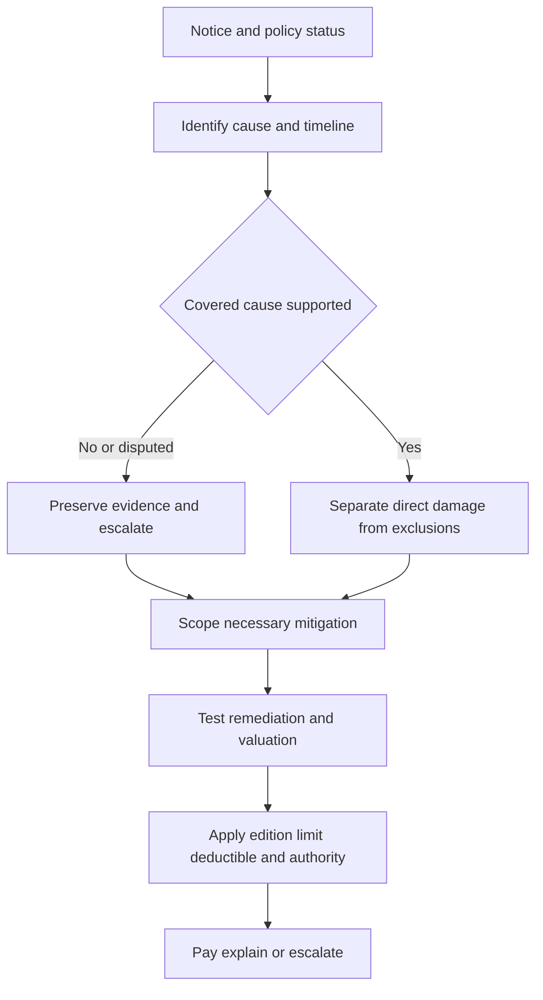

# Property Perils and Loss Types

This is claims guidance, not a coverage grant. The claims manual governs investigation, evidence, mitigation, valuation, authority, payment, and escalation; the issued policy and attached endorsements govern coverage, exclusions, conditions, limits, deductibles, and settlement. Internal guidance cannot create, expand, restrict, or waive coverage ([claims manual](repo://manuals/claims/manual.md#L13-L19)).

Always identify the form and endorsement edition before making a coverage or limit decision. A report of water, staining, mold, cracking, smoke, or missing property is not itself a coverage determination.

## Decision flow

```mermaid
flowchart TD
    A["Notice and policy status"] --> B["Identify cause and timeline"]
    B --> C{"Covered cause supported"}
    C -->|"No or disputed"| D["Preserve evidence and escalate"]
    C -->|"Yes"| E["Separate direct damage from exclusions"]
    D --> F["Scope necessary mitigation"]
    E --> F
    F --> G["Test remediation and valuation"]
    G --> H["Apply edition limit deductible and authority"]
    H --> I["Pay explain or escalate"]
```

*Caption: The claim path from notice and causation through covered scope, remediation, limits, and disposition.*

For every loss, verify the risk, location, insured interest, occupancy, policy status, and interested parties; establish source, path, duration, discovery, and competing causes; preserve failed components and other evidence; direct reasonable emergency protection without presuming later work is covered; scope supported direct physical damage separately from maintenance, deterioration, upgrades, and unrelated conditions; then value under the controlling contract ([claims manual](repo://manuals/claims/manual.md#L21-L49); [claims manual](repo://manuals/claims/manual.md#L63-L103); [claims manual](repo://manuals/claims/manual.md#L117-L139)). Refer disputed or technically complex causation, formal coverage positions, and evaluated losses above the manual’s authority threshold ([claims manual](repo://manuals/claims/manual.md#L141-L179)).

## Water, roof, and weather interaction

For plumbing or appliance losses, document the source, path, timing, failed part, prior leakage, and maintenance. Separate accidental discharge from repeated seepage, deterioration, defective work, freezing, groundwater, surface water, roof leakage, and sewer or sump backup. The HO-3 example covers specified accidental water discharge and resulting direct physical loss but excludes repeated seepage and loss to the system from which water escaped ([HO-3](repo://forms/HO/MS/HO-3/2024-03.md#L575-L583); [HO-3](repo://forms/HO/MS/HO-3/2024-03.md#L595-L605)). Its base exclusions also exclude flood, surface water, below-surface water, and sewer, drain, or sump backup unless an applicable endorsement changes that result ([HO-3](repo://forms/HO/MS/HO-3/2024-03.md#L587-L605)). Consult the attached endorsement rather than inferring coverage from the presence of water ([water-loss guidance](repo://guidelines/claims/water-loss-handling.md#L61-L107)).

Inspect roof covering, flashings, penetrations, drainage, interior path, and adjoining areas; obtain weather data and repair history. Under the HO-3 example, interior rain or snow damage generally requires wind or hail to first create an opening, while cosmetic-only roof-surfacing damage is restricted ([HO-3](repo://forms/HO/MS/HO-3/2024-03.md#L629-L639)). Establish physical damage rather than relying on a storm report, and separate storm-created damage from wear, deterioration, defective installation, and prior repair ([roof guidance](repo://guidelines/claims/roof-claim-handling.md#L47-L91)). Apply any roof settlement endorsement and its age, matching, code, deductible, and limit provisions only after confirming attachment.

For a DP-3 2026-01 risk, the form covers accidental direct physical loss to covered property caused by a covered peril, but excludes earth movement, external or below-surface water, repeated seepage, and backup; it separately covers sudden accidental system discharge while excluding the failed system or appliance ([DP-3](repo://forms/DP/MS/DP-3/2026-01.md#L1227-L1286); [DP-3](repo://forms/DP/MS/DP-3/2026-01.md#L1342-L1353)). Scope source repair, resulting damage, and mitigation separately.

## Fungi, wet or dry rot, bacteria, and qualifying remediation

Identify possible fungi early when moisture, intrusion, odor, staining, concealed damage, or growth is reported. Determine whether the microbial condition followed a covered cause, repeated seepage, flood, maintenance, or defective work. Connect every testing, removal, tear-out, repair, replacement, and remediation charge to covered direct physical loss; do not approve a remediation program merely because it is recommended ([mold guidance](repo://guidelines/claims/mold-claim-handling.md#L13-L33)). Preserve affected property, photographs, moisture evidence, chronology, inspection findings, invoices, and remediation records.

The HO-3 base form excludes fungi, wet rot, dry rot, or bacteria except as provided by a limited fungi endorsement ([HO-3](repo://forms/HO/MS/HO-3/2024-03.md#L629-L639)). The exact attached HO 04 81 provision must therefore be read with the base-form exclusion.

### HO 04 81 edition checkpoint

**Policies written under 2018-09 remain governed by that edition.** Read the HO-3 base exclusion together with HO 04 81 (2018-09): the endorsement provides fungi coverage only when a covered cause first causes direct physical loss to covered property and the fungi results from that loss. It excludes fungi arising from constant or repeated seepage, leakage, discharge, overflow, or flood, and preserves exclusions for preexisting conditions, wear, neglect, inadequate maintenance, and defective work ([HO-3](repo://forms/HO/MS/HO-3/2024-03.md#L629-L639); [HO 04 81 2018-09](repo://forms/HO/MS/HO-04-81/2018-09.md#L49-L67); [HO 04 81 2018-09](repo://forms/HO/MS/HO-04-81/2018-09.md#L93-L117)).

Under that same 2018-09 write-back, reasonable and necessary removal, access tear-out, covered-property repair-related tear-out, post-remediation testing, and remediation may qualify only when tied to covered fungi loss. Monitoring without covered direct physical loss, routine cleaning, preventive work, replacement of undamaged property, upgrades, medical testing, and unrelated or non-covered property do not qualify ([HO 04 81 2018-09](repo://forms/HO/MS/HO-04-81/2018-09.md#L69-L81); [HO 04 81 2018-09](repo://forms/HO/MS/HO-04-81/2018-09.md#L93-L117)). The aggregate limit is **$10,000** for all fungi, wet- or dry-rot, or bacteria loss during the policy term; covered property damage and qualifying expenses share that limit, payments reduce the remaining amount, and the applicable deductible is applied after covered loss is determined ([HO 04 81 2018-09](repo://forms/HO/MS/HO-04-81/2018-09.md#L151-L169)).

**For policies written or renewed on or after 2026-10-01, confirm HO 04 81 (2026-09).** Read the 2026-09 provisions with the HO-3 base fungi exclusion: the endorsement keeps the same covered-cause prerequisite, covers reasonable and necessary removal, access tear-out and post-covered-remediation testing, and excludes fungi from constant or repeated seepage, leakage, or flood ([HO-3](repo://forms/HO/MS/HO-3/2024-03.md#L629-L639); [HO 04 81 2026-09](repo://forms/HO/MS/HO-04-81/2026-09.md#L9-L21)). Its only stated change from 2018-09 is the aggregate limit: **$25,000**, not an additional amount of insurance; all covered fungi-related loss shares that limit ([HO 04 81 2026-09](repo://forms/HO/MS/HO-04-81/2026-09.md#L23-L33)). Do not apply the 2026 limit to a policy governed by 2018-09, and do not treat the limit as coverage for an otherwise excluded cause.

This distinction is a claims control, not a contract rewrite. Escalate disputed cause or duration, concealed moisture, substantial remediation, habitability or health concerns, conflicting expert evidence, and any uncertainty about the attached edition.

## Other claim decisions

- **Fire and smoke:** preserve damaged materials when safe, establish origin and cause, distinguish residue from preexisting dirt or staining, and coordinate specialist or fire-service findings. The HO-3 example lists fire and smoke among covered causes subject to exclusions and conditions ([claims manual](repo://manuals/claims/manual.md#L5197-L5207); [HO-3](repo://forms/HO/MS/HO-3/2024-03.md#L629-L631)).
- **Theft and vandalism:** inventory each item, establish ownership, location, access, timing, forced entry, recovery, and intentional damage; consult theft, vacancy, location, and special-limit provisions. Do not substitute manual workflow thresholds for issued-policy language ([claims manual](repo://manuals/claims/manual.md#L5185-L5195); [HO-3](repo://forms/HO/MS/HO-3/2024-03.md#L609-L613)).
- **Earth movement:** document ground motion, structural distress, prior cracking, and resulting water or fire. The HO-3 and DP-3 examples exclude earth movement, so verify any separately issued earthquake contract or endorsement rather than inferring coverage ([HO-3](repo://forms/HO/MS/HO-3/2024-03.md#L587-L593); [DP-3](repo://forms/DP/MS/DP-3/2026-01.md#L1270-L1276)).
- **Loss of use:** first establish covered direct physical loss making the premises unfit for normal use; then measure only necessary increased costs or supported rental value, coordinate dates with actual restoration, and avoid duplicate benefits ([claims manual](repo://manuals/claims/manual.md#L3388-L3407); [claims manual](repo://manuals/claims/manual.md#L3409-L3455)).

## File closure and escalation

The file should show the reported event and timeline, cause and competing explanations, inspection and preservation, mitigation, photographs and reports, allocation of covered damage versus excluded or preexisting conditions, source repair versus resulting damage, applicable form and edition, limits, deductible, valuation, payment or reserve basis, recovery potential, and the explanation of any partial position. Close only when supported issues, unresolved questions, authority review, and recovery actions are documented ([claims manual](repo://manuals/claims/manual.md#L5071-L5147)). This page routes decisions; it never replaces the exact issued contract, applicable law, or required review.
