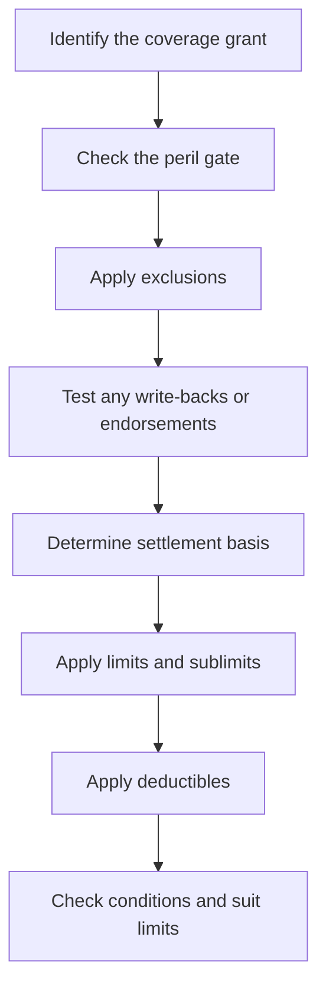

# Coverage Analysis Sequence and Gates

HO-3 coverage questions are best analyzed in order. Each step narrows the next one: first identify whether the claimed property and loss are within an insuring agreement, then check whether the loss is excluded, then see whether an endorsement writes the exclusion back, and only after that move to settlement basis, limits, deductibles, and conditions.

This sequence matters because later provisions do not create coverage by themselves. A deductible, settlement rule, or claim condition only applies after the loss is otherwise covered. Likewise, an endorsement may restore coverage for a narrow excluded cause without changing the rest of the policy’s structure.

The sequence should be read as a dependency chain:

1. **Insuring agreement / coverage grant.** Ask whether the property and loss fall within the relevant coverage part. For Section I property claims, Coverage A and Coverage B respond to **direct physical loss** to the described property, while Coverage C responds only to listed perils.
2. **Peril gate.** Coverage A and B use a broad direct-physical-loss grant, but Coverage C is narrower and only responds to the listed perils. The trigger phrase matters because a loss may be covered for the dwelling but not for personal property unless the personal-property peril list is satisfied.
3. **Exclusions.** Exclusions remove otherwise-gated losses, including exclusions that say they apply **whether or not driven by wind** or that apply **regardless of any other cause or event contributing concurrently or in any sequence**.
4. **Write-backs and endorsements.** Endorsements can restore a specific excluded subject, such as water backup, fungi-related loss tied to a covered water event, or ordinance-or-law cost, but only on the terms the endorsement states. A write-back is usually narrower than the exclusion it modifies.
5. **Settlement.** Once coverage exists, the policy and any endorsement decide whether payment is replacement cost, actual cash value, or a special settlement rule for a component such as roof surfacing.
6. **Limits and sublimits.** The amount payable is then capped by the applicable coverage limit, endorsement sublimit, or special aggregate limit. Some endorsements add additional insurance; others are part of the underlying limit.
7. **Deductibles.** Deductibles come after the covered amount is determined. A separate deductible may replace the Section I deductible for a specific endorsement, or the larger deductible may control when multiple deductibles apply.
8. **Conditions.** Finally, claim handling duties, proof-of-loss timing, payment timing, suit limitations, and loss-preservation duties control recovery and enforcement even when the substantive coverage question is answered in the insured’s favor.

## Practical reading order

A good HO-3 analysis usually asks these questions in sequence:

- What property is claimed, and under which coverage part?
- Does the relevant coverage grant reach the loss description?
- Does an exclusion remove the loss?
- Does an endorsement or other write-back restore it?
- If covered, how is the loss settled?
- What cap applies?
- What deductible applies?
- Have the insured’s conditions been satisfied?

That order helps avoid a common mistake: treating settlement language or a deductible as if it could overcome an exclusion, or treating a narrow endorsement as if it broadened the whole policy.

## Common dependency patterns

- **Coverage A / B first, exclusion second.** Dwelling and other-structures claims usually begin with direct physical loss and then move to exclusions.
- **Coverage C starts narrower.** Personal property often fails at the peril gate before exclusions are even needed.
- **Endorsements are targeted.** Water backup, fungi/rot/bacteria, ordinance or law, and roof-surfacing settlement each change only a slice of the coverage path.
- **Settlement depends on what survived the earlier gates.** A replacement-cost promise does not matter unless the loss is covered and not excluded.

## Interpretive guardrails

- Read the exact trigger phrase. Phrases like **direct physical loss**, **sudden and accidental**, and **whether or not driven by wind** change the legal outcome.
- Do not assume one endorsement rewrites another. If two provisions both speak to the same loss, compare their scopes and their express interaction rules.
- Treat conditions as post-coverage enforcement rules, not as the source of coverage.
- Treat limits and deductibles as amount rules, not as coverage grants.

The result is a stepwise coverage method: coverage grant first, exclusion analysis second, endorsement restoration third, and amount-and-conditions analysis last.
