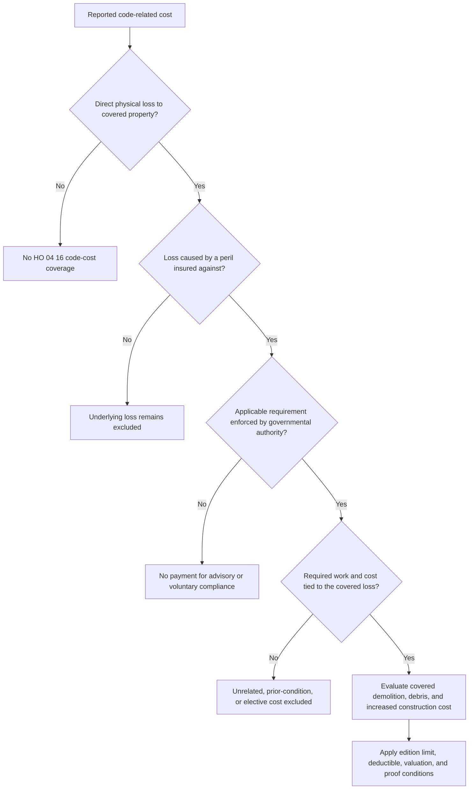

# Ordinance or Law Coverage

## Scope and controlling relationship

The base policy starts from an exclusion. In the current HO-3, Coverage A says that loss caused by enforcement of an ordinance or law regulating construction, repair, demolition, or use is not covered, and that the increased cost of compliance is not covered ([HO-3 A.8](repo://forms/HO/MS/HO-3/2024-03.md#L109-L115)). The current DP-3 states the same starting position for the dwelling, while preserving coverage only when the loss is otherwise covered ([DP-3 A.26](repo://forms/DP/MS/DP-3/2026-01.md#L121-L125)). **HO 04 16 modifies that base exclusion**: its 2018 preamble says the endorsement modifies the policy and applies to loss arising from enforcement ([HO 04 16 2018 W.0](repo://forms/HO/MS/HO-04-16/2018-09.md#L13-L23)); the 2023 edition likewise changes the insurance for ordinance-or-law loss and controls over a conflicting policy provision ([HO 04 16 2023 W.0](repo://forms/HO/MS/HO-04-16/2023-11.md#L13-L17), [HO 04 16 2023 W.0](repo://forms/HO/MS/HO-04-16/2023-11.md#L41-L43)).

This relationship does not make every code-related invoice insured. The endorsement is an exception to the exclusion only for the covered building, covered loss, required governmental work, and applicable endorsement limit. It does not turn an excluded cause of loss, an uncovered building, a voluntary improvement, or a standalone code requirement into covered property loss.

*This decision flow summarizes the source-form trigger and payment gates; it is not claims guidance and does not replace the attached policy and endorsement.*

## Base-form landscape

The seed forms do not all use the same base arrangement. The built-in provisions below matter before deciding whether an HO 04 16 endorsement is attached and applicable:

| Form | Base exclusion or limitation | Built-in ordinance-or-law provision in the supplied edition |
| --- | --- | --- |
| DP-3 2026-01 | Dwelling A.26 excludes compliance cost and enforcement loss unless otherwise covered. | E.49-E.55 covers enforcement following a covered loss and provides a **20% of Coverage A limit**, **included within** Coverage A ([DP-3](repo://forms/DP/MS/DP-3/2026-01.md#L511-L523)). |
| HO-3 2024-03 | Coverage A A.8 excludes enforcement loss and increased compliance cost. | E.36-E.40 covers building compliance cost and required undamaged-portion demolition, with a **15% of Coverage A limit** as additional insurance ([HO-3](repo://forms/HO/MS/HO-3/2024-03.md#L483-L491)). |
| HO-4 2021-10 | Coverage A is expressly not provided; its building-related B.16 and contents C.49 exclude ordinance-or-law enforcement loss and increased compliance cost. | E.42-E.47 contains a **10% of Coverage A** provision, but the form separately says Coverage A is not provided ([HO-4](repo://forms/HO/MS/HO-4/2021-10.md#L71-L77), [HO-4](repo://forms/HO/MS/HO-4/2021-10.md#L175-L183), [HO-4](repo://forms/HO/MS/HO-4/2021-10.md#L309-L317), [HO-4](repo://forms/HO/MS/HO-4/2021-10.md#L515-L525)). Do not assume the HO-3 endorsement's Coverage A limit transfers to an HO-4. |
| HO-5 2022-06 | Coverage A A.21 excludes increased compliance cost and enforcement loss. | E.37-E.43 covers covered-loss code work, with a **15% of Coverage A limit included within** Coverage A ([HO-5](repo://forms/HO/MS/HO-5/2022-06.md#L143-L151), [HO-5](repo://forms/HO/MS/HO-5/2022-06.md#L535-L547)). |
| HO-6 2023-02 | The form contains a separate enforcement exclusion in X.1. | E.33-E.42 covers covered-loss compliance, undamaged-part demolition, and removal, with a **15% of Coverage A limit** that does not reduce Coverage A ([HO-6](repo://forms/HO/MS/HO-6/2023-02.md#L434-L452), [HO-6](repo://forms/HO/MS/HO-6/2023-02.md#L650-L662)). |

The table is a form-structure comparison, not a conclusion that every provision applies to every policy. Check the policy line, declarations, attached endorsements, and any state-specific form or mandatory change. The supplied sources are Mississippi (`MS`) forms, so they should not be generalized to another state's policy without that state's operative wording.

## HO 04 16 trigger and covered work

Both editions require the same core sequence:

1. **Covered direct physical loss first.** The loss must be direct physical loss to covered property caused by a peril insured against under the policy. The ordinance or law enforcement must result from that loss. The 2023 edition also expressly requires the physical loss to occur during the policy period ([2018 W.1-W.5](repo://forms/HO/MS/HO-04-16/2018-09.md#L55-L65), [2023 W.1-W.4](repo://forms/HO/MS/HO-04-16/2023-11.md#L45-L57)).
2. **A legally applicable requirement.** The ordinance or law must regulate repair, construction, demolition, reconstruction, replacement, occupancy, or use of property, be in force, and be enforced by the governmental authority having jurisdiction. A recommendation, anticipated future requirement, or voluntary compliance is not enough ([2018 W.7-W.9](repo://forms/HO/MS/HO-04-16/2018-09.md#L65-L73), [2023 W.1-W.3](repo://forms/HO/MS/HO-04-16/2023-11.md#L45-L53), [2023 W.2 and W.18](repo://forms/HO/MS/HO-04-16/2023-11.md#L181-L185)).
3. **A required and attributable cost.** The insured must show that the authority requires the claimed work or expense and that the cost results from the covered loss. Neither edition covers the cost of correcting an unrelated pre-loss condition, elective betterment, or work that would have been incurred without enforcement ([2018 W.8-W.10](repo://forms/HO/MS/HO-04-16/2018-09.md#L27-L35), [2023 W.14-W.18](repo://forms/HO/MS/HO-04-16/2023-11.md#L203-L217)).

When those gates are met, both editions address three principal categories:

- **Undamaged portion:** loss in value when an ordinance or law requires an undamaged portion of the covered building to be demolished ([2018 W.3](repo://forms/HO/MS/HO-04-16/2018-09.md#L57-L63), [2023 W.5-W.6](repo://forms/HO/MS/HO-04-16/2023-11.md#L53-L59)).
- **Demolition and debris:** the reasonable cost to demolish required portions and clear or remove the resulting debris. The 2023 wording expressly includes necessary debris removal resulting from required demolition ([2018 W.4 and W.10-W.11](repo://forms/HO/MS/HO-04-16/2018-09.md#L61-L77), [2023 W.7](repo://forms/HO/MS/HO-04-16/2023-11.md#L57-L61)).
- **Increased construction cost:** the additional cost to repair, rebuild, or replace covered property so the work complies with the enforced requirement, limited to the compliance increment rather than the ordinary repair cost ([2018 W.5-W.6](repo://forms/HO/MS/HO-04-16/2018-09.md#L63-L69), [2023 W.11-W.14](repo://forms/HO/MS/HO-04-16/2023-11.md#L67-L75)).

The 2018 edition expressly lists required changes to foundations, framing, walls, roofs, wiring, plumbing, heating, cooling, permanent fixtures, accessibility, fire protection, safety, structural, utility, sanitation, drainage, and energy-conservation features. It also lists permits, plan review, inspection, and necessary architectural, engineering, or design services ([2018 W.14-W.19](repo://forms/HO/MS/HO-04-16/2018-09.md#L81-L93)). The 2023 edition does not make those categories automatically payable: its coverage still requires that the work be necessary because of the covered loss and applicable ordinance or law, while its limitation provision treats professional services as payable only when necessary to perform covered compliance work ([2023 W.23-W.25](repo://forms/HO/MS/HO-04-16/2023-11.md#L89-L97), [2023 W.33](repo://forms/HO/MS/HO-04-16/2023-11.md#L239-L245)).

## Edition comparison

### 2018-09

The 2018 edition is superseded for policies effective on or after November 1, 2023, but remains relevant to policies written under it ([2018 notice](repo://forms/HO/MS/HO-04-16/2018-09.md#L8-L9)). Its ordinance-or-law limit is **10% of Coverage A**, and the endorsement says that limit is **in addition to** Coverage A ([2018 W.1-W.3, Limit of Liability](repo://forms/HO/MS/HO-04-16/2018-09.md#L213-L221)). The limit is applied to covered undamaged-portion loss, demolition and removal, and increased repair or rebuilding cost. The 2018 text also permits payment as work progresses or after completion, subject to evidence of incurred costs, and permits withholding increased construction payment until the building is repaired, rebuilt, or constructed ([2018 W.17-W.18](repo://forms/HO/MS/HO-04-16/2018-09.md#L47-L51), [2018 W.42-W.45](repo://forms/HO/MS/HO-04-16/2018-09.md#L137-L145)).

### 2023-11

The 2023 edition raises the limit to **25% of Coverage A** and makes it an additional amount of insurance. It applies one aggregate limit to all affected Coverage A property, all ordinance-or-law requirements, and all governmental enforcement arising from the covered loss; there is no separate limit per building, portion, requirement, authority, or claim ([2023 W.1-W.8, Limit of Liability](repo://forms/HO/MS/HO-04-16/2023-11.md#L177-L193)). Payments for repair, rebuilding, demolition, and undamaged-portion debris all draw from that same limit ([2023 W.9-W.13](repo://forms/HO/MS/HO-04-16/2023-11.md#L195-L205)).

The 2023 edition is more explicit about settlement boundaries: increased construction cost is payable only when the covered building is repaired or replaced, repair or replacement is at the same residence premises unless the ordinance or law prohibits it, and payment is limited to reasonable expenses actually incurred ([2023 W.11-W.14](repo://forms/HO/MS/HO-04-16/2023-11.md#L67-L75), [2023 W.32-W.35](repo://forms/HO/MS/HO-04-16/2023-11.md#L107-L115)). It also expressly makes all covered work subject to the single limit, excludes costs recovered from another source, and bars duplicate recovery ([2023 W.19-W.24](repo://forms/HO/MS/HO-04-16/2023-11.md#L213-L225)).

Both editions retain the same important boundaries: no code-only loss without covered physical damage, no excluded underlying cause, no land-use or pollutant compliance cost under this coverage, no fines or penalties, no loss of use or income, and no elective improvement or betterment ([2018 W.20-W.30](repo://forms/HO/MS/HO-04-16/2018-09.md#L95-L117), [2023 W.15-W.30](repo://forms/HO/MS/HO-04-16/2023-11.md#L75-L105)). The 2023 text also expressly excludes a cost that was not enforced against the insured and a cost that could have been avoided through available waiver, variance, exception, or other relief ([2023 W.18 and W.27-W.28](repo://forms/HO/MS/HO-04-16/2023-11.md#L211-L217), [2023 W.27-W.31](repo://forms/HO/MS/HO-04-16/2023-11.md#L229-L241)).

## Deductible, proof, and payment controls

The deductible applies to covered ordinance-or-law loss in both editions. The 2018 wording determines covered loss first, subtracts the deductible, applies it to each covered loss, and prevents multiple claims from avoiding it ([2018 W.1-W.8, Deductible](repo://forms/HO/MS/HO-04-16/2018-09.md#L289-L305)). The 2023 wording likewise applies the deductible after valuation and before payment, including when the property is not repaired or replaced, and applies it to each claim ([2023 W.1-W.7, Deductible](repo://forms/HO/MS/HO-04-16/2023-11.md#L283-L297)). The applicable policy deductible and any mandatory state treatment still control if the policy or law changes that result.

Operationally, the insured must preserve the governmental notice, order, citation, permit, inspection material, plan, estimate, contract, invoice, and proof of payment needed to identify the requirement and separate compliance cost from ordinary repair, prior-condition correction, or betterment. The 2018 edition requires notice, preservation, inspection access, cost records, and evidence of completed work ([2018 W.33-W.44](repo://forms/HO/MS/HO-04-16/2018-09.md#L121-L143)); the 2023 edition requires prompt notice, records, inspection access, plans and specifications, permits, and proof of incurred compliant work ([2023 W.36-W.47 and W.61-W.64](repo://forms/HO/MS/HO-04-16/2023-11.md#L117-L141), [2023 W.61-W.64](repo://forms/HO/MS/HO-04-16/2023-11.md#L165-L175)). These are conditions for evaluating and paying the endorsement; they are not authority that a code cost is insured.

## State and form interactions

The supplied documents are Mississippi editions, and the policy language must be read with the policy's declarations, attached endorsements, and any applicable state-mandated modification. The DP-3 expressly provides that a provision required by applicable law controls over a conflicting policy term while the remaining term continues to the extent permitted ([DP-3 AGR.11-AGR.13](repo://forms/DP/MS/DP-3/2026-01.md#L33-L39)). That is a conflict rule, not a universal statement of which building-code costs a state requires an insurer to cover. Do not use the water-loss handling guide to decide insurability: that guide says it is operational, noncontractual, and does not create or expand coverage ([water-loss guidance](repo://guidelines/claims/water-loss-handling.md#L13-L19)). The operative form, endorsement, declarations, and applicable law remain the authority.

The HO 04 16 limit is specifically tied to Coverage A and a covered building. The 2023 limit provision says so directly, and also says the coverage does not apply to personal property except for the narrow situation described in that section ([2023 Limit of Liability](repo://forms/HO/MS/HO-04-16/2023-11.md#L177-L189), [2023 W.33](repo://forms/HO/MS/HO-04-16/2023-11.md#L277-L281)). Therefore, confirm that the policy actually insures the building under Coverage A before applying the endorsement's percentage. The HO-4 source is a particularly important boundary because it says Coverage A is not provided, even though its Additional Coverages section contains a separate Coverage-A reference ([HO-4 A.1](repo://forms/HO/MS/HO-4/2021-10.md#L71-L77)).

## Roof-loss interaction

Ordinance-or-law coverage and roof settlement answer different questions:

- **Cause and coverage:** the roof must first have covered direct physical loss, and any code requirement must result from that loss. A roof leak not traced to covered direct physical loss, age or deterioration alone, or a code recommendation alone does not satisfy HO 04 16.
- **Valuation of damaged roof surfacing:** the HO-3 base form settles roof surfacing at replacement cost unless the actual-cash-value roof schedule endorsement is attached ([HO-3 A.19-A.22](repo://forms/HO/MS/HO-3/2024-03.md#L133-L143)). The DP-3 contains the same replacement-cost default and points to the roof schedule endorsement ([DP-3 A.21-A.26](repo://forms/DP/MS/DP-3/2026-01.md#L111-L125)).
- **Roof schedule effect:** HO 23 74 settles roof surfacing at actual cash value when the damaged roof surfacing is at least 12 years old, whether or not it is repaired or replaced ([HO 23 74 W.1-W.7](repo://forms/HO/MS/HO-23-74/2025-05.md#L57-L73)). That changes the valuation of the damaged roof surfacing; it does not itself create or remove HO 04 16 coverage.
- **Code-cost separation:** HO 23 74 includes reasonable building-requirement costs only when they are covered under the policy and the insured establishes that the requirement applies to the covered repair ([HO 23 74 W.27-W.29](repo://forms/HO/MS/HO-23-74/2025-05.md#L105-L115)). When HO 04 16 is attached, its own limit, trigger, repair-or-replacement condition, deductible, and proof requirements govern the ordinance-or-law increment. In particular, the 2023 edition requires repair or replacement for increased construction cost ([2023 W.11-W.14](repo://forms/HO/MS/HO-04-16/2023-11.md#L67-L75)), even though the roof schedule may settle damaged roof surfacing at actual cash value without requiring replacement.

Accordingly, a roof estimate should keep at least three amounts distinguishable: covered physical roof damage under the applicable roof settlement basis, ordinary repair or replacement cost, and the incremental cost required by an enforced ordinance or law. The HO 04 16 limit applies to the covered code-related amount, not to ordinary covered roof damage, and only after the underlying loss and every endorsement condition are satisfied.
