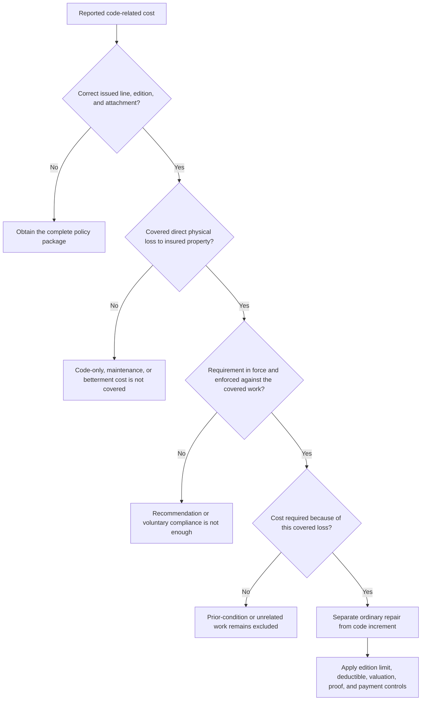

# Ordinance or Law Coverage

## Scope and contract authority

Ordinance-or-law coverage is not a general betterment allowance. Start with the issued policy package: the policy line, base-form edition, Declarations, attached endorsement, and any applicable state amendatory form. The form and attached endorsement are contract authority. The claims manual and filing memorandum explain handling or revision intent; they do not create coverage, and the form controls if they differ.

For the supplied Mississippi forms, the base HO-3 2024-03 form begins with an exclusion. Its exact provision says: “We do not cover loss caused by enforcement of any ordinance, law, or governmental requirement regulating the construction, repair, replacement, removal, or demolition of property.” HO-3 2024-03 X.2 preserves an exception only “unless an ordinance or law endorsement is attached” ([HO-3 P.7](repo://forms/HO/MS/HO-3/2024-03.md#L467-L487), [HO-3 X.2-X.3](repo://forms/HO/MS/HO-3/2024-03.md#L579-L585)). HO 04 16 is the possible attached write-back for its own scope, not an automatic amendment to every homeowners or dwelling policy.

The 2023-11 endorsement states that it changes the insurance for ordinance-or-law enforcement and that, if it conflicts with another policy provision, “this endorsement controls with respect to Ordinance or Law Coverage”; all other provisions remain unchanged ([HO 04 16 2023 preamble](repo://forms/HO/MS/HO-04-16/2023-11.md#L14-L21), [HO 04 16 2023 conflict rule](repo://forms/HO/MS/HO-04-16/2023-11.md#L64-L66)). Read that acting endorsement together with the HO-3 exclusion: the endorsement modifies the base exclusion only within the ordinance-or-law coverage it actually provides, while the base form and all unmodified exclusions remain applicable ([HO-3 X.2-X.3](repo://forms/HO/MS/HO-3/2024-03.md#L579-L585), [HO 04 16 W.1-W.2](repo://forms/HO/MS/HO-04-16/2023-11.md#L70-L87)).

*Caption: Contract-review gates for an ordinance-or-law claim; the form and endorsement control the result.*

## Edition and line selection

Both HO 04 16 source documents identify their line as **HO-3**. The 2018-09 endorsement is effective September 1, 2018 and is marked superseded by the 2023-11 edition for policies effective on or after November 1, 2023; it remains relevant to policies written under its interval ([HO 04 16 2018 metadata and notice](repo://forms/HO/MS/HO-04-16/2018-09.md#L1-L9)). The 2023-11 edition is effective November 1, 2023 ([HO 04 16 2023 metadata](repo://forms/HO/MS/HO-04-16/2023-11.md#L1-L6)). Therefore:

| Issued policy situation | Governing ordinance-or-law wording |
| --- | --- |
| HO-3 policy written under the 2018-09 endorsement interval, with HO 04 16 2018-09 actually attached | HO 04 16 2018-09; do not substitute the later limit or later conditions. |
| HO-3 policy effective on or after 2023-11-01, with HO 04 16 attached in that package | HO 04 16 2023-11; the endorsement's 25% limit and its conditions apply. |
| HO-3 policy without HO 04 16 | HO-3 base wording applies. HO-3 2024-03 E.18-E.19 supplies its own built-in ordinance-related coverage, while P.7 and X.2 exclude enforcement-related loss except as otherwise provided ([HO-3 E.18-E.19](repo://forms/HO/MS/HO-3/2024-03.md#L437-L445), [HO-3 P.7/X.2](repo://forms/HO/MS/HO-3/2024-03.md#L467-L487), [HO-3 X.2-X.3](repo://forms/HO/MS/HO-3/2024-03.md#L579-L585)). |
| HO-4 2021-10 package | Use HO-4's own Additional Coverages wording unless a separately applicable attached endorsement changes it. HO 04 16 is identified as line HO-3, so do not transfer its HO-3 limit to HO-4 ([HO 04 16 2023 metadata](repo://forms/HO/MS/HO-04-16/2023-11.md#L1-L6)). |

The effective date selects a candidate edition; it does not prove attachment. Confirm the endorsement schedule and complete issued package. A listed-but-missing endorsement cannot be used as a coverage grant. A later edition does not rewrite a superseded policy; preserve the older edition when it governed the policy.

## Base-form landscape

The percentages below are the wording of the supplied editions. They are not an automatic conclusion that a particular policy's Declarations or attachments provide the referenced limit.

| Form and edition | Base exclusion or limitation | Built-in ordinance-or-law treatment in the supplied edition |
| --- | --- | --- |
| DP-3 2026-01 | P.41 and X.2 exclude enforcement loss and compliance costs. | The supplied Additional Coverages section lists debris, mitigation, tree, and related provisions but no listed ordinance-or-law grant. Do not carry an older DP-3 percentage into this edition ([DP-3 E.1-E.4](repo://forms/DP/MS/DP-3/2026-01.md#L834-L857), [DP-3 P.41/X.2](repo://forms/DP/MS/DP-3/2026-01.md#L1394-L1397), [DP-3 X.2](repo://forms/DP/MS/DP-3/2026-01.md#L1436-L1445)). |
| HO-3 2024-03 | A.27 limits increased ordinance-or-law costs unless otherwise provided; P.7 excludes enforcement loss and X.2 repeats the exclusion unless an endorsement is attached ([HO-3 A.27](repo://forms/HO/MS/HO-3/2024-03.md#L149-L153), [HO-3 P.7/X.2](repo://forms/HO/MS/HO-3/2024-03.md#L467-L487), [HO-3 X.2-X.3](repo://forms/HO/MS/HO-3/2024-03.md#L579-L585)). | E.18 provides increased compliance cost at **15% of the amount of insurance that applies to the dwelling**. E.19 separately provides required demolition and reconstruction, subject to its wording ([HO-3 E.18-E.19](repo://forms/HO/MS/HO-3/2024-03.md#L439-L445)). |
| HO-4 2021-10 | B.19 preserves the other-structures boundary and D.16 does not provide ordinance-or-law cost under Coverage D ([HO-4 B.19](repo://forms/HO/MS/HO-4/2021-10.md#L161-L167), [HO-4 D.16](repo://forms/HO/MS/HO-4/2021-10.md#L339-L349)). | E.45-E.48 state a **10% of Coverage A** reference, required undamaged-portion demolition, different compliant materials or methods, and permits. But HO-4 A.1-A.3 expressly says Coverage A is not provided. Treat that literal dependency as a policy-package issue; do not invent a Coverage A limit ([HO-4 A.1-A.3](repo://forms/HO/MS/HO-4/2021-10.md#L71-L77), [HO-4 E.45-E.48](repo://forms/HO/MS/HO-4/2021-10.md#L445-L453)). |
| HO-5 2022-06 | P.4 and X.1 contain enforcement exclusions, subject to the form's Additional Coverages wording. | E.31-E.35 provide **15% of the applicable amount of Coverage A**, required demolition or clearing, increased compliant work, and repair-or-replace and documentation conditions ([HO-5 E.31-E.35](repo://forms/HO/MS/HO-5/2022-06.md#L487-L495), [HO-5 P.4/X.1](repo://forms/HO/MS/HO-5/2022-06.md#L575-L581), [HO-5 X.1](repo://forms/HO/MS/HO-5/2022-06.md#L711-L717)). The source does not say to treat that percentage as a separate amount in addition to Coverage A. |
| HO-6 2023-02 | X.1 excludes enforcement loss unless an ordinance-or-law endorsement is attached. | E.40 provides **additional coverage of 15% of Coverage A** for enforcement costs; E.41 limits undamaged-property removal and excludes unrelated correction and failure-to-comply costs ([HO-6 E.40-E.41](repo://forms/HO/MS/HO-6/2023-02.md#L440-L446), [HO-6 X.1](repo://forms/HO/MS/HO-6/2023-02.md#L668-L674)). |

The supplied HO-3 and HO-4 base forms are Mississippi editions. The table's additional lines preserve repository context, but their wording does not make HO 04 16 applicable to those lines. Confirm the policy line, Declarations, attached endorsement, effective edition, and any state-mandated modification before applying a percentage.

## Common trigger and covered work under HO 04 16

Both editions require a covered physical-loss path before code costs can be considered. The controlling requirements are:

1. **Covered direct physical loss first.** The 2018 edition states, “This endorsement applies only when an insured suffers a direct physical loss to covered property. The loss must be caused by a peril insured against under this policy,” and excludes code-only loss without that damage ([HO 04 16 2018 W.0](repo://forms/HO/MS/HO-04-16/2018-09.md#L13-L31)). The 2023 edition requires direct physical loss caused by a covered peril during the policy period ([HO 04 16 2023 W.1-W.4](repo://forms/HO/MS/HO-04-16/2023-11.md#L70-L87)).
2. **An applicable requirement in force and enforced.** The requirement must regulate the repair, construction, demolition, reconstruction, replacement, occupancy, or use described by the edition; it must be in force and enforced by the governmental authority having jurisdiction. A recommendation, anticipated future requirement, private preference, or voluntary compliance is insufficient ([HO 04 16 2018 W.7-W.9/W.64-W.65](repo://forms/HO/MS/HO-04-16/2018-09.md#L27-L35), [HO 04 16 2018 W.64-W.66](repo://forms/HO/MS/HO-04-16/2018-09.md#L181-L187), [HO 04 16 2023 W.2](repo://forms/HO/MS/HO-04-16/2023-11.md#L76-L83), [HO 04 16 2023 W.48](repo://forms/HO/MS/HO-04-16/2023-11.md#L587-L594)).
3. **A required cost attributable to the covered loss.** The insured must identify the required work and separate its incremental cost from ordinary repair. Both editions exclude prior-condition correction, age or condition requirements not triggered by the loss, elective betterment, and unrelated work ([HO 04 16 2018 W.8-W.10](repo://forms/HO/MS/HO-04-16/2018-09.md#L27-L35), [HO 04 16 2023 W.15-W.18](repo://forms/HO/MS/HO-04-16/2023-11.md#L133-L149), [HO 04 16 2023 W.21-W.25](repo://forms/HO/MS/HO-04-16/2023-11.md#L160-L181)).

Once those gates are met, the endorsements address three principal categories:

- **Undamaged portion:** loss in value or required demolition of an undamaged portion when the ordinance or law requires it because of the covered loss ([HO 04 16 2018 W.1-W.4](repo://forms/HO/MS/HO-04-16/2018-09.md#L55-L65), [HO 04 16 2023 W.5-W.7](repo://forms/HO/MS/HO-04-16/2023-11.md#L89-L100)).
- **Demolition and debris:** reasonable required demolition and necessary debris removal resulting from that demolition ([HO 04 16 2018 W.4/W.10-W.11](repo://forms/HO/MS/HO-04-16/2018-09.md#L61-L77), [HO 04 16 2023 W.7](repo://forms/HO/MS/HO-04-16/2023-11.md#L97-L100)).
- **Increased construction cost:** the incremental cost to repair, rebuild, or replace covered property so the work complies. The ordinary repair cost is not itself the code increment ([HO 04 16 2018 W.5-W.6](repo://forms/HO/MS/HO-04-16/2018-09.md#L63-L69), [HO 04 16 2023 W.11-W.12/W.21-W.22](repo://forms/HO/MS/HO-04-16/2023-11.md#L114-L121), [HO 04 16 2023 W.455-W.462](repo://forms/HO/MS/HO-04-16/2023-11.md#L455-L463)).

The 2018 edition expressly lists required changes to foundations, framing, walls, roofs, wiring, plumbing, heating, cooling, fixtures, accessibility, fire protection, safety, structural, utility, sanitation, drainage, and energy-conservation features, along with permits, plan review, inspection, and necessary architectural, engineering, or design services ([HO 04 16 2018 W.14-W.19](repo://forms/HO/MS/HO-04-16/2018-09.md#L81-L93)). The 2023 edition permits professional services only when directly required by the applicable ordinance or law and excludes services used to dispute or appeal it ([HO 04 16 2023 definitions](repo://forms/HO/MS/HO-04-16/2023-11.md#L1022-L1029), [HO 04 16 2023 exclusions](repo://forms/HO/MS/HO-04-16/2023-11.md#L440-L447)). Neither list makes an otherwise uncovered cause, property, or cost payable.

Both editions retain important boundaries: no code-only loss without covered physical damage, no excluded underlying cause, no land-use or pollutant compliance cost except where the specific edition preserves a covered-loss exception, no fines or penalties, no loss of use or income, and no elective improvement or betterment ([HO 04 16 2018 W.20-W.30](repo://forms/HO/MS/HO-04-16/2018-09.md#L95-L117), [HO 04 16 2023 W.15-W.30](repo://forms/HO/MS/HO-04-16/2023-11.md#L133-L202)). The 2023 text also excludes voluntary standards and costs not enforced against the covered work ([HO 04 16 2023 W.27-W.32](repo://forms/HO/MS/HO-04-16/2023-11.md#L901-L926), [HO 04 16 2023 W.48](repo://forms/HO/MS/HO-04-16/2023-11.md#L587-L594)).

## Edition-specific limits and payment controls

### HO 04 16 2018-09

The 2018 edition states: “The most we will pay for Ordinance or Law coverage is ten percent of Coverage A.” It applies the limit to the total of all amounts payable under that coverage and says the limit does not increase the amount payable for direct physical loss ([HO 04 16 2018 limit](repo://forms/HO/MS/HO-04-16/2018-09.md#L213-L221)). Do not read the 10% as a free-standing amount beyond Coverage A unless the issued policy says otherwise.

The 2018 edition may pay covered loss as work progresses or after work is completed when incurred costs are supported. It may withhold increased-construction-cost payment until the building is repaired, rebuilt, or constructed and the insured supplies evidence that the completed work complies ([HO 04 16 2018 W.17-W.18](repo://forms/HO/MS/HO-04-16/2018-09.md#L47-L51), [HO 04 16 2018 W.42-W.45](repo://forms/HO/MS/HO-04-16/2018-09.md#L137-L145)).

### HO 04 16 2023-11

The 2023 edition states: “The most we will pay is twenty-five percent.” It ties the coverage to Coverage A property only to the extent the policy provides that insurance and says one limit applies to the total covered costs regardless of the number of ordinances or laws ([HO 04 16 2023 limit](repo://forms/HO/MS/HO-04-16/2023-11.md#L356-L394)). This is a single 25% maximum, not a separate amount per governmental requirement.

The 2023 edition permits covered ordinance-or-law costs in addition to direct-physical-loss amounts, but the same cost cannot be paid twice and increased cost must be separately identified when needed ([HO 04 16 2023 W.21-W.22/W.42](repo://forms/HO/MS/HO-04-16/2023-11.md#L455-L463), [HO 04 16 2023 W.42](repo://forms/HO/MS/HO-04-16/2023-11.md#L560-L566)). Increased construction cost requires repair or replacement, generally at the same residence premises unless the ordinance or law prohibits that location, and payment is limited to reasonable costs actually incurred ([HO 04 16 2023 W.13-W.14](repo://forms/HO/MS/HO-04-16/2023-11.md#L125-L131), [HO 04 16 2023 W.33-W.35](repo://forms/HO/MS/HO-04-16/2023-11.md#L207-L221), [HO 04 16 2023 W.64](repo://forms/HO/MS/HO-04-16/2023-11.md#L344-L350)).

### Deductible, notice, proof, and payment

The deductible applies after covered ordinance-or-law loss is determined in both editions. The 2018 wording applies it only to otherwise covered loss after valuation and applicable exclusions; it does not create coverage ([HO 04 16 2018 deductible](repo://forms/HO/MS/HO-04-16/2018-09.md#L295-L313)). The 2023 wording applies it to covered enforcement loss after determining coverage and excluding non-attributable amounts ([HO 04 16 2023 deductible](repo://forms/HO/MS/HO-04-16/2023-11.md#L614-L636)). The policy deductible and any mandatory state treatment still control.

The evidence package should preserve the governmental notice, order, citation, permit, inspection material, plan, estimate, contract, invoice, and proof of payment needed to identify the requirement and separate compliance cost from ordinary repair, prior-condition correction, or betterment. The 2018 edition requires prompt notice, records, inspection access, cost records, and evidence of performed work ([HO 04 16 2018 W.33-W.44](repo://forms/HO/MS/HO-04-16/2018-09.md#L121-L143)). The 2023 edition requires notice, records, access, plans and specifications, permits, and evidence of incurred compliant work ([HO 04 16 2023 W.36-W.47](repo://forms/HO/MS/HO-04-16/2023-11.md#L223-L274), [HO 04 16 2023 W.63-W.64](repo://forms/HO/MS/HO-04-16/2023-11.md#L344-L350)). These duties support adjustment and payment; they do not independently create coverage.

## HO-4 boundary and Coverage A dependency

HO-4 2021-10 is not an HO-3 form. Its A.1-A.3 provisions expressly say that Coverage A is not provided and that the policy does not insure the dwelling under Coverage A ([HO-4 A.1-A.3](repo://forms/HO/MS/HO-4/2021-10.md#L71-L77)). Its E.45-E.48 nevertheless state a built-in 10%-of-Coverage-A reference, undamaged-portion demolition, compliant materials or methods, and permits ([HO-4 E.45-E.48](repo://forms/HO/MS/HO-4/2021-10.md#L445-L453)). The literal conflict or missing-limit question must be resolved from the issued policy, declarations, and any applicable amendment; do not convert the reference into an invented limit.

The 2023 HO 04 16 endorsement likewise says its provision applies only to property for which Coverage A insurance is provided and does not extend to property insured under another coverage unless the policy says otherwise ([HO 04 16 2023 W.2](repo://forms/HO/MS/HO-04-16/2023-11.md#L356-L366), [HO 04 16 2023 W.50](repo://forms/HO/MS/HO-04-16/2023-11.md#L600-L603)). Since the endorsement metadata identifies line HO-3 and HO-4 denies Coverage A, neither the HO-3 endorsement percentage nor a Coverage-A calculation should be transferred to an HO-4 policy without an applicable issued provision.

## State, memorandum, and claims-guidance boundaries

All operative form evidence cited here is from Mississippi editions. No separate state ordinance-or-law amendatory form is supplied in the assigned evidence. If a state amendatory endorsement is attached, read its scope and conflict rule with the base form and HO 04 16; it can change the result only within the authority of its issued wording. Do not substitute a bulletin, underwriting rule, claims manual, or memorandum for that contract text.

The HO-3 2024-03 memorandum says the ordinance-or-law provision was revised to make its relationship to Coverage A direct and to set the applicable limit at 15% of Coverage A ([HO-3 2024-03 memorandum](repo://memoranda/HO-3-2024-03.md#L143-L151)). It also explains that the revised exclusion distinguishes covered physical damage from compliance expense ([HO-3 2024-03 memorandum](repo://memoranda/HO-3-2024-03.md#L381-L389)). Those are interpretation notes, not additional policy language; the HO-3 form controls if the memorandum and form differ ([HO-3 E.18-E.19](repo://forms/HO/MS/HO-3/2024-03.md#L439-L445), [HO-3 P.7](repo://forms/HO/MS/HO-3/2024-03.md#L475-L487)).

The claims manual supplies a useful investigation sequence but is not contract authority. It directs the handler to confirm covered direct physical loss, identify and separate damaged and undamaged components, obtain the authority's requirement, distinguish repair from replacement, separate required demolition from convenience demolition, and establish a baseline estimate before measuring increased construction cost ([claims manual 16.A-16.H](repo://manuals/claims/manual.md#L5311-L5359), [claims manual 16.M-16.R](repo://manuals/claims/manual.md#L5385-L5419)). It also recommends that roofing code assertions be confirmed through the authority rather than inferred from contractor opinion alone ([claims manual 16.Y](repo://manuals/claims/manual.md#L5451-L5459)). Those are handling controls; the applicable base form and attached endorsement control coverage.

Do not use the water-loss handling guide to decide insurability. It is expressly operational and noncontractual and says the applicable policy, endorsements, definitions, exclusions, conditions, and valuation terms govern ([water-loss guidance H.0.1-H.0.2](repo://guidelines/claims/water-loss-handling.md#L13-L21), [water-loss guidance H.0.11-H.0.17](repo://guidelines/claims/water-loss-handling.md#L33-L47)).

## Roof-loss interaction

Ordinance-or-law coverage and roof settlement answer different questions:

- **Cause and coverage:** the roof must first have covered direct physical loss, and the code requirement must result from that loss. A roof condition caused only by age, deterioration, or an unenforced recommendation does not satisfy the ordinance-or-law trigger ([HO 04 16 2023 W.3](repo://forms/HO/MS/HO-04-16/2023-11.md#L81-L87), [HO 04 16 2023 W.15-W.18](repo://forms/HO/MS/HO-04-16/2023-11.md#L133-L149)).
- **HO-3 settlement:** HO-3 2024-03 settles covered dwelling damage on replacement cost when its 80% insured-to-value condition is met and separately addresses the dwelling loss-settlement basis for roof surfacing ([HO-3 A.10-A.13](repo://forms/HO/MS/HO-3/2024-03.md#L117-L123)). That valuation of damaged roof surfacing is separate from the code-cost increment.
- **DP-3 settlement:** DP-3 2026-01 states that roof surfacing is settled on an actual-cash-value basis unless an actual-cash-value roof schedule endorsement is attached ([DP-3 roof settlement](repo://forms/DP/MS/DP-3/2026-01.md#L161-L166)). Do not carry an HO-3 replacement-cost statement into that DP-3 edition.
- **Roof schedule effect:** HO 23 74 2025-05 settles roof surfacing at actual cash value when the damaged roof surfacing is at least 12 years old, whether or not it is repaired or replaced ([HO 23 74 roof settlement](repo://forms/HO/MS/HO-23-74/2025-05.md#L88-L105)). It does not itself create or remove ordinance-or-law coverage; its building-requirement costs still require coverage under the policy and proof that the requirement applies to the covered repair ([HO 23 74 W.27-W.28](repo://forms/HO/MS/HO-23-74/2025-05.md#L202-L208)).
- **Code-cost separation:** when HO 04 16 2023-11 is attached to the applicable HO-3 package, its own trigger, 25% single limit, deductible, repair-or-replacement rule, and proof requirements govern the ordinance-or-law increment. In particular, it requires repair or replacement for increased construction cost even though a roof schedule may settle damaged roof surfacing at actual cash value without requiring replacement ([HO 04 16 2023 W.11-W.14](repo://forms/HO/MS/HO-04-16/2023-11.md#L114-L131), [HO 04 16 2023 limit and payment](repo://forms/HO/MS/HO-04-16/2023-11.md#L356-L394)).

A roof estimate should keep at least three amounts distinguishable: covered physical roof damage under the applicable settlement basis, ordinary repair or replacement cost, and the incremental cost required by an enforced ordinance or law. The code-cost limit applies only to the supported code-related amount after the underlying loss and every applicable form, endorsement, deductible, and proof condition are satisfied.
