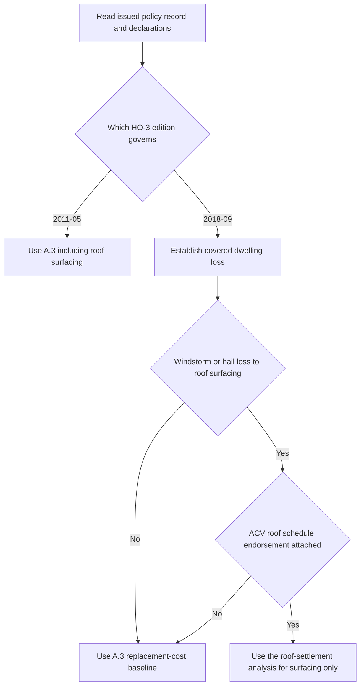

## Purpose and property boundary

Coverage A covers the dwelling at the residence premises shown in the Declarations, including attached structures. It also covers materials and supplies on or next to the residence premises when used to construct, alter, or repair that dwelling. This property boundary is the same in **HO-3 edition 2011-05** and **HO-3 edition 2018-09**. [HO-3 2011-05, A.1–A.2](repo://forms/HO/MS/HO-3/2011-05.md#L25-L33) · [HO-3 2018-09, A.1–A.2](repo://forms/HO/MS/HO-3/2018-09.md#L23-L33)

For **HO-3 2018-09**, Coverage A and Coverage B insure against direct physical loss to the described property except as excluded in Section I. The property description and the settlement rule therefore do not themselves establish that a reported condition is covered. Establish the applicable cause-of-loss and exclusion analysis before selecting a settlement basis; see [Section I Property Perils and General Exclusions](../property/perils-and-general-exclusions.md). [HO-3 2018-09, P.1](repo://forms/HO/MS/HO-3/2018-09.md#L59-L63)

## Select the issued edition first

The issued base-form edition controls the Coverage A baseline. **HO-3 2011-05** was superseded for policies written on or after 2018-09-01, but remains in force for policies written under it and governs their losses regardless of when reported. **HO-3 2018-09** is the multistate form effective for policies written on or after 2018-09-01. Do not substitute the later roof wording into a 2011-05 policy. [HO-3 2011-05, applicability and continuing-force notice](repo://forms/HO/MS/HO-3/2011-05.md#L1-L7) · [HO-3 2018-09, applicability](repo://forms/HO/MS/HO-3/2018-09.md#L1-L4)

Use the Declarations and issued policy record to identify the form edition, Coverage A limit, deductible, and endorsements actually attached. The wider assembly rules, including state amendments, are in [Governing Form Editions and Policy Assembly](../policy-editions-and-governing-forms.md).

## Replacement-cost baseline and the 80-percent condition

Both editions condition replacement-cost settlement on the dwelling being insured to at least 80 percent of its replacement cost at the time of loss. The **2011-05 A.3** wording expressly includes roof surfacing: **“Losses to the dwelling, including roof surfacing, are settled at replacement cost subject to the applicable deductible, provided the dwelling is insured to at least eighty percent of its replacement cost at the time of loss.”** [HO-3 2011-05, A.3](repo://forms/HO/MS/HO-3/2011-05.md#L27-L34)

The **2018-09 A.3** baseline retains that condition but makes it subject to A.4: **“Losses to the dwelling are settled at replacement cost, subject to the roof surfacing provisions in A.4 and to the applicable deductible, provided the dwelling is insured to at least eighty percent of its replacement cost at the time of loss.”** [HO-3 2018-09, A.3](repo://forms/HO/MS/HO-3/2018-09.md#L25-L33)

In both editions, replacement cost is the like-kind-and-quality repair or replacement cost without a depreciation deduction. The 2018-09 definition additionally says it is measured at the time of loss. A.3 states the 80-percent condition, but neither edition supplies a separate below-threshold payment formula in that provision; do not create one from A.3 alone. [HO-3 2011-05, Definitions 1–2](repo://forms/HO/MS/HO-3/2011-05.md#L13-L18) · [HO-3 2018-09, Definitions 1–2](repo://forms/HO/MS/HO-3/2018-09.md#L9-L14)

## Edition-specific roof-surfacing routing

| Question | HO-3 2011-05 | HO-3 2018-09 |
| --- | --- | --- |
| Ordinary Coverage A settlement | A.3 includes roof surfacing in replacement-cost settlement, subject to the deductible and 80-percent condition. | A.3 provides replacement-cost settlement, subject to A.4, the deductible, and the 80-percent condition. |
| Windstorm or hail roof surfacing | No separate roof-surfacing settlement basis appears in this edition. Do not import A.4 or a roof schedule from a later form. | A.4 routes this narrow question to replacement cost unless an actual-cash-value roof schedule endorsement is attached. |
| Effect of an attached roof schedule | The supplied 2011-05 form supplies no A.4 roof-schedule route. | The endorsement governs **roof surfacing only**; all other dwelling components continue under A.3. |

The controlling **2018-09 A.4** text is: **“Loss to roof surfacing caused by windstorm or hail is settled at replacement cost unless an actual cash value roof schedule endorsement is attached to this policy, in which case that endorsement governs settlement for the roof surfacing only.”** [HO-3 2018-09, A.3–A.4](repo://forms/HO/MS/HO-3/2018-09.md#L25-L34)

*The routing flow preserves the 2011-05 baseline and sends only a covered 2018-09 windstorm-or-hail roof-surfacing loss with a verified attached ACV schedule to the separate settlement analysis.* [HO-3 2011-05, A.3](repo://forms/HO/MS/HO-3/2011-05.md#L27-L34) · [HO-3 2018-09, A.3–A.4](repo://forms/HO/MS/HO-3/2018-09.md#L25-L34)

### Attachment is required, not inferred

**HO 23 74 edition 2018-09** identifies itself as an endorsement that attaches to HO-3 and modifies Section I A.4. It is not an automatic feature of HO-3 2018-09. Apply its actual-cash-value schedule only after confirming that this edition of the endorsement is attached to the issued policy. Without that attachment, A.4 leaves qualifying windstorm- or hail-caused roof surfacing at replacement cost under the A.3 baseline. [HO 23 74 2018-09, introductory text](repo://forms/HO/MS/HO-23-74/2018-09.md#L1-L4) · [HO-3 2018-09, A.4](repo://forms/HO/MS/HO-3/2018-09.md#L31-L34)

Underwriting requirements do not prove attachment. For example, the Texas appetite guide calls for HO 23 74 for specified older roofs at new business and renewal, but labels itself internal underwriting guidance rather than policy contract language. The referral matrix similarly describes authority to attach the endorsement as an underwriting control. Those rules may govern binding activity; they do not establish that a particular issued policy includes the endorsement. [Texas Homeowners Appetite Guide, status and G.2](repo://guidelines/appetite/tx-homeowners.md#L1-L3) [Texas Homeowners Appetite Guide, G.2](repo://guidelines/appetite/tx-homeowners.md#L15-L21) · [Underwriting Referral and Authority Matrix, purpose and R.5](repo://guidelines/authority/referral-matrix.md#L1-L4) [Underwriting Referral and Authority Matrix, R.5](repo://guidelines/authority/referral-matrix.md#L41-L45)

## Handoff and focused file review

For the resulting **2018-09** roof-surfacing route, use [Roof settlement](roof-settlement.md). That page addresses the endorsement's defined surfacing boundary, wind/hail actual-cash-value calculation, material-and-age schedule, 25-percent pre-deductible floor, and ordinance-or-law path. It is not a substitute for the issued-edition and attachment checks on this page.

A focused Coverage A review should record:

1. The policy-written date and issued HO-3 edition.
2. The Declarations' Coverage A limit and deductible, plus every attached endorsement and its edition.
3. The damaged property and the coverage/exclusion conclusion.
4. Whether the claim is a 2018-09 windstorm-or-hail loss to roof surfacing and whether the ACV roof schedule is actually attached.
5. The selected settlement path and supporting form language.

For deductible selection and Section I notice, preservation, proof-of-loss, and payment conditions, see [Section I Claim Conditions, Payment, and Deductibles](../property/claim-conditions-and-deductibles.md).
