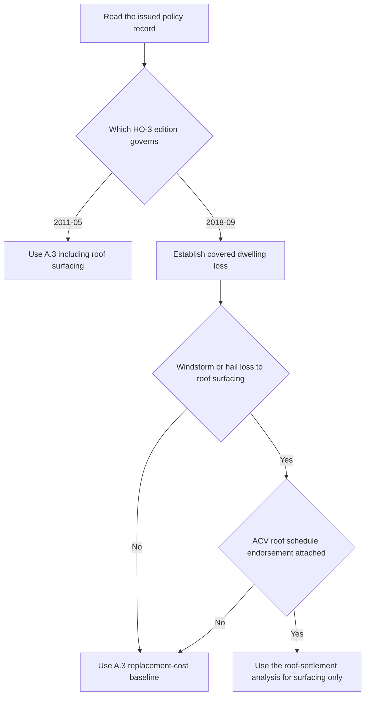

## Purpose and dwelling boundary

Coverage A is the dwelling coverage for the residence premises shown in the Declarations. In both HO-3 edition 2011-05 and HO-3 edition 2018-09, it reaches the dwelling itself, including attached structures, and also covers materials and supplies on or next to the residence premises when they are used to construct, alter, or repair that dwelling. [HO-3 2011-05, A.1–A.2](repo://forms/HO/MS/HO-3/2011-05.md#L25-L33) · [HO-3 2018-09, A.1–A.2](repo://forms/HO/MS/HO-3/2018-09.md#L23-L33)

For HO-3 2018-09, Coverage A responds to direct physical loss to the described dwelling property except as excluded in Section I. The property description does not itself establish coverage; the cause-of-loss and exclusion analysis still comes first. [HO-3 2018-09, P.1](repo://forms/HO/MS/HO-3/2018-09.md#L59-L63)

## Use the issued edition first

The issued base-form edition controls the Coverage A baseline. HO-3 2011-05 remains in force for policies written under it, even after HO-3 2018-09 became effective for later writings. Do not import the later roof wording into a 2011-05 policy. Use the Declarations and issued policy record to identify the form edition, Coverage A limit, deductible, and any attached endorsements. [HO-3 2011-05, applicability and continuing-force notice](repo://forms/HO/MS/HO-3/2011-05.md#L1-L7) · [HO-3 2018-09, applicability](repo://forms/HO/MS/HO-3/2018-09.md#L1-L4)

## Replacement-cost baseline and the 80-percent condition

Both editions settle dwelling loss at replacement cost only if the dwelling is insured to at least 80 percent of its replacement cost at the time of loss. Replacement cost means like-kind-and-quality repair or replacement without depreciation; in HO-3 2018-09 it is measured at the time of loss. A.3 states the 80-percent condition, but it does not supply a separate below-threshold payment formula. [HO-3 2011-05, Definitions 1–2](repo://forms/HO/MS/HO-3/2011-05.md#L13-L18) · [HO-3 2018-09, Definitions 1–2](repo://forms/HO/MS/HO-3/2018-09.md#L9-L14)

- HO-3 2011-05: dwelling losses, including roof surfacing, are settled at replacement cost subject to the deductible if the 80-percent condition is met.
- HO-3 2018-09: dwelling losses are settled at replacement cost, subject to the roof-surfacing provision in A.4, the deductible, and the 80-percent condition. [HO-3 2011-05, A.3](repo://forms/HO/MS/HO-3/2011-05.md#L27-L34) · [HO-3 2018-09, A.3](repo://forms/HO/MS/HO-3/2018-09.md#L25-L33)

*The flow preserves the older baseline and sends only a covered 2018-09 windstorm-or-hail roof-surfacing loss with a verified attached schedule to the separate roof-settlement analysis.*

## Roof surfacing is a dwelling sub-scope, not a separate dwelling grant

HO-3 2018-09 keeps ordinary dwelling settlement in A.3, but A.4 creates a narrow routing rule for roof surfacing caused by windstorm or hail. If no actual cash value roof schedule endorsement is attached, that roof-surfacing loss is settled at replacement cost under the A.3 baseline. If the endorsement is attached, it governs roof surfacing only; all other dwelling components remain under A.3. [HO-3 2018-09, A.3–A.4](repo://forms/HO/MS/HO-3/2018-09.md#L25-L34)

HO 23 74 edition 2018-09 is the attached endorsement that changes that branch. It says it modifies Section I A.4, applies to roof surfacing only, and leaves all other dwelling components at replacement cost under A.3. Its attachment is not inferred from underwriting practice; it must appear in the issued policy. [HO 23 74 2018-09, heading and R.1–R.2](repo://forms/HO/MS/HO-23-74/2018-09.md#L1-L15)

### Attachment is required, not assumed

The policy assembly must show the endorsement. The Texas appetite guide and referral matrix may influence whether an endorsement is offered or attached at binding or renewal, but they do not change the meaning of an issued contract. They do not establish attachment for a particular loss. [Texas Homeowners Appetite Guide, status and G.2](repo://guidelines/appetite/tx-homeowners.md#L1-L3) [Texas Homeowners Appetite Guide, G.2](repo://guidelines/appetite/tx-homeowners.md#L15-L21) · [Underwriting Referral and Authority Matrix, purpose and R.5](repo://guidelines/authority/referral-matrix.md#L1-L4) [Underwriting Referral and Authority Matrix, R.5](repo://guidelines/authority/referral-matrix.md#L41-L45)

## Handoff for roof-surfacing questions

Use [Roof settlement](roof-settlement.md) for the attached HO 23 74 route. That page covers the surfacing boundary, the material-and-age schedule, the 25-percent floor, deductible handling, and the separate ordinance-or-law path. This page stays on the Coverage A baseline: what the dwelling is, when replacement cost applies, and when a roof-surfacing endorsement changes only that narrow branch.

For claim conditions, payment timing, proof of loss, and deductible mechanics, see [Section I Claim Conditions, Payment, and Deductibles](../property/claim-conditions-and-deductibles.md).
