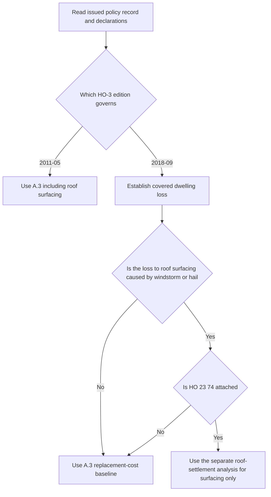

## Purpose and coverage boundary

Coverage A is the dwelling grant in the HO-3 form. It covers the dwelling on the residence premises shown in the Declarations, including structures attached to the dwelling, and it also covers materials and supplies located on or next to the residence premises when they are used to construct, alter, or repair the dwelling. This boundary is the same in **HO-3 edition 2011-05** and **HO-3 edition 2018-09**. [HO-3 2011-05, A.1–A.2](repo://forms/HO/MS/HO-3/2011-05.md#L27-L31) · [HO-3 2018-09, A.1–A.2](repo://forms/HO/MS/HO-3/2018-09.md#L25-L29)

For the Coverage A grant, the 2018-09 form also states the covered-loss gateway for Coverage A and Coverage B: the policy insures against direct physical loss to property described in those coverages, except as excluded in Section I. The grant therefore does not by itself establish that a reported condition is payable; coverage must still be established under the applicable peril and exclusion provisions before settlement is selected. See [Section I Property Perils and General Exclusions](../property/perils-and-general-exclusions.md). [HO-3 2018-09, P.1](repo://forms/HO/MS/HO-3/2018-09.md#L59-L63)

## Choose the issued edition first

The issued base-form edition controls the Coverage A baseline. **HO-3 2011-05** was superseded for policies written on or after 2018-09-01, but it remains in force for policies written under it and governs their losses regardless of when reported. **HO-3 2018-09** is the multistate form effective for policies written on or after 2018-09-01. Do not substitute the later roof wording into a 2011-05 policy. [HO-3 2011-05, applicability and continuing-force notice](repo://forms/HO/MS/HO-3/2011-05.md#L1-L7) · [HO-3 2018-09, applicability](repo://forms/HO/MS/HO-3/2018-09.md#L1-L4)

Use the Declarations and issued policy record to identify the form edition, Coverage A limit, deductible, and endorsements actually attached. The broader assembly rules, including state amendments, are in [Policy Editions and Governing Forms](../policy-editions-and-governing-forms.md).

## Replacement-cost baseline and the 80-percent condition

Both editions make replacement cost the ordinary dwelling settlement baseline and condition it on the dwelling being insured to at least 80 percent of its replacement cost at the time of loss.

- **2011-05 A.3**: “Losses to the dwelling, including roof surfacing, are settled at replacement cost subject to the applicable deductible, provided the dwelling is insured to at least eighty percent of its replacement cost at the time of loss.” [HO-3 2011-05, A.3](repo://forms/HO/MS/HO-3/2011-05.md#L31-L33)
- **2018-09 A.3**: “Losses to the dwelling are settled at replacement cost, subject to the roof surfacing provisions in A.4 and to the applicable deductible, provided the dwelling is insured to at least eighty percent of its replacement cost at the time of loss.” [HO-3 2018-09, A.3](repo://forms/HO/MS/HO-3/2018-09.md#L31-L33)

In both editions, replacement cost means repair or replacement with material of like kind and quality without deduction for depreciation. The 2018-09 definition adds that the cost is measured at the time of loss. [HO-3 2011-05, Definitions 1–2](repo://forms/HO/MS/HO-3/2011-05.md#L15-L18) · [HO-3 2018-09, Definitions 1–2](repo://forms/HO/MS/HO-3/2018-09.md#L11-L14)

The 80-percent condition is a settlement condition in A.3; it is not a separate grant of coverage and it does not itself create a below-threshold payment formula. Use the Declarations and any governing state form or endorsement to determine the deductible and any other settlement modifiers. [HO-3 2011-05, A.3 and S.4](repo://forms/HO/MS/HO-3/2011-05.md#L31-L34) · [HO-3 2018-09, A.3 and S.5](repo://forms/HO/MS/HO-3/2018-09.md#L31-L34) [L101-L112](repo://forms/HO/MS/HO-3/2018-09.md#L101-L112)

## Settlement control flow

*The control flow keeps the dwelling grant separate from the roof-surfacing route and sends only a covered 2018-09 windstorm-or-hail roof-surfacing loss with an attached ACV schedule to the separate roof-settlement analysis.*

For **HO-3 2011-05**, A.3 expressly includes roof surfacing in the dwelling replacement-cost baseline, and the supplied edition contains no separate roof-surfacing settlement provision. Do not import 2018-09 roof wording into a 2011-05 policy. [HO-3 2011-05, A.3](repo://forms/HO/MS/HO-3/2011-05.md#L31-L33)

For **HO-3 2018-09**, A.3 keeps replacement cost as the dwelling baseline but makes it subject to A.4. A.4 is a narrow routing rule: loss to roof surfacing caused by windstorm or hail is settled at replacement cost unless an actual cash value roof schedule endorsement is attached, in which case that endorsement governs settlement for the roof surfacing only. All other dwelling components continue under A.3. [HO-3 2018-09, A.3–A.4](repo://forms/HO/MS/HO-3/2018-09.md#L31-L34)

That means a dwelling loss can split into two settlement bases when the same loss affects both roof surfacing and other dwelling components. Keep the roof-surfacing portion on the roof-settlement page and keep other dwelling components on this page's A.3 baseline.

## What this page does not do

Coverage A is not the place to add ordinance-or-law costs or to treat code-required undamaged work as part of the dwelling grant. HO-3 Exclusion D.1 excludes the increased cost of construction, demolition, or repair required by ordinance or law unless an ordinance-or-law endorsement is attached. See [Ordinance or Law Coverage and Undamaged Roof Portions](../property/ordinance-or-law.md). [HO-3 2018-09, D.1](repo://forms/HO/MS/HO-3/2018-09.md#L91-L94)

Under the 2018-09 form, the deductible is selected under Section I conditions after coverage and the applicable settlement rule are identified. The base form also preserves the distinction between the dwelling settlement baseline and any separate deductible or state amendatory rule that may apply. [HO-3 2018-09, S.5](repo://forms/HO/MS/HO-3/2018-09.md#L101-L112)

## Focused review checklist

A Coverage A review should record:

1. The policy-written date and issued HO-3 edition.
2. The Declarations' Coverage A limit and deductible, plus every attached endorsement and its edition.
3. The damaged property and the coverage/exclusion conclusion.
4. Whether the loss is a 2018-09 windstorm-or-hail loss to roof surfacing and whether HO 23 74 is actually attached.
5. The selected settlement path and the form language supporting it.

For deductible selection and Section I notice, preservation, proof-of-loss, and payment conditions, see [Section I Claim Conditions, Payment, and Deductibles](../property/claim-conditions-and-deductibles.md).
