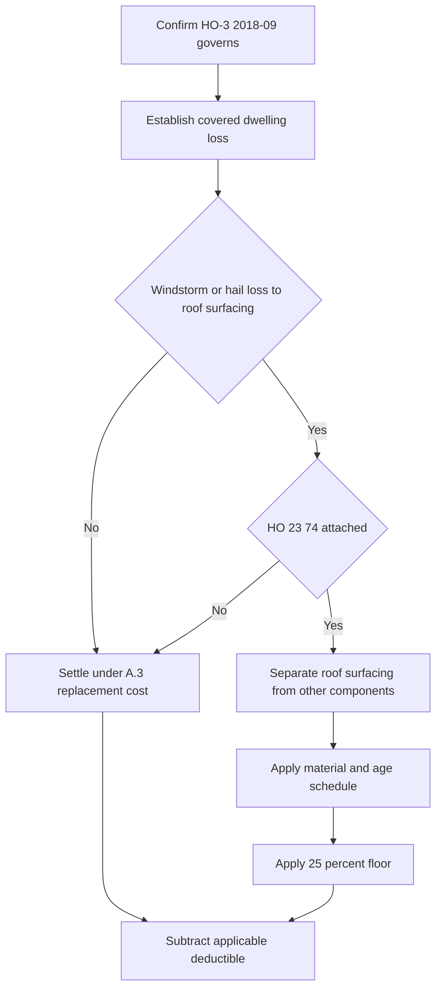

## Coverage A property and governing form

Coverage A applies to the dwelling at the residence premises in the Declarations, including attached structures, and to construction, alteration, or repair materials and supplies on or next to the residence premises. This scope is the same in **HO-3 edition 2011-05** and **HO-3 edition 2018-09**. It is not a blanket promise to pay for every condition at the residence: for **HO-3 2018-09**, Coverage A and B insure against *direct physical loss* except as excluded by Section I exclusions. [HO-3 2011-05 § A.1–A.2](repo://forms/HO/MS/HO-3/2011-05.md#L25-L33) · [HO-3 2018-09 § A.1–A.2 and P.1](repo://forms/HO/MS/HO-3/2018-09.md#L23-L33) [§ P.1](repo://forms/HO/MS/HO-3/2018-09.md#L59-L63)

Identify the issued base-form edition before deciding settlement. **HO-3 2011-05** was superseded for policies written on or after 2018-09-01, but its own supersession notice says that it remains in force for policies written under it and governs their losses regardless of when reported. **HO-3 2018-09** is the multistate form effective for policies written on or after 2018-09-01. A later form must not be retroactively substituted for a 2011-05 policy. [HO-3 2011-05](repo://forms/HO/MS/HO-3/2011-05.md#L1-L7) · [HO-3 2018-09](repo://forms/HO/MS/HO-3/2018-09.md#L1-L4)

## Replacement cost: condition and baseline

Both editions make replacement-cost settlement for the dwelling conditional on insurance to at least 80 percent of replacement cost at the time of loss. The controlling **HO-3 2011-05 A.3** wording is: **“Losses to the dwelling, including roof surfacing, are settled at replacement cost subject to the applicable deductible, provided the dwelling is insured to at least eighty percent of its replacement cost at the time of loss.”** [HO-3 2011-05 § A.3](repo://forms/HO/MS/HO-3/2011-05.md#L27-L34)

**HO-3 2018-09 A.3** retains that threshold, but expressly makes its baseline subject to the new roof provision: **“Losses to the dwelling are settled at replacement cost, subject to the roof surfacing provisions in A.4 and to the applicable deductible, provided the dwelling is insured to at least eighty percent of its replacement cost at the time of loss.”** [HO-3 2018-09 § A.3](repo://forms/HO/MS/HO-3/2018-09.md#L25-L33)

Replacement cost in both editions means repair or replacement with material of like kind and quality **without deduction for depreciation**; the 2018-09 definition adds that it is measured “at the time of loss.” The forms state the 80-percent condition but do not state a separate below-threshold payment formula in A.3, so a handling decision should not invent one from this provision alone. [HO-3 2011-05 Definitions 1–2](repo://forms/HO/MS/HO-3/2011-05.md#L13-L18) · [HO-3 2018-09 Definitions 1–2](repo://forms/HO/MS/HO-3/2018-09.md#L9-L14)

## The 2011-05 to 2018-09 roof change

| Question | HO-3 edition 2011-05 | HO-3 edition 2018-09 |
| --- | --- | --- |
| Base Coverage A settlement | A.3 includes roof surfacing in replacement-cost settlement, subject to the deductible and 80-percent condition. | A.3 provides replacement-cost settlement, subject to A.4, the deductible, and the same 80-percent condition. |
| Windstorm or hail roof surfacing | There is **no separate roof-surfacing settlement basis**. Roof surfacing remains replacement cost when the A.3 condition is met. | A.4 says windstorm- or hail-caused roof-surfacing loss is replacement cost **unless** an actual-cash-value roof schedule endorsement is attached. |
| If a roof schedule is attached | This edition supplies no A.4 roof-schedule routing rule. | The attached schedule governs **roof surfacing only**; “all other components of the dwelling continue to be settled under A.3.” |

For a **HO-3 2011-05** policy, roof surfacing is expressly part of the A.3 replacement-cost treatment; do not import the later roof-schedule result. For a **HO-3 2018-09** policy, A.4 is the routing rule: **“Loss to roof surfacing caused by windstorm or hail is settled at replacement cost unless an actual cash value roof schedule endorsement is attached to this policy, in which case that endorsement governs settlement for the roof surfacing only.”** [HO-3 2011-05 § A.3](repo://forms/HO/MS/HO-3/2011-05.md#L27-L34) · [HO-3 2018-09 § A.3–A.4](repo://forms/HO/MS/HO-3/2018-09.md#L25-L34)

> **Attachment is an invariant.** HO 23 74 is an endorsement, not an automatic feature of HO-3 2018-09. Apply its actual-cash-value schedule only after confirming that **HO 23 74 edition 2018-09 is attached to the policy**. Absent attachment, A.4 leaves windstorm or hail roof surfacing at replacement cost (subject to A.3 and the applicable deductible). [HO 23 74 2018-09, introductory text](repo://forms/HO/MS/HO-23-74/2018-09.md#L1-L4) · [HO-3 2018-09 § A.4](repo://forms/HO/MS/HO-3/2018-09.md#L31-L34)

This flow shows the **HO-3 2018-09** A.4 decision and the attached **HO 23 74 2018-09** settlement sequence; it does not apply to a HO-3 2011-05 roof-surfacing claim.

## What the attached HO 23 74 changes—and what it leaves alone

For a **HO-3 2018-09 policy with HO 23 74 edition 2018-09 attached**, the endorsement defines roof surfacing as shingles, tiles, shakes, metal panels, membrane, and the underlayment and flashing directly beneath them. It excludes roof deck, trusses, rafters, sheathing, and interior finish from that term. Those non-surfacing dwelling components continue to use **HO-3 2018-09 A.3** replacement-cost settlement, not the roof schedule. Estimates must therefore separate surfacing from structural and interior line items. [HO 23 74 2018-09 § R.1](repo://forms/HO/MS/HO-23-74/2018-09.md#L3-L10) · [HO-3 2018-09 § A.3–A.4](repo://forms/HO/MS/HO-3/2018-09.md#L31-L34)

The endorsement changes only windstorm- or hail-caused surfacing loss. Its controlling rule is: **“Loss to roof surfacing caused by windstorm or hail is settled at actual cash value, determined by applying the depreciation schedule in R.3 to the replacement cost of the roof surfacing at the time of loss, less the applicable deductible.”** A loss to roof surfacing from any other covered peril remains replacement cost and is outside the endorsement. [HO 23 74 2018-09 § R.2](repo://forms/HO/MS/HO-23-74/2018-09.md#L11-L16)

For the qualifying peril and surfacing scope, choose the R.3 payable percentage by material and age at the date of loss:

| Surfacing material | Age bands and payable percentage of replacement cost |
| --- | --- |
| Composition shingle | Under 5 years: 100%; 5–9: 80%; 10–14: 60%; 15–19: 40%; 20 or more: 25% |
| Architectural shingle, metal, or tile | Under 10 years: 100%; 10–19: 80%; 20–29: 60%; 30 or more: 40% |
| Wood shake | Under 5 years: 100%; 5–9: 70%; 10 or more: 40% |

The age is the documented original-installation date or most recent full-replacement date, whichever is later; without documentation it is presumed to be the dwelling's age. A partial repair does not reset age, while a full replacement of one slope resets age only for that slope. The schedule has a hard floor: **“In no event will the payable amount for roof surfacing be less than twenty-five percent of the replacement cost of that surfacing, before application of the deductible.”** [HO 23 74 2018-09 §§ R.3–R.5](repo://forms/HO/MS/HO-23-74/2018-09.md#L17-L35)

## Deductibles and adjoining coverages

The base deductible remains part of Coverage A settlement. For **HO-3 2011-05**, the deductible shown in the Declarations applies to each Section I loss. For **HO-3 2018-09**, that is also the baseline, but a separate windstorm-or-hail deductible applies where required by a state amendatory endorsement; where both apply, **“only the larger is deducted.”** [HO-3 2011-05 § S.4](repo://forms/HO/MS/HO-3/2011-05.md#L83-L92) · [HO-3 2018-09 § S.5](repo://forms/HO/MS/HO-3/2018-09.md#L101-L112)

For a qualifying **HO 23 74 2018-09** schedule calculation, apply the percentage and its 25-percent minimum before subtracting the applicable deductible. The endorsement does not create a second deductible; it uses the deductible determined under the policy and applicable state form. For example, where **HO 01 45 edition 2022-01** is attached to an eligible Texas policy, it amends S.5 so that a windstorm-or-hail loss receives only the windstorm-and-hail deductible, not the all-other-perils deductible. Verify the state amendatory endorsement and Declarations rather than assuming a single deductible arrangement. [HO 23 74 2018-09 §§ R.2–R.4](repo://forms/HO/MS/HO-23-74/2018-09.md#L11-L30) · [HO 01 45 2022-01 § T.1](repo://forms/HO/TX/HO-01-45/2022-01.md#L1-L11)

An ordinance can create a separate boundary. HO 23 74 does not pay for undamaged surfacing that must be replaced to meet code unless an ordinance-or-law endorsement is attached. On a **HO-3 2018-09** policy with **HO 04 16 edition 2018-09** attached, that endorsement covers code-required replacement of undamaged roof surfacing, subject to its limit and only after the damaged-property settlement. [HO 23 74 2018-09 § R.6](repo://forms/HO/MS/HO-23-74/2018-09.md#L37-L41) · [HO 04 16 2018-09 §§ O.2–O.3 and O.6](repo://forms/HO/MS/HO-04-16/2018-09.md#L11-L19) [§ O.6](repo://forms/HO/MS/HO-04-16/2018-09.md#L33-L37)

## Handling checklist

1. Read the Declarations and issued policy to identify the governing HO-3 edition, Coverage A limit, deductible, and attached endorsements. Do not infer HO 23 74 from roof age, underwriting guidance, or a claim description.
2. Establish that the dwelling loss is covered before selecting a settlement basis. For **HO-3 2018-09**, this begins with direct physical loss and the Section I exclusions.
3. For **HO-3 2011-05**, settle roof surfacing under A.3 when its 80-percent condition is met. For **HO-3 2018-09**, ask in order: is the damaged item roof surfacing, was it caused by windstorm or hail, and is HO 23 74 attached?
4. If the schedule governs, document material, installation or full-replacement evidence, any slope-specific age, scope separation, schedule percentage, and the deductible applied. Apply the floor before the deductible.
5. Check for a state amendatory deductible form and for HO 04 16 when code-required undamaged work is claimed. Coverage conditions still apply: under **HO-3 2018-09**, the insured must give prompt notice, protect property from further damage, and provide a signed sworn proof of loss within 60 days after request. [HO-3 2018-09 §§ S.1–S.2](repo://forms/HO/MS/HO-3/2018-09.md#L101-L106)

For detailed roof calculation and documentation guidance, see [Roof settlement](roof-settlement.md). For form-selection rules, see [Policy editions and governing forms](../policy-editions-and-governing-forms.md); for general claim conditions and deductible administration, see [Claim conditions and deductibles](../property/claim-conditions-and-deductibles.md). Internal underwriting requirements may restrict whether an endorsement can be bound, but they are not policy language and do not make an unattached endorsement applicable. [Underwriting Referral and Authority Matrix](repo://guidelines/authority/referral-matrix.md#L1-L4) · [Texas Homeowners Appetite Guide](repo://guidelines/appetite/tx-homeowners.md#L15-L21)
