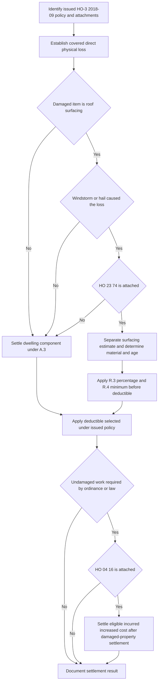

## Scope and controlling documents

This reference is a **contract-analysis sequence** for a Coverage A roof loss under **HO-3 Homeowners 3 — Special Form, edition 2018-09**. That base form is multistate and applies to policies written on or after 2018-09-01. It insures Coverage A property against direct physical loss unless a Section I exclusion applies; it does not make every roof condition a covered loss. In particular, the base form excludes loss caused by deterioration, wear and tear, rot, and several specified conditions affecting roofs. Determine coverage, the issued edition, the Declarations, and attached endorsements before calculating settlement. [HO-3 2018-09, heading and P.1](repo://forms/HO/MS/HO-3/2018-09.md#L1-L3) · [HO-3 2018-09, C.2](repo://forms/HO/MS/HO-3/2018-09.md#L83-L89)

The relevant layers are cumulative only where they are actually part of the issued policy:

| Layer | Role in the decision | Do not assume |
| --- | --- | --- |
| HO-3 2018-09 | Establishes Coverage A, covered-loss gateway, replacement-cost baseline, A.4 roof routing, Section I exclusions, and base deductible rule. | That roof damage is covered merely because it is reported or because settlement language exists. |
| HO 23 74, edition 2018-09 | An optional multistate endorsement that modifies A.4 and supplies an ACV schedule **only for roof surfacing** damaged by windstorm or hail. | That it applies because the roof is old, an estimate depreciates a roof, or underwriting normally requires it. |
| HO 04 16, edition 2018-09 | A separate ordinance-or-law endorsement that can restore specified code-driven costs excluded by the base form. | That it is attached whenever HO 23 74 is attached, or that it pays damaged-property settlement. |
| State amendatory form and Declarations | Can determine the applicable deductible and change the base form where it conflicts. | That the nationwide S.5 default or a prior policy's deductible controls. |

The attachment check is an invariant. HO 23 74 identifies itself as an endorsement that “**Attaches to HO-3 and modifies Section I A.4**”; HO 04 16 separately states that it attaches to HO-3 and modifies Exclusion D.1. The forms do not make either endorsement automatic. [HO 23 74 2018-09](repo://forms/HO/MS/HO-23-74/2018-09.md#L1-L4) · [HO 04 16 2018-09](repo://forms/HO/MS/HO-04-16/2018-09.md#L1-L4)

## Settlement control flow

HO-3 A.3 supplies the ordinary Coverage A settlement baseline: **“Losses to the dwelling are settled at replacement cost, subject to the roof surfacing provisions in A.4 and to the applicable deductible, provided the dwelling is insured to at least eighty percent of its replacement cost at the time of loss.”** Replacement cost is like-kind-and-quality repair or replacement without depreciation at the time of loss. Actual cash value (ACV) is the corresponding cost less depreciation based on age, condition, and remaining useful life immediately before loss. [HO-3 2018-09, Definitions 1–2](repo://forms/HO/MS/HO-3/2018-09.md#L9-L14) · [HO-3 2018-09, A.3](repo://forms/HO/MS/HO-3/2018-09.md#L25-L33)

A.4 is a limited routing rule, not a general roof exclusion: **“Loss to roof surfacing caused by windstorm or hail is settled at replacement cost unless an actual cash value roof schedule endorsement is attached to this policy, in which case that endorsement governs settlement for the roof surfacing only. All other components of the dwelling continue to be settled under A.3.”** Thus an attached schedule changes the settlement basis only after three facts align: the loss is covered, the damaged item is roof surfacing, and windstorm or hail caused that surfacing loss. [HO-3 2018-09, A.4](repo://forms/HO/MS/HO-3/2018-09.md#L31-L34)

This decision flow distinguishes the damaged-property settlement from a later, separately limited ordinance-or-law benefit. It is grounded in HO-3 A.3–A.4 and Exclusion D.1, HO 23 74 R.1–R.6, and HO 04 16 O.1–O.6. [HO-3 2018-09](repo://forms/HO/MS/HO-3/2018-09.md#L31-L34) · [HO-3 2018-09, D.1](repo://forms/HO/MS/HO-3/2018-09.md#L91-L94) · [HO 23 74 2018-09](repo://forms/HO/MS/HO-23-74/2018-09.md#L5-L40) · [HO 04 16 2018-09](repo://forms/HO/MS/HO-04-16/2018-09.md#L5-L37)

### Routing outcomes

| Claim fact pattern after coverage is established | Settlement path |
| --- | --- |
| A dwelling component that is not roof surfacing | HO-3 A.3 replacement cost, subject to the 80-percent condition and applicable deductible. |
| Roof surfacing damaged by a covered peril other than windstorm or hail | HO-3 A.3 replacement cost. HO 23 74 expressly does not apply to this loss. |
| Windstorm or hail damage to roof surfacing, with no attached HO 23 74 | HO-3 A.4 replacement cost under the A.3 baseline. |
| Windstorm or hail damage to roof surfacing, with attached HO 23 74 | HO 23 74 ACV schedule, its minimum-payment rule, then the applicable deductible. |

This table describes **settlement after coverage**, not a coverage grant. For any qualifying non-wind/hail peril, HO 23 74 R.2 says the surfacing loss is replacement cost and “this endorsement does not apply to that loss.” [HO 23 74 2018-09, R.2](repo://forms/HO/MS/HO-23-74/2018-09.md#L11-L16)

## What counts as roof surfacing

Do not price the entire roof as one scheduled item. Under attached HO 23 74 R.1, roof surfacing means **“shingles, tiles, shakes, metal panels, membrane, and the underlayment and flashing directly beneath them.”** It does **not** include the roof deck, trusses, rafters, sheathing, or interior finish. The endorsement also expressly preserves A.3 replacement-cost settlement for every dwelling component other than roof surfacing. [HO 23 74 2018-09, R.1](repo://forms/HO/MS/HO-23-74/2018-09.md#L5-L10)

A defensible estimate consequently has at least two buckets when both are damaged:

1. **Scheduled surfacing:** the R.1 materials, valued under R.2–R.4 only if the windstorm/hail and attachment gates are met.
2. **Other dwelling components:** deck, framing, sheathing, and interior finish, valued under HO-3 A.3 rather than depreciated under the roof schedule.

This separation is a settlement-scope requirement; it does not transform an excluded condition into covered damage. It also allows different settlement bases in one physical roof loss without treating the endorsement as applicable to structural or interior work. [HO-3 2018-09, P.1 and A.3–A.4](repo://forms/HO/MS/HO-3/2018-09.md#L31-L34) · [HO-3 2018-09, P.1](repo://forms/HO/MS/HO-3/2018-09.md#L59-L63)

## HO 23 74 calculation: material, age, floor, then deductible

For an attached **HO 23 74 edition 2018-09**, R.2 controls only windstorm- or hail-caused surfacing loss: **“Loss to roof surfacing caused by windstorm or hail is settled at actual cash value, determined by applying the depreciation schedule in R.3 to the replacement cost of the roof surfacing at the time of loss, less the applicable deductible.”** The schedule percentage is therefore applied to the replacement cost of the eligible surfacing, not to non-surfacing work. [HO 23 74 2018-09, R.2](repo://forms/HO/MS/HO-23-74/2018-09.md#L11-L16)

### R.3 schedule

| Roof-surfacing material | Age at date of loss | Payable percentage of surfacing replacement cost |
| --- | --- | --- |
| Composition shingle | Under 5 years / 5–9 / 10–14 / 15–19 / 20 or more | 100% / 80% / 60% / 40% / 25% |
| Architectural shingle, metal, or tile | Under 10 years / 10–19 / 20–29 / 30 or more | 100% / 80% / 60% / 40% |
| Wood shake | Under 5 years / 5–9 / 10 or more | 100% / 70% / 40% |

The age input is not merely the apparent age or a rating-system value. R.5 uses the documented date of original installation or most recent **full** replacement, whichever is later. Without that documentation, age is presumed to be the dwelling's age. A partial repair does not reset roof age; a full replacement of one slope resets age for that slope only. A multi-slope loss can therefore require separately documented ages and separately priced surfacing. [HO 23 74 2018-09, R.3 and R.5](repo://forms/HO/MS/HO-23-74/2018-09.md#L17-L35)

R.4 sets a pre-deductible payment floor: **“In no event will the payable amount for roof surfacing be less than twenty-five percent of the replacement cost of that surfacing, before application of the deductible.”** Operationally, first calculate the R.3 schedule amount; if it is lower than 25% of eligible surfacing replacement cost, raise it to that floor; only then apply the deductible that governs the loss. The floor does not eliminate or cap the deductible. [HO 23 74 2018-09, R.4](repo://forms/HO/MS/HO-23-74/2018-09.md#L27-L30)

For an eligible surfacing estimate with replacement cost `RC`, schedule rate `r`, and applicable deductible `D`, the ordering can be represented as:

`scheduled pre-deductible amount = max(RC × r, RC × 25%)`

`settlement after deductible = scheduled pre-deductible amount − D`

This is an ordering aid, not a substitute for the Declarations, policy limits, coverage decision, or any governing state amendatory form.

## Deductible selection is a policy-and-state step

The HO-3 2018-09 default says that the Declarations deductible applies to each Section I loss. It then recognizes a separate windstorm-or-hail deductible where a state amendatory endorsement requires one and directs that, where both apply, “**only the larger is deducted.**” Apply this deductible after the HO 23 74 R.4 floor when the schedule applies. [HO-3 2018-09, S.5](repo://forms/HO/MS/HO-3/2018-09.md#L101-L112) · [HO 23 74 2018-09, R.2 and R.4](repo://forms/HO/MS/HO-23-74/2018-09.md#L11-L30)

A state endorsement can displace that default. For example, **only if HO 01 45 edition 2022-01 is attached to the Texas policy**, it governs where it conflicts with the base form. Its T.1 requires that a windstorm/hail loss receive only the separately stated windstorm-and-hail deductible, not the all-other-perils deductible. The deductible is a percentage of Coverage A subject to the endorsement's 1%–5% range, except for its stated seacoast maximum; the form also gives rules for mixed-peril losses. [HO 01 45 2022-01, introductory provision and T.1](repo://forms/HO/TX/HO-01-45/2022-01.md#L1-L11)

The practical entrypoint is the issued Declarations plus all attached state forms, not the roof schedule alone. Confirm the loss peril, state, policy effective date, and endorsement attachment before choosing `D`.

## Code-required undamaged work: a distinct endorsement path

The base form excludes the increased cost of construction, demolition, or repair required by an ordinance or law unless an ordinance-or-law endorsement is attached. Correspondingly, HO 23 74 R.6 says that undamaged roof surfacing that an ordinance or law requires to be replaced in order to repair the damaged portion is subject to Exclusion D.1 and is not payable under the roof-schedule endorsement unless an ordinance-or-law endorsement is attached. The roof schedule neither creates this benefit nor provides its limit. [HO-3 2018-09, D.1](repo://forms/HO/MS/HO-3/2018-09.md#L91-L94) · [HO 23 74 2018-09, R.6](repo://forms/HO/MS/HO-23-74/2018-09.md#L37-L41)

When **HO 04 16 edition 2018-09 is attached**, its O.1 covers incurred increased cost to repair, rebuild, or demolish damaged dwelling property because of an in-force ordinance or law, provided the underlying loss is covered. O.3 specifically covers code-required replacement of undamaged roof surfacing needed to repair the damaged portion. That benefit is subject to all of these separately controlling constraints:

- O.2 limits payment to 10% of the Coverage A limit unless a higher percentage is shown; the amount is additional insurance and does not reduce Coverage A or B.
- O.5 requires completion as soon as reasonably possible and no later than two years after loss unless the insurer agrees in writing to extend the period.
- O.6 applies the endorsement only **after** the damaged-property loss is settled under the applicable Section I settlement provisions and only to increased cost actually incurred.
- O.4 preserves specified exclusions, including pre-loss compliance obligations.

[HO 04 16 2018-09, O.1–O.4](repo://forms/HO/MS/HO-04-16/2018-09.md#L5-L27) · [HO 04 16 2018-09, O.5–O.6](repo://forms/HO/MS/HO-04-16/2018-09.md#L29-L37)

Accordingly, state the combined proposition precisely: **an attached HO 23 74 sends code-required undamaged surfacing outside the roof schedule; an attached HO 04 16 may cover that additional incurred cost, within O.2 and after damaged-property settlement.** Do not make this combined conclusion if either endorsement is absent.

## Florida bulletin: regulatory and underwriting constraints, not settlement wording

Florida OIR Bulletin OIR-2023-04 applies to Florida personal residential property policies issued or renewed with effective dates on or after 2023-07-01. It regulates roof-age underwriting, inspection, offer, nonrenewal, and certain deductible practices. It is not an HO-3 settlement section and does not itself attach HO 23 74 or HO 04 16 to an individual policy. [OIR-2023-04, applicability and purpose](repo://bulletins/FL/2023-04-roof-age-nonrenewal.md#L1-L7)

For policy issuance and renewal, the bulletin provides these controls:

- An insurer may not refuse to issue or renew solely because of roof age when a qualifying inspection within the preceding 12 months establishes at least five years of remaining useful life. A roof-condition decline must state the specific deficiency rather than roof age alone.
- At age 15 or older, the insurer may require an inspection at its expense. It must accept a qualifying inspection by a state-licensed inspector and cannot require a second inspection at the insured's expense in the same policy period.
- The insurer may offer a separate roof deductible or ACV roof schedule only if it also offers a policy without that provision at a filed and approved rate and discloses the premium difference in writing at offer. It **“may not apply an actual cash value roof settlement schedule to a roof less than ten years of age at the effective date of the policy.”**
- A roof-condition nonrenewal requires at least 120 days' written notice, a specific reason, and the relied-on inspection report.

[OIR-2023-04, F.2–F.5](repo://bulletins/FL/2023-04-roof-age-nonrenewal.md#L9-L29)

For a Florida loss where a hurricane deductible and separate roof deductible would both apply, F.6 forbids stacking them: only the larger is deducted. This state rule must be kept separate from HO-3 S.5's general state-endorsement routing and from the HO 23 74 ACV calculation. The bulletin also requires annual county-level reporting of roof-condition nonrenewals; that is an insurer compliance obligation, not a claim-payment component. [OIR-2023-04, F.6–F.7](repo://bulletins/FL/2023-04-roof-age-nonrenewal.md#L31-L37)

## Contract decision versus claim operations

Internal roof-claim guidance is not policy language and is not to be quoted to an insured or claimant. Its role is to make the contract decision reproducible: establish and document peril before pricing, obtain installation/full-replacement evidence, inspect to confirm material, split surfacing from decking and interior work, and retain the calculation inputs. It also directs referral for a disputed age with more than a $10,000 payment effect, a public adjuster or counsel, more than one slope age, or a claimed code upgrade without an ordinance endorsement. These are operating controls, not independent coverage grants, denials, or replacements for the issued forms. [Roof Claim Handling Guidance, status and K.1–K.4](repo://guidelines/claims/roof-claim-handling.md#L1-L33) · [Roof Claim Handling Guidance, K.5–K.7](repo://guidelines/claims/roof-claim-handling.md#L35-L49)

A focused file review should be able to answer, in order:

1. Which base-form edition, Declarations deductible, state form, HO 23 74, and HO 04 16 were in force on the date of loss?
2. What direct physical loss and peril were established, and do any exclusions apply?
3. Which estimate lines are R.1 surfacing and which remain A.3 dwelling components?
4. For scheduled surfacing, what inspection supports material, and what document supports the original-installation or full-replacement date for each slope?
5. Is the R.3 percentage correct, is the R.4 25% pre-deductible floor preserved, and is the deductible selected from the issued policy rather than assumed?
6. If undamaged work is claimed, what in-force ordinance requires it, is HO 04 16 attached, and have O.2, O.5, and O.6 been satisfied?

The insured's general Section I duties remain relevant regardless of settlement path: prompt notice, protection against further damage, and a signed sworn proof of loss within 60 days after request. The base form makes loss payable 60 days after receipt of proof of loss plus written agreement, appraisal award, or court judgment. [HO-3 2018-09, S.1–S.3](repo://forms/HO/MS/HO-3/2018-09.md#L101-L108)
