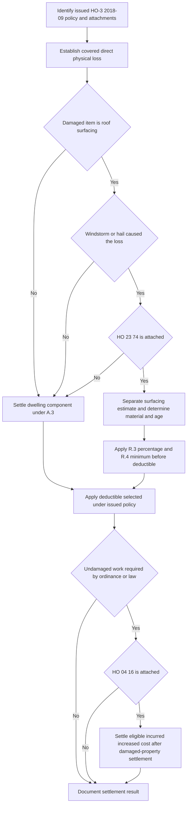

## Scope and controlling documents

This page analyzes **Coverage A — Dwelling** under **HO-3 Homeowners 3 — Special Form, edition 2018-09**. The base form is multistate and applies to policies written on or after 2018-09-01. Coverage A is for direct physical loss to the dwelling, but the form still requires a covered-loss analysis and excludes deterioration, wear and tear, rot, and related roof conditions. Always verify the issued edition, Declarations, and attached endorsements before pricing the loss. [HO-3 2018-09, heading and P.1](repo://forms/HO/MS/HO-3/2018-09.md#L1-L3) · [HO-3 2018-09, A.3 and C.2](repo://forms/HO/MS/HO-3/2018-09.md#L31-L34) [C.2](repo://forms/HO/MS/HO-3/2018-09.md#L83-L89)

The settlement layers are cumulative only when actually attached to the issued policy:

| Layer | Role in the claim | Do not assume |
| --- | --- | --- |
| HO-3 2018-09 | Sets the Coverage A settlement baseline, roof-surfacing routing, exclusions, and deductible rule. | That roof damage is covered merely because a schedule exists. |
| HO 23 74, edition 2018-09 | Modifies A.4 and applies an ACV schedule **only for roof surfacing** damaged by windstorm or hail. | That it applies to the whole dwelling or to non-surfacing work. |
| HO 04 16, edition 2018-09 | Separately modifies D.1 and can pay ordinance-driven increased cost, including undamaged roof surfacing when required by code. | That it is automatic when HO 23 74 is attached. |
| State amendatory form and Declarations | Can change the deductible rule and other state-specific controls. | That the default deductible wording always controls. |

The attachment check matters. HO 23 74 and HO 04 16 are separate endorsements with different targets: one changes roof-surfacing settlement, the other writes back the ordinance-or-law exclusion. Attachment of one does not prove attachment of the other. [HO-3 2018-09, A.4 and D.1](repo://forms/HO/MS/HO-3/2018-09.md#L31-L34) [D.1](repo://forms/HO/MS/HO-3/2018-09.md#L91-L94) · [HO 23 74 2018-09, heading](repo://forms/HO/MS/HO-23-74/2018-09.md#L1-L4) · [HO 04 16 2018-09, heading](repo://forms/HO/MS/HO-04-16/2018-09.md#L1-L4)

Use [Coverage A — Dwelling](dwelling.md) for the broader dwelling-baseline discussion and [Ordinance or Law Coverage and Undamaged Roof Portions](../property/ordinance-or-law.md) for the code-cost path. Internal handling guidance lives in [Roof Loss Claims Handling](../../operations/claims-roof-loss-handling.md) and does not replace the issued form.

## Settlement control flow

HO-3 A.3 gives the ordinary Coverage A baseline: dwelling losses are settled at replacement cost, subject to the roof-surfacing routing in A.4, the applicable deductible, and the 80-percent insurance condition. Replacement cost is like-kind-and-quality repair or replacement without depreciation at the time of loss. Actual cash value is the corresponding replacement cost less depreciation based on age, condition, and remaining useful life immediately before loss. [HO-3 2018-09, Definitions 1–2](repo://forms/HO/MS/HO-3/2018-09.md#L9-L14) · [HO-3 2018-09, A.3](repo://forms/HO/MS/HO-3/2018-09.md#L31-L33)

A.4 is a routing rule, not a general roof exclusion: roof surfacing loss caused by windstorm or hail is settled at replacement cost unless an attached actual-cash-value roof schedule endorsement governs that surfacing only. All other dwelling components stay under A.3. Therefore, the HO 23 74 decision requires three separate findings: the loss is covered, the damaged item is roof surfacing, and windstorm or hail caused that surfacing loss. [HO-3 2018-09, A.3–A.4](repo://forms/HO/MS/HO-3/2018-09.md#L31-L34) · [HO 23 74 2018-09, R.1–R.2](repo://forms/HO/MS/HO-23-74/2018-09.md#L5-L15)

*The flow keeps roof-surfacing settlement separate from ordinance-driven undamaged work.*

## What counts as roof surfacing

Do not price the whole roof as one item. Under HO 23 74 R.1, roof surfacing means shingles, tiles, shakes, metal panels, membrane, and the underlayment and flashing directly beneath them. It does not include the roof deck, trusses, rafters, sheathing, or interior finish. The endorsement preserves the HO-3 A.3 replacement-cost settlement for every dwelling component other than roof surfacing. [HO 23 74 2018-09, R.1](repo://forms/HO/MS/HO-23-74/2018-09.md#L5-L10) · [HO-3 2018-09, A.3–A.4](repo://forms/HO/MS/HO-3/2018-09.md#L31-L34)

A sound estimate usually separates:

1. **Scheduled surfacing:** the R.1 materials, valued under R.2–R.4 if the windstorm/hail and attachment gates are met.
2. **Other dwelling components:** deck, framing, sheathing, and interior finish, valued under HO-3 A.3 rather than depreciated under the roof schedule.

This is a scope rule, not a coverage grant. It allows different settlement bases in the same physical loss without extending the roof schedule to structural or interior work. [HO 23 74 2018-09, R.1–R.2](repo://forms/HO/MS/HO-23-74/2018-09.md#L5-L15) · [HO-3 2018-09, A.3–A.4](repo://forms/HO/MS/HO-3/2018-09.md#L31-L34)

## HO 23 74 calculation: material, age, floor, then deductible

For an attached HO 23 74, windstorm- or hail-caused roof-surfacing loss is settled at actual cash value by applying the R.3 depreciation schedule to the replacement cost of the roof surfacing, then subtracting the applicable deductible. The schedule applies only to eligible surfacing; it does not touch non-surfacing dwelling work. [HO-3 2018-09, A.4](repo://forms/HO/MS/HO-3/2018-09.md#L33-L34) · [HO 23 74 2018-09, R.2–R.4](repo://forms/HO/MS/HO-23-74/2018-09.md#L11-L30)

### R.3 schedule

| Roof-surfacing material | Age at date of loss | Payable percentage of surfacing replacement cost |
| --- | --- | --- |
| Composition shingle | Under 5 years / 5–9 / 10–14 / 15–19 / 20 or more | 100% / 80% / 60% / 40% / 25% |
| Architectural shingle, metal, or tile | Under 10 years / 10–19 / 20–29 / 30 or more | 100% / 80% / 60% / 40% |
| Wood shake | Under 5 years / 5–9 / 10 or more | 100% / 70% / 40% |

The age input is the documented date of original installation or the most recent full replacement, whichever is later. If that date cannot be documented, age is presumed to be the dwelling's age. A partial repair does not reset roof age; a full replacement of one slope resets age for that slope only. Multi-slope losses can therefore require separate ages and separate pricing. [HO 23 74 2018-09, R.3 and R.5](repo://forms/HO/MS/HO-23-74/2018-09.md#L17-L35)

R.4 sets a pre-deductible floor: the payable amount for roof surfacing may not be less than 25% of the replacement cost of that surfacing before the deductible is applied. Operationally, calculate the schedule amount first, raise it to the floor if needed, and only then apply the deductible that governs the loss. The floor does not erase or cap the deductible. [HO 23 74 2018-09, R.2–R.4](repo://forms/HO/MS/HO-23-74/2018-09.md#L11-L30)

For an eligible surfacing estimate with replacement cost `RC`, schedule rate `r`, and applicable deductible `D`, the ordering is:

`scheduled pre-deductible amount = max(RC × r, RC × 25%)`

`settlement after deductible = scheduled pre-deductible amount − D`

This is an ordering aid, not a substitute for the Declarations, limits, coverage decision, or any governing state amendatory form.

## Deductible selection is a policy-and-state step

HO-3 2018-09 says the Declarations deductible applies to each Section I loss, and it also recognizes a separate windstorm-or-hail deductible where a state amendatory endorsement requires one. Where both apply, only the larger is deducted. Apply that deductible after the HO 23 74 R.4 floor when the roof schedule applies. [HO-3 2018-09, S.5](repo://forms/HO/MS/HO-3/2018-09.md#L101-L112) · [HO 23 74 2018-09, R.2 and R.4](repo://forms/HO/MS/HO-23-74/2018-09.md#L11-L30)

A state endorsement can replace the default for the conflict it names. For a Texas HO-3 2018-09 policy, only if HO 01 45 edition 2022-01 is attached and applicable does T.1 amend S.5 and implement Texas Department of Insurance Bulletin B-2021-08. Its rule is more specific than S.5: windstorm- or hail-caused loss receives only the separately stated windstorm-and-hail deductible, not the all-other-perils deductible. T.1 states that deductible as a Coverage A percentage, normally 1%–5% with the stated seacoast maximum, and supplies the mixed-peril allocation rule. The bulletin independently regulates the deductible's permissible configuration, application, disclosure, and filing; it does not supply an unissued contract term. [HO-3 2018-09, S.5](repo://forms/HO/MS/HO-3/2018-09.md#L101-L112) · [HO 01 45 2022-01, introductory provision and T.1](repo://forms/HO/TX/HO-01-45/2022-01.md#L1-L11) · [Texas Bulletin B-2021-08, B.1–B.4 and B.7](repo://bulletins/TX/2021-08-windstorm-deductible.md#L5-L25) [B.7](repo://bulletins/TX/2021-08-windstorm-deductible.md#L35-L37)

The practical entrypoint is the issued Declarations plus all attached state forms, not the roof schedule alone. Confirm the loss peril, state, policy effective date, and endorsement attachment before choosing `D`.

## Code-required undamaged work: a distinct endorsement path

The base form excludes the increased cost of construction, demolition, or repair required by an ordinance or law unless an ordinance-or-law endorsement is attached. HO 23 74 R.6 preserves that HO-3 D.1 exclusion as a separate boundary: code-required replacement of undamaged roof surfacing is subject to D.1 and is not a roof-schedule benefit. Do not use R.6 as an ordinance-or-law write-back, and do not use the schedule to set the limit for this work. [HO-3 2018-09, D.1](repo://forms/HO/MS/HO-3/2018-09.md#L91-L94) · [HO 23 74 2018-09, R.6](repo://forms/HO/MS/HO-23-74/2018-09.md#L37-L41)

When HO 04 16 edition 2018-09 is attached, O.1 writes back HO-3 D.1 for eligible increased cost: it covers incurred increased cost to repair, rebuild, or demolish damaged dwelling property because of an in-force ordinance or law, provided the underlying loss is covered. O.3 specifically covers code-required replacement of undamaged roof surfacing needed to repair the damaged portion. This is the independent payment path for the R.6 work, not a revision of the roof schedule. That benefit is subject to the separate constraints in O.2, O.5, and O.6 and to the exclusions in O.4. [HO-3 2018-09, D.1](repo://forms/HO/MS/HO-3/2018-09.md#L91-L94) · [HO 04 16 2018-09, O.1–O.3 and O.6](repo://forms/HO/MS/HO-04-16/2018-09.md#L5-L19) [O.6](repo://forms/HO/MS/HO-04-16/2018-09.md#L33-L37) · [HO 04 16 2018-09, O.2 and O.4–O.5](repo://forms/HO/MS/HO-04-16/2018-09.md#L11-L31)

Accordingly, state the relationship precisely: R.6 leaves code-required undamaged surfacing in the HO-3 D.1 exclusion; an independently attached HO 04 16 may then cover the additional incurred cost under O.1/O.3, within O.2 and after damaged-property settlement. [HO-3 2018-09, D.1](repo://forms/HO/MS/HO-3/2018-09.md#L91-L94) · [HO 23 74 2018-09, R.6](repo://forms/HO/MS/HO-23-74/2018-09.md#L37-L41) · [HO 04 16 2018-09, O.1–O.3 and O.6](repo://forms/HO/MS/HO-04-16/2018-09.md#L5-L19) [O.6](repo://forms/HO/MS/HO-04-16/2018-09.md#L33-L37)

## Florida bulletin: regulatory and underwriting constraints, not settlement wording

Florida OIR Bulletin OIR-2023-04 applies to Florida personal residential property policies issued or renewed with effective dates on or after 2023-07-01. F.4 regulates the offer and permitted application of a separate roof deductible or ACV roof schedule; F.6 limits deductible overlap on a loss. Neither provision changes the A.4/R.1–R.4 settlement terms of an issued policy or itself attaches HO 23 74 or HO 04 16. Treat this as a state control alongside the issued forms and Declarations. [OIR-2023-04, applicability, F.4, and F.6](repo://bulletins/FL/2023-04-roof-age-nonrenewal.md#L1-L3) [F.4](repo://bulletins/FL/2023-04-roof-age-nonrenewal.md#L21-L25) [F.6](repo://bulletins/FL/2023-04-roof-age-nonrenewal.md#L31-L33) · [HO-3 2018-09, A.4](repo://forms/HO/MS/HO-3/2018-09.md#L31-L34) · [HO 23 74 2018-09, R.1–R.4](repo://forms/HO/MS/HO-23-74/2018-09.md#L5-L30)

For policy issuance and renewal, the bulletin provides these controls:

- An insurer may not refuse to issue or renew solely because of roof age when a qualifying inspection within the preceding 12 months establishes at least five years of remaining useful life. A roof-condition decline must state the specific deficiency rather than roof age alone.
- At age 15 or older, the insurer may require an inspection at its expense. It must accept a qualifying inspection by a state-licensed inspector and cannot require a second inspection at the insured's expense in the same policy period.
- The insurer may offer a separate roof deductible or ACV roof schedule only if it also offers a policy without that provision at a filed and approved rate and discloses the premium difference in writing at offer. It may not apply an actual cash value roof settlement schedule to a roof less than ten years of age at the effective date of the policy.
- A roof-condition nonrenewal requires at least 120 days' written notice, a specific reason, and the relied-on inspection report.

[OIR-2023-04, F.2–F.5](repo://bulletins/FL/2023-04-roof-age-nonrenewal.md#L9-L29)

For a Florida loss where a hurricane deductible and separate roof deductible would both apply, F.6 forbids stacking them: only the larger is deducted. This state rule must be kept separate from HO-3 S.5's general state-endorsement routing and from the HO 23 74 ACV calculation. The bulletin also requires annual county-level reporting of roof-condition nonrenewals; that is an insurer compliance obligation, not a claim-payment component. [OIR-2023-04, F.6–F.7](repo://bulletins/FL/2023-04-roof-age-nonrenewal.md#L31-L37)

## Contract decision versus claim operations

Internal roof-claim guidance is not policy language and is not to be quoted to an insured or claimant. Its role is to make the contract decision reproducible: establish and document peril before pricing, obtain installation/full-replacement evidence, inspect to confirm material, split surfacing from decking and interior work, and retain the calculation inputs. It also directs referral for a disputed age with more than a $10,000 payment effect, a public adjuster or counsel, more than one slope age, or a claimed code upgrade without an ordinance endorsement. These are operating controls, not independent coverage grants, denials, or replacements for the issued forms. [Roof Claim Handling Guidance, status and K.1–K.4](repo://guidelines/claims/roof-claim-handling.md#L1-L33) · [Roof Claim Handling Guidance, K.5–K.7](repo://guidelines/claims/roof-claim-handling.md#L35-L49)

A focused file review should be able to answer, in order:

1. Which base-form edition, Declarations deductible, state form, HO 23 74, and HO 04 16 were in force on the date of loss?
2. What direct physical loss and peril were established, and do any exclusions apply?
3. Which estimate lines are R.1 surfacing and which remain A.3 dwelling components?
4. For scheduled surfacing, what inspection supports material, and what document supports the original-installation or full-replacement date for each slope?
5. Is the R.3 percentage correct, is the R.4 25% pre-deductible floor preserved, and is the deductible selected from the issued policy rather than assumed?
6. If undamaged work is claimed, what in-force ordinance requires it, is HO 04 16 attached, and have O.2, O.5, and O.6 been satisfied?

The insured's general Section I duties remain relevant regardless of settlement path: prompt notice, protection against further damage, and a signed sworn proof of loss within 60 days after request. The base form makes loss payable 60 days after receipt of proof of loss plus written agreement, appraisal award, or court judgment. [HO-3 2018-09, S.1–S.3](repo://forms/HO/MS/HO-3/2018-09.md#L101-L108)
