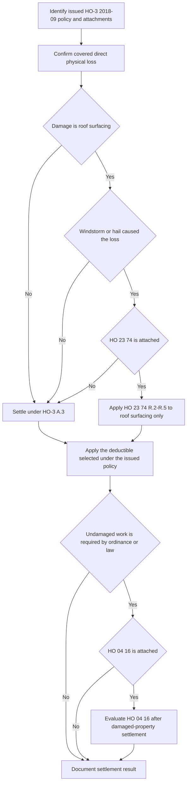

# Coverage A — Roof Surfacing Settlement

## Scope and controlling documents

This page documents the **roof-surfacing settlement route** under **HO-3 Homeowners 3 — Special Form, edition 2018-09**. The base form insures Coverage A dwelling for direct physical loss, but it does not make every roof condition a covered loss. The roof-surfacing schedule only matters when the issued policy includes the attached **HO 23 74 Actual Cash Value Loss Settlement — Roof Surfacing** endorsement, and only for the loss type that endorsement addresses. [HO-3 2018-09, A.3–A.4, P.1, and C.2](repo://forms/HO/MS/HO-3/2018-09.md#L25-L34) [repo://forms/HO/MS/HO-3/2018-09.md#L59-L63) [repo://forms/HO/MS/HO-3/2018-09.md#L83-L89) · [HO 23 74 2018-09, heading and R.1–R.2](repo://forms/HO/MS/HO-23-74/2018-09.md#L1-L15)

The relevant documents play different roles:

| Document | Role |
| --- | --- |
| HO-3 2018-09 | Supplies the Coverage A baseline, the roof-surfacing routing rule in A.4, the Section I exclusions, and the deductible rule in S.5. |
| HO 23 74 2018-09 | Replaces the A.4 roof-surfacing settlement route only for windstorm or hail damage to roof surfacing, using an ACV schedule with a minimum payment floor. |
| HO 04 16 2018-09 | Separately addresses ordinance-or-law costs and can write back D.1 for eligible increased cost; it is not part of the roof schedule. |
| State overlay / Declarations | May affect deductible selection and state offer or use rules, but does not by itself attach either endorsement. |

The attachment check is an invariant. HO 23 74 modifies A.4; HO 04 16 modifies D.1. Attachment of one does not imply attachment of the other. [HO-3 2018-09, A.4 and D.1](repo://forms/HO/MS/HO-3/2018-09.md#L31-L34) [repo://forms/HO/MS/HO-3/2018-09.md#L91-L94) · [HO 23 74 2018-09, heading](repo://forms/HO/MS/HO-23-74/2018-09.md#L1-L4) · [HO 04 16 2018-09, heading](repo://forms/HO/MS/HO-04-16/2018-09.md#L1-L4)

## Settlement control flow

HO-3 A.3 provides the ordinary Coverage A settlement baseline: dwelling losses are settled at replacement cost, subject to the roof-surfacing rule in A.4 and the applicable deductible, provided the dwelling is insured to at least eighty percent of replacement cost at the time of loss. Replacement cost is the cost to repair or replace with like kind and quality without depreciation; actual cash value is that cost less depreciation based on age, condition, and remaining useful life immediately before loss. [HO-3 2018-09, Definitions 1–2 and A.3](repo://forms/HO/MS/HO-3/2018-09.md#L9-L14) [repo://forms/HO/MS/HO-3/2018-09.md#L31-L33)

A.4 is a limited routing rule, not a general roof exclusion: loss to roof surfacing caused by windstorm or hail is settled at replacement cost unless an HO 23 74 ACV roof schedule endorsement is attached, in which case that endorsement governs settlement for roof surfacing only. All other dwelling components remain under A.3. [HO-3 2018-09, A.4](repo://forms/HO/MS/HO-3/2018-09.md#L33-L34) · [HO 23 74 2018-09, R.1–R.2](repo://forms/HO/MS/HO-23-74/2018-09.md#L5-L15)

*The flow separates the roof schedule from ordinary dwelling settlement and from the separate ordinance-or-law path.*

## What counts as roof surfacing

Do not price the entire roof as one scheduled item. Under HO 23 74 R.1, roof surfacing means shingles, tiles, shakes, metal panels, membrane, and the underlayment and flashing directly beneath them. It does not include the roof deck, trusses, rafters, sheathing, or interior finish. The endorsement preserves HO-3 A.3 replacement-cost settlement for every dwelling component other than roof surfacing. [HO 23 74 2018-09, R.1](repo://forms/HO/MS/HO-23-74/2018-09.md#L5-L10) · [HO-3 2018-09, A.3](repo://forms/HO/MS/HO-3/2018-09.md#L31-L33)

A defensible estimate usually has separate buckets when both are damaged:

1. **Scheduled surfacing:** the R.1 materials, valued under R.2-R.4 only if the windstorm-or-hail and attachment gates are met.
2. **Other dwelling components:** deck, framing, sheathing, and interior finish, valued under HO-3 A.3 rather than under the roof schedule.

This separation keeps the schedule within its intended scope; it does not turn an excluded condition into covered damage and it does not apply the roof schedule to structural or interior work. [HO-23-74 2018-09, R.1–R.2](repo://forms/HO/MS/HO-23-74/2018-09.md#L5-L15) · [HO-3 2018-09, P.1 and A.3–A.4](repo://forms/HO/MS/HO-3/2018-09.md#L25-L34) [repo://forms/HO/MS/HO-3/2018-09.md#L59-L63)

## HO 23 74 calculation: material, age, floor, then deductible

For an attached HO 23 74 edition 2018-09, windstorm- or hail-caused roof-surfacing loss is settled at actual cash value. R.2 says to apply the R.3 depreciation schedule to the roof-surfacing replacement cost at the time of loss, less the applicable deductible. The schedule percentage therefore applies only to the eligible surfacing, not to non-surfacing work. [HO 23 74 2018-09, R.2–R.3](repo://forms/HO/MS/HO-23-74/2018-09.md#L11-L25)

### R.3 schedule

| Roof-surfacing material | Age at date of loss | Payable percentage of surfacing replacement cost |
| --- | --- | --- |
| Composition shingle | Under 5 years / 5–9 / 10–14 / 15–19 / 20 or more | 100% / 80% / 60% / 40% / 25% |
| Architectural shingle, metal, or tile | Under 10 years / 10–19 / 20–29 / 30 or more | 100% / 80% / 60% / 40% |
| Wood shake | Under 5 years / 5–9 / 10 or more | 100% / 70% / 40% |

The age input comes from the documented date of original installation or most recent full replacement, whichever is later. If that date cannot be documented, the age is presumed to be the dwelling's age. A partial repair does not reset age, while a full replacement of one slope resets age for that slope only. [HO 23 74 2018-09, R.3 and R.5](repo://forms/HO/MS/HO-23-74/2018-09.md#L17-L35)

R.4 sets a pre-deductible payment floor: the payable amount for roof surfacing may not be less than 25% of the replacement cost of that surfacing, before deductible. In practice, first calculate the R.3 schedule amount; if it is lower than the floor, raise it to the floor; then apply the deductible that governs the loss. The floor does not eliminate or cap the deductible. [HO 23 74 2018-09, R.2–R.4](repo://forms/HO/MS/HO-23-74/2018-09.md#L11-L30) · [HO-3 2018-09, S.5](repo://forms/HO/MS/HO-3/2018-09.md#L101-L112)

For an eligible surfacing estimate with replacement cost `RC`, schedule rate `r`, and applicable deductible `D`, the ordering can be represented as:

`scheduled pre-deductible amount = max(RC × r, RC × 25%)`

`settlement after deductible = scheduled pre-deductible amount − D`

This is an ordering aid, not a substitute for the Declarations, policy limits, coverage decision, or any governing state amendatory form.

## Deductible selection is a policy-and-state step

The HO-3 2018-09 default says that the Declarations deductible applies to each Section I loss. It also recognizes a separate windstorm-or-hail deductible where a state amendatory endorsement requires one and directs that, where both apply, only the larger is deducted. Apply that deductible after the HO 23 74 R.4 floor when the schedule applies. [HO-3 2018-09, S.5](repo://forms/HO/MS/HO-3/2018-09.md#L101-L112) · [HO 23 74 2018-09, R.2 and R.4](repo://forms/HO/MS/HO-23-74/2018-09.md#L11-L30)

A state endorsement can replace that default for the conflict it names. For a Texas HO-3 2018-09 policy, only if HO 01 45 edition 2022-01 is attached and applicable, T.1 amends S.5 and implements Texas Bulletin B-2021-08. Its rule is more specific than S.5: windstorm- or hail-caused loss receives only the separately stated windstorm-and-hail deductible, not the all-other-perils deductible. The bulletin independently regulates the same deductible's permissible configuration, application, disclosure, and filing; it does not supply an unissued contract term. [HO-3 2018-09, S.5](repo://forms/HO/MS/HO-3/2018-09.md#L101-L112) · [HO 01 45 2022-01, introductory provision and T.1](repo://forms/HO/TX/HO-01-45/2022-01.md#L1-L11) · [Texas Bulletin B-2021-08, B.1–B.4 and B.7](repo://bulletins/TX/2021-08-windstorm-deductible.md#L5-L25) [B.7](repo://bulletins/TX/2021-08-windstorm-deductible.md#L35-L37)

For a Florida policy issued or renewed on or after 2023-07-01, the bulletin does not write the roof schedule into the policy, but it constrains offer and use. An ACV roof schedule may not be applied to a roof less than ten years old at policy effective date, and a separate roof deductible or ACV schedule may be offered only alongside a policy without that provision at a filed and approved rate with written premium-difference disclosure. For one loss, a hurricane deductible and a separate roof deductible may not both be applied. [Florida OIR-2023-04, applicability and F.4](repo://bulletins/FL/2023-04-roof-age-nonrenewal.md#L1-L3) [F.4](repo://bulletins/FL/2023-04-roof-age-nonrenewal.md#L21-L25) · [F.6](repo://bulletins/FL/2023-04-roof-age-nonrenewal.md#L31-L33)

## Code-required undamaged work: a distinct endorsement path

The base form excludes increased cost of construction, demolition, or repair required by an ordinance or law unless an ordinance-or-law endorsement is attached. HO 23 74 R.6 preserves that exclusion boundary as a separate proposition: code-required replacement of undamaged roof surfacing remains subject to D.1 and is not a roof-schedule benefit. Do not use R.6 as an ordinance-or-law write-back, and do not use the schedule to set the limit for this work. [HO-3 2018-09, D.1](repo://forms/HO/MS/HO-3/2018-09.md#L91-L94) · [HO 23 74 2018-09, R.6](repo://forms/HO/MS/HO-23-74/2018-09.md#L37-L41)

Separately, when HO 04 16 edition 2018-09 is attached, O.1 writes back D.1 for eligible incurred increased cost to repair, rebuild, or demolish damaged dwelling property because of an in-force ordinance or law, and O.3 specifically covers code-required replacement of undamaged roof surfacing needed to repair the damaged portion. That is the independent potential payment path for the R.6 work. The benefit is subject to its own limit, timing, exclusions, and post-settlement requirements, and it applies only after the damaged-property settlement. [HO 04 16 2018-09, O.1–O.4 and O.6](repo://forms/HO/MS/HO-04-16/2018-09.md#L5-L37)

Accordingly, state the relationship precisely: R.6 leaves code-required undamaged surfacing in the HO-3 D.1 exclusion; an independently attached HO 04 16 may then cover the additional incurred cost under O.1/O.3, within O.2 and after damaged-property settlement. R.6 is not itself the write-back. [HO-3 2018-09, D.1](repo://forms/HO/MS/HO-3/2018-09.md#L91-L94) · [HO 23 74 2018-09, R.6](repo://forms/HO/MS/HO-23-74/2018-09.md#L37-L41) · [HO 04 16 2018-09, O.1–O.3 and O.6](repo://forms/HO/MS/HO-04-16/2018-09.md#L5-L19) [repo://forms/HO/MS/HO-04-16/2018-09.md#L33-L37)

## Florida bulletin: regulatory and underwriting constraints, not settlement wording

Florida OIR Bulletin OIR-2023-04 applies to Florida personal residential property policies issued or renewed with effective dates on or after 2023-07-01. F.4 regulates the offer and permitted application of a separate roof deductible or ACV roof schedule; F.6 limits deductible overlap on a loss. Neither provision changes the A.4 or R.1-R.4 settlement terms of an issued policy or itself attaches HO 23 74 or HO 04 16. Treat this as a state control alongside, not a substitute for, the issued forms and Declarations. [Florida OIR-2023-04, applicability, F.4, and F.6](repo://bulletins/FL/2023-04-roof-age-nonrenewal.md#L1-L3) [F.4](repo://bulletins/FL/2023-04-roof-age-nonrenewal.md#L21-L25) [F.6](repo://bulletins/FL/2023-04-roof-age-nonrenewal.md#L31-L33)
