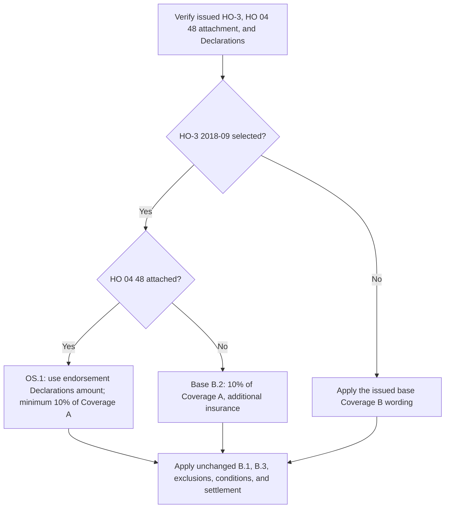

## Start with the issued policy

Select the issued HO-3 edition before analyzing the structure or an endorsement. HO-3 2018-09 supersedes 2011-05 for policies written on or after 2018-09-01; 2011-05 remains controlling for a policy written under it, regardless of when its loss is reported. A later form is not a retrofit for an earlier policy. [HO-3 2011-05 status](repo://forms/HO/MS/HO-3/2011-05.md#L1-L7) · [HO-3 2018-09 status](repo://forms/HO/MS/HO-3/2018-09.md#L1-L4)

The contractual record is the selected base form, its Declarations, and endorsements actually attached to that policy. Repository availability of an endorsement does not establish its issuance or its Declarations-selected limit. This distinction matters particularly for HO 04 48: its header describes a multistate endorsement that attaches to HO-3 2018-09, and says it is net-new with no earlier edition. [HO 04 48 2026-06, scope and status](repo://forms/HO/MS/HO-04-48/2026-06.md#L1-L5)

## Coverage B property and base limit

Under HO-3 2018-09 B.1, Coverage B includes other structures on the residence premises that are separated from the dwelling by clear space, or connected to it **only** by a fence, utility line, or similar connection. “Residence premises” is the one-family dwelling, other structures, and grounds at the Declarations location where the insured resides. The connection language distinguishes those limited connections from structures attached to the dwelling, which Coverage A includes. [HO-3 2018-09, Definition 4](repo://forms/HO/MS/HO-3/2018-09.md#L15-L19) · [HO-3 2018-09, Coverage A](repo://forms/HO/MS/HO-3/2018-09.md#L25-L29) · [HO-3 2018-09, Coverage B.1](repo://forms/HO/MS/HO-3/2018-09.md#L35-L39)

HO-3 2011-05 B.1 has only the clear-space formulation; do not add the 2018-09 connection language to an older policy. Both editions' unendorsed B.2 set Coverage B at 10% of Coverage A and make that amount additional insurance. [HO-3 2011-05, Coverage B](repo://forms/HO/MS/HO-3/2011-05.md#L35-L40) · [HO-3 2018-09, Coverage B](repo://forms/HO/MS/HO-3/2018-09.md#L35-L41)

For HO-3 2018-09, B.3 excludes an other structure rented or held for rental to a person who is not a dwelling tenant unless it is used solely as a private garage. Establish the rental status, the renter's dwelling-tenancy status, and, where needed, sole private-garage use. The supplied 2011-05 Coverage B text does not contain B.3. [HO-3 2018-09, Coverage B.3](repo://forms/HO/MS/HO-3/2018-09.md#L39-L42) · [HO-3 2011-05, Coverage B](repo://forms/HO/MS/HO-3/2011-05.md#L35-L40)

## HO 04 48: Declarations-selected increased limit

**HO 04 48 OS.1 modifies HO-3 2018-09 Coverage B.2 only.** When this 2026-06 endorsement is attached to an issued HO-3 2018-09 policy, OS.1 replaces B.2's 10-percent limit with the amount shown for the endorsement in the Declarations. That selected amount may not be less than 10% of the Coverage A limit and is additional insurance. Read the endorsement Declarations to determine the payable Coverage B limit; neither the base form nor the repository copy supplies a higher dollar amount. [HO 04 48 2026-06, attachment, target, and OS.1](repo://forms/HO/MS/HO-04-48/2026-06.md#L3-L11) · [HO-3 2018-09, Coverage B.2](repo://forms/HO/MS/HO-3/2018-09.md#L35-L41)

HO 04 48's stated scope is limited and attachment-dependent:

- It is compatible as written with **HO-3 2018-09**, not HO-3 2011-05. Because it is net-new and specifically targets 2018-09 B.2, do not infer compatibility or retrofit its limit to an older policy. [HO 04 48 2026-06, scope and status](repo://forms/HO/MS/HO-04-48/2026-06.md#L1-L5) · [HO-3 2011-05, Coverage B.2](repo://forms/HO/MS/HO-3/2011-05.md#L35-L40)
- OS.2 preserves B.1 and B.3, every other Section I property coverage, every Section I exclusion and condition, and the rental boundary. Increasing the limit does not expand the property class, turn a rented structure into covered property, write back an exclusion, or waive a condition. [HO 04 48 2026-06, OS.2](repo://forms/HO/MS/HO-04-48/2026-06.md#L13-L17)
- OS.3 places the additional premium in the Declarations, and the endorsement keeps all other policy provisions in force. The premium entry is not the endorsement limit; retain the attached endorsement and the relevant Declarations entries for both. [HO 04 48 2026-06, OS.3 and all-other-provisions clause](repo://forms/HO/MS/HO-04-48/2026-06.md#L19-L23)

*The endorsement is a limit-selection branch after policy assembly, not a coverage grant. OS.1 replaces only B.2, while OS.2 preserves the remaining gates.* [HO 04 48 2026-06, OS.1–OS.2](repo://forms/HO/MS/HO-04-48/2026-06.md#L7-L17) · [HO-3 2018-09, Coverage B](repo://forms/HO/MS/HO-3/2018-09.md#L35-L42)

## Loss, exclusion, condition, and settlement boundaries

For the 2018-09 form, a qualifying Coverage B structure is insured for direct physical loss only except as excluded by Section I. The increased limit therefore follows—not replaces—the property and cause-of-loss analysis. [HO-3 2018-09, P.1](repo://forms/HO/MS/HO-3/2018-09.md#L59-L63) · [HO 04 48 2026-06, OS.2](repo://forms/HO/MS/HO-04-48/2026-06.md#L13-L17)

In particular, Section I excludes the specified flood/surface-water and subsurface-water categories; sewer/drain backup and sump-related overflow/discharge absent attached HO 04 90; earth movement; neglect and listed deterioration conditions; continuous or repeated leakage over weeks, months, or years (subject to its defined sudden-and-accidental exception); ordinance-or-law cost absent an attached endorsement; and intentional loss. Water exclusions A.1–A.3 apply regardless of another contributing cause or event concurrently or in sequence. [HO-3 2018-09, water exclusions](repo://forms/HO/MS/HO-3/2018-09.md#L69-L77) · [HO-3 2018-09, earth movement and neglect/deterioration](repo://forms/HO/MS/HO-3/2018-09.md#L79-L89) · [HO-3 2018-09, ordinance and intentional loss](repo://forms/HO/MS/HO-3/2018-09.md#L91-L97)

Separate endorsements can supply only their stated, verified routes; HO 04 48 supplies none. For example, attached HO 04 90 W.1 provides the stated sewer/drain or sump-event path, but W.4 retains flood/surface-water and subsurface-water exclusions; its selected edition also controls its own limit, deductible, conditions, and settlement provisions. Attached HO 04 16 O.1 covers eligible ordinance-driven cost only when the underlying Section I loss is covered, and O.6 requires damaged-property settlement and actually incurred cost. [HO 04 90 2026-01, W.1 and W.4](repo://forms/HO/MS/HO-04-90/2026-01.md#L6-L11) · [HO 04 90 2026-01, W.4](repo://forms/HO/MS/HO-04-90/2026-01.md#L25-L33) · [HO 04 16 2018-09, O.1](repo://forms/HO/MS/HO-04-16/2018-09.md#L5-L9) · [HO 04 16 2018-09, O.6](repo://forms/HO/MS/HO-04-16/2018-09.md#L33-L37)

HO 04 48 does not change conditions or settlement. Under HO-3 2018-09, the insured must provide prompt notice, protect property from further damage, and provide a signed sworn proof of loss within 60 days after the insurer requests it. The Declarations deductible applies to each Section I loss, subject to the stated windstorm-or-hail rule. The form's payment provision calls for payment 60 days after receipt of proof of loss and written agreement, appraisal award, or court judgment. [HO-3 2018-09, conditions S.1–S.3](repo://forms/HO/MS/HO-3/2018-09.md#L101-L108) · [HO-3 2018-09, deductible S.5](repo://forms/HO/MS/HO-3/2018-09.md#L109-L112) · [HO 04 48 2026-06, OS.2](repo://forms/HO/MS/HO-04-48/2026-06.md#L13-L17)

## File-review controls

Before communicating a Coverage B amount or coverage position, preserve and test:

1. **Policy assembly:** policy-written date, issued HO-3 edition, full Declarations, and attached-form schedule. If HO 04 48 is asserted, obtain its attached 2026-06 form and the endorsement limit shown in the Declarations; repository availability, an offered limit, or an additional-premium entry alone is not enough. [HO 04 48 2026-06, scope, OS.1, and OS.3](repo://forms/HO/MS/HO-04-48/2026-06.md#L3-L11) · [HO 04 48 2026-06, OS.3](repo://forms/HO/MS/HO-04-48/2026-06.md#L19-L23)
2. **Property gate:** location/residence-premises facts, separation or limited connection, and—on 2018-09—rental, dwelling-tenant, and private-garage facts. [HO-3 2018-09, Definition 4 and Coverage B](repo://forms/HO/MS/HO-3/2018-09.md#L15-L19) · [HO-3 2018-09, Coverage B](repo://forms/HO/MS/HO-3/2018-09.md#L35-L42)
3. **Loss gate:** direct physical loss, asserted cause, source, onset/duration, and every applicable exclusion or attached narrow write-back. An increased B.2 amount does not resolve any of those facts. [HO-3 2018-09, P.1 and exclusions](repo://forms/HO/MS/HO-3/2018-09.md#L59-L97) · [HO 04 48 2026-06, OS.2](repo://forms/HO/MS/HO-04-48/2026-06.md#L13-L17)
4. **Amount and completion:** apply the verified B.2 limit—base 10% or attached HO 04 48's Declarations amount—then the preserved deductible, conditions, settlement provision, and any separately attached endorsement terms. [HO 04 48 2026-06, OS.1–OS.2](repo://forms/HO/MS/HO-04-48/2026-06.md#L7-L17) · [HO-3 2018-09, conditions and deductible](repo://forms/HO/MS/HO-3/2018-09.md#L101-L112)

For broader form selection, see [Governing Form Editions and Policy Assembly](/openwiki/coverage/policy-editions-and-governing-forms.md). Route source-specific water questions to [Water Damage Exclusions and Water Backup Write-Back](/openwiki/coverage/property/water-damage-and-backup.md), general loss gates to [Section I Property Perils and General Exclusions](/openwiki/coverage/property/perils-and-general-exclusions.md), and duties, payment, and deductibles to [Section I Claim Conditions, Payment, and Deductibles](/openwiki/coverage/property/claim-conditions-and-deductibles.md).
