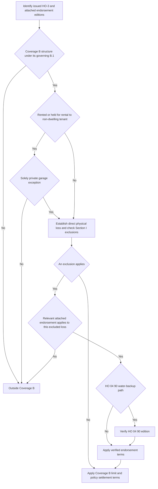

## Start with the issued HO-3 edition

Coverage B must be read from the HO-3 edition issued with the policy. **HO-3 2011-05** remains controlling for policies written under that edition, regardless of when their losses are reported. **HO-3 2018-09** is the multistate form effective for policies written on or after 2018-09-01 and supersedes 2011-05 for new business from that date. The 2018-09 form changes the Coverage B scope and adds the rental limitation described below; do not apply those additions to a 2011-05 policy merely because the loss occurs later. [HO-3 2011-05, form status](repo://forms/HO/MS/HO-3/2011-05.md#L1-L7) · [HO-3 2018-09, form status](repo://forms/HO/MS/HO-3/2018-09.md#L1-L4)

## Property scope and limit

Under **HO-3 2018-09 Section I B.1**, Coverage B covers other structures on the residence premises that are separated from the dwelling by clear space. It also covers a structure connected to the dwelling *only* by a fence, utility line, or similar connection. The defined residence premises is the one-family dwelling, other structures, and grounds at the location in the Declarations where the insured resides. The connection language is important: it prevents a fence or utility connection alone from placing the structure in Coverage A as an attached dwelling structure. [HO-3 2018-09, Definition 4](repo://forms/HO/MS/HO-3/2018-09.md#L15-L19) · [HO-3 2018-09 § B.1](repo://forms/HO/MS/HO-3/2018-09.md#L35-L41) · [HO-3 2018-09 § A.1](repo://forms/HO/MS/HO-3/2018-09.md#L25-L29)

For a **HO-3 2011-05** policy, B.1 instead says only that covered other structures are on the residence premises and “set apart from the dwelling by clear space.” It does not include the 2018-09 fence, utility-line, or similar-connection wording. [HO-3 2011-05 § B.1](repo://forms/HO/MS/HO-3/2011-05.md#L35-L40)

In **both HO-3 2011-05 B.2 and HO-3 2018-09 B.2**, the Coverage B limit is 10% of the Coverage A limit, and it is **additional insurance**. It therefore does not consume the Coverage A limit. Determine the dollar amount from the applicable Coverage A limit rather than treating 10% as a fixed dollar amount. [HO-3 2011-05 § B.2](repo://forms/HO/MS/HO-3/2011-05.md#L35-L40) · [HO-3 2018-09 § B.2](repo://forms/HO/MS/HO-3/2018-09.md#L35-L41)

## The HO-3 2018-09 rental boundary

**HO-3 2018-09 Section I B.3** excludes an other structure “rented or held for rental to any person who is not a tenant of the dwelling,” unless the structure is used **solely as a private garage**. This is a property-scope restriction, not an exclusion that can be bypassed just because the reported cause of loss would otherwise be covered. Establish both the rental or held-for-rental status and whether the renter is a dwelling tenant; if the person is not a dwelling tenant, establish whether the sole-use private-garage exception applies. [HO-3 2018-09 § B.3](repo://forms/HO/MS/HO-3/2018-09.md#L35-L42)

This B.3 limitation is not present in the supplied **HO-3 2011-05** Coverage B text. A 2011-05 policy instead has the clear-space scope and the same additional 10% limit in B.1–B.2. [HO-3 2011-05 § B.1–B.2](repo://forms/HO/MS/HO-3/2011-05.md#L35-L40)

## Covered-loss gateway and shared Section I exclusions

For **HO-3 2018-09**, Coverage B does not insure a structure against every loss. Section I P.1 insures Coverage A and B property against **direct physical loss** except as excluded in Section I — Exclusions. Apply the Coverage B scope and B.3 first, then establish direct physical loss and evaluate the Section I exclusions; the 10% limit does not itself create coverage. [HO-3 2018-09 § B.1–B.3](repo://forms/HO/MS/HO-3/2018-09.md#L35-L42) · [HO-3 2018-09 § P.1](repo://forms/HO/MS/HO-3/2018-09.md#L59-L63)

The relevant **HO-3 2018-09 Section I** exclusions apply to a qualifying Coverage B structure as they do to Coverage A property. In particular:

- Water losses caused directly or indirectly by flood, surface water, waves, tidal water, storm surge, or overflow of a body of water are excluded, whether or not wind-driven. Water below the ground surface that pressures, seeps, or leaks through a building, foundation, swimming pool, or other structure is also excluded. [HO-3 2018-09 §§ A.1–A.2](repo://forms/HO/MS/HO-3/2018-09.md#L67-L75)
- Sewer-or-drain backup and sump-related backup, overflow, or discharge are excluded, including when mechanical breakdown caused the backup or overflow. The water exclusions A.1–A.3 have anti-concurrent-causation language: they apply regardless of another cause or event contributing concurrently or in any sequence. [HO-3 2018-09 §§ A.3–A.4](repo://forms/HO/MS/HO-3/2018-09.md#L69-L77)
- Earth movement; neglect after a loss; deterioration, wear and tear, rust, mold, wet or dry rot, and the listed gradual-condition losses are excluded. Continuous or repeated water or steam seepage or leakage over weeks, months, or years is excluded, while loss that is “sudden and accidental” as defined is not excluded by that particular seepage provision. [HO-3 2018-09 §§ B.1–C.3 and Definition 5](repo://forms/HO/MS/HO-3/2018-09.md#L15-L19) · [HO-3 2018-09 §§ B.1–C.3](repo://forms/HO/MS/HO-3/2018-09.md#L79-L89)
- Increased construction, demolition, or repair cost required by ordinance or law is excluded unless an ordinance-or-law endorsement is attached; intentional loss by an insured is also excluded for all insureds, whether or not a particular insured participated. [HO-3 2018-09 §§ D.1–E.1](repo://forms/HO/MS/HO-3/2018-09.md#L91-L97)

## Endorsement paths: attachment is required

An endorsement changes this analysis only when it is attached to the issued policy. The base form itself makes the water-backup and ordinance-or-law exceptions conditional on an attached endorsement. Likewise, HO 04 81 identifies itself as an HO-3 endorsement that provides limited coverage for a cause otherwise excluded by C.2. Do not infer an attachment from the kind of damage, a requested benefit, or the existence of an endorsement form in the corpus. [HO-3 2018-09 §§ A.3 and D.1](repo://forms/HO/MS/HO-3/2018-09.md#L69-L76) [§ D.1](repo://forms/HO/MS/HO-3/2018-09.md#L91-L94) · [HO 04 81 2018-09, introductory text](repo://forms/HO/MS/HO-04-81/2018-09.md#L1-L4)

### Water backup: select the HO 04 90 edition before applying terms

After verifying that HO 04 90 is attached and compatible with the selected HO-3 form, identify its **exact edition** before stating a sublimit, deductible, settlement basis, or condition. **2010-10 remains in force for policies written under it regardless of when loss is reported.** **2026-01 replaces 2010-10 for policies written on or after 2026-01-01.** A later endorsement's terms are not a retrofit for an earlier issued endorsement. [HO 04 90 2010-10, continuing force and applicability](repo://forms/HO/MS/HO-04-90/2010-10.md#L1-L7) · [HO 04 90 2026-01, replacement scope](repo://forms/HO/MS/HO-04-90/2026-01.md#L1-L4)

For either verified edition, **W.1 writes back only the selected base form's A.3 exclusion** for direct physical loss to Coverage B property caused by water or waterborne material that backs up through sewers or drains or overflows or is discharged from the stated sump equipment; W.1 includes an event resulting from equipment mechanical breakdown. The selected HO-3 A.3 is the attachment-dependent excluded route: use **2011-05 A.3** for that base form and **2018-09 A.3** for that base form, then apply W.1 from the actually attached HO 04 90 edition. [HO-3 2011-05 § A.3](repo://forms/HO/MS/HO-3/2011-05.md#L63-L66) · [HO-3 2018-09 § A.3](repo://forms/HO/MS/HO-3/2018-09.md#L75-L77) · [HO 04 90 2010-10 § W.1](repo://forms/HO/MS/HO-04-90/2010-10.md#L9-L12) · [HO 04 90 2026-01 § W.1](repo://forms/HO/MS/HO-04-90/2026-01.md#L6-L11)

**W.4 retains each water exclusion separately in both HO 04 90 editions.**

- **A.1 remains excluded.** Flood, surface water, waves, tidal water, storm surge, and overflow of a body of water remain outside the W.1 route, whether or not wind-driven. Apply A.1 from the selected HO-3 form; W.4 says that A.1 continues in full. [HO-3 2011-05 § A.1](repo://forms/HO/MS/HO-3/2011-05.md#L59-L63) · [HO-3 2018-09 § A.1](repo://forms/HO/MS/HO-3/2018-09.md#L69-L73) · [HO 04 90 2010-10 § W.4, A.1 retained](repo://forms/HO/MS/HO-04-90/2010-10.md#L21-L25) · [HO 04 90 2026-01 § W.4, A.1 retained](repo://forms/HO/MS/HO-04-90/2026-01.md#L25-L29)
- **A.2 remains excluded.** Water below the surface of the ground, including the stated pressure, seepage, or leakage route, remains outside the W.1 route. Apply A.2 from the selected HO-3 form; W.4 says that A.2 continues in full. [HO-3 2011-05 § A.2](repo://forms/HO/MS/HO-3/2011-05.md#L61-L64) · [HO-3 2018-09 § A.2](repo://forms/HO/MS/HO-3/2018-09.md#L71-L75) · [HO 04 90 2010-10 § W.4, A.2 retained](repo://forms/HO/MS/HO-04-90/2010-10.md#L21-L25) · [HO 04 90 2026-01 § W.4, A.2 retained](repo://forms/HO/MS/HO-04-90/2026-01.md#L31-L33)

A sewer or sump label does not collapse either source classification into the W.1 write-back.

| Term after a covered W.1 event | HO 04 90 2010-10 | HO 04 90 2026-01 |
| --- | --- | --- |
| **Policy-period sublimit** | $5,000 for all endorsement loss in one policy period unless the endorsement Declarations show a higher limit; it is part of, not additional to, the A/B/C limits. | $10,000 on the same within-limit, policy-period basis unless the endorsement Declarations show a higher limit. |
| **Deductible** | A separate $500 deductible applies to each endorsement loss; the Section I deductible does not apply. | A separate $1,000 deductible applies to each endorsement loss; the Section I deductible does not apply. |
| **Coverage B settlement** | W.6 leaves Coverage B settlement on the basis stated in the attached policy. | W.7 does the same; the section number changes, not the Coverage B settlement basis. |
| **Known maintenance failure** | W.5 denies endorsement loss if the event resulted from the insured's known pre-loss failure to maintain the serving line, drain, sump, or pump and a reasonable person would have remedied it. | W.5 has the same maintenance condition. |
| **Finished area below grade** | No backflow-prevention condition appears in this edition; do not impose the later condition. | **W.6 is an additional contract condition:** where the residence premises has a finished area below grade, coverage applies only if a backwater valve or equivalent backflow-prevention device was installed and operable on the serving sewer line at the time of loss. |

The edition columns are separate payment and condition paths, not default values that can be mixed. In particular, do not use the 2026-01 $10,000/$1,000 terms or W.6 backflow-prevention condition for a 2010-10 endorsement, and do not omit them from a 2026-01 analysis. [HO 04 90 2010-10 §§ W.2–W.3](repo://forms/HO/MS/HO-04-90/2010-10.md#L13-L19) · [HO 04 90 2010-10 §§ W.5–W.6](repo://forms/HO/MS/HO-04-90/2010-10.md#L27-L33) · [HO 04 90 2026-01 §§ W.2–W.3](repo://forms/HO/MS/HO-04-90/2026-01.md#L13-L23) · [HO 04 90 2026-01 §§ W.5–W.7](repo://forms/HO/MS/HO-04-90/2026-01.md#L35-L54)

The 2026-01 W.6 device requirement is contract language, not an underwriting requirement. The Florida and Texas appetite guides are expressly non-contractual and use different binding criteria—battery-backed sump pumps at specified higher-limit/below-grade thresholds. Those guides neither prove attachment nor satisfy, replace, or add the 2026-01 W.6 condition; they must not be imposed on a 2010-10 claim. [Florida appetite status and water-backup criterion](repo://guidelines/appetite/fl-homeowners.md#L1-L4) [§ H.4](repo://guidelines/appetite/fl-homeowners.md#L27-L33) · [Texas appetite status and water-backup criterion](repo://guidelines/appetite/tx-homeowners.md#L1-L4) [§ G.3](repo://guidelines/appetite/tx-homeowners.md#L23-L29) · [HO 04 90 2026-01 § W.6](repo://forms/HO/MS/HO-04-90/2026-01.md#L42-L47)

### Fungi, wet or dry rot, or bacteria: HO 04 81 edition 2018-09

If **HO 04 81 edition 2018-09 is attached**, **M.1 writes back HO-3 2018-09 Exclusion C.2 only to the stated extent**. It provides limited direct physical-loss coverage for Coverage B property damaged by fungi, wet or dry rot, or bacteria only when the condition results from a peril insured against under Section I that occurred during the policy period. It does not write back the flood, surface-water, subsurface-water, or continuous-seepage exclusions that can remove the underlying event from coverage. [HO-3 2018-09 § C.2](repo://forms/HO/MS/HO-3/2018-09.md#L83-L89) · [HO 04 81 2018-09 § M.1](repo://forms/HO/MS/HO-04-81/2018-09.md#L5-L10) · [HO-3 2018-09 §§ A.1–A.2 and C.3](repo://forms/HO/MS/HO-3/2018-09.md#L69-L75) [§ C.3](repo://forms/HO/MS/HO-3/2018-09.md#L83-L89) · [HO 04 81 2018-09 § M.2](repo://forms/HO/MS/HO-04-81/2018-09.md#L11-L17)

The HO 04 81 aggregate is $10,000 for all covered loss in one policy period unless a higher endorsement limit is shown. It is part of, not additional to, the applicable Coverage B limit and includes removal, needed tear-out and replacement for access, post-removal testing, and related Coverage D increase. Separate from the general neglect exclusion, the endorsement also withholds loss to the extent the insured failed to take reasonable steps to dry, clean, or otherwise mitigate known or reasonably knowable water intrusion. [HO 04 81 2018-09 §§ M.3–M.5](repo://forms/HO/MS/HO-04-81/2018-09.md#L19-L31)

### Ordinance or law: HO 04 16 edition 2018-09

If **HO 04 16 edition 2018-09 is attached**, **O.1 writes back HO-3 2018-09 Exclusion D.1 only for its eligible benefit**. It covers the increased cost actually incurred to repair, rebuild, or demolish a damaged other structure because of an ordinance or law in force at the time of loss, and only when the loss itself is covered under Section I. This is a separate, code-driven cost path; it does not turn an otherwise excluded cause of loss into covered property damage. [HO-3 2018-09 § D.1](repo://forms/HO/MS/HO-3/2018-09.md#L91-L94) · [HO 04 16 2018-09 § O.1](repo://forms/HO/MS/HO-04-16/2018-09.md#L5-L9) · [HO 04 16 2018-09 § O.6](repo://forms/HO/MS/HO-04-16/2018-09.md#L33-L37)

The HO 04 16 limit is 10% of the Coverage A limit unless a higher percentage is shown for that endorsement. It is additional insurance and does not reduce Coverage A or Coverage B. Payment requires completion of repair, rebuilding, or demolition as soon as reasonably possible and no later than two years after loss unless the insurer agrees in writing to extend the period; it applies only after the damaged-property loss is settled under the applicable Section I provisions. The endorsement retains its stated exclusions, including certain pollution-related compliance cost, value loss to an undamaged portion, and pre-loss compliance obligations. [HO 04 16 2018-09 §§ O.2–O.5](repo://forms/HO/MS/HO-04-16/2018-09.md#L11-L31) · [HO 04 16 2018-09 § O.6](repo://forms/HO/MS/HO-04-16/2018-09.md#L33-L37)

This flow shows the **HO-3 2018-09** Coverage B gates and the separate attachment-dependent endorsement path; a **2011-05** review omits the 2018-09 B.3 rental gate and uses its own B.1 wording. [HO-3 2011-05 § B.1](repo://forms/HO/MS/HO-3/2011-05.md#L35-L40) · [HO-3 2018-09 §§ B.1–B.3 and P.1](repo://forms/HO/MS/HO-3/2018-09.md#L35-L42) [§ P.1](repo://forms/HO/MS/HO-3/2018-09.md#L59-L63)

## Claim file review

For a Coverage B loss, retain the issued HO-3 edition, Declarations Coverage A limit, the structure’s location and connection facts, and rental facts. For a 2018-09 claim, document the B.3 tenant and private-garage analysis before evaluating the cause of loss. Then document the direct physical loss, each applicable Section I exclusion, and—only if actually attached—the endorsement form **and edition**, its trigger, limit treatment, deductible, and conditions. For an attached HO 04 90 water-backup claim, record whether 2010-10 or 2026-01 governs; for 2026-01 with a finished area below grade, preserve evidence that the required backwater valve or equivalent device was installed and operable at the time of loss. The ordinary 2018-09 Section I duties still require prompt notice, protection from further damage, and a signed sworn proof of loss within 60 days after request; the Section I deductible generally applies to each loss, subject to the separate windstorm-or-hail rule where required by a state amendatory endorsement. [HO 04 90 2026-01 § W.6](repo://forms/HO/MS/HO-04-90/2026-01.md#L42-L47) · [HO-3 2018-09 §§ S.1–S.2](repo://forms/HO/MS/HO-3/2018-09.md#L101-L106) · [HO-3 2018-09 § S.5](repo://forms/HO/MS/HO-3/2018-09.md#L109-L112)
