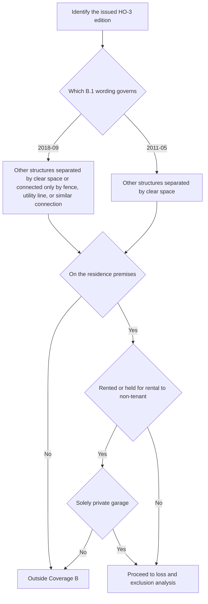

## Read Coverage B from the issued HO-3 edition

Coverage B is the **other structures** part of HO-3 Section I. Read it from the edition actually issued with the policy, not from the latest repository copy. **HO-3 2011-05** remains governing for policies written under it regardless of when a loss is reported. **HO-3 2018-09** applies to policies written on or after 2018-09-01 and changes the Coverage B wording, including the rental-use limitation discussed below.

Coverage B sits **in addition to Coverage A**, not inside it. The limit is measured from the Coverage A limit shown in the Declarations, but a Coverage B payment does not consume the Coverage A dwelling limit.

## What Coverage B covers

Under HO-3 2018-09, Coverage B covers other structures on the residence premises that are set apart from the dwelling by clear space, or connected to the dwelling only by a fence, utility line, or similar connection. The residence premises is the one-family dwelling, other structures, and grounds at the location shown in the Declarations where the insured resides.

HO-3 2011-05 uses the narrower clear-space wording only. It does not include the later fence, utility-line, or similar-connection language.

This flow shows the edition-dependent Coverage B scope and the 2018 rental-use gate.

## The ten-percent limit is additional insurance

In both HO-3 2011-05 and HO-3 2018-09, the Coverage B limit is **10% of the Coverage A limit** and is **additional insurance**. Use the Coverage A limit from the Declarations to calculate the Coverage B amount. Do not treat the 10% as a fixed dollar amount, and do not treat Coverage B as a draw on Coverage A.

## Rental-use exclusion and private-garage exception

HO-3 2018-09 adds a Coverage B scope restriction: it does **not** cover other structures rented or held for rental to any person who is not a tenant of the dwelling, unless the structure is used solely as a private garage.

That is a **property-scope gate**, not a general exclusion that can be bypassed by the cause of loss. For a 2018-09 claim, first establish whether the structure is rented or held for rental, then whether the renter is a tenant of the dwelling, and if not, whether the sole-use private-garage exception applies.

This rental limitation is not present in the supplied HO-3 2011-05 Coverage B text.

## Direct physical loss still comes first

For HO-3 2018-09, Coverage B is insured against **direct physical loss** except as excluded in Section I. The scope rules and 10% limit do not themselves create coverage. A claim must still satisfy the coverage grant, then survive the applicable exclusions.

The Section I exclusions relevant to Coverage B include the water exclusions, earth movement, neglect and deterioration, ordinance or law, and intentional loss. Water exclusions A.1 through A.3 are especially important because they apply regardless of any other contributing cause or event.

## Attached endorsements can change loss handling, but only on their own terms

Coverage B claims can be affected by attached endorsements, but the endorsement must actually be attached to the issued policy and its edition must be identified before applying its terms.

### Water backup: HO 04 90 writes back only the A.3 route

HO 04 90 attaches to HO-3 and modifies Section I A.3. When an authorized HO 04 90 edition is attached, it writes back the narrow sewer/drain backup or sump overflow/discharge route for direct physical loss to Coverage A, Coverage B, and Coverage C property, including an event resulting from mechanical breakdown.

The endorsement does **not** eliminate the separate water exclusions that remain in place. Flood and surface-water loss stays excluded under A.1, and subsurface water stays excluded under A.2. The endorsement also retains the known-maintenance-failure condition.

The attached edition must be identified before applying payment and condition terms:

| Attached HO 04 90 edition | Key effect on Coverage B loss |
| --- | --- |
| 2010-10 | $5,000 policy-period sublimit unless a higher limit is shown; separate $500 deductible; Coverage B settlement follows the attached policy; W.5 maintenance condition applies. |
| 2026-01 | $10,000 policy-period sublimit unless a higher limit is shown; separate $1,000 deductible; Coverage B settlement follows the attached policy; W.5 maintenance condition applies; if the residence premises has a finished area below grade, W.6 requires an installed and operable backwater valve or equivalent backflow-prevention device on the serving sewer line at the time of loss. |

Do not mix the editions. HO 04 90 2010-10 remains in force for policies written under it regardless of when loss is reported. HO 04 90 2026-01 replaces it for policies written on or after 2026-01-01.

### Ordinance or law: HO 04 16 can write back code-driven increased cost

HO 04 16 attaches to HO-3 and modifies the ordinance-or-law exclusion. It covers the increased cost actually incurred to repair, rebuild, or demolish the damaged dwelling or other structure because of an ordinance or law in force at the time of loss, and only when the underlying Section I loss is covered.

For Coverage B, that means HO 04 16 can pay the **code-driven increased cost** associated with a damaged other structure. It does not turn an otherwise excluded cause of loss into covered property damage, and it does not reduce the Coverage A or Coverage B limits because it is additional insurance.

The endorsement also has its own completion deadline, incurred-cost requirement, and retained exclusions.

## Claim file points that matter

For a Coverage B loss, keep the issued HO-3 edition, the Declarations Coverage A limit, the structure’s location and connection facts, and the rental facts. For a 2018-09 claim, document the B.3 tenant and private-garage analysis before moving to the cause of loss.

Then document the direct physical loss, the applicable Section I exclusions, and any attached endorsement **and edition** before stating a payment position. For an attached HO 04 90 claim, record whether 2010-10 or 2026-01 governs; for 2026-01, preserve evidence that any finished-area-below-grade device requirement was satisfied at the time of loss. For an attached HO 04 16 claim, preserve the ordinance, the damaged-property settlement, the completed work, and the actually incurred increased cost.

## Focused review tests

1. **Detached shed on the premises:** Confirm it is other structures under the governing B.1 wording, then apply exclusions and any attached endorsement.
2. **Rental workshop that is not a dwelling tenant’s private garage:** In HO-3 2018-09, the structure is outside Coverage B even before cause-of-loss analysis.
3. **Water backup with attached HO 04 90:** Verify the edition, then apply the endorsement’s sublimit, deductible, maintenance condition, and any 2026-01 below-grade device requirement.
4. **Code-required repair to a damaged fence or shed:** If HO 04 16 is attached, treat the ordinance cost as an additional-cost path, not as a substitute for the underlying coverage grant.
5. **Claim file with no endorsement attached:** Do not import water-backup or ordinance-or-law write-backs from the form library unless the issued policy shows the endorsement.
