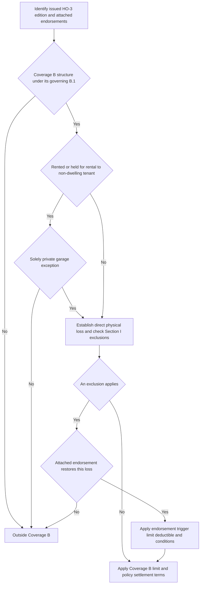

## Start with the issued HO-3 edition

Coverage B must be read from the HO-3 edition issued with the policy. **HO-3 2011-05** remains controlling for policies written under that edition, regardless of when their losses are reported. **HO-3 2018-09** is the multistate form effective for policies written on or after 2018-09-01 and supersedes 2011-05 for new business from that date. The 2018-09 form changes the Coverage B scope and adds the rental limitation described below; do not apply those additions to a 2011-05 policy merely because the loss occurs later. [HO-3 2011-05, form status](repo://forms/HO/MS/HO-3/2011-05.md#L1-L7) · [HO-3 2018-09, form status](repo://forms/HO/MS/HO-3/2018-09.md#L1-L4)

## Property scope and limit

Under **HO-3 2018-09 Section I B.1**, Coverage B covers other structures on the residence premises that are separated from the dwelling by clear space. It also covers a structure connected to the dwelling *only* by a fence, utility line, or similar connection. The defined residence premises is the one-family dwelling, other structures, and grounds at the location in the Declarations where the insured resides. The connection language is important: it prevents a fence or utility connection alone from placing the structure in Coverage A as an attached dwelling structure. [HO-3 2018-09, Definition 4](repo://forms/HO/MS/HO-3/2018-09.md#L15-L19) · [HO-3 2018-09 § B.1](repo://forms/HO/MS/HO-3/2018-09.md#L35-L41) · [HO-3 2018-09 § A.1](repo://forms/HO/MS/HO-3/2018-09.md#L25-L29)

For a **HO-3 2011-05** policy, B.1 instead says only that covered other structures are on the residence premises and “set apart from the dwelling by clear space.” It does not include the 2018-09 fence, utility-line, or similar-connection wording. [HO-3 2011-05 § B.1](repo://forms/HO/MS/HO-3/2011-05.md#L35-L40)

In **both HO-3 2011-05 B.2 and HO-3 2018-09 B.2**, the Coverage B limit is 10% of the Coverage A limit, and it is **additional insurance**. It therefore does not consume the Coverage A limit. Determine the dollar amount from the applicable Coverage A limit rather than treating 10% as a fixed dollar amount. [HO-3 2011-05 § B.2](repo://forms/HO/MS/HO-3/2011-05.md#L35-L40) · [HO-3 2018-09 § B.2](repo://forms/HO/MS/HO-3/2018-09.md#L35-L41)

## The HO-3 2018-09 rental boundary

**HO-3 2018-09 Section I B.3** excludes an other structure “rented or held for rental to any person who is not a tenant of the dwelling,” unless the structure is used **solely as a private garage**. This is a property-scope restriction, not an exclusion that can be bypassed just because the reported cause of loss would otherwise be covered. Establish both the rental or held-for-rental status and whether the renter is a dwelling tenant; if the person is not a dwelling tenant, establish whether the sole-use private-garage exception applies. [HO-3 2018-09 § B.3](repo://forms/HO/MS/HO-3/2018-09.md#L35-L42)

This B.3 limitation is not present in the supplied **HO-3 2011-05** Coverage B text. A 2011-05 policy instead has the clear-space scope and the same additional 10% limit in B.1–B.2. [HO-3 2011-05 § B.1–B.2](repo://forms/HO/MS/HO-3/2011-05.md#L35-L40)

## Covered-loss gateway and shared Section I exclusions

For **HO-3 2018-09**, Coverage B does not insure a structure against every loss. Section I P.1 insures Coverage A and B property against **direct physical loss** except as excluded in Section I — Exclusions. Apply the Coverage B scope and B.3 first, then establish direct physical loss and evaluate the Section I exclusions; the 10% limit does not itself create coverage. [HO-3 2018-09 § B.1–B.3](repo://forms/HO/MS/HO-3/2018-09.md#L35-L42) · [HO-3 2018-09 § P.1](repo://forms/HO/MS/HO-3/2018-09.md#L59-L63)

The relevant **HO-3 2018-09 Section I** exclusions apply to a qualifying Coverage B structure as they do to Coverage A property. In particular:

- Water losses caused directly or indirectly by flood, surface water, waves, tidal water, storm surge, or overflow of a body of water are excluded, whether or not wind-driven. Water below the ground surface that pressures, seeps, or leaks through a building, foundation, swimming pool, or other structure is also excluded. [HO-3 2018-09 §§ A.1–A.2](repo://forms/HO/MS/HO-3/2018-09.md#L67-L75)
- Sewer-or-drain backup and sump-related backup, overflow, or discharge are excluded, including when mechanical breakdown caused the backup or overflow. The water exclusions A.1–A.3 have anti-concurrent-causation language: they apply regardless of another cause or event contributing concurrently or in any sequence. [HO-3 2018-09 §§ A.3–A.4](repo://forms/HO/MS/HO-3/2018-09.md#L69-L77)
- Earth movement; neglect after a loss; deterioration, wear and tear, rust, mold, wet or dry rot, and the listed gradual-condition losses are excluded. Continuous or repeated water or steam seepage or leakage over weeks, months, or years is excluded, while loss that is “sudden and accidental” as defined is not excluded by that particular seepage provision. [HO-3 2018-09 §§ B.1–C.3 and Definition 5](repo://forms/HO/MS/HO-3/2018-09.md#L15-L19) · [HO-3 2018-09 §§ B.1–C.3](repo://forms/HO/MS/HO-3/2018-09.md#L79-L89)
- Increased construction, demolition, or repair cost required by ordinance or law is excluded unless an ordinance-or-law endorsement is attached; intentional loss by an insured is also excluded for all insureds, whether or not a particular insured participated. [HO-3 2018-09 §§ D.1–E.1](repo://forms/HO/MS/HO-3/2018-09.md#L91-L97)

## Endorsement paths: attachment is required

An endorsement changes this analysis only when it is attached to the issued policy. The base form itself makes the water-backup and ordinance-or-law exceptions conditional on an attached endorsement. Likewise, HO 04 81 identifies itself as an HO-3 endorsement that provides limited coverage for a cause otherwise excluded by C.2. Do not infer an attachment from the kind of damage, a requested benefit, or the existence of an endorsement form in the corpus. [HO-3 2018-09 §§ A.3 and D.1](repo://forms/HO/MS/HO-3/2018-09.md#L69-L76) [§ D.1](repo://forms/HO/MS/HO-3/2018-09.md#L91-L94) · [HO 04 81 2018-09, introductory text](repo://forms/HO/MS/HO-04-81/2018-09.md#L1-L4)

### Water backup: HO 04 90 edition 2010-10

If **HO 04 90 edition 2010-10 is attached** to the HO-3 policy, it restores direct physical-loss coverage for Coverage B property caused by sewer or drain backup or sump-related backup, overflow, or discharge, whether or not equipment mechanical breakdown caused it. The endorsement does not restore flood, surface-water, or subsurface-water losses; the base-form water exclusions for those causes continue to apply. [HO-3 2018-09 § A.3](repo://forms/HO/MS/HO-3/2018-09.md#L69-L77) · [HO 04 90 2010-10 §§ W.1 and W.4](repo://forms/HO/MS/HO-04-90/2010-10.md#L1-L8) [§ W.4](repo://forms/HO/MS/HO-04-90/2010-10.md#L17-L21)

The HO 04 90 limit is $5,000 for all loss in one policy period unless the endorsement Declarations state a higher limit; it is part of, not additional to, the Coverage A, B, and C limits. It carries a separate $500 deductible for each endorsement loss rather than the Section I deductible, and it preserves the policy’s settlement basis for Coverage B. The endorsement also excludes a loss resulting from the insured’s known, unremedied failure to maintain the relevant sewer line, drain, sump, or pump where a reasonable person would have remedied it. [HO 04 90 2010-10 §§ W.2–W.3](repo://forms/HO/MS/HO-04-90/2010-10.md#L9-L15) · [HO 04 90 2010-10 §§ W.5–W.6](repo://forms/HO/MS/HO-04-90/2010-10.md#L23-L30)

### Fungi, wet or dry rot, or bacteria: HO 04 81 edition 2018-09

If **HO 04 81 edition 2018-09 is attached**, it provides limited direct physical-loss coverage for Coverage B property damaged by fungi, wet or dry rot, or bacteria only when it results from a peril insured against under Section I that occurred during the policy period. To that extent it displaces **HO-3 2018-09 Exclusion C.2**, but it does not displace the flood, surface-water, subsurface-water, or continuous-seepage exclusions that can remove the underlying event from coverage. [HO-3 2018-09 §§ A.1–A.2 and C.2–C.3](repo://forms/HO/MS/HO-3/2018-09.md#L69-L75) [§§ C.2–C.3](repo://forms/HO/MS/HO-3/2018-09.md#L83-L89) · [HO 04 81 2018-09 §§ M.1–M.2](repo://forms/HO/MS/HO-04-81/2018-09.md#L5-L17)

The HO 04 81 aggregate is $10,000 for all covered loss in one policy period unless a higher endorsement limit is shown. It is part of, not additional to, the applicable Coverage B limit and includes removal, needed tear-out and replacement for access, post-removal testing, and related Coverage D increase. Separate from the general neglect exclusion, the endorsement also withholds loss to the extent the insured failed to take reasonable steps to dry, clean, or otherwise mitigate known or reasonably knowable water intrusion. [HO 04 81 2018-09 §§ M.3–M.5](repo://forms/HO/MS/HO-04-81/2018-09.md#L19-L31)

### Ordinance or law: HO 04 16 edition 2018-09

If **HO 04 16 edition 2018-09 is attached**, it removes the base-form D.1 bar for the eligible benefit and covers the increased cost actually incurred to repair, rebuild, or demolish a damaged other structure because of an ordinance or law in force at the time of loss. The loss itself must be covered under Section I. This is a separate, code-driven cost path; it does not turn an otherwise excluded cause of loss into covered property damage. [HO-3 2018-09 § D.1](repo://forms/HO/MS/HO-3/2018-09.md#L91-L94) · [HO 04 16 2018-09 §§ O.1 and O.6](repo://forms/HO/MS/HO-04-16/2018-09.md#L1-L9) [§ O.6](repo://forms/HO/MS/HO-04-16/2018-09.md#L33-L37)

The HO 04 16 limit is 10% of the Coverage A limit unless a higher percentage is shown for that endorsement. It is additional insurance and does not reduce Coverage A or Coverage B. Payment requires completion of repair, rebuilding, or demolition as soon as reasonably possible and no later than two years after loss unless the insurer agrees in writing to extend the period; it applies only after the damaged-property loss is settled under the applicable Section I provisions. The endorsement retains its stated exclusions, including certain pollution-related compliance cost, value loss to an undamaged portion, and pre-loss compliance obligations. [HO 04 16 2018-09 §§ O.2–O.5](repo://forms/HO/MS/HO-04-16/2018-09.md#L11-L31) · [HO 04 16 2018-09 § O.6](repo://forms/HO/MS/HO-04-16/2018-09.md#L33-L37)

This flow shows the **HO-3 2018-09** Coverage B gates and the separate attachment-dependent endorsement path; a **2011-05** review omits the 2018-09 B.3 rental gate and uses its own B.1 wording. [HO-3 2011-05 § B.1](repo://forms/HO/MS/HO-3/2011-05.md#L35-L40) · [HO-3 2018-09 §§ B.1–B.3 and P.1](repo://forms/HO/MS/HO-3/2018-09.md#L35-L42) [§ P.1](repo://forms/HO/MS/HO-3/2018-09.md#L59-L63)

## Claim file review

For a Coverage B loss, retain the issued HO-3 edition, Declarations Coverage A limit, the structure’s location and connection facts, and rental facts. For a 2018-09 claim, document the B.3 tenant and private-garage analysis before evaluating the cause of loss. Then document the direct physical loss, each applicable Section I exclusion, and—only if actually attached—the endorsement form, its trigger, limit treatment, deductible, and conditions. The ordinary 2018-09 Section I duties still require prompt notice, protection from further damage, and a signed sworn proof of loss within 60 days after request; the Section I deductible generally applies to each loss, subject to the separate windstorm-or-hail rule where required by a state amendatory endorsement. [HO-3 2018-09 §§ S.1–S.2](repo://forms/HO/MS/HO-3/2018-09.md#L101-L106) · [HO-3 2018-09 § S.5](repo://forms/HO/MS/HO-3/2018-09.md#L109-L112)
