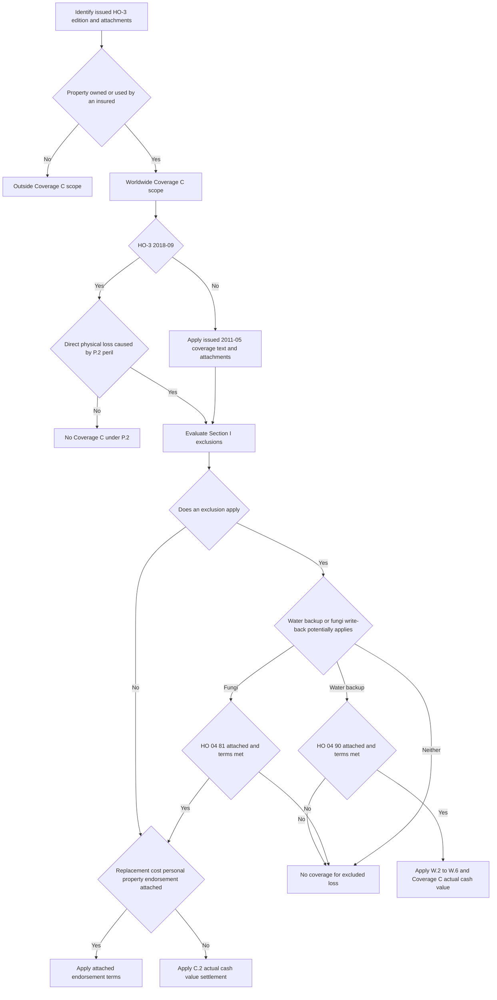

## Start with the issued HO-3 edition

Coverage C must be decided under the HO-3 edition issued with the policy. **HO-3 2011-05** is superseded for policies written on or after 2018-09-01, but remains in force for policies written under it and governs those losses regardless of when reported. **HO-3 2018-09** is the multistate form effective for policies written on or after 2018-09-01. This matters because the special limits changed; do not substitute the newer limits for a 2011-05 policy. [HO-3 2011-05, form status](repo://forms/HO/MS/HO-3/2011-05.md#L1-L7) · [HO-3 2018-09, form status](repo://forms/HO/MS/HO-3/2018-09.md#L1-L4)

Confirm the Declarations, the issued base-form edition, and every attached endorsement before choosing a coverage route or settlement basis. A form existing in the corpus is not evidence that it is attached to a particular policy. For broader form-selection guidance, see [Policy editions and governing forms](../policy-editions-and-governing-forms.md).

## Worldwide property scope and the covered-loss gate

In **both HO-3 2011-05 C.1 and HO-3 2018-09 C.1**, Coverage C says: **“We cover personal property owned or used by an insured while it is anywhere in the world.”** “Anywhere in the world” describes the geographic scope of the insured-owned-or-used personal property; it does not eliminate the need to establish a covered cause of loss, apply exclusions, and apply the applicable limit and settlement provisions. [HO-3 2011-05 § C.1](repo://forms/HO/MS/HO-3/2011-05.md#L41-L47) · [HO-3 2018-09 § C.1](repo://forms/HO/MS/HO-3/2018-09.md#L43-L50)

For **HO-3 2018-09**, Coverage C is expressly a named-peril coverage: Section I P.2 insures against direct physical loss caused **only** by the listed perils, including fire or lightning, windstorm or hail, theft, and accidental discharge or overflow of water or steam from within the specified systems. The worldwide scope in C.1 therefore is not an open-perils grant. Apply the P.2 peril requirement as well as the Section I exclusions. [HO-3 2018-09 § P.2](repo://forms/HO/MS/HO-3/2018-09.md#L59-L64) · [HO-3 2018-09 §§ A.1–A.4 and C.1–C.3](repo://forms/HO/MS/HO-3/2018-09.md#L69-L89)

The supplied **HO-3 2011-05** text establishes the worldwide C.1 scope, settlement provision, special limits, and exclusions, but does not contain a separately numbered Coverage C perils-insured-against provision corresponding to 2018-09 P.2. Do not import the 2018-09 named-peril list as the controlling 2011-05 text; resolve the covered-cause question from the issued 2011-05 policy and applicable attached forms. [HO-3 2011-05 §§ C.1–C.3](repo://forms/HO/MS/HO-3/2011-05.md#L41-L48) · [HO-3 2011-05, Section I exclusions](repo://forms/HO/MS/HO-3/2011-05.md#L57-L80)

For the detailed analysis of the named perils and Section I exclusions, see [Perils and general exclusions](../property/perils-and-general-exclusions.md).

## Default loss settlement and the replacement-cost exception

Both editions use the same Coverage C baseline: **“Personal property is settled at actual cash value at the time of loss, unless a replacement cost personal property endorsement is attached.”** [HO-3 2011-05 § C.2](repo://forms/HO/MS/HO-3/2011-05.md#L41-L47) · [HO-3 2018-09 § C.2](repo://forms/HO/MS/HO-3/2018-09.md#L43-L50)

Under **HO-3 2011-05 Definition 1**, actual cash value is repair or replacement cost with like kind and quality less depreciation. **HO-3 2018-09 Definition 1** retains that method and specifies that depreciation is based on the property's age, condition, and remaining useful life immediately before the loss. Both forms define replacement cost as repair or replacement with like kind and quality **“without deduction for depreciation”**; the 2018-09 definition adds “at the time of loss.” [HO-3 2011-05 Definitions 1–2](repo://forms/HO/MS/HO-3/2011-05.md#L13-L18) · [HO-3 2018-09 Definitions 1–2](repo://forms/HO/MS/HO-3/2018-09.md#L9-L14)

The replacement-cost result is conditional on an attached **replacement cost personal property endorsement**. C.2 does not supply that endorsement's own limits, conditions, or calculation terms, so those terms must be taken from the actual attached endorsement and Declarations rather than assumed from the base-form exception.

## Special limits: retain the edition-specific amounts

Special limits are category-specific caps, not a substitute for deciding whether the property falls within Coverage C or whether the cause of loss is covered. In **HO-3 2018-09 C.3**, the form expressly says the special limits **“do not increase the Coverage C limit.”** [HO-3 2018-09 § C.3](repo://forms/HO/MS/HO-3/2018-09.md#L43-L50)

| Category in C.3 | HO-3 2011-05 | HO-3 2018-09 | Change to preserve in the claim review |
| --- | ---: | ---: | --- |
| Money and precious metals | $200 | $200 | No change. |
| Watercraft, including trailers and equipment | $1,000 | $1,500 | Increased by $500. |
| **Theft** of jewelry, watches, and precious stones | $1,000 | $1,500 | Increased by $500; the stated category is theft, not every form of loss to these items. |
| **Theft** of firearms | $2,000 | $2,500 | Increased by $500; the stated category is theft. |
| Property used primarily for business purposes on the residence premises | Not listed | $2,500 | A new expressly listed 2018-09 category. |

The table follows the exact C.3 categories and amounts in each supplied edition. In particular, do not collapse the $1,000/$1,500 watercraft and theft-of-jewelry limits or the $2,000/$2,500 theft-of-firearms limits; and do not apply the 2018-09 business-property special limit to a 2011-05 policy from this text. [HO-3 2011-05 § C.3](repo://forms/HO/MS/HO-3/2011-05.md#L41-L48) · [HO-3 2018-09 § C.3](repo://forms/HO/MS/HO-3/2018-09.md#L43-L50)

## Endorsement-specific paths

### Water backup is not the ordinary replacement-cost path

For both base-form editions, sewer/drain backup and sump-related backup, overflow, or discharge are excluded unless **HO 04 90 Water Backup and Sump Discharge or Overflow** is attached. The 2018-09 base form additionally states that, when attached, the endorsement provides coverage to its stated sublimit. [HO-3 2011-05 § A.3](repo://forms/HO/MS/HO-3/2011-05.md#L59-L66) · [HO-3 2018-09 §§ A.3–A.4](repo://forms/HO/MS/HO-3/2018-09.md#L69-L77)

For an attached **HO 04 90 edition 2010-10**, review the endorsement—not the ordinary Coverage C replacement-cost exception. It covers the described direct physical loss, subject to a $5,000 all-losses-per-policy-period sublimit unless higher Declarations limit is shown; that limit is part of, not in addition to, Coverage C. It also has a separate $500 deductible per endorsement loss, not the Section I deductible. Most importantly for personal property, W.6 provides: **“Loss to property covered under Coverage C is settled at actual cash value regardless of any replacement cost personal property endorsement, unless the Declarations state otherwise for this endorsement.”** Flood, surface-water, and subsurface-water exclusions remain, and W.5 bars the stated known, unremedied maintenance failure. [HO 04 90 2010-10 §§ W.1–W.6](repo://forms/HO/MS/HO-04-90/2010-10.md#L5-L31)

Use [Water damage and backup](../property/water-damage-and-backup.md) for the full write-back, sublimit, deductible, maintenance, and remaining-water-exclusion analysis.

### Fungi, wet or dry rot, or bacteria is a separate limited write-back

**HO 04 81 edition 2018-09**, when attached, provides direct physical-loss coverage for Coverage C property damaged by fungi, wet or dry rot, or bacteria only when it results from a Section I insured peril that occurred during the policy period; to that extent, the base-form C.2 exclusion does not apply. It does not restore a loss whose underlying water or moisture source is flood, surface water, subsurface water, or the continuous/repeated seepage or leakage excluded by the base form. [HO 04 81 2018-09 §§ M.1–M.2](repo://forms/HO/MS/HO-04-81/2018-09.md#L5-L17) · [HO-3 2018-09 §§ A.1–A.2 and C.2–C.3](repo://forms/HO/MS/HO-3/2018-09.md#L69-L75) [§§ C.2–C.3](repo://forms/HO/MS/HO-3/2018-09.md#L83-L89)

The HO 04 81 limit is $10,000 for all covered loss in one policy period unless a higher endorsement limit is shown. It is part of, not in addition to, the applicable Coverage C limit, includes the enumerated removal, access, testing, and related Coverage D costs, and is reduced to the extent of failure to take the required reasonable water-intrusion mitigation steps. [HO 04 81 2018-09 §§ M.3–M.5](repo://forms/HO/MS/HO-04-81/2018-09.md#L19-L31)

Use [Fungi, rot, and bacteria](../property/fungi-rot-and-bacteria.md) for the trigger, underlying-water-source, aggregate-limit, included-cost, and mitigation analysis.

This working review sequence shows that the worldwide scope, cause-of-loss analysis, special limits, and settlement basis are distinct questions. It depicts the 2018-09 P.2 gate only for that edition, routes water backup to HO 04 90's special actual-cash-value rule, and is not an order of operations prescribed by the forms.

## Claim-file checks

1. Preserve the Declarations, issued HO-3 edition, list of attached endorsements, each item's ownership-or-use facts, location, value, and category facts. For special-limit claims, document whether the reported loss is actually theft where C.3 says theft.
2. For **HO-3 2018-09**, identify the specific P.2 peril and then evaluate applicable exclusions and any attached write-back. For a water-backup or fungi claim, do not stop at ordinary C.2 settlement; retain the endorsement trigger, sublimit, deductible or mitigation analysis, and Declarations amendments.
3. Apply the settlement route after coverage: base C.2 actual cash value unless an attached replacement-cost personal-property endorsement controls, except that attached HO 04 90 uses its own W.6 Coverage C actual-cash-value rule unless its Declarations say otherwise.
4. Meet the applicable Section I post-loss duties. **HO-3 2011-05 S.1–S.2** requires prompt notice, protection from further damage, and a signed, sworn proof of loss within 60 days after request. **HO-3 2018-09 S.1–S.2** adds preparation of an inventory of damaged personal property. [HO-3 2011-05 §§ S.1–S.2](repo://forms/HO/MS/HO-3/2011-05.md#L83-L88) · [HO-3 2018-09 §§ S.1–S.2](repo://forms/HO/MS/HO-3/2018-09.md#L101-L106)
5. The Section I deductible shown in the Declarations applies to each loss under **HO-3 2011-05 S.4** and **HO-3 2018-09 S.5**, subject in 2018-09 to the stated state-amendatory windstorm-or-hail rule. Do not apply that general deductible to attached HO 04 90 loss: W.3 replaces it with the endorsement's separate deductible. [HO-3 2011-05 § S.4](repo://forms/HO/MS/HO-3/2011-05.md#L83-L92) · [HO-3 2018-09 § S.5](repo://forms/HO/MS/HO-3/2018-09.md#L101-L112) · [HO 04 90 2010-10 § W.3](repo://forms/HO/MS/HO-04-90/2010-10.md#L13-L16)
