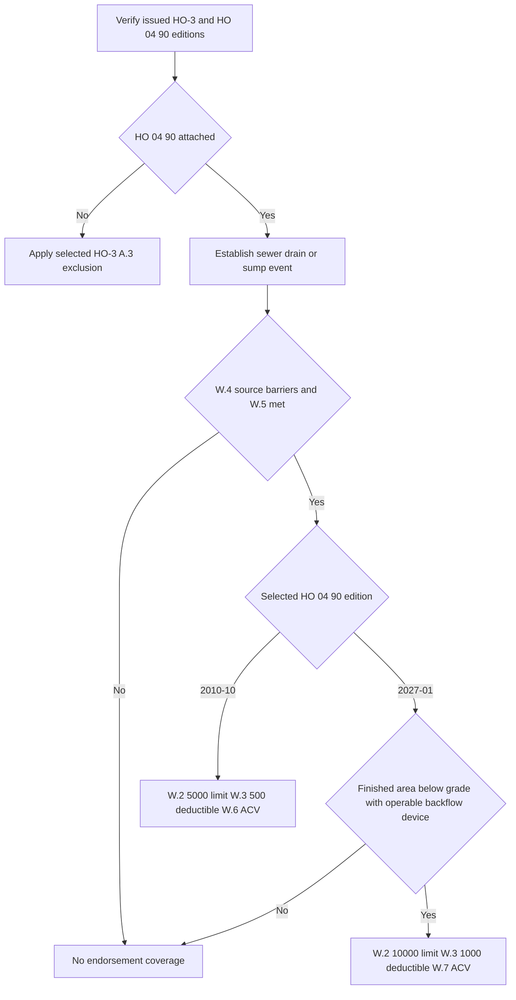

## Select the issued editions before calculating a Coverage C loss

For **HO-3 2011-05**, the form remains in force for policies written under it and governs their losses regardless of when reported, even though **HO-3 2018-09** supersedes it for policies written on or after 2018-09-01. For **HO-3 2018-09**, that form governs policies written on or after that date. Select the issued HO-3 form, Declarations, and attached endorsement edition; a repository form does not establish attachment to a particular policy. [HO-3 2011-05, form status](repo://forms/HO/MS/HO-3/2011-05.md#L1-L7) · [HO-3 2018-09, form status](repo://forms/HO/MS/HO-3/2018-09.md#L1-L4)

For **HO 04 90 2010-10**, the endorsement remains in force for policies written under it and governs their losses regardless of reporting date. For **HO 04 90 2027-01**, the form replaces the 2026-01 edition for policies written on or after 2027-01-01. The supplied 2027-01 form does not state that it retroactively changes a policy issued with 2010-10. [HO 04 90 2010-10, form status](repo://forms/HO/MS/HO-04-90/2010-10.md#L1-L7) · [HO 04 90 2027-01, form status](repo://forms/HO/MS/HO-04-90/2027-01.md#L1-L4)

For policy-assembly controls, see [Governing Form Editions and Policy Assembly](../policy-editions-and-governing-forms.md).

## Coverage C baseline outside the water-backup route

Under **HO-3 2011-05 C.1** and **HO-3 2018-09 C.1**, Coverage C applies to personal property owned or used by an insured anywhere in the world. Under **HO-3 2018-09 P.2**, Coverage C nevertheless applies only to direct physical loss caused by a listed peril, subject to Section I exclusions; the supplied **HO-3 2011-05** text has no separately numbered P.2 provision. [HO-3 2011-05 C.1](repo://forms/HO/MS/HO-3/2011-05.md#L41-L48) · [HO-3 2018-09 C.1 and P.2](repo://forms/HO/MS/HO-3/2018-09.md#L43-L50) [P.2](repo://forms/HO/MS/HO-3/2018-09.md#L59-L64)

Under **HO-3 2011-05 C.2** and **HO-3 2018-09 C.2**, personal property is settled at actual cash value (ACV) at the time of loss unless a replacement-cost personal-property endorsement is attached. For **HO-3 2011-05**, ACV is like-kind-and-quality repair or replacement less depreciation. For **HO-3 2018-09**, the same calculation uses depreciation based on the property's pre-loss age, condition, and remaining useful life. [HO-3 2011-05, Definitions 1–2 and C.2](repo://forms/HO/MS/HO-3/2011-05.md#L13-L18) [C.2](repo://forms/HO/MS/HO-3/2011-05.md#L41-L47) · [HO-3 2018-09, Definitions 1–2 and C.2](repo://forms/HO/MS/HO-3/2018-09.md#L9-L14) [C.2](repo://forms/HO/MS/HO-3/2018-09.md#L43-L50)

The selected **HO-3 2011-05 C.3** or **HO-3 2018-09 C.3** special limit still applies to a covered item. The 2018-09 form raises watercraft and theft-of-jewelry limits to $1,500, theft-of-firearms to $2,500, adds $2,500 for property used primarily for business on the residence premises, and says those limits do not increase Coverage C; its money-and-precious-metals limit remains $200. The corresponding 2011-05 amounts are $1,000, $1,000, $2,000, no stated business category, and $200. [HO-3 2011-05 C.3](repo://forms/HO/MS/HO-3/2011-05.md#L41-L48) · [HO-3 2018-09 C.3](repo://forms/HO/MS/HO-3/2018-09.md#L43-L50)

## Water backup: verify the coverage route first

Under **HO-3 2011-05 A.3** and **HO-3 2018-09 A.3**, sewer or drain backup and overflow or discharge from a sump, sump pump, or related equipment are excluded unless HO 04 90 is attached. Under **HO-3 2018-09 A.3**, the exclusion expressly applies even when mechanical breakdown causes the backup or overflow; **2018-09 A.4** also applies A.1–A.3 regardless of any concurrently or sequentially contributing cause or event. Do not attribute those two 2018-09 additions to the supplied 2011-05 wording. [HO-3 2011-05 A.3](repo://forms/HO/MS/HO-3/2011-05.md#L59-L66) · [HO-3 2018-09 A.3–A.4](repo://forms/HO/MS/HO-3/2018-09.md#L69-L77)

When attached, **HO 04 90 2010-10 W.1 writes back HO-3 A.3** for direct physical loss to Coverage A, B, or C property from the described sewer/drain backup or sump-related event, including an event resulting from mechanical breakdown. When attached, **HO 04 90 2027-01 W.1 writes back HO-3 A.3** for the same described direct physical loss and mechanical-breakdown event. Each relationship is limited to the stated backup/sump event; neither endorsement is general water coverage. [HO 04 90 2010-10, attachment target and W.1](repo://forms/HO/MS/HO-04-90/2010-10.md#L7-L11) · [HO-3 2011-05 A.3](repo://forms/HO/MS/HO-3/2011-05.md#L63-L66) · [HO-3 2018-09 A.3](repo://forms/HO/MS/HO-3/2018-09.md#L75-L77) · [HO 04 90 2027-01, attachment target and W.1](repo://forms/HO/MS/HO-04-90/2027-01.md#L3-L11)

Under **HO 04 90 2010-10 W.4** and **HO 04 90 2027-01 W.4**, flood/surface-water sources and subsurface-water sources remain outside the endorsement's coverage. Establish the source and entry path: a below-grade location or the presence of a sump does not alone establish either a covered W.1 event or an excluded source. [HO 04 90 2010-10 W.4](repo://forms/HO/MS/HO-04-90/2010-10.md#L21-L25) · [HO 04 90 2027-01 W.4](repo://forms/HO/MS/HO-04-90/2027-01.md#L25-L33)

Under **HO 04 90 2010-10 W.5** and **HO 04 90 2027-01 W.5**, there is no endorsement coverage if the event resulted from an insured's known pre-loss failure to maintain the serving sewer line, drain, sump, or sump pump where a reasonable person would have remedied it. This condition requires findings on the maintenance failure, causation, knowledge, and reasonable remedy; it is not the same as the post-loss property-preservation requirement under either HO-3 edition. [HO 04 90 2010-10 W.5](repo://forms/HO/MS/HO-04-90/2010-10.md#L27-L29) · [HO 04 90 2027-01 W.5](repo://forms/HO/MS/HO-04-90/2027-01.md#L35-L40) · [HO-3 2011-05 S.1](repo://forms/HO/MS/HO-3/2011-05.md#L83-L87) · [HO-3 2018-09 S.1](repo://forms/HO/MS/HO-3/2018-09.md#L101-L105)

## Coverage C settlement is edition-specific

| Attached endorsement edition | Coverage C settlement | Default policy-period maximum | Deductible | Additional gate |
| --- | --- | ---: | ---: | --- |
| **HO 04 90 2010-10** | **W.6:** ACV regardless of a replacement-cost personal-property endorsement, unless the Declarations state otherwise for the endorsement. | **W.2:** $5,000, unless higher in the Declarations; part of—not additional to—the applicable Coverage C limit. | **W.3:** separate $500 for each endorsement loss; the Section I deductible does not apply. | **W.5:** known, unremedied maintenance failure as stated above. |
| **HO 04 90 2027-01** | **W.7:** ACV regardless of a replacement-cost personal-property endorsement, unless the Declarations state otherwise for the endorsement. | **W.2:** $10,000, unless higher in the Declarations; part of—not additional to—the applicable Coverage C limit. | **W.3:** separate $1,000 for each endorsement loss; the Section I deductible does not apply. | **W.6:** for a residence premises with a finished area below grade, an operable backwater valve or equivalent backflow-prevention device must have been installed on the serving sewer line at loss. |

For **HO 04 90 2010-10**, W.6 is the continuing endorsement-specific ACV settlement rule, and it is numbered W.6. For **HO 04 90 2027-01**, the same Coverage C ACV result is W.7 because new W.6 inserts the below-grade backflow-prevention requirement. A replacement-cost endorsement attached to the base HO-3 does not override the selected HO 04 90 settlement provision unless the selected endorsement's Declarations say otherwise. [HO 04 90 2010-10 W.2–W.3 and W.6](repo://forms/HO/MS/HO-04-90/2010-10.md#L13-L19) [W.6](repo://forms/HO/MS/HO-04-90/2010-10.md#L31-L35) · [HO 04 90 2027-01 W.2–W.3 and W.6–W.7](repo://forms/HO/MS/HO-04-90/2027-01.md#L13-L23) [W.6–W.7](repo://forms/HO/MS/HO-04-90/2027-01.md#L42-L55) · [HO-3 2011-05 C.2](repo://forms/HO/MS/HO-3/2011-05.md#L43-L45) · [HO-3 2018-09 C.2](repo://forms/HO/MS/HO-3/2018-09.md#L45-L49)

*The review flow separates attachment and source conditions from the edition-specific payment terms; the 2027-01 device requirement applies only to the stated finished-below-grade premises.* [HO 04 90 2010-10 W.1–W.6](repo://forms/HO/MS/HO-04-90/2010-10.md#L9-L35) · [HO 04 90 2027-01 W.1–W.7](repo://forms/HO/MS/HO-04-90/2027-01.md#L6-L55)

## Claim-file checks and adjacent coverage

1. For **HO-3 2011-05** and **HO-3 2018-09**, retain the issued form, Declarations, endorsement schedule, exact HO 04 90 edition, source/entry-path evidence, damaged-item inventory, and prior endorsement payments in the policy period. The applicable HO-3 condition requires prompt notice and protection from further damage; **2018-09 S.1** also requires an inventory of damaged personal property. [HO-3 2011-05 S.1–S.2](repo://forms/HO/MS/HO-3/2011-05.md#L83-L88) · [HO-3 2018-09 S.1–S.2](repo://forms/HO/MS/HO-3/2018-09.md#L101-L106)
2. For **HO 04 90 2010-10**, apply W.2, W.3, and W.6—not the ordinary Coverage C replacement-cost result—to a covered Coverage C backup loss. For **HO 04 90 2027-01**, apply W.2, W.3, W.6, and W.7 instead; do not use the former $5,000/$500 figures or call W.6 the settlement provision. [HO 04 90 2010-10 W.2–W.3 and W.6](repo://forms/HO/MS/HO-04-90/2010-10.md#L13-L19) [W.6](repo://forms/HO/MS/HO-04-90/2010-10.md#L31-L35) · [HO 04 90 2027-01 W.2–W.3 and W.6–W.7](repo://forms/HO/MS/HO-04-90/2027-01.md#L13-L23) [W.6–W.7](repo://forms/HO/MS/HO-04-90/2027-01.md#L42-L55)
3. For **HO-3 2018-09**, evaluate Coverage C's P.2 named-peril requirement as well as A.3 and the other exclusions. For **HO-3 2011-05**, do not import the separately numbered 2018-09 P.2 requirement into the supplied 2011-05 text. [HO-3 2011-05, property coverages and exclusions](repo://forms/HO/MS/HO-3/2011-05.md#L25-L80) · [HO-3 2018-09 P.2 and A.3](repo://forms/HO/MS/HO-3/2018-09.md#L59-L77)

For **HO 04 81 2018-09**, fungi, wet/dry rot, or bacteria is a separate limited route for covered Coverage C property only when the condition results from a Section I insured peril during the policy period. Its M.2 retains the stated flood, surface-water, subsurface-water, and continuous-seepage barriers; M.3–M.5 provide its own $10,000 policy-period aggregate unless increased, included costs, and water-intrusion mitigation limitation. Apply otherwise applicable **HO-3 2018-09** Coverage C settlement terms after those gates; HO 04 81 is not a replacement-cost personal-property endorsement. [HO 04 81 2018-09 M.1–M.5](repo://forms/HO/MS/HO-04-81/2018-09.md#L5-L31) · [HO-3 2018-09 C.2–C.3](repo://forms/HO/MS/HO-3/2018-09.md#L83-L90) · [HO-3 2018-09 C.2](repo://forms/HO/MS/HO-3/2018-09.md#L43-L49)

Use [Water Damage Exclusions and Water Backup Write-Back](../property/water-damage-and-backup.md) for water-source classification and [Water Loss Claims Handling](../../operations/claims-water-loss-handling.md) for the internal investigation, escalation, and documentation process.
