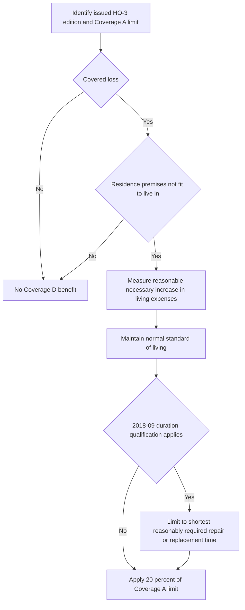

## Determine the issued HO-3 form first

Coverage D is controlled by the HO-3 edition issued with the policy, not by the reporting date or by a later form. **HO-3 2011-05** remains in force for policies written under it and governs their losses regardless of when reported; it was superseded for policies written on or after 2018-09-01. **HO-3 2018-09** is the multistate form effective for policies written on or after that date. This distinction matters because 2018-09 adds an express duration qualification to Coverage D. [HO-3 2011-05, form status](repo://forms/HO/MS/HO-3/2011-05.md#L1-L7) · [HO-3 2018-09, form status](repo://forms/HO/MS/HO-3/2018-09.md#L1-L4)

Review the Declarations to establish the applicable Coverage A limit and confirm the issued base form and any attached endorsements. The $ amount available under Coverage D is calculated from that applicable Coverage A limit; an endorsement form in the repository does not establish that it is attached to a particular policy.

## Coverage D gateway and benefit measure

Under **both HO-3 2011-05 D.1 and HO-3 2018-09 D.1**, two threshold facts are required: there must be a **covered loss**, and that loss must make the **residence premises not fit to live in**. Coverage D is therefore not triggered merely by damage, inconvenience, a voluntary relocation, or an expense that is unrelated to loss of habitability. For the 2018-09 form, the separate Section I coverage analysis includes the direct-physical-loss grant for Coverage A and B and the Section I exclusions; D.1's phrase “covered loss” does not bypass that analysis. [HO-3 2011-05 § D.1](repo://forms/HO/MS/HO-3/2011-05.md#L49-L53) · [HO-3 2018-09 § D.1](repo://forms/HO/MS/HO-3/2018-09.md#L51-L55) · [HO-3 2018-09 § P.1](repo://forms/HO/MS/HO-3/2018-09.md#L59-L63) · [HO-3 2018-09, Section I exclusions](repo://forms/HO/MS/HO-3/2018-09.md#L67-L97)

The covered measure is the **reasonable increase in living expenses necessary to maintain the insured's normal standard of living**. It is an incremental-expense measure: document the temporary living expenses and the corresponding ordinary living expenses in order to determine the increase, then assess whether the increase was necessary and reasonable to maintain the normal standard. D.1 does not promise reimbursement of every temporary living expense or a different standard of living. [HO-3 2011-05 § D.1](repo://forms/HO/MS/HO-3/2011-05.md#L49-L53) · [HO-3 2018-09 § D.1](repo://forms/HO/MS/HO-3/2018-09.md#L51-L55)

This is a claim-review sequence grounded in D.1–D.2. The duration branch is unique to **HO-3 2018-09**; the diagram does not treat a 2011-05 policy as subject to that later qualification. [HO-3 2011-05 §§ D.1–D.2](repo://forms/HO/MS/HO-3/2011-05.md#L49-L53) · [HO-3 2018-09 §§ D.1–D.2](repo://forms/HO/MS/HO-3/2018-09.md#L51-L55)

## Limit: 20% of Coverage A

In **both editions**, D.2 makes the Coverage D limit of liability **20% of the Coverage A limit**. Calculate the cap from the policy's applicable Coverage A limit rather than using a fixed dollar figure. Unlike Coverage B's expressly “additional insurance” wording, the supplied Coverage D language states its percentage limit but does not label it additional insurance; do not add that characterization without controlling policy language. [HO-3 2011-05 § D.2](repo://forms/HO/MS/HO-3/2011-05.md#L49-L53) · [HO-3 2018-09 § D.2](repo://forms/HO/MS/HO-3/2018-09.md#L51-L55) · [HO-3 2018-09 § B.2](repo://forms/HO/MS/HO-3/2018-09.md#L35-L41)

The percentage cap is separate from the D.1 eligibility and measure requirements. A claim file should retain the Declarations Coverage A limit, the calculated 20% amount, evidence of uninhabitability, the covered-loss determination, and the expense comparison supporting the claimed increase. A limit does not itself make an otherwise ineligible expense payable.

## The 2018-09 shortest-reasonably-required duration

**HO-3 2018-09 D.1** retains the same covered-loss, uninhabitability, reasonable-increase, and normal-standard requirements as 2011-05, but adds that the benefit is for **“the shortest time reasonably required to repair or replace the premises.”** Duration is consequently a distinct control on otherwise qualifying increased living expenses under the 2018-09 form: document the repair-or-replacement scope, reasonable timeline, and the facts supporting any claimed period. [HO-3 2018-09 § D.1](repo://forms/HO/MS/HO-3/2018-09.md#L51-L55)

The supplied **HO-3 2011-05 D.1** contains no corresponding shortest-time phrase. It still requires a covered loss, uninhabitability, and a reasonable increase necessary to maintain the normal standard of living, but the later 2018-09 duration wording must not be imported into a 2011-05 claim as its controlling text. [HO-3 2011-05 § D.1](repo://forms/HO/MS/HO-3/2011-05.md#L49-L53) · [HO-3 2018-09 § D.1](repo://forms/HO/MS/HO-3/2018-09.md#L51-L55)

## Fungi, wet or dry rot, or bacteria: a limited attributable-loss-of-use path

Fungi-related loss of use requires both the ordinary **Coverage D** prerequisites and the terms of an **attached HO 04 81 Limited Fungi, Wet or Dry Rot, or Bacteria Coverage, edition 2018-09**. Under **HO-3 2018-09 D.1**, the loss must be covered and make the residence premises not fit to live in, and the benefit remains the reasonable increased living expense necessary to maintain the normal standard, limited to the shortest reasonably required repair-or-replacement time. HO 04 81 M.1 separately supplies limited direct physical-loss coverage for fungi, rot, or bacteria only when it results from a Section I insured peril during the policy period, displacing Exclusion C.2 only to that extent. [HO-3 2018-09 § D.1](repo://forms/HO/MS/HO-3/2018-09.md#L51-L55) · [HO 04 81 2018-09 § M.1](repo://forms/HO/MS/HO-04-81/2018-09.md#L5-L10)

**HO 04 81 M.4** expressly includes in its M.3 limit any **increase in Coverage D loss of use attributable to the fungi, rot, or bacteria**, along with removal, necessary access tear-out and replacement, and post-removal testing. M.3 is a $10,000 aggregate for all endorsement loss in one policy period unless a higher endorsement limit appears in the Declarations, and it is part of—not in addition to—the applicable Coverage A, B, and C limits. Therefore, where covered fungi-related loss of use is claimed, track the attributable increase within the endorsement aggregate as well as applying Coverage D; do not treat M.4 as a new, general additional-living-expense grant or as a benefit for loss of use unrelated to fungi, rot, or bacteria. [HO 04 81 2018-09 §§ M.3–M.4](repo://forms/HO/MS/HO-04-81/2018-09.md#L19-L27) · [HO-3 2018-09 §§ D.1–D.2](repo://forms/HO/MS/HO-3/2018-09.md#L51-L55)

The endorsement does not open coverage for every moisture-related fungi condition. Its stated trigger requires an underlying Section I insured peril; it identifies sudden accidental plumbing discharge and covered water backup as examples, while flood, surface water, subsurface water, and continuous or repeated seepage remain outside its coverage because the underlying loss is excluded. It also withholds endorsement coverage to the extent that an insured did not take reasonable steps to dry, clean, or otherwise mitigate water intrusion after knowing or reasonably being expected to know of it. [HO 04 81 2018-09 §§ M.1–M.2](repo://forms/HO/MS/HO-04-81/2018-09.md#L5-L17) · [HO 04 81 2018-09 § M.5](repo://forms/HO/MS/HO-04-81/2018-09.md#L29-L31) · [HO-3 2018-09 §§ A.1–A.2 and C.3](repo://forms/HO/MS/HO-3/2018-09.md#L69-L75) [§ C.3](repo://forms/HO/MS/HO-3/2018-09.md#L83-L89)

### Focused fungi review

1. Confirm that HO 04 81 edition 2018-09 is attached and identify any higher M.3 limit in the Declarations.
2. Establish the underlying covered Section I peril, then the D.1 covered-loss and uninhabitability requirements. Do not start with M.4 as if it independently created loss-of-use coverage.
3. Segregate the increased living expense attributable to fungi, rot, or bacteria from other claimed living expenses. Test it under the normal D.1 measure and, for HO-3 2018-09, the shortest-reasonably-required period.
4. Track covered M.4 loss-of-use increase with the endorsement's other M.4 included costs against the M.3 policy-period aggregate, and document timely drying, cleaning, or other mitigation after known or reasonably knowable water intrusion.

For broader context on issued forms, Section I conditions, fungi triggers, and exclusions, see [Policy editions and governing forms](../policy-editions-and-governing-forms.md), [Claim conditions and deductibles](../property/claim-conditions-and-deductibles.md), [Fungi, rot, and bacteria](../property/fungi-rot-and-bacteria.md), and [Perils and general exclusions](../property/perils-and-general-exclusions.md).
