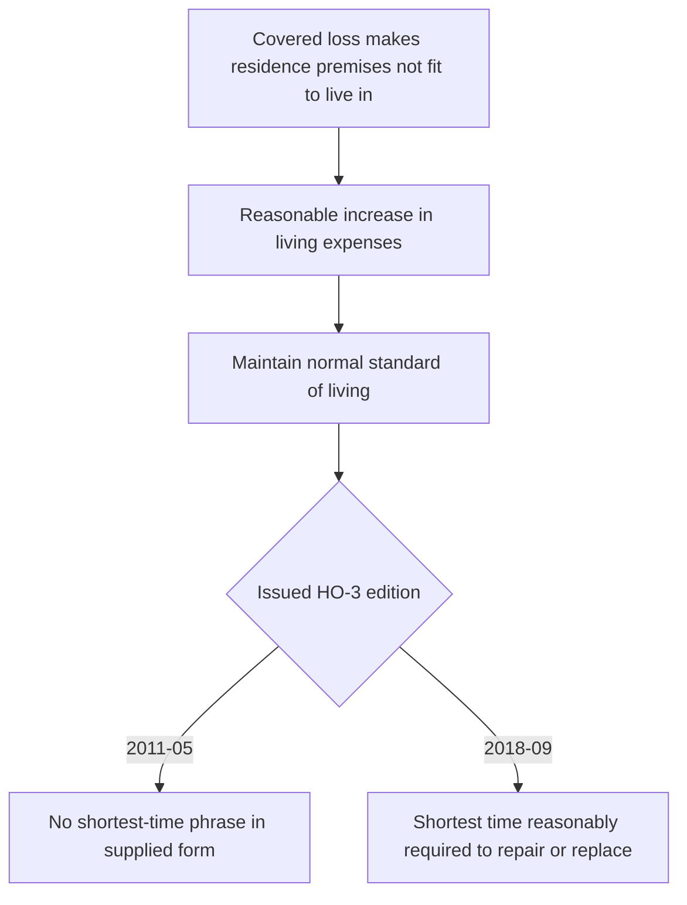
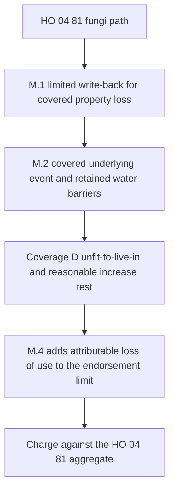

## Coverage D trigger and benefit

Coverage D applies when a covered loss makes the residence premises not fit to live in. The benefit is the reasonable increase in living expenses necessary to maintain the insured's normal standard of living; it is not a payment for every temporary expense or for a voluntarily chosen higher standard of living. [HO-3 2011-05 § D.1](repo://forms/HO/MS/HO-3/2011-05.md#L51-L55) · [HO-3 2018-09 § D.1](repo://forms/HO/MS/HO-3/2018-09.md#L51-L55)

The covered-loss and uninhabitability requirements are separate gates. A qualifying expense must still be tied to the covered-loss event that made the premises unfit to live in, and the claim file should preserve the expense comparison showing the increase over ordinary living costs.

## Duration differs by HO-3 edition

The supplied HO-3 2011-05 form covers the reasonable increase in living expenses necessary to maintain the insured's normal standard of living, but it does not add a shortest-time phrase. The supplied HO-3 2018-09 form keeps the same trigger and benefit measure and adds that Coverage D applies for the **shortest time reasonably required to repair or replace the premises**. Do not import the later duration wording into a 2011-05 policy.

*The diagram shows the common D.1 trigger and benefit measure, then the edition-specific duration branch.* [HO-3 2011-05 § D.1](repo://forms/HO/MS/HO-3/2011-05.md#L51-L55) · [HO-3 2018-09 § D.1](repo://forms/HO/MS/HO-3/2018-09.md#L51-L55)

## Limit of liability

Under both supplied HO-3 editions, the limit of liability for Coverage D is 20% of the Coverage A limit. Calculate the cap from the policy's actual Coverage A limit rather than from a fixed amount, and keep that cap separate from the threshold questions about covered loss and uninhabitability. [HO-3 2011-05 § D.2](repo://forms/HO/MS/HO-3/2011-05.md#L51-L55) · [HO-3 2018-09 § D.2](repo://forms/HO/MS/HO-3/2018-09.md#L51-L55)

## Fungi-related loss of use under HO 04 81

HO 04 81 does not create a free-standing loss-of-use grant. Instead, its M.4 says the endorsement limit includes any increase in Coverage D loss of use attributable to fungi, wet or dry rot, or bacteria. That attributable amount is still subject to the ordinary Coverage D requirements in HO-3 D.1 and to Coverage D's 20% limit, while also being counted within the HO 04 81 policy-period aggregate. [HO 04 81 §§ M.3–M.4](repo://forms/HO/MS/HO-04-81/2018-09.md#L19-L27) · [HO-3 2018-09 §§ D.1–D.2](repo://forms/HO/MS/HO-3/2018-09.md#L51-L55)

HO 04 81 M.1 and M.2 remain separate from M.4. M.1 is the limited fungi, wet or dry rot, or bacteria write-back for direct physical loss to covered property when the condition results from a Section I insured peril during the policy period. M.2 requires that the water or moisture producing the condition came from an event that was itself covered and preserves the flood, subsurface-water, and continuous-or-repeated-leakage barriers. M.4 only accounts for attributable loss of use after those ordinary Coverage D gates are satisfied.

*The diagram separates the endorsement's fungi path from the ordinary Coverage D test and the endorsement aggregate.* [HO 04 81 §§ M.1–M.4](repo://forms/HO/MS/HO-04-81/2018-09.md#L5-L27) · [HO-3 2018-09 §§ D.1–D.2](repo://forms/HO/MS/HO-3/2018-09.md#L51-L55)

## Practical file points

A complete file should retain the issued HO-3 edition, the Declarations Coverage A limit, evidence that the residence premises was not fit to live in, the expense comparison supporting the increase in living expenses, and any period-of-repair facts needed to apply the edition-specific duration rule. If HO 04 81 is involved, separately track the attributable fungi-related loss of use against the endorsement aggregate and the policy's Coverage D limit.
