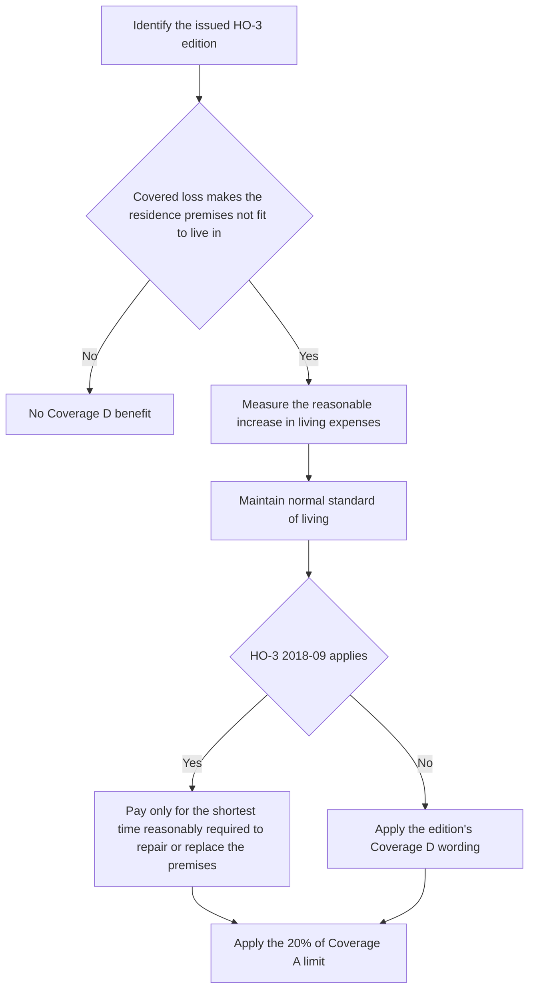

# Coverage D — Loss of Use

Coverage D is the homeowners additional-living-expense grant. It is available only when a covered loss makes the residence premises not fit to live in, and it pays only the reasonable increase in living expenses necessary to maintain the insured's normal standard of living.

The applicable HO-3 edition matters. HO-3 2011-05 states the grant without an express duration qualifier, while HO-3 2018-09 adds that the benefit runs only for the shortest time reasonably required to repair or replace the premises. In either edition, the limit of liability for Coverage D is 20% of the Coverage A limit.

This sequence reflects the policy text: trigger first, measure second, duration third where the 2018-09 form applies, and then the percentage cap.

## Trigger and measure

Coverage D does not pay because a loss happened or because the insured moved out voluntarily. The trigger is the combination of a covered loss and uninhabitability. Once triggered, the benefit is an incremental measure: compare the temporary living costs against the ordinary living costs needed to keep the insured's normal standard of living.

## Duration under HO-3 2018-09

The 2018-09 edition introduces a separate duration constraint. Even if the expenses are otherwise reasonable and necessary, they are payable only for the shortest time reasonably required to repair or replace the premises. That makes the repair-or-replacement timeline a claim fact that must be supported, not assumed.

The 2011-05 edition does not include that express shortest-time sentence, so the later duration rule should not be read into an older form unless another attached endorsement says otherwise.

## Limit of liability

Coverage D is capped at 20% of the applicable Coverage A limit. The claim file should therefore preserve the Declarations' Coverage A amount and the calculated Coverage D ceiling, because the cap is derived from the policy and is not a fixed dollar amount.

The percentage cap is separate from the threshold and measure requirements. A claim can still fail if the loss was not covered, if the premises were still fit to live in, or if the claimed expense increase was not necessary and reasonable.

## Fungi-related loss of use

An attached HO 04 81 Limited Fungi, Wet or Dry Rot, or Bacteria Coverage, edition 2018-09, can extend the Coverage D consequence for fungi-related losses. The endorsement's M.4 provision includes any increase in Coverage D loss of use attributable to fungi, rot, or bacteria within the endorsement's M.3 aggregate. That does not create a separate general loss-of-use grant; the claim still has to satisfy Coverage D's own trigger and measure rules, and the attributable amount is then counted against the endorsement limit.

M.1 is the related property-coverage write-back for qualifying fungi, rot, or bacteria caused by a Section I insured peril. It supplies the limited underlying property-loss path; M.4 handles the attributable loss-of-use accounting.

The endorsement is narrower than the base coverage. It depends on an underlying covered Section I peril and remains unavailable where the moisture source is flood, surface water, subsurface water, or other excluded water conditions described by the endorsement.

## Focused review points

1. Confirm the issued HO-3 edition before applying any duration rule.
2. Verify the covered-loss and uninhabitability trigger.
3. Measure only the reasonable increase in living expenses necessary to maintain normal living standards.
4. Apply the 20% of Coverage A cap.
5. If fungi-related loss of use is claimed, confirm that HO 04 81 edition 2018-09 is attached and track the attributable amount against the endorsement's aggregate.
