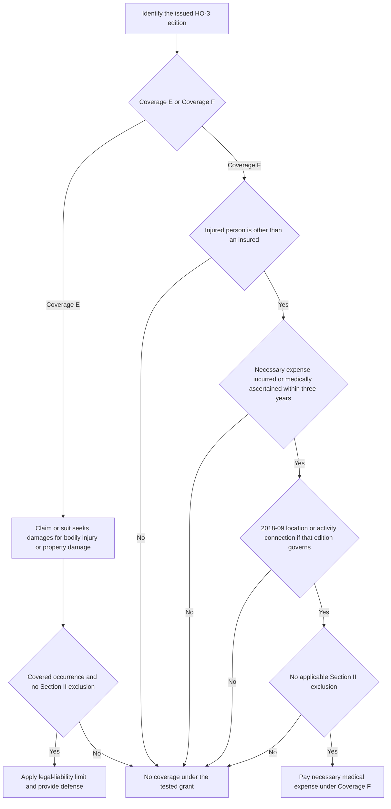

## Start with the issued HO-3 edition

Coverage E, Coverage F, and the Section II exclusions are controlled by the **HO-3 edition issued with the policy**, not by the date a claim is reported or by a later edition. **HO-3 2011-05** remains controlling for policies written under that edition, even when the loss is reported later; it was superseded only for policies written on or after 2018-09-01. **HO-3 2018-09** is the multistate form effective for policies written on or after that date. This selection is material to both Coverage F's stated scope and the business-activity and property-damage exclusions. [HO-3 2011-05, form status](repo://forms/HO/MS/HO-3/2011-05.md#L1-L7) · [HO-3 2018-09, form status](repo://forms/HO/MS/HO-3/2018-09.md#L1-L4)

Confirm the issued base form, the Declarations, and attached endorsements before applying a Section II proposition. The supplied HO-3 editions define an **occurrence** identically as an accident, including continuous or repeated exposure to substantially the same general harmful conditions, that results in bodily injury or property damage during the policy period. [HO-3 2011-05, Definition 3](repo://forms/HO/MS/HO-3/2011-05.md#L13-L21) · [HO-3 2018-09, Definition 3](repo://forms/HO/MS/HO-3/2018-09.md#L9-L17)

## Coverage E — Personal Liability

Under **E.1 in both HO-3 2011-05 and HO-3 2018-09**, when a claim is made or suit is brought against an insured for damages because of bodily injury or property damage caused by an occurrence to which the coverage applies, the insurer promises two things: to pay, up to the applicable limit of liability, damages for which the insured is legally liable, and to provide a defense at its expense. The defense undertaking is part of the Coverage E promise; it should be evaluated with the claim-or-suit allegation, the occurrence definition, and the Section II exclusions rather than treated as a property-coverage benefit. [HO-3 2011-05 § E.1](repo://forms/HO/MS/HO-3/2011-05.md#L95-L100) · [HO-3 2018-09 § E.1](repo://forms/HO/MS/HO-3/2018-09.md#L115-L120) · [HO-3 2018-09, Definition 3](repo://forms/HO/MS/HO-3/2018-09.md#L9-L17)

The form limits the **damages payment** to the policy's limit of liability, but the supplied E.1 language does not state a dollar amount. Obtain the applicable limit from the Declarations; do not substitute a Section I Coverage A–D limit or assume that an endorsement found in the repository is attached to this policy. [HO-3 2018-09 § E.1](repo://forms/HO/MS/HO-3/2018-09.md#L115-L120)

## Coverage F — Medical Payments to Others

Coverage F is a distinct medical-expense promise, not the Coverage E defense-and-legal-liability promise. In **both editions' F.1**, it applies to the **necessary medical expenses** that are incurred or medically ascertained within **three years from the accident** causing bodily injury, and the injured person must be someone other than an insured. The three-year requirement measures the stated expenses from the accident date; document that date and the incurred or medically ascertained expense date. [HO-3 2011-05 § F.1](repo://forms/HO/MS/HO-3/2011-05.md#L101-L104) · [HO-3 2018-09 § F.1](repo://forms/HO/MS/HO-3/2018-09.md#L121-L124)

**HO-3 2018-09 F.1 adds a stated location/activity connection**: the bodily injury must arise out of a condition on the insured location **or** be caused by the activities of an insured. The supplied **2011-05 F.1** has the necessary-expense, three-year, accident, bodily-injury, and non-insured-person wording, but not this added connection. Do not retroactively apply the 2018-09 phrase to a 2011-05 policy. [HO-3 2011-05 § F.1](repo://forms/HO/MS/HO-3/2011-05.md#L101-L104) · [HO-3 2018-09 § F.1](repo://forms/HO/MS/HO-3/2018-09.md#L121-L124)

This review flow separates the common edition and exclusion analysis from the different E and F entry requirements. The location-or-activity branch is a **2018-09-only** F.1 qualification; under 2011-05, proceed from the three-year test to the applicable exclusions without inserting that later wording. [HO-3 2011-05 §§ E.1–F.1 and L.1–L.2](repo://forms/HO/MS/HO-3/2011-05.md#L95-L111) · [HO-3 2018-09 §§ E.1–F.1 and L.1–L.3](repo://forms/HO/MS/HO-3/2018-09.md#L115-L133)

## Section II exclusions: apply the edition-specific text

### Business activities

Both editions exclude Coverage E and Coverage F for bodily injury or property damage arising out of an insured's business activities. **HO-3 2018-09 L.1** qualifies that exclusion with an exception for the occasional rental of the residence premises for **fewer than 15 days in a policy year**. The supplied **HO-3 2011-05 L.1** has no such rental exception. The exception belongs to the 2018-09 exclusion text; it is not a general rental coverage grant, and it must not be read into a 2011-05 claim. [HO-3 2011-05 § L.1](repo://forms/HO/MS/HO-3/2011-05.md#L107-L110) · [HO-3 2018-09 § L.1](repo://forms/HO/MS/HO-3/2018-09.md#L127-L130)

### Motor vehicle, watercraft, and aircraft

In **both editions, L.2** excludes Coverage E and Coverage F for bodily injury or property damage arising out of the ownership, maintenance, or use of a motor vehicle, watercraft over 25 horsepower, or aircraft. This is a common exclusion proposition across the two supplied HO-3 forms. [HO-3 2011-05 § L.2](repo://forms/HO/MS/HO-3/2011-05.md#L107-L111) · [HO-3 2018-09 § L.2](repo://forms/HO/MS/HO-3/2018-09.md#L127-L132)

### Property owned by or rented to an insured

**HO-3 2018-09 L.3** adds an exclusion applicable to **Coverage E only**: property damage to property owned by or rented to an insured is excluded. It does not say that the exclusion applies to Coverage F, and the supplied **2011-05** Section II exclusions end at L.2. This is a material edition change—apply L.3 only when the 2018-09 HO-3 is the controlling base form. [HO-3 2011-05, Section II exclusions](repo://forms/HO/MS/HO-3/2011-05.md#L107-L111) · [HO-3 2018-09 § L.3](repo://forms/HO/MS/HO-3/2018-09.md#L127-L133)

## HO 04 81 is not a Section II extension

**HO 04 81 Limited Fungi, Wet or Dry Rot, or Bacteria Coverage (2018-09)** attaches to HO-3 but expressly supplies only limited **Section I** direct-physical-loss coverage and modifies Section I Exclusions C.2 only to the stated extent. Its M.6 is explicit: the endorsement does **not** provide, extend, or modify Section II liability coverage for bodily injury or property damage arising out of fungi, rot, or bacteria. Therefore, analyze a fungi-related liability demand under the controlling HO-3's Coverage E/F text and Section II exclusions; do not use the existence of HO 04 81 to create a Coverage E defense, liability payment, or Coverage F medical-payment path. [HO 04 81 2018-09 §§ M.1 and M.6](repo://forms/HO/MS/HO-04-81/2018-09.md#L3-L10) [§ M.6](repo://forms/HO/MS/HO-04-81/2018-09.md#L33-L36)

## Focused claim review

1. Identify the issued HO-3 edition and applicable Declarations limit; do not select an edition based on report date.
2. Classify the requested benefit. For Coverage E, capture the claim or suit, claimed bodily injury or property damage, alleged occurrence, and potential legal liability. For Coverage F, capture the injured person's status, accident date, necessary medical expenses, and their incurred or medically ascertained dates.
3. If **2018-09** governs a Coverage F review, document the condition on the insured location or activities-of-an-insured connection. Do not impose that qualification on 2011-05.
4. Test the exact controlling Section II exclusions: business activity and, only under 2018-09, whether the fewer-than-15-days occasional-residence-premises-rental exception is implicated; vehicle, qualifying watercraft, or aircraft involvement; and, for a 2018-09 Coverage E property-damage claim, insured-owned or insured-rented property.
5. Treat dog bites, trampolines, and unfenced pools as **underwriting referral and liability-supplement criteria**, not as Section II coverage exclusions. The underwriting guidance is non-contractual and says so; it does not add an exclusion to either HO-3 form. [Texas Homeowners Appetite Guide § G.5](repo://guidelines/appetite/tx-homeowners.md#L37-L41) · [Underwriting Referral and Authority Matrix §§ R.3 and R.6](repo://guidelines/authority/referral-matrix.md#L19-L25) [§ R.6](repo://guidelines/authority/referral-matrix.md#L49-L53)
6. For fungi, rot, or bacteria, keep the analysis in Section II. HO 04 81 may affect the separate Section I property analysis only and expressly leaves Section II unchanged.

For related form-selection context, see [Policy editions and governing forms](../policy-editions-and-governing-forms.md); for the separate Section I fungi benefit, see [Fungi, rot, and bacteria](../property/fungi-rot-and-bacteria.md).
