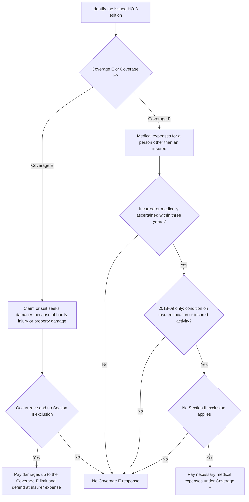

# Coverage E and F — Liability and Medical Payments

Coverage E and Coverage F belong to **Section II**, not Section I. Read them with the issued HO-3 edition, the Declarations, and any attached endorsements, but keep the analysis separate from property coverage rules such as settlement basis, deductibles, or Section I write-backs unless the form expressly says otherwise.

## Coverage E — Personal Liability

Coverage E responds when a claim is made or a suit is brought against an insured for damages because of bodily injury or property damage caused by an occurrence to which the coverage applies. The insurer’s promise is twofold: it pays, up to the applicable limit of liability, the damages for which an insured is legally liable, and it provides a defense at its expense.

That defense duty is part of the Coverage E grant itself. It is not a Section I property benefit and should be analyzed against the claim or suit, the occurrence definition, and the Section II exclusions.

The payment promise is capped by the limit of liability shown for Coverage E in the Declarations.

## Coverage F — Medical Payments to Others

Coverage F is a separate medical-expense promise. It pays the necessary medical expenses incurred or medically ascertained within three years from the date of an accident causing bodily injury to a person other than an insured.

In the 2018-09 form, Coverage F also requires that the bodily injury arise out of a condition on the insured location or be caused by the activities of an insured. That location-or-activity connection is edition-specific and should not be read into the earlier 2011-05 form.

## Section II exclusions that bound both coverages

### Business activities

Both supplied editions exclude Coverage E and Coverage F for bodily injury or property damage arising out of the business activities of an insured. The 2018-09 form adds a narrow exception for the occasional rental of the residence premises for fewer than 15 days in a policy year. That exception belongs to the Section II exclusion text; it is not a general rental coverage grant.

### Motor vehicle, watercraft, and aircraft

Both supplied editions exclude Coverage E and Coverage F for bodily injury or property damage arising out of the ownership, maintenance, or use of a motor vehicle, watercraft over 25 horsepower, or aircraft.

### Coverage E property damage to insured-owned or insured-rented property

The 2018-09 form adds a Coverage E-only exclusion for property damage to property owned by or rented to an insured. The earlier 2011-05 Section II exclusions end at the motor-vehicle/watercraft/aircraft exclusion.

## Reading sequence

A practical Section II review is:

1. Identify the issued HO-3 edition.
2. Decide whether the demand is for Coverage E or Coverage F.
3. Test the grant requirements for that coverage.
4. Apply the Section II exclusions that the issued form actually contains.
5. Use the Declarations for the applicable limit, and do not import Section I settlement or deductible rules into Section II unless the form expressly does so.

The diagram separates the liability-defense path from the medical-payments path and keeps the edition-specific Coverage F trigger in the right place. Motor-vehicle, watercraft, aircraft, and business-activity exclusions cut off both paths when they apply.
