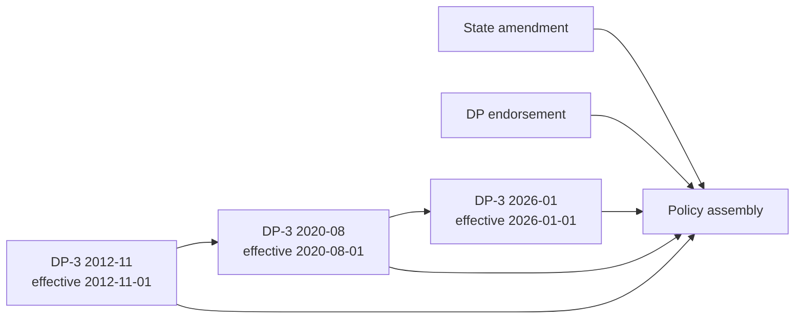
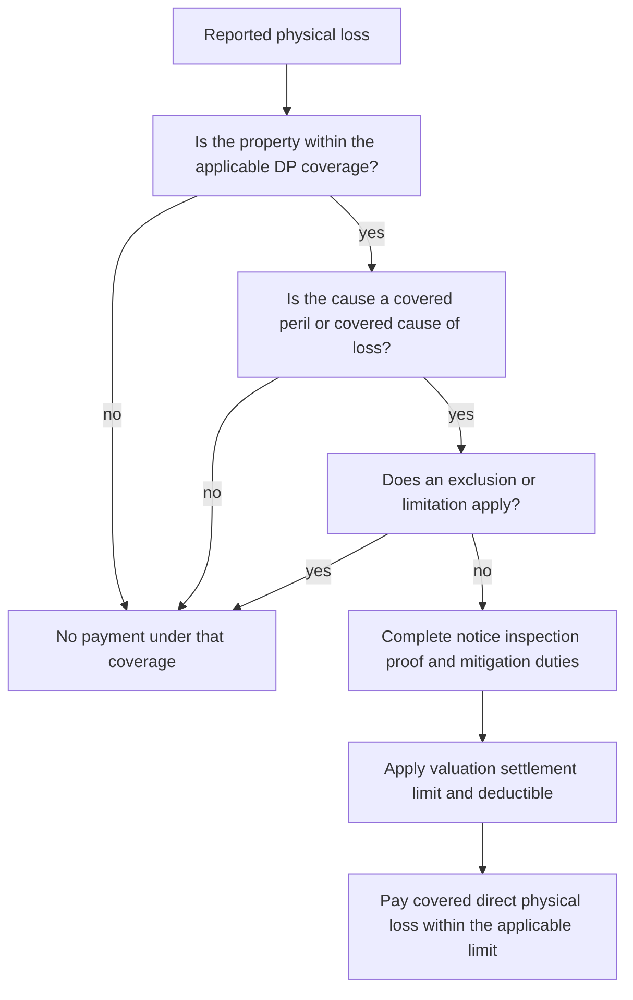

# DP-3 Dwelling Property Special Form Editions

## Scope and edition rule

This page documents the **DP-3 Dwelling Property 3 — Special Form**, not an HO form. A DP-3 policy must be read as the edition shown in the policy assembly, together with the declarations and attached endorsements and state amendments. The form supplies the base insurance; an endorsement can change a provision only within the endorsement's stated scope.

The editions form this chain:

*The diagram shows edition selection and attachment assembly; the effective edition is not silently replaced by a later form.* The 2012-11 form expressly says it is superseded by 2020-08 for policies effective on or after August 1, 2020, while remaining in force for policies written under it. The 2020-08 form similarly identifies 2026-01 as its successor for policies effective on or after January 1, 2026. ([2012-11, Agreement](repo://forms/DP/MS/DP-3/2012-11.md#L1-L9); [2020-08, Agreement](repo://forms/DP/MS/DP-3/2020-08.md#L1-L9))

The two filing memoranda are **interpretation** aids for the editions they explain, not contract language. They describe the filing rationale and drafting changes; the filed DP-3 form in the issued policy controls if a memorandum and form appear to differ. ([interpretation: DP-3 2020-08 filing memorandum](repo://memoranda/DP-3-2020-08.md#L13-L21); [interpretation: DP-3 2026-01 filing memorandum](repo://memoranda/DP-3-2026-01.md#L13-L43))

| Edition | Effective-date interval | Status | Operational reading |
|---|---|---|---|
| **2012-11** | 2012-11-01 through 2020-07-31 | Superseded | Keep applying it to policies effective in this interval and written under this edition. It uses open-peril building coverage, named perils for Coverage C, an 80% Coverage A replacement-cost threshold, and the smallest listed Coverage B, D, and additional-coverage limits. |
| **2020-08** | 2020-08-01 through 2025-12-31 | Superseded | Keep applying it to policies effective in this interval and written under this edition. It changes several limits and settlement rules, including a 90% Coverage A replacement-cost threshold, 25% fair-rental-value limit, and more detailed claim duties. |
| **2026-01** | 2026-01-01 onward | Current edition in this repository | Use for policies effective in this interval unless the policy assembly specifies otherwise. It returns Coverage A to an 80% replacement-cost threshold, raises Coverage B and Coverage D percentages, and materially expands the explicit Coverage C peril and exclusion structure. |

## How to read a DP-3 loss

The base decision is **covered property + direct physical loss + covered peril + no applicable exclusion or limitation**, followed by the coverage-specific limit, deductible, valuation, and claim duties. Building coverages generally use open-peril wording; Coverage C remains a named-peril grant in each edition. The 2012-11 form states that distinction expressly: A and B respond to an open peril, while C responds only to perils expressly described in the perils section. The 2020-08 and 2026-01 forms retain the same DP architecture while rewriting the lists and conditions. ([2012-11, perils](repo://forms/DP/MS/DP-3/2012-11.md#L603-L617); [2020-08, Coverages A–C](repo://forms/DP/MS/DP-3/2020-08.md#L107-L125); [2026-01, Coverage C](repo://forms/DP/MS/DP-3/2026-01.md#L199-L225))

*This flow summarizes the common decision order; its property, peril, exclusion, duty, and settlement branches are grounded in the cited DP-3 wording above and below; it does not replace an edition's wording or a state amendment. ([2012-11 conditions and settlement](repo://forms/DP/MS/DP-3/2012-11.md#L877-L977); [2020-08 perils and conditions](repo://forms/DP/MS/DP-3/2020-08.md#L613-L665); [2026-01 perils and settlement](repo://forms/DP/MS/DP-3/2026-01.md#L621-L675))*

## Coverage map and limits

The DP-3 coverage letters are stable across the three editions, but the grants, limits, and additional coverages are not interchangeable.

| Coverage | 2012-11 | 2020-08 | 2026-01 |
|---|---|---|---|
| **A — Dwelling** | Dwelling, attached structures, construction materials, alterations, fixtures and permanently installed equipment. Replacement cost when insurance is at least **80%** of pre-loss replacement cost. ([A](repo://forms/DP/MS/DP-3/2012-11.md#L69-L91); [settlement](repo://forms/DP/MS/DP-3/2012-11.md#L127-L145)) | Dwelling and attached components, materials, permanently installed equipment, additions, decks and similar connected structures. Replacement-cost eligibility requires **90%** of full replacement cost. ([A](repo://forms/DP/MS/DP-3/2020-08.md#L107-L125); [settlement](repo://forms/DP/MS/DP-3/2020-08.md#L139-L149)) | Dwelling, attached structures, materials, permanently installed fixtures/equipment, attached additions, glass, awnings and attached features. Replacement cost requires **80%**, repair or replacement as soon as reasonably possible, and actual-cash-value settlement otherwise. ([A](repo://forms/DP/MS/DP-3/2026-01.md#L71-L91); [settlement](repo://forms/DP/MS/DP-3/2026-01.md#L109-L127)) |
| **B — Other Structures** | Structures separated by clear space or connected only by fence, utility line, or similar connection; **10% of Coverage A**. Business and non-qualifying rental uses are excluded, with private-garage exceptions. ([B](repo://forms/DP/MS/DP-3/2012-11.md#L147-L179)) | Similar detached-structure grant and **10% of Coverage A**; the form adds agricultural, farming, and commercial-use restrictions. ([B](repo://forms/DP/MS/DP-3/2020-08.md#L183-L207)) | Similar detached-structure grant, construction materials, and financial-interest limitation; **15% of Coverage A**. Tenant rental and private-garage exceptions are stated expressly. ([B](repo://forms/DP/MS/DP-3/2026-01.md#L149-L181)) |
| **C — Personal Property** | Worldwide personal property of an insured, subject to the form's property exclusions; the scheduled limit is **0% of Coverage A**. ([C](repo://forms/DP/MS/DP-3/2012-11.md#L209-L221)) | Property at the residence premises or another location, including temporarily removed and newly acquired-residence property; the scheduled limit remains **0% of Coverage A**. ([C](repo://forms/DP/MS/DP-3/2020-08.md#L231-L251)) | Personal property usual or incidental to occupancy, at the residence premises or another covered location, including transported property; the scheduled limit remains **0% of Coverage A**. ([C](repo://forms/DP/MS/DP-3/2026-01.md#L199-L219)) |
| **D — Fair Rental Value** | Applies when a covered loss makes rented or held-for-rental space unfit; limit **20% of Coverage A**. ([D/E](repo://forms/DP/MS/DP-3/2012-11.md#L327-L345)) | Applies to the rented part while unfit and adds civil-authority access coverage; fair-rental-value limit **25% of Coverage A**. ([D/E](repo://forms/DP/MS/DP-3/2020-08.md#L395-L431); [limit](repo://forms/DP/MS/DP-3/2020-08.md#L453-L463)) | Applies to actual lost rent from a rented part made unfit; limit **30% of Coverage A**, with payment ending when the part is usable or rental activity is permanently relocated. ([D/E](repo://forms/DP/MS/DP-3/2026-01.md#L363-L385)) |
| **E — Additional Living Expense** | Necessary increase in household living expense while the residence is unfit, with mitigation, records, and no duplicate recovery. ([D/E](repo://forms/DP/MS/DP-3/2012-11.md#L347-L393)) | Necessary increase while the residence is unfit, including the separate civil-authority provision and a reasonable-repair/minimization framework. ([D/E](repo://forms/DP/MS/DP-3/2020-08.md#L413-L463)) | Necessary increase while the residence is unfit and the insured cannot reside there; temporary lodging and meals are examples, while voluntary relocation and avoidable delay are excluded. ([D/E](repo://forms/DP/MS/DP-3/2026-01.md#L387-L411)) |

### Coverage A settlement changes

All three editions distinguish **actual cash value (ACV)** from **replacement cost (RC)** and limit payment to the amount necessary to restore like-kind-and-quality property. The key edition changes are:

* **2012-11:** RC is available when the amount of insurance is at least 80% of pre-loss replacement cost. Payment is the least of the limit, replacement cost of the damaged part, and the amount actually and necessarily spent; ACV can be paid until repair or replacement. ([2012-11](repo://forms/DP/MS/DP-3/2012-11.md#L127-L145))
* **2020-08:** the threshold rises to 90%; the form expressly disallows consequential loss, delay, loss of use, and loss of income under Coverage A. ([2020-08](repo://forms/DP/MS/DP-3/2020-08.md#L139-L149); [A.36](repo://forms/DP/MS/DP-3/2020-08.md#L169-L181))
* **2026-01:** the threshold returns to 80%, but RC also requires reasonably prompt repair or replacement. If the RC conditions are not met, the form settles at ACV; roof surfacing is RC unless an actual-cash-value roof schedule endorsement is attached. ([2026-01](repo://forms/DP/MS/DP-3/2026-01.md#L109-L127))

The 2026 form's roof-surfacing rule is a DP-3 provision, not an HO rule: it is in Coverage A and points to a roof-schedule endorsement only as the mechanism that can change the stated settlement. A state attachment can further modify it; for example, the **Florida DP 01 09** endorsement values covered roof damage on an actual-cash-value basis when the roof is at least ten years old, unless another policy provision provides broader settlement. ([2026-01, A.21–A.25](repo://forms/DP/MS/DP-3/2026-01.md#L109-L125); [Florida T.8–T.9](repo://forms/DP/FL/DP-01-09/2021-03.md#L587-L609))

## Perils and recurring exclusions

### Coverage A and B

For building property, the DP-3 grants broad direct-physical-loss coverage subject to exclusions. Across editions, the exclusions consistently remove land, earth movement, flood and surface water, water below ground, sewer or drain backup absent an applicable endorsement or provision, ordinance-or-law costs unless specifically provided, governmental action, war and nuclear hazard, neglect, intentional loss, faulty work, wear and deterioration, and gradual seepage or leakage. They preserve ensuing or resulting direct physical loss only when the form says the resulting loss is separately covered.

The wording becomes more explicit over time:

* **2012-11** puts many building exclusions directly in Coverage A and the open-peril section, including earth movement, flood/surface water, below-ground water, power failure away from the premises, and weather entering without prior covered building damage. ([2012-11, A](repo://forms/DP/MS/DP-3/2012-11.md#L93-L117); [perils](repo://forms/DP/MS/DP-3/2012-11.md#L603-L645))
* **2020-08** adds or consolidates pollutants, governmental-action, utility-failure, freezing, power-surge, fungi/bacteria/virus, and water-backup exclusions, while retaining ensuing-loss wording for otherwise covered damage. ([2020-08, A](repo://forms/DP/MS/DP-3/2020-08.md#L127-L167); [Coverage C exclusions](repo://forms/DP/MS/DP-3/2020-08.md#L277-L317))
* **2026-01** separates a detailed peril schedule from the exclusions and expressly lists named property perils for Coverage C, including fire/lightning, wind/hail, explosion, riot, aircraft, vehicles, smoke, vandalism, theft, volcanic eruption, falling objects, weight of ice/snow/sleet, accidental system discharge, freezing, and artificially generated electrical current. ([2026-01, Coverage C perils](repo://forms/DP/MS/DP-3/2026-01.md#L219-L255))

Important recurring boundaries are:

* **Water:** flood, surface water, tidal water, overflow of a body of water, spray, below-ground water, and sewer/drain/sump backup are not ordinary DP-3 coverage. Sudden accidental discharge from an eligible plumbing, heating, air-conditioning, sprinkler, or household-appliance system is treated separately, and the failed system or appliance itself is generally not covered. ([2026-01, C.23–C.30](repo://forms/DP/MS/DP-3/2026-01.md#L239-L261); [2020-08, C.36–C.42](repo://forms/DP/MS/DP-3/2020-08.md#L301-L317))
* **Weather entry:** rain, snow, sleet, sand, or dust entering the interior requires a covered peril to damage the building and create an opening. This is not a general water-damage grant. ([2026-01](repo://forms/DP/MS/DP-3/2026-01.md#L221-L225); [2020-08](repo://forms/DP/MS/DP-3/2020-08.md#L151-L159))
* **Faulty work and wear:** the defective work, material, maintenance, deterioration, or mechanical failure is excluded; a separate ensuing direct physical loss can remain covered when the edition's peril wording permits it. ([2026-01](repo://forms/DP/MS/DP-3/2026-01.md#L95-L99); [2020-08](repo://forms/DP/MS/DP-3/2020-08.md#L127-L137))
* **Vacancy and theft/vandalism:** vacancy affects freezing and vandalism or malicious mischief, and theft restrictions apply to construction, rented portions, entrusted property, and insured-caused theft. The exact vacancy period or trigger is edition-specific; do not carry a later period backward. ([2012-11](repo://forms/DP/MS/DP-3/2012-11.md#L801-L827); [2020-08](repo://forms/DP/MS/DP-3/2020-08.md#L815-L853); [2026-01](repo://forms/DP/MS/DP-3/2026-01.md#L687-L707))
* **Coverage C is not open peril:** even where building coverage responds to an open peril, personal property needs one of the named perils in the applicable edition. ([2012-11](repo://forms/DP/MS/DP-3/2012-11.md#L603-L613); [2026-01](repo://forms/DP/MS/DP-3/2026-01.md#L219-L255))

### Additional Coverages E

Coverage E changes substantially and is a frequent source of edition mistakes.

* **2012-11** includes debris and ash removal, tree removal, temporary reasonable repairs, trees/shrubs/plants at 5% of Coverage A with a $500 per-item cap, a $500 fire-department service charge, removed-property coverage, collapse, glass, landlord's furnishings, ordinance-or-law costs at 10% of Coverage A, and grave markers. ([2012-11, E](repo://forms/DP/MS/DP-3/2012-11.md#L397-L415); [additional coverages](repo://forms/DP/MS/DP-3/2012-11.md#L423-L463); [later E provisions](repo://forms/DP/MS/DP-3/2012-11.md#L467-L601))
* **2020-08** raises the extra debris-removal amount to 10% when the direct loss plus debris reaches the applicable limit; trees, shrubs, plants, and lawns are subject to a 10% aggregate and $750 per-item limit; and the fire-department charge is $750. It also includes removed property, collapse, glass, rental-dwelling furnishings, and ordinance-or-law coverage at 15% of Coverage A. ([2020-08, E](repo://forms/DP/MS/DP-3/2020-08.md#L465-L499); [E limits and settlement](repo://forms/DP/MS/DP-3/2020-08.md#L496-L599))
* **2026-01** raises the extra debris-removal amount to 15%, provides trees/shrubs/plants at 10% of Coverage A with a $1,000 per-item cap, and provides a $1,000 fire-department service charge. It adds or expressly details removed-property coverage, credit-card/access-device loss, grave markers, and collapse, while retaining ordinance-or-law, reasonable-repair, and vegetation provisions. ([2026-01, E](repo://forms/DP/MS/DP-3/2026-01.md#L413-L499); [additional E provisions](repo://forms/DP/MS/DP-3/2026-01.md#L419-L493))

These are limits or grants of the stated DP-3 edition. A water-backup endorsement, a state amendment, or a policy-specific schedule can change the result; Coverage E must not be used to infer a general HO additional-coverage package.

## Conditions, claim handling, and settlement control

The forms require prompt notice, protection from further damage, preservation and inspection of damaged property, records and inventories, cooperation, examination under oath when requested, proof of loss, and preservation of recovery rights. They also use appraisal for **amount of loss**, not automatically for coverage, causation, or interpretation. The edition controls deadlines and payment mechanics:

| Edition | Claim and proof mechanics | Settlement controls |
|---|---|---|
| **2012-11** | Prompt notice, law-enforcement notice for theft, repair-expense records, inspection, inventory, documents, and a signed sworn proof of loss within **60 days after request**. Appraisal selects appraisers within **20 days**; appraisal determines amount of loss. ([conditions](repo://forms/DP/MS/DP-3/2012-11.md#L877-L977)) | Deductible is at least **$500**; payment is within **60 days** after agreement, final judgment, or appraisal award; other insurance is pro rata. ([2012-11 settlement conditions](repo://forms/DP/MS/DP-3/2012-11.md#L947-L977); [payment](repo://forms/DP/MS/DP-3/2012-11.md#L1007-L1025)) |
| **2020-08** | Temporary repairs and preservation are mandatory when needed; permanent repair can wait for inspection when reasonably necessary. The minimum Section I deductible is **$1,000**; proof of loss is due within **90 days after request**; appraisal appraisers are selected within **30 days**. ([conditions](repo://forms/DP/MS/DP-3/2020-08.md#L896-L997)) | Payment is within **45 days** after agreement on amount; appraisal remains limited to amount of loss. The form adds detailed other-insurance, salvage, repair-election, and mortgage-interest mechanics. ([2020-08](repo://forms/DP/MS/DP-3/2020-08.md#L999-L1019)) |
| **2026-01** | The minimum deductible is **$1,500**; the form applies the most specific deductible and normally not more than one to the same loss. Proof of loss is due within **60 days after request**; appraisal appraisers are selected within **20 days**. ([conditions](repo://forms/DP/MS/DP-3/2026-01.md#L885-L949)) | Payment is within **30 days** after agreement or a final appraisal award. Appraisal expressly does not decide coverage, policy interpretation, compliance, cause, or liability. ([2026-01](repo://forms/DP/MS/DP-3/2026-01.md#L937-L979)) |

The 2026 edition also adds a material-prejudice failure rule: it may deny a loss only to the extent a required duty failure is material to the loss or claim. ([2026-01, AGR and settlement](repo://forms/DP/MS/DP-3/2026-01.md#L25-L39); [A–C duties](repo://forms/DP/MS/DP-3/2026-01.md#L309-L361)) This should not be substituted for the 2012 or 2020 wording, which has different concealment, cooperation, deductible, appraisal, and payment provisions.

## DP-specific endorsement: DP 04 95 Water Backup

**DP 04 95 Water Backup — Dwelling Property (2021-05)** is an endorsement, not a change to every DP-3 policy. When attached, it modifies the policy and controls over conflicting base-form language; otherwise the DP-3 sewer, drain, sump, flood, surface-water, and below-ground-water exclusions remain in force. ([endorsement attachment](repo://forms/DP/MS/DP-04-95/2021-05.md#L13-L39); [base exclusion in 2020-08](repo://forms/DP/MS/DP-3/2020-08.md#L301-L317))

The endorsement provides direct physical loss caused by water or waterborne material backing up through a sewer or drain, or overflowing/discharging from a sump, sump pump, or related equipment. It does not pay to repair the failed sewer, drain, sump, pump, or related equipment, and it retains exclusions for flood, surface water, below-ground water, gradual seepage, pollutants, fungi/mold, neglect, and faulty work. ([DP 04 95 W.1](repo://forms/DP/MS/DP-04-95/2021-05.md#L41-L85))

Its stated limit is **$5,000** for all covered water-backup or sump-overflow loss, and its stated deductible is **$1,000 per covered water-backup loss**, applied once to the covered loss rather than once per item. The endorsement also requires a 30-day loss-reporting condition and a signed, sworn proof of loss when required under its conditions. ([limits](repo://forms/DP/MS/DP-04-95/2021-05.md#L113-L143); [deductible](repo://forms/DP/MS/DP-04-95/2021-05.md#L175-L215); [conditions](repo://forms/DP/MS/DP-04-95/2021-05.md#L339-L369))

## State overlays

A state amendment is an **overlay in the policy assembly**. It does not turn DP-3 into an HO form and it does not silently rewrite an edition outside the provision it expressly changes. Apply the attached state endorsement first when it conflicts with the base form, then apply the remaining DP-3 provisions.

### Florida — DP 01 09 (2021-03)

The Florida endorsement applies to the attached policy and controls a conflict, while leaving unaffected policy language in force. ([Florida scope and precedence](repo://forms/DP/FL/DP-01-09/2021-03.md#L13-L57)) Its principal DP-3 overlays are:

* **Windstorm and hail deductible:** it imposes a selected deductible of at least **2% and no more than 10%**, applied to the total covered loss from the same occurrence and separately from other deductibles. Read this state provision with the attached DP-3 edition; it is not a new peril grant. ([Florida T.1](repo://forms/DP/FL/DP-01-09/2021-03.md#L59-L79))
* **Notice of deductible change:** an increase in the windstorm deductible requires at least **45 days' notice** before its effective date. This changes deductible-change administration, not the amount of covered property or the wind/hail peril. ([Florida T.2](repo://forms/DP/FL/DP-01-09/2021-03.md#L169-L187))
* **Named Storm Period:** it begins when the official designation takes effect and ends **72 hours after** the designation ends. The overlay changes how claim timing and storm-period facts are evaluated; it does not make excluded flood or surface water covered. ([Florida T.3](repo://forms/DP/FL/DP-01-09/2021-03.md#L237-L283))
* **Roof settlement and seacoast duties:** for covered roof damage, the endorsement uses actual cash value when the roof is at least **10 years** old unless another policy provision is broader; it also imposes maintenance and protective duties for covered property in a Seacoast Territory. ([Florida T.8–T.9](repo://forms/DP/FL/DP-01-09/2021-03.md#L587-L609); [Florida T.6](repo://forms/DP/FL/DP-01-09/2021-03.md#L509-L543))
* **Cancellation/nonrenewal and claims handling:** the endorsement supplies Florida notice periods and claim deadlines, including 10 days for nonpayment cancellation, 45 days for other permitted cancellation, 120 days for nonrenewal, acknowledgment within 14 days, decision within 90 business days after requested items, and payment within 20 business days after acceptance. These provisions modify the corresponding policy administration and conditions. ([Florida cancellation](repo://forms/DP/FL/DP-01-09/2021-03.md#L285-L345); [Florida claims handling](repo://forms/DP/FL/DP-01-09/2021-03.md#L407-L467))

### Texas — DP 01 45 (2022-01)

The Texas endorsement applies to Texas property and losses subject to Texas law, expressly amends only provisions it identifies, and controls conflicts. ([Texas scope and precedence](repo://forms/DP/TX/DP-01-45/2022-01.md#L13-L59)) Its principal DP-3 overlays are:

* **Windstorm or hail deductible:** it imposes a separate deductible of at least **1% and no more than 5%**, applied before payment to covered direct physical loss. It does not create coverage for otherwise excluded wind or hail loss. ([Texas T.1](repo://forms/DP/TX/DP-01-45/2022-01.md#L61-L89))
* **Notice of deductible change:** a windstorm-deductible increase requires at least **30 days' written notice**. The deductible in effect when the covered loss occurs controls. ([Texas T.2](repo://forms/DP/TX/DP-01-45/2022-01.md#L215-L265))
* **Named Storm Period:** the period begins at official designation and continues until **72 hours after** the designation ends. The overlay changes storm-period timing and evidence handling; it does not override base-form flood, surface-water, or other exclusions. ([Texas T.3](repo://forms/DP/TX/DP-01-45/2022-01.md#L281-L329))
* **Cancellation/nonrenewal and claims handling:** Texas supplies 10 days for nonpayment cancellation, 30 days for other permitted cancellation, 30 days for nonrenewal, acknowledgment no later than 15 days, a decision within 15 business days after requested items, and payment within five business days after acceptance. Those are state-overlay changes to the corresponding policy administration. ([Texas cancellation](repo://forms/DP/TX/DP-01-45/2022-01.md#L331-L399); [Texas nonrenewal](repo://forms/DP/TX/DP-01-45/2022-01.md#L449-L459); [Texas claims handling](repo://forms/DP/TX/DP-01-45/2022-01.md#L495-L587))

## Edition-safe implementation checklist

1. Identify the edition and effective date from the policy assembly; do not replace 2012-11 or 2020-08 with 2026-01 merely because the later form is available.
2. Read the declarations for Coverage A and the actual scheduled limits. The percentages above describe the form's stated limits, not a promise that every declarations page uses the maximum or that a state overlay has not changed it.
3. Determine whether the loss is to A, B, C, D, or an E additional coverage. A building open-peril grant does not make Coverage C open peril, and Coverage C's listed limit is 0% in all three supplied editions.
4. Apply the applicable edition's peril wording, then exclusions, then any attached DP endorsement and state overlay that expressly modifies the provision. For sewer/drain/sump backup, check DP 04 95 before denying, but only if it is attached.
5. Apply the edition-specific valuation threshold, deductible, proof-of-loss and appraisal deadlines, and payment rule. A later edition's limit or deadline is not retroactive.
6. Record the exact state amendment provision and the DP-3 provision it modifies. Florida and Texas deductible, named-storm, cancellation, and claims rules—and Florida's roof rule—are overlays, not general DP-3 text.

## Source set

* [DP-3 2012-11](repo://forms/DP/MS/DP-3/2012-11.md)
* [DP-3 2020-08](repo://forms/DP/MS/DP-3/2020-08.md)
* [DP-3 2026-01](repo://forms/DP/MS/DP-3/2026-01.md)
* [Interpretation: DP-3 2020-08 filing memorandum](repo://memoranda/DP-3-2020-08.md)
* [Interpretation: DP-3 2026-01 filing memorandum](repo://memoranda/DP-3-2026-01.md)
* [DP 04 95 Water Backup — Dwelling Property](repo://forms/DP/MS/DP-04-95/2021-05.md)
* [DP 01 09 Florida Amendatory Endorsement](repo://forms/DP/FL/DP-01-09/2021-03.md)
* [DP 01 45 Texas Amendatory Endorsement](repo://forms/DP/TX/DP-01-45/2022-01.md)
