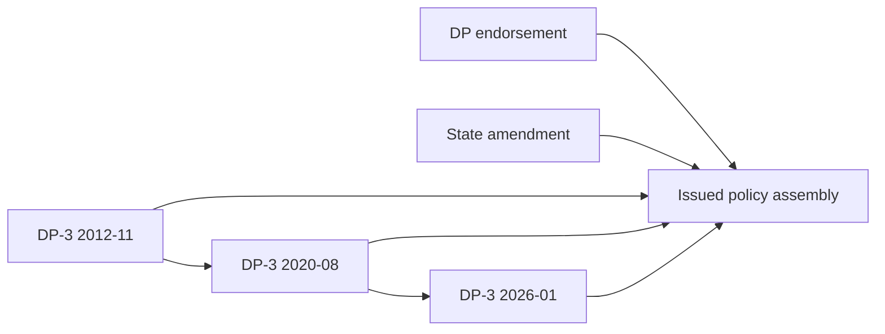
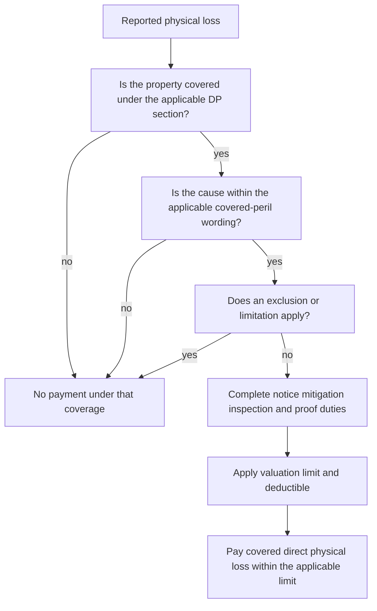

# DP-3 Dwelling Property Special Form Editions

## Scope and edition rule

This page documents the **DP-3 Dwelling Property 3 — Special Form**, not an HO form. Read an issued DP-3 as the edition identified in the policy assembly, together with its declarations, attached endorsements, and state amendments. A memorandum explains filing intent; it is not contract language. If a memorandum and the issued form differ, the issued form controls. ([2020-08 memorandum](repo://memoranda/DP-3-2020-08.md#L14-L21); [2026-01 memorandum](repo://memoranda/DP-3-2026-01.md#L204-L207))

The editions form a supersession chain:

*The diagram shows edition selection and policy assembly; a later edition does not silently replace an earlier issued edition.*

| Edition | Effective-date interval | Status | Edition-safe reading |
|---|---|---|---|
| **2012-11** | 2012-11-01 through 2020-07-31 | Superseded | Continue applying it to policies written under this edition. It has open-peril building wording, a named-peril personal-property structure, an 80% Coverage A threshold, and lower listed limits. |
| **2020-08** | 2020-08-01 through 2025-12-31 | Superseded | Continue applying it to policies written under this edition. It raises the Coverage A threshold to 90%, raises Coverage D to 25%, and expands claim and additional-coverage wording. |
| **2026-01** | 2026-01 onward | Current edition in this repository | Use for policies effective in this interval unless the policy assembly says otherwise. It returns Coverage A to 80%, raises Coverage B and D, and reorganizes the peril, roof, water, and claim provisions. |

The 2020 filing memorandum describes changes chiefly as clarification and coordination of definitions, coverages, limits, deductibles, post-loss duties, exclusions, and resulting-loss language. The 2026 memorandum says the overall dwelling-policy structure is retained while terminology, organization, conditions, exclusions, and coverage provisions are clarified. These memoranda explain why wording moved or became more explicit; they do not create coverage. ([2020 memorandum, summary](repo://memoranda/DP-3-2020-08.md#L14-L21); [2020 memorandum, coverage changes](repo://memoranda/DP-3-2020-08.md#L300-L323); [2026 memorandum, summary](repo://memoranda/DP-3-2026-01.md#L196-L207))

### What the filing memoranda add

The memoranda are useful change logs, not substitute policy language. The **2020-08** memorandum records a **3% filed rate change** and separates that rating action from the form wording; the operative edition nevertheless changes important administration points, including the 90% Coverage A threshold, 25% Coverage D limit, $1,000 minimum deductible, 90-day proof-of-loss deadline, and 45-day payment period. ([2020 rate impact](repo://memoranda/DP-3-2020-08.md#L1698-L1713); [2020-08 Coverage A and D](repo://forms/DP/MS/DP-3/2020-08.md#L151-L158); [2020-08 claim conditions](repo://forms/DP/MS/DP-3/2020-08.md#L1840-L1887); [2020-08 payment](repo://forms/DP/MS/DP-3/2020-08.md#L2009-L2015))

The **2026-01** memorandum records a **7% filed rate change**, expressly distinguishing rating action from the form revision. Its substantive change explanations track the revised treatment of gradual deterioration, corrosion, mold, pollution, seepage, backup, flood, earth movement, faulty work and ensuing loss, collapse, mitigation duties, deductibles, appraisal, and payment. The issued form—not the memorandum—controls those results. ([2026 structure and scope](repo://memoranda/DP-3-2026-01.md#L196-L207); [2026 exclusion changes](repo://memoranda/DP-3-2026-01.md#L860-L949); [2026 rate impact](repo://memoranda/DP-3-2026-01.md#L1727-L1757); [2026 claim changes](repo://memoranda/DP-3-2026-01.md#L1086-L1175))

## How to read a DP-3 loss

The operational sequence is **covered property → direct physical loss → applicable covered peril → exclusions and limitations → coverage limit and deductible → valuation and claim conditions**. Building coverage is broad direct-physical-loss coverage subject to exclusions; personal property is subject to the edition's covered-peril schedule. The 2012 form states the distinction expressly: Coverage A and B respond to an open peril, while Coverage C responds only when a peril is expressly described. The 2020 and 2026 forms preserve the same practical separation through their Coverage A/B grants and peril schedules. ([2012-11 perils](repo://forms/DP/MS/DP-3/2012-11.md#L1297-L1316); [2020-08 perils](repo://forms/DP/MS/DP-3/2020-08.md#L1213-L1231); [2026-01 perils](repo://forms/DP/MS/DP-3/2026-01.md#L1225-L1240))

*This is a decision aid, not a replacement for the applicable edition, declarations, endorsement, or state amendment.*

## Coverage map and limits

| Coverage | 2012-11 | 2020-08 | 2026-01 |
|---|---|---|---|
| **A — Dwelling** | Dwelling and attached property, fixtures, equipment, and construction materials. Replacement cost requires insurance of at least **80%** of pre-loss replacement cost. ([A](repo://forms/DP/MS/DP-3/2012-11.md#L183-L201)) | Dwelling, attached structures, fixtures, equipment, and construction materials. Replacement-cost eligibility requires **90%** of replacement cost. ([A](repo://forms/DP/MS/DP-3/2020-08.md#L151-L168)) | The form states that the most payable under Coverage A is **80%** and separately settles roof surfacing on an ACV basis; use the issued form's complete settlement provisions rather than importing the earlier editions' threshold language. ([A](repo://forms/DP/MS/DP-3/2026-01.md#L154-L166)) |
| **B — Other Structures** | Detached or qualifying separately connected structures; **10% of Coverage A**. ([B](repo://forms/DP/MS/DP-3/2012-11.md#L313-L323)) | Qualifying detached structures; **10% of Coverage A**. ([B](repo://forms/DP/MS/DP-3/2020-08.md#L298-L308)) | Qualifying other structures and certain construction materials; **15% of Coverage A**, limited to the insured's interest. ([B](repo://forms/DP/MS/DP-3/2026-01.md#L291-L316); [interest](repo://forms/DP/MS/DP-3/2026-01.md#L383-L390)) |
| **C — Personal Property** | The scheduled limit is **0% of Coverage A**; property at the premises, temporarily away, in a newly acquired residence, in a rented private residence, and in storage is addressed by the form. ([C](repo://forms/DP/MS/DP-3/2012-11.md#L472-L504)) | The scheduled limit is **0% of Coverage A**; the form expressly addresses away-from-premises, newly acquired, storage, moving, and carrier/service-provider locations. ([C](repo://forms/DP/MS/DP-3/2020-08.md#L458-L515)) | The scheduled limit is **0% of Coverage A**; the form addresses property at or away from the premises, newly acquired property, transported property, storage, and other specified locations. ([C](repo://forms/DP/MS/DP-3/2026-01.md#L410-L426); [transport and removal](repo://forms/DP/MS/DP-3/2026-01.md#L449-L465)) |
| **D — Fair Rental Value** | Covered loss making rented or held-for-rental space uninhabitable; **20% of Coverage A**. ([D](repo://forms/DP/MS/DP-3/2012-11.md#L766-L785)) | Covered loss making rented space untenantable; **25% of Coverage A**, with payment limited to actual lost rental value. ([D](repo://forms/DP/MS/DP-3/2020-08.md#L630-L652)) | Covered loss making a residential rented part unfit for normal use; **30% of Coverage A**, limited to actual lost rental value and the reasonable restoration period. ([D](repo://forms/DP/MS/DP-3/2026-01.md#L696-L737)) |
| **E — Additional Living Expense and additional coverages** | Necessary increase in household living expenses, plus the edition's debris, vegetation, fire-department, removed-property, collapse, glass, ordinance-or-law, and other grants. ([D/E](repo://forms/DP/MS/DP-3/2012-11.md#L787-L825); [E limits](repo://forms/DP/MS/DP-3/2012-11.md#L919-L1000)) | Necessary increase in household living expenses, plus expanded debris, vegetation, fire-department, removed-property, collapse, glass, and ordinance-or-law provisions. ([D/E](repo://forms/DP/MS/DP-3/2020-08.md#L688-L754); [E limits](repo://forms/DP/MS/DP-3/2020-08.md#L774-L802)) | Necessary increase in household living expenses when the premises is unfit, plus detailed mitigation, removal, drying, repair, vegetation, fire-department, and ordinance-or-law provisions. ([D/E](repo://forms/DP/MS/DP-3/2026-01.md#L739-L805); [E limits](repo://forms/DP/MS/DP-3/2026-01.md#L836-L896)) |

### Coverage A settlement changes

* **2012-11:** replacement cost is available at the 80% threshold; the form pays like kind and quality subject to the applicable limit and replacement-cost terms. ([2012-11](repo://forms/DP/MS/DP-3/2012-11.md#L183-L196))
* **2020-08:** the threshold rises to 90% of replacement cost. ([2020-08](repo://forms/DP/MS/DP-3/2020-08.md#L151-L158))
* **2026-01:** Coverage A states that the most payable is 80% and separately settles roof surfacing on an ACV basis. The supplied 2026 Coverage A wording should be applied as written rather than assuming the 2012 or 2020 threshold and fallback rules. ([2026-01](repo://forms/DP/MS/DP-3/2026-01.md#L154-L166))

A state attachment can further modify settlement. For example, Florida DP 01 09 applies ACV to covered roof damage when the roof is at least ten years old unless another policy provision is broader. ([Florida roof provision](repo://forms/DP/FL/DP-01-09/2021-03.md#L587-L609))

## Perils and recurring exclusions

Across the editions, ordinary DP-3 treatment excludes flood and surface water, water below ground, sewer or drain backup without applicable coverage, earth movement, ordinance-or-law costs unless provided, gradual seepage or leakage, faulty work, deterioration, and other listed causes. Resulting or ensuing direct physical loss remains covered only where the applicable edition says so. ([2012-11](repo://forms/DP/MS/DP-3/2012-11.md#L1322-L1386); [2020-08](repo://forms/DP/MS/DP-3/2020-08.md#L1283-L1308); [2026-01](repo://forms/DP/MS/DP-3/2026-01.md#L1270-L1304))

Important boundaries are:

* **Water:** flood, surface water, tidal water, overflow of a body of water, below-ground water, and sewer, drain, or sump backup are excluded in the base forms. Sudden accidental discharge from an eligible plumbing, heating, air-conditioning, sprinkler, or household-appliance system is treated separately; the failed system itself is generally not covered. ([2020-08](repo://forms/DP/MS/DP-3/2020-08.md#L1283-L1289); [2026-01](repo://forms/DP/MS/DP-3/2026-01.md#L1274-L1282); [system discharge](repo://forms/DP/MS/DP-3/2026-01.md#L1342-L1353))
* **Weather entry:** rain, snow, sleet, sand, or dust entering a building requires prior covered damage that creates an opening. ([2020-08](repo://forms/DP/MS/DP-3/2020-08.md#L1419-L1421); [2026-01](repo://forms/DP/MS/DP-3/2026-01.md#L1296-L1299))
* **Faulty work and wear:** the defective work, material, deterioration, or mechanical failure is excluded; a separate ensuing direct physical loss can remain covered when the edition's peril wording permits it. ([2020-08](repo://forms/DP/MS/DP-3/2020-08.md#L1300-L1308); [2026-01](repo://forms/DP/MS/DP-3/2026-01.md#L1261-L1268))
* **Vacancy:** vacancy affects freezing and vandalism or malicious mischief, and theft restrictions apply to construction and rented portions. Do not carry a vacancy period or trigger from one edition into another. ([2020-08](repo://forms/DP/MS/DP-3/2020-08.md#L1382-L1397); [2026-01](repo://forms/DP/MS/DP-3/2026-01.md#L1301-L1312))
* **Coverage C:** the 2012 form expressly requires a peril described in the peril section; the 2020 and 2026 forms likewise require a covered peril under their respective schedules. The enumerated 2026 schedule includes fire or lightning, windstorm or hail, explosion, riot or civil commotion, aircraft, vehicles, smoke, vandalism or malicious mischief, falling objects, weight of ice, snow or sleet, accidental system discharge, freezing, and artificially generated electrical current. ([2012-11 C-peril rule](repo://forms/DP/MS/DP-3/2012-11.md#L1302-L1316); [2020-08 schedule](repo://forms/DP/MS/DP-3/2020-08.md#L1237-L1281); [2026-01 schedule](repo://forms/DP/MS/DP-3/2026-01.md#L1355-L1392))

### Additional Coverages E

The monetary changes are material and must be read edition by edition:

* **2012-11:** extra debris removal is **5%** of the direct physical loss amount; trees, shrubs, and plants are **5% of Coverage A** with a **$500** per-item cap; fire-department service charges are **$500**. ([2012-11 E](repo://forms/DP/MS/DP-3/2012-11.md#L919-L1000))
* **2020-08:** extra debris removal is **10%**; trees, shrubs, and plants are **10%** in the aggregate with a **$750** per-item cap; fire-department service charges are **$750**. ([2020-08 E](repo://forms/DP/MS/DP-3/2020-08.md#L774-L802); [vegetation and service](repo://forms/DP/MS/DP-3/2020-08.md#L878-L936))
* **2026-01:** extra debris removal is **15%**; trees, shrubs, and plants are **10%** with a **$1,000** per-item cap; fire-department service charges are **$1,000**. The form also details temporary removal, water mitigation, emergency repairs, and ordinance-or-law coverage. ([2026-01 E](repo://forms/DP/MS/DP-3/2026-01.md#L848-L896); [mitigation](repo://forms/DP/MS/DP-3/2026-01.md#L904-L999); [ordinance or law](repo://forms/DP/MS/DP-3/2026-01.md#L1171-L1206))

## Conditions, claim handling, and settlement control

All editions require prompt notice, mitigation, preservation and inspection of damaged property, records or inventories, cooperation, proof of loss, and preservation of recovery rights. Appraisal determines the amount of loss rather than coverage, causation, policy interpretation, or legal issues. Deadlines and payment mechanics remain edition-specific:

| Edition | Claim and proof mechanics | Settlement controls |
|---|---|---|
| **2012-11** | Signed sworn proof of loss within **60 days after request**; appraiser selection within **20 days**. ([2012-11](repo://forms/DP/MS/DP-3/2012-11.md#L1947-L1961); [appraisal](repo://forms/DP/MS/DP-3/2012-11.md#L2045-L2063)) | Minimum deductible **$500**; payment within **60 days** after agreement, final judgment, or appraisal award. ([deductible](repo://forms/DP/MS/DP-3/2012-11.md#L2006-L2016); [payment](repo://forms/DP/MS/DP-3/2012-11.md#L2139-L2149)) |
| **2020-08** | Minimum deductible **$1,000**; signed sworn proof within **90 days after request**; appraiser selection within **30 days**. ([conditions](repo://forms/DP/MS/DP-3/2020-08.md#L1840-L1887); [appraisal](repo://forms/DP/MS/DP-3/2020-08.md#L1975-L1996)) | Payment within **45 days** after agreement on amount; appraisal remains limited to amount of loss. ([payment](repo://forms/DP/MS/DP-3/2020-08.md#L2009-L2015)) |
| **2026-01** | Minimum applicable deductible **$1,500**; signed sworn proof within **60 days after request**; appraiser selection within **20 days**. ([conditions](repo://forms/DP/MS/DP-3/2026-01.md#L1711-L1779); [deductible and appraisal](repo://forms/DP/MS/DP-3/2026-01.md#L1796-L1807); [appraisal](repo://forms/DP/MS/DP-3/2026-01.md#L1873-L1899)) | Payment within **30 days** after agreement or a final appraisal award. ([2026-01 payment](repo://forms/DP/MS/DP-3/2026-01.md#L1901-L1907)) |

The 2020 form expressly declines denial for an immaterial omission or error that does not prejudice the insurer's rights; the 2026 form likewise makes prejudice material to several duty-based claim effects. Do not back-apply those later formulations to an earlier policy without checking its own wording. ([2020-08](repo://forms/DP/MS/DP-3/2020-08.md#L1943-L1956); [2026-01](repo://forms/DP/MS/DP-3/2026-01.md#L1825-L1844))

## DP-specific endorsement: DP 04 95 Water Backup

**DP 04 95 Water Backup — Dwelling Property (2021-05)** is optional. It modifies the policy only while attached, controls conflicting base-form language, and leaves unaffected policy provisions in force. Without it, the base-form sewer, drain, sump, flood, surface-water, and below-ground-water exclusions apply. ([attachment and precedence](repo://forms/DP/MS/DP-04-95/2021-05.md#L13-L39); [base water exclusions](repo://forms/DP/MS/DP-3/2020-08.md#L1283-L1289))

When attached, it covers direct physical loss from water or waterborne material backing up through a sewer or drain, or overflowing or discharging from a sump, sump pump, or related equipment. It does not pay to repair the failed sewer, drain, sump, pump, or related equipment and retains exclusions for flood, surface water, below-ground water, gradual seepage, pollutants, fungi or mold, neglect, and faulty work. ([coverage and exclusions](repo://forms/DP/MS/DP-04-95/2021-05.md#L41-L85)) The aggregate limit is **$5,000** and the water-backup deductible is **$1,000**, applied to the covered water-backup loss. ([limit](repo://forms/DP/MS/DP-04-95/2021-05.md#L113-L143); [deductible](repo://forms/DP/MS/DP-04-95/2021-05.md#L179-L199))

## State overlays

A state amendment is an overlay in the policy assembly. Apply an attached state endorsement when it conflicts with the base form, then apply the remaining DP-3 provisions. It does not turn DP-3 into an HO form or silently rewrite provisions outside its stated scope. A DP endorsement or state amendatory form is contract language only within its stated terms and only when issued and attached; unchanged base-form terms remain applicable. A regulator bulletin may constrain disclosure or administration but does not itself create a deductible or coverage term, while a manual, training page, or filing memorandum supplies internal or explanatory guidance rather than modifying the policy. ([repository document families](repo://README.md#L15-L22); [guidance versus contract](repo://training/guidance-versus-contract.md#L15-L23); [DP 04 95 attachment](repo://forms/DP/MS/DP-04-95/2021-05.md#L13-L39); [Florida attachment](repo://forms/DP/FL/DP-01-09/2021-03.md#L13-L57); [Texas attachment](repo://forms/DP/TX/DP-01-45/2022-01.md#L13-L59))

### Florida — DP 01 09 (2021-03)

The Florida endorsement applies to the attached policy, controls conflicts, and leaves unaffected language in force. ([scope and precedence](repo://forms/DP/FL/DP-01-09/2021-03.md#L13-L57)) It imposes a **2% to 10%** windstorm-and-hail deductible, requires **45 days' notice** for an increase, and defines the Named Storm Period through **72 hours after** the official designation ends. ([deductible](repo://forms/DP/FL/DP-01-09/2021-03.md#L59-L79); [increase notice](repo://forms/DP/FL/DP-01-09/2021-03.md#L169-L187); [storm period](repo://forms/DP/FL/DP-01-09/2021-03.md#L237-L283)) It also supplies Florida cancellation and claim-handling rules, including **14-day acknowledgment**, **90-business-day** decision after requested items, and **20-business-day** payment after acceptance. ([cancellation](repo://forms/DP/FL/DP-01-09/2021-03.md#L285-L345); [claims](repo://forms/DP/FL/DP-01-09/2021-03.md#L407-L467)) The Florida roof rule and Seacoast Territory duties are additional overlay provisions. ([roof and seacoast](repo://forms/DP/FL/DP-01-09/2021-03.md#L509-L543); [roof settlement](repo://forms/DP/FL/DP-01-09/2021-03.md#L587-L609))

### Texas — DP 01 45 (2022-01)

The Texas endorsement applies to Texas property and losses subject to Texas law, controls conflicts, and amends only the provisions it identifies. ([scope and precedence](repo://forms/DP/TX/DP-01-45/2022-01.md#L13-L59)) It imposes a **1% to 5%** windstorm-or-hail deductible, requires **30 days' notice** for a deductible increase, and defines the Named Storm Period through **72 hours after** designation ends. ([deductible](repo://forms/DP/TX/DP-01-45/2022-01.md#L61-L89); [increase notice](repo://forms/DP/TX/DP-01-45/2022-01.md#L215-L265); [storm period](repo://forms/DP/TX/DP-01-45/2022-01.md#L281-L329)) Texas claim administration includes **15-day acknowledgment**, a **15-business-day** decision after requested items, and payment within **five business days** after acceptance. ([cancellation and nonrenewal](repo://forms/DP/TX/DP-01-45/2022-01.md#L331-L399); [claims](repo://forms/DP/TX/DP-01-45/2022-01.md#L495-L587))

## Edition-safe implementation checklist

1. Identify the edition and effective date from the policy assembly; do not replace 2012-11 or 2020-08 with 2026-01 merely because the later form is available.
2. Read the declarations for Coverage A and the actual scheduled limits. The percentages above describe the form, not a promise that every declarations page uses them unchanged.
3. Classify the loss under A, B, C, D, or an E additional coverage. Building coverage does not make Coverage C all-risk, and Coverage C is listed at 0% in all three supplied editions.
4. Apply the applicable edition's peril wording, exclusions, valuation, and conditions, then check attached DP endorsements and state overlays. For sewer, drain, or sump backup, check DP 04 95 before denying—but only if attached.
5. Apply the edition-specific deductible, proof-of-loss and appraisal deadlines, and payment rule. A later edition's limit or deadline is not retroactive.
6. Record the exact state-amendment provision and the DP-3 provision it modifies. Florida and Texas deductible, storm-period, cancellation, claims, and (for Florida) roof rules are overlays, not general DP-3 text.

## Source set

* [DP-3 2012-11](repo://forms/DP/MS/DP-3/2012-11.md)
* [DP-3 2020-08](repo://forms/DP/MS/DP-3/2020-08.md)
* [DP-3 2026-01](repo://forms/DP/MS/DP-3/2026-01.md)
* [Filing Memorandum — DP-3 Edition 2020-08](repo://memoranda/DP-3-2020-08.md)
* [Filing Memorandum — DP-3 Edition 2026-01](repo://memoranda/DP-3-2026-01.md)
* [DP 04 95 Water Backup — Dwelling Property](repo://forms/DP/MS/DP-04-95/2021-05.md)
* [DP 01 09 Florida Amendatory Endorsement](repo://forms/DP/FL/DP-01-09/2021-03.md)
* [DP 01 45 Texas Amendatory Endorsement](repo://forms/DP/TX/DP-01-45/2022-01.md)
