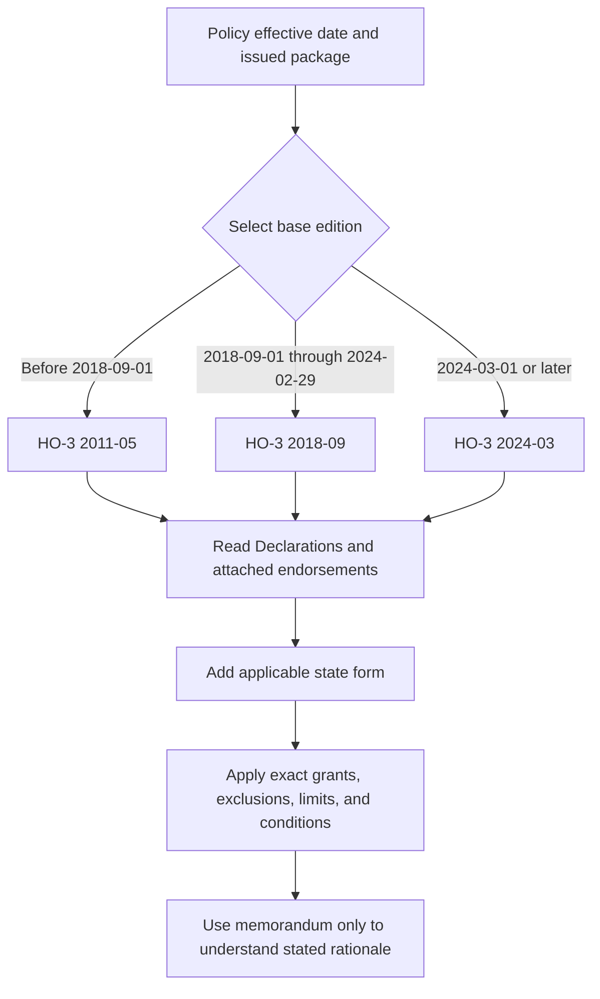

# HO-3 Form Editions

## Scope and authority

This page compares the HO-3 Homeowners 3—Special Form editions 2011-05, 2018-09, and 2024-03. The issued policy is assembled from the applicable base form, Declarations, attached endorsements, and any applicable state amendatory form. A base form supplies the grants, definitions, limits, exclusions, conditions, and settlement rules for its edition; an endorsement **modifies** the base form only within its stated terms and only when attached. The 2027 HO 04 90, for example, says that it modifies the policy, is effective only when attached, controls over conflicting policy language, and leaves unmodified terms unchanged. [HO-04-90 2027-01](repo://forms/HO/MS/HO-04-90/2027-01.md#L16-L36)

A filing memorandum is interpretation, not another policy form. The 2018-09 and 2024-03 memoranda explain the stated reasons for revisions; the filed form supplies the operative contract language. The 2024 form says coverage is determined from the facts, policy terms, and applicable law and that policy terms change only by authorized written action. Accordingly, a memorandum cannot rewrite a filed form, and an attached endorsement controls an inconsistent base-form term only within the endorsement's stated scope. [2024 form agreement](repo://forms/HO/MS/HO-3/2024-03.md#L15-L39) · [2024 memorandum](repo://memoranda/HO-3-2024-03.md#L13-L75)

## Select the governing package

Use the policy effective date to select the candidate HO-3 edition, then verify the issued form labels, Declarations, attached endorsements, and state overlay. The repository marks 2011-05 as superseded by 2018-09 for policies effective on or after 2018-09-01; it marks 2018-09 as superseded by 2024-03 for policies effective on or after 2024-03-01. Each earlier edition remains in force for policies written under it. [2011-05 header](repo://forms/HO/MS/HO-3/2011-05.md#L2-L9) · [2018-09 header](repo://forms/HO/MS/HO-3/2018-09.md#L2-L9) · [2024-03 header](repo://forms/HO/MS/HO-3/2024-03.md#L2-L8)

*The diagram shows edition selection and policy assembly; it does not replace the issued policy or applicable law.*

The selection date does not prove that an endorsement is attached. Confirm the complete issued package and use the endorsement edition applicable to that policy. Supersession is edition- and effective-date-specific: the 2025-05 HO 23 74 supersedes the 2018-09 edition for policies effective on or after 2025-05-01, and the 2027-01 HO 04 90 supersedes the 2010-10 edition for policies effective on or after 2027-01-01; each earlier endorsement remains in force for policies written under it. A later endorsement does not backdate its wording to an older policy. [Policy assembly guidance](repo://openwiki/policy-assembly/editions-and-state-attachments.md#L57-L66) · [HO 23 74 supersession](repo://forms/HO/MS/HO-23-74/2018-09.md#L2-L9) · [HO 04 90 supersession](repo://forms/HO/MS/HO-04-90/2010-10.md#L2-L9)

## Common structure and stable limits

All three editions divide Section I into Coverages A–D, Additional Coverages, perils, exclusions, and conditions, and Section II into Coverage E—Personal Liability and Coverage F—Medical Payments to Others. The recurring structure is open-peril property coverage subject to exclusions and limitations, together with liability and no-fault medical-payments coverage. Similar headings do not make the wording interchangeable across editions.

Coverage B is 10% of Coverage A and Coverage C is 50% of Coverage A in all three editions. The 2018 and 2024 forms express the applicable Coverage B and Coverage C limits in their operative provisions; their Coverage C language also makes the special limits subject to the Coverage C limit and other policy terms. [2011 B and C](repo://forms/HO/MS/HO-3/2011-05.md#L121-L125) · [2011 C](repo://forms/HO/MS/HO-3/2011-05.md#L183-L187) · [2018 B and C](repo://forms/HO/MS/HO-3/2018-09.md#L143-L147) · [2018 C](repo://forms/HO/MS/HO-3/2018-09.md#L209-L215) · [2024 B and C](repo://forms/HO/MS/HO-3/2024-03.md#L155-L159) · [2024 C](repo://forms/HO/MS/HO-3/2024-03.md#L217-L223)

Coverage D is 20% of Coverage A in each edition, but the operative tests differ. The 2011 form requires a covered loss that makes the residence premises uninhabitable and addresses additional living expense and fair rental value. The 2018 form uses the same 20% limit, covers additional living expense and fair rental value when the premises is unfit, and separately addresses civil-authority damage to neighboring premises. The 2024 form requires a covered loss, expressly lists temporary living arrangements, meals, transportation, rental value, moving, storage, and direct causation, and excludes expenses caused by an excluded loss. [2011 Coverage D](repo://forms/HO/MS/HO-3/2011-05.md#L305-L341) · [2018 Coverage D](repo://forms/HO/MS/HO-3/2018-09.md#L327-L375) · [2024 Coverage D](repo://forms/HO/MS/HO-3/2024-03.md#L355-L397) · [2024 memorandum M.1.12](repo://memoranda/HO-3-2024-03.md#L35-L39)

## Edition comparison: Coverages A–D

| Area | 2011-05 | 2018-09 | 2024-03 |
|---|---|---|---|
| **Coverage A—Dwelling** | Covers direct physical loss to the dwelling and attached property; replacement-cost settlement uses an 80% insured-to-value threshold. [A.1–A.7](repo://forms/HO/MS/HO-3/2011-05.md#L63-L79) | States the 80% replacement-cost threshold, direct-physical-loss grant, dwelling-service equipment, and related duties and exclusions. [A.1–A.10](repo://forms/HO/MS/HO-3/2018-09.md#L85-L105) | Uses the Declarations-based residence-premises description, states direct physical loss and replacement-cost terms, and adds a roof-surfacing settlement rule. [A.1–A.13](repo://forms/HO/MS/HO-3/2024-03.md#L97-L123) |
| **Coverage B—Other Structures** | 10% of Coverage A for qualifying detached structures. [B.1–B.4](repo://forms/HO/MS/HO-3/2011-05.md#L121-L129) | 10% of Coverage A with detailed private-use, rental, business, and structure classifications. [B.1–B.8](repo://forms/HO/MS/HO-3/2018-09.md#L143-L171) | 10% of Coverage A; distinguishes structures by separation, connection, insurable interest, use, and location. [B.1–B.8](repo://forms/HO/MS/HO-3/2024-03.md#L155-L171) |
| **Coverage C—Personal Property** | 50% of Coverage A with the 2011 special-limit schedule. [C.1–C.3](repo://forms/HO/MS/HO-3/2011-05.md#L183-L189) | 50% of Coverage A with a reorganized personal-property schedule and named-peril details. [C.1–C.3](repo://forms/HO/MS/HO-3/2018-09.md#L209-L215) | 50% of Coverage A with revised category limits and direct-loss, ownership, and location wording. [C.1–C.3](repo://forms/HO/MS/HO-3/2024-03.md#L217-L223) |
| **Coverage D—Loss of Use** | 20% of Coverage A; additional living expense and fair rental value follow uninhabitability and mitigation provisions. [D.1–D.5](repo://forms/HO/MS/HO-3/2011-05.md#L305-L315) | 20% of Coverage A; covers necessary living-expense increases, fair rental value, civil-authority loss of use, and records. [D.1–D.13](repo://forms/HO/MS/HO-3/2018-09.md#L327-L353) | 20% of Coverage A; makes lodging, meals, transportation, rental income, civil-authority access, moving, storage, and direct causation explicit. [D.1–D.20](repo://forms/HO/MS/HO-3/2024-03.md#L355-L391) |

The 2018 filing memorandum is a rationale document describing intended clarification and alignment of coverage, definitions, valuation, exclusions, conditions, and insured responsibilities. Its M.3.32 discusses connecting fair rental value to the rented portion of the premises; it does not supply a percentage limit. The filed 2018 D.1 states the operative 20% limit, so that form—not a memorandum summary—controls. [2018 memorandum summary](repo://memoranda/HO-3-2018-09.md#L13-L99) · [2018 memorandum M.3.31–M.3.38](repo://memoranda/HO-3-2018-09.md#L211-L225) · [2018 D.1–D.3](repo://forms/HO/MS/HO-3/2018-09.md#L327-L333)

## Special limits and Additional Coverages

Coverage C special limits are edition-specific. In 2011, the form states $200 for money, $1,000 for jewelry theft, $2,000 for firearms theft, $1,000 for watercraft, $2,500 for silverware theft, $2,500 for business property on the premises, and $1,000 for electronic apparatus in a motor vehicle. In 2018 those amounts are $250, $1,500, $2,500, $1,500, $2,500, $3,000, and $1,500 respectively. In 2024, cash, jewelry theft, firearms theft, and silverware theft rise to $300, $2,000, $3,000, and $3,000, while watercraft, business property, and electronic apparatus remain at their 2018 levels. [2011 special limits](repo://forms/HO/MS/HO-3/2011-05.md#L225-L239) · [2018 special limits](repo://forms/HO/MS/HO-3/2018-09.md#L241-L255) · [2024 special limits](repo://forms/HO/MS/HO-3/2024-03.md#L261-L285) · [2024 memorandum M.3.1–M.3.5](repo://memoranda/HO-3-2024-03.md#L123-L133)

Additional Coverages also change. The 2011 form provides 5% debris removal, 5% vegetation with a $500 per-item cap, and a $500 fire-department cap. The 2018 form keeps debris removal at 5% and uses $750 vegetation and fire-department caps. The 2024 form raises debris removal to 10%, vegetation to 10% of Coverage A with a $1,000 per-item cap, and the fire-department cap to $1,000; it also states $1,500 for card or forgery loss, $2,000 for loss assessment, 15% of Coverage A for ordinance or law, and $7,500 for grave markers. [2011 Additional Coverages](repo://forms/HO/MS/HO-3/2011-05.md#L355-L373) · [2018 Additional Coverages](repo://forms/HO/MS/HO-3/2018-09.md#L377-L425) · [2024 Additional Coverages](repo://forms/HO/MS/HO-3/2024-03.md#L405-L447) · [2024 memorandum M.3.6–M.3.13](repo://memoranda/HO-3-2024-03.md#L135-L149)

## Water, perils, roof, and endorsements

The water analysis is edition-specific. The 2011 form excludes sewer, drain, sump, and related-equipment backup, repeated seepage, subsurface water, and flood. The 2018 form excludes backup and repeated seepage but separately covers sudden and accidental system discharge and freezing subject to its terms. The 2024 form excludes flood, surface water, below-ground water, backup, sump discharge, repeated seepage, and system or opening leakage; its form also contains distinct direct-loss provisions for covered water events. [2011 water provisions](repo://forms/HO/MS/HO-3/2011-05.md#L493-L509) · [2018 water provisions](repo://forms/HO/MS/HO-3/2018-09.md#L551-L567) · [2024 direct-loss water provisions](repo://forms/HO/MS/HO-3/2024-03.md#L523-L533) · [2024 water exclusions](repo://forms/HO/MS/HO-3/2024-03.md#L481-L511) · [2024 exclusion provisions](repo://forms/HO/MS/HO-3/2024-03.md#L579-L601)

The 2018 form contains general dwelling replacement-cost and actual-cash-value provisions but no separate 2024-style roof-surfacing settlement floor. The 2024 base form adds that rule: covered damage follows the dwelling settlement basis unless an actual-cash-value roof schedule endorsement is attached. It separately excludes cosmetic wind or hail damage that does not impair water shedding and covers direct roof loss that does impair that function. The 2024 memorandum identifies the roof payment floor as a stated revision reason, but the form controls. [2018 A.1–A.10](repo://forms/HO/MS/HO-3/2018-09.md#L85-L105) · [2024 A.10–A.13](repo://forms/HO/MS/HO-3/2024-03.md#L117-L123) · [2024 roof perils](repo://forms/HO/MS/HO-3/2024-03.md#L545-L555) · [2024 memorandum M.1.20–M.1.21](repo://memoranda/HO-3-2024-03.md#L53-L55)

HO 23 74 **modifies** the roof settlement provision only when attached and does not itself broaden a covered peril. The 2018-09 endorsement applies ACV when roof surfacing is 15 years old at loss; the 2025-05 endorsement applies ACV when Roof Age is 12 years or greater. The 2025-05 text also states a 20% payable percentage for an applicable composition-shingle category but later states that the amount payable will not be less than 30% of applicable replacement cost. That apparent internal conflict must be escalated to the carrier or legal authority rather than resolved by assumption. These endorsement editions do not change the base form for a policy to which they are not attached. [HO 23 74 2018-09](repo://forms/HO/MS/HO-23-74/2018-09.md#L13-L27) · [2018 threshold](repo://forms/HO/MS/HO-23-74/2018-09.md#L45-L53) · [HO 23 74 2025-05](repo://forms/HO/MS/HO-23-74/2025-05.md#L13-L23) · [2025 threshold](repo://forms/HO/MS/HO-23-74/2025-05.md#L88-L109) · [2025 20% provision](repo://forms/HO/MS/HO-23-74/2025-05.md#L568-L586) · [2025 30% floor](repo://forms/HO/MS/HO-23-74/2025-05.md#L716-L735)

Water-backup coverage is also endorsement-dependent. HO 04 90 **writes back** the base-form backup boundary only within its attached coverage: the 2010-10 edition covers specified backup or sump discharge/overflow with a $5,000 limit and a $500 deductible, while the 2027-01 edition covers its stated Water Backup and Sump Discharge or Overflow events with a $10,000 limit and a $1,000 deductible. The 2011 base form excludes sewer, drain, sump, and related-equipment backup; the 2024 base form excludes sewer, drain, and sump water unless a water-backup endorsement is attached. Unmodified flood, surface-water, and other policy exclusions remain applicable. [HO 04 90 2010-10 acting document](repo://forms/HO/MS/HO-04-90/2010-10.md#L13-L47) · [2010 limit and deductible](repo://forms/HO/MS/HO-04-90/2010-10.md#L107-L115) · [2010 deductible](repo://forms/HO/MS/HO-04-90/2010-10.md#L157-L167) · [HO 04 90 2027-01 acting document](repo://forms/HO/MS/HO-04-90/2027-01.md#L16-L60) · [2027 coverage](repo://forms/HO/MS/HO-04-90/2027-01.md#L64-L83) · [2027 limit](repo://forms/HO/MS/HO-04-90/2027-01.md#L254-L276) · [2027 deductible](repo://forms/HO/MS/HO-04-90/2027-01.md#L391-L412) · [2011 exclusion](repo://forms/HO/MS/HO-3/2011-05.md#L493-L499) · [2024 exclusions](repo://forms/HO/MS/HO-3/2024-03.md#L591-L601)

HO 23 77 is a deductible endorsement, not a roof valuation schedule. Its 2014-02 edition applies a percentage deductible to covered windstorm or hail loss and controls conflicting policy text only within that scope. When attached, the 2022-07 edition applies the percentage deductible to covered windstorm or hail loss, preserves the remaining policy provisions, and covers wind-driven rain only when wind or hail first creates the opening. The base form and the endorsement must still establish covered direct physical loss; the deductible does not create coverage. [HO 23 77 2014-02](repo://forms/HO/MS/HO-23-77/2014-02.md#L13-L29) · [HO 23 77 2022-07 preamble](repo://forms/HO/MS/HO-23-77/2022-07.md#L13-L77) · [wind-driven opening](repo://forms/HO/MS/HO-23-77/2022-07.md#L83-L95)

## State forms and memoranda are different overlays

A state amendatory form is contract language, not a bulletin or filing memorandum. It may supply a precedence rule for matters within its scope, while nonconflicting base-form and endorsement terms remain applicable; it does not provide coverage unless it expressly does so. Texas HO 01 45 2022-01 states those rules and implements a declared Windstorm and Hail Deductible between 1% and 10%, calculated from the applicable limit. [HO 01 45 scope and precedence](repo://forms/HO/TX/HO-01-45/2022-01.md#L13-L23) · [HO 01 45 deductible](repo://forms/HO/TX/HO-01-45/2022-01.md#L59-L91)

A regulator bulletin constrains issuance, disclosure, and administration; it does not silently add a policy deductible or coverage term. Texas Bulletin B-2021-08 requires policy-consistent identification and application of separate windstorm and hail deductibles, consistent records and communications, and prohibits applying a deductible not permitted by the policy or law. Read the applicable state form with the selected HO-3 edition and attached endorsements, then apply the bulletin to the carrier's operations. [B-2021-08](repo://bulletins/TX/b-2021-08-windstorm-deductibles.md#L15-L43) · [B-2021-08 requirements](repo://bulletins/TX/b-2021-08-windstorm-deductibles.md#L47-L73) · [policy assembly authority model](repo://openwiki/policy-assembly/editions-and-state-attachments.md#L42-L55)

## Conditions and claim lifecycle

For a claim, select the edition and package first; identify the covered property and asserted cause; apply the grant and exact edition's exclusions; then apply limits, deductibles, settlement rules, and duties after loss. Conditions support notice, mitigation, inspection, records, proof of loss, appraisal, payment, and recovery; they are not independent grants of coverage.

The proof-of-loss deadline is edition-specific: 2018-09 requires a signed, sworn proof within 60 days after request, while 2024-03 requires it within 90 days. The 2024 form also states the information required, including time and cause, interested persons, actual cash value, amount of loss, liens, and encumbrances. Both forms preserve the distinction between appraisal of amount and questions of coverage or interpretation. [2018 proof of loss](repo://forms/HO/MS/HO-3/2018-09.md#L863-L913) · [2024 proof of loss](repo://forms/HO/MS/HO-3/2024-03.md#L731-L805) · [2024 memorandum M.4.67–M.4.80](repo://memoranda/HO-3-2024-03.md#L487-L515)

The 2011, 2018, and 2024 conditions should not be silently substituted for one another. For example, the 2011 proof deadline is also 60 days but its information and appraisal provisions are differently organized; 2018 uses a 20-day appraiser-selection period, while 2024 uses 30 days. [2011 conditions](repo://forms/HO/MS/HO-3/2011-05.md#L803-L855) · [2018 appraisal](repo://forms/HO/MS/HO-3/2018-09.md#L903-L915) · [2024 appraisal](repo://forms/HO/MS/HO-3/2024-03.md#L795-L805)

## Section II remains edition-specific

Coverage E is liability coverage for damages because of bodily injury or property damage caused by an occurrence; Coverage F pays necessary medical expenses for accidental bodily injury without requiring legal liability. The grants, territories, exclusions, and duties differ by edition. [2011 Section II](repo://forms/HO/MS/HO-3/2011-05.md#L947-L1015) · [2018 Section II](repo://forms/HO/MS/HO-3/2018-09.md#L973-L1059) · [2024 Section II](repo://forms/HO/MS/HO-3/2024-03.md#L933-L1015)

The 2024 liability grant uses payment “on behalf of” an insured, expressly provides defense expenses and bond premiums, and has a Section II exclusion lead-in that includes personal injury and denies a duty to defend excluded claims. The 2011 and 2018 forms use their own grants and exclusion structures; a later Section II wording must not be back-projected onto an earlier policy. [2024 Coverage E and Section II lead-in](repo://forms/HO/MS/HO-3/2024-03.md#L933-L981) · [2018 Coverage E](repo://forms/HO/MS/HO-3/2018-09.md#L973-L1037) · [2011 Coverage E](repo://forms/HO/MS/HO-3/2011-05.md#L947-L995)

## Text-integrity notes

The repository's 2024 source contains apparent duplicated or malformed phrases, including the duplicated claims-manual phrase in DEF.12, duplicated “unless an actual cash value roof schedule endorsement is attached” in A.13, and duplicated endorsement cross-reference wording in the exclusion section. These are source-text defects to flag or quote, not silently repair in a coverage decision. The memorandum may explain stated intent, but it cannot rewrite the controlling contract. [2024 DEF.12](repo://forms/HO/MS/HO-3/2024-03.md#L83-L95) · [2024 A.13](repo://forms/HO/MS/HO-3/2024-03.md#L117-L123) · [2024 exclusions](repo://forms/HO/MS/HO-3/2024-03.md#L579-L601)

## Decision rule

For every claim, use the policy effective date to select 2011-05, 2018-09, or 2024-03; verify the Declarations and endorsements actually attached; add the applicable state form; and apply the exact edition's grants, definitions, perils, exclusions, limits, conditions, and Section II text. Use filing memoranda only to understand the stated rationale for their respective revisions. Use bulletins and internal guidance for their regulatory or operational function. If a memorandum differs from the filed form, the form controls. If an attached endorsement differs from the base form, the endorsement controls only to the extent its attachment and text provide.
