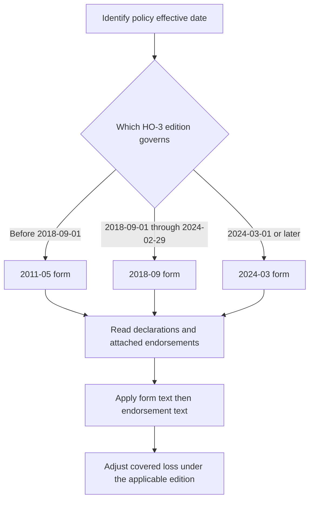

# HO-3 Special Form Editions

## Scope and controlling authority

This page covers the HO-3 Homeowners 3—Special Form editions 2011-05, 2018-09, and 2024-03. It describes the base form, not a state amendatory endorsement or an optional coverage endorsement; an attached endorsement changes the base policy only as its own text says. The form, Declarations, and attached endorsements must therefore be read together.

The operative rule is the policy edition applicable to the policy effective date, not the date a claim is reported. The 2011-05 form is effective 2011-05-01 and is superseded by the 2018-09 form for policies effective on or after 2018-09-01; it remains governing for policies written under it. The 2018-09 form is effective 2018-09-01 and is superseded by the 2024-03 form for policies effective on or after 2024-03-01; it remains governing for policies written under it. The 2024-03 form is effective 2024-03-01. [2011-05 header](repo://forms/HO/MS/HO-3/2011-05.md#L2-L9) · [2018-09 header](repo://forms/HO/MS/HO-3/2018-09.md#L2-L9) · [2024-03 header](repo://forms/HO/MS/HO-3/2024-03.md#L2-L8)

*The diagram shows the edition-selection and policy-assembly path; it does not replace the effective-date or endorsement text.*

The 2024 filing memorandum is useful evidence of the drafter’s stated reasons for changes, including limits, water wording, roof settlement, and post-loss duties. It is explanatory filing material, not a substitute for the contract. If the memorandum’s explanation and the filed form differ, the controlling form text governs; an attached endorsement controls over inconsistent base-form language only within the endorsement’s stated scope. The 2024 form itself says coverage is determined from the facts, policy terms, and applicable law and that policy terms change only by authorized written action. [2024 form agreement](repo://forms/HO/MS/HO-3/2024-03.md#L15-L39) · [2024 memorandum summary](repo://memoranda/HO-3-2024-03.md#L13-L75) · [endorsement hierarchy example](repo://forms/HO/MS/HO-04-90/2027-01.md#L15-L39)

## What stays common across the editions

All three forms organize Section I around Coverage A—Dwelling, B—Other Structures, C—Personal Property, D—Loss of Use, Additional Coverages, perils, exclusions, and conditions, and Section II around Coverage E—Personal Liability, Coverage F—Medical Payments to Others, exclusions, and additional liability coverages. The recurring architecture is open-peril property coverage subject to exclusions and limitations, plus liability and no-fault medical-payments coverage. The exact grant and exception language changes by edition, so a later edition must not be back-projected onto an earlier policy.

Coverage B and C retain the familiar percentage relationships in all three editions: Coverage B is 10% of Coverage A, and Coverage C is 50% of Coverage A. The later forms expressly call Coverage B additional insurance and retain the Coverage C special limits within, rather than in addition to, the Coverage C limit. [2011 B and C limits](repo://forms/HO/MS/HO-3/2011-05.md#L141-L151) · [2018 B and C limits](repo://forms/HO/MS/HO-3/2018-09.md#L165-L169) · [2018 C limit](repo://forms/HO/MS/HO-3/2018-09.md#L233-L241) · [2024 B and C limits](repo://forms/HO/MS/HO-3/2024-03.md#L155-L159) · [2024 C limit](repo://forms/HO/MS/HO-3/2024-03.md#L219-L239)

Coverage D remains 20% of Coverage A in each edition, but the operative tests differ. The 2011 form describes additional living expense and fair rental value after a covered loss makes a residence unfit; 2018 calls the payment actual loss sustained and separately states the civil-authority access trigger; 2024 expressly covers necessary temporary lodging, meals, relocation, and storage when the residence is uninhabitable, while excluding expenses caused by an excluded peril. [2011 Coverage D](repo://forms/HO/MS/HO-3/2011-05.md#L307-L337) · [2018 Coverage D](repo://forms/HO/MS/HO-3/2018-09.md#L349-L377) · [2024 Coverage D](repo://forms/HO/MS/HO-3/2024-03.md#L361-L397)

## Coverage A—D and material Section I changes

| Area | 2011-05 governing language | 2018-09 change | 2024-03 change and memorandum explanation |
|---|---|---|---|
| **A—Dwelling** | Covers direct physical loss to the dwelling and attached structures; replacement cost requires the 80% threshold, with actual cash value available before repair or replacement. [2011 A.1–A.7](repo://forms/HO/MS/HO-3/2011-05.md#L65-L79) | Adds expressly covered fixtures, permanently installed equipment, and dwelling-service property, and states the replacement-cost/actual-cash-value sequence and matching limitation. [2018 A.1–A.4](repo://forms/HO/MS/HO-3/2018-09.md#L87-L103) · [2018 A.20–A.27](repo://forms/HO/MS/HO-3/2018-09.md#L125-L139) | Uses the Declarations and limits Coverage A property to the residence premises, adds permanently installed machinery/equipment, and introduces a separate roof-surfacing settlement floor in the base form. The memorandum describes the revised dwelling description, direct-physical-loss presentation, and roof payment floor; the form controls if the description overstates or understates the operative text. [2024 A.1–A.4](repo://forms/HO/MS/HO-3/2024-03.md#L99-L105) · [2024 A.19–A.27](repo://forms/HO/MS/HO-3/2024-03.md#L135-L151) · [memorandum M.1.3, M.1.8–M.1.9, M.1.20](repo://memoranda/HO-3-2024-03.md#L19-L33) · [memorandum M.3.50–M.3.55](repo://memoranda/HO-3-2024-03.md#L223-L233) |
| **B—Other Structures** | Covers qualifying detached structures on the residence premises, with a collective 10% Coverage A limit and business/rental restrictions. [2011 B.1–B.12](repo://forms/HO/MS/HO-3/2011-05.md#L141-L163) | Keeps 10% as additional insurance, expressly requires an insurable interest, and distinguishes structures attached by more than a fence, utility line, or similar connection as part of the dwelling. [2018 B.1–B.11](repo://forms/HO/MS/HO-3/2018-09.md#L165-L185) | Adds permanently installed equipment, additions and alterations serving an other structure, and specific farming, business, occupancy, and property-location restrictions. The memorandum says the revision clarifies qualifying structures versus excluded property; that interpretation cannot enlarge the text. [2024 B.1–B.14](repo://forms/HO/MS/HO-3/2024-03.md#L155-L181) · [memorandum M.1.10](repo://memoranda/HO-3-2024-03.md#L31-L34) |
| **C—Personal Property** | Worldwide ownership/use grant with a 50% Coverage A limit, numerous special limits, and item-specific exclusions. [2011 C.1–C.18](repo://forms/HO/MS/HO-3/2011-05.md#L191-L225) | Keeps the 50% limit and organizes special limits as internal caps, then states a detailed named-peril grant and exclusions. [2018 C.1–C.12](repo://forms/HO/MS/HO-3/2018-09.md#L233-L255) · [2018 C.13–C.28](repo://forms/HO/MS/HO-3/2018-09.md#L257-L287) | Recasts the grant around direct physical loss, ownership/insurable interest, character/use/location, evidence, recovery, assignment, and prejudice. The memorandum says the revision clarifies property categories, special limits, and the relationship between direct loss and limitations. [2024 C.1–C.10](repo://forms/HO/MS/HO-3/2024-03.md#L221-L239) · [2024 C.19–C.39](repo://forms/HO/MS/HO-3/2024-03.md#L257-L297) · [memorandum M.3.1–M.3.5, M.3.14–M.3.18](repo://memoranda/HO-3-2024-03.md#L125-L159) |
| **D—Loss of Use** | Pays additional living expense, fair rental value, and prohibited use after a covered loss, with records and mitigation duties. [2011 D.1–D.17](repo://forms/HO/MS/HO-3/2011-05.md#L309-L341) | Connects coverage expressly to a covered loss, actual loss sustained, uninhabitability/access, and pre-loss rental use; it excludes business income and unrelated delay. [2018 D.1–D.24](repo://forms/HO/MS/HO-3/2018-09.md#L351-L397) | Retains the 20% limit but makes temporary lodging, meals, relocation, storage, civil-authority access, and direct causation explicit. The memorandum says the revision connects loss of use to the applicable covered loss; the 2024 conditions control the claim. [2024 D.1–D.24](repo://forms/HO/MS/HO-3/2024-03.md#L363-L409) · [memorandum M.1.12](repo://memoranda/HO-3-2024-03.md#L35-L39) |

### 2024 special-limit progression

The 2024 form changes several amounts from the 2018 form, and the memorandum identifies those changes as direct claim-handling limits. The form—not the memorandum’s prose—controls the amount: cash rises from $250 to $300; jewelry theft from $1,500 to $2,000; firearms theft from $2,500 to $3,000; silverware theft from $2,500 to $3,000; while watercraft remains $1,500, business property remains $3,000, and electronic apparatus remains $1,500. [2018 limits](repo://forms/HO/MS/HO-3/2018-09.md#L241-L255) · [2024 limits](repo://forms/HO/MS/HO-3/2024-03.md#L241-L255) · [memorandum M.3.1–M.3.5](repo://memoranda/HO-3-2024-03.md#L125-L134)

The 2011 amounts were lower for most of those categories: cash $200, jewelry theft $1,000, firearms theft $2,000, watercraft $1,000, silverware theft $2,500, business property $2,500, and electronic apparatus $1,000. These are edition-specific limits, not a current universal schedule. [2011 special limits](repo://forms/HO/MS/HO-3/2011-05.md#L233-L275)

Additional Coverages also move materially. The 2011 form provides a 5% debris-removal amount, 5% vegetation amount with a $500 per-item cap, and a $500 fire-department charge cap; 2018 keeps debris at 5% but raises the vegetation and fire-department caps to $750; 2024 raises debris to 10%, vegetation to 10% of Coverage A with a $1,000 per-item cap, and the fire-department cap to $1,000. The 2024 form also states $1,500 for card/forgery loss, $2,000 for loss assessment, 15% of Coverage A for ordinance or law, and $7,500 for grave markers. [2011 Additional Coverages](repo://forms/HO/MS/HO-3/2011-05.md#L375-L417) · [2018 Additional Coverages](repo://forms/HO/MS/HO-3/2018-09.md#L419-L457) · [2024 Additional Coverages](repo://forms/HO/MS/HO-3/2024-03.md#L415-L505) · [memorandum M.3.6–M.3.13](repo://memoranda/HO-3-2024-03.md#L135-L149)

## Perils, water, roof, and causation language

The editions do not use the same water analysis. The 2011 form excludes water backup, repeated seepage, subsurface water, and flood, expressly saying flood is excluded “whether the water is driven by wind or another force,” while separately covering resulting physical loss caused by a covered peril. [2011 perils](repo://forms/HO/MS/HO-3/2011-05.md#L569-L579)

The 2018 form expressly covers sudden and accidental discharge or overflow from listed systems, and its form text uses the exact phrase “sudden and accidental”; it separately excludes repeated seepage or leakage and water backup. [2018 P.20–P.22](repo://forms/HO/MS/HO-3/2018-09.md#L665-L669) · [2018 water exclusions](repo://forms/HO/MS/HO-3/2018-09.md#L657-L665)

The 2024 form separates the covered accidental discharge, sudden-and-accidental tearing apart, off-premises plumbing discharge, and water exclusions. It says flood/surface water is excluded “whether the water is driven by wind or another force,” and it preserves resulting-loss distinctions in the same peril section. The memorandum explains that the water-damage revision distinguishes external water, surface water, subsurface water, backup, sump overflow, and wind-driven water; those explanations do not override the form’s exact causal words. [2024 P.1–P.12](repo://forms/HO/MS/HO-3/2024-03.md#L559-L585) · [2024 P.19–P.33](repo://forms/HO/MS/HO-3/2024-03.md#L595-L623) · [memorandum M.4.23–M.4.34](repo://memoranda/HO-3-2024-03.md#L399-L421)

For the 2024 form, “directly or indirectly” is operative in the all-exclusions lead-in: loss caused directly or indirectly by an excluded peril remains excluded regardless of concurrent or sequential contribution, unless the policy says otherwise. A claim cannot replace that controlling language with a memorandum’s shorter description of causation. [2024 Section I exclusion lead-in](repo://forms/HO/MS/HO-3/2024-03.md#L671-L673) · [2024 memorandum concurrent-cause explanation](repo://memoranda/HO-3-2024-03.md#L261-L265)

Roof treatment changed from an ordinary replacement-cost framework to a base-form roof-surfacing floor in 2024. The 2024 form settles roof surfacing at replacement cost unless an actual-cash-value roof schedule endorsement is attached, and separately excludes cosmetic wind or hail damage that does not impair water-shedding ability. The 2018 form instead states replacement-cost settlement generally and does not contain that 2024 roof-surfacing floor. [2018 A.20–A.27](repo://forms/HO/MS/HO-3/2018-09.md#L125-L139) · [2024 A.19–A.25](repo://forms/HO/MS/HO-3/2024-03.md#L135-L147) · [2024 roof perils](repo://forms/HO/MS/HO-3/2024-03.md#L635-L645) · [memorandum M.1.20–M.1.21](repo://memoranda/HO-3-2024-03.md#L53-L55)

Do not confuse the 2024 base-form default with HO 23 74. The 2018-09 HO 23 74 endorsement used an actual-cash-value settlement when roof surfacing reached fifteen years; the 2025-05 edition, which is a later endorsement edition rather than an HO-3 base-form edition, uses a twelve-year threshold. Each endorsement applies only when attached and controls its inconsistent roof-surfacing terms. [2018-09 HO 23 74](repo://forms/HO/MS/HO-23-74/2018-09.md#L13-L23) · [2018-09 threshold](repo://forms/HO/MS/HO-23-74/2018-09.md#L45-L53) · [2025-05 HO 23 74](repo://forms/HO/MS/HO-23-74/2025-05.md#L13-L27) · [2025-05 threshold](repo://forms/HO/MS/HO-23-74/2025-05.md#L57-L69)

Water-backup coverage is likewise endorsement-dependent. The 2011 base form excludes sewer, drain, sump, and related-equipment backup; the 2018 and 2024 base texts retain comparable exclusions. HO 04 90 can restore separately stated coverage when attached, and its edition-specific wording governs: the 2010-10 endorsement covers accidental backup or sump discharge/overflow, while the 2027-01 endorsement expressly includes sudden or gradual events and defines maintenance duties. [2011 water exclusion](repo://forms/HO/MS/HO-3/2011-05.md#L569-L575) · [2024 water exclusion](repo://forms/HO/MS/HO-3/2024-03.md#L573-L581) · [2010-10 HO 04 90](repo://forms/HO/MS/HO-04-90/2010-10.md#L15-L39) · [2027-01 HO 04 90](repo://forms/HO/MS/HO-04-90/2027-01.md#L15-L37) · [2027 coverage](repo://forms/HO/MS/HO-04-90/2027-01.md#L41-L69)

A percentage wind or hail deductible is also not part of the base-form comparison by itself. HO 23 77 changes the policy only when attached; its 2014-02 edition applies the percentage deductible to covered wind or hail loss and controls over conflicting policy text, while its 2022-07 edition defines wind-driven rain coverage through an opening first created by wind or hail and applies the deductible across dwelling, other structures, personal property, and loss of use. [2014-02 HO 23 77](repo://forms/HO/MS/HO-23-77/2014-02.md#L13-L29) · [2014-02 application](repo://forms/HO/MS/HO-23-77/2014-02.md#L45-L67) · [2022-07 HO 23 77](repo://forms/HO/MS/HO-23-77/2022-07.md#L13-L51) · [2022-07 application](repo://forms/HO/MS/HO-23-77/2022-07.md#L55-L89)

## Conditions and claim lifecycle

The practical claim path is: identify the governing edition; identify attached endorsements; decide whether the loss is direct physical loss and whether a covered peril remains after exclusions; apply Coverage A–D, Additional Coverages, limits, and deductibles; then complete notice, mitigation, inspection, records, proof of loss, appraisal, payment, and recovery steps. Conditions are claim requirements, not a grant of coverage.

The 2024 conditions are materially more prescriptive than the earlier forms. They require reasonable protection and retention of damaged property, records and inspections, a detailed inventory when requested, preservation of recovery rights, and a signed, sworn proof of loss within **ninety days after our request**, including time/cause, interested persons, actual cash value, loss, liens, and encumbrances. The 2018 form required a signed, sworn proof within **sixty days after our request**; the memorandum expressly identifies the 90-day change. [2018 proof-of-loss condition](repo://forms/HO/MS/HO-3/2018-09.md#L967-L973) · [2024 conditions](repo://forms/HO/MS/HO-3/2024-03.md#L803-L839) · [memorandum M.4.67–M.4.80](repo://memoranda/HO-3-2024-03.md#L487-L515)

The 2024 form also states a Section I deductible minimum of $500, with policy and endorsement rules for windstorm/hail and hurricane deductibles; it provides payment within 60 days after agreement, binding appraisal, or final judgment, and says appraisal determines amount of loss rather than coverage, interpretation, or compliance. [2024 deductible and payment conditions](repo://forms/HO/MS/HO-3/2024-03.md#L943-L975) · [2024 appraisal conditions](repo://forms/HO/MS/HO-3/2024-03.md#L1005-L1017) · [memorandum M.1.6–M.1.7 and M.4.98–M.4.99](repo://memoranda/HO-3-2024-03.md#L25-L27)

The 2011 and 2018 conditions should not be silently replaced with the 2024 lifecycle. The 2011 form relies on prompt notice, inspection, records, examination under oath, signed loss statements, mitigation, and recovery duties throughout the Coverage A and C provisions; 2018 consolidates similar duties but does not have the 2024 form’s 90-day proof-of-loss wording. [2011 claim duties](repo://forms/HO/MS/HO-3/2011-05.md#L113-L137) · [2011 Coverage C duties](repo://forms/HO/MS/HO-3/2011-05.md#L277-L305) · [2018 claim duties](repo://forms/HO/MS/HO-3/2018-09.md#L331-L347)

## Section II—liability and medical payments

Coverage E is liability coverage for damages because of bodily injury or property damage caused by an occurrence; Coverage F pays necessary medical expenses for accidental bodily injury without requiring legal liability. The exact territory, definitions, exclusions, and duties differ by edition.

In 2011, Coverage E is a compact grant and duty/exclusion set: damages must arise from an occurrence during the policy period, defense and settlement duties end when the applicable limit is exhausted, and the form lists business, professional-service, motor-vehicle, aircraft, watercraft, controlled-substance, contract, injury-to-insured, and property-care exclusions. Coverage F covers necessary medical expenses incurred or ascertained within three years and enumerates location, activity, residence-employee, animal, and no-fault rules. [2011 Coverage E](repo://forms/HO/MS/HO-3/2011-05.md#L1021-L1069) · [2011 Coverage F](repo://forms/HO/MS/HO-3/2011-05.md#L1071-L1107)

The 2018 form reorganizes Coverage E around defined bodily injury, property damage, occurrence, suit, and coverage territory terms, then states business, professional-service, vehicle, watercraft, aircraft, premises, communicable-disease, war, pollution, and property exclusions. Coverage F expressly says payment is without regard to fault, requires expenses within three years, and adds direct-payment, proof, examination, and recovery provisions. [2018 Coverage E](repo://forms/HO/MS/HO-3/2018-09.md#L1075-L1139) · [2018 Coverage F](repo://forms/HO/MS/HO-3/2018-09.md#L1141-L1195)

The 2024 form changes the liability grant to payment “on behalf of” an insured, adds the insured-location/personal-activities scope and separate application to each insured, expressly pays defense expenses and bond premiums, and retains contract, vehicle, aircraft, watercraft, business, professional-service, workers-compensation, property, intentional-loss, controlled-substance, communicable-disease, abuse, war, and nuclear-hazard exclusions. Coverage F retains no-fault medical payments and the three-year medical-expense period but adds direct payment, records, and recovery mechanics. The 2024 Section II exclusion lead-in expressly includes “personal injury” and denies a duty to defend a claim or suit seeking damages excluded by that section. [2024 Coverage E](repo://forms/HO/MS/HO-3/2024-03.md#L1025-L1071) · [2024 Coverage F](repo://forms/HO/MS/HO-3/2024-03.md#L1075-L1113) · [2024 Section II lead-in](repo://forms/HO/MS/HO-3/2024-03.md#L1115-L1127) · [2011 prior lead-in](repo://forms/HO/MS/HO-3/2011-05.md#L1109-L1119) · [memorandum Section II summary](repo://memoranda/HO-3-2024-03.md#L553-L595)

The Section II exclusions became more elaborated from 2011 to 2018 and again in 2024. For example, 2011 starts with expected-or-intended injury or damage and a business exclusion; 2018 adds the “personal injury” category and a broader exclusion structure; 2024 retains that category and expressly addresses the duty to defend excluded claims. These are edition-specific liability boundaries, not interchangeable summaries. [2011 Section II exclusions](repo://forms/HO/MS/HO-3/2011-05.md#L1111-L1127) · [2018 Section II exclusions](repo://forms/HO/MS/HO-3/2018-09.md#L1197-L1219) · [2024 Section II exclusions](repo://forms/HO/MS/HO-3/2024-03.md#L1115-L1133)

## Text-integrity notes

The repository’s 2024 source contains apparent duplicated or malformed phrases, including “the definitionthe claims manual's duration test applies the definition” in DEF.12, duplicated “unless an actual cash value roof schedule endorsement is attached” in A.22, and duplicated endorsement cross-reference wording in portions of the perils and conditions. Those defects are part of the repository’s form text and should be quoted or flagged rather than silently repaired in a coverage decision. The memorandum can explain intent, but it cannot rewrite the controlling contract. [2024 DEF.12](repo://forms/HO/MS/HO-3/2024-03.md#L83-L95) · [2024 A.22](repo://forms/HO/MS/HO-3/2024-03.md#L135-L145) · [2024 water cross-reference](repo://forms/HO/MS/HO-3/2024-03.md#L671-L691)

### Decision rule

For a claim, first use the policy effective date to select 2011-05, 2018-09, or 2024-03; then read the declarations and endorsements attached to that policy; then apply the exact edition’s grant, definitions, perils, exclusions, limits, conditions, and Section II text. Use the 2024 filing memorandum to understand the stated rationale and intended interpretation of 2024 changes, but if it differs from the form, the form controls; if an attached endorsement differs from the base form, the endorsement controls only to the extent its attachment and text provide.
