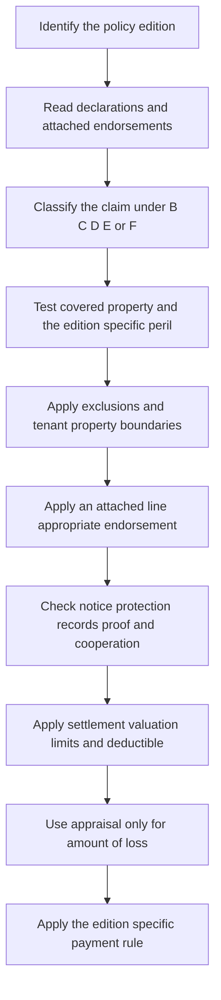

# HO-4 Contents Broad Form Editions

## Scope, authority, and edition selection

This page documents the Mississippi HO-4 form files for the 2013-07 and 2021-10 editions. The 2013-07 form is effective July 1, 2013 and is superseded by 2021-10 for policies effective on or after October 1, 2021; it remains the governing form for policies written under 2013-07. The 2021-10 form is effective October 1, 2021. ([HO-4 2013-07, header and supersession](repo://forms/HO/MS/HO-4/2013-07.md#L1-L9); [HO-4 2021-10, header](repo://forms/HO/MS/HO-4/2021-10.md#L1-L8))

The 2021-10 filing memorandum is an interpretation and drafting-change map, not a grant of insurance. It describes revisions involving deductible administration, policy continuation, mold wording, claim-handling authority, loss-of-use and special-limit presentation, post-loss conditions, and Section II liability wording. Use it to locate and understand a change, but use the governing form, declarations, and attached endorsements to decide coverage. If the memorandum and contract differ, the form controls; an endorsement changes the policy only to the extent stated in the endorsement. ([HO-4 memorandum, filing summary](repo://memoranda/HO-4-2021-10.md#L13-L75); [HO-4 memorandum, Section I changes](repo://memoranda/HO-4-2021-10.md#L145-L185); [HO 04 92, conflict and unchanged terms](repo://forms/HO/MS/HO-04-92/2019-03.md#L13-L39); [HO 04 27, conflict and unchanged terms](repo://forms/HO/MS/HO-04-27/2016-05.md#L13-L39))

## State overlays and line boundaries

A state amendatory form is contract language only when it is issued and attached to the applicable policy. Select it by state, line, edition, and policy-effective date; then read it with the declarations, base form, and endorsements. A state form can control conflicting terms within its stated scope, but it does not create coverage unless it expressly does so. ([Texas HO 01 45 2022-01, scope and precedence](repo://forms/HO/TX/HO-01-45/2022-01.md#L1-L23); [Texas overlay, attachment and date selection](repo://openwiki/state-overlays/texas.md#L31-L42))

The supplied Texas example is expressly an **HO-3** amendatory endorsement, not an HO-4 form. Its windstorm-and-hail deductible terms therefore must not be transplanted into this Mississippi HO-4 comparison or used to infer a Mississippi HO-4 state change. For an actual state modification, verify the issued package and apply only the line-appropriate form attached to that policy. ([Texas HO 01 45 metadata](repo://forms/HO/TX/HO-01-45/2022-01.md#L1-L8); [Texas HO 01 45 deductible](repo://forms/HO/TX/HO-01-45/2022-01.md#L59-L91))

**Coverage A is not provided.** Both editions expressly say that Coverage A does not insure the dwelling or building. The 2013-07 list also excludes building parts, systems, fixtures, landlord property, and property for which the tenant is merely responsible; 2021-10 separately enumerates the dwelling, attached structures, building systems, fixtures, garage, land, and other real-property interests. Do not infer an HO-3 dwelling grant, dwelling replacement-cost coverage, ordinance-or-law building coverage, or building loss-of-use coverage from an HO-4 policy. ([HO-4 2013-07, I.A A.1–A.38](repo://forms/HO/MS/HO-4/2013-07.md#L67-L143); [HO-4 2021-10, I.A A.1–A.27](repo://forms/HO/MS/HO-4/2021-10.md#L71-L125))

The forms may still use the Coverage A limit as a reference formula. Coverage D is stated as 30% of Coverage A in 2013-07, while 2021-10 states a forty-percent limit and its filing memorandum identifies the relationship as 40% of Coverage A; Section I ordinance-or-law wording also references Coverage A. Because Coverage A is not provided, the formula does not itself supply a Coverage A amount or convert tenant coverage into building insurance. ([HO-4 2013-07, I.D D.1](repo://forms/HO/MS/HO-4/2013-07.md#L306-L307); [HO-4 2021-10, I.D D.1](repo://forms/HO/MS/HO-4/2021-10.md#L317-L319); [HO-4 memorandum, Coverage D revision](repo://memoranda/HO-4-2021-10.md#L145-L153); [HO-4 2013-07, I.E E.57–E.60](repo://forms/HO/MS/HO-4/2013-07.md#L501-L507); [HO-4 2021-10, I.E E.42–E.46](repo://forms/HO/MS/HO-4/2021-10.md#L515-L523))

## Coverage architecture

| Part | 2013-07 | 2021-10 | Tenant-facing boundary |
|---|---|---|---|
| Coverage A | Not provided | Not provided | No Coverage A dwelling or building grant. |
| Coverage B | Other Structures | Other Structures | Limited qualifying other-structure interests; not the leased dwelling. |
| Coverage C | Personal Property | Personal Property | Core contents coverage, subject to location, property, peril, special-limit, and valuation terms. |
| Coverage D | Loss of Use | Loss of Use | Additional living expense, fair rental value, and qualifying civil-authority loss of use. |
| Section I Coverage E | Additional Coverages | Additional Coverages | Property-side additional insurance and limits. |
| Section II Coverage E | Personal Liability | Personal Liability | Occurrence-based bodily-injury and property-damage liability and defense. |
| Section II Coverage F | Medical Payments to Others | Medical Payments to Others | Qualifying third-party medical expenses without regard to fault. |

“Coverage E” therefore has two different meanings depending on the section. Section I Coverage E is not Section II personal liability; Section II Coverage E is liability, and Section II Coverage F is medical payments. ([HO-4 2013-07, B–D](repo://forms/HO/MS/HO-4/2013-07.md#L141-L165); [HO-4 2013-07, Section I E](repo://forms/HO/MS/HO-4/2013-07.md#L373-L385); [HO-4 2013-07, Section II E–F](repo://forms/HO/MS/HO-4/2013-07.md#L993-L1125); [HO-4 2021-10, B](repo://forms/HO/MS/HO-4/2021-10.md#L127-L169); [HO-4 2021-10, D](repo://forms/HO/MS/HO-4/2021-10.md#L315-L329); [HO-4 2021-10, Section I E](repo://forms/HO/MS/HO-4/2021-10.md#L357-L369); [HO-4 2021-10, Section II E–F](repo://forms/HO/MS/HO-4/2021-10.md#L1007-L1115))

*This flow shows the contract sequence for evaluating an HO-4 claim; an endorsement can change only the terms it expressly changes.*

## Section I property coverages

### Coverage B — Other Structures

Coverage B is not Coverage A. In 2013-07 it covers qualifying other structures at an insured location that are owned by the insured or held for the insured's use, while excluding the dwelling, land, business or rental uses, and most unattached property. In 2021-10 it covers qualifying other structures on the residence premises in which the insured has an insurable interest, plus permanently attached fixtures and repair or rebuilding materials, but excludes rental or business use, farming, unlawful use, fences and similar non-roofed property. A tenant's responsibility for the landlord's building does not create Coverage A or automatically make that building a Coverage B other structure. ([HO-4 2013-07, I.B B.1–B.12](repo://forms/HO/MS/HO-4/2013-07.md#L141-L165); [HO-4 2021-10, I.B B.1–B.32](repo://forms/HO/MS/HO-4/2021-10.md#L127-L191))

Coverage B's core repair settlement is not the previously asserted edition difference. In 2013-07, B.20 settles a covered loss under the applicable valuation provision, caps payment at the amount necessary to repair or replace, and excludes betterment, matching, and non-restorative improvements. In 2021-10, B.19 covers repair or replacement of the damaged portion with like kind and quality and excludes an ordinance-or-law cost increase unless the policy otherwise provides it. Apply these clauses with the governing edition's general valuation and conditions; do not import a Coverage C settlement rule into Coverage B. ([HO-4 2013-07, I.B B.19–B.20](repo://forms/HO/MS/HO-4/2013-07.md#L183-L185); [HO-4 2021-10, I.B B.19–B.21](repo://forms/HO/MS/HO-4/2021-10.md#L165-L169))

### Coverage C — Personal Property

Coverage C is the principal tenant contents grant. Both editions cover qualifying personal property owned or used by an insured, including property away from the residence premises under the applicable worldwide or temporary-removal provisions. The 2021-10 edition expressly addresses personal-property location, temporary removal, rented-residence improvements, and property belonging to guests or servants. Neither edition makes a roommate, roomer, boarder, or unrelated tenant an insured merely because that person occupies the residence. ([HO-4 2013-07, I.C C.1–C.13](repo://forms/HO/MS/HO-4/2013-07.md#L209-L235); [HO-4 2021-10, I.C C.1–C.13](repo://forms/HO/MS/HO-4/2021-10.md#L217-L243))

The 2021-10 special limits are higher for the following categories:

| Coverage C category | 2013-07 | 2021-10 |
|---|---:|---:|
| Electronic apparatus in a motor vehicle | $1,000 | $1,500 |
| Money and precious metals | $200 | $250 |
| Theft of jewelry, watches, and precious stones | $1,500 | $2,000 |
| Theft of firearms | $2,000 | $2,500 |
| Watercraft, including trailers and equipment | $1,000 | $1,500 |
| Business property on the residence premises | $2,500 | $3,000 |
| Theft of silverware | $2,500 | $2,500 |

These are limits within Coverage C, not extra limits. ([HO-4 2013-07, I.C C.19–C.25](repo://forms/HO/MS/HO-4/2013-07.md#L225-L237); [HO-4 2021-10, I.C C.19–C.25](repo://forms/HO/MS/HO-4/2021-10.md#L231-L243))

The settlement wording must be read differently. 2013-07 defines actual cash value and replacement cost, then expressly permits adjustment by actual cash value, repair, replacement, or provision for repair or replacement. 2021-10 separately defines actual cash value and replacement cost and gives general conditions for inspection of repaired property, repair estimates, salvage, and taking damaged property at agreed or appraised value; the cited 2021-10 form text does not establish the previously asserted pairs-and-sets, unavailable-parts, or Coverage C-specific lesser-of formula. Apply the governing valuation provision and any attached endorsement rather than importing a rule from another edition. ([HO-4 2013-07, definitions and Section I conditions](repo://forms/HO/MS/HO-4/2013-07.md#L41-L45); [HO-4 2013-07, I.S S.42–S.44](repo://forms/HO/MS/HO-4/2013-07.md#L915-L919); [HO-4 2021-10, definitions](repo://forms/HO/MS/HO-4/2021-10.md#L41-L45); [HO-4 2021-10, I.S S.48–S.53](repo://forms/HO/MS/HO-4/2021-10.md#L873-L883))

### Named perils and cause-of-loss boundaries

The 2013-07 form has a separate named-perils section: it requires direct physical loss to covered property caused by one of the listed perils and says that an unlisted peril is not covered. The list includes fire or lightning, windstorm or hail, explosion, riot or civil commotion, aircraft, vehicles, smoke, vandalism or malicious mischief, theft, falling objects, weight of ice/snow/sleet, accidental discharge or overflow of water or steam, sudden and accidental system damage, freezing, artificially generated electrical current, and volcanic eruption. ([HO-4 2013-07, I.P P.1–P.20](repo://forms/HO/MS/HO-4/2013-07.md#L535-L575))

The 2021-10 form also has a Section I peril section, but it reorganizes the qualifications and resulting-loss wording. It addresses fully enclosed-building limits for weight of ice, snow, or sleet, accidental water discharge, water-system damage, continuous leakage, and freezing, and then states location and causation boundaries. The form still requires direct physical loss caused by a covered peril and says that the insured must establish the covered cause. Do not combine a 2013-07 named-peril clause with a 2021-10 limitation merely because the peril has the same name. ([HO-4 2021-10, I.P P.29–P.46](repo://forms/HO/MS/HO-4/2021-10.md#L561-L595); [HO-4 2021-10, I.P P.67–P.70](repo://forms/HO/MS/HO-4/2021-10.md#L637-L643))

## Tenant water boundaries and endorsements

Under either base edition, sudden accidental discharge or overflow from specified plumbing, heating, air-conditioning, sprinkler, and household-appliance systems can be a covered personal-property peril, but the base form does not insure the building system or the landlord's dwelling as Coverage A. The 2013-07 wording excludes the system or appliance from which water escaped; 2021-10 covers resulting personal-property damage and states that the system from which water escaped is not covered. ([HO-4 2013-07, I.P P.15–P.18](repo://forms/HO/MS/HO-4/2013-07.md#L553-L559); [HO-4 2021-10, I.P P.31–P.38](repo://forms/HO/MS/HO-4/2021-10.md#L565-L579); [HO-4 2021-10, Coverage A boundary](repo://forms/HO/MS/HO-4/2021-10.md#L71-L147))

Both base editions exclude flood or surface water, subsurface water, sewer or drain backup, sump overflow or discharge, and continuous or repeated seepage or leakage. They also exclude or restrict deterioration, mechanical breakdown, mold/fungi, wet or dry rot, and bacteria, while preserving coverage for resulting damage only where the applicable edition supplies a covered peril. The exact cause, location, direct physical damage, and edition-specific clause must be established; “water damage” alone is not a coverage conclusion. ([HO-4 2013-07, I.P P.15–P.18 and P.21–P.24](repo://forms/HO/MS/HO-4/2013-07.md#L553-L571); [HO-4 2013-07, I.P P.34–P.40](repo://forms/HO/MS/HO-4/2013-07.md#L591-L599); [HO-4 2013-07, I.P P.53–P.54](repo://forms/HO/MS/HO-4/2013-07.md#L629-L631); [HO-4 2021-10, I.P P.31–P.40](repo://forms/HO/MS/HO-4/2021-10.md#L565-L583); [HO-4 2021-10, I.X X.11–X.18](repo://forms/HO/MS/HO-4/2021-10.md#L667-L679); [HO-4 2021-10, fungi exclusion](repo://forms/HO/MS/HO-4/2021-10.md#L707-L711))

**HO 04 92 Water Backup — Tenants (2019-03)** applies only if attached. It defines water backup as water backing up through a sewer or drain or overflowing or discharging from a sump, sump pump, or related equipment, and covers direct physical loss to covered personal property caused by that water backup. The limit is $2,500 and the endorsement deductible is $250. It does not create coverage for property outside the policy's coverage and preserves unchanged exclusions and conditions. ([HO 04 92, attachment and coverage](repo://forms/HO/MS/HO-04-92/2019-03.md#L13-L39); [HO 04 92, coverage provided](repo://forms/HO/MS/HO-04-92/2019-03.md#L41-L113); [HO 04 92, limit and deductible](repo://forms/HO/MS/HO-04-92/2019-03.md#L115-L131); [HO 04 92, deductible](repo://forms/HO/MS/HO-04-92/2019-03.md#L165-L175))

**HO 04 27 Limited Water Damage Coverage (2016-05)** applies only if attached and modifies the applicable HO-4 water terms. It affirmatively covers specified sudden accidental discharge or overflow, certain sudden breakage or freezing, and in specified circumstances repair of the part from which water escaped. It retains exclusions for repeated seepage, sewer/drain/sump backup, subsurface water, flood, fungi/rot/bacteria, and failed water-diversion systems. Its stated limits include $2,500 for sewer/drain backup or sump overflow and $5,000 for fungi, wet or dry rot, or bacteria. It applies only to property otherwise covered by the policy and does not make the tenant's building a Coverage A risk. ([HO 04 27, attachment and coverage](repo://forms/HO/MS/HO-04-27/2016-05.md#L13-L39); [HO 04 27, coverage and exclusions](repo://forms/HO/MS/HO-04-27/2016-05.md#L41-L77); [HO 04 27, stated limits](repo://forms/HO/MS/HO-04-27/2016-05.md#L109-L115))

Verify the actual policy schedule and attachment before applying either endorsement. A reference in a base-form provision or a memorandum does not prove that an endorsement is attached, and an HO-3 endorsement or guidance document is not authority for an HO-4 claim.

## Coverage D — tenant loss of use

Coverage D is a loss-of-use coverage tied to a covered direct physical loss, not a building repair grant. It can pay the necessary increase in the tenant household's living expenses when the residence premises is unfit to live in; fair rental value for a part rented or held for rental that is unfit for normal use; and additional living expense or fair rental value when a civil authority prohibits use because nearby premises sustained direct physical damage from a covered peril. The civil-authority prohibition must directly result from the covered loss and prevent use of the residence premises. Records, receipts, mitigation, reasonable diligence, and the applicable time period remain material. ([HO-4 2013-07, I.D D.1–D.14](repo://forms/HO/MS/HO-4/2013-07.md#L306-L335); [HO-4 2021-10, I.D D.1–D.20](repo://forms/HO/MS/HO-4/2021-10.md#L317-L355))

The 2013-07 limit is 30% of Coverage A; the 2021-10 form states a forty-percent Coverage D limit, and its filing memorandum identifies that limit as 40% of Coverage A. Both formulas reference a Coverage A limit that the HO-4 form expressly does not provide, so the applicable declarations and policy documents must be checked rather than inventing a dwelling limit. Payments for additional living expense, fair rental value, and civil-authority loss of use draw from the same Coverage D limit in both editions. ([HO-4 2013-07, I.D D.1–D.14](repo://forms/HO/MS/HO-4/2013-07.md#L306-L335); [HO-4 2021-10, I.D D.1–D.6](repo://forms/HO/MS/HO-4/2021-10.md#L317-L329); [HO-4 memorandum, Coverage D revision](repo://memoranda/HO-4-2021-10.md#L145-L153); [HO-4 2013-07, Coverage A not provided](repo://forms/HO/MS/HO-4/2013-07.md#L67-L71); [HO-4 2021-10, Coverage A not provided](repo://forms/HO/MS/HO-4/2021-10.md#L71-L75))

## Post-loss duties, proof, appraisal, and payment

The post-loss workflow is a condition-driven process. In both editions, the insured must give notice, protect covered property, preserve damaged property for inspection, provide records and an inventory, cooperate, disclose other insurance, and preserve recovery rights. Both editions require a signed, sworn proof of loss within 60 days after the insurer requests it. The 2021-10 form additionally spells out separate examinations under oath, current contact information, access, repaired-property inspection, and other operational claim controls. ([HO-4 2013-07, I.S S.1–S.20](repo://forms/HO/MS/HO-4/2013-07.md#L843-L883); [HO-4 2021-10, I.S S.1–S.20](repo://forms/HO/MS/HO-4/2021-10.md#L779-L817))

Appraisal is for amount-of-loss or value questions, not coverage, policy interpretation, causation, compliance, or the insurer's right to deny. Under 2013-07, either party may demand written appraisal when the amount of loss is disputed; each party selects an appraiser within 20 days, and a binding award resolves the amount of loss. 2021-10 retains the same amount-of-loss boundary and 20-day appraiser selection rule but places the process later in its expanded conditions. ([HO-4 2013-07, I.S S.35–S.41](repo://forms/HO/MS/HO-4/2013-07.md#L901-L913); [HO-4 2021-10, I.S S.66–S.72](repo://forms/HO/MS/HO-4/2021-10.md#L909-L921))

Payment timing is not identical. The 2013-07 form states payment within 60 days after agreement, a binding appraisal award, or final judgment. The 2021-10 form states payment within 60 days after agreement on the amount of loss, subject to compliance with applicable conditions. Do not import the 2013-07 appraisal-award or final-judgment trigger into 2021-10 without a controlling policy provision. ([HO-4 2013-07, I.S S.46](repo://forms/HO/MS/HO-4/2013-07.md#L923-L925); [HO-4 2021-10, I.S S.74](repo://forms/HO/MS/HO-4/2021-10.md#L923-L925))

## Section II liability and medical-payment boundaries

Coverage E in both editions pays damages for which an insured is legally liable because of bodily injury or property damage caused by an occurrence and provides a defense for a covered claim or suit. The defense ends when the applicable liability limit is exhausted by the edition's stated payment mechanism. Coverage F pays qualifying medical expenses for a person other than an insured without regard to fault and generally limits expenses to those incurred within three years of the accident. Coverage F is not a substitute for Coverage E liability and contains its own person, premises, employment, business, professional-service, vehicle, watercraft, aircraft, and intentional-injury exclusions. ([HO-4 2013-07, II.E E.1–E.18 and II.F F.1–F.18](repo://forms/HO/MS/HO-4/2013-07.md#L993-L1089); [HO-4 2021-10, II.E E.1–E.10](repo://forms/HO/MS/HO-4/2021-10.md#L1007-L1027); [HO-4 2021-10, II.F F.1–F.20](repo://forms/HO/MS/HO-4/2021-10.md#L1075-L1115))

For a tenant, the liability grant does not insure the tenant's own contents as liability property damage and does not override the property-damage exclusions for property owned by, rented to, occupied by, used by, or in the care of an insured. The editions differ in the details and exceptions: 2013-07 separately excludes property in those relationships and then addresses household-resident property, while 2021-10 expressly preserves fire, smoke, or explosion exceptions for property rented to, occupied by, or loaned to an insured. Read the applicable edition's exact exclusion rather than treating landlord property as automatically covered. ([HO-4 2013-07, II.E E.25–E.27](repo://forms/HO/MS/HO-4/2013-07.md#L1043-L1049); [HO-4 2021-10, II.E E.25–E.30](repo://forms/HO/MS/HO-4/2021-10.md#L1057-L1069))

The Section II additional coverage for property damage to property of others is also edition-specific. 2013-07 states a $1,000 maximum and requires the property to be in the care of a person other than an insured. 2021-10 states a $1,500 maximum, makes the payment available regardless of legal liability, and retains exclusions for property owned by, rented to, occupied by, used by, or in the care of an insured, subject to its stated exceptions. ([HO-4 2013-07, II.E2 II.E.1–II.E.14](repo://forms/HO/MS/HO-4/2013-07.md#L1265-L1291); [HO-4 2021-10, II.E2 II.7–II.18](repo://forms/HO/MS/HO-4/2021-10.md#L1259-L1295))

## Edition-change summary and checklist

The 2021-10 filing memorandum describes the edition change as a clarification and administration filing, including a 40% Coverage D presentation, higher Coverage C and Section I limits, more explicit water and mold boundaries, more detailed post-loss and appraisal controls, and revised Section II liability wording. Those descriptions explain the drafting intent; they do not replace the narrow form clauses. ([HO-4 memorandum, Coverage and limit changes](repo://memoranda/HO-4-2021-10.md#L145-L185); [HO-4 memorandum, exclusions and conditions](repo://memoranda/HO-4-2021-10.md#L375-L499); [HO-4 memorandum, Section II changes](repo://memoranda/HO-4-2021-10.md#L657-L729))

For an HO-4 claim:

1. Identify the policy effective date and governing edition.
2. Confirm the declarations and the actual attached endorsements; do not infer attachment from a form reference.
3. Classify the interest under B, C, D, Section I E, Section II E, or Section II F, keeping Coverage A not provided as a material boundary.
4. Identify covered property, direct physical loss, the edition-specific named peril or occurrence, and every applicable exclusion.
5. For water, distinguish sudden accidental discharge, backup, flood or surface water, subsurface water, gradual seepage, source-system damage, and fungi/rot/bacteria; then apply only an attached HO-4 endorsement that expressly changes the result.
6. Apply the edition's special limit, deductible, valuation, repair-or-replace, pair-or-set, and payment wording.
7. Verify notice, protection, inspection, inventory, records, examination under oath, sworn proof, cooperation, other insurance, recovery rights, and appraisal compliance.
8. Treat appraisal as amount-of-loss resolution only. Use the governing form for payment timing and all coverage decisions.

The contract, declarations, and attached line-appropriate endorsements control. General homeowners assumptions, HO-3 forms, training material, and underwriting guidance do not create HO-4 coverage.
