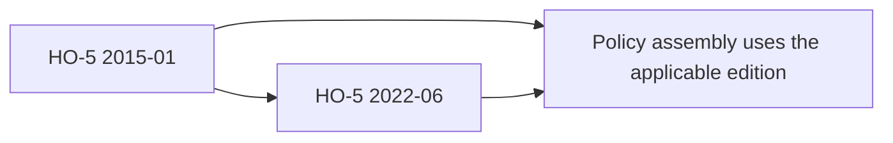
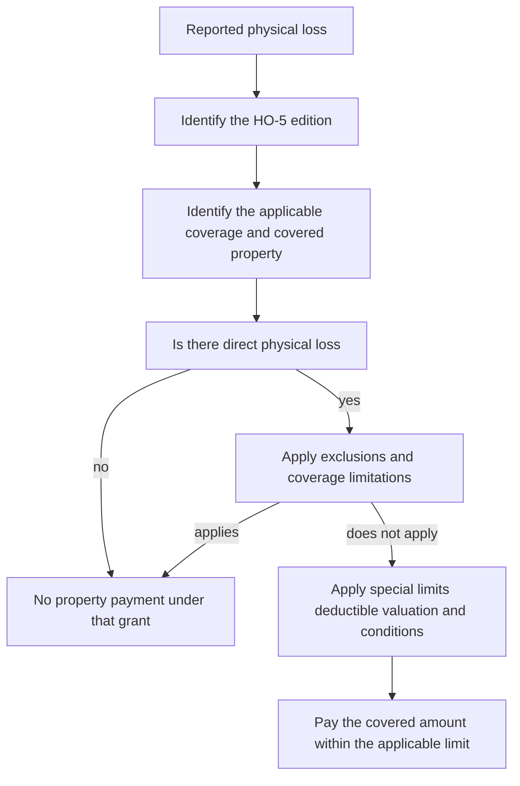

# HO-5 Comprehensive Form Editions

## Scope and edition selection

HO-5 is the **Homeowners 5 — Comprehensive Form**. This page covers the two editions in the repository: **2015-01** and **2022-06**. The 2015-01 form is superseded by 2022-06 for policies effective on or after **June 1, 2022**, but it remains applicable to policies written under the older edition. The later edition is not retroactive merely because it is available in the form library. ([2015-01, edition notice](repo://forms/HO/MS/HO-5/2015-01.md#L1-L9))

*The diagram shows the supersession relationship; the policy's applicable edition remains the starting point for every coverage and condition decision.*

Read the declarations, the applicable HO-5 edition, and every attached endorsement together. A later edition, an endorsement, or a state attachment may change a result only within the scope stated by that document. The form's own agreement makes coverage conditional on its terms, exclusions, limits, and insured duties; the 2022-06 agreement also expressly makes failure to perform a post-loss duty material when it prejudices the insurer. ([2015-01, AGR](repo://forms/HO/MS/HO-5/2015-01.md#L13-L39); [2022-06, AGR](repo://forms/HO/MS/HO-5/2022-06.md#L13-L33))

## Coverage decision: open-peril property treatment

Both editions use a broad **risk of direct physical loss** property grant rather than a short named-peril list. That does not mean every loss is covered. The loss must physically alter, damage, or destroy covered property, and it remains subject to the applicable coverage limit, deductible, exclusions, location rules, special limits, and claim conditions. The 2015-01 peril section states the direct-physical-loss grant and excludes diminution in value, loss of use, loss of market, and loss of opportunity unless expressly covered; 2022-06 uses the same risk-of-loss structure. ([2015-01, P.1–P.3](repo://forms/HO/MS/HO-5/2015-01.md#L566-L574); [2022-06, P.1–P.3](repo://forms/HO/MS/HO-5/2022-06.md#L609-L615))

For Coverage C, this means that unexplained disappearance is not automatically payable. The 2015-01 edition excludes mysterious disappearance but preserves theft when there is evidence theft occurred; 2022-06 has the same rule. ([2015-01, P.36–P.39](repo://forms/HO/MS/HO-5/2015-01.md#L634-L648); [2022-06, P.32–P.36](repo://forms/HO/MS/HO-5/2022-06.md#L673-L681))

*This flow summarizes the form's decision order; it does not replace the wording of the applicable edition or an attached modification.*

### Recurring property boundaries

The open-peril grant is bounded by recurring exclusions in both editions. Important boundaries include:

* **Water:** flood, surface water, waves, tidal water, overflow of a body of water, water below the surface of the ground, and sewer, drain, or sump backup are excluded. Accidental discharge from eligible plumbing, heating, air-conditioning, sprinkler, or household-appliance systems is treated separately, and the failed system or appliance is not automatically covered. ([2015-01, P.18–P.21 and P.46–P.47](repo://forms/HO/MS/HO-5/2015-01.md#L602-L606); [2022-06, P.6–P.13 and P.36](repo://forms/HO/MS/HO-5/2022-06.md#L621-L635))
* **Earth movement and law:** earth movement, governmental seizure or destruction, nuclear hazard, and ordinance-or-law costs are excluded from the base property coverage. The 2022-06 form separately points to an ordinance-or-law endorsement and a water-backup endorsement as possible modifiers, but a limit or reference does not itself restore excluded coverage. ([2015-01, P.4–P.7 and P.16–P.24](repo://forms/HO/MS/HO-5/2015-01.md#L574-L614); [2022-06, X.1–X.14](repo://forms/HO/MS/HO-5/2022-06.md#L751-L783))
* **Condition and workmanship:** wear, deterioration, rust or corrosion, mechanical breakdown, inherent or latent defect, mold or microbial conditions, faulty design or workmanship, settling, and repeated seepage or leakage are excluded as stated by the edition. Both forms preserve ensuing direct physical loss only where their wording makes the resulting loss independently covered. ([2015-01, P.3–P.15](repo://forms/HO/MS/HO-5/2015-01.md#L572-L598); [2022-06, P.20–P.29](repo://forms/HO/MS/HO-5/2022-06.md#L649-L667))
* **Vacancy, theft, and weather entry:** vacancy can remove vandalism or malicious-mischief coverage and can affect freezing; theft restrictions apply to construction, rented portions, or theft by an insured or other excluded person. Rain, snow, sleet, sand, or dust entering through an opening not created by a covered peril is excluded. The 2022-06 edition adds explicit roof-surfacing settlement and cosmetic-roof provisions. ([2015-01, P.34–P.38 and P.51–P.59](repo://forms/HO/MS/HO-5/2015-01.md#L634-L684); [2022-06, P.32–P.48](repo://forms/HO/MS/HO-5/2022-06.md#L673-L707))

## Coverages A–D

The declarations supply the Coverage A limit. The standard percentage limits below are form provisions, not a promise that a particular declarations page uses a different or higher amount. Coverage-specific payment remains subject to the applicable deductible and exclusions.

| Coverage | 2015-01 | 2022-06 | Material reading |
|---|---|---|---|
| **A — Dwelling** | Dwelling, attached structures, service property, and construction materials. Replacement cost applies when Coverage A is at least **80%** of full replacement cost; otherwise payment is no more than ACV until repair or replacement. ([A.1–A.9](repo://forms/HO/MS/HO-5/2015-01.md#L108-L126)) | Dwelling, attached structures, fixtures, service equipment, and qualifying materials. The same **80%** threshold applies; otherwise the form settles at ACV. Roof surfacing is stated to settle at replacement cost unless an ACV roof-schedule endorsement applies. ([A.1–A.13](repo://forms/HO/MS/HO-5/2022-06.md#L107-L135)) | Both use replacement cost subject to an 80% threshold, but 2022-06 makes roof-surfacing treatment and the ACV endorsement interaction explicit. Payment is limited to like kind and quality and does not pay for improvements or market-value diminution. |
| **B — Other Structures** | Other structures on the residence premises, separated by clear space or connected only by a fence, utility line, or similar connection; limit **10% of Coverage A**. Business, rental, agricultural, commercial, and manufacturing restrictions apply, with private-garage exceptions. ([B.1–B.19](repo://forms/HO/MS/HO-5/2015-01.md#L187-L224)) | Other structures on the residence premises and separated from the dwelling; limit **10% of Coverage A**, expressly described as additional insurance. Business and non-tenant rental restrictions remain, with a private-garage exception. ([B.1–B.15](repo://forms/HO/MS/HO-5/2022-06.md#L183-L213)) | Personal property stored in an other structure does not become Coverage B merely because it is stored there. ([2022-06, B.8–B.10](repo://forms/HO/MS/HO-5/2022-06.md#L199-L205)) |
| **C — Personal Property** | Personal property owned or used by an insured, anywhere in the world; limit **50% of Coverage A**. Property of others at the residence can be covered at the insured's request. ([C.1–C.6](repo://forms/HO/MS/HO-5/2015-01.md#L252-L266)) | Personal property owned or used by an insured, including property of others in the insured's care, property of guests or residence employees when requested, qualifying student property, and property moved, stored, repaired, or transported; limit **50% of Coverage A**. ([C.1–C.10](repo://forms/HO/MS/HO-5/2022-06.md#L251-L271)) | 2022-06 spells out more locations, custody situations, acquired property, and disappearance treatment, while retaining the 50% aggregate Coverage C limit. |
| **D — Loss of Use** | Limit **20% of Coverage A**, collectively for Additional Living Expense, Fair Rental Value, and civil-authority loss of use. Payment is for the necessary increase or lost rental value for the shortest time required to repair, replace, or settle elsewhere. ([D.1–D.24](repo://forms/HO/MS/HO-5/2015-01.md#L368-L416)) | Limit **20% of Coverage A**. It covers Additional Living Expense and Fair Rental Value when covered physical loss makes the residence or rented part unfit, plus qualifying civil-authority loss of use; ordinary expenses, voluntary relocation, and avoidable increases are not covered. ([D.1–D.23](repo://forms/HO/MS/HO-5/2022-06.md#L413-L459)) | Payments for the different Section I loss-of-use benefits draw on the same Coverage D limit; records and mitigation are required. |

### Coverage C special limits and valuation

Coverage C is broad but not unlimited. In **2015-01**, the special limits are **$300** for money and precious metals, **$2,500** for theft of jewelry, watches, and precious stones, **$3,000** for theft of firearms, **$1,000** for watercraft and trailers, **$5,000** for theft of silverware, **$2,500** for business property on the residence premises, and **$1,000** for electronic apparatus in a motor vehicle. ([2015-01, C.11–C.18](repo://forms/HO/MS/HO-5/2015-01.md#L274-L290)) Personal-property value is determined at the time of loss with consideration of age, condition, quality, usefulness, and depreciation; repair, replacement, or like-kind payment remains subject to the applicable limit. ([2015-01, C.19–C.23](repo://forms/HO/MS/HO-5/2015-01.md#L288-L298))

In **2022-06**, the corresponding limits are **$300** for money, bank notes, bullion, precious metals, and stored-value cards, **$3,000** for theft of jewelry, watches, and precious or semiprecious stones, **$3,500** for theft of firearms and related equipment, **$2,000** for watercraft including trailer and accessories, **$5,000** for theft of silverware and specified precious-metal-plated ware, **$5,000** for business property on the residence premises, and **$2,000** for electronic apparatus in or upon a motor vehicle. ([2022-06, C.11–C.18](repo://forms/HO/MS/HO-5/2022-06.md#L273-L287)) These are material increases for jewelry, firearms, watercraft, business property, and vehicle electronic apparatus; they do not increase the 50% Coverage C limit or eliminate exclusions. The form also expressly covers disappearance as a risk of direct physical loss while separately excluding mysterious disappearance and unexplained loss. ([2022-06, C.6–C.10 and P.32–P.36](repo://forms/HO/MS/HO-5/2022-06.md#L263-L271); [2022-06](repo://forms/HO/MS/HO-5/2022-06.md#L673-L681))

## Additional Coverages and edition differences

The additional-coverages package is largely aligned between the supplied editions, so the edition should not be changed merely because a later form lists the same benefit. In **2015-01**, debris removal receives an additional **10%** when direct-loss payment reaches the applicable limit; trees, shrubs, and plants are covered at **5% of Coverage A** with a **$1,000 per-item** limit; the fire-department service charge is **$1,000**; credit-card, fund-transfer-card, forgery, and counterfeit loss is **$2,500**; loss assessment is **$2,500**; ordinance-or-law coverage is **15% of Coverage A** within the Coverage A limit; landlord's furnishings are **$2,500**; grave markers are **$7,500**; and refrigerated property is **$1,500**. ([2015-01, Additional Coverages](repo://forms/HO/MS/HO-5/2015-01.md#L461-L507); [2015-01, continued](repo://forms/HO/MS/HO-5/2015-01.md#L509-L589))

The 2022-06 text states the same principal additional-coverage amounts and the same basic debris-removal structure: the ordinary debris amount is within the applicable limit, with an additional **10%** when that limit is exhausted. It likewise states **5% of Coverage A** and **$1,000 per item** for trees, shrubs, and plants; **$1,000** for the fire-department service charge; **$2,500** for card, forgery, and counterfeit loss; **$2,500** for loss assessment; **15% of Coverage A** for ordinance-or-law coverage within Coverage A; **$2,500** for landlord's furnishings; **$7,500** for grave markers; and **$1,500** for refrigerated property. ([2022-06, Additional Coverages](repo://forms/HO/MS/HO-5/2022-06.md#L461-L505); [2022-06, continued](repo://forms/HO/MS/HO-5/2022-06.md#L509-L589))

The material edition differences for this topic are therefore mainly in wording and surrounding claim administration, not the listed amounts. Both editions limit vegetation coverage to specified covered causes and exclude windstorm or hail, and both require that an additional-coverage claim satisfy the applicable exclusions and conditions. ([2015-01, E.13–E.20](repo://forms/HO/MS/HO-5/2015-01.md#L487-L501); [2022-06, E.13–E.20](repo://forms/HO/MS/HO-5/2022-06.md#L487-L501))

## Section II: Coverages E and F

**Coverage E — Personal Liability** pays damages for which an insured is legally liable because of bodily injury or property damage caused by an occurrence, and it provides a defense for a covered suit. The declarations supply the occurrence limit; the limit is the most payable for all damages from that occurrence, and the duty to defend ends when the applicable limit has been exhausted. The 2015-01 form states this structure in E.1–E.9; 2022-06 retains it and expressly describes coverage territory and counsel selected by the insurer. ([2015-01, II.E](repo://forms/HO/MS/HO-5/2015-01.md#L986-L1004); [2022-06, II.E](repo://forms/HO/MS/HO-5/2022-06.md#L1167-L1183))

The major liability exclusions are consistent in function across editions: expected or intended injury, business and professional services, contractual liability, motor vehicle, watercraft, aircraft and hovercraft exposures, controlled substances, communicable disease, abuse, workers compensation obligations, and damage to property owned by, rented to, occupied by, used by, or in the care of an insured. The 2022-06 wording is more granular, adding explicit treatment for rental periods, business-entity roles, electronic data, privacy, weapons, premises, and pre-existing or known occurrences. ([2015-01, E.16–E.33](repo://forms/HO/MS/HO-5/2015-01.md#L1018-L1052); [2022-06, E.8–E.33](repo://forms/HO/MS/HO-5/2022-06.md#L1183-L1233))

**Coverage F — Medical Payments to Others** is no-fault medical-expense coverage, not an admission of liability. Both editions require necessary expenses to be incurred within **three years** after the accident, apply the declarations limit per injured person, and exclude the insured, regular household residents, workers-compensation situations, business and professional exposures, and several vehicle, watercraft, aircraft, intentional-injury, disease, abuse, war, and nuclear-hazard situations. ([2015-01, II.F](repo://forms/HO/MS/HO-5/2015-01.md#L1054-L1090); [2022-06, II.F](repo://forms/HO/MS/HO-5/2022-06.md#L1235-L1289))

Section II also contains additional coverages. The 2015-01 form pays up to **$2,500** for damage to property of others and provides loss-assessment coverage subject to its conditions. The 2022-06 form reduces the property-of-others amount to **$1,000**, while retaining first-aid, defense-expense, bond, judgment-interest, and loss-assessment provisions. ([2015-01, II.E2](repo://forms/HO/MS/HO-5/2015-01.md#L1393-L1459); [2022-06, II.E2](repo://forms/HO/MS/HO-5/2022-06.md#L1234-L1304))

## Conditions, settlement, and claim handling

The two editions use substantially similar claim mechanics, but the applicable edition controls every deadline and deductible rule:

| Requirement | 2015-01 | 2022-06 |
|---|---|---|
| **Section I deductible** | Declarations deductible, with a minimum of **$1,000**. If more than one deductible could apply, the form applies the one applicable to the cause and ordinarily not more than one to the same part of a loss. ([S.1–S.8](repo://forms/HO/MS/HO-5/2015-01.md#L820-L836)) | Declarations deductible, with a minimum of **$1,000**. If more than one could apply, the form applies the deductible producing the greater reduction in payment. ([S.1–S.5](repo://forms/HO/MS/HO-5/2022-06.md#L937-L947)) |
| **Notice and mitigation** | Prompt notice; notify law enforcement for theft; protect property, make reasonable temporary repairs, preserve damaged property, and keep repair records. ([S.9–S.18](repo://forms/HO/MS/HO-5/2015-01.md#L838-L856)) | Prompt notice; notify law enforcement for theft, vandalism, or criminal damage; protect and preserve property, and provide access, records, and evidence. ([S.6–S.18](repo://forms/HO/MS/HO-5/2022-06.md#L949-L973)) |
| **Proof of loss** | Signed, sworn proof within **60 days after request**, including time and cause, interests, other insurance, ACV and amount of loss for each item, and supporting expenses. ([S.28–S.32](repo://forms/HO/MS/HO-5/2015-01.md#L876-L884)) | Signed, sworn proof within **60 days after request**, including time and cause, interests, other insurance, ACV and amount of loss for each item, deductible, and supporting expenses. ([S.22–S.27](repo://forms/HO/MS/HO-5/2022-06.md#L981-L997)) |
| **Appraisal** | Written demand when the parties disagree on amount; each appraiser selected within **20 days**; appraisal determines only amount of loss, not coverage, interpretation, causation, or whether payment is owed. ([S.33–S.39](repo://forms/HO/MS/HO-5/2015-01.md#L886-L898)) | Written demand when the parties disagree on amount; each appraiser selected within **20 days**; appraisal does not decide coverage, interpretation, causation, exclusions, or conditions. ([S.49–S.56](repo://forms/HO/MS/HO-5/2022-06.md#L1035-L1049)) |
| **Payment** | Payment within **60 days after agreement**; ACV may be paid before repair or replacement when permitted, with evidence required for replacement-cost payment. ([S.40–S.44](repo://forms/HO/MS/HO-5/2015-01.md#L900-L908)) | Payment within **60 days after agreement**; undisputed amounts may be paid earlier, and payment after appraisal remains subject to coverage and conditions. ([S.57–S.60](repo://forms/HO/MS/HO-5/2022-06.md#L1051-L1057)) |
| **Prejudice and insured duties** | Duties apply individually, and failure can affect the insured's rights under the form's conditions. ([G.3–G.12 and G.39–G.40](repo://forms/HO/MS/HO-5/2015-01.md#L1561-L1585); [2015-01](repo://forms/HO/MS/HO-5/2015-01.md#L1635-L1639)) | The form expressly states that failure to perform a duty does not invalidate coverage unless the failure materially prejudices the insurer, and that duties apply individually to each insured. ([S.1–S.4 and S.85–S.87](repo://forms/HO/MS/HO-5/2022-06.md#L1306-L1318); [2022-06](repo://forms/HO/MS/HO-5/2022-06.md#L1107-L1111)) |

The 2022-06 form also states that the insurer may delay payment while material information needed to determine coverage or amount remains unavailable, and that an appraisal award does not require payment for property or loss outside the policy. ([2022-06, S.55–S.60](repo://forms/HO/MS/HO-5/2022-06.md#L1047-L1057)) Neither edition turns appraisal into a coverage determination.

## Personal-property endorsement interaction

### HO 05 24 Special Personal Property Coverage

**HO 05 24 Special Personal Property Coverage + the applicable HO-5 policy:** read **HO 05 24 first as the acting document**, then read the applicable HO-5 edition for provisions it does not change. The endorsement says it changes the policy only as stated, applies policy definitions and conditions, and controls to the extent of a conflict; otherwise the two documents apply together. It also says that property ineligible under the policy remains ineligible unless the endorsement provides otherwise. ([HO 05 24, attachment and precedence](repo://forms/HO/MS/HO-05-24/2018-09.md#L13-L39))

This interaction must be verified against the policy assembly: the repository metadata identifies HO 05 24 as an **HO-3** endorsement, not an HO-5 form. It therefore should not be assumed to attach to every HO-5. If it is attached, the endorsement supplies its own personal-property grant and exclusions, including coverage at or away from the residence premises, but excludes buildings, property held for sale, many business and electronic-data losses, mysterious disappearance, and other listed causes. ([HO 05 24, metadata](repo://forms/HO/MS/HO-05-24/2018-09.md#L1-L8); [HO 05 24, W.1](repo://forms/HO/MS/HO-05-24/2018-09.md#L41-L75); [HO 05 24, exclusions](repo://forms/HO/MS/HO-05-24/2018-09.md#L101-L137))

The endorsement's applicable limit is the most payable for all covered property in an occurrence, and its theft limit for jewelry, watches, and precious stones is **$2,500**. It does not create a separate limit merely because there are multiple items, insureds, or locations; payment remains subject to valuation, deductible, and the endorsement's exclusions. ([HO 05 24, limits](repo://forms/HO/MS/HO-05-24/2018-09.md#L141-L177); [HO 05 24, deductible](repo://forms/HO/MS/HO-05-24/2018-09.md#L209-L229)) On an HO-5 assembly, do not treat HO 05 24 as an automatic way to increase the HO-5 Coverage C limit or its edition-specific special limits. First establish that the endorsement is attached and identify the exact provision it modifies; then apply the endorsement's conflicting rule and the remaining HO-5 provisions together.

### Scheduled property and increased special limits

**HO 04 61 Scheduled Personal Property + the applicable HO-5 policy:** read **HO 04 61 first as the acting document**, then the HO-5 edition for the remaining policy terms. The schedule identifies the insured item and its applicable limit; property not described in the schedule is not scheduled property. The 2020-11 version covers scheduled property worldwide, including theft, qualifying disappearance, breakage, and accidental damage, subject to the schedule limit and policy conditions. ([HO 04 61, 2020-11](repo://forms/HO/MS/HO-04-61/2020-11.md#L13-L53); [HO 04 61 coverage](repo://forms/HO/MS/HO-04-61/2020-11.md#L55-L91)) The earlier 2012-02 version likewise makes the schedule control the described item and limit, so the edition of the endorsement matters. ([HO 04 61, 2012-02](repo://forms/HO/MS/HO-04-61/2012-02.md#L13-L49)) The 2012-02 deductible is **zero dollars** for scheduled personal property; do not carry that deductible to the 2020-11 endorsement, whose applicable settlement and deductible provisions must be read from its own text. ([2012-02 deductible](repo://forms/HO/MS/HO-04-61/2012-02.md#L317-L337); [2020-11 settlement](repo://forms/HO/MS/HO-04-61/2020-11.md#L817-L829))

**HO 04 65 Coverage C — Increased Special Limits + the applicable HO-5 policy:** read **HO 04 65 first as the acting document**, then the HO-5 edition. The endorsement changes only the Coverage C special limits expressly increased; it does not create coverage, change the peril, remove exclusions, change valuation, or eliminate a deductible. ([HO 04 65 scope](repo://forms/HO/MS/HO-04-65/2018-09.md#L45-L77); [HO 04 65 unchanged terms](repo://forms/HO/MS/HO-04-65/2018-09.md#L147-L155)) Its stated theft limits are **$5,000** for jewelry, watches, and precious stones, **$6,500** for firearms, and **$10,000** for silverware. ([HO 04 65 limits](repo://forms/HO/MS/HO-04-65/2018-09.md#L157-L181)) The repository metadata also labels HO 04 65 as HO-3, so attachment and compatibility must be confirmed rather than presumed for an HO-5 policy. ([HO 04 65 metadata](repo://forms/HO/MS/HO-04-65/2018-09.md#L1-L8))

## Edition-safe checklist

1. Identify whether the loss is governed by **2015-01** or **2022-06**; do not use a later limit, exclusion, roof rule, or deadline retroactively.
2. Read the declarations for Coverage A and the Section II limits, then calculate the form percentages only where the applicable edition states them.
3. Classify the loss under Coverage A, B, C, D, E, F, or an additional coverage. Personal property stored in an other structure remains Coverage C property when it qualifies; storage does not convert it to Coverage B.
4. For property, establish direct physical loss, apply the applicable open-peril grant, then test exclusions, location rules, special limits, deductible, valuation, and duties.
5. For water, theft, vacancy, roof, business-property, or disappearance losses, use the exact edition wording and check for a specifically attached endorsement before applying or denying a modification.
6. For an endorsement, name the acting document first and read it with the base HO-5: **endorsement first, then unchanged HO-5 terms**. Verify that an endorsement labeled HO-3 is actually part of the policy assembly before applying it to HO-5.
7. Treat appraisal as an amount-of-loss mechanism only. Preserve inspection evidence, inventories, receipts, proof of loss, recovery rights, and the applicable 60-day and 20-day deadlines.

## Source set

* [HO-5 2015-01](repo://forms/HO/MS/HO-5/2015-01.md)
* [HO-5 2022-06](repo://forms/HO/MS/HO-5/2022-06.md)
* [HO 04 61 Scheduled Personal Property 2012-02](repo://forms/HO/MS/HO-04-61/2012-02.md)
* [HO 04 61 Scheduled Personal Property 2020-11](repo://forms/HO/MS/HO-04-61/2020-11.md)
* [HO 04 65 Coverage C — Increased Special Limits 2018-09](repo://forms/HO/MS/HO-04-65/2018-09.md)
* [HO 05 24 Special Personal Property Coverage 2018-09](repo://forms/HO/MS/HO-05-24/2018-09.md)
