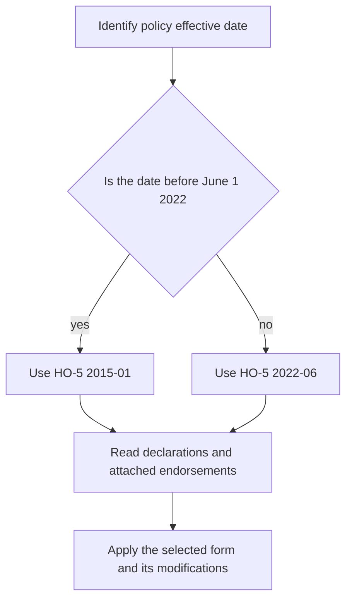
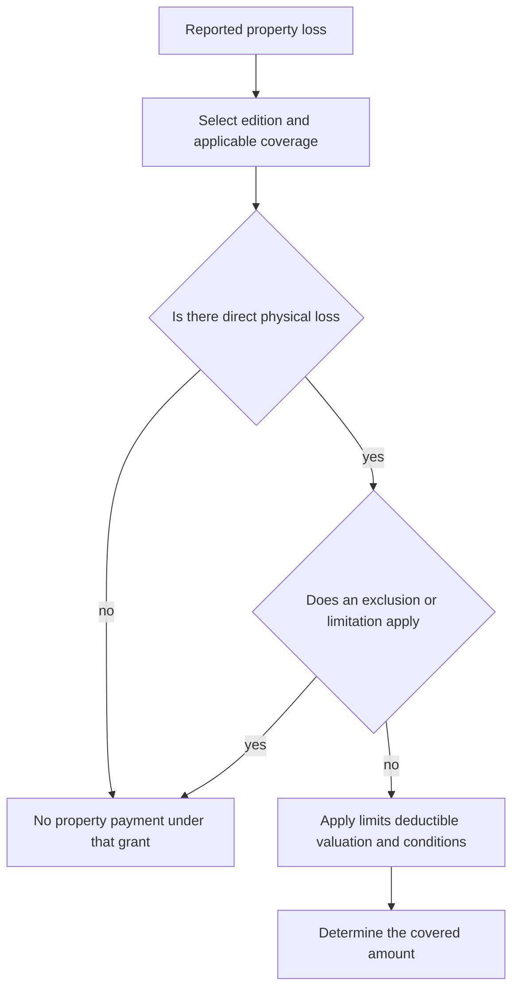

# HO-5 Comprehensive Form Editions

## Scope, governing edition, and contract authority

This page covers the repository's **HO-5 Homeowners 5 — Comprehensive Form** editions **2015-01** and **2022-06**. The 2015-01 form is superseded by 2022-06 for policies effective on or after **June 1, 2022**, but remains applicable to policies written under the older edition. The later form is not retroactive merely because it is available in the form library. ([2015-01 form header and supersession notice](repo://forms/HO/MS/HO-5/2015-01.md#L1-L9); [2022-06 form header](repo://forms/HO/MS/HO-5/2022-06.md#L1-L7))

*The diagram shows the edition-selection and policy-assembly path; the effective-date evidence and issued policy package control.*

The declarations, selected HO-5 edition, and every attached endorsement must be read together. The base form supplies the contractual grant, exclusions, limits, valuation, and duties. An endorsement changes that contract only within its stated scope. Filing memoranda, training, and operational guidance can explain a revision or identify questions, but they cannot add, remove, or rewrite coverage. ([2015-01 agreement](repo://forms/HO/MS/HO-5/2015-01.md#L13-L39); [2022-06 agreement](repo://forms/HO/MS/HO-5/2022-06.md#L13-L33); [guidance versus contract](repo://training/guidance-versus-contract.md#L15-L23); [edition-selection guidance](repo://training/choosing-the-governing-edition.md#L15-L35))

## Open-peril property treatment

Both editions insure against **risk of direct physical loss** to covered property rather than using a short named-peril list. The grant is not automatic payment for every reported problem: the property must suffer the type of direct physical loss described by the form, and the result remains subject to the applicable location rules, limits, deductible, valuation provisions, exclusions, and post-loss conditions. ([2015-01, P.1–P.3](repo://forms/HO/MS/HO-5/2015-01.md#L566-L574); [2022-06, P.1–P.3](repo://forms/HO/MS/HO-5/2022-06.md#L609-L615))

For Coverage C, disappearance is not automatically covered. Both editions exclude mysterious or unexplained disappearance but preserve theft when the evidence establishes that theft occurred. ([2015-01, P.36–P.39](repo://forms/HO/MS/HO-5/2015-01.md#L634-L648); [2022-06, P.32–P.36](repo://forms/HO/MS/HO-5/2022-06.md#L673-L681))

*This flow summarizes the property-claim sequence in the forms; it does not replace the applicable edition or an attached modification.*

### Recurring property boundaries

The open-peril grant must remain distinct from a named-peril position or an endorsement-specific grant. Important boundaries in the base forms include:

* **Water:** both editions exclude flood, surface water, waves or tidal water, underground water, and sewer, drain, or sump backup. The forms treat accidental discharge from eligible systems separately, while the failed system or appliance is not automatically covered. Verify a specifically attached water-backup endorsement rather than treating a limit or a reference as coverage. ([2015-01, P.18–P.21](repo://forms/HO/MS/HO-5/2015-01.md#L602-L608); [2022-06, P.6–P.13](repo://forms/HO/MS/HO-5/2022-06.md#L621-L635))
* **Earth movement and law:** earth movement, governmental seizure or destruction, nuclear hazard, and ordinance-or-law costs are excluded from base property coverage, subject to the form's stated exceptions and any attached modification. ([2015-01, P.16–P.28](repo://forms/HO/MS/HO-5/2015-01.md#L598-L622); [2022-06, P.4–P.19](repo://forms/HO/MS/HO-5/2022-06.md#L617-L647))
* **Condition and workmanship:** deterioration, corrosion, mechanical breakdown, inherent or latent defect, mold or microbial conditions, faulty design or workmanship, settling, and repeated seepage or leakage are excluded as stated by each edition. Resulting direct physical loss is preserved only where the wording independently covers it. ([2015-01, P.3–P.15](repo://forms/HO/MS/HO-5/2015-01.md#L572-L598); [2022-06, P.20–P.29](repo://forms/HO/MS/HO-5/2022-06.md#L649-L667))
* **Vacancy, theft, and entry:** vacancy can affect vandalism, malicious mischief, and freezing coverage; theft restrictions apply to construction, excluded persons, and entrusted property. Rain, snow, sleet, sand, or debris entering through an opening not created by a covered peril is excluded. 2022-06 also addresses roof-covering condition, roof settlement administration, and roof surfacing settlement terms. ([2015-01, P.34–P.39 and P.51–P.59](repo://forms/HO/MS/HO-5/2015-01.md#L634-L684); [2022-06, P.32–P.48 and A.9–A.22](repo://forms/HO/MS/HO-5/2022-06.md#L673-L707); [2022-06, Coverage A](repo://forms/HO/MS/HO-5/2022-06.md#L125-L151))

## Coverages A–D

The declarations supply the selected limits. The percentages below are form provisions, not a statement that every declarations page uses a particular limit beyond what the applicable form provides. Payment remains subject to the edition's deductible, valuation, exclusions, and conditions.

| Coverage | 2015-01 | 2022-06 |
|---|---|---|
| **A — Dwelling** | Covers the dwelling, attached structures, service property, and qualifying construction materials. Replacement cost applies when Coverage A is at least **80%** of full replacement cost; otherwise the form uses actual cash value until the applicable repair or replacement terms are met. ([A.1–A.9](repo://forms/HO/MS/HO-5/2015-01.md#L108-L126)) | Covers the dwelling, attached structures, fixtures, service equipment, and qualifying materials. The same **80%** threshold applies. The form states replacement-cost settlement for roof surfacing unless an actual-cash-value roof-schedule endorsement applies. ([A.1–A.13](repo://forms/HO/MS/HO-5/2022-06.md#L107-L145)) |
| **B — Other Structures** | Covers qualifying other structures on the residence premises, including structures separated by clear space or connected only by a fence, utility line, or similar connection; the limit is **10% of Coverage A**. ([B.1–B.19](repo://forms/HO/MS/HO-5/2015-01.md#L187-L224)) | Covers qualifying other structures separated from the dwelling; the limit is **10% of Coverage A** and is described as additional insurance. Business and non-tenant rental restrictions remain, subject to stated exceptions. ([B.1–B.15](repo://forms/HO/MS/HO-5/2022-06.md#L183-L213)) |
| **C — Personal Property** | Covers personal property owned or used by an insured anywhere in the world; the limit is **50% of Coverage A**. Property of others at the residence can be covered at the insured's request. ([C.1–C.6](repo://forms/HO/MS/HO-5/2015-01.md#L252-L266)) | Covers personal property owned or used by an insured, including qualifying property of others, guests, residence employees, students, temporarily relocated insureds, and property moved, stored, repaired, or transported; the limit is **50% of Coverage A**. ([C.1–C.10](repo://forms/HO/MS/HO-5/2022-06.md#L251-L271)) |
| **D — Loss of Use** | Limit **20% of Coverage A**, collectively for Additional Living Expense, Fair Rental Value, and qualifying civil-authority loss of use. ([D.1–D.24](repo://forms/HO/MS/HO-5/2015-01.md#L368-L416)) | Limit **20% of Coverage A** for Additional Living Expense, Fair Rental Value, and qualifying civil-authority loss of use when a covered loss makes the residence or rented portion unfit. ([D.1–D.23](repo://forms/HO/MS/HO-5/2022-06.md#L413-L459)) |

Personal property stored in an other structure does not become Coverage B merely because of storage; classify the property and structure under the applicable coverage wording. ([2022-06, B.8–B.10](repo://forms/HO/MS/HO-5/2022-06.md#L199-L205))

### Coverage C special limits and valuation

Coverage C is broad but not unlimited. In **2015-01**, the special limits are **$300** for money and precious metals, **$2,500** for theft of jewelry, watches, and precious stones, **$3,000** for theft of firearms, **$1,000** for watercraft and trailers, **$5,000** for theft of silverware, **$2,500** for business property on the residence premises, and **$1,000** for electronic apparatus in a motor vehicle. ([2015-01, C.11–C.18](repo://forms/HO/MS/HO-5/2015-01.md#L274-L290))

In **2022-06**, the corresponding limits are **$300** for money, bank notes, bullion, precious metals, and stored-value cards, **$3,000** for theft of jewelry, watches, and precious or semiprecious stones, **$3,500** for theft of firearms and related equipment, **$2,000** for watercraft including trailer and accessories, **$5,000** for theft of silverware and specified precious-metal-plated ware, **$5,000** for business property on the residence premises, and **$2,000** for electronic apparatus in or upon a motor vehicle. These are material increases in the identified categories; they do not increase the 50% Coverage C limit or eliminate exclusions. ([2022-06, C.11–C.18](repo://forms/HO/MS/HO-5/2022-06.md#L273-L287))

The 2015-01 form determines personal-property value at the time of loss using factors including age, condition, quality, usefulness, and depreciation. Both editions keep special limits within the applicable Coverage C limit. ([2015-01, C.19–C.23](repo://forms/HO/MS/HO-5/2015-01.md#L288-L298); [2022-06, C.18–C.19](repo://forms/HO/MS/HO-5/2022-06.md#L285-L289))

## Additional Coverages and edition differences

Additional Coverages remain subject to the applicable form's exclusions, limits, and duties. The editions are not interchangeable merely because they use similar headings.

| Additional coverage | 2015-01 | 2022-06 |
|---|---:|---:|
| Debris removal when the applicable limit is exhausted | Additional **10%** of the applicable limit ([E.10–E.11](repo://forms/HO/MS/HO-5/2015-01.md#L481-L485)) | Additional **10%** of the applicable limit ([E.10–E.11](repo://forms/HO/MS/HO-5/2022-06.md#L481-L485)) |
| Trees, shrubs, and plants | **5% of Coverage A**, **$1,000 per item** ([E.18–E.19](repo://forms/HO/MS/HO-5/2015-01.md#L497-L501)) | **5% of Coverage A**, **$1,000 per item** ([E.18–E.19](repo://forms/HO/MS/HO-5/2022-06.md#L497-L501)) |
| Fire-department service charge | **$500** ([E.23–E.25](repo://forms/HO/MS/HO-5/2015-01.md#L464-L468)) | **$1,000** ([E.21–E.23](repo://forms/HO/MS/HO-5/2022-06.md#L503-L507)) |
| Credit card, fund transfer card, forgery, and counterfeit money | **$500** ([E.30–E.32](repo://forms/HO/MS/HO-5/2015-01.md#L478-L484)) | **$2,500** ([E.24–E.27](repo://forms/HO/MS/HO-5/2022-06.md#L509-L515)) |
| Loss assessment | **$1,000** ([E.39–E.41](repo://forms/HO/MS/HO-5/2015-01.md#L496-L502)) | **$2,500** ([E.31–E.33](repo://forms/HO/MS/HO-5/2022-06.md#L523-L529)) |
| Ordinance or law | **10% of Coverage A**, within the Coverage A limit ([E.64–E.66](repo://forms/HO/MS/HO-5/2015-01.md#L546-L552)) | **15% of Coverage A**, within the Coverage A limit ([E.37–E.41](repo://forms/HO/MS/HO-5/2022-06.md#L535-L543)) |
| Landlord's furnishings | **$2,500** ([E.57–E.60](repo://forms/HO/MS/HO-5/2015-01.md#L532-L538)) | **$2,500** ([E.44–E.49](repo://forms/HO/MS/HO-5/2022-06.md#L549-L559)) |
| Grave markers | **$5,000** ([E.68–E.69](repo://forms/HO/MS/HO-5/2015-01.md#L554-L557)) | **$7,500** ([E.50–E.52](repo://forms/HO/MS/HO-5/2022-06.md#L561-L567)) |
| Refrigerated property | **$500** ([E.70–E.72](repo://forms/HO/MS/HO-5/2015-01.md#L558-L564)) | **$1,500** ([E.56–E.59](repo://forms/HO/MS/HO-5/2022-06.md#L573-L579)) |

Both forms limit vegetation coverage to specified causes and exclude windstorm or hail. Additional-coverage payment does not bypass the applicable exclusions or post-loss duties. ([2015-01, E.13–E.20](repo://forms/HO/MS/HO-5/2015-01.md#L487-L501); [2022-06, E.13–E.20](repo://forms/HO/MS/HO-5/2022-06.md#L487-L501))

### What the 2022 filing memorandum explains

The 2022-06 filing memorandum describes the revision's stated reasons, including the Coverage C limit increases, additional-coverage amount changes, clearer direct-loss and property descriptions, roof-settlement treatment, and more organized post-loss duties. Those explanations are interpretive filing material, not contractual grants or limits. The filed 2022-06 form controls when the memorandum's summary and operative wording differ. ([memorandum, Section I changes](repo://memoranda/HO-5-2022-06.md#L125-L181); [memorandum, exclusions and conditions](repo://memoranda/HO-5-2022-06.md#L291-L405); [memorandum, claim changes](repo://memoranda/HO-5-2022-06.md#L493-L515))

In particular, the memorandum describes a revised notice-of-loss requirement as a 60-day requirement, but the operative 2022-06 Section I condition states prompt notice and separately requires a signed, sworn proof of loss within 60 days after request. Apply the form's wording, not the memorandum as a substitute for it. ([memorandum M.5.1](repo://memoranda/HO-5-2022-06.md#L493-L499); [2022-06, S.6 and S.22](repo://forms/HO/MS/HO-5/2022-06.md#L949-L955); [2022-06, S.22–S.27](repo://forms/HO/MS/HO-5/2022-06.md#L981-L991))

## Section II: Coverages E and F

**Coverage E — Personal Liability** pays damages for which an insured is legally liable because of bodily injury or property damage caused by an occurrence and provides a defense for a covered suit. The declarations supply the occurrence limit; the applicable limit is the most payable for all damages from that occurrence, and the duty to defend ends when the limit has been exhausted by payment. ([2015-01, II.E](repo://forms/HO/MS/HO-5/2015-01.md#L986-L1004); [2022-06, II.E](repo://forms/HO/MS/HO-5/2022-06.md#L1167-L1183))

The liability exclusions in both editions address expected or intended injury, business and professional services, contractual liability, motor vehicle, watercraft, aircraft and hovercraft exposures, controlled substances, communicable disease, abuse, workers-compensation obligations, and damage to property owned by, rented to, occupied by, used by, or in an insured's care. Exact exceptions and wording remain edition-specific. ([2015-01, II.E exclusions](repo://forms/HO/MS/HO-5/2015-01.md#L1018-L1052); [2022-06, II.E exclusions](repo://forms/HO/MS/HO-5/2022-06.md#L1183-L1233))

**Coverage F — Medical Payments to Others** is no-fault medical-expense coverage, not an admission of liability. Both editions require necessary expenses to be incurred within **three years** after the accident, apply the declarations limit per injured person, and exclude the insured, regular household residents, workers-compensation situations, business and professional exposures, and specified vehicle, watercraft, aircraft, intentional-injury, disease, abuse, war, and nuclear-hazard situations. ([2015-01, II.F](repo://forms/HO/MS/HO-5/2015-01.md#L1054-L1090); [2022-06, II.F](repo://forms/HO/MS/HO-5/2022-06.md#L1235-L1289))

Section II additional coverages include first-aid and defense expenses, bond premiums, judgment interest, damage to property of others, and loss assessment. The property-of-others limit is **$1,000** in 2015-01 and **$2,500** in 2022-06; the 2022 amount is an increase, not a reduction. ([2015-01, II.5–II.14](repo://forms/HO/MS/HO-5/2015-01.md#L1244-L1268); [2022-06, II.1–II.22](repo://forms/HO/MS/HO-5/2022-06.md#L1395-L1437))

## Conditions, settlement, and claim handling

The applicable edition controls every deadline and deductible rule. The recurring workflow is notice and mitigation, preservation and inspection, documentation and proof of loss, appraisal only if needed for amount, and payment under the form's settlement conditions.

| Requirement | 2015-01 | 2022-06 |
|---|---|---|
| **Section I deductible** | The declarations deductible applies, with a minimum of **$1,000**. If more than one deductible could apply, the form applies the deductible applicable to the cause and ordinarily does not apply more than one deductible to the same part of a loss. ([S.1–S.8](repo://forms/HO/MS/HO-5/2015-01.md#L822-L836)) | The declarations deductible applies, with a minimum of **$1,000**. If more than one could apply, the form applies the deductible producing the greater reduction in payment. ([S.1–S.5](repo://forms/HO/MS/HO-5/2022-06.md#L939-L947)) |
| **Notice and mitigation** | Prompt notice; notify law enforcement for theft; protect property, make reasonable temporary repairs, preserve damaged property, and keep repair records. ([S.9–S.18](repo://forms/HO/MS/HO-5/2015-01.md#L838-L856)) | Prompt notice; notify law enforcement for theft, vandalism, or criminal damage; protect and preserve property, and provide access, records, and evidence. ([S.6–S.18](repo://forms/HO/MS/HO-5/2022-06.md#L949-L973)) |
| **Proof of loss** | Signed, sworn proof within **60 days after request**, including time and cause, interests, other insurance, actual cash value and amount of loss for each item, and supporting expenses. ([S.28–S.32](repo://forms/HO/MS/HO-5/2015-01.md#L876-L884)) | Signed, sworn proof within **60 days after request**, including time and cause, interests, other insurance, actual cash value and amount of loss for each item, deductible, and supporting expenses. ([S.22–S.27](repo://forms/HO/MS/HO-5/2022-06.md#L981-L991)) |
| **Appraisal** | Written demand when the parties disagree on amount; each appraiser selected within **20 days**; appraisal determines only amount of loss, not coverage, interpretation, causation, or whether payment is owed. ([S.33–S.39](repo://forms/HO/MS/HO-5/2015-01.md#L886-L898)) | Written demand when the parties disagree on amount; each appraiser selected within **20 days**; appraisal does not decide coverage, interpretation, causation, exclusions, or conditions. ([S.49–S.56](repo://forms/HO/MS/HO-5/2022-06.md#L1035-L1049)) |
| **Payment** | Payment within **60 days after agreement**; actual cash value may be paid before repair or replacement when permitted, with evidence required for replacement-cost payment. ([S.40–S.44](repo://forms/HO/MS/HO-5/2015-01.md#L900-L908)) | Payment within **60 days after agreement**; undisputed amounts may be paid earlier, and payment after appraisal remains subject to coverage and conditions. ([S.57–S.60](repo://forms/HO/MS/HO-5/2022-06.md#L1051-L1057)) |
| **Duties and prejudice** | Duties apply to the insured under the form and are conditions of coverage; the form requires cooperation, records, inspection, sworn statements, and recovery-right preservation. ([2015-01 agreement](repo://forms/HO/MS/HO-5/2015-01.md#L15-L29); [2015-01 conditions](repo://forms/HO/MS/HO-5/2015-01.md#L1396-L1430)) | Failure to perform a post-loss duty may affect coverage when the failure prejudices the insurer; duties apply separately to each insured seeking coverage. ([2022-06 agreement](repo://forms/HO/MS/HO-5/2022-06.md#L15-L33); [2022-06, S.85–S.87](repo://forms/HO/MS/HO-5/2022-06.md#L1107-L1111)) |

The 2022-06 form also permits payment delay while material information needed to determine coverage or amount remains unavailable and says an appraisal award does not require payment for property or loss outside the policy. Neither edition turns appraisal into a coverage determination. ([2022-06, S.55–S.60](repo://forms/HO/MS/HO-5/2022-06.md#L1047-L1057); [2015-01 appraisal](repo://forms/HO/MS/HO-5/2015-01.md#L886-L898))

## Personal-property endorsement interaction

### HO 05 24 Special Personal Property Coverage

If **HO 05 24 Special Personal Property Coverage** is actually attached, read it first as the acting document for the property it changes, then apply the unchanged HO-5 provisions. The endorsement says it changes the policy only as stated, applies policy definitions and conditions, controls to the extent of a conflict, and does not make property eligible when the policy leaves it ineligible unless the endorsement provides otherwise. ([HO 05 24 attachment and precedence](repo://forms/HO/MS/HO-05-24/2018-09.md#L13-L39))

Attachment cannot be assumed: repository metadata identifies HO 05 24 as an **HO-3** endorsement, not an HO-5 form. If the issued policy nevertheless attaches it, its own personal-property grant, exclusions, and **$2,500** jewelry-theft limit must be applied with the remaining HO-5 terms. It excludes mysterious disappearance among other listed losses. ([HO 05 24 metadata](repo://forms/HO/MS/HO-05-24/2018-09.md#L1-L8); [HO 05 24 coverage and exclusions](repo://forms/HO/MS/HO-05-24/2018-09.md#L41-L75); [HO 05 24 limit](repo://forms/HO/MS/HO-05-24/2018-09.md#L141-L177))

### Scheduled property and increased special limits

**HO 04 61 Scheduled Personal Property + the applicable HO-5 policy:** verify attachment and read the endorsement first for the scheduled item, then read the HO-5 for remaining policy terms. The schedule identifies the covered item and limit; property not described in the schedule is not scheduled property. The 2020-11 form covers scheduled property worldwide, including theft, qualifying disappearance, breakage, and accidental damage, subject to its terms. ([HO 04 61, 2020-11](repo://forms/HO/MS/HO-04-61/2020-11.md#L13-L53); [HO 04 61 coverage](repo://forms/HO/MS/HO-04-61/2020-11.md#L55-L91)) The 2012-02 edition's zero-dollar deductible cannot be carried forward to 2020-11 without reading the later endorsement's own provisions. ([2012-02 deductible](repo://forms/HO/MS/HO-04-61/2012-02.md#L317-L337); [2020-11 settlement](repo://forms/HO/MS/HO-04-61/2020-11.md#L817-L829))

**HO 04 65 Coverage C — Increased Special Limits + the applicable HO-5 policy:** verify attachment and read the endorsement first for the expressly increased category, then apply the unchanged HO-5 terms. The endorsement does not create coverage, alter a peril, remove exclusions, change valuation, or eliminate a deductible. Its stated theft limits are **$5,000** for jewelry, watches, and precious stones, **$6,500** for firearms, and **$10,000** for silverware. Repository metadata labels it HO-3, so attachment and compatibility with an HO-5 must be confirmed. ([HO 04 65 metadata](repo://forms/HO/MS/HO-04-65/2018-09.md#L1-L8); [HO 04 65 scope](repo://forms/HO/MS/HO-04-65/2018-09.md#L45-L77); [HO 04 65 limits](repo://forms/HO/MS/HO-04-65/2018-09.md#L147-L181))

## Edition-safe checklist

1. Identify whether the loss is governed by **2015-01** or **2022-06** from the issued policy and effective date; do not use a later limit, exclusion, roof rule, or deadline retroactively.
2. Read the declarations for Coverage A and the Section II limits, then calculate form percentages only where the applicable edition states them.
3. Classify the issue under Coverage A, B, C, D, E, F, or an additional coverage. Storage does not convert Coverage C property into Coverage B.
4. For property, establish direct physical loss, apply the applicable open-peril grant, then test exclusions, location rules, special limits, deductible, valuation, and duties.
5. For water, theft, vacancy, roof, business-property, or disappearance losses, use the exact edition wording and verify any specifically attached endorsement before applying a modification.
6. For an endorsement, confirm that it is attached, identify it as the acting document, and read it with the unchanged HO-5 terms. Never import HO-3 wording merely because the subject or endorsement title looks similar.
7. Treat appraisal as an amount-of-loss mechanism only. Preserve inspection evidence, inventories, receipts, proof of loss, recovery rights, and the applicable 60-day and 20-day deadlines.

## Source set

* [HO-5 2015-01](repo://forms/HO/MS/HO-5/2015-01.md)
* [HO-5 2022-06](repo://forms/HO/MS/HO-5/2022-06.md)
* [HO-5 2022-06 filing memorandum](repo://memoranda/HO-5-2022-06.md)
* [HO 04 61 Scheduled Personal Property 2020-11](repo://forms/HO/MS/HO-04-61/2020-11.md)
* [HO 04 65 Coverage C — Increased Special Limits 2018-09](repo://forms/HO/MS/HO-04-65/2018-09.md)
* [HO 05 24 Special Personal Property Coverage 2018-09](repo://forms/HO/MS/HO-05-24/2018-09.md)
* [Choosing the Governing Edition](repo://training/choosing-the-governing-edition.md)
* [Guidance Versus Contract Language](repo://training/guidance-versus-contract.md)
