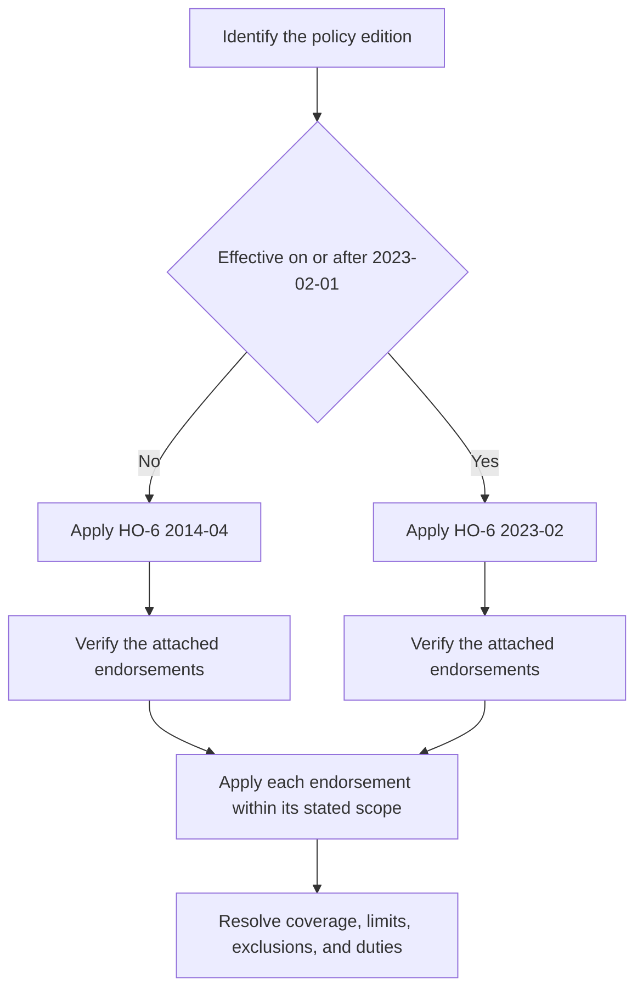

# HO-6 Form Editions

## Scope and edition status

This page describes the repository's HO-6 unit-owner forms, not an HO-3 position generalized to condominium ownership. The **2014-04** form is effective April 1, 2014 and remains applicable to policies written under that edition. The **2023-02** form is effective February 1, 2023 and supersedes 2014-04 for policies effective on or after that date. The declarations, issued policy, applicable state material, and attached endorsements determine what governs a particular claim. ([2014-04 header](repo://forms/HO/MS/HO-6/2014-04.md#L2-L9); [2023-02 header](repo://forms/HO/MS/HO-6/2023-02.md#L2-L8))

*Caption: Select the governing HO-6 edition first; then verify the endorsements actually attached to that policy and apply their wording only within their stated scope.*

An endorsement should not be applied merely because a base form mentions its subject. HO 04 35 expressly applies only while attached and controls when it conflicts with policy language. HO 04 91 has its own scope, exclusions, limit, and deductible provisions and applies only while it is in effect; confirm that it is part of the issued policy before using it. ([HO 04 35 2014-04 preamble](repo://forms/HO/MS/HO-04-35/2014-04.md#L13-L33); [HO 04 35 2023-02 preamble](repo://forms/HO/MS/HO-04-35/2023-02.md#L14-L35); [HO 04 91 preamble](repo://forms/HO/MS/HO-04-91/2019-03.md#L13-L39))

## Coverage map

| Layer | 2014-04 | 2023-02 | Unit-owner reading |
|---|---|---|---|
| Coverage A | Dwelling and unit building property | Dwelling and unit building property | The unit owner's ownership interest or contractual/legal repair responsibility, not automatically the association's entire building. |
| Coverage B | Other Structures | Other Structures | Separate structures at the residence premises, subject to edition-specific ownership, attachment, and use rules. |
| Coverage C | Personal Property | Personal Property | Insured-owned or insured-used contents, generally worldwide, subject to special limits. |
| Coverage D | Loss of Use | Loss of Use | Additional living expense, fair rental value, and qualifying civil-authority loss of use after a covered loss. |
| Section I Coverage E | Additional Coverages | Additional Coverages | Property-side benefits and sublimits, including loss assessment and landlord's furnishings. |
| Section II Coverage E | Personal Liability | Personal Liability | Damages for covered bodily injury or property damage caused by an occurrence, with a defense for a covered suit. |
| Section II Coverage F | Medical Payments to Others | Medical Payments to Others | No-fault medical expenses for qualifying third-party injury. |

The labels matter: Section I Coverage E is **Additional Coverages**, while Section II Coverage E is **Personal Liability** and Section II Coverage F is **Medical Payments to Others**. Both editions contain these layers, but their operative wording and limits differ. ([2014-04 Coverages A-D](repo://forms/HO/MS/HO-6/2014-04.md#L121-L249); [2014-04 Section II E-F](repo://forms/HO/MS/HO-6/2014-04.md#L1189-L1259); [2023-02 Coverages A-D](repo://forms/HO/MS/HO-6/2023-02.md#L78-L204); [2023-02 Section II E-F](repo://forms/HO/MS/HO-6/2023-02.md#L1016-L1078))

## Property coverages A-D

### Coverage A — the unit-owner building-property layer

Under 2014-04, Coverage A covers the unit-owner's dwelling interest, alterations, appliances, fixtures, improvements, interior walls, ceilings, floors, cabinets, built-in equipment, building systems, materials, and certain connected or commonly relevant property when the insured owns it or is responsible to insure it. The form states a default **$5,000** limit and an 80% insured-to-value threshold for replacement-cost settlement. The threshold applies only when the damaged property is repaired or replaced as required by the policy and does not change the amount of insurance provided. ([2014-04 A.1-A.9](repo://forms/HO/MS/HO-6/2014-04.md#L121-L143); [2014-04 A.20-A.32](repo://forms/HO/MS/HO-6/2014-04.md#L159-L185))

Under 2023-02, Coverage A applies to building property owned by or legally the responsibility of the unit owner, including attached fixtures and permanently installed components, improvements, attached additions, building systems, and repair materials. Its default limit is **$10,000** and its insured-to-value threshold is 80%. The form excludes land and detached structures from Coverage A and does not cover association-responsibility property unless the governing documents, an agreement, or applicable law makes the insured responsible for its repair or replacement. ([2023-02 A.1-A.27](repo://forms/HO/MS/HO-6/2023-02.md#L78-L132))

**Do not treat Coverage A as condominium master-policy coverage.** In both editions, the relevant boundary is the unit owner's ownership interest or contractual/legal responsibility. The 2014-04 form says its limit is intended for the portion of the dwelling the insured owns or is responsible to insure and does not insure property belonging solely to the association. The 2023-02 form likewise places association-responsibility property outside the unit owner's Coverage A unless an agreement or governing obligation makes the insured responsible. A master policy may insure association or collective property, but the HO-6 base form does not automatically insure the association's entire building. ([2014-04 A.2-A.5](repo://forms/HO/MS/HO-6/2014-04.md#L125-L135); [2023-02 A.1-A.17](repo://forms/HO/MS/HO-6/2023-02.md#L80-L112); [condominium master-policy boundary](repo://training/condo-master-policy-gap.md#L15-L25))

### Coverage B — other structures

Coverage B is separate from the unit-building layer. Under 2014-04, it covers qualifying separate structures at the residence premises and the insured's interest in them, including a jointly owned interest to the extent of that interest; it excludes land, business uses, and structures that are part of the dwelling rather than other structures. Under 2023-02, it covers separately set-apart structures used with the residence premises and requires the structure to be solely owned by an insured; an attached structure is handled under Coverage A rather than Other Structures. ([2014-04 B.1-B.11](repo://forms/HO/MS/HO-6/2014-04.md#L187-L209); [2023-02 B.1-B.9](repo://forms/HO/MS/HO-6/2023-02.md#L134-L152); [2023-02 B.28-B.30](repo://forms/HO/MS/HO-6/2023-02.md#L188-L194))

### Coverage C — personal property

Both editions provide worldwide Coverage C treatment for personal property owned or used by an insured, with separate rules for property at the residence premises, temporarily away, in the care of the insured, or belonging to guests and others. Coverage C remains distinct from Coverage A: building components and permanently attached items are not personal property merely because they are inside the unit. ([2014-04 C.1-C.10](repo://forms/HO/MS/HO-6/2014-04.md#L253-L273); [2023-02 C.1-C.10](repo://forms/HO/MS/HO-6/2023-02.md#L196-L216))

The 2023-02 special limits are generally higher than 2014-04: money is **$250** versus **$200**; theft of jewelry is **$2,000** versus **$1,500**; theft of firearms is **$2,500** versus **$2,000**; watercraft is **$1,500** versus **$1,000**; business property at the residence premises is **$3,000** versus **$2,500**; and electronic apparatus in a motor vehicle is **$1,500** versus **$1,000**. The silverware limit remains **$2,500** in both editions. These are limits within Coverage C, not automatic additions to it. ([2014-04 C.11-C.18](repo://forms/HO/MS/HO-6/2014-04.md#L273-L289); [2023-02 C.49-C.56](repo://forms/HO/MS/HO-6/2023-02.md#L294-L310))

### Coverage D — loss of use

Both editions set Coverage D at **50% of the Coverage A limit**. It addresses necessary increased living expenses, fair rental value for a rented or held-for-rental portion made unfit by a covered loss, and qualifying civil-authority loss of use. The insured must support expenses or rental value and avoid unnecessary or excessive costs. ([2014-04 D.1-D.18](repo://forms/HO/MS/HO-6/2014-04.md#L371-L405); [2023-02 D.1-D.14](repo://forms/HO/MS/HO-6/2023-02.md#L314-L342))

The 2023-02 wording expressly requires notice when the premises becomes uninhabitable and again when it becomes habitable, limits payment after access is restored, and requires reasonable efforts concerning an existing rental arrangement. It also requires records and cooperation in determining whether the premises can be occupied. The 2014-04 form similarly limits payment to the period the covered loss makes the premises unfit and excludes duplicated, avoidable, voluntary, or unnecessarily delayed expenses. ([2023-02 D.10-D.24](repo://forms/HO/MS/HO-6/2023-02.md#L332-L362); [2014-04 D.5-D.30](repo://forms/HO/MS/HO-6/2014-04.md#L381-L431))

## Perils, exclusions, settlement, and claim conditions

The 2014-04 form's property-peril section lists named property perils including fire, lightning, windstorm or hail, explosion, riot, aircraft, vehicles, smoke, vandalism or malicious mischief, theft, falling objects, weight of ice/snow/sleet, accidental water or steam discharge, freezing, electrical current, and volcanic eruption. It separately excludes flood, surface water, subsurface water, sewer or drain backup, sump overflow, earth movement, gradual seepage, defective conditions, pollutants, intentional loss, and other listed causes. The 2023-02 form likewise requires direct physical loss caused by a covered named peril, while retaining exclusions for flood, surface water, groundwater, gradual leakage, and sewer, drain, sump, or related-equipment backup unless an applicable endorsement provides otherwise. ([2014-04 P.1-P.54](repo://forms/HO/MS/HO-6/2014-04.md#L579-L687); [2023-02 P.1-P.70](repo://forms/HO/MS/HO-6/2023-02.md#L514-L654); [2023-02 X.1-X.12](repo://forms/HO/MS/HO-6/2023-02.md#L656-L745))

Both editions make post-loss conduct material: prompt notice, protection from further damage, preservation and inspection of damaged property, records, cooperation, proof of loss when requested, and preservation of recovery rights. Both state a **$500 minimum Section I deductible**, require a signed sworn proof of loss within **60 days after request**, and provide payment within **60 days after agreement** on the covered loss. Appraisal addresses disagreement about the amount of loss; it does not decide whether a policy or endorsement creates coverage. ([2014-04 deductible and conditions](repo://forms/HO/MS/HO-6/2014-04.md#L903-L929); [2014-04 proof, payment, and appraisal](repo://forms/HO/MS/HO-6/2014-04.md#L963-L1061); [2023-02 deductible and conditions](repo://forms/HO/MS/HO-6/2023-02.md#L842-L906); [2023-02 proof, payment, and appraisal](repo://forms/HO/MS/HO-6/2023-02.md#L870-L952))

The 2023-02 source contains apparent drafting defects that should not be silently normalized: its vacancy definition repeats the claims-manual phrase, and several provisions repeat words such as “attachedunless.” Apply the filed form as written and escalate an ambiguity rather than importing a correction from the memorandum or training. ([2023-02 DEF.13](repo://forms/HO/MS/HO-6/2023-02.md#L70-L76); [2023-02 Section I exclusions](repo://forms/HO/MS/HO-6/2023-02.md#L656-L664); [memorandum's explanatory rationale](repo://memoranda/HO-6-2023-02.md#L67-L75))

## Section II: liability and medical payments

In both editions, Section II Coverage E pays damages for which an insured is legally liable because of bodily injury or property damage caused by an occurrence and provides a defense against a covered suit. The 2014-04 form excludes, among other things, expected or intended injury, business and professional services, motor vehicles, aircraft, watercraft, contractual liability, pollutants, communicable disease, controlled substances, and abuse or sexual misconduct. The 2023-02 form retains the basic grant and defense but organizes a broader, more granular exclusion set, including business and rental activity, property in an insured's care or custody, professional services, communicable disease, abuse, cyber/data-related conduct, and water or animal risks. ([2014-04 E.1-E.23](repo://forms/HO/MS/HO-6/2014-04.md#L1189-L1235); [2023-02 E.1-E.23](repo://forms/HO/MS/HO-6/2023-02.md#L1016-L1062); [2023-02 Section II exclusions](repo://forms/HO/MS/HO-6/2023-02.md#L1120-L1220))

Coverage F is no-fault medical-payments coverage for qualifying third-party injury. The 2014-04 form covers necessary medical expenses for a person on an insured location with permission and certain off-premises injuries arising from the location, insured activities, a residence employee, or an insured's animal. The 2023-02 form retains those pathways, states a three-year period for incurred medical expenses, and excludes injury to the insured, household residents, residence employees in specified circumstances, and categories such as workers compensation, business, professional services, vehicles, watercraft, aircraft, abuse, and criminal acts. ([2014-04 F.1-F.27](repo://forms/HO/MS/HO-6/2014-04.md#L1257-L1299); [2023-02 F.1-F.27](repo://forms/HO/MS/HO-6/2023-02.md#L1064-L1118))

## Filing memorandum: useful rationale, not controlling wording

The HO-6-2023-02 filing memorandum is explanatory context only. It describes the revision as clarifying covered-property descriptions, loss settlement, post-loss information and cooperation, water-related causes, loss of use, liability, medical payments, and selected limits. It gives rationale for the 2023-02 personal-property special limits, **$2,000** base loss assessment, **15% of Coverage A** ordinance-or-law coverage, and **$3,000** landlord's furnishings. Those explanations help a reviewer locate changes; they do not amend either form, establish endorsement attachment, or decide a claim. The operative form and attached endorsement control. ([memorandum summary](repo://memoranda/HO-6-2023-02.md#L13-L75); [memorandum limit rationale](repo://memoranda/HO-6-2023-02.md#L145-L185); [2023-02 operative additional coverages](repo://forms/HO/MS/HO-6/2023-02.md#L410-L464))

## Unit-owner endorsements

### Loss assessment — HO 04 35

HO 04 35 is attachment-dependent and changes the base loss-assessment treatment. Its 2014-04 edition covers an insured's share of an association assessment arising from covered association property loss or a covered liability claim and sets a maximum of **$10,000**. Its 2023-02 edition covers assessments arising from direct physical loss to collective property, a covered master-policy deductible, or covered association liability and raises the maximum to **$25,000**. The 2023-02 wording requires the assessment to be legally chargeable to the unit owner and limits payment to the covered, properly allocated portion; both editions exclude maintenance, betterment, fines, contractual or speculative obligations, and other stated boundaries. ([HO 04 35 2014-04 coverage](repo://forms/HO/MS/HO-04-35/2014-04.md#L35-L69); [HO 04 35 2014-04 exclusions](repo://forms/HO/MS/HO-04-35/2014-04.md#L101-L121); [HO 04 35 2023-02 coverage](repo://forms/HO/MS/HO-04-35/2023-02.md#L66-L139); [HO 04 35 2023-02 limit and exclusions](repo://forms/HO/MS/HO-04-35/2023-02.md#L283-L350))

The base 2014-04 form separately provides a **$1,000** loss-assessment additional coverage for covered association property damage, while 2023-02 provides a **$2,000** base provision for covered property damage or association assessment. Those base limits must not be confused with the higher HO 04 35 limit when that endorsement is attached. ([2014-04 E.25-E.31](repo://forms/HO/MS/HO-6/2014-04.md#L483-L495); [2023-02 E.44-E.46](repo://forms/HO/MS/HO-6/2023-02.md#L448-L456))

A loss assessment is not automatically covered because an association issued it or because a master policy had a loss. Review the association's authority, the damaged property, the cause, the allocation to the unit owner, the legal obligation, other insurance, and the attached HO 04 35 wording. ([HO 04 35 2014-04 records and conditions](repo://forms/HO/MS/HO-04-35/2014-04.md#L71-L99); [HO 04 35 2023-02 records and conditions](repo://forms/HO/MS/HO-04-35/2023-02.md#L301-L328); [condominium assessment guidance](repo://training/condo-master-policy-gap.md#L141-L159))

### Water backup — HO 04 91

The 2023-02 base form preserves the sewer, drain, sump, and related-equipment backup exclusion unless an applicable water-backup endorsement provides otherwise. HO 04 91 supplies coverage for direct physical loss to covered building or personal property caused by water backing through a sewer or drain or overflowing or discharging from a sump or related equipment. It covers resulting damage and reasonable water-removal, cleaning, drying, and debris-removal expenses, but not flood, surface water, groundwater, gradual leakage, or repair of the failed sewer or sump system itself. ([2023-02 water exclusion](repo://forms/HO/MS/HO-6/2023-02.md#L656-L666); [HO 04 91 grant and exclusions](repo://forms/HO/MS/HO-04-91/2019-03.md#L41-L111))

HO 04 91's limit-of-liability section states a **$7,500** maximum for water-backup and sump-overflow loss. Its deductible section defines a deductible, but the repository text then anomalously states in W.3 that **$750** is the most the insurer will pay rather than unambiguously stating that $750 is the deductible. This is a drafting ambiguity: do not silently rewrite that provision as a $750 deductible; verify the issued policy and escalate the discrepancy while applying the text as written. ([HO 04 91 limit](repo://forms/HO/MS/HO-04-91/2019-03.md#L113-L127); [HO 04 91 deductible section](repo://forms/HO/MS/HO-04-91/2019-03.md#L161-L181))

### Rental to others — HO 17 32

HO 17 32 is the repository's 2014-04 unit-owner rental endorsement. Its terms apply to a unit that is part of the insured policy and only while the unit is rented to others or held available for rental occupancy. It changes covered-property treatment for tenant-use appliances, furnishings, equipment, improvements, and maintenance property and provides loss-of-rent coverage when a covered loss makes the rental unit unfit. It does not insure a tenant's personal property merely because it is in the unit. ([HO 17 32 scope and conflict rule](repo://forms/HO/MS/HO-17-32/2014-04.md#L13-L39); [HO 17 32 coverage](repo://forms/HO/MS/HO-17-32/2014-04.md#L41-L85))

The endorsement sets a **$5,000** landlord's-furnishings limit, part of Coverage C, and requires evidence that the unit was rented or held available at the time of loss. The 2023-02 base form separately contains **$3,000** landlord's-furnishings coverage and Coverage D fair-rental-value language; do not apply the 2014-04 endorsement's terms to a 2023-02 policy without checking the schedule and actual attached endorsements. ([HO 17 32 limit and proof](repo://forms/HO/MS/HO-17-32/2014-04.md#L139-L159); [2023-02 landlord's furnishings](repo://forms/HO/MS/HO-6/2023-02.md#L458-L466); [2023-02 Coverage D](repo://forms/HO/MS/HO-6/2023-02.md#L316-L334))

### Coverage A special coverage — HO 17 33

HO 17 33 is a 2014-04 endorsement that modifies Coverage A. It covers direct physical loss to Coverage A property on a risk-of-direct-physical-loss basis subject to its exclusions and limitations and sets a **$25,000 Coverage A limit**. It addresses the unit portion, attached fixtures, alterations, appliances, improvements, and repair materials while retaining exclusions for flood, surface water, groundwater, sewer or sump backup, and many other causes. ([HO 17 33 preamble and grant](repo://forms/HO/MS/HO-17-33/2014-04.md#L13-L49); [HO 17 33 water exclusions](repo://forms/HO/MS/HO-17-33/2014-04.md#L51-L65); [HO 17 33 limit](repo://forms/HO/MS/HO-17-33/2014-04.md#L137-L153))

HO 17 33 modifies the 2014-04 Coverage A limit and peril treatment; it does not turn the endorsement into association master-policy coverage and preserves its stated water-backup exclusions. Verify that this specific endorsement is part of the policy and that its line-specific amendment is the one being applied. ([2014-04 Coverage A boundary](repo://forms/HO/MS/HO-6/2014-04.md#L121-L193); [2023-02 Coverage A boundary](repo://forms/HO/MS/HO-6/2023-02.md#L78-L132))

## Practical claim-reading sequence

1. Identify the policy's written edition and use that edition's Coverage A-D, peril, exclusion, condition, settlement, and Section II text.
2. Separate unit-owner building responsibility under Coverage A from personal property under Coverage C and loss of use under Coverage D. Determine ownership and contractual repair responsibility rather than assuming that the association's master policy or the HO-6 covers every item in the unit.
3. Identify the direct physical loss or occurrence, location, cause, and named-peril or excluded-cause boundary; do not treat a water event as covered merely because it is sudden.
4. Check the declarations for limits and deductibles, then check the endorsements actually attached to the policy for a write-back, modified limit, special Coverage A treatment, rental treatment, or loss-assessment treatment.
5. Apply post-loss duties and the applicable endorsement limit and deductible. Appraisal addresses amount of loss, not whether the policy or an endorsement creates coverage. ([2014-04 post-loss, settlement, and appraisal](repo://forms/HO/MS/HO-6/2014-04.md#L903-L1061); [2023-02 post-loss, settlement, and appraisal](repo://forms/HO/MS/HO-6/2023-02.md#L842-L966); [condominium claim sequence](repo://training/condo-master-policy-gap.md#L559-L577))
