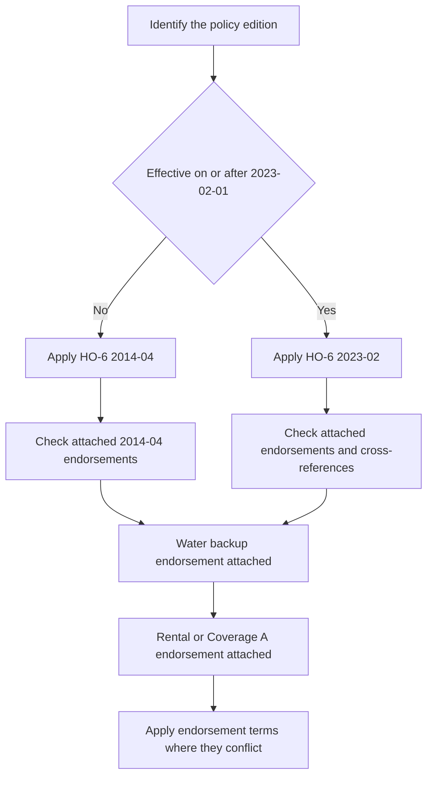

# HO-6 Unit-Owners Form Editions

## Scope and edition status

This page describes the exact HO-6 form text in the repository, not an HO-3 position generalized to unit owners. The **2014-04** form is effective April 1, 2014 and is marked superseded by **2023-02** for policies effective on or after February 1, 2023; 2014-04 remains the governing edition for policies written under it. The 2023-02 form is effective February 1, 2023. ([2014-04 header](repo://forms/HO/MS/HO-6/2014-04.md#L2-L9); [2023-02 header](repo://forms/HO/MS/HO-6/2023-02.md#L2-L8))

*Caption: Edition selection comes first; attached endorsements then modify the applicable HO-6 terms only within their stated scope.*

An endorsement is not part of the base form merely because the base form mentions it. HO 04 35 says it applies only when attached and controls over conflicting policy language; HO 04 91 likewise supplies its own terms and limits. ([HO 04 35 2023-02, W.0](repo://forms/HO/MS/HO-04-35/2023-02.md#L13-L39); [HO 04 91, W.0](repo://forms/HO/MS/HO-04-91/2019-03.md#L13-L39))

## What the unit-owner form insures

| Coverage | 2014-04 | 2023-02 | Unit-owner reading |
|---|---|---|---|
| A | Dwelling and unit building property | Dwelling and unit building property | The unit-owner's interest or contractual responsibility, not automatically the association's entire building. |
| B | Other Structures | Other Structures | Separate structures at the residence premises, subject to edition-specific ownership and use rules. |
| C | Personal Property | Personal Property | Insured-owned or insured-used contents, generally worldwide, subject to special limits. |
| D | Loss of Use | Loss of Use | Additional living expense and fair rental value after a covered loss, plus qualifying civil-authority loss of use. |
| I.E | Section I Additional Coverages | Section I Additional Coverages | Property-side sublimits and benefits, including loss assessment and landlord's furnishings. |
| II.E | Personal Liability | Personal Liability | Damages for covered bodily injury or property damage caused by an occurrence, with a defense for a covered suit. |
| II.F | Medical Payments to Others | Medical Payments to Others | No-fault medical expenses for qualifying third-party injury. |

The labels matter: “Coverage E” in Section I is Additional Coverages, while Section II Coverage E is Personal Liability and Section II Coverage F is Medical Payments to Others. ([2014-04 Coverage B–D](repo://forms/HO/MS/HO-6/2014-04.md#L199-L249); [2014-04 Section II E–F](repo://forms/HO/MS/HO-6/2014-04.md#L1133-L1201); [2023-02 Coverage A–D](repo://forms/HO/MS/HO-6/2023-02.md#L78-L134); [2023-02 Section II E–F](repo://forms/HO/MS/HO-6/2023-02.md#L1004-L1052))

## Property coverages A–D

### Coverage A — the unit-owner building-property layer

The 2014-04 form covers alterations, appliances, fixtures, improvements, interior walls, ceilings, floors, cabinets, built-in appliances, plumbing, heating, electrical equipment, building materials, and certain exclusively used or commonly owned property when the insured has ownership or legal repair responsibility. It excludes land and property that is not part of a building or structure. The default Coverage A limit is **$5,000**, unless the policy states another limit. Replacement-cost settlement requires a Coverage A limit of at least 80% of the full replacement cost; otherwise the form settles at actual cash value until repair or replacement supports additional replacement-cost payment. ([2014-04 A.1–A.9](repo://forms/HO/MS/HO-6/2014-04.md#L121-L143); [2014-04 A.20–A.24 and A.33–A.34](repo://forms/HO/MS/HO-6/2014-04.md#L159-L169); [2014-04 A.33–A.34](repo://forms/HO/MS/HO-6/2014-04.md#L187-L193))

The 2023-02 form covers property within the dwelling unit, attached property, fixtures, improvements, materials and supplies, and building property the insured is required to insure under an agreement. It excludes land, foundations, patios, walkways, driveways, and property owned by an association or other person unless the insured has contractual responsibility to repair or replace it. Its default Coverage A limit is **$10,000**. The same 80% replacement-cost threshold applies, and unrepaired or unreplaced property is paid no more than actual cash value. ([2023-02 A.1–A.13](repo://forms/HO/MS/HO-6/2023-02.md#L78-L120); [2023-02 A.22–A.25](repo://forms/HO/MS/HO-6/2023-02.md#L122-L128))

**Do not treat Coverage A as the condominium association's master-policy coverage.** In both editions, the insured's ownership interest or legal responsibility is the boundary. Coverage B is also not a substitute for the unit building layer: each edition treats a separate structure as an “other structure,” but the 2023-02 form requires sole ownership and excludes an attached structure from Coverage B. ([2014-04 A.6–A.8](repo://forms/HO/MS/HO-6/2014-04.md#L131-L139); [2023-02 A.4–A.8 and A.11–A.12](repo://forms/HO/MS/HO-6/2023-02.md#L86-L104); [2023-02 B.1–B.9](repo://forms/HO/MS/HO-6/2023-02.md#L134-L152))

### Coverage B — other structures

The 2014-04 form covers the insured's interest in separate structures at the residence premises, including jointly owned interests to the extent of the insured's interest. It excludes land, detached movable property, most rental or business uses, and structures physically connected to the dwelling beyond a fence, utility line, or similar connection. ([2014-04 B.1–B.11](repo://forms/HO/MS/HO-6/2014-04.md#L199-L221); [2014-04 B.12–B.24](repo://forms/HO/MS/HO-6/2014-04.md#L223-L247))

The 2023-02 form covers direct physical loss to separately set-apart structures owned by an insured, including fixtures and repair materials, but excludes personal property, land and landscaping, rented structures except a private garage, most business use, and any structure not solely owned by an insured. It also requires maintenance, prompt notice, protection from further damage, inspection access, and cooperation. ([2023-02 B.1–B.18](repo://forms/HO/MS/HO-6/2023-02.md#L134-L170); [2023-02 B.19–B.24](repo://forms/HO/MS/HO-6/2023-02.md#L172-L182))

### Coverage C — personal property

Both editions cover personal property owned or used by an insured while anywhere in the world, with stated treatment for guest, residence-employee, temporarily located, and other property. The coverage remains distinct from Coverage A: building components and permanently attached items are not personal property, and the applicable Coverage C limit and special limits control. ([2014-04 C.1–C.10](repo://forms/HO/MS/HO-6/2014-04.md#L249-L269); [2023-02 C.1–C.10](repo://forms/HO/MS/HO-6/2023-02.md#L184-L204))

The 2023-02 special limits are generally higher than 2014-04: money is $250 versus $200; theft of jewelry is $2,000 versus $1,500; theft of firearms is $2,500 versus $2,000; watercraft is $1,500 versus $1,000; business property at the residence premises is $3,000 versus $2,500; and electronic apparatus in a motor vehicle is $1,500 versus $1,000. Silverware remains $2,500 in both editions. These are limits within Coverage C, not automatic additions to it. ([2014-04 C.22–C.30](repo://forms/HO/MS/HO-6/2014-04.md#L293-L309); [2023-02 C.26–C.35](repo://forms/HO/MS/HO-6/2023-02.md#L236-L254))

### Coverage D — loss of use

Both editions set Coverage D at **50% of the Coverage A limit**. The coverage pays necessary increased living expense when the residence premises used by the insured is unfit to live in, fair rental value for a rented or held-for-rental portion that is unfit, and qualifying civil-authority loss of use. The insured must substantiate expenses or rental value and avoid unnecessary or excessive costs. ([2014-04 D.1–D.18](repo://forms/HO/MS/HO-6/2014-04.md#L365-L401); [2023-02 D.1–D.12](repo://forms/HO/MS/HO-6/2023-02.md#L300-L324))

The 2023-02 wording adds a stronger termination and mitigation structure: payment ends when the premises is fit for living or the insured permanently relocates, and the insured must allow repairs or replacement to proceed with due diligence and dispatch. The 2014-04 form also limits payment to the period the covered loss makes the premises unfit and excludes duplicated or avoidable expense. ([2023-02 D.13–D.33](repo://forms/HO/MS/HO-6/2023-02.md#L326-L366); [2014-04 D.19–D.33](repo://forms/HO/MS/HO-6/2014-04.md#L403-L431))

## Perils, exclusions, and claim conditions

The 2014-04 form's peril section covers named property perils including fire, lightning, windstorm or hail, explosion, riot, aircraft, vehicles, smoke, vandalism or malicious mischief, theft, falling objects, weight of ice/snow/sleet, accidental water or steam discharge, freezing, electrical current, and volcanic eruption. It separately excludes flood, surface water, subsurface water, sewer or drain backup, sump overflow, earth movement, gradual seepage, defective conditions, pollutants, intentional loss, and other listed causes. ([2014-04 P.1–P.30](repo://forms/HO/MS/HO-6/2014-04.md#L579-L639); [2014-04 P.31–P.54](repo://forms/HO/MS/HO-6/2014-04.md#L641-L687))

The 2023-02 form expressly defines a named peril and retains the principal named-peril structure, while adding detailed boundaries for vacancy, theft, water, collapse, roof surfacing, cosmetic damage, and utility failures. Its base form excludes sewer, drain, sump, and related-equipment backup or overflow unless a water-backup endorsement is attached. It also excludes flood, surface water, groundwater, gradual leakage, and water entering through non-covered openings. ([2023-02 P.1–P.38](repo://forms/HO/MS/HO-6/2023-02.md#L514-L590); [2023-02 P.39–P.65](repo://forms/HO/MS/HO-6/2023-02.md#L592-L644); [2023-02 X.1–X.12](repo://forms/HO/MS/HO-6/2023-02.md#L656-L745))

Both editions make post-loss conduct material: prompt notice, protection from further damage, preservation and inspection of damaged property, records, cooperation, proof of loss when requested, and preservation of recovery rights. Both state a **$500 minimum Section I deductible**, require a signed sworn proof of loss within **60 days after request**, and provide payment within **60 days after agreement** on the covered loss. ([2014-04 Section I conditions](repo://forms/HO/MS/HO-6/2014-04.md#L903-L929); [2014-04 proof and payment](repo://forms/HO/MS/HO-6/2014-04.md#L963-L1045); [2023-02 Section I conditions](repo://forms/HO/MS/HO-6/2023-02.md#L842-L906); [2023-02 proof and payment](repo://forms/HO/MS/HO-6/2023-02.md#L870-L952))

The 2023-02 source contains drafting defects that should not be silently normalized in claim interpretation: the vacancy definition repeats “the claims manual's duration test applies the definition,” and several endorsement cross-references repeat words such as “attachedunless.” The form also refers to a claims manual in the definition itself; that reference is not a substitute for the operative policy wording. ([2023-02 DEF.13](repo://forms/HO/MS/HO-6/2023-02.md#L70-L76); [2023-02 Section I exclusions X.1–X.3](repo://forms/HO/MS/HO-6/2023-02.md#L656-L664))

## Section II: liability and medical payments

In both editions, Section II Coverage E pays damages for which an insured is legally liable because of bodily injury or property damage caused by an occurrence and provides a defense against a covered suit. The 2014-04 form excludes, among other things, expected or intended injury, business, professional services, motor vehicles, aircraft, watercraft, contractual liability, pollutants, communicable disease, controlled substances, and abuse or sexual misconduct. ([2014-04 E.1–E.23](repo://forms/HO/MS/HO-6/2014-04.md#L1133-L1179)) The 2023-02 form has the same basic grant and defense but states a broader, more granular exclusion set, including business, rental, property in an insured's care, custody, or control, communicable disease, abuse, cyber and data-related conduct, and water or animal risks. ([2023-02 E.1–E.23](repo://forms/HO/MS/HO-6/2023-02.md#L1004-L1050); [2023-02 Section II exclusions](repo://forms/HO/MS/HO-6/2023-02.md#L1108-L1208))

Coverage F is no-fault medical-payments coverage for qualifying third-party injury. The 2014-04 form covers necessary medical expenses for a person on an insured location with permission and certain off-premises injuries arising from the location, insured activities, a residence employee, or an insured's animal. The 2023-02 form retains those pathways and expressly covers expenses incurred within three years after the accident, while excluding injury to the insured, household residents, and categories such as workers compensation, business, professional services, vehicles, watercraft, aircraft, abuse, and criminal acts. ([2014-04 F.1–F.27](repo://forms/HO/MS/HO-6/2014-04.md#L1201-L1255); [2023-02 F.1–F.27](repo://forms/HO/MS/HO-6/2023-02.md#L1052-L1106))

## Unit-owner endorsements

### Loss assessment — HO 04 35

HO 04 35 is attachment-dependent and changes the base loss-assessment treatment. In 2014-04 it covers an insured's share of an association assessment arising from covered association property loss or a covered liability claim and sets the maximum at **$10,000**. ([HO 04 35 2014-04, W.1](repo://forms/HO/MS/HO-04-35/2014-04.md#L35-L69); [HO 04 35 2014-04, limit](repo://forms/HO/MS/HO-04-35/2014-04.md#L135-L151)) In 2023-02 it covers assessments arising from direct physical loss to collective property, an association master-policy deductible, or covered association liability, and raises the maximum to **$25,000**. It excludes assessments for the insured's solely owned property, ordinary maintenance, betterment, fines, business, contractual or speculative loss. ([HO 04 35 2023-02, W.1](repo://forms/HO/MS/HO-04-35/2023-02.md#L41-L77); [HO 04 35 2023-02, exclusions and limit](repo://forms/HO/MS/HO-04-35/2023-02.md#L77-L103); [HO 04 35 2023-02, limit](repo://forms/HO/MS/HO-04-35/2023-02.md#L141-L159))

The base 2014-04 form separately provides a $1,000 loss-assessment additional coverage for covered association property damage, while 2023-02 provides a $2,000 base provision for covered property damage or association liability. Those base limits must not be confused with the higher HO 04 35 limit when that endorsement is attached. ([2014-04 E.25–E.30](repo://forms/HO/MS/HO-6/2014-04.md#L483-L493); [2023-02 E.21–E.32](repo://forms/HO/MS/HO-6/2023-02.md#L410-L432))

### Water backup — HO 04 91

The 2023-02 base form expressly preserves the sewer, drain, sump, and related-equipment backup exclusion unless a water-backup endorsement is attached. HO 04 91 is the unit-owner endorsement identified by that cross-reference: it writes back coverage for direct physical loss to covered building or personal property caused by water backing through a sewer or drain or overflowing or discharging from a sump or related equipment. The endorsement covers resulting damage and reasonable water removal, cleaning, drying, and debris-removal expenses, but not flood, surface water, groundwater, gradual leakage, or the cost of repairing the failed sewer or sump system itself. ([2023-02 X.3](repo://forms/HO/MS/HO-6/2023-02.md#L660-L664); [HO 04 91 W.1](repo://forms/HO/MS/HO-04-91/2019-03.md#L41-L79); [HO 04 91 exclusions](repo://forms/HO/MS/HO-04-91/2019-03.md#L81-L111))

HO 04 91 supplies a separate **$7,500** limit for the sum of water-backup or sump-overflow losses and a **$750** deductible for each covered water-backup loss. The limit includes covered direct physical loss and covered protective repairs, applies before the deductible, and is not added to another property limit. ([HO 04 91 limit](repo://forms/HO/MS/HO-04-91/2019-03.md#L113-L161); [HO 04 91 deductible](repo://forms/HO/MS/HO-04-91/2019-03.md#L163-L181))

### Rental to others — HO 17 32

HO 17 32 is the repository's 2014-04 unit-owner rental endorsement. It applies only while the unit is rented or held available for rental, changes the covered-property treatment for tenant-use appliances, furnishings, equipment, improvements, and maintenance property, and provides loss-of-rent coverage when a covered loss makes the rental unit unfit for occupancy. It does not insure a tenant's personal property merely because it is in the unit. ([HO 17 32 attachment and scope](repo://forms/HO/MS/HO-17-32/2014-04.md#L13-L39); [HO 17 32 W.1](repo://forms/HO/MS/HO-17-32/2014-04.md#L41-L85))

The endorsement sets a **$5,000** limit for landlord's furnishings. It does not enlarge that limit for loss of use, loss of income, multiple items, or related property, and it requires rental records or other evidence that the unit was rented or held available at the time of loss. ([HO 17 32 limit](repo://forms/HO/MS/HO-17-32/2014-04.md#L139-L159); [HO 17 32 rental proof](repo://forms/HO/MS/HO-17-32/2014-04.md#L131-L137)) The 2023-02 base form separately contains **$3,000** landlord's-furnishings coverage and Coverage D fair-rental-value language; do not attach the 2014 endorsement's terms to a 2023 policy without checking the actual policy schedule and attached endorsement. ([2023-02 E.43–E.47](repo://forms/HO/MS/HO-6/2023-02.md#L454-L464); [2023-02 D.8–D.12](repo://forms/HO/MS/HO-6/2023-02.md#L316-L324))

### Coverage A special coverage — HO 17 33

HO 17 33 is a 2014-04 endorsement that modifies Coverage A. It covers direct physical loss to Coverage A property on a risk-of-direct-physical-loss basis subject to its exclusions and limitations, and sets a **$25,000 Coverage A limit**. It expressly covers the unit portion, attached fixtures, alterations, appliances, improvements, and repair materials, while retaining exclusions for flood, surface water, groundwater, sewer or sump backup, and many other causes. ([HO 17 33 attachment and grant](repo://forms/HO/MS/HO-17-33/2014-04.md#L13-L49); [HO 17 33 water exclusions](repo://forms/HO/MS/HO-17-33/2014-04.md#L51-L65); [HO 17 33 limit](repo://forms/HO/MS/HO-17-33/2014-04.md#L137-L153)) Thus HO 17 33 **modifies** the 2014-04 Coverage A limit and peril treatment; it does not turn the endorsement into association master-policy coverage and it **preserves** the stated water-backup exclusions.

## Practical claim-reading sequence

1. Identify the policy's written edition and use that edition's Coverage A–D, peril, exclusion, condition, and Section II text.
2. Separate unit-owner building responsibility under Coverage A from personal property under Coverage C and loss of use under Coverage D.
3. Identify the direct physical loss or occurrence, location, cause, and excluded or named-peril boundary; do not treat a water event as covered merely because it is sudden.
4. Check the declarations for limits and deductibles, then check the attached endorsements for a write-back, modified limit, special Coverage A treatment, rental treatment, or loss-assessment treatment.
5. Apply post-loss duties and the applicable endorsement limit and deductible. Appraisal addresses amount of loss, not whether the policy or an endorsement creates coverage. ([2014-04 post-loss and appraisal conditions](repo://forms/HO/MS/HO-6/2014-04.md#L903-L1047); [2023-02 post-loss and appraisal conditions](repo://forms/HO/MS/HO-6/2023-02.md#L842-L966))
