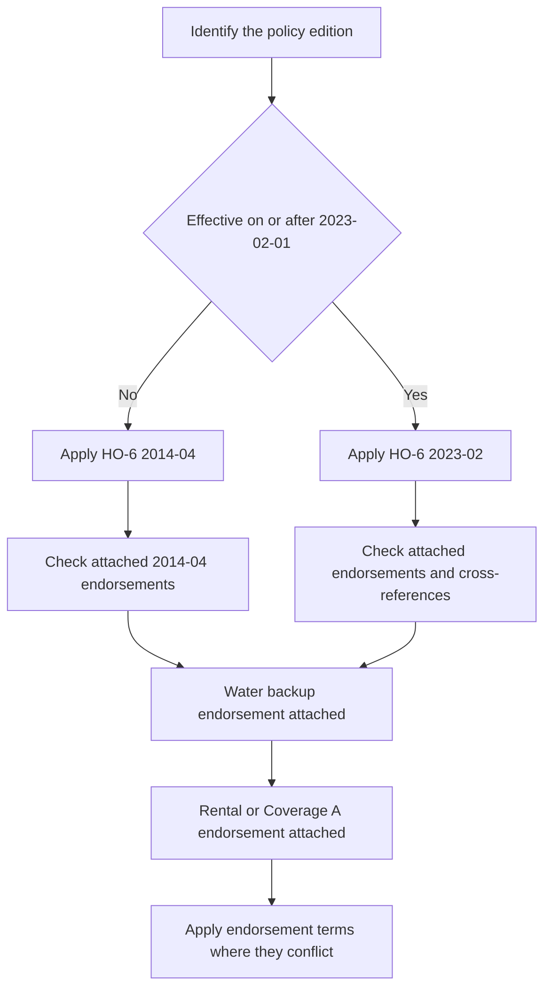

# HO-6 Unit-Owners Form Editions

## Scope and edition status

This page describes the exact HO-6 form text in the repository, not an HO-3 position generalized to unit owners. The **2014-04** form is effective April 1, 2014 and is marked superseded by **2023-02** for policies effective on or after February 1, 2023; 2014-04 remains in force for policies written under it. The 2023-02 form is effective February 1, 2023. The issued policy record, declarations, applicable state material, and attached endorsements determine what actually governs. ([2014-04 header](repo://forms/HO/MS/HO-6/2014-04.md#L2-L9); [2023-02 header](repo://forms/HO/MS/HO-6/2023-02.md#L2-L8); [edition-selection training](repo://training/choosing-the-governing-edition.md#L15-L25))

*Caption: Edition selection comes first; attached endorsements then modify the applicable HO-6 terms only within their stated scope.*

An endorsement is not part of the base form merely because the base form mentions it. HO 04 35 applies only when attached and controls over conflicting policy language; HO 04 91 likewise supplies its own terms and limits. The practical rule is to verify the attachment and form edition, then read the endorsement with the unchanged base wording. ([HO 04 35 2014-04 attachment and precedence](repo://forms/HO/MS/HO-04-35/2014-04.md#L13-L33); [HO 04 35 2023-02 attachment and precedence](repo://forms/HO/MS/HO-04-35/2023-02.md#L13-L35); [HO 04 91 attachment and scope](repo://forms/HO/MS/HO-04-91/2019-03.md#L13-L39); [edition-selection training](repo://training/choosing-the-governing-edition.md#L21-L27))

## What the unit-owner form insures

| Coverage | 2014-04 | 2023-02 | Unit-owner reading |
|---|---|---|---|
| A | Dwelling and unit building property | Dwelling and unit building property | The unit owner's ownership interest or contractual repair responsibility, not automatically the association's entire building. |
| B | Other Structures | Other Structures | Separate structures at the residence premises, subject to edition-specific ownership and use rules. |
| C | Personal Property | Personal Property | Insured-owned or insured-used contents, generally worldwide, subject to special limits. |
| D | Loss of Use | Loss of Use | Additional living expense, fair rental value, and qualifying civil-authority loss of use after a covered loss. |
| I.E | Section I Additional Coverages | Section I Additional Coverages | Property-side sublimits and benefits, including loss assessment and landlord's furnishings. |
| II.E | Personal Liability | Personal Liability | Damages for covered bodily injury or property damage caused by an occurrence, with a defense for a covered suit. |
| II.F | Medical Payments to Others | Medical Payments to Others | No-fault medical expenses for qualifying third-party injury. |

The labels matter: “Coverage E” in Section I is Additional Coverages, while Section II Coverage E is Personal Liability and Section II Coverage F is Medical Payments to Others. Both editions contain those property, liability, and medical-payment layers, but their operative wording and limits differ. ([2014-04 Coverage A–D](repo://forms/HO/MS/HO-6/2014-04.md#L121-L249); [2014-04 Section II E–F](repo://forms/HO/MS/HO-6/2014-04.md#L1133-L1201); [2023-02 Coverage A–D](repo://forms/HO/MS/HO-6/2023-02.md#L78-L204); [2023-02 Section II E–F](repo://forms/HO/MS/HO-6/2023-02.md#L1004-L1052))

## Property coverages A–D

### Coverage A — the unit-owner building-property layer

The 2014-04 form covers alterations, appliances, fixtures, improvements, interior walls, ceilings, floors, cabinets, built-in appliances, plumbing, heating, electrical equipment, building materials, and certain exclusively used or commonly owned property when the insured has ownership or legal repair responsibility. It excludes land and property that is not part of a building or structure. The default Coverage A limit is **$5,000**, unless the policy states another limit. Replacement-cost settlement requires a Coverage A limit of at least 80% of the full replacement cost; otherwise the form settles at actual cash value until repair or replacement supports additional replacement-cost payment. ([2014-04 A.1–A.9](repo://forms/HO/MS/HO-6/2014-04.md#L121-L143); [2014-04 A.20–A.24 and A.33–A.36](repo://forms/HO/MS/HO-6/2014-04.md#L159-L193))

The 2023-02 form covers property within the dwelling unit, attached property, fixtures, improvements, materials and supplies, and building property the insured is required to insure under an agreement. It excludes land, foundations, patios, walkways, driveways, and property owned by an association or other person unless the insured has contractual responsibility to repair or replace it. Its default Coverage A limit is **$10,000**. The same 80% replacement-cost threshold applies, and unrepaired or unreplaced property is paid no more than actual cash value. ([2023-02 A.1–A.13](repo://forms/HO/MS/HO-6/2023-02.md#L78-L120); [2023-02 A.22–A.27](repo://forms/HO/MS/HO-6/2023-02.md#L122-L132))

**Do not treat Coverage A as the condominium association's master-policy coverage.** In both editions, the insured's ownership interest or contractual/legal repair responsibility is the boundary. A master policy may insure association or collective property, but the HO-6 base form does not automatically insure the association's entire building. The 2014-04 form limits common-property payment to the insured's ownership interest or legal responsibility; 2023-02 excludes property owned by an association or another person unless an agreement makes the insured responsible to repair or replace it. ([2014-04 A.3–A.8](repo://forms/HO/MS/HO-6/2014-04.md#L123-L139); [2023-02 A.4–A.12](repo://forms/HO/MS/HO-6/2023-02.md#L86-L104); [condominium master-policy training](repo://training/condo-master-policy-gap.md#L15-L25))

Coverage B is not a substitute for the unit building layer. In 2014-04, a separate structure can be covered when the insured has an insurable interest; in 2023-02, Coverage B is limited to a separately set-apart structure owned solely by an insured and excludes an attached structure. ([2014-04 B.1–B.5](repo://forms/HO/MS/HO-6/2014-04.md#L199-L209); [2023-02 B.1–B.9](repo://forms/HO/MS/HO-6/2023-02.md#L134-L152))

### Coverage B — other structures

The 2014-04 form covers the insured's interest in separate structures at the residence premises, including jointly owned interests to the extent of the insured's interest. It excludes land, detached movable property, most rental or business uses, and structures physically connected to the dwelling beyond a fence, utility line, or similar connection. The 2023-02 form covers direct physical loss to separately set-apart structures owned solely by an insured, but excludes personal property, land and landscaping, rented structures except a private garage, most business use, and any structure not solely owned by an insured. ([2014-04 B.1–B.24](repo://forms/HO/MS/HO-6/2014-04.md#L199-L247); [2023-02 B.1–B.24](repo://forms/HO/MS/HO-6/2023-02.md#L134-L182))

### Coverage C — personal property

Both editions cover personal property owned or used by an insured while anywhere in the world, with stated treatment for guest, residence-employee, temporarily located, and other property. Coverage C remains distinct from Coverage A: building components and permanently attached items are not personal property, and the applicable Coverage C limit and special limits control. ([2014-04 C.1–C.10](repo://forms/HO/MS/HO-6/2014-04.md#L249-L269); [2023-02 C.1–C.10](repo://forms/HO/MS/HO-6/2023-02.md#L184-L204))

The 2023-02 special limits are generally higher than 2014-04: money is $250 versus $200; theft of jewelry is $2,000 versus $1,500; theft of firearms is $2,500 versus $2,000; watercraft is $1,500 versus $1,000; business property at the residence premises is $3,000 versus $2,500; and electronic apparatus in a motor vehicle is $1,500 versus $1,000. Silverware remains $2,500 in both editions. These are limits within Coverage C, not automatic additions to it. ([2014-04 C.22–C.30](repo://forms/HO/MS/HO-6/2014-04.md#L293-L309); [2023-02 C.26–C.35](repo://forms/HO/MS/HO-6/2023-02.md#L236-L254))

### Coverage D — loss of use

Both editions set Coverage D at **50% of the Coverage A limit**. The coverage pays necessary increased living expense when the residence premises used by the insured is unfit to live in, fair rental value for a rented or held-for-rental portion that is unfit, and qualifying civil-authority loss of use. The insured must substantiate expenses or rental value and avoid unnecessary or excessive costs. ([2014-04 D.1–D.18](repo://forms/HO/MS/HO-6/2014-04.md#L365-L401); [2023-02 D.1–D.12](repo://forms/HO/MS/HO-6/2023-02.md#L300-L324))

The 2023-02 wording adds a stronger termination and mitigation structure: payment ends when the premises is fit for living or the insured permanently relocates, and the insured must allow repairs or replacement to proceed with due diligence and dispatch. The 2014-04 form also limits payment to the period the covered loss makes the premises unfit and excludes duplicated or avoidable expense. ([2023-02 D.13–D.33](repo://forms/HO/MS/HO-6/2023-02.md#L326-L366); [2014-04 D.19–D.33](repo://forms/HO/MS/HO-6/2014-04.md#L403-L431))

## Perils, exclusions, settlement, and claim conditions

The 2014-04 form's property-peril section covers named property perils including fire, lightning, windstorm or hail, explosion, riot, aircraft, vehicles, smoke, vandalism or malicious mischief, theft, falling objects, weight of ice/snow/sleet, accidental water or steam discharge, freezing, electrical current, and volcanic eruption. It separately excludes flood, surface water, subsurface water, sewer or drain backup, sump overflow, earth movement, gradual seepage, defective conditions, pollutants, intentional loss, and other listed causes. The 2023-02 form likewise states that Section I property coverage applies to direct physical loss caused by a covered named peril, but its exclusions expressly retain the backup exclusion unless a water-backup endorsement is attached and separately exclude flood, surface water, groundwater, gradual leakage, and water entering through non-covered openings. ([2014-04 P.1–P.30 and P.31–P.54](repo://forms/HO/MS/HO-6/2014-04.md#L579-L687); [2023-02 P.1–P.70](repo://forms/HO/MS/HO-6/2023-02.md#L514-L654); [2023-02 X.1–X.12](repo://forms/HO/MS/HO-6/2023-02.md#L656-L745))

Both editions make post-loss conduct material: prompt notice, protection from further damage, preservation and inspection of damaged property, records, cooperation, proof of loss when requested, and preservation of recovery rights. Both state a **$500 minimum Section I deductible**, require a signed sworn proof of loss within **60 days after request**, and provide payment within **60 days after agreement** on the covered loss. The forms also provide appraisal for disagreement about the amount of loss while reserving coverage, interpretation, and exclusion questions for the policy analysis. ([2014-04 Section I conditions and deductible](repo://forms/HO/MS/HO-6/2014-04.md#L903-L929); [2014-04 proof, payment, and appraisal](repo://forms/HO/MS/HO-6/2014-04.md#L963-L1061); [2023-02 Section I conditions and deductible](repo://forms/HO/MS/HO-6/2023-02.md#L842-L906); [2023-02 proof, payment, and appraisal](repo://forms/HO/MS/HO-6/2023-02.md#L870-L952))

The 2023-02 source contains apparent drafting defects that should not be silently normalized in claim interpretation: the vacancy definition repeats “the claims manual's duration test applies the definition,” and several cross-references repeat words such as “attachedunless.” The form's reference to a claims manual is not a substitute for the operative policy wording. Apply the filed form as written and escalate an ambiguity rather than importing a correction from the memorandum or training. ([2023-02 DEF.13](repo://forms/HO/MS/HO-6/2023-02.md#L70-L76); [2023-02 Section I exclusions](repo://forms/HO/MS/HO-6/2023-02.md#L656-L664); [filing memorandum, stated drafting-harmonization rationale](repo://memoranda/HO-6-2023-02.md#L67-L75))

## Section II: liability and medical payments

In both editions, Section II Coverage E pays damages for which an insured is legally liable because of bodily injury or property damage caused by an occurrence and provides a defense against a covered suit. The 2014-04 form excludes, among other things, expected or intended injury, business, professional services, motor vehicles, aircraft, watercraft, contractual liability, pollutants, communicable disease, controlled substances, and abuse or sexual misconduct. The 2023-02 form has the same basic grant and defense but states a broader, more granular exclusion set, including business, rental, property in an insured's care, custody, or control, communicable disease, abuse, cyber and data-related conduct, and water or animal risks. ([2014-04 E.1–E.23](repo://forms/HO/MS/HO-6/2014-04.md#L1133-L1179); [2023-02 E.1–E.23](repo://forms/HO/MS/HO-6/2023-02.md#L1004-L1050); [2023-02 Section II exclusions](repo://forms/HO/MS/HO-6/2023-02.md#L1108-L1208))

Coverage F is no-fault medical-payments coverage for qualifying third-party injury. The 2014-04 form covers necessary medical expenses for a person on an insured location with permission and certain off-premises injuries arising from the location, insured activities, a residence employee, or an insured's animal. The 2023-02 form retains those pathways and expressly covers expenses incurred within three years after the accident, while excluding injury to the insured, household residents, and categories such as workers compensation, business, professional services, vehicles, watercraft, aircraft, abuse, and criminal acts. ([2014-04 F.1–F.27](repo://forms/HO/MS/HO-6/2014-04.md#L1201-L1255); [2023-02 F.1–F.27](repo://forms/HO/MS/HO-6/2023-02.md#L1052-L1106))

## Filing memorandum: useful rationale, not controlling wording

The HO-6-2023-02 filing memorandum is explanatory context only. It says the revision was intended to clarify alignment of covered-property descriptions, loss settlement, post-loss information and cooperation, water-related causes, loss of use, liability, and medical payments. It also states the rationale for selected 2023-02 limit changes, including higher personal-property special limits, **$2,000** base loss assessment, **15% of Coverage A** ordinance-or-law coverage, and **$3,000** landlord's furnishings. Those explanations help a reviewer locate and understand changes; they do not amend either form, establish attachment, or decide a claim. The form and attached endorsement control. ([memorandum summary](repo://memoranda/HO-6-2023-02.md#L13-L75); [memorandum limit rationale](repo://memoranda/HO-6-2023-02.md#L145-L185); [2023-02 operative additional coverages](repo://forms/HO/MS/HO-6/2023-02.md#L410-L464))

## Unit-owner endorsements

### Loss assessment — HO 04 35

HO 04 35 is attachment-dependent and changes the base loss-assessment treatment. In 2014-04 it covers an insured's share of an association assessment arising from covered association property loss or a covered liability claim and sets the maximum at **$10,000**. In 2023-02 it covers assessments arising from direct physical loss to collective property, an association master-policy deductible, or covered association liability, and raises the maximum to **$25,000**. Each edition excludes assessments outside its covered association-interest, cause-of-loss, liability, and legal-obligation boundaries. ([HO 04 35 2014-04 coverage and limit](repo://forms/HO/MS/HO-04-35/2014-04.md#L35-L69); [HO 04 35 2014-04 exclusions](repo://forms/HO/MS/HO-04-35/2014-04.md#L101-L121); [HO 04 35 2023-02 coverage and exclusions](repo://forms/HO/MS/HO-04-35/2023-02.md#L41-L103); [HO 04 35 2023-02 limit](repo://forms/HO/MS/HO-04-35/2023-02.md#L141-L159))

The base 2014-04 form separately provides a **$1,000** loss-assessment additional coverage for covered association property damage, while 2023-02 provides a **$2,000** base provision for covered property damage or association liability. Those base limits must not be confused with the higher HO 04 35 limit when that endorsement is attached. ([2014-04 E.25–E.31](repo://forms/HO/MS/HO-6/2014-04.md#L483-L495); [2023-02 E.21–E.32](repo://forms/HO/MS/HO-6/2023-02.md#L410-L432))

A loss assessment is not automatically covered because an association issued it or because a master policy had a loss. Review the association's authority, the damaged property, the cause, the allocation to the unit owner, the legal obligation, other insurance, and the attached HO 04 35 wording. This operational sequence explains the boundary without converting the condominium training into a coverage promise. ([HO 04 35 2014-04 conditions and records](repo://forms/HO/MS/HO-04-35/2014-04.md#L71-L99); [HO 04 35 2023-02 conditions and allocation](repo://forms/HO/MS/HO-04-35/2023-02.md#L109-L139); [condominium assessment guidance](repo://training/condo-master-policy-gap.md#L141-L159))

### Water backup — HO 04 91

The 2023-02 base form expressly preserves the sewer, drain, sump, and related-equipment backup exclusion unless a water-backup endorsement is attached. HO 04 91 is the unit-owner endorsement identified by that cross-reference: it writes back coverage for direct physical loss to covered building or personal property caused by water backing through a sewer or drain or overflowing or discharging from a sump or related equipment. The endorsement covers resulting damage and reasonable water removal, cleaning, drying, and debris-removal expenses, but not flood, surface water, groundwater, gradual leakage, or the cost of repairing the failed sewer or sump system itself. ([2014-04 base water exclusions](repo://forms/HO/MS/HO-6/2014-04.md#L641-L687); [2023-02 X.3–X.5](repo://forms/HO/MS/HO-6/2023-02.md#L658-L666); [HO 04 91 coverage and exclusions](repo://forms/HO/MS/HO-04-91/2019-03.md#L41-L111))

HO 04 91 supplies a separate **$7,500** limit for the sum of water-backup or sump-overflow losses and a **$750** deductible for each covered water-backup loss. The limit includes covered direct physical loss and covered protective repairs, applies before the deductible, and is not added to another property limit. It must be attached and read with the applicable HO-6 edition; it does not convert flood, groundwater, gradual leakage, or failed-system repair into covered loss. ([HO 04 91 limit and deductible](repo://forms/HO/MS/HO-04-91/2019-03.md#L113-L181); [2014-04 post-loss duties](repo://forms/HO/MS/HO-6/2014-04.md#L903-L929); [2023-02 post-loss duties](repo://forms/HO/MS/HO-6/2023-02.md#L842-L906))

### Rental to others — HO 17 32

HO 17 32 is the repository's 2014-04 unit-owner rental endorsement. It applies only while the unit is rented or held available for rental, changes the covered-property treatment for tenant-use appliances, furnishings, equipment, improvements, and maintenance property, and provides loss-of-rent coverage when a covered loss makes the rental unit unfit for occupancy. It does not insure a tenant's personal property merely because it is in the unit. ([HO 17 32 attachment and scope](repo://forms/HO/MS/HO-17-32/2014-04.md#L13-L39); [HO 17 32 coverage](repo://forms/HO/MS/HO-17-32/2014-04.md#L41-L85))

The endorsement sets a **$5,000** limit for landlord's furnishings. It does not enlarge that limit for loss of use, loss of income, multiple items, or related property, and it requires rental records or other evidence that the unit was rented or held available at the time of loss. The 2023-02 base form separately contains **$3,000** landlord's-furnishings coverage and Coverage D fair-rental-value language; do not attach the 2014 endorsement's terms to a 2023 policy without checking the actual policy schedule and attached endorsement. ([HO 17 32 limit and proof](repo://forms/HO/MS/HO-17-32/2014-04.md#L131-L159); [2014-04 rental and loss-of-use wording](repo://forms/HO/MS/HO-6/2014-04.md#L365-L431); [2023-02 landlord's furnishings and Coverage D](repo://forms/HO/MS/HO-6/2023-02.md#L300-L324))

### Coverage A special coverage — HO 17 33

HO 17 33 is a 2014-04 endorsement that modifies Coverage A. It covers direct physical loss to Coverage A property on a risk-of-direct-physical-loss basis subject to its exclusions and limitations, and sets a **$25,000 Coverage A limit**. It expressly covers the unit portion, attached fixtures, alterations, appliances, improvements, and repair materials, while retaining exclusions for flood, surface water, groundwater, sewer or sump backup, and many other causes. ([HO 17 33 attachment and grant](repo://forms/HO/MS/HO-17-33/2014-04.md#L13-L49); [HO 17 33 water exclusions](repo://forms/HO/MS/HO-17-33/2014-04.md#L51-L65); [HO 17 33 limit](repo://forms/HO/MS/HO-17-33/2014-04.md#L137-L153))

HO 17 33 **modifies** the 2014-04 Coverage A limit and peril treatment; it does not turn the endorsement into association master-policy coverage and it preserves the stated water-backup exclusions. Verify that this specific endorsement is attached and that its line-specific amendment is the one being applied. The same discipline applies to every endorsement: a topic match or a cross-reference is not proof that the endorsement was issued. ([2014-04 Coverage A boundary](repo://forms/HO/MS/HO-6/2014-04.md#L121-L193); [2023-02 Coverage A boundary](repo://forms/HO/MS/HO-6/2023-02.md#L78-L132); [edition-selection training](repo://training/choosing-the-governing-edition.md#L531-L549))

## Practical claim-reading sequence

1. Identify the policy's written edition and use that edition's Coverage A–D, peril, exclusion, condition, settlement, and Section II text.
2. Separate unit-owner building responsibility under Coverage A from personal property under Coverage C and loss of use under Coverage D. Determine ownership and contractual repair responsibility rather than assuming that the association's master policy or the HO-6 covers every item in the unit.
3. Identify the direct physical loss or occurrence, location, cause, and named-peril or excluded-cause boundary; do not treat a water event as covered merely because it is sudden.
4. Check the declarations for limits and deductibles, then check the attached, line-specific endorsements for a write-back, modified limit, special Coverage A treatment, rental treatment, or loss-assessment treatment.
5. Apply post-loss duties and the applicable endorsement limit and deductible. Appraisal addresses amount of loss, not whether the policy or an endorsement creates coverage. ([2014-04 post-loss, settlement, and appraisal conditions](repo://forms/HO/MS/HO-6/2014-04.md#L903-L1061); [2023-02 post-loss, settlement, and appraisal conditions](repo://forms/HO/MS/HO-6/2023-02.md#L842-L966); [condominium claim sequence](repo://training/condo-master-policy-gap.md#L559-L577))
