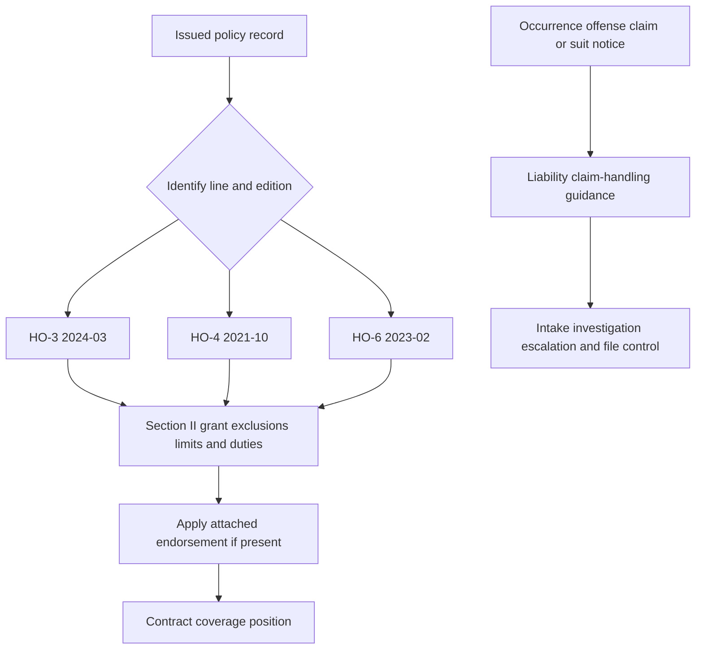

# Incidental Business and Personal Injury Liability

This page is a contract-coverage reference for the **HO-3 2024-03**, **HO-4 2021-10**, and **HO-6 2023-02** editions and for the attached 2011-05 endorsements discussed below. The issued declarations, policy edition, attached endorsements, facts, and applicable law control. An endorsement modifies the policy only according to its own wording; it does not make an internal guideline or an underwriting decision part of the contract.

## Coverage boundary and entrypoints

*Caption: Contract analysis begins with the issued policy and attached forms; the separate claim-handling guidance begins at notice and governs internal handling work without changing the contract.*

Use the [Liability Claim Handling Guidance](/openwiki/claims/guidelines/liability-claim-handling.md) after an occurrence, offense, claim, or suit is reported. That page is the navigable handling entrypoint for intake, policy retrieval, investigation, defense coordination, escalation, settlement authority, recovery, and closure. It is not a coverage grant, exclusion, defense commitment, authority delegation, or policy amendment ([Liability Claim Handling Guidance, H.0](repo://guidelines/claims/liability-claim-handling.md#L13-L37)).

## Base-form differences by line and edition

The homeowners forms share a Section II structure but are not interchangeable. The applicable form must be read in full with its declarations and endorsements; a result under HO-3 cannot be carried to HO-4 or HO-6 without checking the other form ([HO-3, Coverage E](repo://forms/HO/MS/HO-3/2024-03.md#L1023-L1071), [HO-4, Coverage E](repo://forms/HO/MS/HO-4/2021-10.md#L1087-L1153), [HO-6, Coverage E](repo://forms/HO/MS/HO-6/2023-02.md#L1004-L1050)).

| Edition and line | Coverage E and business boundary | Handling-relevant distinction |
|---|---|---|
| **HO-3 2024-03** | Coverage E pays damages for which an insured is legally liable because of bodily injury or property damage caused by an occurrence, and provides a defense for covered claims or suits. Its business exclusion preserves activities ordinarily incidental to nonbusiness pursuits. | The form applies to an insured location or an insured's personal activities. It separately states prompt notice, forwarding legal papers, cooperation, and consent before voluntary payment or assumed obligations ([HO-3, E.1–E.24](repo://forms/HO/MS/HO-3/2024-03.md#L1023-L1071)). |
| **HO-4 2021-10** | Coverage E pays damages for bodily injury or property damage caused by an occurrence and provides a defense by counsel of the insurer's choice. Its business exclusion applies to a business conducted from any location; its own exclusions and exceptions must be applied rather than importing the HO-3 incidental-activity exception. | The form expressly places defense expenses and taxed costs in addition to damages and has line-specific premises, vehicle, watercraft, business, property, and damages exclusions ([HO-4, E.1–E.33](repo://forms/HO/MS/HO-4/2021-10.md#L1087-L1153), [HO-4, X.12–X.32](repo://forms/HO/MS/HO-4/2021-10.md#L1221-L1265)). |
| **HO-6 2023-02** | Coverage E pays damages for bodily injury or property damage caused by an occurrence and provides a defense against a covered suit. The business exclusion applies unless coverage is expressly provided by the policy, so an attached endorsement must be checked for that express modification. | The condominium form has its own premises, business, contract, property, vehicle, watercraft, animal, and additional-coverage wording; its additional coverages remain separate from liability coverage and subject to their own terms ([HO-6, E.1–E.23](repo://forms/HO/MS/HO-6/2023-02.md#L1004-L1050), [HO-6, X.1–X.50](repo://forms/HO/MS/HO-6/2023-02.md#L1110-L1208), [HO-6, II.1–II.36](repo://forms/HO/MS/HO-6/2023-02.md#L1210-L1282)). |

The base Coverage E grants quoted in all three editions are for **bodily injury and property damage**. They do not, by themselves, supply the separate offense-based personal-injury grant described in HO 24 82. A personal-injury allegation therefore requires review of the attached personal-injury endorsement, if any, rather than treating a reference to personal injury in a definition or exclusion as a grant ([HO-3, E.1](repo://forms/HO/MS/HO-3/2024-03.md#L1023-L1029), [HO-3, X.45–X.46](repo://forms/HO/MS/HO-3/2024-03.md#L1203-L1209), [HO-4, E.1](repo://forms/HO/MS/HO-4/2021-10.md#L1087-L1095), [HO-6, E.1](repo://forms/HO/MS/HO-6/2023-02.md#L1004-L1010), [HO 24 82, W.1.1–W.1.7](repo://forms/HO/MS/HO-24-82/2011-05.md#L47-L63)).

Coverage F is also separate from Coverage E. HO-3 pays necessary medical expenses without regard to legal liability and preserves activities ordinarily incidental to nonbusiness pursuits in its business exclusion. HO-4 and HO-6 use their own business exclusions, eligibility rules, and applicable limits; payment under Coverage F is not an admission of Coverage E liability ([HO-3, F.1–F.20](repo://forms/HO/MS/HO-3/2024-03.md#L1073-L1113), [HO-4, F.1–F.20](repo://forms/HO/MS/HO-4/2021-10.md#L1155-L1195), [HO-6, F.1–F.27](repo://forms/HO/MS/HO-6/2023-02.md#L1052-L1106)).

## Baseline contract exclusions and limits

Business activity is a contract question, not an eligibility shortcut. The base forms exclude business-related liability in different places and with different exceptions. HO-3 separately addresses business conducted by an insured, business pursuits, business-use vehicles and watercraft, and business-use animals ([HO-3, E.8 and X.6, X.13–X.17, X.34–X.35](repo://forms/HO/MS/HO-3/2024-03.md#L1037-L1049), [HO-3, X.1121–X.1149](repo://forms/HO/MS/HO-3/2024-03.md#L1121-L1149), [HO-3, X.1181–X.1185](repo://forms/HO/MS/HO-3/2024-03.md#L1181-L1185)). HO-4 and HO-6 have different business, premises, professional-service, property, rental, farming, animal, and vehicle provisions ([HO-4, E.9–E.32](repo://forms/HO/MS/HO-4/2021-10.md#L1103-L1151), [HO-4, X.12–X.32](repo://forms/HO/MS/HO-4/2021-10.md#L1221-L1265), [HO-6, E.9–E.22](repo://forms/HO/MS/HO-6/2023-02.md#L1020-L1048), [HO-6, X.4–X.18 and X.25–X.32](repo://forms/HO/MS/HO-6/2023-02.md#L1114-L1150), [HO-6, X.45–X.50](repo://forms/HO/MS/HO-6/2023-02.md#L1198-L1208)). Contract exclusions remain applicable even when the risk would have required underwriting referral.

The base forms refer to the **applicable limit** rather than creating a new numeric limit in the Coverage E grant. HO-3 states that the applicable limit is the most payable for covered liability and that payment does not increase it; HO-4 and HO-6 end the defense duty when the applicable limit is exhausted by judgments or settlements. Each form also applies coverage separately to insureds without increasing the occurrence limit ([HO-3, AGR.4–AGR.9 and E.1–E.6](repo://forms/HO/MS/HO-3/2024-03.md#L21-L31), [HO-4, E.1–E.5 and E.33](repo://forms/HO/MS/HO-4/2021-10.md#L1087-L1097), [HO-6, E.1–E.8 and E.23](repo://forms/HO/MS/HO-6/2023-02.md#L1004-L1050)). HO-4 expressly pays defense expenses and taxed costs in addition to damages, while HO-3 and HO-6 state their own rules for reasonable expenses requested from an insured. Do not infer a separate limit, a per-claim limit, or unlimited defense from the existence of a defense provision.

## Attached endorsements that can modify the business or personal-injury result

The following endorsements are 2011-05 forms and apply only when actually attached to the issued policy. Their terms modify the policy only to the extent stated; unmodified policy provisions remain in force ([HO 24 71, W.0](repo://forms/HO/MS/HO-24-71/2011-05.md#L15-L29)).

### HO 04 42 — Permitted Incidental Occupancies

**HO 04 42 acts first by changing the policy for the permitted incidental occupancy.** It provides coverage for an insured's bodily injury, property damage, or personal injury liability arising from an occurrence connected with an incidental occupancy at premises used with the residence. The occupancy must be subordinate to residential use, lawful, and must not materially change the premises' residential character ([HO 04 42, W.1–W.3](repo://forms/HO/MS/HO-04-42/2011-05.md#L35-L41)).

The endorsement pays covered bodily-injury and property-damage damages, and personal-injury damages caused by an offense committed during the policy period. It also provides a defense, but the defense ends when the applicable limit is paid or when no coverage applies ([HO 04 42, W.4–W.7](repo://forms/HO/MS/HO-04-42/2011-05.md#L43-L49)). It does not make a person an insured: the form uses the policy's insured status, and its definitions state that an insured is a person or organization qualifying under the policy ([HO 04 42, W.0 and W.8](repo://forms/HO/MS/HO-04-42/2011-05.md#L15-L33), [HO 04 42, W.8](repo://forms/HO/MS/HO-04-42/2011-05.md#L587-L595)).

The grant is narrow. Incidental occupancy away from the residence is excluded, as are professional, medical, health-care, day-care, product, completed-work, employer, aircraft, watercraft, motor-vehicle, off-road-equipment, pollution, disease, intentional-act, and criminal-act exposures ([HO 04 42, W.8–W.29](repo://forms/HO/MS/HO-04-42/2011-05.md#L51-L93)). The endorsement also excludes a business other than the permitted incidental occupancy and an occupancy conducted before permission begins, after it ends, away from the residence premises, or in violation of law ([HO 04 42, W.4–W.7](repo://forms/HO/MS/HO-04-42/2011-05.md#L257-L279)). It is not blanket business liability.

The liability provision refers to the applicable limit but does not state a separate dollar amount in the cited liability grant. Its later limit section is written for covered property, so it should not be read as creating a new liability limit from that property wording ([HO 04 42, W.1–W.7](repo://forms/HO/MS/HO-04-42/2011-05.md#L35-L49), [HO 04 42, W.2.1–W.2.8](repo://forms/HO/MS/HO-04-42/2011-05.md#L135-L151)). Notice, forwarding suit papers, cooperation, inspection, preservation of evidence, and no voluntary payment or settlement without consent are material claim duties ([HO 04 42, W.30–W.38](repo://forms/HO/MS/HO-04-42/2011-05.md#L95-L111)).

### HO 24 71 — Business Pursuits

**HO 24 71 modifies the policy to cover the insured's business pursuit.** It pays personal-liability damages for bodily injury or property damage for which an insured is legally liable when the injury or damage arises out of that insured's business pursuit. It also provides medical-payments coverage for necessary medical expenses from bodily injury arising from that pursuit ([HO 24 71, W.1–W.2](repo://forms/HO/MS/HO-24-71/2011-05.md#L57-L62)). A business pursuit is a business activity that is continuous, regular, or undertaken with a profit motive, whether conducted from the residence or elsewhere ([HO 24 71, W.2](repo://forms/HO/MS/HO-24-71/2011-05.md#L897-L903)).

The endorsement covers the insured's business-use premises, the insured's acts or omissions within the pursuit, and acts or omissions of a person for whom the insured is legally responsible. It does not make any other person an insured and does not cover a pursuit conducted by a non-insured ([HO 24 71, W.3–W.6](repo://forms/HO/MS/HO-24-71/2011-05.md#L63-L69), [HO 24 71, W.49](repo://forms/HO/MS/HO-24-71/2011-05.md#L151-L161)). The form's grant is for bodily injury, property damage, and medical payments; the presence of “personal injury” in its definitions and exclusions is not a separate personal-injury grant ([HO 24 71, W.1–W.2 and W.46](repo://forms/HO/MS/HO-24-71/2011-05.md#L57-L62), [HO 24 71, W.46–W.48](repo://forms/HO/MS/HO-24-71/2011-05.md#L147-L155)).

The business-pursuit liability limit is **$100,000 for the sum of all damages** arising out of business pursuits. It is shared regardless of the number of insureds, claimants, claims, suits, or occurrences; payments reduce the remaining amount, defense costs do not reduce it, and the duty to defend ends after payment exhausts it ([HO 24 71, W.2.1–W.2.12](repo://forms/HO/MS/HO-24-71/2011-05.md#L163-L187)). The endorsement also says its coverage is subject to the personal-liability and medical-payments limits and does not increase those limits ([HO 24 71, W.48](repo://forms/HO/MS/HO-24-71/2011-05.md#L151-L155)).

Contract scope remains constrained by exclusions for professional services, products and completed work, employer and workers-compensation obligations, owned or controlled property, vehicles and watercraft, pollution, criminal or intentional acts, and other listed hazards ([HO 24 71, W.4.1–W.4.67](repo://forms/HO/MS/HO-24-71/2011-05.md#L305-L439)). The insured must promptly report an occurrence, claim, suit, or demand, forward legal papers, cooperate, preserve evidence, and obtain consent before voluntarily paying, assuming an obligation, or settling ([HO 24 71, W.5.1–W.5.17](repo://forms/HO/MS/HO-24-71/2011-05.md#L441-L477)).

### HO 24 73 — Farmers Personal Liability

**HO 24 73 modifies the policy for covered farming and farm premises.** It treats you, resident related household members, persons in their care, and a person or organization acting within the scope of duties performed for you in connection with covered farming as insureds ([HO 24 73, W.1–W.2](repo://forms/HO/MS/HO-24-73/2011-05.md#L41-L47)). Farm premises are land, structures, and appurtenant grounds used in farming; farming includes cultivating land, raising or caring for animals, and producing agricultural products ([HO 24 73, W.5 and Definitions W.8–W.9](repo://forms/HO/MS/HO-24-73/2011-05.md#L49-L53), [HO 24 73, W.8–W.9](repo://forms/HO/MS/HO-24-73/2011-05.md#L629-L633)).

The endorsement pays personal-liability damages for bodily injury or property damage caused by an occurrence arising from covered personal activities, farming, or ownership, maintenance, or use of farm premises. It also pays necessary medical expenses for bodily injury caused by an accident arising from those same sources, including permitted medical payments for persons on farm premises and certain persons away from an insured location ([HO 24 73, W.7–W.16](repo://forms/HO/MS/HO-24-73/2011-05.md#L53-L73)). Although “personal injury” appears in the claim and suit definition, the operative personal-liability grant is for bodily injury and property damage, not a separate personal-injury coverage ([HO 24 73, W.6–W.7](repo://forms/HO/MS/HO-24-73/2011-05.md#L51-L57)).

The applicable personal-liability and medical-payments limits remain controlling. The endorsement pays only up to the applicable limit, regardless of the number of insureds, claimants, claims, or suits, and the defense ends after the applicable limit is exhausted by judgments or settlements ([HO 24 73, W.8–W.11](repo://forms/HO/MS/HO-24-73/2011-05.md#L55-L65)). No separate farm dollar limit is stated in the cited coverage grant. The business exclusion, professional-services exclusion, employee and workers-compensation exclusions, and animal-used-in-business exclusion remain express contract constraints ([HO 24 73, W.21–W.26](repo://forms/HO/MS/HO-24-73/2011-05.md#L79-L97)).

Farm operations carry additional duties: maintain farm structures and animal controls, use care with agricultural materials and machinery, keep records, report farm-operation claims, and promptly report material changes, expansion, discontinuance, or transfer of control of the farming operation ([HO 24 73, W.7–W.22](repo://forms/HO/MS/HO-24-73/2011-05.md#L491-L521), [HO 24 73, W.28–W.31](repo://forms/HO/MS/HO-24-73/2011-05.md#L533-L539)). These are endorsement conditions and risk controls within the contract; they do not turn every farming or animal exposure into covered liability.

### HO 24 82 — Personal Injury Coverage

**HO 24 82 modifies the policy by providing a separate Personal Injury Coverage.** The insured remains the person who qualifies as an insured under the policy; the endorsement does not expand insured status ([HO 24 82, W.0](repo://forms/HO/MS/HO-24-82/2011-05.md#L15-L25)). It pays damages for which an insured is legally responsible when personal injury arises from an offense committed during the policy period, and it provides a defense even when allegations are groundless, false, or fraudulent, subject to the coverage grant and exclusions ([HO 24 82, W.1.1–W.1.7](repo://forms/HO/MS/HO-24-82/2011-05.md#L47-L63)).

Covered personal injury includes false arrest, detention or imprisonment, malicious prosecution, wrongful eviction or entry, invasion of private occupancy, and oral or written publication that slanders, libels, defames, or violates privacy rights ([HO 24 82, W.1.1–W.1.2](repo://forms/HO/MS/HO-24-82/2011-05.md#L49-L53)). The offense must arise from ownership, maintenance, or use of a covered residence or from personal activities ([HO 24 82, W.1.6](repo://forms/HO/MS/HO-24-82/2011-05.md#L57-L63)).

The endorsement does not cover personal injury arising from business pursuits or business activities conducted from an insured location. Its narrower exception is for activities ordinarily incidental to nonbusiness pursuits, not for a general business operation ([HO 24 82, W.1.15–W.1.16](repo://forms/HO/MS/HO-24-82/2011-05.md#L75-L79)). It also excludes, among other things, knowing rights violations, knowingly false or pre-policy publications, criminal acts, professional services, and specified organizational, employment, rental, and animal-business exposures ([HO 24 82, W.1.9–W.1.14](repo://forms/HO/MS/HO-24-82/2011-05.md#L65-L75), [HO 24 82, W.1.31–W.1.39](repo://forms/HO/MS/HO-24-82/2011-05.md#L109-L127), [HO 24 82, W.1.59–W.1.61](repo://forms/HO/MS/HO-24-82/2011-05.md#L161-L171)).

The applicable Personal Injury Limit of Liability is one shared maximum for all covered damages from an occurrence, not a separate limit per insured, claimant, claim, or suit. Payments reduce the available limit, defense and investigation expenses do not reduce it, and the duty to defend ends when judgments or settlements exhaust it ([HO 24 82, W.2.1–W.2.9 and W.2.27–W.2.37](repo://forms/HO/MS/HO-24-82/2011-05.md#L205-L223), [HO 24 82, W.2.27–W.2.37](repo://forms/HO/MS/HO-24-82/2011-05.md#L257-L279)). The endorsement expressly says its attachment does not increase the limits of liability ([HO 24 82, W.0](repo://forms/HO/MS/HO-24-82/2011-05.md#L41-L45)).

### HO 04 96 — No Section II Liability Coverages

**HO 04 96 is titled “No Section II — Liability Coverages,” but the supplied form text has a material internal conflict.** Its title identifies a no-Section-II form ([HO 04 96, title](repo://forms/HO/MS/HO-04-96/2011-05.md#L1-L8)), while its operative W.1 provisions expressly say that the insurer provides personal liability coverage for bodily injury or property damage and medical-payments coverage, including defense and activities of an insured ([HO 04 96, W.1.1–W.1.12](repo://forms/HO/MS/HO-04-96/2011-05.md#L57-L81)). The same text later supplies a general limit-of-liability section rather than an operative deletion of Section II ([HO 04 96, W.2.1–W.2.29](repo://forms/HO/MS/HO-04-96/2011-05.md#L199-L257)).

Accordingly, do not infer a Section II deletion from the title alone, and do not override the title with the contradictory grant. On an issued policy, reconcile the attached form, declarations, and controlling policy text before concluding whether Section II is available. If HO 04 96 is intended to remove Section II, the operative issued form must establish that result; the supplied transcription does not contain such a deletion clause.

## Contract coverage versus underwriting controls

The endorsements answer what the contract covers after attachment. They do not supersede internal risk-selection rules. Texas appetite guidance allows binding only when business use is not a principal or material commercial use and agricultural activity does not materially alter the residential character; it separately identifies liability-appropriate premises activities and animal exposure as underwriting questions ([Texas homeowners appetite, H.1.19–H.1.23 and H.1.28–H.1.30](repo://guidelines/appetite/tx-homeowners.md#L97-L119), [Texas homeowners appetite, H.1.43–H.1.46](repo://guidelines/appetite/tx-homeowners.md#L143-L151)).

The underwriting manual is stricter operationally: it directs referral of business operations, agricultural activity, livestock, and aggressive-animal exposure ([Underwriting Manual, 120.R–120.U](repo://manuals/underwriting/manual.md#L829-L845)); it also directs referral of premises used for business operations, professional services, client meetings, production, farming, animal keeping, crop activity, or agricultural equipment ([Underwriting Manual, 150.AE–150.AG](repo://manuals/underwriting/manual.md#L1801-L1817)). Those instructions are internal appetite and referral controls, not additional policy exclusions and not proof that an attached endorsement grants coverage.

## Claim-handling boundary

When notice arrives, use the linked [Liability Claim Handling Guidance](/openwiki/claims/guidelines/liability-claim-handling.md) for internal workflow, not as contract language. The guidance requires opening a file for an occurrence, offense, claim, or suit; identifying every named insured, additional insured, and claimant; obtaining the complaint or demand and service information; reviewing the policy in force before assigning counsel; and comparing allegations with the grant, exclusions, endorsements, and conditions ([Liability guideline H.6.1–H.6.8](repo://guidelines/claims/liability-claim-handling.md#L541-L559)).

The claims manual supplies investigation and file controls: distinguish facts from allegations, preserve photographs, recordings, messages, and physical evidence, evaluate liability before stating a position, inspect property when useful, and refer serious injury or complex liability matters ([Claims Manual 8.A–8.Q](repo://manuals/claims/manual.md#L2527-L2627)). It also provides internal screens for delayed notice, such as treating notice within 30 days as timely and escalating later notice when investigation may be affected; that screen does not replace the policy's prompt-notice condition ([Claims Manual 8.E](repo://manuals/claims/manual.md#L2551-L2555), [HO-3 E.21–E.23](repo://forms/HO/MS/HO-3/2024-03.md#L1065-L1069)).

For defense and resolution, the handling guidance distinguishes the potentially broader defense question from final indemnity, requires authority before settlement offers or demand acceptance, escalates severe or unusual matters, protects contribution and recovery rights, and closes only after defense, indemnity, expense, recovery, and reporting obligations are resolved ([Liability guideline H.6.11–H.6.18 and H.6.36–H.6.38](repo://guidelines/claims/liability-claim-handling.md#L559-L575), [Claims Manual 8.BV–8.CH](repo://manuals/claims/manual.md#L2965-L3039)). These are handling controls. The policy edition and attached endorsements still determine coverage, exclusions, limits, conditions, and defense obligations.

## Coverage checklist

1. Identify the applicable line and edition, policy period, declarations, and every attached endorsement.
2. Identify each person seeking protection and apply insured status separately where the form requires it.
3. Classify the alleged harm as bodily injury, property damage, medical payments, or personal injury. Do not turn a definition or exclusion reference into a coverage grant.
4. Match the activity, premises, conduct, and offense to the applicable grant, then apply the complete form exclusions and endorsement exclusions.
5. Apply the applicable shared limit and confirm whether payments exhaust it or whether a separate endorsement limit applies. Multiple insureds, claimants, theories, or suits do not automatically create another limit.
6. Check notice, legal-paper forwarding, cooperation, evidence, recovery, voluntary-payment, settlement, and any endorsement-specific duties.
7. Use the claim-handling guidance for investigation, escalation, authority, defense coordination, and file closure; record the coverage position from the issued contract, facts, and applicable law.

## Related references

- [Liability Claim Handling Guidance](/openwiki/claims/guidelines/liability-claim-handling.md) — intake, coverage-review workflow, investigation, defense, authority, recovery, and closure.
- [Liability E–F](/openwiki/coverage/parts/liability-e-f.md) — related liability and medical-payments reference.
- [Editions and State Attachments](/openwiki/policy-assembly/editions-and-state-attachments.md) — policy assembly and attachment context.
- [Referral Authority](/openwiki/underwriting/guidelines/referral-authority.md) — underwriting referral controls.
- [Liability Losses and Occupancy](/openwiki/underwriting/manual/liability-losses-and-occupancy.md) — underwriting context; do not substitute it for claim coverage analysis.
itute it for claim coverage analysis.
