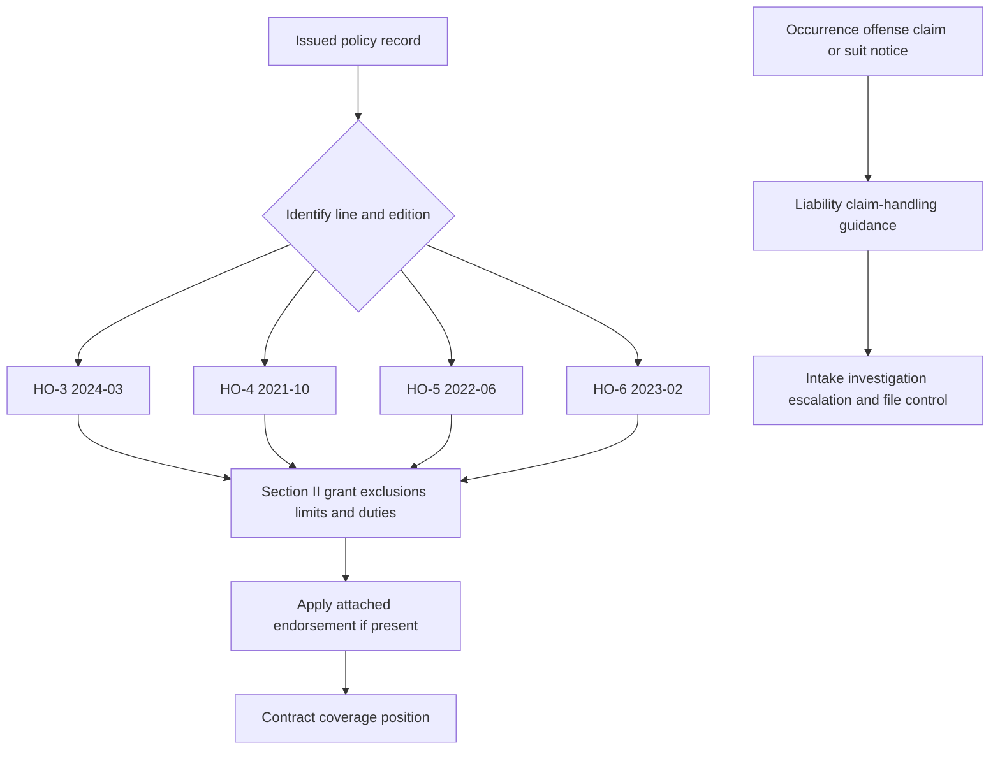

# Incidental Business and Personal Injury

This is a contract-coverage reference for **HO-3 2024-03**, **HO-4 2021-10**, **HO-5 2022-06**, and **HO-6 2023-02**, together with the attached 2011-05 liability endorsements and the other endorsement editions identified below. The issued declarations, policy edition, attached forms, facts, and applicable law control. An endorsement modifies the policy only according to its own wording; an internal guideline or underwriting decision is not a contract term.

## Coverage boundary and entrypoints

*Caption: Contract analysis starts with the issued line and edition, then applies the attached endorsement; the separate handling path starts at notice and does not amend the contract.*

Use [Liability Claim Handling Guidance](/openwiki/claims/guidelines/liability-claim-handling.md) after an occurrence, offense, claim, or suit is reported. It is the internal entrypoint for intake, policy retrieval, investigation, defense coordination, escalation, settlement authority, recovery, and closure; it is not a coverage grant, exclusion, defense commitment, authority delegation, or policy amendment ([Liability Claim Handling Guidance, H.0](repo://guidelines/claims/liability-claim-handling.md#L13-L37)).

## Base-form differences by line and edition

The forms share a Section II structure but are not interchangeable. Read the applicable form with its declarations and endorsements; do not carry an HO-3 result to HO-4, HO-5, or HO-6 without checking the other form ([HO-3, Coverage E](repo://forms/HO/MS/HO-3/2024-03.md#L933-L981), [HO-4, Coverage E](repo://forms/HO/MS/HO-4/2021-10.md#L1007-L1073), [HO-5, Coverage E](repo://forms/HO/MS/HO-5/2022-06.md#L1129-L1195), [HO-6, Coverage E](repo://forms/HO/MS/HO-6/2023-02.md#L1016-L1062)).

| Edition and line | Coverage E and business boundary | Handling-relevant distinction |
|---|---|---|
| **HO-3 2024-03** | Coverage E pays damages for which an insured is legally liable because of **bodily injury** or **property damage** caused by an occurrence and provides a defense. The business exclusion preserves “activities ordinarily incident to nonbusiness pursuits.” | The grant reaches an insured location and personal activities. E.21–E.24 separately require prompt notice, forwarding legal papers, cooperation, and consent before voluntary payment or assumed obligations ([HO-3, E.1–E.24](repo://forms/HO/MS/HO-3/2024-03.md#L933-L981)). |
| **HO-4 2021-10** | Coverage E pays damages for bodily injury or property damage caused by an occurrence and provides a defense by counsel of the insurer's choice. Its business exclusion applies to business conducted “from any location”; do not import the HO-3 incidental-activity exception. | Defense expenses and taxed costs are stated in addition to damages. The form's own premises, vehicle, watercraft, property, rental, farming, and damages exclusions control ([HO-4, E.1–E.33](repo://forms/HO/MS/HO-4/2021-10.md#L1007-L1073), [HO-4, X.1–X.32](repo://forms/HO/MS/HO-4/2021-10.md#L1117-L1179)). |
| **HO-5 2022-06** | Coverage E pays damages for bodily injury or property damage caused by an occurrence and provides a defense. It separately excludes business and “business pursuit” exposures, with an incidental-to-nonbusiness exception in E.11; Coverage F separately excludes bodily injury arising from a business ([HO-5, E.1–E.11](repo://forms/HO/MS/HO-5/2022-06.md#L1129-L1151), [HO-5, F.1–F.27](repo://forms/HO/MS/HO-5/2022-06.md#L1197-L1251)). | Its Section II exclusions separately address business property, occasional rental up to fifteen days, professional services, business-entity roles, and vehicles/watercraft/aircraft. The form's language, not an HO-3 shortcut, controls ([HO-5, X.1–X.20](repo://forms/HO/MS/HO-5/2022-06.md#L1253-L1293), [HO-5, X.6–X.10 and X.41–X.50](repo://forms/HO/MS/HO-5/2022-06.md#L1263-L1273), [HO-5, X.40–X.50](repo://forms/HO/MS/HO-5/2022-06.md#L1333-L1353)). |
| **HO-6 2023-02** | Coverage E pays damages for bodily injury or property damage caused by an occurrence and provides a defense. Its business exclusion does not apply only when coverage is “expressly provided by this policy,” so an attached endorsement must be checked for that express modification. | The condominium form has its own premises, business, contract, property, vehicle, watercraft, animal, and additional-coverage wording. Additional coverages remain separate and subject to their own terms ([HO-6, E.1–E.23](repo://forms/HO/MS/HO-6/2023-02.md#L1016-L1062), [HO-6, X.1–X.50](repo://forms/HO/MS/HO-6/2023-02.md#L1120-L1220), [HO-6, II.1–II.36](repo://forms/HO/MS/HO-6/2023-02.md#L1222-L1294)). |

The base Coverage E grants in these four editions address **bodily injury and property damage**. They do not by themselves supply the separate offense-based personal-injury grant in HO 24 82. A personal-injury allegation therefore requires review of the attached personal-injury endorsement, if any, rather than treating a reference to personal injury in a definition or exclusion as a grant ([HO-3, E.1](repo://forms/HO/MS/HO-3/2024-03.md#L933-L936), [HO-4, E.1](repo://forms/HO/MS/HO-4/2021-10.md#L1007-L1013), [HO-5, E.1](repo://forms/HO/MS/HO-5/2022-06.md#L1129-L1135), [HO-6, E.1](repo://forms/HO/MS/HO-6/2023-02.md#L1016-L1022), [HO 24 82, W.1.1–W.1.7](repo://forms/HO/MS/HO-24-82/2011-05.md#L47-L63)).

Coverage F is separate from Coverage E. HO-3's business exclusion preserves only activities ordinarily incidental to nonbusiness pursuits; HO-4, HO-5, and HO-6 use their own business exclusions, eligibility rules, and limits. Payment under Coverage F is not an admission of Coverage E liability ([HO-3, F.1–F.20](repo://forms/HO/MS/HO-3/2024-03.md#L983-L1023), [HO-4, F.1–F.20](repo://forms/HO/MS/HO-4/2021-10.md#L1075-L1115), [HO-5, F.1–F.27](repo://forms/HO/MS/HO-5/2022-06.md#L1197-L1251), [HO-6, F.1–F.27](repo://forms/HO/MS/HO-6/2023-02.md#L1064-L1118)).

## Baseline exclusions and limits

Business activity is a contract question, not an eligibility shortcut. HO-3 excludes business and business-pursuit liability, then separately constrains business-use vehicles, watercraft, and animals; its quoted business exception is “activities ordinarily incident to nonbusiness pursuits” ([HO-3, E.8–E.11](repo://forms/HO/MS/HO-3/2024-03.md#L947-L955), [HO-3, X.3–X.17](repo://forms/HO/MS/HO-3/2024-03.md#L1031-L1059), [HO-3, X.33–X.35](repo://forms/HO/MS/HO-3/2024-03.md#L1091-L1095)). HO-4, HO-5, and HO-6 have different business, premises, professional-service, property, rental, farming, animal, and vehicle provisions ([HO-4, E.9–E.32](repo://forms/HO/MS/HO-4/2021-10.md#L1025-L1071), [HO-5, E.9–E.11 and X.6–X.10](repo://forms/HO/MS/HO-5/2022-06.md#L1147-L1151), [HO-5, X.6–X.10](repo://forms/HO/MS/HO-5/2022-06.md#L1263-L1273), [HO-6, E.10–E.22](repo://forms/HO/MS/HO-6/2023-02.md#L1036-L1060), [HO-6, X.4–X.10](repo://forms/HO/MS/HO-6/2023-02.md#L1128-L1140)). A referral or non-acceptance decision does not itself create a contract exclusion.

The base forms use the applicable liability limit rather than creating a new numeric limit in the Coverage E grant. Each applies coverage separately to insureds without increasing the occurrence limit, and each ends the defense duty when the applicable limit is exhausted ([HO-3, E.1–E.6](repo://forms/HO/MS/HO-3/2024-03.md#L933-L945), [HO-4, E.1–E.7 and E.33](repo://forms/HO/MS/HO-4/2021-10.md#L1007-L1021), [HO-5, E.1–E.7 and E.33](repo://forms/HO/MS/HO-5/2022-06.md#L1129-L1143), [HO-6, E.1–E.7 and E.23](repo://forms/HO/MS/HO-6/2023-02.md#L1016-L1030)). HO-4 expressly places defense expenses and taxed costs in addition to damages; HO-3, HO-5, and HO-6 state their own requested-expense and defense rules. Do not infer a separate limit, a per-claim limit, or unlimited defense from the existence of a defense provision.

## Liability endorsements

The following 2011-05 forms apply only when actually attached. Their terms modify the policy only to the extent stated; unmodified policy provisions remain in force ([HO 24 71, W.0](repo://forms/HO/MS/HO-24-71/2011-05.md#L15-L29)).

### HO 04 42 — Permitted Incidental Occupancies

**HO 04 42 provides** coverage for an insured's bodily injury, property damage, or personal injury liability arising from an occurrence connected with an incidental occupancy at premises used with the residence. The occupancy must be subordinate to residential use, lawful, and must not materially change the premises' residential character ([HO 04 42, W.1–W.3](repo://forms/HO/MS/HO-04-42/2011-05.md#L35-L41)).

**HO 04 42 pays** covered bodily-injury and property-damage damages and personal-injury damages caused by an offense committed during the policy period, and provides a defense until the applicable limit is paid or no coverage applies ([HO 04 42, W.4–W.7](repo://forms/HO/MS/HO-04-42/2011-05.md#L43-L49)). It uses the policy's insured status rather than expanding who is insured ([HO 04 42, W.0 and W.8](repo://forms/HO/MS/HO-04-42/2011-05.md#L15-L33), [HO 04 42, W.8](repo://forms/HO/MS/HO-04-42/2011-05.md#L587-L595)).

**HO 04 42 excludes** incidental occupancy away from the residence and professional, medical, health-care, day-care, product, completed-work, employer, aircraft, watercraft, motor-vehicle, off-road-equipment, pollution, disease, intentional-act, and criminal-act exposures. It also excludes a business other than the permitted incidental occupancy and an occupancy before permission begins, after it ends, away from the residence premises, or in violation of law ([HO 04 42, W.8–W.29](repo://forms/HO/MS/HO-04-42/2011-05.md#L51-L93), [HO 04 42, W.4–W.7](repo://forms/HO/MS/HO-04-42/2011-05.md#L257-L279)). This is not blanket business liability.

The liability grant directs the reader to the applicable limit. Its later W.2 provisions address covered property damage and property limits, so they should not be read as creating a new liability limit from property wording ([HO 04 42, W.1–W.7](repo://forms/HO/MS/HO-04-42/2011-05.md#L35-L49), [HO 04 42, W.2.1–W.2.8](repo://forms/HO/MS/HO-04-42/2011-05.md#L135-L151)). Notice, legal-paper forwarding, cooperation, inspection, evidence preservation, and consent before voluntary payment or settlement are material duties ([HO 04 42, W.30–W.38](repo://forms/HO/MS/HO-04-42/2011-05.md#L95-L111)).

### HO 24 71 — Business Pursuits

**HO 24 71 modifies** the policy to provide personal-liability coverage for bodily injury or property damage and medical-payments coverage arising from an insured's business pursuit. A business pursuit is continuous, regular, or profit-motivated business activity conducted from the residence or elsewhere ([HO 24 71, W.1–W.2](repo://forms/HO/MS/HO-24-71/2011-05.md#L57-L62), [HO 24 71, definitions](repo://forms/HO/MS/HO-24-71/2011-05.md#L897-L903)). It covers specified business-use premises, the insured's acts or omissions, and acts or omissions of a person for whom the insured is legally responsible, without making another person an insured ([HO 24 71, W.3–W.6](repo://forms/HO/MS/HO-24-71/2011-05.md#L63-L69), [HO 24 71, W.49](repo://forms/HO/MS/HO-24-71/2011-05.md#L151-L161)).

**HO 24 71 limits** business-pursuit damages to **$100,000**, applied to total damages regardless of the number of insureds, claimants, claims, or suits. The endorsement makes its coverage subject to, and non-increasing of, the personal-liability and medical-payments limits. When the available amount is paid to settle, the duty to defend ends and further defense or settlement responsibility shifts to the insured, with reimbursement of reasonable defense expenses advanced afterward ([HO 24 71, W.48](repo://forms/HO/MS/HO-24-71/2011-05.md#L151-L155), [HO 24 71, W.2.1–W.2.3](repo://forms/HO/MS/HO-24-71/2011-05.md#L163-L169), [HO 24 71, W.2.16](repo://forms/HO/MS/HO-24-71/2011-05.md#L193-L197)).

**HO 24 71 excludes** professional services, products and completed work, employer and workers-compensation obligations, owned or controlled property, vehicles and watercraft, pollution, criminal or intentional acts, and other listed hazards. It also imposes prompt notice, legal-paper, cooperation, evidence-preservation, and consent duties ([HO 24 71, W.4.1–W.4.67](repo://forms/HO/MS/HO-24-71/2011-05.md#L305-L439), [HO 24 71, W.5.1–W.5.17](repo://forms/HO/MS/HO-24-71/2011-05.md#L441-L477)). The grant is for bodily injury, property damage, and medical payments; “personal injury” in a definition or exclusion is not a separate grant ([HO 24 71, W.1–W.2 and W.46](repo://forms/HO/MS/HO-24-71/2011-05.md#L57-L62), [HO 24 71, W.46–W.48](repo://forms/HO/MS/HO-24-71/2011-05.md#L147-L155)).

### HO 24 73 — Farmers Personal Liability

**HO 24 73 modifies** the policy for covered farming and farm premises. It includes resident related household members, persons in their care, and a person or organization acting within the scope of duties performed for the insured in connection with covered farming ([HO 24 73, W.1–W.2](repo://forms/HO/MS/HO-24-73/2011-05.md#L41-L47)). Farm premises are land, structures, and appurtenant grounds used in farming; farming includes cultivating land, raising or caring for animals, and producing agricultural products ([HO 24 73, W.5 and definitions W.8–W.9](repo://forms/HO/MS/HO-24-73/2011-05.md#L49-L53), [HO 24 73, definitions](repo://forms/HO/MS/HO-24-73/2011-05.md#L629-L633)).

**HO 24 73 pays** personal-liability damages for bodily injury or property damage caused by an occurrence arising from covered personal activities, farming, or farm premises, and necessary medical expenses for bodily injury caused by an accident arising from those sources. “Personal injury” in the claim and suit definition is not a separate personal-injury grant ([HO 24 73, W.6–W.16](repo://forms/HO/MS/HO-24-73/2011-05.md#L51-L73)).

**HO 24 73 applies** the applicable personal-liability and medical-payments limits without stating a separate farm dollar limit in the cited grant. The limit is shared across insureds and claimants, and defense ends after exhaustion. Business, professional-services, employee, workers-compensation, and business-animal exclusions remain express constraints ([HO 24 73, W.8–W.11](repo://forms/HO/MS/HO-24-73/2011-05.md#L55-L65), [HO 24 73, W.21–W.26](repo://forms/HO/MS/HO-24-73/2011-05.md#L79-L97)). Farming-specific duties address structures, animal controls, agricultural materials and machinery, records, farm-operation claims, and material changes, expansion, discontinuance, or transfer of control ([HO 24 73, W.7–W.22](repo://forms/HO/MS/HO-24-73/2011-05.md#L491-L521), [HO 24 73, W.28–W.31](repo://forms/HO/MS/HO-24-73/2011-05.md#L533-L539)).

### HO 24 82 — Personal Injury Coverage

**HO 24 82 provides** separate Personal Injury Coverage for an insured legally responsible for damages arising from a covered offense during the policy period. Covered offenses include false arrest, detention or imprisonment, malicious prosecution, wrongful eviction or entry, invasion of private occupancy, defamation, and privacy violations; the offense must arise from covered residence use or personal activities ([HO 24 82, W.0](repo://forms/HO/MS/HO-24-82/2011-05.md#L15-L29), [HO 24 82, W.1.1–W.1.7](repo://forms/HO/MS/HO-24-82/2011-05.md#L47-L63)).

**HO 24 82 excludes** personal injury arising from business pursuits or business activities conducted from an insured location, except for “activities ordinarily incidental to nonbusiness pursuits.” It also excludes knowing rights violations, knowingly false or pre-policy publications, criminal acts, professional services, and specified organizational, employment, rental, and animal-business exposures ([HO 24 82, W.1.9–W.1.16](repo://forms/HO/MS/HO-24-82/2011-05.md#L65-L79), [HO 24 82, W.1.31–W.1.39](repo://forms/HO/MS/HO-24-82/2011-05.md#L109-L127), [HO 24 82, W.1.59–W.1.61](repo://forms/HO/MS/HO-24-82/2011-05.md#L161-L171)).

**HO 24 82 applies** one shared Personal Injury Limit of Liability to total covered damages, not a separate limit per insured, claimant, claim, or suit. Approved settlement payments reduce the remaining amount; attachment does not increase the limits of liability, and the preamble states that the duty to defend ends when the applicable limit has been paid ([HO 24 82, W.2.1–W.2.9 and W.2.13–W.2.14](repo://forms/HO/MS/HO-24-82/2011-05.md#L205-L233), [HO 24 82, W.2.26–W.2.31](repo://forms/HO/MS/HO-24-82/2011-05.md#L257-L267), [HO 24 82, W.0](repo://forms/HO/MS/HO-24-82/2011-05.md#L41-L45)).

### HO 04 96 — No Section II Liability Coverages

**HO 04 96 is titled** “No Section II — Liability Coverages,” but its supplied text has a material internal conflict. The title identifies a no-Section-II form, while W.1 expressly provides personal liability coverage for bodily injury or property damage, a defense, and medical-payments coverage with location and activity triggers ([HO 04 96, title](repo://forms/HO/MS/HO-04-96/2011-05.md#L1-L8), [HO 04 96, W.1.1–W.1.12](repo://forms/HO/MS/HO-04-96/2011-05.md#L57-L81)). W.2 then states an applicable limit shown in the Declarations and applies it to total damages from an occurrence without increasing it for multiple insureds, claims, or claimants ([HO 04 96, W.2.1–W.2.7](repo://forms/HO/MS/HO-04-96/2011-05.md#L199-L213)).

Accordingly, do not infer a Section II deletion from the title alone, and do not override the title with the contradictory grant. On an issued policy, reconcile the attached form, declarations, and controlling policy text before concluding whether Section II is available. The supplied text does not itself show an operative Section II deletion instruction; the issued policy record must establish which result controls.

## Seed endorsements that do not modify liability coverage

The seed set also contains property and financial-loss endorsements. Their presence must not be mistaken for a Coverage E, Coverage F, business-pursuits, incidental-occupancy, farming, or personal-injury endorsement.

| Endorsement and line | What the endorsement changes | Liability boundary |
|---|---|---|
| **HO 04 48, HO-3, 2026-06 — Other Structures — Increased Limits** | **HO 04 48 changes** Coverage B for “Other Structures”; it says the endorsement “does not change the property to which coverage applies” and excludes an other structure used “in whole or in part for ‘business’ purposes,” farming, and certain rental uses ([HO 04 48, preamble and W.1](repo://forms/HO/MS/HO-04-48/2026-06.md#L13-L47)). | It is a Coverage B property-limit form, not a liability grant. Its increased limit does not convert a business, farming, or rental exclusion into covered liability. |
| **HO 04 53, HO-3, 2013-06 — Credit Card, Fund Transfer Card, Forgery — Increased Limit** | **HO 04 53 changes** credit-card, fund-transfer-card, forgery, and counterfeit-loss coverage; it expressly changes only the provisions it addresses, and its coverage is direct financial loss ([HO 04 53, W.0](repo://forms/HO/MS/HO-04-53/2013-06.md#L13-L25), [HO 04 53, W.1](repo://forms/HO/MS/HO-04-53/2013-06.md#L57-L59)). Its financial-loss section excludes loss from an insured's business activity ([HO 04 53, W.1.44–W.1.46](repo://forms/HO/MS/HO-04-53/2013-06.md#L143-L149)). | It is not business-pursuits liability or personal-injury coverage. The endorsement's $10,000 financial-loss limit is not a Coverage E or Coverage F limit ([HO 04 53, W.2.1–W.2.5](repo://forms/HO/MS/HO-04-53/2013-06.md#L171-L181)). |
| **HO 04 65, HO-3, 2018-09 — Coverage C — Increased Special Limits** | **HO 04 65 provides** increased Coverage C special limits only, says it “does not create coverage except as expressly provided,” and leaves other coverage terms unchanged ([HO 04 65, W.0](repo://forms/HO/MS/HO-04-65/2018-09.md#L13-L25), [HO 04 65, W.1](repo://forms/HO/MS/HO-04-65/2018-09.md#L45-L57), [HO 04 65, W.1.55](repo://forms/HO/MS/HO-04-65/2018-09.md#L151-L155)). | It changes personal-property special limits, not Section II liability. A changed Coverage C limit does not expand business or personal-injury liability. |
| **HO 04 91, HO-6, 2019-03 — Water Backup — Unit-Owners** | **HO 04 91 provides** direct physical-loss coverage for covered property damaged by Water Backup and states a $7,500 maximum for water backup and sump overflow ([HO 04 91, W.1](repo://forms/HO/MS/HO-04-91/2019-03.md#L41-L59), [HO 04 91, W.2](repo://forms/HO/MS/HO-04-91/2019-03.md#L113-L127)). | It is a property-loss endorsement, not HO-6 Coverage E, Coverage F, or personal-injury coverage. Its business-property exclusion concerns the property-loss grant ([HO 04 91, W.4.19–W.4.22](repo://forms/HO/MS/HO-04-91/2019-03.md#L253-L263)). |
| **HO 04 92, HO-4, 2019-03 — Water Backup — Tenants** | **HO 04 92 provides** direct physical-loss coverage for covered personal property damaged by water backup and states a $2,500 maximum for water backup or sump overflow ([HO 04 92, W.1](repo://forms/HO/MS/HO-04-92/2019-03.md#L41-L55), [HO 04 92, W.2](repo://forms/HO/MS/HO-04-92/2019-03.md#L115-L133)). | It is a property-loss endorsement, not HO-4 Coverage E, Coverage F, or personal-injury coverage. Its business-property exclusion applies to the water-backup property grant ([HO 04 92, W.4.28–W.4.30](repo://forms/HO/MS/HO-04-92/2019-03.md#L293-L301)). |

## Contract coverage versus underwriting controls

The endorsements answer what the contract covers after attachment. They do not supersede internal risk-selection rules. Texas appetite guidance allows binding only when business use is not a principal or material commercial use and agricultural activity does not materially alter the residential character; it separately identifies liability-appropriate premises activities and animal exposure as underwriting questions ([Texas homeowners appetite, H.1.19–H.1.23 and H.1.28–H.1.30](repo://guidelines/appetite/tx-homeowners.md#L97-L119), [Texas homeowners appetite, H.1.43–H.1.46](repo://guidelines/appetite/tx-homeowners.md#L143-L151)).

The underwriting manual is stricter operationally: it directs referral of business operations, agricultural activity, livestock, and aggressive-animal exposure, and referral of premises used for business operations, professional services, client meetings, production, farming, animal keeping, crop activity, or agricultural equipment ([Underwriting Manual, 120.R–120.U](repo://manuals/underwriting/manual.md#L829-L845), [Underwriting Manual, 150.AE–150.AG](repo://manuals/underwriting/manual.md#L1801-L1817)). Those are internal appetite and referral controls, not additional policy exclusions and not proof that an attached endorsement grants coverage.

## Claim-handling boundary

When notice arrives, use [Liability Claim Handling Guidance](/openwiki/claims/guidelines/liability-claim-handling.md) for internal workflow, not as contract language. The guidance requires opening a file for an occurrence, offense, claim, or suit; identifying each named insured, additional insured, and claimant; obtaining the complaint or demand and service information; reviewing the policy in force before assigning counsel; and comparing allegations with the grant, exclusions, endorsements, and conditions ([Liability guideline H.6.1–H.6.8](repo://guidelines/claims/liability-claim-handling.md#L541-L559)).

The claims manual supplies investigation and file controls: distinguish facts from allegations, preserve photographs, recordings, messages, and physical evidence, evaluate liability before stating a position, inspect property when useful, and refer serious injury or complex liability matters. Its internal screen treating notice within 30 days as timely and escalating later notice does not replace a policy's prompt-notice condition ([Claims Manual 8.A–8.Q](repo://manuals/claims/manual.md#L2527-L2627), [Claims Manual 8.E](repo://manuals/claims/manual.md#L2551-L2555), [HO-3 E.21–E.23](repo://forms/HO/MS/HO-3/2024-03.md#L975-L981)).

For defense and resolution, the handling guidance distinguishes the potentially broader defense question from final indemnity, requires authority before settlement offers or demand acceptance, escalates severe or unusual matters, protects contribution and recovery rights, and closes only after defense, indemnity, expense, recovery, and reporting obligations are resolved ([Liability guideline H.6.11–H.6.18 and H.6.36–H.6.38](repo://guidelines/claims/liability-claim-handling.md#L559-L575), [Claims Manual 8.BV–8.CH](repo://manuals/claims/manual.md#L2965-L3039)). These are handling controls; the policy edition and attached endorsements still determine coverage, exclusions, limits, conditions, and defense obligations.

## Coverage checklist

1. Identify the applicable line and edition, policy period, declarations, and every attached endorsement.
2. Identify each person seeking protection and apply insured status separately where the form requires it.
3. Classify the alleged harm as bodily injury, property damage, medical payments, or personal injury. Do not turn a definition or exclusion reference into a coverage grant.
4. Match the activity, premises, conduct, and offense to the applicable grant, then apply the complete base-form and endorsement exclusions.
5. Apply the applicable shared limit and confirm whether payments exhaust it or whether a separate endorsement limit applies. Multiple insureds, claimants, theories, or suits do not automatically create another limit.
6. Confirm that a property-only endorsement, such as HO 04 48, HO 04 53, HO 04 65, HO 04 91, or HO 04 92, is not being used as a liability grant.
7. Check notice, legal-paper forwarding, cooperation, evidence, recovery, voluntary-payment, settlement, and endorsement-specific duties.
8. Use the claim-handling guidance and claims manual for investigation, escalation, authority, defense coordination, and file closure; record the coverage position from the issued contract, facts, and applicable law.

## Related references

- [Liability Claim Handling Guidance](/openwiki/claims/guidelines/liability-claim-handling.md) — intake, coverage-review workflow, investigation, defense, authority, recovery, and closure.
- [Liability Specialty and Recovery Manual](/openwiki/claims/manual/liability-specialty-and-recovery.md) — specialty liability investigation, authority, recovery, and closure controls.
- [Liability E–F](/openwiki/coverage/parts/liability-e-f.md) — related liability and medical-payments reference.
- [Editions and State Attachments](/openwiki/policy-assembly/editions-and-state-attachments.md) — policy assembly and attachment context.
- [Referral Authority](/openwiki/underwriting/guidelines/referral-authority.md) — underwriting referral controls.
- [Liability Losses and Occupancy](/openwiki/underwriting/manual/liability-losses-and-occupancy.md) — underwriting context; do not substitute it for claim coverage analysis.
