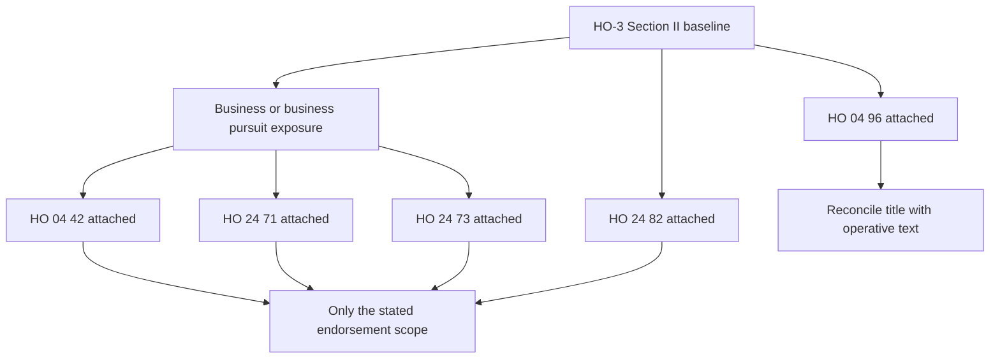

# Incidental Business, Farmers Liability, and Personal Injury

This page documents contract coverage under the 2024-03 HO-3 Special Form and the 2011-05 endorsements in scope. It is a coverage reference, not a statement that a risk is eligible to be written. An endorsement applies only when attached, and its terms control only to the extent that they modify the policy; the HO 24 71 preamble states this expressly and preserves unmodified policy provisions ([HO 24 71, W.0](repo://forms/HO/MS/HO-24-71/2011-05.md#L15-L29)).

## Coverage path

*The diagram shows the decision points documented below: an endorsement supplies only its stated contract grant, while the HO 04 96 source requires an attachment-level reconciliation because its title and operative text do not align.*

## HO-3 Section II baseline

The starting grant is Coverage E, Personal Liability: the insurer pays damages for which an insured is legally liable because of bodily injury or property damage caused by an occurrence, and defends a claim or suit seeking covered damages. Coverage applies to an occurrence at an insured location or to an insured's personal activities; it applies separately to each insured, but that separation does not increase the limit ([HO-3, II.E.1–II.E.6](repo://forms/HO/MS/HO-3/2024-03.md#L1023-L1035)).

Coverage F, Medical Payments to Others, pays necessary medical expenses for bodily injury caused by an accident without regard to the insured's legal liability. It covers a person on an insured location with permission and certain injuries away from the location arising from an insured-location condition or an insured's activities. Away-from-location animal injury is covered only when the animal is not used in connection with a business ([HO-3, II.F.1–II.F.8](repo://forms/HO/MS/HO-3/2024-03.md#L1073-L1089)). The medical-payments business exclusion preserves only activities ordinarily incidental to nonbusiness pursuits ([HO-3, II.F.19](repo://forms/HO/MS/HO-3/2024-03.md#L1101-L1113)).

The baseline Section II exclusions remove bodily injury and property damage arising from a business conducted by an insured, while preserving activities ordinarily incidental to nonbusiness pursuits. They separately exclude business pursuits, business-use vehicles and watercraft, and business-use animals ([HO-3, II.E.8 and II.X.6, II.X.13–II.X.17, II.X.34](repo://forms/HO/MS/HO-3/2024-03.md#L1037-L1049) ([HO-3, II.X.6 and II.X.13–II.X.17](repo://forms/HO/MS/HO-3/2024-03.md#L1121-L1149), [HO-3, II.X.34](repo://forms/HO/MS/HO-3/2024-03.md#L1181-L1185))). Those are contract exclusions; they are distinct from the underwriting rules described at the end of this page.

## HO 04 42 — Permitted Incidental Occupancies

**HO 04 42 acts first by changing the policy for the permitted incidental occupancy.** It provides coverage for an insured's bodily injury, property damage, or personal injury liability arising from an occurrence connected with an incidental occupancy at premises used with the residence. The occupancy must be subordinate to residential use, lawful, and must not materially change the premises' residential character ([HO 04 42, W.1–W.3](repo://forms/HO/MS/HO-04-42/2011-05.md#L35-L41)).

The endorsement pays covered bodily-injury and property-damage damages, and personal-injury damages caused by an offense committed during the policy period. It also provides a defense, but the defense ends when the applicable limit is paid or when no coverage applies ([HO 04 42, W.4–W.7](repo://forms/HO/MS/HO-04-42/2011-05.md#L43-L49)). It does not make a person an insured: the form uses the policy's insured status, and its definitions state that an insured is a person or organization qualifying under the policy ([HO 04 42, W.0 and W.8](repo://forms/HO/MS/HO-04-42/2011-05.md#L15-L33), [HO 04 42, W.8](repo://forms/HO/MS/HO-04-42/2011-05.md#L587-L595)).

The grant is narrow. Incidental occupancy away from the residence is excluded, as are professional, medical, health-care, day-care, product, completed-work, employer, aircraft, watercraft, motor-vehicle, off-road-equipment, pollution, disease, intentional-act, and criminal-act exposures ([HO 04 42, W.8–W.29](repo://forms/HO/MS/HO-04-42/2011-05.md#L51-L93)). The endorsement also excludes a business other than the permitted incidental occupancy and an occupancy conducted before permission begins, after it ends, away from the residence premises, or in violation of law ([HO 04 42, W.4–W.7](repo://forms/HO/MS/HO-04-42/2011-05.md#L257-L279)). Thus, it preserves a stated residentially subordinate activity; it is not blanket business liability.

The liability provision refers to the applicable limit but does not state a separate dollar amount in the cited liability grant. The later limit section is written for covered property, so the endorsement should not be read as creating a new dollar liability limit from that property wording ([HO 04 42, W.1–W.7](repo://forms/HO/MS/HO-04-42/2011-05.md#L35-L49), [HO 04 42, W.2.1–W.2.8](repo://forms/HO/MS/HO-04-42/2011-05.md#L135-L151)). Notice, forwarding suit papers, cooperation, inspection, preservation of evidence, and no voluntary payment or settlement without consent are material claim duties ([HO 04 42, W.30–W.38](repo://forms/HO/MS/HO-04-42/2011-05.md#L95-L111)).

## HO 24 71 — Business Pursuits

**HO 24 71 modifies the policy to cover the insured's business pursuit.** It pays personal-liability damages for bodily injury or property damage for which an insured is legally liable when the injury or damage arises out of that insured's business pursuit. It also provides medical-payments coverage for necessary medical expenses from bodily injury arising from that pursuit ([HO 24 71, W.1–W.2](repo://forms/HO/MS/HO-24-71/2011-05.md#L57-L62)). A business pursuit is a business activity that is continuous, regular, or undertaken with a profit motive, whether conducted from the residence or elsewhere ([HO 24 71, W.2](repo://forms/HO/MS/HO-24-71/2011-05.md#L897-L903)).

The endorsement covers the insured's business-use premises, the insured's acts or omissions within the pursuit, and acts or omissions of a person for whom the insured is legally responsible. It does not make any other person an insured and does not cover a pursuit conducted by a non-insured ([HO 24 71, W.3–W.6](repo://forms/HO/MS/HO-24-71/2011-05.md#L63-L69), [HO 24 71, W.49](repo://forms/HO/MS/HO-24-71/2011-05.md#L151-L161)). The form's grant is for bodily injury, property damage, and medical payments; the presence of “personal injury” in its definitions and exclusions is not a separate personal-injury grant ([HO 24 71, W.1–W.2 and W.46](repo://forms/HO/MS/HO-24-71/2011-05.md#L57-L62) ([HO 24 71, W.46–W.48](repo://forms/HO/MS/HO-24-71/2011-05.md#L147-L155))).

The business-pursuit liability limit is **$100,000 for the sum of all damages** arising out of business pursuits. It is shared regardless of the number of insureds, claimants, claims, suits, or occurrences; payments reduce the remaining amount, defense costs do not reduce it, and the duty to defend ends after payment exhausts it ([HO 24 71, W.2.1–W.2.12](repo://forms/HO/MS/HO-24-71/2011-05.md#L163-L187)). The endorsement also says its coverage is subject to the personal-liability and medical-payments limits and does not increase those limits ([HO 24 71, W.48](repo://forms/HO/MS/HO-24-71/2011-05.md#L151-L155)). Read together, the stated $100,000 cap is the business-pursuit liability cap; the form does not state a new medical-payments dollar amount in this section.

Contract scope remains constrained by exclusions for professional services, products and completed work, employer and workers-compensation obligations, owned or controlled property, vehicles and watercraft, pollution, criminal or intentional acts, and other listed hazards ([HO 24 71, W.4.1–W.4.67](repo://forms/HO/MS/HO-24-71/2011-05.md#L305-L439)). The insured must promptly report an occurrence, claim, suit, or demand, forward legal papers, cooperate, preserve evidence, and obtain consent before voluntarily paying, assuming an obligation, or settling ([HO 24 71, W.5.1–W.5.17](repo://forms/HO/MS/HO-24-71/2011-05.md#L441-L477)).

## HO 24 73 — Farmers Personal Liability

**HO 24 73 modifies the policy for covered farming and farm premises.** It treats you, resident related household members, persons in their care, and a person or organization acting within the scope of duties performed for you in connection with covered farming as insureds ([HO 24 73, W.1–W.2](repo://forms/HO/MS/HO-24-73/2011-05.md#L41-L47)). Farm premises are land, structures, and appurtenant grounds used in farming; farming includes cultivating land, raising or caring for animals, and producing agricultural products ([HO 24 73, W.5 and Definitions W.8–W.9](repo://forms/HO/MS/HO-24-73/2011-05.md#L49-L53) ([HO 24 73, W.8–W.9](repo://forms/HO/MS/HO-24-73/2011-05.md#L629-L633)).

The endorsement pays personal-liability damages for bodily injury or property damage caused by an occurrence arising from covered personal activities, farming, or ownership, maintenance, or use of farm premises. It also pays necessary medical expenses for bodily injury caused by an accident arising from those same sources, including permitted medical payments for persons on farm premises and certain persons away from an insured location ([HO 24 73, W.7–W.16](repo://forms/HO/MS/HO-24-73/2011-05.md#L53-L73)). Although “personal injury” appears in the claim and suit definition, the operative personal-liability grant is for bodily injury and property damage, not a separate personal-injury coverage ([HO 24 73, W.6–W.7](repo://forms/HO/MS/HO-24-73/2011-05.md#L51-L57)).

The applicable personal-liability and medical-payments limits remain controlling. The endorsement pays only up to the applicable limit, regardless of the number of insureds, claimants, claims, or suits, and the defense ends after the applicable limit is exhausted by judgments or settlements ([HO 24 73, W.8–W.11](repo://forms/HO/MS/HO-24-73/2011-05.md#L55-L65)). No separate farm dollar limit is stated in the cited coverage grant. The business exclusion, professional-services exclusion, employee and workers-compensation exclusions, and animal-used-in-business exclusion remain express contract constraints ([HO 24 73, W.21–W.26](repo://forms/HO/MS/HO-24-73/2011-05.md#L79-L97)).

Farm operations carry additional duties: maintain farm structures and animal controls, use care with agricultural materials and machinery, keep records, report farm-operation claims, and promptly report material changes, expansion, discontinuance, or transfer of control of the farming operation ([HO 24 73, W.7–W.22](repo://forms/HO/MS/HO-24-73/2011-05.md#L491-L521), [HO 24 73, W.28–W.31](repo://forms/HO/MS/HO-24-73/2011-05.md#L533-L539)). These are endorsement conditions and risk controls within the contract; they do not turn every farming or animal exposure into covered liability.

## HO 24 82 — Personal Injury Coverage

**HO 24 82 modifies the policy by providing a separate Personal Injury Coverage.** The insured remains the person who qualifies as an insured under the policy; the endorsement does not expand insured status ([HO 24 82, W.0](repo://forms/HO/MS/HO-24-82/2011-05.md#L15-L25)). It pays damages for which an insured is legally responsible when personal injury arises from an offense committed during the policy period, and it provides a defense even when allegations are groundless, false, or fraudulent, subject to the coverage grant and exclusions ([HO 24 82, W.1.1–W.1.7](repo://forms/HO/MS/HO-24-82/2011-05.md#L47-L63)).

Covered personal injury includes false arrest, detention or imprisonment, malicious prosecution, wrongful eviction or entry, invasion of private occupancy, and oral or written publication that slanders, libels, defames, or violates privacy rights ([HO 24 82, W.1.1–W.1.2](repo://forms/HO/MS/HO-24-82/2011-05.md#L49-L53)). The offense must arise from ownership, maintenance, or use of a covered residence or from personal activities ([HO 24 82, W.1.6](repo://forms/HO/MS/HO-24-82/2011-05.md#L57-L63)).

The endorsement does not cover personal injury arising from business pursuits or business activities conducted from an insured location. Its narrower exception is for activities ordinarily incidental to nonbusiness pursuits, not for a general business operation ([HO 24 82, W.1.15–W.1.16](repo://forms/HO/MS/HO-24-82/2011-05.md#L75-L79)). It also excludes, among other things, knowing rights violations, knowingly false or pre-policy publications, criminal acts, professional services, and specified organizational, employment, rental, and animal-business exposures ([HO 24 82, W.1.9–W.1.14](repo://forms/HO/MS/HO-24-82/2011-05.md#L65-L75), [HO 24 82, W.1.31–W.1.39](repo://forms/HO/MS/HO-24-82/2011-05.md#L109-L127), [HO 24 82, W.1.59–W.1.61](repo://forms/HO/MS/HO-24-82/2011-05.md#L161-L171)).

The applicable Personal Injury Limit of Liability is one shared maximum for all covered damages from an occurrence, not a separate limit per insured, claimant, claim, or suit. Payments reduce the available limit, defense and investigation expenses do not reduce it, and the duty to defend ends when judgments or settlements exhaust it ([HO 24 82, W.2.1–W.2.9 and W.2.27–W.2.37](repo://forms/HO/MS/HO-24-82/2011-05.md#L205-L223), [HO 24 82, W.2.27–W.2.37](repo://forms/HO/MS/HO-24-82/2011-05.md#L257-L279)). The endorsement expressly says its attachment does not increase the limits of liability ([HO 24 82, W.0](repo://forms/HO/MS/HO-24-82/2011-05.md#L41-L45)).

## HO 04 96 — No Section II Liability Coverages

**HO 04 96 is titled “No Section II — Liability Coverages,” but the supplied form text has a material internal conflict.** Its title identifies a no-Section-II form ([HO 04 96, title](repo://forms/HO/MS/HO-04-96/2011-05.md#L1-L8)), while its operative W.1 provisions expressly say that the insurer provides personal liability coverage for bodily injury or property damage and medical-payments coverage, including defense and activities of an insured ([HO 04 96, W.1.1–W.1.12](repo://forms/HO/MS/HO-04-96/2011-05.md#L57-L81)). The same text later supplies a general limit-of-liability section rather than an operative deletion of Section II ([HO 04 96, W.2.1–W.2.29](repo://forms/HO/MS/HO-04-96/2011-05.md#L199-L257)).

Accordingly, this page does not infer a Section II deletion from the title alone, and it does not override the title with the contradictory grant. On an issued policy, reconcile the attached form, declarations, and controlling policy text before concluding whether Section II is available. If HO 04 96 is intended to remove Section II, the operative issued form must establish that result; the supplied transcription does not contain such a deletion clause.

## Contract coverage versus underwriting controls

The endorsements answer what the contract covers after attachment. They do not supersede internal risk-selection rules. Texas appetite guidance allows binding only when business use is not a principal or material commercial use and agricultural activity does not materially alter the residential character; it separately identifies liability-appropriate premises activities and animal exposure as underwriting questions ([Texas homeowners appetite, H.1.19–H.1.23 and H.1.28–H.1.30](repo://guidelines/appetite/tx-homeowners.md#L97-L119), [Texas homeowners appetite, H.1.43–H.1.46](repo://guidelines/appetite/tx-homeowners.md#L143-L151)).

The underwriting manual is stricter operationally: it directs referral of business operations, agricultural activity, livestock, and aggressive-animal exposure ([Underwriting Manual, 120.R–120.U](repo://manuals/underwriting/manual.md#L829-L845)); it also directs referral of premises used for business operations, professional services, client meetings, production, farming, animal keeping, crop activity, or agricultural equipment ([Underwriting Manual, 150.AE–150.AG](repo://manuals/underwriting/manual.md#L1801-L1817)). Those instructions are internal appetite and referral controls, not additional policy exclusions and not proof that an attached endorsement grants coverage.

### Claim-handling checklist

1. Identify the attached endorsement and the insured against whom the claim is made. None of these endorsements, by itself, makes a non-insured person an insured.
2. Classify the alleged harm: bodily injury, property damage, medical payments, or personal injury. Do not treat a definition of “personal injury” in a form as a grant of personal-injury coverage.
3. Match the activity and location to the endorsement's grant, then apply its specific exclusions and the unchanged Section II exclusions.
4. Apply the shared applicable limit. More insureds, claimants, theories, locations, or suits do not create another limit; exhaustion can end the defense duty.
5. Verify notice, suit-paper forwarding, cooperation, records, inspection, evidence preservation, and consent duties. Business-pursuit and farm forms add activity-specific record and change-reporting duties ([HO 24 71, W.5](repo://forms/HO/MS/HO-24-71/2011-05.md#L441-L477), [HO 24 73, W.5–W.7 and W.21–W.28](repo://forms/HO/MS/HO-24-73/2011-05.md#L487-L533), [HO 24 82, W.1.70–W.1.78](repo://forms/HO/MS/HO-24-82/2011-05.md#L187-L203)).
